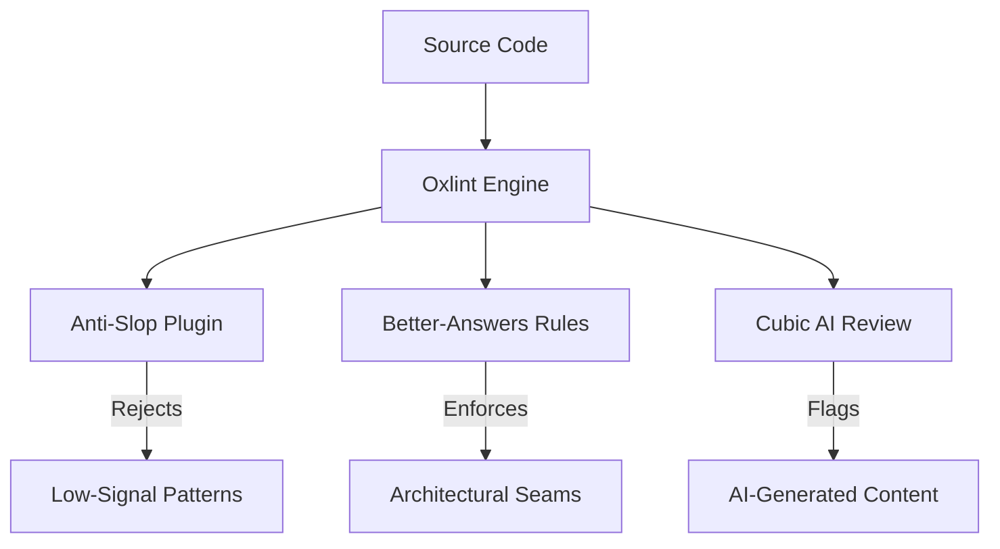
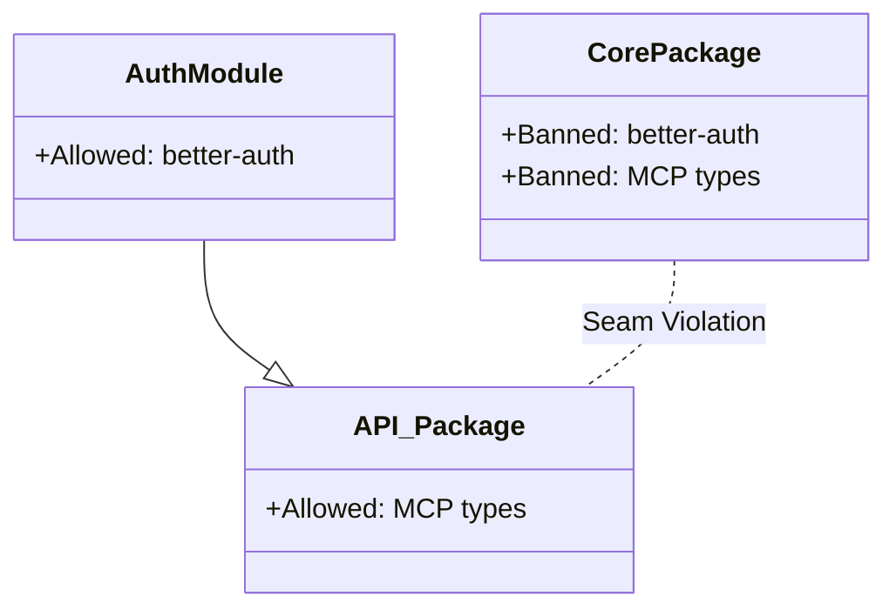

<details>
<summary>Relevant source files</summary>

The following files were used as context for generating this wiki page:

- [apps/api/tools/anti-slop/index.ts](apps/api/tools/anti-slop/index.ts)
- [apps/api/tools/lint-rules/index.ts](apps/api/tools/lint-rules/index.ts)
- [cubic.yaml](cubic.yaml)
- [CODING_RULES.md](CODING_RULES.md)
- [apps/api/tests/lint-rules.test.ts](apps/api/tests/lint-rules.test.ts)
- [package.json](package.json)
</details>

# Anti-Slop & Custom Linting Rules

Anti-Slop and Custom Linting Rules maintain code quality and architectural integrity by enforcing strict technical constraints. The project utilizes `oxlint` as its primary linting engine to execute these rules across the TypeScript and Python workspaces. These rules serve to reject low-signal implementation patterns, prevent AI-generated "slop," and ensure adherence to the project's [Coding Rules](#coding-rules).

The linting system is divided into two primary categories: `anti-slop` rules, which target generic hygiene and low-evidence patterns, and `better-answers` rules, which enforce specific architectural decisions defined in the project's ADRs (Architecture Decision Records) and [Coding Rules](CODING_RULES.md).

Sources: [apps/api/tools/anti-slop/index.ts:25-26](apps/api/tools/anti-slop/index.ts#L25-L26), [apps/api/tools/lint-rules/index.ts:7-11](apps/api/tools/lint-rules/index.ts#L7-L11), [package.json:9-11](package.json#L9-L11)

## System Architecture

The linting architecture leverages `oxlint` for high-performance static analysis. Custom rules are implemented as TypeScript modules and exposed through `eslintCompatPlugin`. The configuration resides in `.oxlintrc.json`, while high-level AI review policies are defined in `cubic.yaml`.

### Linting Flow

This diagram illustrates how code changes are validated against the various rule tiers.



The `oxlint` engine processes source code through custom plugins to identify violations before code reaches production.
Sources: [apps/api/tools/anti-slop/index.ts](apps/api/tools/anti-slop/index.ts), [apps/api/tools/lint-rules/index.ts](apps/api/tools/lint-rules/index.ts), [cubic.yaml:89-106](cubic.yaml#L89-L106)

## Anti-Slop Rules

The `anti-slop` plugin rejects implementation patterns that typically indicate low-quality output or unnecessary complexity. These rules focus on type safety, mocking, and preventing "magic" mechanisms.

### Key Anti-Slop Identifiers
| Rule Name | Purpose |
| :--- | :--- |
| `no-module-mocking` | Bans `vi.mock` or `jest.mock` for internal modules. |
| `no-chained-type-assertions` | Prevents multiple sequential `as` assertions. |
| `require-safety-comment` | Mandates comments explaining why a type assertion is safe. |
| `no-runtime-typeof` | Rejects usage of `typeof` at runtime for type checking. |
| `no-unknown-parameters` | Flags functions using the `unknown` type for parameters. |

Sources: [apps/api/tools/anti-slop/index.ts:7-21](apps/api/tools/anti-slop/index.ts#L7-L21), [CODING_RULES.md:88-91](CODING_RULES.md#L88-L91)

## Better-Answers Custom Rules

The `better-answers` plugin enforces repository-specific constraints derived from ADRs and the project's "constitution." These rules primarily protect architectural seams and ensure proper data scoping.

### Architectural Seam Enforcement
Custom linting ensures that specific libraries do not leak across module boundaries. For example, `[DESIGN5]` dictates that the identity provider (Better Auth) remains behind its seam. The linting rules refuse `better-auth` imports outside of the `apps/api/src/auth` module.



The diagram shows how lint rules prevent restricted imports from crossing defined module seams.
Sources: [apps/api/tests/lint-rules.test.ts:74-95](apps/api/tests/lint-rules.test.ts#L74-L95), [CODING_RULES.md:65-69](CODING_RULES.md#L65-L69)

### Model Context Protocol (MCP) Constraints
Rules ensure that MCP entries are correctly annotated and do not leak internal workspace identifiers to the protocol surface:
*  **Annotations Requirement:** Every MCP entry must carry `annotations` (e.g., `readOnlyHint`).
*  **Workspace Scoping:** MCP entries are prohibited from taking `workspaceId` or `tenant_id` as input arguments, as these must be derived from the session.

Sources: [apps/api/tests/lint-rules.test.ts:98-154](apps/api/tests/lint-rules.test.ts#L98-L154), [apps/api/tools/lint-rules/index.ts:14-18](apps/api/tools/lint-rules/index.ts#L14-L18)

## AI Slop Detection (Cubic)

The project uses `cubic.yaml` to configure AI-based review rules. These rules explicitly flag "AI Slop," which includes placeholder text, fabricated changes, or code that restates obvious logic in comments.

### Cubic Review Criteria
*  **Fabricated Changes:** Flagging claims in documentation or comments that the code does not actually implement.
*  **Mechanical Logic:** Flagging narrating comments that restate code behavior instead of explaining intent.
*  **Structural Simplification:** Cubic is configured to prioritize structural simplification over cosmetic "nits."

Sources: [cubic.yaml:63-86](cubic.yaml#L63-L86), [cubic.yaml:89-106](cubic.yaml#L89-L106)

## Implementation Details

Custom rules are registered via `eslintCompatPlugin`. The following snippet illustrates the registration of MCP-specific rules:

```typescript
// apps/api/tools/lint-rules/index.ts:13-19
const betterAnswersPlugin = eslintCompatPlugin({
  meta: { name: "better-answers" },
  rules: {
    "mcp-entry-annotations": mcpEntryAnnotationsRule,
    "mcp-entry-no-workspace-argument": mcpEntryNoWorkspaceArgumentRule,
  },
});
```

These rules are tested by running `oxlint` against throwaway directory trees in `apps/api/tests/lint-rules.test.ts` to verify both silent and firing states.
Sources: [apps/api/tools/lint-rules/index.ts:13-19](apps/api/tools/lint-rules/index.ts#L13-L19), [apps/api/tests/lint-rules.test.ts:17-57](apps/api/tests/lint-rules.test.ts#L17-L57)

## Summary

Anti-Slop and Custom Linting Rules form a multi-layered defense against code degradation. By combining static analysis via `oxlint` with AI-driven structural reviews through `cubic`, the system ensures that every change adheres to the project's strict maintainability and security standards. Rules are not just conventions but are enforced through automated checks that fail the build if architectural seams or safety invariants are violated.
