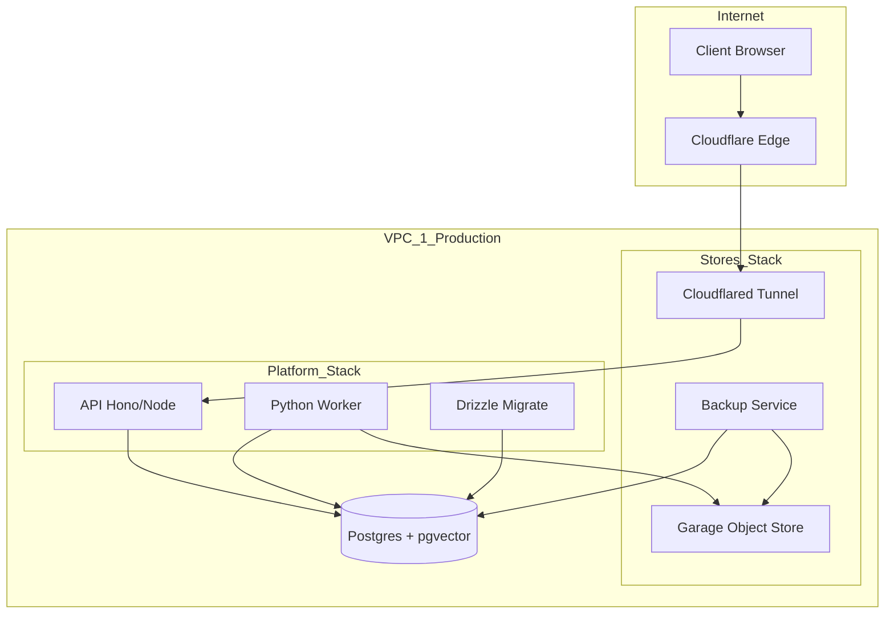

<details>
<summary>Relevant source files</summary>

The following files were used as context for generating this wiki page:

- [deploy/platform.compose.yaml](deploy/platform.compose.yaml)
- [deploy/stores.compose.yaml](deploy/stores.compose.yaml)
- [deploy/wizard-41.sh](deploy/wizard-41.sh)
- [AGENTS.md](AGENTS.md)
- [CODING_RULES.md](CODING_RULES.md)
</details>

# Docker & Infrastructure Compose Files

Better Answers utilizes a dual-stack Docker Compose architecture to manage infrastructure and application services. This separation allows for high-frequency application releases while maintaining stable data stores. The infrastructure consists of two primary tiers: the **Stores Stack**, which manages long-lived data services, and the **Platform Stack**, which handles the core application logic and worker processes.

The deployment model targets UK SMBs, leveraging two IONOS VPS instances (VPC 1 and VPC 2) for production and maintenance activities. Infrastructure management is facilitated by Coolify, which handles resource deployment, backups, and health monitoring.

## Infrastructure Architecture

The system splits services into two distinct Compose resources to avoid unnecessary restarts of data stores during application updates. VPC 1 hosts the production environment, while VPC 2 serves as the control plane for Coolify and a target for backup restoration drills.

### Deployment Tiers

| Stack | Purpose | Deployment Frequency | Key Services |
| :--- | :--- | :--- | :--- |
| **Stores Stack** | Persistent data and networking | Rare (Store upgrades) | Garage (S3), Cloudflared, Backup |
| **Platform Stack** | Application logic and processing | Frequent (Every release) | Migrate, API, Worker |

Sources: [deploy/stores.compose.yaml:3-8](deploy/stores.compose.yaml#L3-L8), [deploy/platform.compose.yaml:1-4](deploy/platform.compose.yaml#L1-L4), [deploy/wizard-41.sh:220-224](deploy/wizard-41.sh#L220-L224)

### Data Flow and Service Relationships

The following diagram illustrates the relationship between the application components and the underlying infrastructure services.



The diagram shows how external traffic enters through Cloudflare and is routed via a secure tunnel to the internal API. Services interact with a central Postgres database and an S3-compatible object store.
Sources: [deploy/stores.compose.yaml:69-72](deploy/stores.compose.yaml#L69-L72), [deploy/platform.compose.yaml:34-40](deploy/platform.compose.yaml#L34-L40), [deploy/platform.compose.yaml:64-70](deploy/platform.compose.yaml#L64-L70)

## Stores Stack Configuration

The `stores.compose.yaml` file defines services that persist through application releases. It includes an initialization service to ensure correct directory ownership on the host filesystem.

### Persistent Services

*  **Garage (objectstore):** An S3-compatible single-node object store. It handles internal file storage for the application and worker tiers.
*  **Cloudflared:** Manages the secure tunnel between the production server and Cloudflare, handling ingress for hostnames like `app`, `mcp`, and `agent`.
*  **Backup:** A specialized service that executes hourly Postgres dumps, nightly object-store mirrors, and git repository bundles. It uses `age` for encryption before pushing to off-host buckets.
*  **Init:** A one-shot service that creates and sets permissions for bind-mount directories under `/data/`.

Sources: [deploy/stores.compose.yaml:45-50](deploy/stores.compose.yaml#L45-L50), [deploy/stores.compose.yaml:73-77](deploy/stores.compose.yaml#L73-L77), [deploy/stores.compose.yaml:83-88](deploy/stores.compose.yaml#L83-L88), [deploy/stores.compose.yaml:35-42](deploy/stores.compose.yaml#L35-L42)

### Networking and Security

Services join a Coolify-managed network. The API tier is reached through the tunnel, which avoids exposing ports directly to the public internet. Access keys for the object store are managed via environment variables like `OBJECTSTORE_ROOT_KEY` and `OBJECTSTORE_ROOT_SECRET`.

Sources: [deploy/stores.compose.yaml:12-14](deploy/stores.compose.yaml#L12-L14), [deploy/platform.compose.yaml:19-22](deploy/platform.compose.yaml#L19-L22)

## Platform Stack Configuration

The `platform.compose.yaml` file manages the core business logic. It implements a strict deployment order: migration must complete successfully before the API or worker services start.

### Application Services

1.  **Migrate:** Runs Drizzle migrations to update the database schema and graph tables. It is marked with `coolify.exclude_from_hc` to prevent health check failures after the one-shot execution completes.
2.  **API:** A Hono-based Node.js service providing tRPC, MCP, and OpenAPI endpoints. It mounts the git store directory to write bare repositories.
3.  **Worker:** A Python-based service responsible for knowledge processing, indexing, and enrichment. It utilizes local LMDB storage for per-binding personal data.

Sources: [deploy/platform.compose.yaml:27-32](deploy/platform.compose.yaml#L27-L32), [deploy/platform.compose.yaml:34-45](deploy/platform.compose.yaml#L34-L45), [deploy/platform.compose.yaml:64-70](deploy/platform.compose.yaml#L64-L70)

### Resource Management

The Worker service is subject to specific resource limits due to the 4 GB RAM constraint on production VPS instances.

```yaml
worker:
  deploy:
    resources:
      limits:
        memory: 1536m
```

*  **Memory Cap:** Limited to 1.5 GB to allow room for Postgres and other services.
*  **Concurrency:** Limited to one index run at a time (`MAX_CONCURRENT_RUNS: "1"`) to prevent resource exhaustion.

Sources: [deploy/platform.compose.yaml:81-87](deploy/platform.compose.yaml#L81-L87), [deploy/platform.compose.yaml:72-73](deploy/platform.compose.yaml#L72-L73)

## Deployment Environment and Variables

Deployment relies on environment variables for sensitive configuration and image pinning.

### Image Pinning and Releases
The project enforces deployment by digest to prevent `:latest` image collisions. The release workflow patches `API_IMAGE_DIGEST` and `WORKER_IMAGE_DIGEST` before deployment.

Sources: [deploy/platform.compose.yaml:6-9](deploy/platform.compose.yaml#L6-L9), [CODING_RULES.md:323-326](CODING_RULES.md#L323-L326)

### Key Configuration Variables

| Variable | Description | Source File |
| :--- | :--- | :--- |
| `DATABASE_URL` | Postgres connection string for the app | `platform.compose.yaml:19` |
| `KEK` | Key Encryption Key for sensitive data | `platform.compose.yaml:47` |
| `PUBLIC_URL` | The HTTPS origin for the auth server | `platform.compose.yaml:50` |
| `BACKUP_AGE_RECIPIENT` | Public key for age-encrypted backups | `stores.compose.yaml:94` |
| `TUNNEL_TOKEN` | Credential for the Cloudflare tunnel | `stores.compose.yaml:80` |

## Infrastructure Maintenance

Maintenance is guided by a wizard script (`wizard-41.sh`) and standard repository rules.

### Setup and Provisioning
The `wizard-41.sh` script automates the initial environment setup, including:
1.  **Escrow Vault Creation:** Establishing a password manager vault for critical deployment secrets (e.g., KEK, APP_KEY).
2.  **VPS Preparation:** Configuring firewall rules and directory structures on VPC 1 and VPC 2.
3.  **Bucket Lifecycle:** Configuring object lock and versioning policies on S3 buckets for backups.

Sources: [deploy/wizard-41.sh:195-200](deploy/wizard-41.sh#L195-L200), [deploy/wizard-41.sh:230-235](deploy/wizard-41.sh#L230-L235), [deploy/wizard-41.sh:255-260](deploy/wizard-41.sh#L255-L260)

### Security Constraints
*  **RLS (Row Level Security):** Default-deny policies on Postgres tables ensure data isolation between workspaces.
*  **Principals:** Every data access call requires a `Principal` (workspace and user identity).
*  **Secrets:** Secrets are never committed to the repository and are provided through Coolify environment settings or the `SECRETS.md` manifest.

Sources: [CODING_RULES.md:43-48](CODING_RULES.md#L43-L48), [CODING_RULES.md:189-192](CODING_RULES.md#L189-L192), [deploy/platform.compose.yaml:55-58](deploy/platform.compose.yaml#L55-L58)

Better Answers' infrastructure strategy ensures a robust, secure environment suitable for UK SMB requirements while maintaining a small footprint on cost-effective VPS hardware. Separating concerns between the stores and platform stacks minimizes downtime and risk during continuous deployment cycles.
