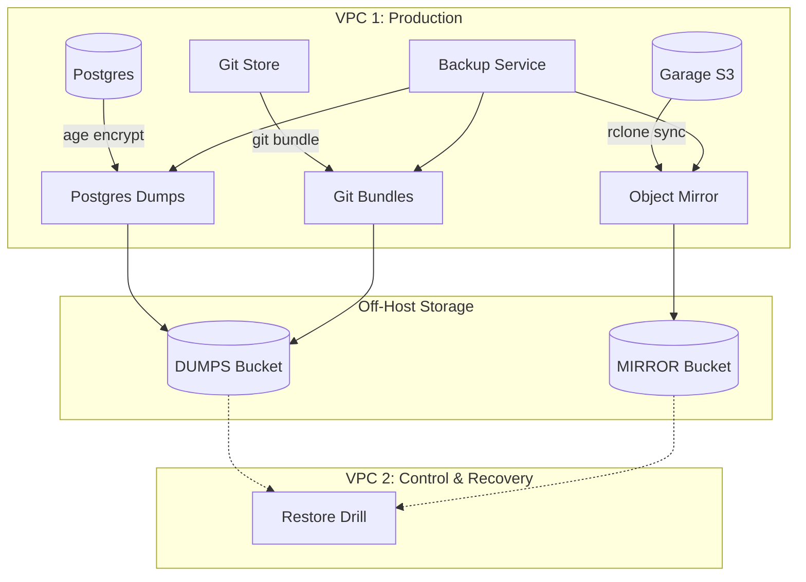
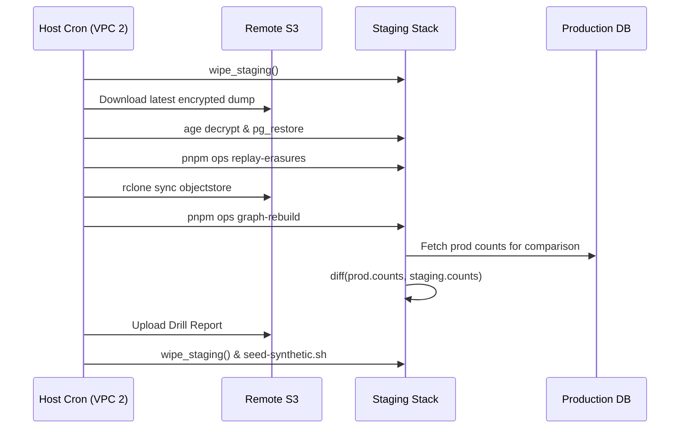

Relevant source files

The following files were used as context for generating this wiki page:

- [deploy/backup.sh](deploy/backup.sh)
- [deploy/restore-drill.sh](deploy/restore-drill.sh)
- [deploy/wizard-41.sh](deploy/wizard-41.sh)
- [deploy/stores.compose.yaml](deploy/stores.compose.yaml)
- [CODING_RULES.md](CODING_RULES.md)
- [AGENTS.md](AGENTS.md)

# Backup & Disaster Recovery Scripts

Backup & Disaster Recovery Scripts manage the automated preservation and restoration of platform data across multiple storage tiers. The system ensures data durability by exporting Postgres dumps, object store mirrors, and git bundles to off-host S3-compatible buckets. A monthly automated drill validates the recovery process by restoring the entire estate onto a separate staging environment.

The architecture relies on a multi-VPC strategy where Production lives on VPC 1 and the control plane, git mirror, and restore targets live on VPC 2. Scripts utilize `rclone` for bucket synchronization and `age` for asymmetrical encryption of sensitive database dumps.

Sources: [deploy/wizard-41.sh:220-230](deploy/wizard-41.sh#L220-L230), [deploy/restore-drill.sh:1-10](deploy/restore-drill.sh#L1-L10), [AGENTS.md:15-20](AGENTS.md#L15-L20)

## Architecture and Data Flow

The backup system operates primarily within the `better-answers-stores` stack. A dedicated `backup` container runs scheduled jobs that interact with the Postgres database, local git repositories, and the internal Garage object store. 

### Backup Data Flow

The following diagram illustrates the flow of data from primary stores to off-host backup buckets:

This diagram shows the transition of encrypted and bundled data from production services to remote S3 storage and its eventual use in recovery drills.
Sources: [deploy/stores.compose.yaml:80-120](deploy/stores.compose.yaml#L80-L120), [deploy/restore-drill.sh:45-70](deploy/restore-drill.sh#L45-L70)

## Backup Implementation (`backup.sh`)

The `backup.sh` script (executed via cron in the `backup` container) performs granular data exports. Database dumps are encrypted using a public `age` key, ensuring that the private identity key is never stored on the production server.

### Backup Tiers
The system maintains a specific lifecycle for Postgres dumps in the `DUMPS` bucket:
*  **Hourly**: Retained for 48 hours.
*  **Daily**: Retained for 30 days.
*  **Weekly**: Retained for 8 weeks.
*  **Monthly**: Retained for 6 months.

Sources: [deploy/wizard-41.sh:252-258](deploy/wizard-41.sh#L252-L258), [deploy/restore-drill.sh:98-100](deploy/restore-drill.sh#L98-L100)

### Key Functions and Configuration
| Component | Implementation Detail | Source |
| :--- | :--- | :--- |
| **Encryption** | `age -e -r $BACKUP_AGE_RECIPIENT` | [deploy/stores.compose.yaml:104](deploy/stores.compose.yaml#L104) |
| **S3 Sync** | `rclone sync` for object store; `rclone copyto` for dumps | [deploy/stores.compose.yaml:105-115](deploy/stores.compose.yaml#L105-L115) |
| **Git Backup** | `git bundle` per bare repository; `git push --mirror` to VPC 2 | [deploy/stores.compose.yaml:122-125](deploy/stores.compose.yaml#L122-L125) |
| **Monitoring** | Healthchecks.io pings with outcome and size | [CODING_RULES.md:395-400](CODING_RULES.md#L395-L400) |

## Recovery Drill (`restore-drill.sh`)

The monthly restore drill runs from host cron on VPC 2. It brings up a staging environment from scratch, replaying the recovery order to validate data integrity and calculate Recovery Time Objective (RTO).

### Recovery Sequence
1.  **Wipe Staging**: Removes all existing data from staging Postgres, object store bind mounts, and git directories.
2.  **Restore Postgres**: Fetches the latest daily dump from S3, decrypts it using the `age` identity file, and restores via `pg_restore`.
3.  **Replay Erasures**: Replays erasure requests completed since the dump was taken to satisfy ADR 0020.
4.  **Sync Object Store**: Mirrors data back from the `MIRROR` bucket to the staging object store.
5.  **Rebuild Graph**: Triggers `graph-rebuild` and `graph-sweep` via the API worker.
6.  **Verify Integrity**: Performs a `graph-counts` diff against production's latest stamped run.

Sources: [deploy/restore-drill.sh:30-85](deploy/restore-drill.sh#L30-L85), [CODING_RULES.md:400-405](CODING_RULES.md#L400-L405)

### Recovery Drill Logic

The sequence ensures that staging is initialized with fresh production data and sanitized immediately after verification.
Sources: [deploy/restore-drill.sh:30-110](deploy/restore-drill.sh#L30-L110)

## Security and Escrow

Security rules mandate a "Principal on every call" and strict secret management. Four critical secrets are stored in an external **Escrow Vault** to prevent total loss if VPC 2 is compromised:
1.  Coolify `APP_KEY`
2.  `KEK` (Key Encryption Key)
3.  Backup bucket `ADMIN` credentials
4.  Tunnel Token

Sources: [deploy/wizard-41.sh:195-205](deploy/wizard-41.sh#L195-L205), [CODING_RULES.md:280-290](CODING_RULES.md#L280-L290)

### Credential Matrix
| Credential Type | Permissions | Usage |
| :--- | :--- | :--- |
| **WRITE-AND-LIST** | PutObject, ListBucket, GetObject | `backup.sh` on Production |
| **READ** | ListBucket, GetObject | `restore-drill.sh` on VPC 2 |
| **ADMIN** | Delete, Lifecycle, Bypass-Governance | Escrow only |

Sources: [deploy/wizard-41.sh:259-265](deploy/wizard-41.sh#L259-L265)

## Operational Constraints

*  **Row Level Security (RLS)**: Every tenant table must use `FORCE ROW LEVEL SECURITY`. Backup dumps include these policies, and drills verify that RLS cannot be bypassed during direct partition reads.
*  **Staging Sanitization**: Staging environments must only hold synthetic data outside of an active restore drill. The `on_exit` trap in `restore-drill.sh` ensures staging is wiped even if the drill fails.
*  **RPO/RTO**: The drill records the Recovery Point Objective (RPO) based on dump age and Recovery Time Objective (RTO) for the full restoration.

Sources: [CODING_RULES.md:65-75](CODING_RULES.md#L65-L75), [deploy/restore-drill.sh:36-42](deploy/restore-drill.sh#L36-L42), [deploy/restore-drill.sh:110-115](deploy/restore-drill.sh#L110-L115)
