# Components — `apps/api`

Level 3. The one TypeScript deployable is transports only (ADR 0029). `server.ts`'s `createServer` mounts them in order behind the hostname fence, and every mount calls `packages/core` through a slice's face. Beside the mounts, `main.ts` starts two schedules in the same process — the head check and the daily sweep pass — and `ops.ts` is a second entry, `pnpm ops`, over the same doors.

```mermaid
C4Component
  title Component diagram — apps/api, the transports over packages/core

  System_Ext(callers, "The SPA and Claude", "tRPC from the browser; MCP from Claude and Claude Code")
  System_Ext(email, "SMTP", "Sign-in codes")
  System_Ext(healthchecks, "healthchecks.io", "The scheduler and sweeps checks")
  ContainerDb(postgres, "Postgres", "RLS", "The identity set and every tenant table")
  ContainerDb(stores, "Git store and object store", "bare repositories; Garage", "The bundle per workspace; the landed copies")

  Container_Boundary(api, "apps/api") {
    Component(main, "main.ts, config.ts and doors.ts", "bootstrap", "Reads the env once; doors.ts, the one composition root, opens the Postgres, git and object doors and one Clock for main.ts, ops.ts and the api harness alike")
    Component(server, "server.ts", "createServer, Hono", "Mounts in order: the fence, /health naming the image digest, Better Auth's routes, /mcp, tRPC, the SPA's assets, then Better Auth's handler and the shell")
    Component(fence, "ingress/hostnames.ts", "Hono middleware", "One list of surface to hostname role to reason; refuses a path outside its hostname's surface before any counter, session or body")
    Component(limits, "ingress/limits.ts", "per-IP counters", "The flood limits on the credential-shaped paths, as rows")
    Component(auth, "auth/", "Better Auth in-process", "The identity provider and authorization server: email code, the organisation plugin as the workspace, /oauth2/*, discovery, /jwks, consent, CIMD fetch; Microsoft at P1")
    Component(mcp, "mcp/surface.ts and entries/", "MCP SDK v2 behind one fetch-shaped seam", "The token verifier over the JWKS, then four entries: find, ask, open, give_feedback")
    Component(trpc, "trpc/", "tRPC on Hono", "router, mount, base with three roads — query, mutation with the held read, own-transaction carrying the doors; upload.ts reads the descriptor from headers")
    Component(spa, "ingress/spa.ts", "static files", "The SPA's hashed bundles and the shell on app., answered after Better Auth declines")
    Component(ops, "ops.ts and ops/", "runOps", "pnpm ops, twelve commands: replay-erasures, smoke, dump-grep, provision-workspace, add-member, graph-rebuild, graph-sweep, graph-counts, reconcile-watermark, object-store-orphans, erasure-rehearsal, import-bundle")
    Component(reconciler, "reconciler.ts", "setInterval, 30 s", "The head check: every workspace's head against its watermark, missed commits replayed; reports a stop, never skips")
    Component(sweeps, "sweeps.ts", "setTimeout 10 min, then every 24 h", "The sweep pass: the upload sweep, list-only until UPLOAD_SWEEP says remove, and the graph sweep")
    Component(ping, "dead-man-ping.ts", "fetch, 10 s timeout", "POSTs ok, or fail, with counts and never a path, key or error")
    Component(migrate, "migrate.ts", "Drizzle", "The one-shot the platform stack runs ahead of api, as the owner role")
    Component(core, "packages/core", "library", "The slices and the four doors; see c4-components-core.md")
  }

  Rel(callers, fence, "Every request enters through", "HTTPS")
  Rel(main, server, "Listens on :3000 with what createServer builds")
  Rel(main, reconciler, "Starts")
  Rel(main, sweeps, "Starts")
  Rel(fence, server, "Passes what its hostname allows on to the mounts of")
  Rel(server, auth, "Mounts sign-in, consent, /oauth2/*, discovery, /jwks")
  Rel(server, mcp, "Mounts /mcp")
  Rel(server, trpc, "Mounts the procedures")
  Rel(server, spa, "Mounts the assets and the shell, last")

  Rel(auth, limits, "Counts per IP through")
  Rel(mcp, limits, "Counts per IP through")
  Rel(trpc, limits, "Counts per IP through")
  Rel(mcp, auth, "Verifies bearers against the JWKS of")
  Rel(trpc, auth, "Reads the session from")

  Rel(mcp, core, "Calls answering; resolves the Principal and counts each call through the Postgres door")
  Rel(trpc, core, "Calls sources, runs, llm and workspaces")
  Rel(ops, core, "Calls concepts, erasure, runs, sources, sweeps and workspaces")
  Rel(reconciler, core, "Calls the concepts slice's reconcile")
  Rel(sweeps, core, "Calls sweepEveryWorkspace")
  Rel(reconciler, ping, "Pings the scheduler check once a minute through")
  Rel(sweeps, ping, "Pings the sweeps check after each pass through")
  Rel(ping, healthchecks, "POSTs to", "HTTPS")

  Rel(auth, postgres, "Owns the identity set in", "Drizzle adapter")
  Rel(auth, email, "Sends codes through", "SMTP")
  Rel(core, postgres, "Reads and writes through the Postgres door", "pg")
  Rel(core, stores, "Commits through the git door; puts, lists and removes through the object door", "git, S3")
  Rel(migrate, postgres, "Runs the journal, then stamps the contract digest", "owner DSN")

  UpdateLayoutConfig($c4ShapeInRow="3", $c4BoundaryInRow="1")
```

## What the diagram claims

- **The fence is first and the SPA shell is last.** `routeByHostname` runs ahead of every mount; the tunnel's ingress rules are the first fence and this list the second, because Better Auth's handler answers the wildcard on every hostname the process is given (ADR 0022, amended 2026-09-03). `/health` answers on `app.` and the loopback, so the uptime probe reaches it from outside and Docker from inside. The shell answers only after Better Auth has declined a path, so no endpoint of the library can be shadowed by the SPA.
- **The limits are counted by the mounts, not the fence.** `auth/routes.ts`, `mcp/surface.ts` and `trpc/mount.ts` each import `ingress/limits.ts`; the fence refuses by hostname and counts nothing.
- **Two principal kinds in code, one id.** `Principal` is a user or the platform (`packages/core/src/kernel/principal.ts`). A person's id is the `user` row's, minted by the platform's ULID minter Better Auth is handed (ADR 0035); the MCP token carries `{workspace, user}` fixed at consent. The operator's commands run under a platform principal with its own actor id — bootstrap, erasure, graph, reconciler, uploads, sweeps — or, for `import-bundle`, as a named member; the operator as a third kind is P2's (`CONTEXT.md`, *principal*). Revocation is an instant on the membership row or on the person, checked on every claim.
- **`runOps` is a tested seam.** Every command answers *done · refused · usage · not built*, a refusal's exit code naming its class; a command whose tables are absent says *not built* rather than guessing. S5 adds the stuck-ref command.
- **The head check is the api's, not the worker's.** It runs in the api process every thirty seconds with the git and Postgres doors, replaying under `process:better-answers-reconciler`, idempotent on the `Audit:` trailer id; a commit the index refuses stops that workspace's replay, reported for the operator (ADR 0012). Every second tick it pings the `scheduler` check, `fail` when a tick in that minute failed (T-359).
- **The sweep pass runs once a day in the same process.** Ten minutes after a start, then every twenty-four hours, `sweepEveryWorkspace` takes session lock 42, sweeps each workspace's orphaned uploads and old map generations, and writes one `sweep_pass` row; a pass that finds the lock held is skipped and logged, and `object-store-orphans` and `graph-sweep` by hand wait on the same lock (T-236, T-336).

## The skills that bind a change here

A seam sketch touching `apps/api/` names the skill under `apps/api/.claude/skills/` it follows — router, validators, links, non-JSON content types, error handling, subscriptions — and the tRPC skills rule binds the build the same way. No second HTTP route is opened beside tRPC for a shape a skill already covers; the upload goes over `splitLink` on `isNonJsonSerializable`, and S2's answer stream is a tRPC subscription whose iterable closes over no transaction (probe 2).
