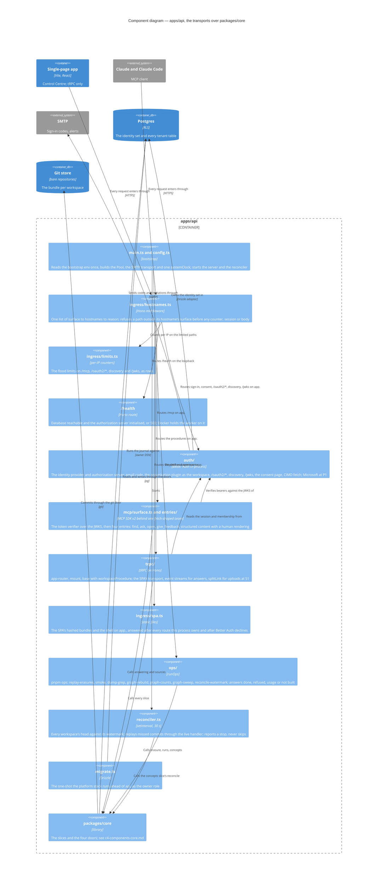

# Components — `apps/api`

Level 3. The one TypeScript deployable is transports only (ADR 0029): every request passes the hostname fence first, then reaches one of five mounts, and every mount calls `packages/core` through a slice's `index.ts`. The order of mounts in `createServer` is the order below.

## What the diagram claims

- **The fence is first and the SPA shell is last.** `routeByHostname` runs ahead of every mount; the tunnel's ingress rules are the first fence and this list the second, because Better Auth's handler answers the wildcard on every hostname the process is given (ADR 0022, amended 2026-09-03). The shell answers only after Better Auth has declined a path, so no endpoint of the library can be shadowed by the SPA.
- **Three principals, one id.** A person's id is the `user` row's, minted by the platform's ULID minter Better Auth is handed (ADR 0035); the MCP token carries `{workspace, user}` fixed at consent; the operator is a third principal kind and the platform principal a fourth for provisioning (ADR 0009). Revocation is an instant on the membership row or on the person, checked on every claim.
- **`runOps` is a tested seam.** Every command answers *done · refused · usage · not built*; a command whose slice has not landed says so rather than guessing. S0 fills `replay-erasures` and `erasure-rehearsal`, S5 adds the stuck-ref command, P2 adds `provision-workspace`.
- **The reconciler is the api's, not the worker's.** It runs in the api process every thirty seconds with the git and Postgres doors, replaying under `process:better-answers-reconciler`, idempotent on the `Audit:` trailer id; a commit the index refuses stops that workspace's replay, reported for the operator (ADR 0012).

## The skills that bind a change here

A seam sketch touching `apps/api/` names the skill under `apps/api/.claude/skills/` it follows — router, validators, links, non-JSON content types, error handling, subscriptions — and `[APP5]` binds the build the same way. No second HTTP route is opened beside tRPC for a shape a skill already covers; S1's upload goes over `splitLink` on `isNonJsonSerializable`, and S2's answer stream is a tRPC subscription whose iterable closes over no transaction (probe 2).
