# Components — `packages/core`

Level 3. The business logic every transport calls: capability slices over four store doors, with the import direction a lint rule (ADR 0029). This is where most of the route lands; a block spec's seam sketch names one of these slices first.

```mermaid
C4Component
  title Component diagram — packages/core, the slices over the doors

  Container(api, "apps/api", "Hono", "Transports: tRPC, the MCP surface, runOps, the head check, the sweep pass")

  Container_Boundary(core, "packages/core") {
    Component(kernel, "kernel", "types and pure functions", "Principal — a user or the platform — branded ids, admission, the refusal vocabulary, Result, Clock; imports nothing else")
    Component(access, "access", "the read predicate as data", "published, sensitivity, audience by intersection; rendered to SQL once")
    Component(pgdoor, "store/postgres", "pg", "The handle, the transaction helpers, SET LOCAL app.workspace_id from the Principal, session locks, the rate-limit counters")
    Component(gitdoor, "store/git", "git binary", "The governed write: per-repository lock, hash precondition, one commit per act, the Audit trailer; checks GIT_STORE_DIR once at open")
    Component(graphdoor, "store/graph", "recursive CTEs", "The delta builder and the walk templates; the one door that imports access, so no traversal exists without the predicate")
    Component(objdoor, "store/objects", "S3", "put, get, list and remove under the per-workspace prefix; the platform prefix for erasure replay copies")
    Component(llm, "llm", "route rows", "listRoutes over llm_route; the llm_call ledger and the fetch-shaped model client planned S2")
    Component(audit, "audit", "insert-only ledger", "The one append-only ledger: the typed event vocabulary, two doors, four families")

    Component(sources, "sources", "slice", "Bind, publish, narrow, widen; the review acts; reprocess; the DPIA input; passages; the upload sweep")
    Component(concepts, "concepts", "slice", "The write path, the inbox, the loader, the reconciler, visibility and the cascade's first level, graph maintenance")
    Component(answering, "answering", "slice", "find, ask, open, give_feedback; S2 re-seams ask as plan, draft, record")
    Component(guides, "guides", "slice", "Compositions and includes, recomputed as the cascade's second level; definitions and sections at S3")
    Component(erasure, "erasure", "slice", "Subject requests, the erasure map, suppressions, the routine, replay on restore, the rehearsal; the top of the slice graph")
    Component(runs, "runs", "slice", "enqueueJobIn in the act's transaction, one queued index job per binding; job and run views")
    Component(workspaces, "workspaces", "slice", "Provisioning and first membership under the platform principal, the picker's read, the workspace list")
    Component(members, "members", "slice", "Groups and their memberships, access requests; the People acts at P1")
    Component(sweeps, "sweeps", "slice", "The daily sweep pass over every workspace under session lock 42; one sweep_pass row a pass")
  }

  Rel(api, sources, "Calls")
  Rel(api, concepts, "Calls")
  Rel(api, answering, "Calls")
  Rel(api, erasure, "Calls")
  Rel(api, runs, "Calls")
  Rel(api, workspaces, "Calls")
  Rel(api, llm, "Lists routes through")
  Rel(api, sweeps, "Runs the pass through")

  Rel(erasure, concepts, "Moves bundle commits and checks through")
  Rel(erasure, sources, "Wipes the bindings holding found documents through")
  Rel(erasure, runs, "Queues the map's full rebuild through")
  Rel(erasure, gitdoor, "Rewrites history through")
  Rel(erasure, objdoor, "Writes replay copies through")
  Rel(sweeps, sources, "Sweeps orphaned uploads through")
  Rel(sweeps, concepts, "Sweeps old map generations through")

  Rel(sources, objdoor, "Lands originals through")
  Rel(sources, runs, "Queues index runs through, in the act's transaction")
  Rel(sources, concepts, "Runs the cascade through")
  Rel(concepts, guides, "Recomputes compositions through")
  Rel(answering, concepts, "Finds and opens concepts through")
  Rel(answering, sources, "Finds and opens passages through")
  Rel(answering, graphdoor, "Walks through; planned S2")
  Rel(answering, llm, "Resolves a route and records a call through; planned S2")

  Rel(concepts, gitdoor, "Commits through")
  Rel(concepts, graphdoor, "Writes the delta through")
  Rel(concepts, pgdoor, "Writes the index and identity through")
  Rel(runs, pgdoor, "Calls the queue functions through")
  Rel(graphdoor, access, "Renders the predicate from")
  Rel(llm, pgdoor, "Reads routes through")
  Rel(audit, pgdoor, "Inserts through")

  UpdateLayoutConfig($c4ShapeInRow="4", $c4BoundaryInRow="1")
```

The stores themselves are on `c4-containers.md`; each door reaches exactly one. Arrows drawn are the load-bearing ones. Every slice also imports `kernel`, calls `audit` for its ledger row and reaches Postgres through `store/postgres`; `erasure`, `sweeps` and `concepts` read the workspace list through `workspaces`, and `sources` and `concepts` check group holding through `members`. Drawing all of those would hide the ones that matter. The full rule set is the table below.

No entry calls `guides` or `members` yet: `guides` is reached as the cascade's second level, from `concepts` and `sources`, and `members` by the slices that check a group. `answering` reaches neither the graph door nor `llm` today — `find` is `findConcepts` plus `findPassages`, `open` takes an IRI or a locator (T-134), and `ask` searches concepts term by term under the predicate and refuses, calling no model.

## The import direction (ADR 0029, rules 1 to 5)

| From | May import | Never |
| --- | --- | --- |
| `kernel` | nothing in core | — |
| `access` | `kernel` | a door, a slice |
| `store/*` | `kernel`; `store/graph` also `access` | another door, a slice |
| `llm`, `audit` | `kernel`, `access`, the doors | a slice, each other |
| a slice | `kernel`, `access`, the doors, `llm`, `audit`, another slice's face (`index.ts`) | another slice's internals or `*.store.ts`; the slice graph is acyclic |
| `erasure` | every slice's face | — nothing in core imports erasure; only a test reaches it |
| anything in core | — | a transport or a transport's dependency (rule 5) |

Enforced by one plugin rule, `better-answers/import-direction` (`packages/devtools/lint-rules/rules/import-direction.ts`), which places both ends of an import in a zone by their position under `packages/core` and applies the table above with the rule number in its message, and by `import/no-cycle` for the acyclic clause (ADR 0029; T-113's finding F10, landed by T-114 and T-117). The rule walks `packages/core` alone: `apps/api` reaches a slice through `@better-answers/core/<slice>`, and a door's face where it composes (`doors.ts`), resolves a Principal (the tRPC base) or runs an ops command. The failure no linter sees — one slice writing SQL against another's tables — is caught by `packages/schema/src/table-ownership.ts`, the checked-in slice-to-tables map with its cross-owner exceptions, reviewed like an export list.

## Who owns which tables

| Owner | Tables |
| --- | --- |
| Better Auth, `apps/api/src/auth` | `user`, `session`, `account`, `verification`, `jwks`, `workspace`, `member`, `invitation`, the `oauth_*` set, `rate_limit` |
| the journal's migrator, `apps/api/src` | `contract_stamp` |
| `store/postgres` | `ingress_counter`, `mcp_call_counter` |
| `workspaces` | `workspace_config` |
| `members` | `group`, `group_member`, `access_request` |
| `llm` | `llm_route`; `llm_call` at S2 |
| `audit` | `audit_event` |
| `sources` | `source_binding`, `source_document`, `finding`, `index.chunk` |
| `concepts` | `concept_identity`, `concept_index`, `bundle_commit`, `evidence`, `concept_evidence`, `concept_verification`, `concept_class_override`, `suggestion`, `concept_write_request`, `graph_generation`, `graph_node`, `graph_edge`; `concept_owner` at S3 |
| `guides` | `composition`, `composition_include`; definitions, sections and versions at S3 |
| `erasure` | `subject_request`, `erasure_request`, `suppression` |
| `runs` | `job` |
| `sweeps` | `sweep_pass` |
| `answering` | `usage`, `answer_audit`, `question_set`, `question` — from S2, S3 and S6 |

The map is the TypeScript tier's. The worker is in no row: it writes `finding` rows, the catalogue columns of `source_document` and `index.chunk` rows under its own database role, and the `redaction` and `document-chunk` agreements pin what both tiers read of them.

## What the route changes here

- **S2 splits `ask` into three functions**: `planAnswer(principal, tx, question)` in the resolving transaction, `draftAnswer(plan, model)` an async generator holding no transaction, `recordAnswer(principal, tx, plan, drafted)` in a second short transaction — the review's one blocking finding. The graph door's `walkFrom` takes a set with one shared cap and a per-statement timeout (ADR 0023, amended 2026-09-10).
- **S3 makes `concept_owner` a table on `concepts`**, keyed against `concept_identity` with a per-domain default; exports `attachedByIri()` and `versionColumns()` from `packages/schema`; declares `COMPOSITION_HOMES = ["section", "response"]` so S6 adds a writer and never a migration (ADR 0014, amended 2026-09-10).
- **The class at publish (T-370) and the widen act (T-371)**, as the owner ruled on 24/09/2026. The binding stores the class the Admin typed at bind (Restricted and everyone when none is typed); every derivation counts an unpublished binding as Restricted, so the concepts citing it land Restricted; `publishBinding` records the class and audience it releases on its ledger row and cascades that class to the citing concepts and their compositions, keeping a concept the reconciler pinned Restricted where it is (T-370). `widenBinding` moves a binding, published or not, to a wider class, audience or both: it records the pair it moved from and to on its ledger row, runs the same cascade, refuses `not-wider` and, while a special-category finding the last run raised is unreviewed, `special-category-unreviewed`, and never moves a document's own narrower class (T-371).
- **T-366 gives `erasure` its documents.** Since T-375 a suppression is the workspace's, one row per request holding the request's identifiers and the person's sign-in addresses, and recording refuses an identifier too broad to withhold (`identifier-too-broad`). The erasure map's `source-document` finder still answers none, so a real request wipes no binding. Since T-376 the seam withholds every exact, case-folded occurrence of a suppression's identifiers, and recording measures an identifier against the floor by the `erasure-match` agreement both tiers read. Planned: the documents finder (T-377).
