# Components — `packages/core`

Level 3. The business logic every transport calls: capability slices over four store doors, with the import direction a lint rule (ADR 0029). This is where most of the route lands; a block spec's seam sketch names one of these slices first.

```mermaid
C4Component
  title Component diagram — packages/core, the slices over the doors

  Container(api, "apps/api", "Hono", "Transports: tRPC, the MCP surface, runOps, the reconciler; imports a slice's index.ts only")

  Container_Boundary(core, "packages/core") {
    Component(kernel, "kernel", "types and pure functions", "Principal, branded ids, the error vocabulary, Result, Clock; imports nothing else")
    Component(access, "access", "the read predicate as data", "published, sensitivity, audience by intersection; rendered to SQL once")
    Component(pgdoor, "store/postgres", "pg", "The handle, the transaction helper, SET LOCAL app.workspace_id from the Principal, the rate-limit counters")
    Component(gitdoor, "store/git", "git binary", "The governed write: per-repository lock, hash precondition, one commit per act, the Audit trailer; checks GIT_STORE_DIR once at open")
    Component(graphdoor, "store/graph", "recursive CTEs", "The delta builder and the walk templates; the one door that imports access, so no traversal exists without the predicate")
    Component(objdoor, "store/objects", "S3", "Object-store access and the per-workspace prefix discipline; exported with putObject and getObject at S1")
    Component(llm, "llm", "route rows", "Route resolution per workspace and purpose; the llm_call ledger; the fetch-shaped model client at S2")
    Component(audit, "audit", "insert-only ledger", "The one append-only ledger: the typed event vocabulary, two doors, four families")

    Component(sources, "sources", "slice", "Bindings, the catalogue, review and publish gates, retention classes; S1 adds passageAt and enqueueJobIn")
    Component(concepts, "concepts", "slice", "The write path: suggestions, the inbox, minting and identity, acceptance, verification, evidence, the graph delta, concept_owner at S3")
    Component(answering, "answering", "slice", "find, ask, open; answer audits, feedback, usage; S2 re-seams ask as plan, draft, record")
    Component(guides, "guides", "slice", "Guide definitions, sections, compositions with two homes, includes, footnotes, the renderer; filled at S3")
    Component(erasure, "erasure", "slice", "Erasure requests, suppression, the routine, replay on restore; the one slice that imports other slices; filled at S0")
    Component(runs, "runs", "slice", "The control plane as the app sees it: enqueue, run and heartbeat views; thin over the queue's SQL functions")
    Component(workspaces, "workspaces", "slice", "Provisioning under the platform principal, the picker's cross-workspace read, credentials revocation")
    Component(members, "members", "slice", "Groups and their memberships, access requests, the People acts")
  }

  Rel(api, sources, "Calls")
  Rel(api, concepts, "Calls")
  Rel(api, answering, "Calls")
  Rel(api, guides, "Calls")
  Rel(api, erasure, "Calls")
  Rel(api, runs, "Calls")
  Rel(api, workspaces, "Calls")
  Rel(api, members, "Calls")

  Rel(erasure, concepts, "Rewrites through")
  Rel(erasure, sources, "Rewrites through")
  Rel(erasure, guides, "Rewrites through")

  Rel(concepts, gitdoor, "Commits through")
  Rel(concepts, graphdoor, "Writes the delta through")
  Rel(concepts, pgdoor, "Writes the index and identity through")
  Rel(concepts, audit, "Books the ledger row through")
  Rel(answering, graphdoor, "Walks through")
  Rel(answering, llm, "Resolves a route and records a call through")
  Rel(sources, objdoor, "Lands documents through")
  Rel(sources, runs, "Enqueues the index job through")
  Rel(guides, gitdoor, "Writes the skeleton projection through")
  Rel(runs, pgdoor, "Calls the queue functions through")

  Rel(graphdoor, access, "Renders the predicate from")
  Rel(llm, pgdoor, "Reads routes and writes llm_call through")
  Rel(audit, pgdoor, "Inserts through")

  UpdateLayoutConfig($c4ShapeInRow="4", $c4BoundaryInRow="1")
```

The stores themselves are on `c4-containers.md`; each door reaches exactly one. Arrows drawn are the load-bearing ones. Every slice also imports `kernel`, calls `audit` for its ledger row and reaches Postgres through `store/postgres`; drawing all of those would hide the ones that matter. The full rule set is the table below.

## The import direction (ADR 0029, rules 1 to 5)

| From | May import | Never |
| --- | --- | --- |
| `kernel` | nothing in core | — |
| `access` | `kernel` | a door, a slice |
| `store/*` | `kernel`; `store/graph` also `access` | another door, a slice |
| `llm`, `audit` | `kernel`, `access`, the doors | a slice, each other |
| a slice | `kernel`, `access`, the doors, `llm`, `audit`, another slice's `index.ts` | another slice's internals or `*.store.ts`; the slice graph is acyclic |
| `erasure` | every slice's interface | — nothing imports erasure |
| a transport | a slice's `index.ts` | a door, a `*.store.ts` |

Enforced by per-glob `no-restricted-imports` and `import/no-cycle` under oxlint; the failure no linter sees — one slice writing SQL against another's tables — is caught by `packages/schema/src/table-ownership.ts`, the checked-in slice-to-tables map with its cross-owner exceptions, reviewed like an export list. ADR 0029 rule 4 as a lint is a hygiene task (T-113, stub-slices F10).

## Who owns which tables

| Owner | Tables |
| --- | --- |
| Better Auth, `apps/api/src/auth` | `user`, `session`, `account`, `verification`, `jwks`, `workspace`, `member`, `invitation`, the `oauth_*` set, `rate_limit` |
| `store/postgres` | `ingress_counter`, `mcp_call_counter` |
| `workspaces` | `workspace_config` |
| `members` | `group`, `group_member`, `access_request` |
| `llm` | `llm_route` |
| `audit` | `audit_event` |
| `sources` | `source_binding`, `source_document`, `index.chunk` |
| `concepts` | `concept_identity`, `concept_index`, `bundle_commit`, `evidence`, `concept_evidence`, `concept_verification`, `concept_class_override`, `suggestion`, `concept_write_request`, `graph_generation`, `graph_node`, `graph_edge`; `concept_owner` at S3 |
| `guides` | `composition`, `composition_include`; definitions, sections and versions at S3 |
| `runs` | `job` |
| `answering` | `usage`, `answer_audit`, `question_set`, `question` — from S2, S3 and S6 |
| the worker | `index.chunk` rows and `source_document` writes as cross-owner entries at S1 |

## What the route changes here

- **S2 splits `ask` into three functions**: `planAnswer(principal, tx, question)` in the resolving transaction, `draftAnswer(plan, model)` an async generator holding no transaction, `recordAnswer(principal, tx, plan, drafted)` in a second short transaction — the review's one blocking finding. The graph door's `walkFrom` takes a set with one shared cap and a per-statement timeout (ADR 0023, amended 2026-09-10).
- **S3 makes `concept_owner` a table on `concepts`**, keyed against `concept_identity` with a per-domain default; exports `attachedByIri()` and `versionColumns()` from `packages/schema`; declares `COMPOSITION_HOMES = ["section", "response"]` so S6 adds a writer and never a migration (ADR 0014, amended 2026-09-10).
- **S1 puts `enqueueJobIn(principal, tx, input)` beside the door form**, so the publish act lands the binding, its ledger row and the index job in one transaction; `job` gains a typed `subject_id` and a descriptor per kind from which the CHECKs and the fixture derive.
- **S0 fills `erasure`**, the one slice at the top of the graph: the request, the routine holding `pg_advisory_lock(41)`, the git step on the bare repository and the mirror, the replay `runOps` calls on restore.
