# Components — `apps/worker`

Level 3. The Python tier is **a host** (T-113, verdict 2): one loop, a registry of three kinds, one `pipeline/` package that alone imports cocoindex, and a `redaction/` package the pipeline calls. S1 built the host without reshaping the loop. Components the route has not built are marked *planned* with their block. The index run's steps in order are `c4-dynamic-index-run.md`.

```mermaid
C4Component
  title Component diagram — apps/worker, the loop and the host

  ContainerDb(postgres, "Postgres", "workspace-scoped role", "The queue, the stamps, finding, source_document, index.chunk, the graph tables")
  ContainerDb(git, "Git store", "read-only mount", "The bundle at the commit on the run row")
  ContainerDb(objects, "Object store", "Garage, S3", "Originals and normalised redacted copies")
  ContainerDb(lmdb, "Per-binding LMDB", "cocoindex Environment", "binding/ and findings/, sibling stores")
  System_Ext(models, "Model provider", "The extraction route; planned S7")

  Container_Boundary(worker, "apps/worker") {
    Component(loop, "loop.py", "the image's command", "One pass over every workspace per tick: claim and run one job, or enqueue the nightly audit when due; claims nothing while the schema stamp or the contract digest differs")
    Component(queue, "queue.py", "the queue agreement", "claim_job with the kinds, heartbeat, finish, fail; the lease kept alive beside the run")
    Component(kinds, "kinds.py — KINDS", "the registry", "nightly-audit, full-rebuild, index: each a handler taking the bootstrap and the claimed job, answering an outcome row")
    Component(rebuild, "rebuild.py", "full-rebuild", "One workspace's graph made again as a new generation, flipped live by one row update")
    Component(audit, "audit.py", "nightly-audit", "The parser audit over every concept file")
    Component(bundle, "bundle.py, concept_file.py, links.py, chunker.py", "dulwich", "Reads the bundle at a commit; the canonical text and hash the concept-file agreement pins; links; the concept chunker")
    Component(host, "pipeline/host.py, run.py, rows.py", "cocoindex host", "index_binding: a per-workspace asyncpg pool, Environments in a bounded LRU, each binding's two stores, the chunk rows; empties binding/ on wiped or rule-change")
    Component(landed, "pipeline/landed.py, converter.py, chunks.py", "coco.fn, unmemoised", "Per document under a ceiling by page count: convert — anydoc for docx, pdf-inspector for PDF, text passed through — or quarantine; then detect, redact and split into chunks")
    Component(detected, "pipeline/detected.py", "coco.fn, memo=True", "detected(normalised_text, detection_key): the one memo, answering spans")
    Component(redaction, "redaction/", "Presidio, GLiNER, spaCy", "The detector's recognisers and detection key; redact: the block rule, pseudonyms, withholdings, written spans")
    Component(catalogue, "pipeline/catalogue.py", "psycopg", "Reads the binding and its documents' suppressions, restores and dismissals; records findings, reconciles the catalogue, quarantines")
    Component(extraction, "extraction", "planned S7", "Candidate concepts within the plan and the ceiling, proposed as concept_write_request rows; credentials injected per run")
    Component(substrate, "schema_view.py, contract_stamp.py, ids.py, envelope.py, health.py, log.py, config.py", "substrate", "The committed schema view and baked contract digest; the ULID minter; the credential envelope; the process probe; one JSON log shape; the box's limits")
  }

  Rel(loop, queue, "Claims, heartbeats and enqueues the audit through")
  Rel(queue, postgres, "Calls the queue functions of", "psycopg")
  Rel(loop, substrate, "Checks both deploy stamps and reports health through")
  Rel(loop, kinds, "Dispatches a claimed job to")
  Rel(kinds, audit, "Runs nightly-audit")
  Rel(kinds, rebuild, "Runs full-rebuild")
  Rel(kinds, host, "Runs index with the binding and its reason")
  Rel(audit, bundle, "Parses every file through")
  Rel(rebuild, bundle, "Reads and chunks every concept through")
  Rel(bundle, git, "Reads at a commit from", "dulwich")
  Rel(rebuild, postgres, "Writes the new generation into", "psycopg")

  Rel(host, catalogue, "Reads the binding, then records the run through")
  Rel(host, landed, "Runs every document through")
  Rel(landed, objects, "Reads originals from; writes the normalised redacted copy to", "boto3")
  Rel(landed, detected, "Asks for spans of the normalised text")
  Rel(detected, redaction, "Runs the detector of, on a memo miss")
  Rel(landed, redaction, "Withholds and writes placeholders through")
  Rel(detected, lmdb, "Memoises spans in findings/", "cocoindex")
  Rel(host, lmdb, "Tracks chunk targets in binding/; removes it to empty a binding", "cocoindex")
  Rel(catalogue, postgres, "Reads the binding; writes finding and source_document", "psycopg")
  Rel(host, postgres, "Lands index.chunk rows, after the catalogue commits, through the chunks app", "asyncpg")
  Rel(extraction, models, "Calls per document within the ceiling", "fetch-shaped fake in tests")
  Rel(extraction, postgres, "Proposes concept_write_request rows into", "the concept-inbox agreement")

  UpdateLayoutConfig($c4ShapeInRow="3", $c4BoundaryInRow="1")
```

## What the diagram claims

- **The loop stays the loop.** `tick` serves every workspace in turn: claim one job with `KINDS`' three kinds and run it with a heartbeat beside it, or, when none is claimable, enqueue the nightly audit if none ran in the last day and none is in flight. `_run_claimed` is a registry lookup and nothing else (T-113, worker-host F3). Before each pass the loop reads both deploy stamps — the newest migration against its committed schema view, `contract_stamp` against the digest baked into the image — and claims nothing while either differs, logging once per disagreement.
- **The worker holds no git credential and writes no bundle.** It reads the bare repository at the commit on the run row over a read-only mount, with dulwich because the runtime image, `distroless/cc-debian13`, carries no git binary (ADR 0024). A concept it produces reaches the bundle as a `concept_write_request` row an Admin accepts (ADRs 0005, 0012).
- **One package imports cocoindex.** `pipeline/` is the one importer, a ruff `TID251` entry refusing the import elsewhere; `redaction/` and the converter's libraries are plain Python the pipeline calls. The worker composes the engine's blocks — memoisation, stable ids, target sync, `mount_each`, timeouts — and writes only what the engine has no block for: the run key, claim and lease, attempts and poison, the catalogue, retention, outcome rows, the landing (ADR 0036).
- **One memo, and it holds no text.** `detected(normalised_text, detection_key)` is the only memoised function; its value is spans — rule id, offsets, score. Conversion, the block rule, pseudonyms and the withholding run outside it on every run, so a fix to any of them reaches every document with no version to bump, and `CONVERTER_PIN` is in no memo key. The *detection key* is the digest of what the detector reads; the finding's version, `rule_version:detector_pin`, is what the seam writes on a finding, never the memo's key (ADR 0036, amended 2026-09-23; `CONTEXT.md`, *detection key*).
- **Two stores per binding.** `binding/` holds the chunks app and its target-state tracking; `findings/` holds the landed app and the memo. Emptying a binding — reason `wiped` or `rule-change` — removes `binding/` as the run's first statement and spares `findings/`, so the next run re-lands every chunk without detecting a page afresh (the `emptying-a-binding` agreement).
- **The run's rows land outside the job's transaction.** The catalogue writes commit first over psycopg, so a document's class is on its row before any chunk of it can be read (ADR 0044); the chunk rows land through the engine over asyncpg, on a per-workspace pool whose `setup` hook runs `set_config('app.workspace_id', …)` on every acquisition, `min_size=0, max_size=2` (`pipeline/host.py`'s `open_pool`). No chunk row carries visibility: the four columns left `index.chunk` (T-282, T-283).

## What each block adds

| Block | Adds to the worker |
| --- | --- |
| S0 | Landed — `redaction/`: the category descriptors, the recognisers over Presidio and GLiNER, the officer-block rule, pseudonyms, withholdings and written spans; the pytest harness asserting every fixture span back against the text by offset |
| S1 | Landed — `KINDS`, `pipeline/`, the converter, the per-workspace pool, the Environment LRU with the LMDB size as a signal, `RUST_LOG=warn` bridged into one log shape, the cross-tier document test with the worker as a real process |
| T-366 | Planned — a workspace-wide suppression the seam applies by exact case-folded match of the subject's identifiers (emails, names, other); today a suppression names one document, and the map finds none |
| S4 | A connector per provider beside the converter, the estate-size probe, `MAX_CONCURRENT_RUNS=1` measured, citation repair on a gone document, what becomes of findings when a `content_hash` moves |
| S7 | Extraction over the accepted plan and the ceiling, the template per document kind, conflicts raised never resolved |
| S8 | *reserve* — the concept unit: the `concept-catch-up` kind, embedding on the fixed route with an `llm_call` per call |
