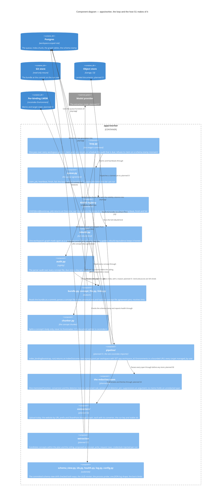

# Components — `apps/worker`

Level 3. The Python tier today is a loop and two job kinds; T-113's verdict 2 is that it is **a host** — S1 gives it a registry of kinds and one `pipeline/` module that alone imports cocoindex, and none of that reshapes the loop. Components the route has not built are marked *planned* with their block.

## What the diagram claims

- **The loop stays the loop.** `tick` serves every workspace in turn: claim one job, run it in one transaction with a heartbeat beside it, or schedule the nightly audit. S1 replaces the body of `_run_claimed` with a registry lookup and nothing else in the loop (T-113, worker-host F3).
- **The worker holds no git credential and writes no bundle.** It reads the bare repository at the commit on the run row over a read-only mount, with dulwich because the runtime image carries no git binary (ADR 0024). A concept it produces reaches the bundle as a `concept_write_request` row an Admin accepts (ADRs 0005, 0012).
- **One module imports cocoindex.** `pipeline/` is the one importer, a ruff `TID251` entry refusing the import elsewhere; the worker composes the engine's blocks — memoisation, stable ids, target sync, `mount_each`, timeouts — and writes only what the engine has no block for: the run key, claim and lease, attempts and poison, the catalogue, retention, outcome rows, the landing (ADR 0036).
- **The flow's rows land outside the job's transaction**, so `index.chunk` under row-level security needs a per-workspace pool with a session-level `SET app.workspace_id` in its connection init, `min_size=0, max_size=2` (probe 4: asyncpg defaults to ten).
- **A wipe is one act in order** — the binding's chunk rows deleted in the app's transaction, the directory removed, an `index` job enqueued — because `app.drop()` on a user-managed table keeps its rows (probe 4; ADR 0036, amended 2026-09-10).

## What each block adds

| Block | Adds to the worker |
| --- | --- |
| S0 | The detector as one memoised function beside conversion; the pytest harness asserting every fixture span back against the text by offset |
| S1 | `KINDS`, `pipeline/`, the per-workspace pool, the Environment LRU with the LMDB size as a signal, `RUST_LOG=warn` bridged into one log shape, the cross-tier document test with the worker as a real process |
| S4 | A connector per provider with its converter, the estate-size probe, `MAX_CONCURRENT_RUNS=1` measured, citation repair on a gone document |
| S7 | Extraction over the accepted plan and the ceiling, the template per document kind, conflicts raised never resolved |
| S8 | *reserve* — the concept unit: the `concept-catch-up` kind, embedding on the fixed route with an `llm_call` per call |
