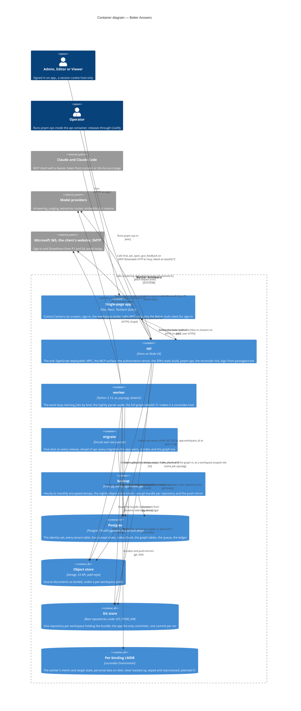

# Containers — the two tiers over four stores

Level 2. What runs, what it runs on, and what it may reach. The rule the diagram enforces is ADR 0005's: the TypeScript tier and the Python tier **share four stores and never code, and there is no HTTP between them** — the control plane is rows in the queue. The one seam between the tiers is checkable: `contracts/`, eight agreements both suites read (ADR 0031).

## What the diagram claims

- **No arrow between api and worker.** A job is a row the api's act inserts in its own transaction and the worker claims with `claim_job` under `SKIP LOCKED`, keeping a lease alive by heartbeat; the reaper and poison come with the row (ADR 0005; the `queue` agreement). S1 adds the kinds a tier may claim — `claim_job(p_worker_id, p_lease, p_kinds text[])` — so S6's question-set job is claimed by the api and never by the worker (T-113).
- **Postgres is four things in one resource.** The identity set Better Auth owns, isolated by key not scope; the tenant tables under `FORCE ROW LEVEL SECURITY` with `current_workspace_id()` as the one policy seam; the graph as plain tables under the same policy (ADR 0032, no AGE, no per-workspace role); and `index.chunk`, list-partitioned per workspace, the one table both tiers write into — the worker its rows, the app its DDL (ADR 0007).
- **The git store is written by one process.** The api commits through the git binary under a per-repository lock held from the precondition through the Postgres COMMIT, so `bundle_commit` is a prefix of git history (ADR 0012). The worker mounts the same directory read-only and reads at the commit on the run row (ADR 0024).
- **The per-binding LMDB is a store the contract names** (ADR 0005, 2026-08-27). It holds memoised output, which is personal data; it is disposable — a wipe is paired with deleting the binding's chunk rows in the app's transaction, because the LMDB is the engine's record of what to delete (ADR 0036, amended 2026-09-10; probe 4).
- **The web talks tRPC only.** The one exception, invitation-accept on the Better Auth client, arrives with P1. Uploads are a tRPC mutation over `splitLink`, never a second HTTP route (S1; `[APP5]`).

## The tier contract

| Agreement | Form | What it pins |
| --- | --- | --- |
| queue | SQL function | claim, lease, heartbeat, finish, fail; a lapsed lease revokes its claimant |
| concept-inbox | SQL function | the `concept_write_request` handshake |
| llm-routing | SQL function | the route per workspace and purpose |
| credential-envelope | fixtured | the encryption envelope both tiers decrypt |
| visibility-columns | fixtured | the three columns the worker writes and the app's predicate reads |
| id-shape | fixtured | the one ULID shape either tier mints |
| concept-file | fixtured | the canonical text and content hash of a concept file |
| cost-ledger | generated | the `llm_call` row's meaning |

S1 adds the first document-shaped agreement and moves `contract_version` past 5.
