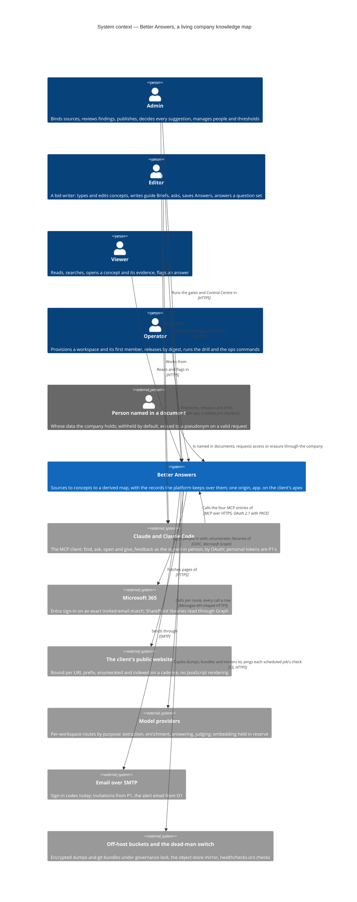

# System context — Better Answers

Level 1. The platform as one system: who uses it, which systems it talks to, and in which block of the route each outside system first matters. The people are the route spec's user stories; the systems are the ADRs' — sign-in and SharePoint (ADRs 0034, 0013), the model routes (ADRs 0020, 0025), the backups (ADR 0022).

## What the diagram claims

- **One system, one origin.** The product, sign-in, consent, the authorization server, discovery and the MCP surface all sit on `app.<apex>` (ADR 0034). There is no second server for agents; the MCP client is the same person under the same predicate and the same audit (stories 38 and 39). The bearer comes from OAuth consent; the *personal token* minted on the Account page is P1's and not built.
- **The person named in a document never signs in.** Their relation to the platform is through the company — a document that names them, an Admin who records their request — which is why they are drawn outside.
- **Three of the six outside systems are not reached until a route block lands them.** Microsoft sign-in is P1's, SharePoint and the website are S4's, the model providers are S2's for answering and judging and S7's for extraction. The embedding route is fixed and unread until S8's trigger; no v0.1 block embeds (ADRs 0016 and 0020 as amended 2026-09-09).
- **Email and the backups exist today.** Sign-in by email code, the hourly to monthly dumps, the nightly mirror and git bundles are built and drilled; an invitation email is P1's and the alert email O1's; every restore replays the erasures completed after its dump — `restore-drill.sh` and `restore-production.sh` run `pnpm ops replay-erasures` before `api` answers. The dead-man switch hears from every scheduled job, the api's head check and daily sweeps among them (`c4-dynamic-scheduled-work.md`).
- **The operator works through the api container and a workflow.** Provisioning, adding a member, importing a bundle and the drill's steps are `pnpm ops` commands; a *release* is a `release.yml` dispatch that sets the platform stack's digests in Coolify and deploys (`c4-deployment.md`).

## Not on this diagram

The share agent and `/agent/v1` (ADR 0008; out of scope for v0.1), the customer-hosted worker (v1.0), imported and vendor bundles, and the build and release pipeline and the Cloudflare edge — which are infrastructure and are drawn on `c4-deployment.md`.
