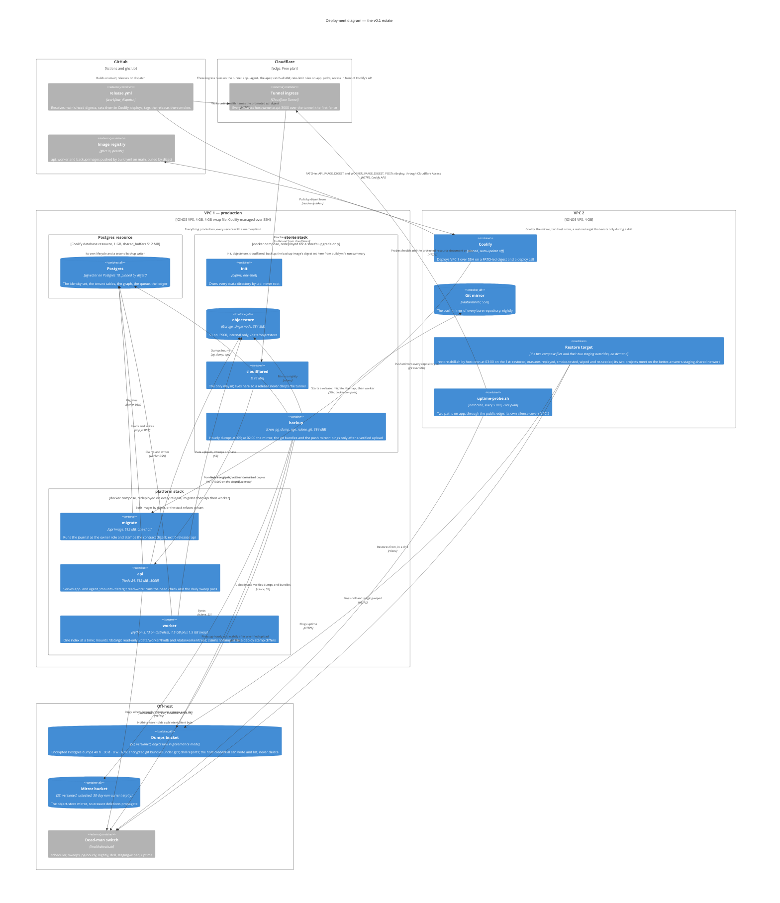

# Deployment — two boxes, two stacks, one tunnel

The estate ADRs 0022 and 0024 fix: two IONOS boxes of 4 vCPU · 4 GB · 120 GB NVMe, production on one, Coolify and the mirror on the other, every image deployed by digest, every irreplaceable byte encrypted off-host. The files are `deploy/stores.compose.yaml`, `deploy/platform.compose.yaml` and, for staging only, `deploy/staging.override.yaml` and `deploy/staging.platform.override.yaml`; the release is `.github/workflows/release.yml`; the operations documents are under `docs/operations/`. What runs on a schedule and who watches it is `c4-dynamic-scheduled-work.md`.

## What the diagram claims

- **Two stacks because a Coolify redeploy restarts the whole resource.** The stores stack holds the tunnel and the stores and is redeployed a few times a year; the platform stack is redeployed on every release. `depends_on` is a convenience; the safety is in the process — `migrate` waits for the DSN and stamps the contract digest after the journal, and the worker compares its committed schema view and its baked contract digest to the two stamps and claims nothing until they agree (ADRs 0007, 0031).
- **A release is a workflow, not a push.** `release.yml`, dispatched by the operator, takes main's head images by their `sha-<short>` tag unless digests are passed, PATCHes `API_IMAGE_DIGEST` and `WORKER_IMAGE_DIGEST` on the platform resource and POSTs Coolify's `/deploy` — both through Cloudflare Access with a service token — records the promotion as an annotated `release/<stamp>` tag, and ends with the smoke: `deploy/await-release.sh` waits until `/health` names the promoted api digest, then the protected-resource document is read (ADR 0022; T-364). The backup image is not in the release: its digest is set on the stores stack from `build.yml`'s run summary, on the stores' own upgrade.
- **Three product hostnames, not four, and none behind Access.** `app.` carries the SPA, sign-in, consent, `/oauth2/*`, discovery, `/jwks` and `/mcp`; `agent.` is routed only to `/agent/v1/*`, unbuilt; the apex answers 404. `mcp.` is gone and `docs.` struck (ADR 0034; ADR 0022, amended 2026-09-03). The api derives `app.` from `PUBLIC_URL` and refuses to start unless all three differ. Cloudflare Access guards only the orchestrator's API the release calls; its hostname is estate configuration, in the private file.
- **What is never backed up**: every per-binding LMDB store (disposable, rebuilt by the next run), the worker's working trees and caches. The graph rides every dump and every restore as ordinary tables (ADR 0032).
- **Every dump is a personal-data copy**, so every restore replays the erasures completed after the dump before `api` turns healthy — `pnpm ops replay-erasures --since <dump>`, step 5 of `restore-drill.sh` and step 6 of `restore-production.sh` — and the erasure report's dates are computed from the last dump before the rewrite (ADRs 0020, 0022).
- **Staging is the same two compose files plus an override each.** In production Coolify puts every service on its shared `coolify` network, which is how `api` and `worker` resolve the stores stack's `objectstore`. Staging runs under plain `docker compose` with nothing in Coolify's place, so `staging.override.yaml` puts `objectstore` on the external network `better-answers-staging-shared` under that alias, and `staging.platform.override.yaml` puts `migrate`, `api` and `worker` on it too. `restore-drill.sh` creates the network before either project starts, internal so that every service keeps its route out on its own project's network. `staging.override.yaml` also publishes the S3 port on the loopback, because the drill runs on the host. Nothing else differs, and staging stands only for a drill or a rehearsal (ADR 0024).
- **The growth steps are named**: A — split the stores to VPC 2 over WireGuard if the swap-in rate during the first index says so; E — a third contract, brought forward to the day a workspace asks for local embedding (ADR 0024).

## Memory on VPC 1

| Service | Limit |
| --- | --- |
| Postgres resource | 1 GB |
| worker | 1.5 GB, plus 1.5 GB of the swap file |
| api | 512 MB |
| migrate | 512 MB, one-shot |
| objectstore | 384 MB |
| backup | 384 MB |
| cloudflared | 128 MB |
| init | 128 MB, one-shot |

The sum is what `BACKUPS.md` § Signals measures the page-cache floor against; a box under that floor for five minutes is growth step A.
