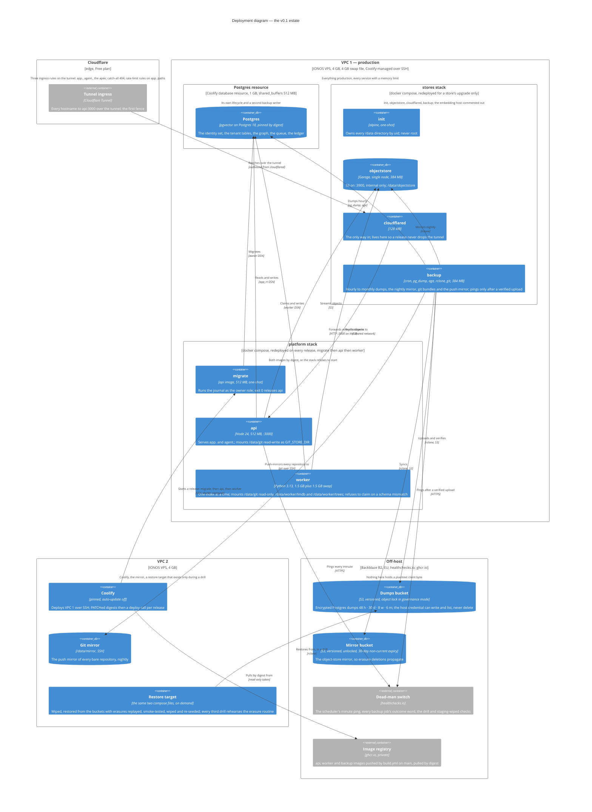

# Deployment — two boxes, two stacks, one tunnel

The estate ADRs 0022 and 0024 fix: two IONOS boxes of 4 vCPU · 4 GB · 120 GB NVMe, production on one, Coolify and the mirror on the other, every image deployed by digest, every irreplaceable byte encrypted off-host. The files are `deploy/stores.compose.yaml` and `deploy/platform.compose.yaml`; the operations documents are under `apps/docs-site/operations/`.

## What the diagram claims

- **Two stacks because a Coolify redeploy restarts the whole resource.** The stores stack holds the tunnel and the stores and is redeployed a few times a year; the platform stack is redeployed on every release. `depends_on` is a convenience; the safety is in the process — `migrate` waits for the DSN, the worker compares its committed schema view to the migrator's stamp and claims nothing until they agree (ADR 0007).
- **Three hostnames, not four, and none behind Access.** `app.` carries the SPA, sign-in, consent, `/oauth2/*`, discovery, `/jwks` and `/mcp`; `agent.` is routed only to `/agent/v1/*`, unbuilt; the apex answers 404. `mcp.` is gone and `docs.` struck (ADR 0034; ADR 0022, amended 2026-09-03). The app derives `app.` from `PUBLIC_URL` and refuses to start unless all three differ.
- **What is never backed up**: every per-binding LMDB (personal data, disposable), the worker's working trees and caches. The graph rides every dump and every restore as ordinary tables (ADR 0032).
- **Every dump is a personal-data copy**, so every restore replays the erasures completed after the dump before `api` turns healthy — `pnpm ops replay-erasures`, which S0 fills in — and the erasure report's dates are computed from the last dump before the rewrite (ADRs 0020, 0022).
- **The growth steps are named**: A — split the stores to VPC 2 over WireGuard if the swap-in rate during the first index says so; E — a third contract, brought forward to the day a workspace asks for local embedding (ADR 0024).

## Memory on VPC 1

| Service | Limit |
| --- | --- |
| Postgres resource | 1 GB |
| worker | 1.5 GB, plus 1.5 GB of the swap file |
| api | 512 MB |
| migrate | 512 MB, one-shot |
| objectstore | 384 MB |
| backup | 384 MB |
| cloudflared | 128 MB |
| init | 128 MB, one-shot |

The sum is what `BACKUPS.md` § Signals measures the page-cache floor against; a box under that floor for five minutes is growth step A.
