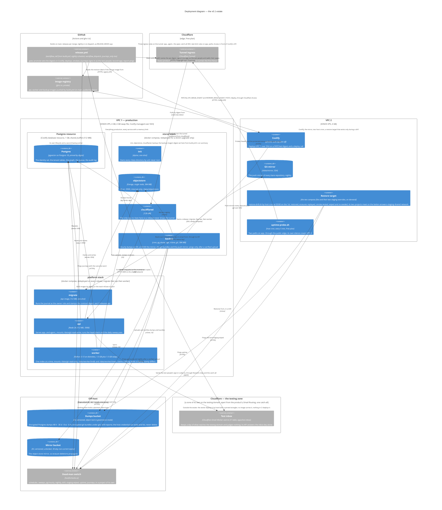

# Deployment — two boxes, two stacks, one tunnel

The estate ADRs 0022 and 0024 fix: two IONOS boxes of 4 vCPU · 4 GB · 120 GB NVMe, production on one, Coolify and the mirror on the other, every image deployed by digest, every irreplaceable byte encrypted off-host. The files are `deploy/stores.compose.yaml`, `deploy/platform.compose.yaml` and, for staging only, `deploy/staging.override.yaml` and `deploy/staging.platform.override.yaml`; the release is `.github/workflows/release.yml`; the test inbox its journeys read is `apps/test-inbox`; the operations documents are under `docs/operations/`. What runs on a schedule and who watches it is `c4-dynamic-scheduled-work.md`.

```mermaid
C4Deployment
  title Deployment diagram — the v0.1 estate

  Deployment_Node(github, "GitHub", "Actions and ghcr.io", "Builds on main; releases per merge, nightly or on dispatch, as RELEASE_MODE says") {
    Container_Ext(release, "release.yml", "workflow_call from build.yml; nightly schedule; workflow_dispatch, journeys_only too", "gate; promote sets the digests in Coolify, deploys, smokes; journeys signs in as the test people; record tags; report pings")
    Container_Ext(registry, "Image registry", "ghcr.io, private", "api, worker and backup images pushed by build.yml on main, pulled by digest")
  }

  Deployment_Node(cloudflare, "Cloudflare", "edge, Free plan", "Three ingress rules on the tunnel: app., agent., the apex; catch-all 404; rate-limit rules on app. paths; Access in front of Coolify's API") {
    Container_Ext(edge, "Tunnel ingress", "Cloudflare Tunnel", "Every product hostname to api:3000 over the tunnel; the first fence")
  }

  Deployment_Node(vpc1, "VPC 1 — production", "IONOS VPS, 4 GB, 4 GB swap file, Coolify-managed over SSH", "Everything production, every service with a memory limit") {
    Deployment_Node(pgnode, "Postgres resource", "Coolify database resource, 1 GB, shared_buffers 512 MB", "Its own lifecycle and a second backup writer") {
      ContainerDb(postgres, "Postgres", "pgvector on Postgres 18, pinned by digest", "The identity set, the tenant tables, the graph, the queue, the audit log")
    }
    Deployment_Node(stores, "stores stack", "docker compose, redeployed for a store's upgrade only", "init, objectstore, cloudflared, backup; the backup image's digest set here from build.yml's run summary") {
      Container(init, "init", "alpine, one-shot", "Owns every /data directory by uid; never root")
      ContainerDb(garage, "objectstore", "Garage, single node, 384 MB", "S3 on :3900, internal only; /data/objectstore")
      Container(cloudflared, "cloudflared", "128 MB", "The only way in; lives here so a release never drops the tunnel")
      Container(backup, "backup", "cron, pg_dump, age, rclone, git, 384 MB", "Hourly dumps at :05; at 02:00 the mirror, the git bundles and the push mirror; pings only after a verified upload")
    }
    Deployment_Node(platform, "platform stack", "docker compose, redeployed on every release, migrate then api then worker", "Both images by digest, or the stack refuses to start") {
      Container(migrate, "migrate", "api image, 512 MB, one-shot", "Runs the journal as the owner role and stamps the contract digest; exit 0 releases api")
      Container(api, "api", "Node 24, 512 MB, :3000", "Serves app. and agent.; mounts /data/git read-write; runs the head check and the daily sweep pass")
      Container(worker, "worker", "Python 3.13 on distroless, 1.5 GB plus 1.5 GB swap", "One index at a time; mounts /data/git read-only, /data/worker/lmdb and /data/worker/trees; claims nothing while a deploy stamp differs")
    }
  }

  Deployment_Node(vpc2, "VPC 2", "IONOS VPS, 4 GB", "Coolify, the mirror, two host crons, a restore target that exists only during a drill") {
    Container(coolify, "Coolify", "pinned, auto-update off", "Deploys VPC 1 over SSH on a PATCHed digest and a deploy call")
    ContainerDb(mirror, "Git mirror", "/data/mirror, SSH", "The push mirror of every bare repository, nightly")
    Container(staging, "Restore target", "the two compose files and their two staging overrides, on demand", "restore-drill.sh by host cron at 03:00 on the 1st: restored, erasures replayed, smoke-tested, wiped and re-seeded; its two projects meet on the better-answers-staging-shared network")
    Container(probe, "uptime-probe.sh", "host cron, every 5 min, Free plan", "Two paths on app. through the public edge; its own silence covers VPC 2")
  }

  Deployment_Node(offhost, "Off-host", "Backblaze B2, EU; healthchecks.io", "Nothing here holds a plaintext client byte") {
    ContainerDb(dumps, "Dumps bucket", "S3, versioned, object lock in governance mode", "Encrypted Postgres dumps 48 h · 30 d · 8 w · 6 m; encrypted git bundles under git/; drill reports; the host credential can write and list, never delete")
    ContainerDb(mirrorbucket, "Mirror bucket", "S3, versioned, unlocked, 30-day non-current expiry", "The object-store mirror, so erasure deletions propagate")
    Container_Ext(healthchecks, "Dead-man switch", "healthchecks.io", "scheduler, sweeps, pg-hourly, nightly, drill, staging-wiped, uptime; journeys, in a project of its own")
  }

  Deployment_Node(testzone, "Cloudflare — the testing zone", "a zone of its own on the testing domain, apart from the product's; Email Routing, one catch-all", "Outside the estate: the owner deploys it by hand with a pinned wrangler; no image carries it, nothing in CI deploys it") {
    Container_Ext(testinbox, "Test inbox", "Cloudflare Email Worker and its D1 table, apps/test-inbox", "Keeps a day of what reaches the testing domain and judges nothing; its API answers the inbox key alone")
  }

  Rel(edge, cloudflared, "Reaches over the tunnel", "outbound from cloudflared")
  Rel(cloudflared, api, "Forwards every product hostname to", "HTTP :3000 on the shared network")
  Rel(migrate, postgres, "Migrates", "owner DSN")
  Rel(api, postgres, "Reads and writes", "app_rt DSN")
  Rel(worker, postgres, "Claims and writes", "worker DSN")
  Rel(api, garage, "Puts uploads, sweeps orphans", "S3")
  Rel(worker, garage, "Reads originals, writes normalised copies", "S3")
  Rel(backup, postgres, "Dumps hourly", "pg_dump, age")
  Rel(backup, garage, "Mirrors nightly", "rclone")
  Rel(backup, dumps, "Uploads and verifies dumps and bundles", "rclone, S3")
  Rel(backup, mirrorbucket, "Syncs", "rclone, S3")
  Rel(backup, mirror, "Push-mirrors every repository to", "git over SSH")
  Rel(backup, healthchecks, "Pings pg-hourly and nightly after a verified upload", "HTTPS")
  Rel(api, healthchecks, "Pings scheduler each minute and sweeps each day", "HTTPS")
  Rel(release, coolify, "PATCHes API_IMAGE_DIGEST and WORKER_IMAGE_DIGEST, POSTs /deploy, through Cloudflare Access", "HTTPS, Coolify API")
  Rel(release, edge, "Waits until /health names the api digest; signs in on app. as the test people and walks their pages", "HTTPS, Playwright and Chromium")
  Rel(release, registry, "Reads the revision label of the live api image from", "HTTPS, registry API")
  Rel(release, testinbox, "Reads each test person's sign-in email from, through its API", "HTTPS, bearer key")
  Rel(release, healthchecks, "Pings journeys with the outcome word", "HTTPS")
  Rel(api, testinbox, "Sends the test people's sign-in codes to, through Resend's relay and the catch-all", "SMTP")
  Rel(coolify, migrate, "Starts a release: migrate, then api, then worker", "SSH, docker compose")
  Rel(coolify, registry, "Pulls by digest from", "read-only token")
  Rel(staging, dumps, "Restores from, in a drill", "rclone")
  Rel(staging, healthchecks, "Pings drill and staging-wiped", "HTTPS")
  Rel(probe, edge, "Probes /health and the protected-resource document on app.", "HTTPS")
  Rel(probe, healthchecks, "Pings uptime", "HTTPS")

  UpdateLayoutConfig($c4ShapeInRow="3", $c4BoundaryInRow="2")
```

## What the diagram claims

- **Two stacks because a Coolify redeploy restarts the whole resource.** The stores stack holds the tunnel and the stores and is redeployed a few times a year; the platform stack is redeployed on every release. `depends_on` is a convenience; the safety is in the process — `migrate` waits for the DSN and stamps the contract digest after the journal, and the worker compares its committed schema view and its baked contract digest to the two stamps and claims nothing until they agree (ADRs 0007, 0031).
- **A release is a workflow, not a push.** `release.yml` runs as the repository variable `RELEASE_MODE` says: called by `build.yml` after every green build on `main` (`per-merge`), on a schedule at 02:35 UTC once the box's own backup is fresh (`nightly`), or dispatched by the operator with a drill report or a hotfix reason (`drill`), and dispatched for a rollback in any mode. It takes its commit's images by their `sha-<short>` tag unless digests are passed, never moves production back to an older commit, PATCHes `API_IMAGE_DIGEST` and `WORKER_IMAGE_DIGEST` on the platform resource and POSTs Coolify's `/deploy` — both through Cloudflare Access with a service token, and each refused unless it answers 2xx — then runs the smoke: `deploy/await-release.sh` waits until `/health` names the promoted api digest, then the protected-resource document is read (ADR 0022; T-364). Five jobs carry it: `gate` decides, `promote` deploys and smokes with read access alone, `journeys` runs the journeys, `record` tags and `report` pings. `record` is the only job with write access: it checks out promote's head, reads `/health` again and pushes the annotated `release/<stamp>` tag. While the repository variable `JOURNEYS_MODE` is `off` or `report` a release is recorded on its smoke, and under `gate` only once its journeys end `held`; under `gate` a release whose journeys end `fail` is tagged `rejected/<stamp>` instead, which stops the nightly's walk as a release does. A release `build.yml` calls after a merge never runs the journeys and is recorded on its smoke. The backup image is not in the release: its digest is set on the stores stack from `build.yml`'s run summary, on the stores' own upgrade.
- **The journeys sign in to production as the test people.** They run after a promote whose smoke passed, alone on a scheduled night with nothing newer to promote, and alone on a `journeys_only` dispatch. The `journeys` job checks that `/health` names the api digest under test, reads the commit that image was built from off its `org.opencontainers.image.revision` label in the registry (`deploy/build-commit.sh`), checks it out and runs its journeys against `app.` through the public edge. The run ends in one word, `held`, `fail` or `could-not-run`, which `report` pings to the `journeys` check; a missed ping never fails the run. A run that does not hold rolls nothing back: whether to roll back is the owner's decision, as for any release (`docs/operations/RUNBOOK.md`, pages 6 and 13).
- **The test inbox is outside the estate.** `apps/test-inbox` is a Cloudflare Email Worker and its D1 table, on a testing domain of its own whose zone is apart from the product's. Production's sign-in email to a test person goes out through Resend like any other, and the testing zone's Email Routing catch-all hands it to the Worker. The Worker keeps it for a day and judges nothing: the journeys check each email's DKIM signature themselves. Its API answers only the inbox key, which the `production` environment holds with the test people's addresses. The owner deploys it by hand with the pinned `wrangler`; no image carries it and nothing in CI deploys it.
- **Three product hostnames, not four, and none behind Access.** `app.` carries the SPA, sign-in, consent, `/oauth2/*`, discovery, `/jwks` and `/mcp`; `agent.` is routed only to `/agent/v1/*`, unbuilt; the apex answers 404. `mcp.` is gone and `docs.` struck (ADR 0034; ADR 0022, amended 2026-09-03). The api derives `app.` from `PUBLIC_URL` and refuses to start unless all three differ. Cloudflare Access guards only the orchestrator's API the release calls; its hostname is estate configuration, in the private file.
- **What is never backed up**: every per-binding LMDB store (disposable, rebuilt by the next run), the worker's working trees and caches. The graph rides every dump and every restore as ordinary tables (ADR 0032).
- **Every dump is a personal-data copy**, so every restore replays the erasures completed after the dump before `api` turns healthy — `pnpm ops replay-erasures --since <dump>`, step 5 of `restore-drill.sh` and step 6 of `restore-production.sh` — and the erasure report's dates are computed from the last dump before the rewrite (ADRs 0020, 0022).
- **Staging is the same two compose files plus an override each.** In production Coolify puts every service on its shared `coolify` network, which is how `api` and `worker` resolve the stores stack's `objectstore`. Staging runs under plain `docker compose` with nothing in Coolify's place, so `staging.override.yaml` puts `objectstore` on the external network `better-answers-staging-shared` under that alias, and `staging.platform.override.yaml` puts `migrate`, `api` and `worker` on it too. `restore-drill.sh` creates the network before either project starts, internal so that every service keeps its route out on its own project's network. `staging.override.yaml` also publishes the S3 port on the loopback, because the drill runs on the host. Nothing else differs, and staging stands only for a drill or a rehearsal (ADR 0024).
- **The growth steps are named**: A — split the stores to VPC 2 over WireGuard if the swap-in rate during the first index says so; E — a third contract, brought forward to the day a workspace asks for local embedding (ADR 0024).

## Memory on VPC 1

| Service | Limit |
| --- | --- |
| Postgres resource | 1 GB |
| worker | 1.5 GB, plus 1.5 GB of the swap file |
| api | 512 MB |
| migrate | 512 MB, one-shot |
| objectstore | 384 MB |
| backup | 384 MB |
| cloudflared | 128 MB |
| init | 128 MB, one-shot |

The sum is what `BACKUPS.md` § Signals measures the page-cache floor against; a box under that floor for five minutes is growth step A.
