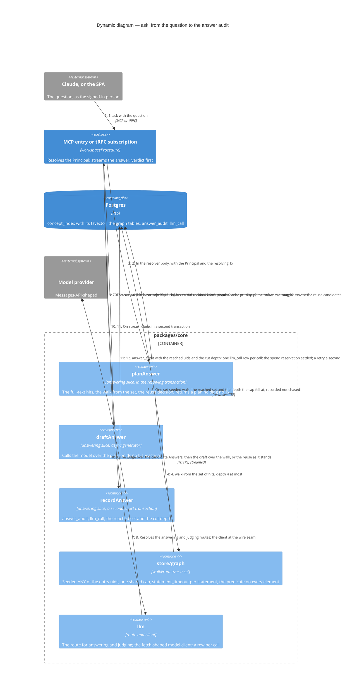

# Dynamic — `ask` as plan, draft, record (S2)

The answering act as T-113 re-seamed it — the review's one blocking finding: **an act that calls a model holds no transaction while it does.** Probe 2 (10/09/2026) fixed the wrapper's shape: an async-generator body under `workspaceProcedure` runs after the resolving transaction committed and released, so the plan runs in the resolver body, the returned iterable closes over no `Tx`, and the record opens its own transaction. **Planned: S2**, with `open` by locator and unmapped passages waiting on S1.

## What the flow guarantees

- **Entry points are the concept index's own.** A stored, GIN-indexed `tsvector` over title, tags, *Also known as* and body, written in the governed write's transaction and read under the predicate — no vector, no model call to find an entry (ADR 0016, amended 2026-09-09; probe 1). The expression replaces `findConcepts`' ILIKE predicate, so `find` and `ask` match by one rule.
- **The walk takes a set.** One set-seeded walk from forty entries answers in 15 ms against 423 ms for forty walks; the shared cap of 1,000 is about 25 rows per entry, so the walk barely leaves its seeds and the recorded cut is what keeps the answer honest (probe 3; ADR 0023, amended 2026-09-10). The recall measure asserts the master `Answer` was reached, never set equality.
- **No totals, one *not found*.** Absent and withheld are indistinguishable on every surface (stories 35 and 36); the `map` field carries the phrase, never a count; before any surface projects an edge's columns, the target's own predicate is applied — `open`'s relations projection is the first such surface.
- **Every model call is a row and never the prompt.** `llm_call` records route, purpose, tokens and price, as ADR 0025's amendment fixes the columns; a retried `ask` is a second audit row and its stale reservation is swept (gate §2, A21).
- **The recall measure decides S8.** Recall at ten of the master `Answer` on a paraphrase, threshold 90 % over a synthetic set in CI; the real reading is the client's own answer tests in its workspace at C1, and that reading alone — or the unmapped-passage hit rate on answers flagged *incomplete* — picks the reserve block.

## Left to S2's spec

Which of the two model calls, the judge over candidate `Answer`s, runs where the plan ends and the draft begins is the block spec's line; the route fixes only that no transaction is held across either. The wire shape — the Messages API alone, or a provider registry — is S2's ADR, leaning the Messages API (grill Q9).
