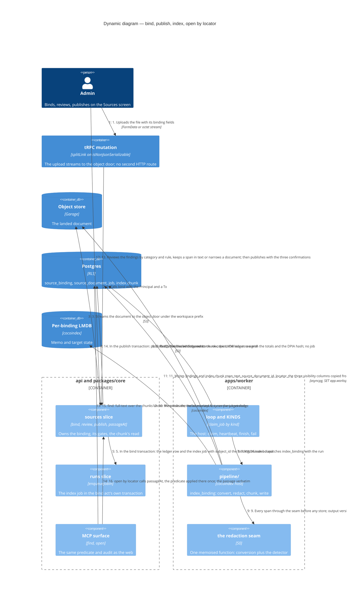

# Dynamic — one uploaded document to a cited passage (S1)

The route's one new seam: the document-shaped cross-tier test, modelled on rebuild-equivalence — the Admin's acts through the sources slice over real Postgres and a real object store, the worker run as a real process against the same stores, then `find` and `open` by locator through the core interface and the MCP surface, the passage asserted as a literal. **Planned: S0 lands the redaction seam, S1 the rest.** Nothing here calls a model and nothing embeds.

## What the flow guarantees

- **Nothing is embedded.** `index.chunk.embedding` and `embedding_route_id` go nullable together under one CHECK; the full-text vector is a generated column neither tier writes; the embedding route row stays fixed and unread until S8's trigger (ADRs 0016 and 0020, amended 2026-09-09; probe 1 proved the ALTER on the partitioned parent).
- **Every binding starts Restricted and every widening is the Admin's recorded act** (story 2; ADR 0013). A special-category finding narrows the document to Restricted on landing; widening is blocked while it is unreviewed (S0).
- **No memo ever holds an unredacted span.** Conversion and the detector are inside one memoised function, so the LMDB's memo is redacted text; the seam's output is versioned by `rule_version:detector_pin` and the suppressions are an argument, never a `detect_change` key (ADR 0020, ADR 0036 amended 2026-09-10).
- **The bind act is one transaction, and the publish act enqueues nothing.** The binding, its document, its ledger row and the index job land together through `enqueueJobIn(principal, tx, input)`; the job's `subject_id` names the binding under a per-kind CHECK, so an index job is never about nothing (T-113, owner D3). The chunks exist unpublished from that job, so the publish act stamps the binding and its chunk copies in its own transaction and is refused until the job has finished; the run's last statement re-copies the binding's fields so a narrowing landed mid-run wins (the S1 spec, 10/09/2026).
- **The read is one door.** `passageAt(principal, tx, locator)` on the sources slice applies the chunk's predicate once; `open` by locator, S2's unmapped passages and S4's citation repair all take it. A binding's drop is blocked while cited evidence stands (owner D5).

## What the test asserts

The Admin's three acts and their refusals through seam 1; the worker as a real process against the same stores (seam 8); the passage as a literal through the core interface and the MCP surface (seam 2); the Sources screen through the browser suite with its ADR 0037 budget (seam 3); the four probe measurements the gate turned into tests — the LMDB holds no personal data in the clear, `drop` on one binding cannot take the shared table, the `detect_change` blast radius stays per document, the LMDB size per binding is a signal (gate §4). The cascade ceiling is measured: 995 ms for a narrowing over a binding 300 concepts cite (probe 3).
