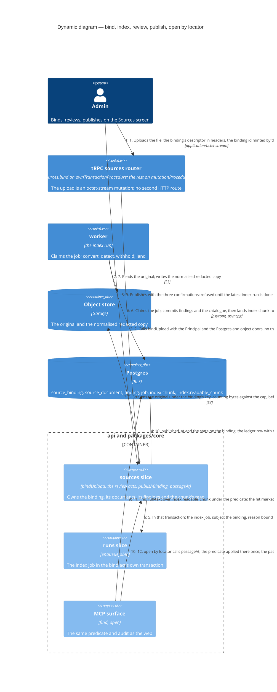

# Dynamic — one uploaded document to a cited passage (S1)

The route's one new seam: the document-shaped cross-tier test, modelled on rebuild-equivalence — the Admin's acts through the sources slice over real Postgres and a real object store, the worker run as a real process against the same stores, then `find` and `open` by locator through the core interface and the MCP surface, the passage asserted as a literal (`packages/core/test/cross-tier-document.test.ts`). Landed with S0 and S1. Nothing here calls a model and nothing embeds. Two steps are drawn on their own diagrams: the worker's run, step 6, is `c4-dynamic-index-run.md`, and the review, step 8, is `c4-dynamic-review-and-reindex.md`.

## What the flow guarantees

- **Nothing is embedded.** `index.chunk.embedding` and `embedding_route_id` go nullable together under one CHECK; the full-text vector is a generated column neither tier writes; the embedding route row stays fixed and unread until S8's trigger (ADRs 0016 and 0020, amended 2026-09-09; probe 1 proved the ALTER on the partitioned parent).
- **The bind act is idempotent and one transaction.** The client mints the binding id, the original's key derives from it, and a repeat answers the first bind's outcome before a byte is read again (T-236). The binding, its document, its ledger row and the index job land together through `enqueueJobIn(principal, tx, input)`; the job's `subject_id` names the binding under a per-kind CHECK, so an index job is never about nothing (T-113, owner D3).
- **The publish act enqueues nothing.** The chunks exist unpublished from the first run, so the publish stamps the binding alone and is refused until that run has finished. A chunk's visibility is read, not carried: `index.readable_chunk` joins the chunk to its binding and its document, the class the narrower of the two, so a narrowing or a publish is a write to the source row and queues no run (ADR 0044).
- **The binding keeps the class the Admin typed.** Restricted and everyone are the defaults when nothing is typed, and nothing forces them. No reader sees an unpublished binding at any class, because the read predicate requires `published_at`; but the concepts citing an unpublished binding's documents derive from the typed class, `publishBinding` runs no cascade and keeps the class only inside the DPIA hash, and no act widens a binding — `narrowBinding` and `narrowDocuments` refuse `widening-refused`. A document's own class only narrows it: the seam's special-category verdict or an Admin's narrowing, lifted only by a dismissal, and never past the Admin's own narrowing (`CONTEXT.md`, *effective class*). **Planned** (owner, 24/09/2026): an unpublished binding derives as Restricted everywhere, and publish records the class it releases and cascades it to the concepts citing it (T-370); an Admin's widen act on a published binding that cascades, before C1 (T-371).
- **No memo ever holds an unredacted span.** The index run converts outside every memo and memoises only the detector's spans, keyed by the normalised text and the *detection key*; `c4-dynamic-index-run.md` draws it.
- **The read is one door.** `passageAt(principal, tx, locator)` on the sources slice applies the chunk's predicate once; `open` by locator (T-134), S2's unmapped passages and S4's citation repair all take it. A binding's drop is blocked while cited evidence stands (owner D5).

## What the test asserts

The Admin's acts and their refusals through seam 1; the worker as a real process against the same stores (seam 8); the passage as a literal through the core interface and the MCP surface (seam 2); the Sources screen through the browser suite with its ADR 0037 budget (seam 3); the probe measurements the gate turned into tests — neither LMDB store holds the text or a withheld span, `drop` on one binding cannot take the shared table, the `detect_change` blast radius stays per document, the LMDB size per binding is a signal (gate §4). The cascade ceiling is measured: 995 ms for a narrowing over a binding 300 concepts cite (probe 3).
