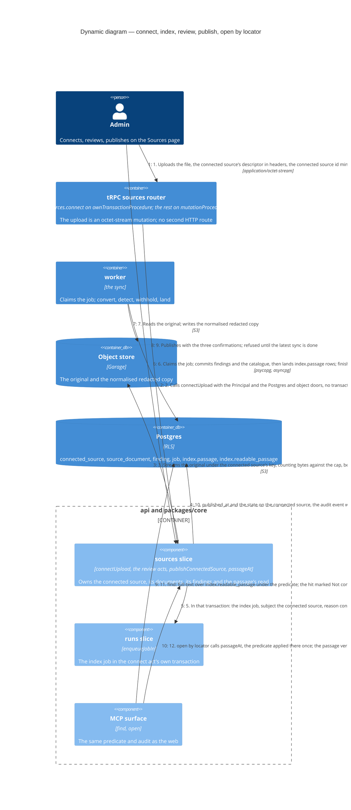

# Dynamic — one uploaded document to a cited passage (S1)

The route's one new seam: the document-shaped cross-tier test, modelled on rebuild-equivalence — the Admin's acts through the sources slice over real Postgres and a real object store, the worker run as a real process against the same stores, then `find` and `open` by locator through the core interface and the MCP surface, the passage asserted as a literal (`packages/core/test/cross-tier-document.test.ts`). Landed with S0 and S1. Nothing here calls a model and nothing embeds. Two steps are drawn on their own diagrams: the worker's sync, step 6, is `c4-dynamic-sync.md`, and the review, step 8, is `c4-dynamic-review-and-reindex.md`.

```mermaid
C4Dynamic
  title Dynamic diagram — connect, index, review, publish, open by locator

  Person(admin, "Admin", "Connects, reviews, publishes on the Sources page")
  Container(trpc, "tRPC sources router", "sources.connect on ownTransactionProcedure; the rest on mutationProcedure", "The upload is an octet-stream mutation; no second HTTP route")

  Container_Boundary(api, "api and packages/core") {
    Component(sources, "sources slice", "connectUpload, the review acts, publishConnectedSource, passageAt", "Owns the connected source, its documents, its findings and the passage's read")
    Component(runs, "runs slice", "enqueueJobIn", "The index job in the connect act's own transaction")
    Component(mcp, "MCP surface", "find, open", "The same predicate and audit as the web")
  }

  Container(worker, "worker", "the sync", "Claims the job; convert, detect, withhold, land")
  ContainerDb(objects, "Object store", "Garage", "The original and the normalised redacted copy")
  ContainerDb(postgres, "Postgres", "RLS", "connected_source, source_document, finding, job, index.passage, index.readable_passage")

  Rel(admin, trpc, "1. Uploads the file, the connected source's descriptor in headers, the connected source id minted by the web app", "application/octet-stream")
  Rel(trpc, sources, "2. Calls connectUpload with the Principal and the Postgres and object doors, no transaction open")
  Rel(sources, objects, "3. Streams the original under the connected source's key, counting bytes against the cap, before any row", "S3")
  Rel(sources, postgres, "4. One transaction: connected_source with the class and audience the Admin typed — Restricted and everyone when none is typed — unpublished, source_document, the audit event")
  Rel(sources, runs, "5. In that transaction: the index job, subject the connected source, reason connected")
  Rel(worker, postgres, "6. Claims the job; commits findings and the catalogue, then lands index.passage rows; finishes with the outcome", "psycopg, asyncpg")
  Rel(worker, objects, "7. Reads the original; writes the normalised redacted copy", "S3")
  Rel(admin, sources, "8. Reviews the finding groups: keeps in text, narrows documents, dismisses as not special category")
  Rel(admin, sources, "9. Publishes with the three confirmations; refused until the latest sync is done")
  Rel(sources, postgres, "10. published_at and the state on the connected source, the audit event with the finding counts, the DPIA hash and the class and audience it releases, and the cascade to the citing concepts; no passage, no job")
  Rel(mcp, postgres, "11. find: full-text over index.readable_passage under the predicate; the hit marked Not company knowledge")
  Rel(mcp, sources, "12. open by locator calls passageAt, the predicate applied there once; the passage verbatim")

  UpdateLayoutConfig($c4ShapeInRow="3", $c4BoundaryInRow="2")
```

## What the flow guarantees

- **Nothing is embedded.** `index.passage.embedding` and `embedding_model_choice_id` go nullable together under one CHECK; the full-text vector is a generated column neither tier writes; the embedding model choice stays fixed and unread until S8's trigger (ADRs 0016 and 0020, amended 2026-09-09; probe 1 proved the ALTER on the partitioned parent).
- **The connect act is idempotent and one transaction.** The web app mints the connected source id, the original's key derives from it, and a repeat answers the first connect's outcome before a byte is read again (T-236). The connected source, its document, its audit event and the index job land together through `enqueueJobIn(principal, tx, input)`; the job's `subject_id` names the connected source under a per-kind CHECK, so an index job is never about nothing (T-113, owner D3).
- **The publish act enqueues nothing.** The passages exist unpublished from the first sync, so the publish stamps the connected source, records the class and audience it releases, cascades that class to the concepts citing the connected source and the compositions including them, and is refused until that sync has finished. A passage's visibility is read, not carried: `index.readable_passage` joins the passage to its connected source and its document, the class the narrower of the two, so a narrowing or a publish is a write to the source row and queues no sync (ADR 0044).
- **The connected source keeps the class the Admin typed, and counts as Restricted until its publish releases it** (story 2; ADR 0013, amended 24/09/2026; T-370). Restricted and everyone are the defaults when nothing is typed. No reader sees an unpublished connected source at any class, because the read predicate requires `published_at`, and every derivation counts an unpublished connected source as Restricted, so a concept citing its documents lands Restricted until the publish cascade moves it. A concept the reconciler pinned Restricted stays pinned through that cascade. `narrowConnectedSource` and `narrowDocuments` refuse `widening-refused`; the one road wider is `widenConnectedSource`, the Sources page's *Widen* act (T-371): the connected source moves to a wider class, audience or both, its audit event carrying the pair it moved from and to, and the same cascade moves the concepts citing it. It is refused `not-wider` for a request that widens no term, and `special-category-unreviewed` while a special-category finding the last sync raised is unreviewed. A document's own class only narrows it: the seam's special-category verdict or an Admin's narrowing, lifted only by a dismissal, and never past the Admin's own narrowing (`CONCEPTS.md`, *effective class*), so a widening leaves it where it is.
- **No memo ever holds an unredacted span.** The sync converts outside every memo and memoises only the detector's spans, keyed by the normalised text and the *detection key*; `c4-dynamic-sync.md` draws it.
- **The read is one door.** `passageAt(principal, tx, locator)` on the sources slice applies the passage's predicate once; `open` by locator (T-134), S2's unmapped passages and S4's citation repair all take it. A connected source's drop is blocked while cited evidence stands (owner D5).

## What the test asserts

The Admin's acts and their refusals through seam 1; the worker as a real process against the same stores (seam 8); the passage as a literal through the core interface and the MCP surface (seam 2); the Sources page through the browser suite with its ADR 0037 budget (seam 3); the probe measurements the gate turned into tests — neither LMDB store holds the text or a withheld span, `drop` on one connected source cannot take the shared table, the `detect_change` blast radius stays per document, the LMDB size per connected source is a signal (gate §4). The cascade ceiling is measured: 1,106 ms for a narrowing over a connected source 300 concepts cite, 3.7 ms per citing concept (probe 3, re-run 27/09/2026; the reading is in S1's spec).
