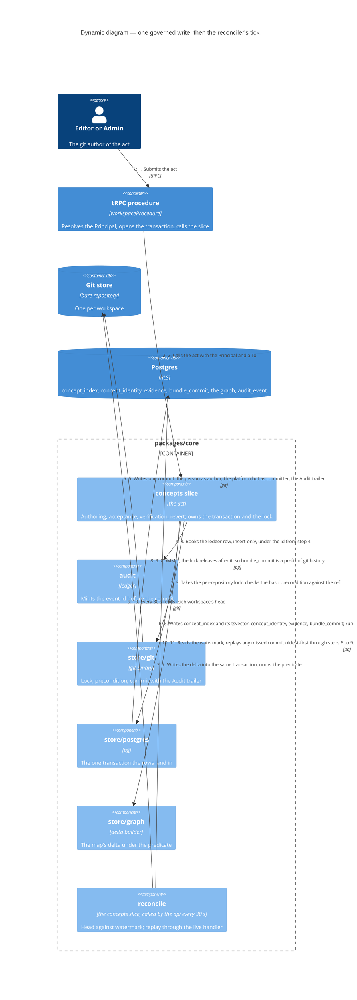

# Dynamic — the governed write and its reconciler

One act that changes the bundle — a concept typed on Knowledge, an acceptance in Suggestions, a verification, a conflict's resolution — lands as **one commit and one transaction, in that order, under one lock** (ADR 0012). Every records block on the route goes through this flow; S2 adds the `tsvector`, S3 the owner arm and the unresolved-reference row, S5 the by-run revert.

## What the flow guarantees

- **Authorization is judged at time of act**, against the instant the acting credential was issued at, under a shared lock on the member and person rows — so rows after a revocation are impossible by construction, and a bare commit inside the window is the replay case (ADR 0012, T-052).
- **The map is never behind for an edit.** The delta joins the commit transaction; a full rebuild writes beside the live generation and flips in one row update. The reader's two phrases are *map as of* and *map unavailable since*; the third is retired (ADR 0023, `CONTEXT.md` *map*).
- **A replay is fail-closed on what a commit does not carry.** The merge key, class and evidence are recovered; a file whose `sources[]` are not the standing citations lands Restricted with a ledger row saying so; the replay's ledger row is the reconciler's under the commit's `Audit:` id (ADR 0012, amendments of 2026-09-07 and 2026-09-08).
- **Unwanted content is undone by a forward revert, never a history rewrite.** The one rewrite the platform performs is the erasure routine's, on author lines, to the erasure pseudonym (ADRs 0012, 0035).

## Measured

Probe 3 (10/09/2026, seam 1 over 3,000 concepts): the write is flat at about 0.9 s from 250 to 3,000 concepts; the creation-time backfill scan is 31 to 42 ms of it. S3 replaces that scan with the unresolved-reference row before S7 and C1 multiply the creations.
