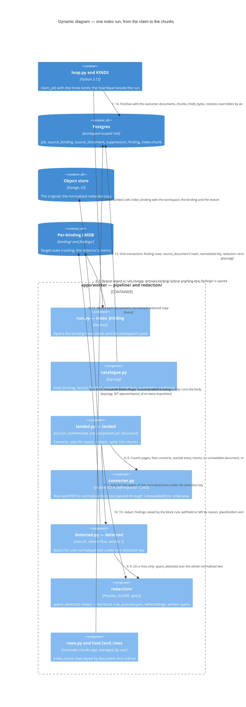

# Dynamic — the worker's index run

One `index` job as `pipeline/run.py`'s `index_binding` runs it, for one binding, whatever reason queued it. The order is the guarantee: **convert outside every memo, detect under the one memo, withhold, then write** — the normalised copy, the findings and the catalogue, and only then the chunks. A document the run cannot read is quarantined and the run goes on. No model is called and nothing embeds. The acts that queue a run, and the reason each carries, are `c4-dynamic-review-and-reindex.md`.

## What the run guarantees

- **No memo holds text.** `detected(normalised_text, detection_key)` is the one memoised function, its value spans — rule id, offsets, score. The worker's suite holds both stores to holding neither the text nor a withheld span, nor an erased person's name after a wipe (ADR 0036, amended 2026-09-23).
- **A fix reaches every document with no version to bump.** Conversion, the block rule, pseudonyms and the withholding run outside the memo on every run, and `CONVERTER_PIN` is in no memo key: a converter upgrade re-detects only the documents whose normalised text it changed. The memo moves with the *detection key* — the digest of what the detector reads: recognisers and pins, thresholds, context lemmas, the consumer-domain list, the window rule. The version a finding carries, `rule_version:detector_pin`, is the seam's output and never the memo's key (`CONTEXT.md`, *detection key*).
- **A document's class is on its row before any chunk of it lands.** Step 12 commits before step 13: the seam's special-category verdict only narrows the document, through `narrower_class`, and a verdict every one of whose findings an Admin dismissed is lifted back to the Admin's own narrowing or the binding's class (ADR 0044). No chunk row carries visibility.
- **Quarantine is an outcome, never a failure.** A page with no text layer, an encrypted file, a truncated upload, a type with no converter and a conversion past its ceiling — 6,453 ms a page plus 93 s — all land as *quarantined* with a *quarantine error* naming what refused it; the run lands the binding's other documents and finishes (`CONTEXT.md`, *quarantined*).
- **Emptying a binding is two halves.** The act that queued a `wiped` or `rule-change` run deleted the binding's chunk rows in its own transaction; step 3 removes `binding/`, the engine's record of what it landed, so step 13 lands every row again (the `emptying-a-binding` agreement).
- **An erasure outranks an Admin's keep.** A suppression names identifiers the seam withholds whatever the review said, and a kept span it names is *overridden by the erasure* and counted in the outcome. Since T-375 a suppression is the workspace's, one row per request, read for every document; today the seam withholds a detected span equal to one of its identifiers. **Planned**: the exact case-folded erasure match of every identifier, detected or not (T-376).
