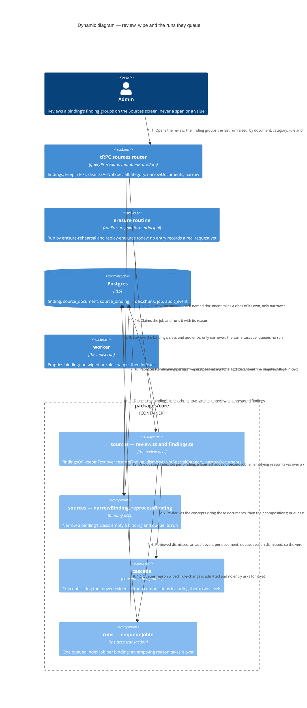

# Dynamic — the review acts and the index runs they queue

What happens between a binding's first run and its publish, and after: the Admin's review acts over *finding groups*, the erasure routine's wipe, and the index run each act queues, named by its reason. Five reasons exist (`INDEX_REASONS`, `packages/schema/src/job-tables.ts`): `bound` from the bind (`c4-dynamic-document-to-passage.md`), and the four drawn here. Every act is one transaction, and a run it queues is queued in it. What the queued run does is `c4-dynamic-index-run.md`.

## The reasons

| Reason | Queued by | Empties the binding | What the run changes |
| --- | --- | --- | --- |
| `bound` | `bindUpload` | no | The first run: findings, the catalogue, the chunks |
| `restored` | `keepInText` | no | The kept spans back in the normalised copy and the chunks; an erasure still outranks them |
| `dismissed` | `dismissAsNotSpecialCategory` | no | A document every one of whose special-category findings is dismissed has the seam's verdict lifted, back to the Admin's own narrowing or the binding's class; the spans stay withheld |
| `wiped` | `reprocessBinding`, from the erasure routine's `rederiveAfterErasure` | yes | `binding/` removed, then every chunk landed again under the new suppressions; `findings/` spared, so nothing is detected afresh |
| `rule-change` | `reprocessBinding`; no entry asks for it yet | yes | As `wiped` |

## What the flow guarantees

- **The review names no span.** A finding group is one document's findings of one category, raised by one rule at one tier; the three bulk acts take groups, and a finding the last run did not raise is not shown, acted on or counted at a publish (`CONTEXT.md`, *finding group*).
- **Only a dismissal widens a document, and never past the Admin.** `narrowDocuments` and `narrow` refuse `widening-refused`; a keep lets a span back into the text and lifts no class. A binding widens by `widenBinding` alone, over the cascade a narrowing and a publish run, and never moves a document's own narrower class (T-371; `c4-dynamic-document-to-passage.md`). The review decides when it may: a special-category finding the last run raised and nobody reviewed refuses it as `special-category-unreviewed`, and any review of that group (a keep, a narrowing or a dismissal) lets it through.
- **A narrowing is a write to the source row.** The chunk's class is read through `index.readable_chunk`, so a narrowing queues no run and takes effect at its commit; the cascade re-derives the concepts citing the evidence and then the compositions including them, inside the same act (ADR 0044; `CONTEXT.md`, *cascade*).
- **The two halves of emptying go together.** `reprocessBinding` deletes the chunk rows in the act's transaction and queues a reason the worker empties `binding/` on; the `emptying-a-binding` agreement holds both tiers to the same two reasons.
- **An erasure re-indexes now the documents its map finds.** The `source-document` finder names the live documents whose indexed text holds one of the identifiers the suppression holds (T-377), and the routine wipes their bindings, so step 10 runs for each of them now. Every other document loses the identifiers on its binding's next run: the suppression is the workspace's (T-375), and the seam withholds every exact occurrence of its identifiers (T-376).
