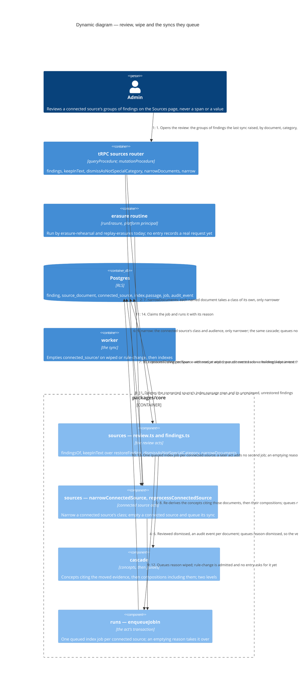

# Dynamic — the review acts and the syncs they queue

What happens between a connected source's first sync and its publish, and after: the Admin's review acts over *groups of findings*, the erasure routine's wipe, and the sync each act queues, named by its reason. Five reasons exist (`INDEX_REASONS`, `packages/schema/src/job-tables.ts`): `connected` from the connect (`c4-dynamic-document-to-passage.md`), and the four drawn here. Every act is one transaction, and a sync it queues is queued in it. What the queued sync does is `c4-dynamic-sync.md`.

```mermaid
C4Dynamic
  title Dynamic diagram — review, wipe and the syncs they queue

  Person(admin, "Admin", "Reviews a connected source's groups of findings on the Sources page, never a span or a value")
  Container(trpc, "tRPC sources router", "queryProcedure; mutationProcedure", "findings, keepInText, dismissAsNotSpecialCategory, narrowDocuments, narrow")
  Container(erasure, "erasure routine", "runErasure, platform principal", "Run by erasure-rehearsal and replay-erasures today; no entry records a real request yet")

  Container_Boundary(core, "packages/core") {
    Component(review, "sources — review.ts and findings.ts", "the review acts", "findingsOf, keepInText over restoreFinding, dismissAsNotSpecialCategory, narrowDocuments")
    Component(connectedSource, "sources — narrowConnectedSource, reprocessConnectedSource", "connected source acts", "Narrow a connected source's class; empty a connected source and queue its sync")
    Component(cascade, "cascade", "concepts, then guides", "Concepts citing the moved evidence, then compositions including them; two levels")
    Component(runs, "runs — enqueueJobIn", "the act's transaction", "One queued index job per connected source; an emptying reason takes it over")
  }

  ContainerDb(postgres, "Postgres", "RLS", "finding, source_document, connected_source, index.passage, job, audit_event")
  Container(worker, "worker", "the sync", "Empties connected_source/ on wiped or rule-change, then indexes")

  Rel(admin, trpc, "1. Opens the review: the groups of findings the last sync raised, by document, category, rule and tier")
  Rel(trpc, review, "2. keepInText over always-set groups with one reason")
  Rel(review, postgres, "3. restoreFinding per span — restored_at and one audit event each — reviewed kept-in-text")
  Rel(review, runs, "4. Queues the sync with reason restored, so the spans are back in the text")
  Rel(trpc, review, "5. dismissAsNotSpecialCategory over special-category groups with one reason")
  Rel(review, runs, "6. Reviewed dismissed, an audit event per document; queues reason dismissed, so the verdict can lift")
  Rel(trpc, review, "7. narrowDocuments: each named document takes a class of its own, only narrower")
  Rel(review, cascade, "8. Re-derives the concepts citing those documents, then their compositions; queues no sync")
  Rel(trpc, connectedSource, "9. narrow: the connected source's class and audience, only narrower; the same cascade; queues no sync")
  Rel(erasure, connectedSource, "10. reprocessConnectedSource with reason wiped, per connected source holding a document the map found")
  Rel(connectedSource, postgres, "11. Deletes the connected source's index.passage rows and its unreviewed, unrestored findings")
  Rel(connectedSource, runs, "12. Queues reason wiped; rule-change is admitted and no entry asks for it yet")
  Rel(runs, postgres, "13. One queued index job per connected source: a later act adds no second job; an emptying reason takes over a queued one and stays")
  Rel(worker, postgres, "14. Claims the job and runs it with its reason")

  UpdateLayoutConfig($c4ShapeInRow="3", $c4BoundaryInRow="1")
```

## The reasons

| Reason | Queued by | Empties the connected source | What the sync changes |
| --- | --- | --- | --- |
| `connected` | `connectUpload` | no | The first sync: findings, the catalogue, the passages |
| `restored` | `keepInText` | no | The kept spans back in the normalised copy and the passages; an erasure still outranks them |
| `dismissed` | `dismissAsNotSpecialCategory` | no | A document every one of whose special-category findings is dismissed has the seam's verdict lifted, back to the Admin's own narrowing or the connected source's class; the spans stay withheld |
| `wiped` | `reprocessConnectedSource`, from the erasure routine's `rederiveAfterErasure` | yes | `connected_source/` removed, then every passage landed again under the new suppressions; `findings/` spared, so nothing is detected afresh |
| `rule-change` | `reprocessConnectedSource`; no entry asks for it yet | yes | As `wiped` |

## What the flow guarantees

- **The review names no span.** A group of findings is one document's findings of one category, raised by one rule at one tier; the three bulk acts take groups, and a finding the last sync did not raise is not shown, acted on or counted at a publish (`CONCEPTS.md`, *group of findings*).
- **Only a dismissal widens a document, and never past the Admin.** `narrowDocuments` and `narrow` refuse `widening-refused`; a keep lets a span back into the text and lifts no class. A connected source widens by `widenConnectedSource` alone, over the cascade a narrowing or a publish starts, and never moves a document's own narrower class (T-371; `c4-dynamic-document-to-passage.md`). The review decides when it may: a special-category finding the last sync raised and nobody reviewed refuses it as `special-category-unreviewed`, and any review of that group (a keep, a narrowing or a dismissal) lets it through.
- **A narrowing is a write to the source row.** The passage's class is read through `index.readable_passage`, so a narrowing queues no sync and takes effect at its commit; the cascade re-derives the concepts citing the evidence and then the compositions including them, inside the same act (ADR 0044; `CONCEPTS.md`, *cascade*).
- **The two halves of emptying go together.** `reprocessConnectedSource` deletes the passage rows in the act's transaction and queues a reason the worker empties `connected_source/` on; the `emptying-a-connected-source` agreement holds both tiers to the same two reasons.
- **An erasure re-indexes now the documents its map finds.** The `source-document` finder names the live documents whose indexed text holds one of the identifiers the suppression holds (T-377), and the routine wipes their connected sources, so step 10 runs for each of them now. Every other document loses the identifiers on its connected source's next sync: the suppression is the workspace's (T-375), and the seam withholds every exact occurrence of its identifiers (T-376).
