# Dynamic — scheduled work and its watchers

Everything the estate does on a clock, fastest first, and the *dead-man ping* each job sends only after its work is verified: silence is the alert. Three places keep a clock — the api process, the backup container's cron, and VPC 2's host cron — and the worker's loop schedules one job of its own. Every check lives at healthchecks.io; the names are the checks' own. Coolify's own daily schedules — its dump of the Postgres resource and its instance backup — are the orchestrator's configuration, not the tree's, and are not drawn (`docs/operations/BACKUPS.md`).

```mermaid
C4Dynamic
  title Dynamic diagram — the schedules and the checks that watch them

  Container_Boundary(api, "api, on VPC 1") {
    Component(headcheck, "reconciler.ts — the head check", "setInterval, 30 s", "Each workspace's head against its watermark")
    Component(sweeps, "sweeps.ts — the sweep pass", "10 min after a start, then every 24 h", "The upload sweep and the graph sweep over every workspace")
    Component(ping, "dead-man-ping.ts", "fetch", "ok or fail, with counts; never a path, a key or an error")
  }
  Container(worker, "worker loop", "Python, every tick", "Enqueues the nightly audit when a workspace's is due")
  Container(backup, "backup", "cron in the stores stack", "backup.sh hourly at :05; backup.sh nightly at 02:00")
  Container(drill, "restore-drill.sh", "VPC 2 host cron, 03:00 on the 1st", "The monthly restore drill into staging")
  Container(probe, "uptime-probe.sh", "VPC 2 host cron, every 5 min, Free plan", "Two paths on app. through the public edge")

  ContainerDb(postgres, "Postgres", "RLS", "The watermark, the queue, sweep_pass, every table a dump holds")
  ContainerDb(stores, "Git store and object store", "VPC 1", "Bare repositories; landed copies")
  ContainerDb(offhost, "Off-host buckets and the git mirror", "B2, VPC 2", "Dumps and bundles, the object-store mirror, the push mirror")
  System_Ext(healthchecks, "healthchecks.io", "scheduler, sweeps, pg-hourly, nightly, drill, staging-wiped, uptime")
  Person(operator, "Operator", "Reads the alert and the runbook page it names")

  Rel(headcheck, postgres, "1. Every 30 s: reads each watermark against the head; replays missed commits oldest-first")
  Rel(headcheck, ping, "2. Every second tick: scheduler, fail if a tick in that minute failed")
  Rel(worker, postgres, "3. Every tick, per workspace: enqueues nightly-audit when none finished in 24 h and none is in flight, then claims it")
  Rel(backup, postgres, "4. Hourly at :05: pg_dump and pg_dumpall, age-encrypted", "pg_dump")
  Rel(backup, offhost, "5. Uploads and verifies the dump, then pings pg-hourly", "rclone")
  Rel(sweeps, postgres, "6. Daily, under session lock 42: orphaned uploads and old generations swept per workspace; one sweep_pass row")
  Rel(sweeps, ping, "7. After the pass: sweeps, fail if any workspace was passed over")
  Rel(ping, healthchecks, "8. POSTs the outcome word and the counts", "HTTPS")
  Rel(backup, stores, "9. Nightly at 02:00: mirrors the object store, bundles every repository", "rclone, git")
  Rel(backup, offhost, "10. Syncs the mirror, uploads the bundles under git/, push-mirrors to VPC 2, then pings nightly", "rclone, git over SSH")
  Rel(probe, healthchecks, "11. Every 5 min: GETs /health and /.well-known/oauth-protected-resource/mcp on app.; pings uptime ok 2/2 or fail")
  Rel(drill, offhost, "12. Monthly: restores staging from the latest daily dump, the mirror and the bundles; replays erasures; smoke; every third month the erasure rehearsal")
  Rel(drill, healthchecks, "13. Pings drill with the recovery time, then staging-wiped once staging is wiped and re-seeded")
  Rel(healthchecks, operator, "14. Alerts on a check late past its grace or pinged fail: sweeps by email, the rest on the second channel")

  UpdateLayoutConfig($c4ShapeInRow="3", $c4BoundaryInRow="1")
```

## What the schedules guarantee

- **A ping is sent only after the work is verified.** The backup jobs ping once each uploaded copy's size, read back from the bucket, matches the local file's, and every bundle has passed `git bundle verify`; the sweep pass after its `sweep_pass` row is written; the head check once a minute, `fail` when a tick in that minute failed. A body carries an outcome word and sizes, never a workspace, a key, a path or an error (`CONTEXT.md`, *dead-man ping*).
- **The api's two schedules never stop the api.** A wrong setting leaves the head check running unwatched and stops the sweeps, each logged at start; the check's silence tells the operator (`apps/api/src/main.ts`; T-359, T-336).
- **One sweep pass at a time.** A pass takes session lock 42 and a pass that finds it held is skipped and logged; `object-store-orphans` and `graph-sweep` by hand wait for it. Lock 41 is the dump's, shared by the erasure routine and the backup job, so no hourly dump is taken mid-erasure. The upload sweep is *list-only* until the operator sets `UPLOAD_SWEEP=remove` (`CONTEXT.md`, *upload sweep*).
- **Each box is watched from outside.** VPC 1 by the `scheduler` check's silence and the uptime probe, which runs from VPC 2 through the public edge, so DNS, the tunnel and the origin are on the probed path; VPC 2 by the probe's own silence on the Free plan, and on Pro only by `drill` and the `coolify-backup` check Coolify's own daily instance backup pings (`docs/operations/RUNBOOK.md`, page 1).
- **The drill proves the restore and then undoes it.** It restores into staging, replays the erasures completed after the dump, smoke-tests, runs the erasure rehearsal on a synthetic subject every third month, and wipes, pass or fail; `staging-wiped` is the proof the wipe ran.
