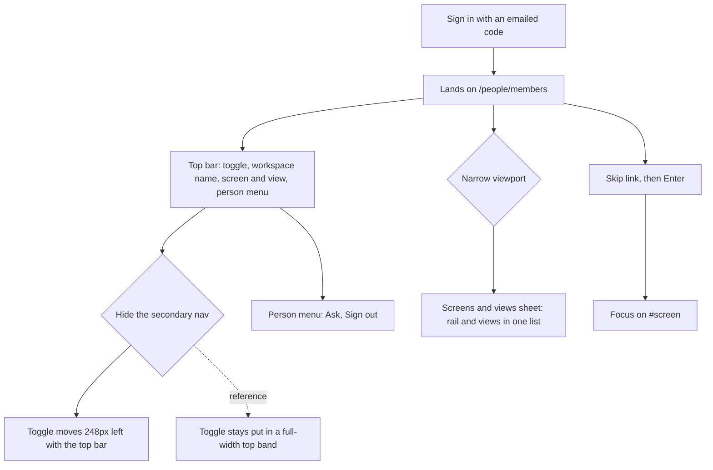
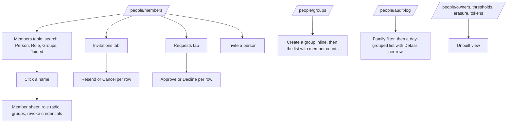
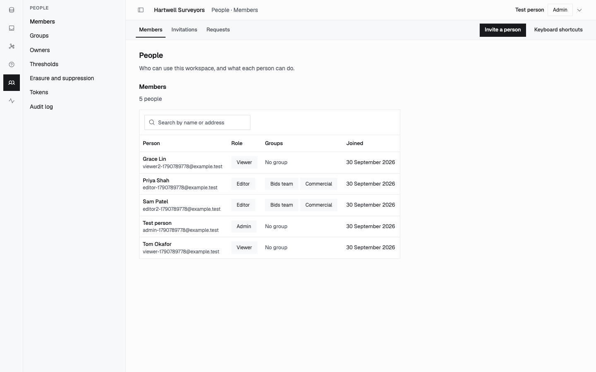
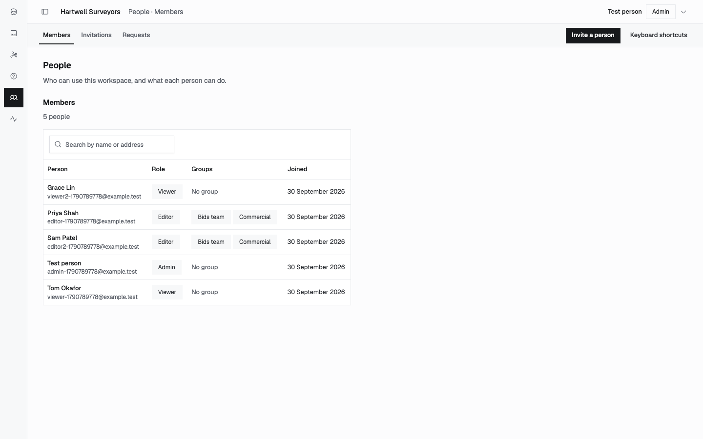
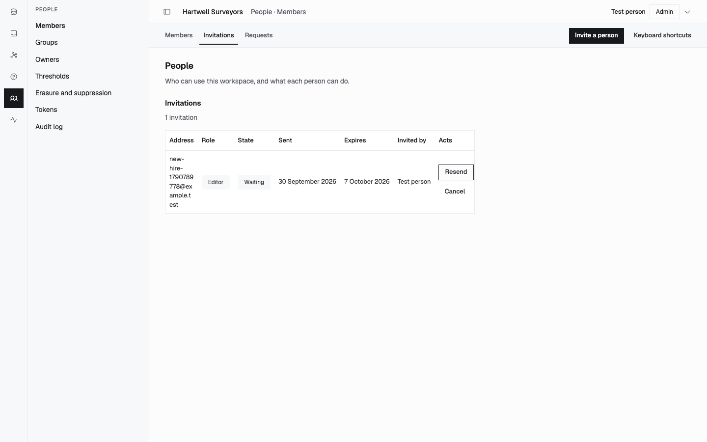
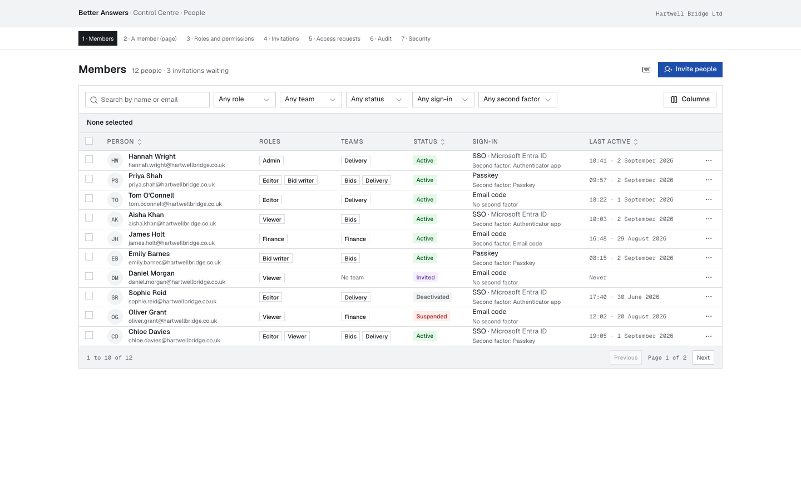

# Dogfood Report — docs/shell-people-dogfood

> A gap audit of the Control Centre shell and the People screen as they stand on `main` at `aabd83e7`, run with `ce-dogfood`'s method on 2026-09-30. It feeds `/ce-brainstorm`.

## Diff Summary

This run departs from `ce-dogfood`'s diff scope, by the owner's choice. The branch changes nothing in the product. It audits what `main` already ships against two references:

- **The shell** is measured against the owner's reference shell (`.scratch/ui-visuals/shell-example-menu-open.png` and `shell-example-menu-closed.png`, machine-local). The Arena shell (`.scratch/ui-visuals/arena-shell.png`) is not the target: the owner judges it wrong in the same way ours is.
- **People** is measured against the Arena user-management blocks (`react-user-management-blocks/`, a sibling folder of this repository, machine-local), served locally and screenshotted beside ours.
- **No fix loop, by design.** Every gap goes to `/ce-brainstorm`, because each one changes layout or product intent. Neither is a safe autonomous fix.
- Files read to explain what the browser showed: `apps/web/src/app/frame.tsx`, `top-bar.tsx`, `navigation-control.tsx`, `secondary-nav.tsx`, `icon-rail.tsx`, and `packages/design-system/tokens/tailwind-bridge.css`.

## Personas

Source: `docs/personas/personas.md`, a git-ignored link to `.planning/personas/`. The People screen is an Admin's screen, so these two carry the walk:

- **The Founder-Operator** (Admin): wants to see who has access and act on it fast, without learning the tool. Reads the screen in passing.
- **The Knowledge Curator** (Admin, or an Editor who owns most domains): runs People week to week. Groups, invitations and requests are routine chores, so density and filters matter.

The other six personas do not reach People in v0.1. Packs: the repository declares none (`packs-resolve.py` returned no roots, no warnings and no errors).

## Flows Tested

Shell, as a wide-screen Admin:

People, as an Admin:

## Test Matrix & Results

`Blocked (human decision)` marks a difference from the reference, recorded for `/ce-brainstorm` and not fixed.

| # | Flow | Journey / Scenario | Status | Issue | Fix | Commit |
|---|------|--------------------|--------|-------|-----|--------|
| 1 | Shell | One top band spans the full width, over the rail and the secondary nav | Blocked (human decision) | The top bar starts after the secondary nav; the rail and nav run to y=0 | brainstorm | - |
| 2 | Shell | The secondary-nav toggle stays in place when clicked | Blocked (human decision) | Toggle at x=324 with the nav shown and x=76 with it hidden: a 248px jump. It lives inside the right column's header (`frame.tsx`) | brainstorm | - |
| 3 | Shell | Logo cell at the top of the rail | Blocked (human decision) | No logo; the rail's first icon sits at the top | brainstorm | - |
| 4 | Shell | Workspace switcher beside the toggle | Blocked (human decision) | The workspace name is plain text, with no switcher or mark | brainstorm | - |
| 5 | Shell | Breadcrumb names the place and links back | Blocked (human decision) | "People · Members" is plain text, and it stays "Members" on the Invitations and Requests tabs | brainstorm | - |
| 6 | Shell | Top-bar actions (search, primary action, avatar) | Blocked (human decision) | Only the person menu (name, role pill, caret); no search, no avatar | brainstorm | - |
| 7 | Shell | Rail groups: main screens at the top, utilities at the bottom | Blocked (human decision) | One group only; the open-screen fill matches the reference | brainstorm | - |
| 8 | Shell | Secondary nav: icons, sections, a clear selected row | Blocked (human decision) | Text only, and the selected row's tint is faint. The "PEOPLE" heading repeats the rail | brainstorm | - |
| 9 | Shell | Content uses the page width | Blocked (human decision) | `max-w-measure` (68ch, the prose measure) caps every table at about 630px of a 1136px pane | brainstorm | - |
| 10 | Shell | Narrow viewport opens "Screens and views" as a sheet | Pass | - | - | - |
| 11 | Shell | The skip link reaches the screen | Pass | Address becomes `#screen`; `main` has `tabindex=-1` | - | - |
| 12 | Shell | Person menu offers the other surface and sign-out | Pass | Paper cuts below | - | - |
| 13 | People | Members list against Arena block 1 | Blocked (human decision) | No role or status filters, no bulk select, no row menu, no pagination, no avatars, no columns control. The page title and count sit apart from the primary action | brainstorm | - |
| 14 | People | A member against Arena block 2 | Blocked (human decision) | Ours is a sheet with one role radio, a "Make X an Editor" button, group checkboxes and revoke. Arena's is a page with side sections: Access, Sign-in, Sessions, Activity, and Remove and revoke | brainstorm | - |
| 15 | People | Invitations against Arena block 4 | Blocked (human decision) | The address wraps one character per line (the 68ch cap from #9). No status tabs, no search; Resend and Cancel are buttons, not a row menu | brainstorm | - |
| 16 | People | Requests against Arena block 5 | Blocked (human decision) | Layout: no filters or search. Concept: Arena's requests ask for a role, scope or team for a while (asks for, for, policy); ours are requests to join only | brainstorm | - |
| 17 | People | Groups (no Arena counterpart; Arena has teams inside Members) | Pass | Paper cut below | - | - |
| 18 | People | Audit log against Arena block 6 | Blocked (human decision) | Ours: Family filter and a Details disclosure per row. Arena: search, type and severity filters, CSV export, one sentence per row, "Load 20 more" | brainstorm | - |
| 19 | People | Roles and permissions, and Security (Arena blocks 3 and 7) | Skipped | Not built here. Owners, Thresholds, Erasure and suppression, and Tokens show the unbuilt view | - | - |

## Pack Compliance

None. The repository declares no Compound Packs.

## What Was Fixed

None, by design. The owner chose an audit-only run, and every gap goes to `/ce-brainstorm`.

## Paper Cuts (by persona)

- **Founder-Operator**: the toggle jumps 248px when clicked, so the next click lands on the workspace name (#2). Sharp. Deferred to the shell rework.
- **Founder-Operator**: an invitation's address is unreadable when it wraps one character per line (#15). Sharp. Deferred, because the fix is the width rule (#9), a layout decision.
- **Founder-Operator**: the person menu's "Ask" gives no sign that it leaves the Control Centre for another surface (#12). Minor.
- **Knowledge Curator**: the breadcrumb says "Members" while the Requests tab is open, so the place is misread (#5). Moderate.
- **Knowledge Curator**: with no filters on Members, Invitations or Requests, a workspace past about 20 people means scrolling and searching by eye (#13, #15, #16). Moderate at v0.1 sizes.
- **Knowledge Curator**: the Groups create form sits above the list, so the first thing on the screen is an empty field rather than the groups (#17). Minor.
- **Knowledge Curator**: the audit log needs a Details click per row to read what happened. Arena shows it as one sentence (#18). Moderate.

## Console Errors

None. `agent-browser errors` was empty after both walks.

## Human Verifications

Not applicable. Sign-in codes were read from the browser-suite api's harness (`/__harness/codes`), not from real email.

## Decisions for a Human

### The shell's top band
- **What's broken:** #1 to #8. The top bar belongs to the right-hand column, so the toggle moves when the nav hides, and there is no place for a logo, a workspace switcher, a breadcrumb or top-bar actions.
- **Why escalated:** it restructures `Frame` and every screen's chrome, and it changes the owner's UX intent.
- **Options:** (a) a full-width top band in three cells, sized to the rail, the sidebar and the rest, as the reference shows, with the rail and nav below it. (b) Keep the current columns and pin only the toggle.
- **Recommendation:** (a). It is the owner's stated requirement, and (b) still leaves #3 to #6 without a home.

The toggle with the secondary nav shown (x=324), then hidden (x=76):

### The content width rule
- **What's broken:** #9 and #15. A prose measure is applied to tables.
- **Why escalated:** it is a design-system rule that every screen inherits.
- **Options:** `max-w-page` for data screens and `max-w-measure` for prose screens, or let each view declare its own.
- **Recommendation:** a per-view declaration, defaulting to page width for tables.

Ours, capped at 68ch, beside Arena's Members block at page width:

### How much of the Arena blocks is layout, and how much is product
- **What's broken:** #13, #14, #16 and #18 carry concepts `CONTEXT.md` does not have: several roles per member and custom roles (Bid writer, Finance), teams alongside groups, member status (Suspended, Deactivated), SSO, passkeys and second factors, time-boxed scoped access requests, and severity on audit events.
- **Why escalated:** adopting any of them is a product-scope decision, not a UI one.
- **Options:** take the blocks' layout and controls only (filters, row menus, page detail, one-sentence audit), keeping today's concepts. Or adopt named concepts too, each as its own decision.
- **Recommendation:** layout only for this rework, and list the concepts in Linear for later.

### The member detail: sheet or page
- **What's broken:** #14. Arena uses a page with sections; ours is a sheet.
- **Options:** keep the sheet with sections added, or move to a page at `/people/members/<id>`.
- **Recommendation:** a page, once Sessions and Activity exist to fill it. Until then, the sheet.

## Learnings

- The browser-suite api (`apps/api/tests/serve.ts <port>`) with the web build and `/__harness` seeding is a fast way to walk any screen with real rows. Seed with POSTs to `/workspaces`, `/people`, `/members`, `/invitations`, `/access-requests` and `/groups`, then read the sign-in code from `GET /__harness/codes?email=`.
- Serve on `127.0.0.1`, not `localhost`: the api maps `localhost` to the apex host.

### Pack candidates

None. The repository declares no packs.

## Final Status

Not a ship verdict: this branch changes no product code. The automated suite was not run, because nothing it tests changed. Of 19 scenarios, 4 pass (#10, #11, #12 and #17), 1 is skipped as unbuilt (#19), and 14 are gaps for `/ce-brainstorm`. The four decisions above are its agenda.