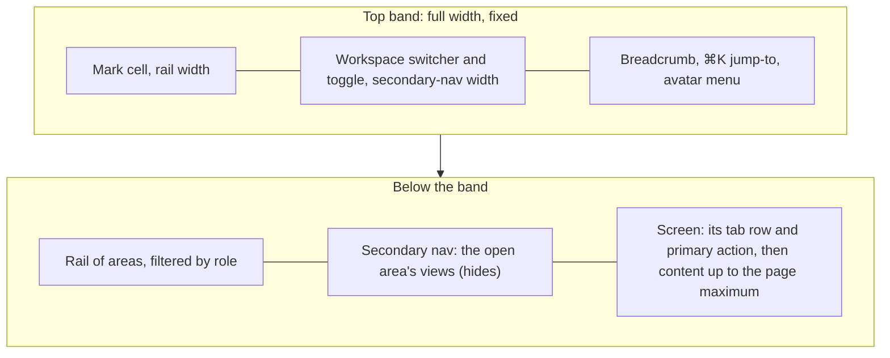

# Shell and Layout Foundations - Plan

## Goal Capsule

- **Objective:** A person on any workspace screen always knows where they are and gets there in one move. The sidebar toggle stays where it is when the nav hides, the rail shows only what their role can use and what is built, and tables get the width they need.
- **Product authority:** the owner's decisions in the 30/09/2026 brainstorm, recorded under Key Decisions. The People layout rework, the security and sign-in features, and the glossary rewrite are separate work, not active scope here.
- **Open blockers:** none.

---

## Product Contract

### Summary

The shell gets a full-width top band: the citation mark, the workspace switcher with the sidebar toggle, the breadcrumb, ⌘K jump-to and the avatar menu. Below it sits one rail of areas, filtered by role and showing only what is built, and the rail drives the secondary nav. Screens fill the pane up to the page maximum, and text keeps its reading measure. The design system, ADR 0046 and the glossary's surface and name entries change with it, and the product's name becomes `better-answers`.

### Problem Frame

The gap audit (`docs/dogfood-reports/2026-09-30-docs-shell-people-dogfood-dogfood.md`, scenarios 1 to 9 and 15) measured the shell against the owner's reference shell:

- **The toggle moves.** It sits inside the right-hand column's header, so it moves 248px when the secondary nav hides. The next click then lands on the workspace name.
- **The band has no room.** There is no place for a mark, a workspace switcher, a breadcrumb that links, or search.
- **The rail shows too much.** It lists every screen to every role, and most of what it lists is not built. Four of People's seven views and six of Sources' seven open a "not built" screen.
- **Tables are cut short.** A prose measure of 68ch caps every screen, so People's tables stop at about 630px of an 1136px pane. An invitation's email address wraps one character per line.

The design system is the source of several of these. Its layout constants name only the prose measure, and it has no mark. Its shell guidance was never matched against a reference shell. T-225 treated the Arena branch as a reference to read, never to compare the built screen against, and no acceptance line checked it.

Two surfaces (ADR 0046) add a hidden crossing. Ask and Control Centre each have their own rail, and the only way between them is an item in the person menu.

### Layout

When the secondary nav hides, only the nav leaves the row below the band. The band's cells keep their widths and positions.

### Key Decisions

- **The band holds the mark, the switcher and toggle, the breadcrumb, ⌘K jump-to and the avatar menu. It has no primary-action slot.** A screen's primary action belongs to that screen. (session-settled: user-directed — chosen over the reference band's primary-action slot: an action is specific to the screen being shown.) Governs R1, R2, R8.
- **⌘K is a jump-to now. Knowledge results join it later.** (session-settled: user-approved — chosen over knowledge search only from S2, or an empty slot: useful from day one, with no dead box.) Governs R7.
- **Screens fill the pane up to the page maximum, and text keeps its measure.** (session-settled: user-approved — chosen over a width declared per view, or no maximum: one rule, and no screen has to declare anything.) Governs R14.
- **One rail of areas, filtered by role, replaces ADR 0046's two surfaces.** Each rail entry drives the secondary nav, so nothing needs crossing. (session-settled: user-directed — chosen over keeping two surfaces with a crossing control: one rail matches how the owner models the product.) Governs R9, R19.
- **The rail is filtered by role, per BA-12's review. Filtering by what an Editor owns waits for ownership (S5).** (session-settled: user-approved — chosen over role-and-ownership filtering now, which would invent ownership, or no filter.) Governs R9.
- **Unbuilt areas and views are hidden. A role's home always shows.** (session-settled: user-approved — chosen over marking unbuilt entries "Soon", or leaving them as today: clients see a smaller, finished tool, and Editors and Viewers are not left with an empty shell.) Governs R10, R11.
- **The mark is two square brackets with a square between them, like a citation. It is drawn in this work.** (session-settled: user-directed — chosen over a placeholder tile or an empty cell.) Governs R16.
- **The product's name is `better-answers` everywhere a person reads it.** (session-settled: user-directed — chosen over keeping "Better Answers", or the mark with `better-answers` beside prose that says "Better Answers".) Governs R17, R18, R19.
- **Console stays a separate surface, for the operator alone, reached from the workspace switcher.** It is a place rather than an account setting, so it belongs with workspaces. Governs R5.
- **Keyboard shortcuts move to the rail's bottom group.** They are the one utility that exists today, and a rail group keeps them in one place on every screen. Governs R13.
- **Screen words keep the current glossary's terms.** The Guru-aligned rewrite, including "Verified", lands with the pre-S2 glossary rewrite and changes words, not layout.

### Requirements

**Top band**

- R1. A top band spans the full width of every workspace screen and every Console screen, above the rail and the secondary nav.
- R2. The band's first cell is as wide as the rail and holds the mark. Its second cell is as wide as the secondary nav and holds the workspace switcher and the sidebar toggle. The third cell holds the breadcrumb, ⌘K jump-to and the avatar menu.
- R3. Hiding or showing the secondary nav changes nothing in the band: the toggle, the switcher and every other band element stay at the same position, to the pixel.
- R4. The mark links to the person's home and has the accessible name `better-answers`.
- R5. The workspace switcher names the current workspace and lists every workspace the person is a member of. It takes them to the one they choose, or to the full list. It lists Console to the operator alone.
- R6. The breadcrumb names the area, the view and the open tab. Each part except the last links to its place. It stays true when a tab changes.
- R7. ⌘K jump-to opens from the band by click and by ⌘K or Ctrl+K. It finds the areas and views in the person's rail, the workspace's members for a person who may see People, and the acts their role may take, such as "Invite a person". It is fully keyboard-operable.
- R8. The avatar menu shows the person's initials, and opens to their name, their role and "Sign out". A screen's primary action appears in that screen's own row, never in the band.

**Rail and secondary nav**

- R9. One rail lists the areas Ask, Sources, Suggestions, Knowledge, Questions, People and System, filtered by role. A Viewer sees Ask. An Editor sees Ask, Knowledge, Suggestions and Questions. An Admin sees all seven.
- R10. An area or view that is not built appears nowhere: not in the rail, the secondary nav or ⌘K. An area with no built view is hidden whole.
- R11. A role's home appears in the rail even when it is not built. It opens a screen saying plainly that it is on its way. Today that is Ask, for Editors and Viewers.
- R12. The secondary nav lists the open area's views, each with an icon. The open view is distinct in greyscale, and no visible heading repeats the rail entry's name.
- R13. The rail has a bottom group for utilities, holding Keyboard shortcuts. It opens the open screen's keystrokes, and `?` still does the same.

**Width**

- R14. A screen's content fills the pane up to the design system's page maximum. Paragraphs and headings keep the prose measure, and a table or form uses the width it is given.

**Narrow viewports**

- R15. Below the wide breakpoint, the band keeps the mark, the workspace switcher, a ⌘K trigger, the avatar menu and the button that opens the rail and views as a sheet. Nothing scrolls sideways at 320px, and the skip link, focus return and remembered nav state still work as they do today.

**Brand and records**

- R16. The mark exists as an SVG in the design system's assets. It is used in the band, on the sign-in screens and as the browser's tab icon.
- R17. `better-answers` replaces "Better Answers" on every surface a person reads: web screens, the browser tab title, the api's auth pages, and the sign-in code and invitation emails, including their sender name.
- R18. The design system's readme and guideline cards describe this shell: the band and its cells, the width rule of R14, the mark and the name. The line that forbids a mark is removed, and the shell guidance matches R1 to R15.
- R19. ADR 0046 is edited to record one rail filtered by role in place of two surfaces, in the same change that ships it. `CONTEXT.md`'s product-name entry and its surface entries (Control Centre, the reader surface) are updated to match. BA-12 is closed by this work.

### Acceptance Examples

- AE1. **Covers R3.** **Given** an Admin on People · Members at 1440px with the secondary nav shown, **when** they click the toggle twice, **then** the toggle is at the same position before, between and after the clicks, and the table widens then narrows by the nav's width.
- AE2. **Covers R9, R10, R11.** **Given** today's build, **when** a Viewer signs in, **then** their rail shows Ask alone and they land on Ask's "on its way" screen. **When** an Editor signs in, **then** their rail also shows Ask alone, because Knowledge, Suggestions and Questions have no built view.
- AE3. **Covers R9, R10.** **Given** today's build, **when** an Admin signs in, **then** their rail shows Sources, People and System, and People's secondary nav lists Members, Groups and Audit log only.
- AE4. **Covers R7, R10.** **Given** a Viewer, **when** they press ⌘K and type "people", **then** nothing from People appears. **Given** an Admin, **when** they type "invite", **then** "Invite a person" appears and choosing it opens the invite act.
- AE5. **Covers R5.** **Given** the operator, a member of two workspaces, **when** they open the switcher, **then** it lists both workspaces and Console. **Given** any other person, **then** Console is absent.
- AE6. **Covers R14.** **Given** an invitation to a 40-character address, **when** an Admin opens Invitations at 1440px, **then** the address sits on one line, and the screen's description paragraph still wraps at the prose measure.
- AE7. **Covers R15.** **Given** a 320px viewport, **when** a person opens the sheet, chooses a view and closes the sheet, **then** nothing scrolled sideways at any point and focus returned to the sheet's button.

<!-- ce-section: work-relationships -->
### How This Work Fits Together

This plan covers the shell and layout foundations. The breakdown below is the current understanding from the 30/09/2026 gap audit, not a committed roadmap.

- **People layout rework:** filters, row menus, the member detail and audit rows, taken from the Arena blocks' layout.
  - Depends on this plan's shell and width rule (R1 to R15).
  - Still to decide: how much of the Arena blocks is layout, and how much is product the owner adopts.
- **Security and sign-in on People:** Microsoft sign-in (BA-14), passkeys and MFA, and how People shows each person's sign-in method.
  - Can proceed independently of this plan.
  - Shares the People screen with the layout rework, so it is designed after or alongside it.
- **Glossary rewrite (pre-S2 architecture review):** the reader's words throughout, including the Guru-aligned trust words.
  - Shares `CONTEXT.md` with R19, which edits only the name and surface entries.
  - Enables later wording changes on these screens, with no layout change.

### Scope Boundaries

- **The People layout rework.** Filters, row menus, the member detail and one-line audit rows are the next brainstorm, built on this shell.
- **Security and sign-in features.** Microsoft sign-in (BA-14), passkeys, MFA and how People shows them are separate work.
- **The glossary rewrite.** It belongs to the pre-S2 architecture review, including the Guru-aligned trust words. This plan edits only the name and surface entries it would otherwise contradict (R19).
- **Knowledge results in ⌘K.** They arrive with S2's retrieval.
- **Filtering views by ownership.** It waits for ownership (S5).
- **Utilities beyond Keyboard shortcuts.** Help and settings join the rail's bottom group only when they exist.
- **The git author identity.** Commits the platform writes keep their author name. It is not something a person reads on a screen.

### Dependencies / Assumptions

- The mark's final form is the owner's description: two square brackets with a square between them. The SVG drawn here is assumed to be the logo, not a placeholder, unless the owner replaces it.
- Screen wording follows `CONTEXT.md` as it stands. The glossary rewrite may rename words on these screens later without changing their layout.
- ADR 0046's other open questions stay open: an Editor's home once question sets land, and who may read the answer audit.

### Outstanding Questions

**Deferred to Planning**

- Whether the shell is rebuilt on the registries' Sidebar, breadcrumb and command components, as the design system's kits card directs, or by reshaping the current frame.
- How the existing browser-suite checks of the shell are carried over or rewritten, including the rail-stays-put, reflow and focus tests, so each guarantee survives.
- Which icon each view takes in the secondary nav, from the design system's icon set.

### Sources / Research

- `docs/dogfood-reports/2026-09-30-docs-shell-people-dogfood-dogfood.md`: the gap audit, with the toggle measured at x=324 shown and x=76 hidden.
- `.scratch/ui-visuals/shell-example-menu-open.png` and `shell-example-menu-closed.png` (machine-local): the reference shell.
- `apps/web/src/app/frame.tsx`: the rail and secondary nav render before the right-hand column, and every screen sits in `max-w-measure`.
- `packages/design-system/tokens/spacing.css`: the layout constants, including a 1200px page maximum and the 68ch prose measure.
- `packages/design-system/guidelines/kits-adoption.card.html`: "The app shell is shadcn Sidebar, not Kibo", built from sidebar, breadcrumb, command (⌘K), separator and scroll-area.
- `packages/design-system/readme.md`: "Logo: there is none yet", and the name set in type as "Better Answers".
- `docs/solutions/architecture-patterns/adr-0046-a-reader-surface-beside-control-centre.md`: the two-surface decision this plan moves. It had left "a filtered Control Centre" open as a different decision.
- Linear BA-12: the review of what each role can act on, which R9 adopts.
- `apps/web/e2e/frame.spec.ts`: today's shell guarantees (rail position, the toggle's names, no sideways scroll at 320px).
- Visible "Better Answers" today: `apps/web/index.html`, `apps/web/src/shared/words.ts`, `apps/web/src/features/auth/auth-screen.tsx`, `apps/web/src/features/auth/workspace-words.ts`, `apps/api/src/auth/pages.ts`, `apps/api/src/auth/auth.ts` (app name and code email subject), `apps/api/src/trpc/invitation-email.ts`, and `apps/api/src/main.ts` (email sender).
