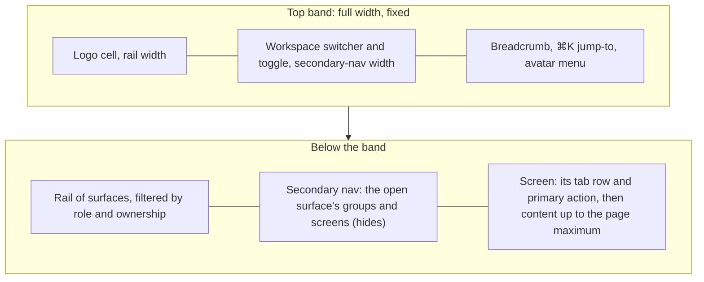
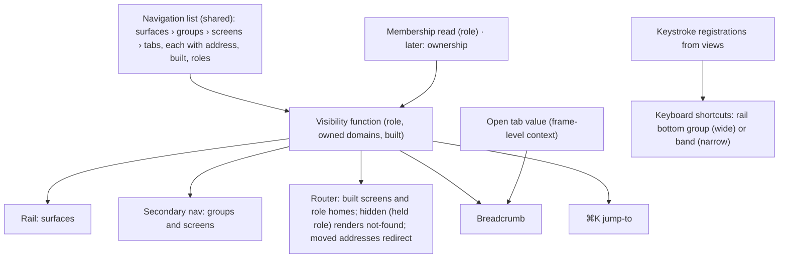
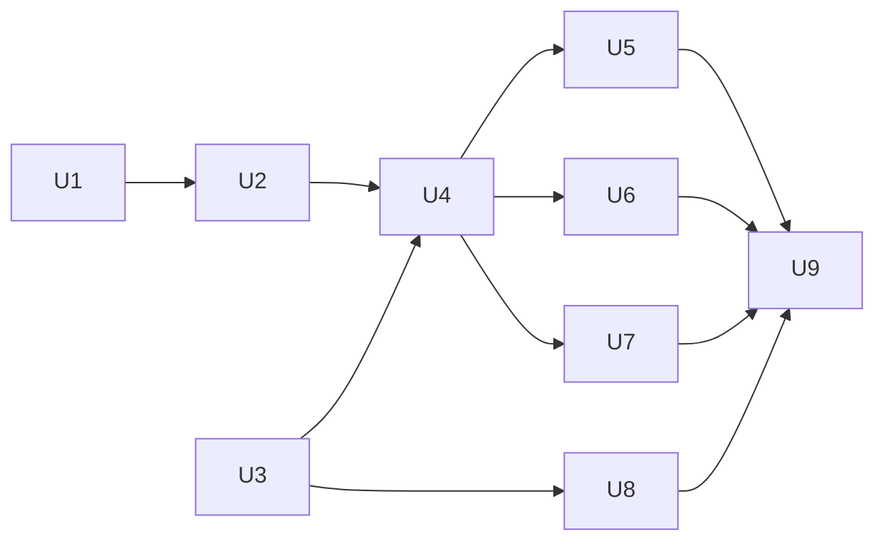

# Shell and Layout Foundations - Plan

## Goal Capsule

- **Objective:** A person on any workspace screen always knows where they are, and gets where they are going in one move. The sidebar toggle stays where it is when the nav hides. The rail shows only the surfaces their role or ownership can use and only what is built. Tables get the width they need.
- **Means:** rebuild the shell as a full-width band over a rail of surfaces, driven by one navigation list declaring the platform's surfaces, groups and screens (KTD1, KTD2).
- **Product authority:** the owner's decisions of 30/09/2026, recorded under Key Decisions. The People layout rework, the security and sign-in features, and the glossary rewrite are separate work, not active scope here.
- **Stop conditions:** stop and ask if a guarantee the current shell specs hold cannot be kept under the new layout (rail position, reflow at 320px, focus return, the one stored nav value). Also stop and ask if the structure ADR (U1) and the navigation list (U2) disagree.
- **Execution profile:** one branch and one pull request, units in the order of the dependency graph under Sequencing. The browser suite is the proof for every shell behaviour.
- **Open blockers:** none.

---

## Product Contract

Product Contract preservation: changed. Owner decisions of 30/09/2026, made during planning, replaced the one flat rail with surfaces, groups and screens. R9, R10, R12, R19 and AE2 to AE4 were rewritten. R20 to R23 and AE8 to AE9 were added. R4 and R16 now say "logo", because the glossary's *mark* means the operator's mark. After document review, R19 no longer closes BA-12, whose Editor half waits on Inbox and ownership (owner-approved). R5, R6, R7, R15 and R22 gained the UI designer's recommendations for narrow breadcrumbs, pending and failed states, and moved addresses (owner-requested).

### Summary

The shell gets a full-width top band: the logo, the workspace switcher with the sidebar toggle, the breadcrumb, ⌘K jump-to and the avatar menu. Below it, a rail of surfaces (Ask, Knowledge, Inbox, Control Centre) drives a secondary nav of groups and screens. The rail shows only what the person's role or ownership lets them use, and only what is built. Screens fill the pane up to the page maximum, and text keeps its reading measure. The design system, the decision records and the glossary's shell entries change with it, and the product's name becomes `better-answers`.

### Problem Frame

The gap audit (`docs/dogfood-reports/2026-09-30-docs-shell-people-dogfood-dogfood.md`, scenarios 1 to 9 and 15) measured the shell against the owner's reference shell:

- **The toggle moves.** It sits inside the right-hand column's header, so it moves 248px when the secondary nav hides. The next click then lands on the workspace name.
- **The band has no room.** There is no place for a logo, a workspace switcher, a breadcrumb that links, or search.
- **The rail shows too much.** It lists every screen to every role, and most of what it lists is not built.
- **Tables are cut short.** A prose measure of 68ch caps every screen, so an invitation's email address wraps one character per line.

The structure underneath was also out of line with the platform's intent. The code, ADR 0017 and the glossary made Control Centre's six parts rail entries of their own. The owner's intent is Control Centre as one surface in the rail, whose groups each hold their own screens, as in the ReUI Flux AgentOps template. The v0.1 route planned only what v0.1 builds, so nothing recorded the wider structure. The design system is the source of several of these gaps: its layout constants name only the prose measure, it has no logo, and its shell guidance was never compared with a reference shell.

### Layout

When the secondary nav hides, only the nav leaves the row below the band. The band's cells keep their widths and positions. This is the wide layout, where the band is fixed. Below the breakpoint the band takes two rows and scrolls with the page (R15).

### Key Decisions

- **The band holds the logo, the switcher and toggle, the breadcrumb, ⌘K jump-to and the avatar menu. It has no primary-action slot.** A screen's primary action belongs to that screen. (session-settled: user-directed — chosen over the reference band's primary-action slot: an action is specific to the screen being shown.) Governs R1, R2, R8.
- **⌘K is a jump-to now. Knowledge results join it later.** (session-settled: user-approved — chosen over knowledge search only from S2, or an empty slot: useful from day one, with no dead box.) Governs R7.
- **Screens fill the pane up to the page maximum, and text keeps its measure.** (session-settled: user-approved — chosen over a width declared per view, or no maximum: one rule, and no screen has to declare anything.) Governs R14.
- **The rail holds surfaces: Ask, Knowledge, a work surface, Inbox and Control Centre. Each surface's groups and screens fill the secondary nav.** (session-settled: user-directed — chosen over one flat rail of Control Centre's six parts, over no Inbox, and over curation staying in Control Centre: the rail is surfaces, and Control Centre's groups each hold their own screens.) Governs R9, R20, R19.
- **Control Centre is one Admin surface of eight groups: Overview, Suggestions, Sources, Agent Operations, Questions, People, Personal data and System.** (session-settled: user-approved — chosen over keeping Personal data in People, or folding Questions into Agent Operations.) Governs R20.
- **The suggestion queue lives in Control Centre › Suggestions. A person's Inbox holds their own items and points into the queue.** (session-settled: user-approved — chosen over putting every kind in Inbox: unpublished content is shown to Admins only in Control Centre.) Governs R9, R20.
- **Ownership of a domain grants acts, so a Viewer may own one.** (session-settled: user-approved — chosen over requiring owners to be Editors.) Governs R21.
- **Visibility is decided per screen, by role or by ownership.** (session-settled: user-approved — chosen over filtering whole rail entries only.) Control Centre is Admin-only, so an Editor sees no Questions view there. An Editor who owns the Answer domain reaches the promotions BA-12 named through Inbox. An Editor who owns nothing sees no Questions view. Governs R21.
- **Unbuilt surfaces, groups and screens are hidden. A role's home always shows.** (session-settled: user-approved — chosen over marking unbuilt entries "Soon", or leaving them as today.) Governs R10, R11.
- **An unbuilt or hidden address looks like one that never existed.** (session-settled: user-approved — chosen over keeping unbuilt screens as destinations, as T-225 had them: nobody learns what exists by guessing addresses.) Governs R23.
- **The logo is two square brackets with a square between them, like a citation. It is drawn in this work.** (session-settled: user-directed — chosen over a placeholder tile or an empty cell.) Governs R16.
- **The product's name is `better-answers` everywhere a person reads it.** (session-settled: user-directed — chosen over keeping "Better Answers", or the logo with `better-answers` beside prose that says "Better Answers".) Governs R17, R18, R19.
- **The work surface and Briefings are not declared yet.** The work surface's name waits for S6, which builds its first screen, and Briefings belongs to the Then stage.
- **Console stays a separate surface for the operator alone, reached from the workspace switcher.** It is a place rather than an account setting. Governs R5.
- **Keyboard shortcuts move to the rail's bottom group.** They are the one utility that exists today. Governs R13.
- **Screen words keep the current glossary's terms.** The Guru-aligned rewrite, including "Verified", lands with the pre-S2 glossary rewrite, and changes words, not layout.

### Requirements

**Top band**

- R1. A top band spans the full width of every workspace screen and every Console screen, above the rail and the secondary nav.
- R2. The band's first cell is as wide as the rail and holds the logo. Its second cell is as wide as the secondary nav and holds the workspace switcher and the sidebar toggle. The third cell holds the breadcrumb, ⌘K jump-to and the avatar menu.
- R3. Hiding or showing the secondary nav changes nothing in the band: the toggle, the switcher and every other band element stay at the same position, to the pixel.
- R4. The logo links to the person's home and has the accessible name `better-answers`.
- R5. The workspace switcher names the current workspace and lists every workspace the person is a member of. It takes them to the one they choose, or to the full list. It lists Console to the operator alone. While the list is first read or a switch is pending, and when either fails, the band's outcome line says so in words, with the next step. Each opening reads the list again. When that read fails while a list is held, the held list stands and the band says nothing of it: every workspace in the list can still be chosen, and choosing one the person has left says so and drops it from the list.
- R6. The breadcrumb names the surface, the group, the screen and the open tab, where the place has each. A name repeated by the next part is said once, by the deeper part, so Ask's home reads "Ask" and not "Ask › Ask". Each part except the last links to its place. It stays true when a tab changes. At every width it names every part. Only the wide band's cell truncates the middle parts.
- R7. ⌘K jump-to opens from the band by click and by ⌘K or Ctrl+K, once the person's role is read (KTD5). It finds the surfaces and screens visible to the person, the workspace's members for a person who may see People, and the acts their role may take, such as "Invite a person". It is fully keyboard-operable. A pending or failed members read says so in words and never hides screens or acts.
- R8. The avatar menu shows the person's initials, and opens to their name, their role and "Sign out". A screen's primary action appears in that screen's own row, never in the band.

**Rail and secondary nav**

- R9. The rail lists the surfaces Ask, Knowledge, Inbox and Control Centre. Ask and Knowledge are for every role. Inbox is for anyone who decides something: Admins, and the owners of a domain. Control Centre is for Admins.
- R20. Choosing a surface fills the secondary nav with its groups, each a heading over its screens. A screen may carry tabs. Control Centre's groups are Overview, Suggestions, Sources, Agent Operations, Questions, People, Personal data and System.
- R21. Whether a person sees a screen depends on their role, or on owning a domain the screen serves. A group or surface with no screen the person can see is hidden.
- R10. A surface, group or screen that is not built appears nowhere: not in the rail, the secondary nav or ⌘K. A group or surface with no built screen is hidden whole.
- R11. A role's home appears in the rail even when it is not built, and opens a screen saying plainly that it is on its way. Today that is Ask, for Editors and Viewers. An Admin's home is People › Members until Control Centre › Overview is built.
- R12. The secondary nav lists the open surface's groups and screens, each screen with an icon. The open screen is distinct in greyscale, and no visible heading repeats the rail entry's name.
- R13. The rail has a bottom group for utilities, holding Keyboard shortcuts. It opens the open screen's keystrokes, and `?` still does the same.
- R22. A screen that moved keeps its old address. For a person who may see the screen, the old address leads to its new place. For anyone else it behaves as R23 says, and the address never changes.
- R23. An address that is not built, or that the person may not see, shows the same not-found screen as an address that never existed, and offers the person's home.

**Width**

- R14. A screen's content fills the pane up to the design system's page maximum. Paragraphs and headings keep the prose measure, and a table or form uses the width it is given.

**Narrow viewports**

- R15. Below the wide breakpoint, the band's first row keeps the button that opens the rail and secondary nav as a sheet, the logo, the workspace switcher, a ⌘K trigger, the Keyboard shortcuts trigger and the avatar menu. Its second row holds the breadcrumb (R6), which wraps and never truncates. Below the breakpoint the band scrolls with the page. Nothing scrolls sideways at 320px, and the skip link, focus return and remembered nav state still work as they do today.

**Brand and records**

- R16. The logo exists as an SVG in the design system's assets. It is used in the band, on the sign-in screens and as the browser's tab icon.
- R17. `better-answers` replaces "Better Answers" on every surface a person reads: web screens, the browser tab title, the api's auth pages, and the sign-in code and invitation emails, including their sender name.
- R18. The design system's readme and guideline cards describe this shell: the band and its cells, the width rule of R14, the logo and the name. The line that says there is no logo is removed, and the shell guidance matches R1 to R15.
- R19. A new ADR records the platform's structure of surfaces, groups and screens, including what is not built. ADR 0017 and ADR 0046 are edited to match, in the same change that ships it. `CONTEXT.md`'s entries for the product's name, the surfaces and the shell's regions and levels are updated. BA-12's role filter is delivered by this work. Its Editor half (deciding through Inbox and ownership) stays open until Inbox and ownership are built.

### Acceptance Examples

- AE1. **Covers R3, R14.** **Given** an Admin on People · Members at 1440px with the secondary nav shown, **when** they click the toggle twice, **then** the toggle is at the same position before, between and after the clicks. The screen's pane widens, then narrows, by the nav's width. The table takes the added width up to the page maximum, so at 1440px it widens by less than the nav's width.
- AE2. **Covers R9, R10, R11.** **Given** today's build, **when** a Viewer or an Editor signs in, **then** their rail shows Ask alone and they land on Ask's "on its way" screen.
- AE3. **Covers R9, R10, R20.** **Given** today's build, **when** an Admin signs in, **then** their rail shows Control Centre alone. Its secondary nav shows Sources (Bindings), Agent Operations (Routes and spend), People (Members, Groups) and System (Audit log), and they land on People › Members.
- AE4. **Covers R7, R10, R21.** **Given** a Viewer, **when** they press ⌘K and type "people", **then** nothing from People appears. **Given** an Admin, **when** they type "invite", **then** "Invite a person" appears, and choosing it opens the invite act on Members.
- AE5. **Covers R5.** **Given** the operator, a member of two workspaces, **when** they open the switcher, **then** it lists both workspaces and Console. **Given** any other person, **then** Console is absent.
- AE6. **Covers R14.** **Given** an invitation to a 40-character address, **when** an Admin opens Invitations at 1440px, **then** the address sits on one line, and the screen's description paragraph still wraps at the prose measure.
- AE7. **Covers R15.** **Given** a 320px viewport, **when** a person opens the sheet, chooses a screen and closes the sheet, **then** nothing scrolled sideways at any point, and focus returned to the sheet's button.
- AE8. **Covers R22.** **Given** an Admin with a bookmark to `/people/audit-log`, **when** they open it, **then** they land on System › Audit log at its new address.
- AE9. **Covers R21, R23.** **Given** a Viewer, **when** they open `/people/members` by address, **then** they see the not-found screen offering Ask, exactly as for an address that never existed.

<!-- ce-section: work-relationships -->
### How This Work Fits Together

This plan covers the shell and layout foundations. The breakdown below is the current understanding from the 30/09/2026 gap audit and structure decisions, not a committed roadmap.

- **People layout rework:** filters, row menus, the member detail and audit rows, taken from the Arena blocks' layout.
  - Depends on this plan's shell, structure and width rule.
  - Still to decide: how much of the Arena blocks is layout, and how much is product the owner adopts.
- **Security and sign-in on People:** Microsoft sign-in (BA-14), passkeys and MFA, and how People shows each person's sign-in method.
  - Can proceed independently of this plan.
  - Shares the People screens with the layout rework.
- **Glossary rewrite (pre-S2 architecture review):** the reader's words throughout, including the Guru-aligned trust words and the names of screens.
  - Shares `CONTEXT.md` with R19, which edits only the name, the surfaces and the shell entries.
  - Enables later wording changes on these screens, with no layout change.
- **Each later block that builds a screen:** Overview, Inbox, Knowledge, the work surface (S6), Briefings (Then).
  - Depends on this plan's navigation list: marking a declared screen built makes it appear.

### Scope Boundaries

- **The People layout rework.** It is the next brainstorm, built on this shell.
- **Security and sign-in features.** Microsoft sign-in (BA-14), passkeys, MFA and how People shows them are separate work.
- **The glossary rewrite.** It belongs to the pre-S2 architecture review. This plan edits only the entries R19 names.
- **Building any unbuilt screen.** Overview, Inbox, Knowledge and Ask's views are declared, not built. Ask gets only its "on its way" screen.
- **Knowledge results in ⌘K.** They arrive with S2's retrieval.
- **Ownership itself.** Ownership of a domain lands with S3. Until then the visibility rule of R21 has only roles to read.
- **Utilities beyond Keyboard shortcuts.** Help and settings join the rail's bottom group only when they exist.
- **The git author identity, package names and storage keys.** Commits the platform writes keep their author name, and `better-answers.*` storage keys and package scopes stay. None is read on a screen.

### Deferred to Follow-Up Work

- Redrawing the C4 component view and flows with `/c4-architecture` if the review of this change finds the web component view moved (U9 records what moved).
- Machine-checking the glossary's _Avoid_ words (sidebar, dashboard) on screens. Only three words are checked today.

### Dependencies / Assumptions

- The logo's final form is the owner's description: two square brackets with a square between them. The SVG drawn here is the logo, unless the owner replaces it.
- Screen wording follows `CONTEXT.md` as edited by U1. The glossary rewrite may rename words on these screens later without changing their layout.
- ADR 0046's remaining open question stays open: an Editor's home once question sets land.

### Sources / Research

- `docs/dogfood-reports/2026-09-30-docs-shell-people-dogfood-dogfood.md`: the gap audit, with the toggle measured at x=324 shown and x=76 hidden.
- `.scratch/ui-visuals/shell-example-menu-open.png` and `shell-example-menu-closed.png` (machine-local): the reference shell, ReUI's app-shell-14 (`https://reui.io/blocks/application/app-shell/app-shell-14`).
- `.scratch/ia-2026-09-30/` (machine-local): the structure research of 30/09/2026. Two first-principles proposals, one from the personas' jobs and one from the objects, plus the inventory of intended capabilities. The structure ADR (U1) records the result.
- `https://flux-agentops.reui.io/`: the Agent Operations reference the owner named.
- `docs/solutions/architecture-patterns/adr-0017-answers-are-retained-correctable-records.md` and `adr-0046-a-reader-surface-beside-control-centre.md`: the decisions this plan moves.
- Linear BA-12: the review of what each role can act on.

---

## Planning Contract

### Key Technical Decisions

- KTD1. **Reshape the existing frame into a two-row grid instead of installing the registry Sidebar.** The band is the first row, and the rail, secondary nav and screen share the second. Only the nav column collapses, so the band's cells never move. The registry Sidebar conflicts with six guarantees the shell keeps:
  - it stores open state in a cookie, where the shell keeps one localStorage value;
  - it binds ⌘B globally;
  - it has its own breakpoint hook, where the shell reads `--shell-wide`;
  - it animates the collapse, where the specs expect the nav gone within 100ms and the lint rule forbids layout animation;
  - its mobile sheet is titled "Sidebar", which the glossary avoids, and it brings lucide icons into a web client that uses Phosphor only;
  - it is one panel, where this shell needs a rail beside a nav under a band.

  The breadcrumb arrives from the registry, and command is already installed. The design system's kits card changes to say so (U3). (session-settled: user-approved — chosen over installing shadcn's Sidebar: six conflicts with current guarantees.) Covers R1, R2, R3, R15.
- KTD2. **One navigation list declares the platform: surfaces, then groups, then screens, then tabs.** It lives in `apps/web/src/shared/`, and every entry carries its address, whether it is built, and the roles (and, from S3, the ownership) that may see it. The rail, secondary nav, router, breadcrumb and ⌘K all read it through one pure visibility function of the person's role, owned domains and built-ness. Role and built-ness filter the list, and never remove entries from it, so T-225's "one list" rule and the both-ways pairing test hold. Covers R9, R10, R20, R21.
- KTD3. **Code names follow the new levels.** Types and helpers become surface, group and screen, where they are surface, screen and view today, across about 40 importers. Code and glossary then say the same thing. (session-settled: user-approved — chosen over keeping today's code names and mapping them.) Covers R19.
- KTD4. **Routes exist for built screens and for each role's home. A screen hidden from a held role renders the not-found screen.** Ask's unbuilt home keeps its address, `/ask`, and draws the "on its way" screen (R11). A route renders the unknown screen when the visibility function, given a held role, says the person may not see it. When the membership read has failed, so no role is held, routes draw as they do today, with the screen's own loading or failed state and never not-found. When the role then arrives, the frame invalidates the router so the open screen's `beforeLoad` runs again with the role in hand. The screen is decided then, as on any arrival, and a role changed after that waits for the next move. A moved screen's old address asks the visibility function first, in the route's `beforeLoad`, after the shell's membership read. It redirects, replacing the history entry, only when the target is visible to the held role. Otherwise it draws the not-found screen as a hidden screen does, or the failed-read state when no role is held. Control Centre groups keep root addresses (`/<group>/<screen>`), so today's bookmarks for People, Sources and Groups are untouched. Only the audit log (to `/system/audit-log`) and routes and spend (to `/agent-operations/routes-and-spend`) move. Covers R10, R22, R23.
- KTD5. **The rail waits for the membership read.** Until the person's role is known, the rail shows no role-gated entry, rather than defaulting to Viewer. Nothing flashes, and nothing hidden is revealed. The index route sends a held role to its home, and an unknown role to the shell's failed-read state rather than a Viewer's home. Jump-to waits for the read too. While no role is held, the band shows no jump-to trigger, ⌘K and Ctrl+K are left to the browser, and the keystrokes list leaves jump-to out. A reduced jump-to would list nothing: every built screen and act is for a role, and no home is known until the role is. `apps/web/test/frame.test.tsx` holds all three. Covers R7, R9, R21.
- KTD6. **Only the open tab's value is lifted above the band.** The tabs root and its view-state slot stay around the toolbar and screen. The tab root renders a different element for tabbed and untabbed screens, so wrapping the frame in it would remount the band, rail and nav on every such move and lose focus. The tabs root writes the picked tab into a frame-level context, and the breadcrumb reads it. Tabs get no address. The tab is the breadcrumb's last part and is not a link. Covers R6.
- KTD7. **Keystrokes register through a shell context in `shared/`, which owns `?` and the keystrokes list at every width.** Views declare their keystrokes to that context instead of placing a Keyboard shortcuts button among their acts. The trigger sits in the rail's bottom group when wide. Below the breakpoint the rail lives inside the sheet, a dialog that the keystroke hook ignores, so the trigger sits in the band's narrow form instead. A registration context is chosen over route static data because Members' list depends on its open tab. A screen that registers nothing still shows the trigger, which says the screen has no keystrokes. Covers R13, R15.
- KTD8. **⌘K is the installed command dialog with its own key listener.** The shared keystroke hook refuses modifier keys, so ⌘K binds its own. Items come from the visibility function, from the members list (read when the dialog opens, Admins only), and from acts the navigation list declares. "Invite a person" navigates to Members with a search parameter the invite act reads to open itself. The members read reuses the Members list's query, so a cached list shows at once, and a person who may not see People sends no members read. The dialog carries its own outcome line between the input and the list, because the dialog hides the band from screen readers. The "nothing matches" line appears only once every group has finished loading. It is budgeted as a list under ADR 0037's one-second budget. Covers R7.
- KTD9. **The switcher uses the auth feature's hooks.** It reads the organisation list and sets the active one through `features/auth`, as the rule *Name Better Auth in one directory* requires. After a switch succeeds it clears every workspace-scoped query and goes to the new workspace's home. A failed switch leaves the current screen and its queries as they were. "All workspaces" goes to `/choose-workspace`, and Console appears for the operator. The band has one standing outcome line, a full-width row inside the header, empty and hidden until used, for the switcher's pending and failed states. It follows the GOV.UK notification-banner pattern named in the rule *Meet WCAG 2.2 AA, tested with a keyboard and a screen reader*, and is never a toast. Its words reuse the picker's (`PICKER_WORDS`, `WORKSPACES_UNREAD`, `PICK_REFUSED`, `noLongerAMember`). Covers R5.
- KTD10. **The width rule lives in the shell and the design system.** The screen's wrapper takes the page maximum. The design system adds a base rule giving paragraphs and headings inside a screen the prose measure. The three off-token `max-w-prose` uses are retired. Covers R14.
- KTD11. **The logo is one SVG in the design system's assets, exported by the package.** The web client imports it for the band, the auth screens and the tab icon. The api's server-rendered pages inline the same SVG, so the api declares the design system as a dependency and its runtime image carries the package. Today the image carries only `packages/core` and `packages/schema`. Covers R16.
- KTD12. **The name lives in one word table per code path.** The web client's `PRODUCT_NAME` feeds screens, the tab title and the specs, which read it rather than pin it (T-441). The api holds its own constant for its pages and emails. Covers R17.

### High-Level Technical Design

The navigation list and what reads it:

The structure declared today:

| Surface | Group | Screens (built today in bold) | Seen by |
|---|---|---|---|
| Ask | (none) | New question · Your questions | every role (home of Editor and Viewer) |
| Knowledge | Browse · Curation | Search · Guides · All knowledge · Checks due · Conflicts · Kinds · Domains and owners · Exports | Browse: every role. Curation: Admins and owners |
| Inbox | (none) | Waiting on you | Admins and owners |
| Control Centre | Overview | Overview | Admin |
| | Suggestions | Queue | Admin |
| | Sources | **Bindings** · Publish and accept gates · Priced plan · Backlogs · Gone-at-source impact · Agent tokens | Admin |
| | Agent Operations | **Routes and spend** · Ceiling | Admin |
| | Questions | Answer audit · Answer tests | Admin |
| | People | **Members** · **Groups** · Tokens | Admin |
| | Personal data | Erasure and suppression | Admin |
| | System | **Audit log** · Signals · Health · Backups | Admin |
| Console (switcher) | People · Workspaces | **Everyone** · **Names waiting** · **Every workspace** | operator |

Screen names are today's words. The structure ADR (U1) records the full target from the research, including screens later blocks add and renames the glossary rewrite may make. This table is what the navigation list declares.

### Assumptions

- The membership read that gives the role stays a single session read, so the rail's wait (KTD5) costs no extra request.
- Views reached from ⌘K by search parameter can open their own acts without new server calls.

### Sequencing

U1 settles the words before code names them. U3 (design system) and U8 (name) can run beside U2.

### Risks

| Risk | Mitigation |
|---|---|
| The browser suite pins the old shell in about 14 specs and 4 unit files. A rewrite could drop a guarantee by accident. | U4's test list maps every current guarantee to the spec that keeps it. Deliberate reversals of T-225 are named, so a reviewer can tell intent from breakage. |
| Hiding by role on the client could be mistaken for access control. | The api still refuses every act by role, unchanged. The client's hiding is navigation only, and AE9's spec asserts the not-found screen, not a refusal. |
| A workspace switch could show the old workspace's cached lists. | KTD9 clears workspace-scoped queries. A spec switches between two seeded workspaces and checks that Members changes. |
| knip, jscpd and the lint rules fail on leftovers from the two-surface code. | U2 deletes the reader-surface helpers outright. New specs share harness helpers instead of repeating sign-in blocks. |

### System-Wide Impact

- **Every web screen** sits in the new frame. Views keep their toolbars, but lose their per-view Keyboard shortcuts button (KTD7).
- **The api** changes only in words: the auth pages, the two emails and the sender name. The api's mutation run covers these files, so the changed strings need asserting tests.
- **The decision records** change: two ADRs edited, one added, and the glossary's shell entries rewritten. The route's line calling Questions "Control Centre's, an Admin's screen" stays true.

---

## Implementation Units

| U-ID | Title | Key files | Depends on |
|---|---|---|---|
| U1 | Record the structure: ADR, ADR edits, glossary | `docs/solutions/architecture-patterns/`, `CONTEXT.md` | — |
| U2 | The navigation list, visibility and router | `apps/web/src/shared/screens.ts`, `apps/web/src/app/router.tsx` | U1 |
| U3 | Design system: logo, width rule, shell guidance | `packages/design-system/` | — |
| U4 | The frame: band, rail, secondary nav, width, narrow sheet | `apps/web/src/app/frame.tsx` and siblings | U2, U3 |
| U5 | Band contents: switcher, breadcrumb, avatar menu | `apps/web/src/app/`, `features/auth` | U4 |
| U6 | ⌘K jump-to | `apps/web/src/app/`, `features/people/invite-act.tsx` | U4 |
| U7 | Keyboard shortcuts in the rail | `apps/web/src/shared/keystrokes.tsx`, views | U4 |
| U8 | The name `better-answers` across web and api | `apps/web/src/shared/words.ts`, `apps/api/src/auth/` | U3 |
| U9 | Docs and skills the change moves | `.claude/skills/browser-suite/SKILL.md`, `docs/architecture/` | U5, U6, U7, U8 |

### U1. Record the structure: ADR, ADR edits, glossary

- **Goal:** the platform's structure and the shell's words are settled in the records before code names them.
- **Requirements:** R19. Governing decisions: the rail-of-surfaces, Control Centre groups, suggestion queue, ownership and visibility Key Decisions.
- **Dependencies:** none.
- **Files:**
  - `docs/solutions/architecture-patterns/adr-0047-the-platform-is-surfaces-groups-and-screens.md` (new)
  - `docs/solutions/architecture-patterns/adr-0017-answers-are-retained-correctable-records.md`
  - `docs/solutions/architecture-patterns/adr-0046-a-reader-surface-beside-control-centre.md`
  - `CONTEXT.md`
- **Approach:**
  1. Write ADR 0047 from `.scratch/ia-2026-09-30/`. It records the rail of surfaces and each surface's groups and screens, marking what is built, v0.1 and later. It also records the decisions of 30/09/2026 (suggestion queue in Control Centre, ownership grants acts, visibility per screen, hidden addresses look absent), the Flux AgentOps mapping, and what stays open: the work surface's name, Search's surface, and the Guru trust words.
  2. Edit ADR 0017: Control Centre is one surface of eight groups, not six screens. Remove the verb-name refusal that Ask now contradicts, and say why.
  3. Edit ADR 0046: the reader surface becomes the Ask surface in one rail. Its "filtered Control Centre" line becomes the decision. Its answer-audit question is answered: Admin-only, with each person's own questions in Ask.
  4. Edit `CONTEXT.md`:
     - the name: `better-answers`;
     - *Control Centre* (eight groups), and *reader surface* (retired to *surface*);
     - the levels *surface*, *group*, *screen*, *tab*, replacing *screen (of Control Centre)* and *view*;
     - *icon rail*, *secondary nav*, *navigation control*, *top bar* (becomes *top band*) and *home*;
     - new entries for *logo*, *workspace switcher*, *breadcrumb* and *jump-to*.

     The existing *mark* entry is untouched.
- **Patterns to follow:** the ADR frontmatter and "The decision / Why / Rejected / History" shape of `adr-0046-a-reader-surface-beside-control-centre.md`. AGENTS.md's rule that a change moving a decision edits its doc in the same commit.
- **Test scenarios:** `Test expectation: none -- decision records and glossary; the docs gate (`pnpm check:docs`) checks their format and the api's avoid-words test reads `CONTEXT.md`.`
- **Verification:** ADR 0047's structure table matches the navigation list U2 declares. `CONTEXT.md` defines every shell word the plan's requirements use. `pnpm check:docs` passes.

### U2. The navigation list, visibility and router

- **Goal:** one list declares the structure, and one pure function decides what a person sees. The router, rail and nav are built from it.
- **Requirements:** R9, R10, R11, R20, R21, R22, R23. Governing decisions: KTD2, KTD3, KTD4, KTD5.
- **Dependencies:** U1.
- **Files:**
  - `apps/web/src/shared/screens.ts` (restructured, or renamed to a navigation module)
  - `apps/web/src/app/router.tsx`, `unknown-screen.tsx`, `failed-screen.tsx`, `go-home.tsx`, `views/unbuilt-view.tsx`, `words.ts`
  - every importer of the list (about 40 across `apps/web/src/app`, `features`, `shared`, `e2e` and `test`; list them with the code index's importer search before starting)
  - tests: `apps/web/test/frame.test.tsx`, `membership-redirect.test.tsx`; `apps/web/test/reader-surface.test.tsx` is replaced by a new `apps/web/test/navigation.test.ts`; `apps/web/e2e/home.spec.ts`, `routes.spec.ts`, `failed-screen.spec.ts`
- **Approach:**
  1. Restructure the list into surfaces, groups and screens as the High-Level Technical Design table declares, with roles per screen and `built` per screen.
  2. Add the visibility function. Its inputs are role (or unknown), owned domains (empty until S3) and the list. It returns the visible tree, with homes shown per R11.
  3. Rebuild the router from the list: a route per built screen and per role home, a redirect per moved address, and a render-time check that sends a screen hidden from a held role to the unknown screen (KTD4).
  4. Delete the two-surface helpers (`READER_SURFACE`, `controlCentreOpensAt`, `acrossFrom` and the like) so knip stays clean.
  5. Ask's home screen, at `/ask`, reuses the unbuilt view with its own "on its way" line.
- **Patterns to follow:** T-225's one-list rule, and the both-ways pairing test in `apps/web/test/frame.test.tsx`. The layering rule: pure list in `shared/`, role read composed in `app/`.
- **Test scenarios:**
  - Covers AE2. The visibility function for Viewer and Editor returns the Ask surface alone, with Ask marked as home.
  - Covers AE3. The visibility function for Admin returns Control Centre with Sources, Agent Operations, People and System, and their built screens only.
  - An unknown role returns no role-gated entries (KTD5).
  - A group whose screens are all unbuilt is absent. A surface whose groups are all absent is absent, unless it holds the role's home.
  - Both ways: every built screen and every role home has a route, and every route belongs to a built screen, a role home or a moved address. Every moved address's target is a built screen.
  - For each moved address, by role: an Admin is redirected to the target, an Editor or a Viewer gets not-found, and an unknown role gets the failed-read state (`navigation.test.ts`).
  - A Viewer opening `/people/audit-log` never sees an address containing `/system/`. The address stays `/people/audit-log`, and the main landmark's aria snapshot equals the one at an address that never existed. An Admin opening it from another screen lands on `/system/audit-log`, and Back returns to that screen (`routes.spec.ts`).
  - An Admin whose membership read failed, at `/people/members`, sees the shell and the screen's failed state, never the unknown screen. This keeps `membership-redirect.test.tsx`'s guarantee that the shell is reached when the read fails.
  - The index route sends a person whose membership read failed to the shell's failed-read state, not to Ask.
  - Covers AE8. `/people/audit-log` redirects to `/system/audit-log`, and `/system/routes-and-spend` redirects to `/agent-operations/routes-and-spend`.
  - Covers AE9. A Viewer at `/people/members` sees the unknown screen offering Ask. Its wording and landmarks are identical to an address that never existed.
  - An unbuilt address such as `/people/thresholds` shows the unknown screen for an Admin.
  - Each role still lands at its home from `/`, and a lost member is sent there (`home.spec.ts` guarantees kept).
- **Verification:** the unit and browser tests above pass. knip reports nothing unused from the old surfaces.

### U3. Design system: logo, width rule, shell guidance

- **Goal:** the design system is the source of the shell's layout, the logo and the name.
- **Requirements:** R14, R16, R18. Governing decisions: KTD10, KTD11.
- **Dependencies:** none.
- **Files:**
  - `packages/design-system/assets/logo.svg` (new), `packages/design-system/assets/README.md`, `packages/design-system/package.json` (export `./assets/*`)
  - `packages/design-system/tokens/spacing.css`, `packages/design-system/tokens/tailwind-bridge.css`, `packages/design-system/styles.css` (the text-measure base rule)
  - `packages/design-system/readme.md`, `packages/design-system/SKILL.md`
  - `packages/design-system/guidelines/kits-adoption.card.html`, `spacing-layout.card.html`, `brand-wordmark.card.html`
- **Approach:**
  1. Draw the logo on a square grid: two square brackets with a filled square between them, stroke weights from the type scale, and `currentColor`. Give it a `<title>` of `better-answers`.
  2. Add the base rule that gives a screen's paragraphs and headings the prose measure, and reconcile the bridge's second `--prose-measure` (60ch) with `--measure-prose` (68ch).
  3. Rewrite the readme's logo section, layout constants and name, and fix the "248px rail" drift: the rail is 56px, and the secondary nav is 248px.
  4. Rewrite the kits card's shell guidance to KTD1 (a hand-built frame, breadcrumb and command from the registry), and the wordmark card to the logo and `better-answers`. Remove the kits card's line that "Sonner replaces our Toast wholesale", which contradicts the no-toast rule.
- **Patterns to follow:** ADR 0033: literals only in the bridge, and tokens everywhere else. The card format of the existing guideline cards.
- **Test scenarios:** `Test expectation: none -- assets, tokens and prose; U4 and U8 assert the logo, the name and the width rule in the browser.`
- **Verification:** the package exports the logo. The readme and cards describe R1 to R15 with no mention of a missing logo or "Better Answers".

### U4. The frame: band, rail, secondary nav, width, narrow sheet

- **Goal:** the shell's layout matches the reference shell, and every guarantee of today's shell survives.
- **Requirements:** R1, R2, R3, R4, R9, R11, R12, R14, R15, R20. Governing decisions: KTD1, KTD2, KTD10.
- **Dependencies:** U2, U3.
- **Files:**
  - `apps/web/src/app/frame.tsx`, `top-bar.tsx` (becomes the band), `icon-rail.tsx`, `secondary-nav.tsx`, `navigation-control.tsx`, `console-frame.tsx`, `toolbar.tsx`
  - `apps/web/src/index.css`
  - `apps/web/src/features/people/audit-log-view.tsx`, `features/people/requests-tab.tsx`, `features/auth/auth-screen.tsx` (retire `max-w-prose`)
  - tests: `apps/web/e2e/frame.spec.ts`, `console.spec.ts`, `accessibility-gate.spec.ts` (fixture only), `apps/web/test/frame.test.tsx`, `console-frame.test.tsx`, `failed-screen.test.tsx`, `secondary-nav-showing.test.tsx`
- **Approach:**
  1. Rebuild `Frame` as KTD1's two-row grid:
     - Band cells are sized by the rail and sidebar tokens.
     - The nav column hides with `hidden`, as today, so the toggle still names its region.
     - The rail lists visible surfaces, with the bottom group slot for U7.
     - The secondary nav shows groups as headings over screens with icons, and has an accessible name but no visible heading. A surface whose only visible screen is an unbuilt role home lists that home as its one entry, and the toggle works as for any surface.
  2. The logo cell links home. The toggle stays in cell 2 at every nav state. The workspace name truncates with an ellipsis inside cell 2 and keeps its full name as its accessible name, so a long name can never move the toggle.
  3. The screen wrapper takes the page maximum (KTD10).
  4. Narrow viewports keep today's sheet, which holds the rail and secondary nav. The band's narrow form keeps R15's controls in its first row. When narrow, the breadcrumb row renders after the band's controls through the frame's existing `wide` branch, so focus order matches reading order.
- **Execution note:** Rewrite the shell specs first against the new structure, and keep every current guarantee as an assertion before changing `frame.tsx`.
- **Patterns to follow:** today's `navigation-control.tsx` sheet and focus handback; `secondary-nav-showing.ts`'s single stored value; `wide-layout.ts` for the breakpoint.
- **Test scenarios:**
  - Covers AE1. At 1440px the toggle's box is identical before, between and after two clicks. Main's width grows by the nav's width, the table's by that width up to the page maximum, and the rail stays to the pixel.
  - With a 60-character workspace name, the toggle's box is the same as with a short name, and the switcher's accessible name is the full name.
  - Covers AE2. A Viewer's secondary nav lists Ask's home as one entry, carrying `aria-current`.
  - The band spans the viewport's width above the rail, and its first cell's width equals the rail's.
  - Tab order runs skip link, band (logo, switcher, toggle, breadcrumb, ⌘K, avatar), rail, secondary nav, toolbar, then screen. This deliberately reverses T-225 story 23's order.
  - The secondary nav's aria snapshot shows group headings and built screens only. The open screen carries `aria-current` and a bold glyph.
  - The remembered nav state is still one stored value with no personal data.
  - Covers AE7. At 320px nothing scrolls sideways with the sheet open or closed. Escape and choosing a screen both return focus to the sheet's button, and widening focuses the toggle.
  - At 320px, for an Admin on People › Members with Invitations open and a 60-character workspace name, the breadcrumb row lists Control Centre, People, Members and Invitations with nothing clipped. The last part carries `aria-current="page"`, and `documentElement.scrollWidth` is at most 320.
  - At 320×256, tabbing from the top of the page to the last member row runs through the band's first-row controls, the breadcrumb links, the toolbar and the screen. No focused element's box overlaps the band's.
  - Covers AE6. At 1440px an invitation address of 40 characters sits on one line, and the screen's description paragraph is no wider than the prose measure.
  - A view that throws leaves the band, rail, nav and landmarks standing.
  - The accessibility gate passes with the nav open, with it closed, and with the sheet open.
  - Console draws in the same frame: its rail holds its screens, and its band shows "Console" in place of a workspace.
- **Verification:** `apps/web` check passes, including the browser suite. The dogfood report's scenarios 1 to 3 and 7 to 9 pass on a re-walk.

### U5. Band contents: switcher, breadcrumb, avatar menu

- **Goal:** the band names where the person is and lets them change workspace or leave.
- **Requirements:** R5, R6, R8. Governing decisions: KTD6, KTD9.
- **Dependencies:** U4.
- **Files:**
  - `apps/web/src/app/workspace-switcher.tsx` (new), `breadcrumb.tsx` (new), `top-bar.tsx`
  - `apps/web/src/shared/ui/breadcrumb.tsx` (registry arrival) and `apps/web/src/shared/ui/THIRD_PARTY_NOTICES.md`
  - `apps/web/src/features/auth/auth-hooks.ts` (a hook for a switch that also clears workspace queries)
  - `apps/web/src/app/toolbar.tsx` and `shared/view-toolbar.tsx` (the open tab's value written to a frame-level context, per KTD6)
  - tests: `apps/web/e2e/frame.spec.ts`, `console.spec.ts`, `sign-out.spec.ts`, `apps/web/e2e/harness.ts` (`signOutFromTheShell` keeps locating the avatar button by full name)
- **Approach:**
  1. The switcher is a menu button over the auth feature's organisation list. The person's workspaces come first, then "All workspaces" to `/choose-workspace`, then Console for the operator.
  2. The breadcrumb reads the visible tree and the open tab's value. The surface part links to the person's home on that surface, or its first visible screen. A group part links to the group's first visible screen. A surface with no group shows surface, screen and tab only. When the parts outgrow the cell, the middle parts truncate before the last one, and nothing moves the toggle.
  3. The avatar button shows initials, and its accessible name keeps the person's full name, so the existing locators hold. Its menu is the name, the role and "Sign out".
  4. Record the breadcrumb's arrival the way `THIRD_PARTY_NOTICES.md` records others: extension imports, no `"use client"`, and `cn` repointed.
- **Patterns to follow:** `features/auth/choose-workspace-screen.tsx` for the list and the switch. The existing non-modal `DropdownMenu` in `top-bar.tsx`.
- **Test scenarios:**
  - Covers AE5. The operator's switcher lists both seeded workspaces and Console, and another member's lists no Console.
  - Switching from workspace A to B lands on B's home, and Members then lists B's members, not A's.
  - "All workspaces" opens `/choose-workspace`.
  - On People › Members with the Invitations tab open, the breadcrumb reads Control Centre › People › Members › Invitations. Choosing Requests updates the last part.
  - Each breadcrumb part except the last is a link to its place, and the last carries `aria-current`. On Control Centre before Overview is built, the surface part links to People › Members. On Ask, the breadcrumb has no group part.
  - Going from Members to Groups through the rail keeps the band, rail and nav mounted, and focus stays on the chosen link.
  - The avatar shows initials, its menu shows name and role, and "Sign out" signs out (`sign-out.spec.ts` kept).
  - The avatar button's accessible name contains the full name.
  - With the operator's workspace list held back, opening the switcher shows the current workspace, "All workspaces", Console and the reading line. The second workspace appears without the menu closing.
  - A switch to workspace B refused for no membership announces that the person is no longer a member of B in the band's outcome line. Focus is back on the switcher, the address and Members' rows are still A's, and B is gone when the switcher opens again.
  - While a switch to B is pending, opening the switcher again still says so in the outcome line, and every workspace in the menu is disabled. No second switch starts, and when B refuses, the outcome line says so.
- **Verification:** the specs above pass, and the accessibility gate passes with each menu open.

### U6. ⌘K jump-to

- **Goal:** anyone reaches any screen, member or act they may use by name from the keyboard.
- **Requirements:** R7. Governing decisions: KTD8.
- **Dependencies:** U4.
- **Files:**
  - `apps/web/src/app/jump-to.tsx` (new), `apps/web/src/app/words.ts`
  - `apps/web/src/features/people/invite-act.tsx` (opens from a search parameter)
  - `apps/web/src/shared/screens.ts` (acts declared on screens)
  - tests: `apps/web/e2e/jump-to.spec.ts` (new), `apps/web/test/jump-to.test.tsx` (new)
- **Approach:**
  1. The dialog opens from the band trigger or ⌘K/Ctrl+K, with `preventDefault` so the browser's search does not open.
  2. Groups: screens (visible tree), members (Admins, read on open), and acts. Every item has a unique value, and a pending read says so in words.
  3. Choosing an item navigates. For "Invite a person", the invite act reads the parameter, opens its dialog, and clears the parameter. Focus returns to the band trigger when the dialog closes without choosing.
- **Patterns to follow:** `apps/web/src/shared/ui/command.tsx`. ADR 0037's list budget and the browser-suite skill's in-page timing.
- **Test scenarios:**
  - Covers AE4. A Viewer typing "people" gets no People screen and no members group.
  - Covers AE4. An Admin typing "invite" gets "Invite a person", and choosing it opens the invite dialog on Members.
  - ⌘K and Ctrl+K both open it from any screen, and Escape closes it and returns focus.
  - An Admin typing a member's name opens Members with that person findable.
  - An unbuilt screen's name finds nothing.
  - The list draws within ADR 0037's one-second budget, asserted in the page.
  - With an Admin's members read held back, typing "invite" shows "Invite a person" as choosable and the members reading line, and "Nothing matches" never appears. When the read fails, the failure line announces itself and screens are still listed.
  - When a Viewer opens ⌘K, no members request is sent.
- **Verification:** the specs pass, and the accessibility gate passes with the dialog open.

### U7. Keyboard shortcuts in the rail

- **Goal:** one Keyboard shortcuts act in the rail lists the open screen's keystrokes.
- **Requirements:** R13, R15. Governing decisions: KTD7.
- **Dependencies:** U4.
- **Files:**
  - `apps/web/src/shared/keystrokes.tsx`, `apps/web/src/app/icon-rail.tsx`, `apps/web/src/app/top-bar.tsx` (the narrow trigger)
  - views that place `KeystrokesAct` today: `features/sources/bindings-view.tsx`, `features/people/members-view.tsx`, `groups-view.tsx`, `audit-log-view.tsx`, `features/console/everyone-view.tsx`, `names-waiting-view.tsx`
  - tests: `apps/web/test/keystrokes.test.tsx`, `apps/web/e2e/people.spec.ts`, `people-groups.spec.ts`, `people-invitations.spec.ts`, `sources.spec.ts`, `console-people.spec.ts`, `apps/web/e2e/harness.ts` (`keystrokesListed`, `keystrokesDismissed`)
- **Approach:** views register their keystrokes (Members' list depends on the open tab) with the shell context. The context owns `?`, the list and the WCAG 2.1.4 switch that turns single-key keystrokes off, at every width. Its trigger renders in the rail's bottom group when wide and in the band when narrow (KTD7). The auth screens outside the shell keep their own act.
- **Patterns to follow:** today's `KeystrokesAct` popover and its focus handback.
- **Test scenarios:**
  - On Members, the rail's Keyboard shortcuts lists Members' keystrokes. On the Invitations tab it lists that tab's.
  - `?` opens the same list, and Escape returns focus to the rail button.
  - Moving from Members to Groups changes the list.
  - No toolbar holds a Keyboard shortcuts button any more.
  - At 320px, `?` opens the list from the band's trigger, and Escape returns focus to that trigger.
  - On Ask's "on its way" home and on the not-found screen, the trigger and `?` both say the screen has no keystrokes.
  - The switch that turns single-key keystrokes off still works from the shell's list.
  - The sign-in screen still has its own Keyboard shortcuts.
- **Verification:** the specs pass, and the rule *Give every common action a keystroke* holds on every built screen.

### U8. The name `better-answers` across web and api

- **Goal:** every place a person reads the product's name says `better-answers`, with the logo where the name stood alone.
- **Requirements:** R16, R17. Governing decisions: KTD11, KTD12.
- **Dependencies:** U3.
- **Files:**
  - `apps/web/src/shared/words.ts`, `apps/web/index.html` (title and icon link), `apps/web/src/features/auth/auth-screen.tsx`, `features/auth/workspace-words.ts`
  - `apps/api/src/auth/pages.ts`, `apps/api/src/auth/auth.ts`, `apps/api/src/trpc/invitation-email.ts`, `apps/api/src/main.ts`
  - `apps/api/package.json` (depends on the design system for the logo), `apps/api/Dockerfile` (the runtime stage carries `packages/design-system`)
  - tests: `apps/web/e2e/sign-in.spec.ts`, `apps/api/tests/members-invitations.test.ts`, `members-requests.test.ts`, `avoid-words.test.ts`, `apps/api/tests/image.test.ts` (three carried workspace libraries, not two), `apps/api/tests/fixtures/web-build/index.html`
- **Approach:**
  1. Change the one web constant, and have `document.title` and every spec read it.
  2. The auth screens' banner shows the logo with the name.
  3. The api gains one name constant, used by the pages (title suffix and refusal line, with the logo inlined), by the code email's subject, by the invitation email, and by the sender name.
  4. Adjust the avoid-words test's permitted-sense pattern to the new name.
- **Patterns to follow:** T-441's rule that specs read words from the word table. ADR 0034's consent-page suites reading the pages' words.
- **Test scenarios:**
  - The sign-in banner's text is the word table's name, and it shows the logo.
  - The browser tab's title is the name.
  - The sign-in code email's subject and the invitation email's subject and body carry the name, and the sender reads `better-answers`.
  - The consent and refusal pages' title suffix is the name.
  - No visible "Better Answers" remains in `apps/web/src` or `apps/api/src` (a test searches the word tables and pages).
  - The api image test finds the design system's package and logo in the runtime image.
- **Verification:** the api and web suites pass, and the api's mutation run finds the changed strings asserted.

### U9. Docs and skills the change moves

- **Goal:** the repo's guides describe the new shell.
- **Requirements:** R18, R19 (the records beyond U1 and U3).
- **Dependencies:** U5, U6, U7, U8.
- **Files:** `.claude/skills/browser-suite/SKILL.md`, `apps/web/CODING_STANDARDS.md` (if it names the old regions), `docs/architecture/README.md` and `docs/architecture/c4-containers.md` (only where they name the reader surface), and `apps/web/test/browser-suite-skill.test.ts` (it checks the skill's file references).
- **Approach:** update the skill's locators section (the band, the rail of surfaces, the jump-to) and every spec or helper path it cites. Record in `docs/architecture/README.md` what moved, so `/c4-architecture` can redraw after review.
- **Test scenarios:** `Test expectation: none -- documentation; `apps/web/test/browser-suite-skill.test.ts` already fails if the skill cites a missing file.`
- **Verification:** the browser-suite skill test passes, and no doc names the reader surface or the person menu's crossing links.

---

## Verification Contract

| Gate | Command | Proves |
|---|---|---|
| Whole repo | `pnpm check` | every workspace's types, tests and browser suite, plus the gates |
| Web client | `pnpm check:web` | typecheck, unit tests and the browser suite (U2, U4 to U7, U8) |
| Api | `pnpm check:api` | auth pages, emails and the avoid-words test (U8) |
| Gates | `pnpm check:gates` | format, lint (layering, react-doctor, comment rules), jscpd and knip |
| Docs | `pnpm check:docs` | ADR and glossary format and the avoid-words test (U1, U3, U9) |
| Mutation | the api's mutation workflow on the pull request | changed api strings are asserted (*Triage the nightly mutation summary, never the score*) |

Each browser spec that proves a screen's behaviour asserts its ADR 0037 budget.

---

## Definition of Done

- Every requirement R1 to R23 is met, and each acceptance example AE1 to AE9 has a passing test that names it.
- `pnpm check` passes locally and in CI.
- The dogfood report's shell scenarios 1 to 9 pass on a re-walk against the reference shell. Scenario 6 is judged against the band Key Decision, which has no primary-action slot. Scenario 15 passes for the address wrapping alone (AE6), and its status tabs, search and row menu are left to the People layout rework.
- ADR 0047 exists, ADR 0017 and ADR 0046 are edited, and `CONTEXT.md` defines every shell word used on screen, all in the same pull request as the code.
- The pull request references BA-12 (`Refs: BA-12`), not `Fixes`. BA-12 is updated to record that the role filter shipped and that its Editor half waits on Inbox and ownership.
- No code from abandoned approaches remains: no unused two-surface helpers, no registry Sidebar files, no leftover `max-w-prose`.
