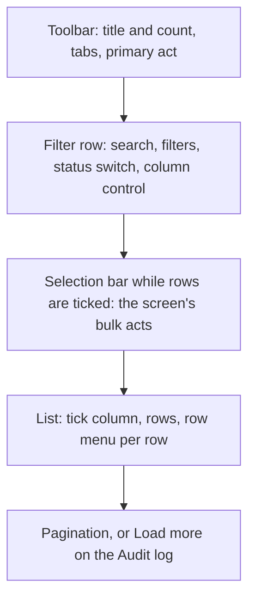
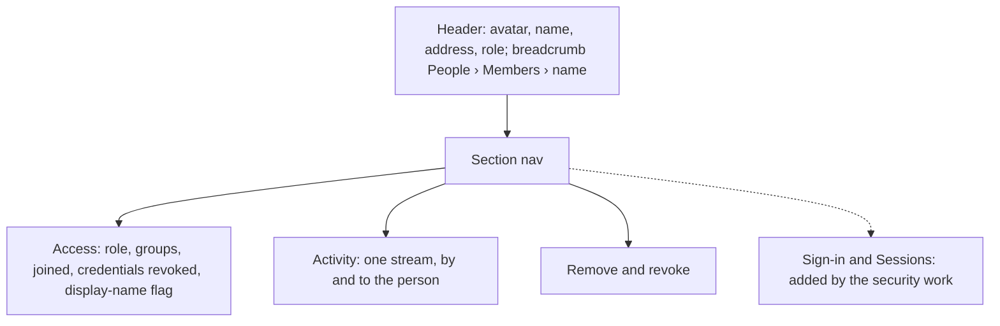
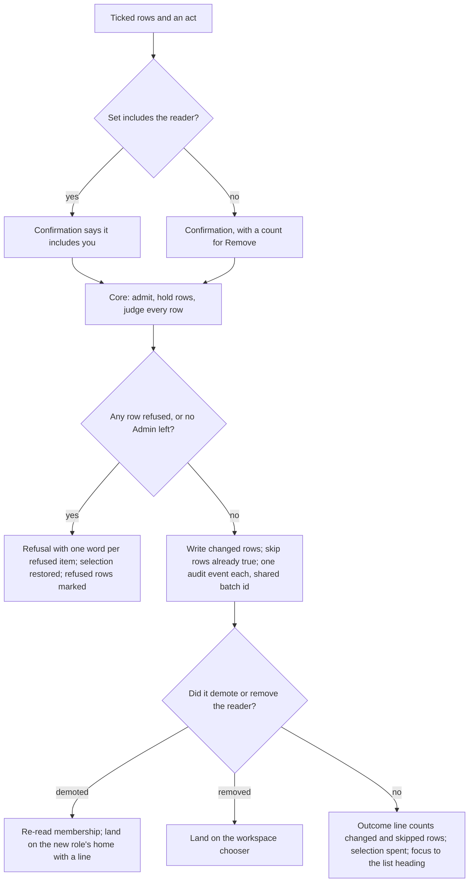
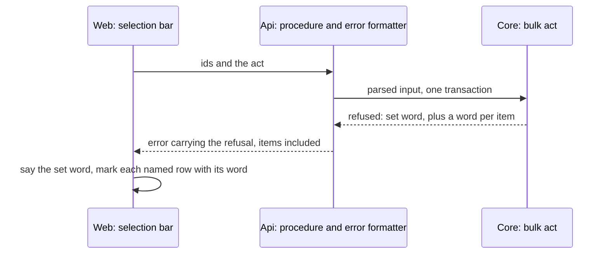
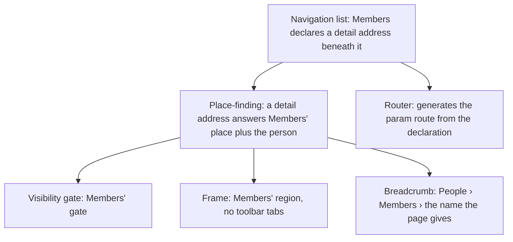
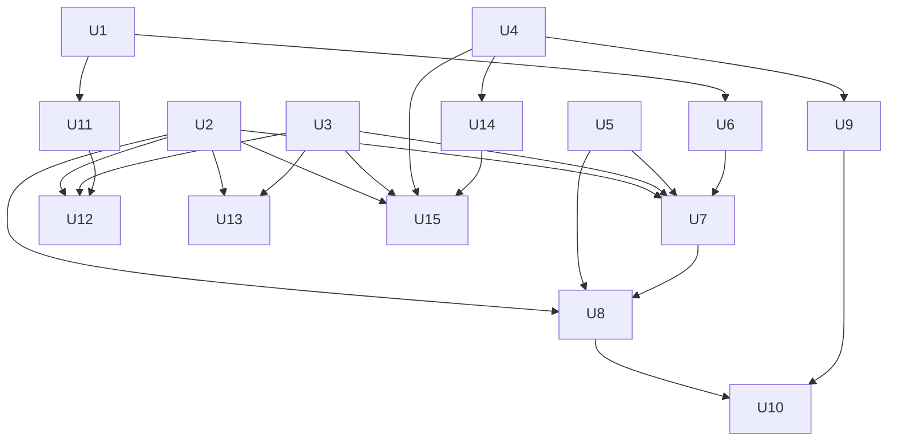

# People Layout Rework - Plan

## Goal Capsule

- **Objective:** A workspace Admin sees who has access and acts on it quickly, for one person or many, on every People screen and in the Audit log. Every list behaves the same way.
- **Means:** rebuild People's screens and System › Audit log on shared list parts drawn to the Arena blocks' look (KTD7), with all-or-nothing bulk acts (KTD2) and a member page declared beneath Members (KTD3).
- **Product authority:** the owner's decisions of 01/10/2026, recorded under Key Decisions. The Product Contract wins on behavior, and a KTD wins on mechanism within it. Security and sign-in (BA-14, passkeys, MFA), the Account page, People › Tokens and the glossary rewrite are separate work, not active scope here.
- **Stop conditions:** stop and ask the owner in any of these cases:
  - A requirement turns out to need a concept that ADR 0038 rejects.
  - One of the console's list specs has to change in order to pass.
  - A shared part cannot come from an Arena block, a Kibo pattern or a shadcn primitive without a hand-built piece this plan does not name.
  - The per-item refusal (KTD1) cannot be added without a refusal crossing as a success answer.
  - Recording an export's literal search text is wanted. That would amend ADR 0035, under which the audit log holds ids, never a name or an email.
- **Execution profile:** the first pull request carries U1 to U5 and U9. Four streams then run in parallel worktrees, one pull request each, and merge in any order:
  - Members and the member page: U6, U7, U8, U10.
  - Invitations: U11, U12.
  - Requests and Groups: U13.
  - Audit search and the Audit log: U14, U15.

  CI's `check` is the arbiter, and the browser suite is the proof for every screen.
- **Who finishes:** `ce-work` builds each stream, `ce-code-review` and Cubic review each pull request, and the merge queue lands it.
- **Open blockers:** none.

---

## Product Contract

Product Contract preservation: changed. Planning research of 01/10/2026 corrected R3, R5, R15, R17, R19 and R20:
- The console lists already use the shared table.
- More acts in the band scroll a 320px screen sideways.
- Today's display-name flag must stay.
- Removing yourself needs its own landing.
- Invitations is already a tab.

R27 to R36 were added for the owner's accepted defaults and the recorded export. R37 was added from the document review, for the owner's choice on ticks across pages. R36 was reworded from "starts when the person joined" to the person's whole history in this workspace, by the owner's choice after the review found request and earlier-membership events the old wording excluded. AE1 and AE2 were sharpened, and AE8 to AE12 added. The brainstorm's four deferred questions are resolved in KTD4, KTD8, KTD11 and KTD14. The security review then changed R34 and AE11: the export records the people and groups its search matched, by id, not the text typed. ADR 0035 keeps names and emails out of the audit log, and erasure could not reach typed text.

### Summary

People › Members, a member's own page, Invitations, Requests, Groups and System › Audit log are rebuilt to the Arena blocks' layout and look. ADR 0038's data model is unchanged. New shared list parts come first: filters, search, row menu, selection with a selection bar, pagination, and the restyled table and sheet. The screens then move onto them in parallel, and the operator console's two lists pick them up too. A member opens as a page with Access, Activity, and Remove and revoke. The lists gain bulk acts that apply to everyone ticked or to no one, and every export of the Audit log is recorded.

### Problem Frame

The 30/09/2026 gap audit (`docs/dogfood-reports/2026-09-30-docs-shell-people-dogfood-dogfood.md`, findings 13 to 18) walked People as the Founder-Operator and the Knowledge Curator, against the Arena blocks:

- **Members** has no role or status filters, no bulk select, no row menu, no pagination, no avatars and no column control. The page title and count sit apart from the primary act.
- **A member** opens as a sheet with a role radio, group checkboxes and revoke. There is no history of what the person did or what was done to them.
- **Invitations** has no status tabs and no search. Resend and Cancel are buttons on each row, not a row menu.
- **Groups** puts the create form above the list.
- **The Audit log** has a family filter and a Details disclosure, but no search, no export, and no sentence per event.

T-027 ported the Arena blocks' behavior in September, but it left out their stylesheet and much of their layout. Members, Groups and the console's two lists draw on one shared table (`apps/web/src/shared/grid-table.tsx`). Invitations and Requests draw on another list, and the Audit log draws on the bare table primitive, so the lists already differ from one another.

### Layout

A list screen, as Members, Invitations, Requests, Groups and the Audit log will draw it:

A member's page:

### Key Decisions

- **Layout and look only. ADR 0038 stands.** Arena's plural roles, custom roles, teams, member statuses, time-boxed requests and audit severity are not built. (session-settled: user-directed — chosen over adopting some Arena concepts now, or reopening ADR 0038 first: the aim is that the People screens work correctly on the model already decided.)
- **The styling lands in shared parts.** The console's two lists follow them. (session-settled: user-approved — chosen over restyling the People screens only, or every surface now: one look, and later screens inherit it.) Governs R1, R2, R3.
- **Ready-made parts first.** (session-settled: user-approved — chosen over building parts from scratch, or taking Kibo's data-table code: the registries are already the rule under ADR 0033, and the Arena blocks are already on the table library the web pins.) Governs R4.
- **Move today's screens onto the shared parts. Do not port the Arena blocks again.** (session-settled: user-approved — chosen over re-porting Arena's block files, or one list screen that each screen configures: this keeps today's tested behavior and the toolbar seam, and the Audit log and Groups fit a single configured grid badly.) Governs R1, R5.
- **Cover every screen, built in parallel after the shared parts.** (session-settled: user-directed — chosen over shipping a smaller first slice: the People screens are a core part of the system, and all of them must work correctly.) Governs R1.
- **A member opens as a page, not a sheet.** (session-settled: user-directed — chosen over a sheet, or a sheet that links to a page: there is room for Activity now and for the security sections later.) Governs R13, R14.
- **The member page carries Access, Activity, and Remove and revoke.** (session-settled: user-approved — chosen over adding Sessions now, or restyling the existing sections only: Sign-in and Sessions belong to the security work.) Governs R15, R16, R17, R18.
- **Activity is one stream: acts by the person and acts done to them.** (session-settled: user-approved — chosen over showing only acts done to them, or only acts they took.) Governs R16.
- **Activity covers the person's whole history in this workspace.** (session-settled: user-approved — chosen over cutting it off at the current join: who approved their request and any earlier membership stay on the page.) Governs R36.
- **Bulk acts on Members and Invitations.** (session-settled: user-directed — chosen over leaving any of them single-row only: change role, add to group and remove on Members; resend and cancel on Invitations.) Governs R10.
- **A bulk act applies to everyone ticked or to no one.** (session-settled: user-approved — chosen over applying the allowed changes and skipping the refused ones: no half-done states to explain.) Governs R11.
- **Rows already true are skipped, and a set that would leave no Admin is refused as a whole.** (session-settled: user-approved — chosen over refusing the whole set when one row is already true, and over naming whichever Admin came last: one person already in a group would otherwise refuse every add.) Governs R27, R28.
- **Ticks survive page and filter changes, and the bar says how many are hidden.** (session-settled: user-approved — chosen over clearing ticks on any change of page, search or filter: a bulk act can then reach past one page of 25.) Governs R37.
- **Bulk acts sit in a selection bar above the list.** (session-settled: user-approved — chosen over the toolbar: more acts in the band scroll a 320px screen sideways.) Governs R5.
- **Acting on yourself is announced, and lands somewhere defined.** (session-settled: user-approved — chosen over letting the screen turn into the not-found screen with no word.) Governs R29, R30.
- **Invitation statuses are a switch in the filter row.** (session-settled: user-approved — chosen over status tabs: Invitations is already a tab.) Governs R19, R20.
- **The invite dialog takes several addresses.** (session-settled: user-approved — chosen over one address per invite: it matches Arena's block 4 and the bulk acts.) Governs R21.
- **A multi-address invite folds duplicates, names members, and re-sends waiting invitations.** (session-settled: user-approved — chosen over refusing the whole send for any of them.) Governs R31, R32, R33.
- **Exports are recorded.** (session-settled: user-approved — chosen over leaving exports unrecorded, like other reads: the workspace can show who took personal data out.) Governs R34.
  - Conflict call-out: the owner approved recording "which search and filter". ADR 0035 forbids storing typed text that may hold a name or email, so R34 records what the search matched, by id. Storing the literal text is a stop condition.
- **⌘K's member results open the member page.** Today they open Members filtered to that person's address, and the page is now the better place to land. Governs R14.
- **Back from a member page returns to the same rows.** Governs R35.

### Requirements

**Shared list parts**

- R1. Members, Invitations, Requests, Groups and the Audit log draw on one set of shared list parts: the table, search, filters, sort, column control, the row menu, row ticking with a selection bar, pagination or Load more, empty states, and the sheet.
- R2. The shared parts take the Arena blocks' look, built from the design system's tokens, and no screen restyles a shared part locally.
- R3. The operator console's Everyone and Names-waiting lists, already on the shared table, pick up its restyle, and every behavior their specs hold today is kept.
- R4. Each shared part names its source: an Arena block, a Kibo UI pattern or a shadcn primitive. A part is hand-built only when none of the three covers it, and the plan says why. Kibo's data-table patterns are a layout reference only, because they are written against `@tanstack/react-table` v8 and ADR 0033 holds the web on v9.
- R5. A screen's tabs and primary act sit in its toolbar. Its bulk acts sit in a selection bar above the list while rows are ticked.
- R35. A list's search, filters, sort, status and page are kept in the screen's address, so Back from a member page returns to the same rows.

**Members**

- R6. The Members screen shows its title and the member count beside its primary act, Invite people.
- R7. Each row shows the person's initials avatar, name and address, role, groups and when they joined. Columns can be sorted and hidden.
- R8. An Admin searches by name or address, and filters by role and by group.
- R9. Each row's menu offers Open, Change role, Add to group and Remove.

**Bulk acts**

- R10. Ticking rows on Members offers Change role, Add to group and Remove. Ticking rows on Invitations offers Resend and Cancel.
- R11. A bulk act applies to every ticked row or to none. If any row is refused, nothing changes, and the refusal names each refused person and the reason.
- R27. A ticked row whose change is already true, such as a person already in the group, is skipped rather than refused, and the outcome counts it.
- R28. A set that would leave the workspace with no Admin is refused, and the refusal names every ticked Admin.
- R37. Ticks survive changes of page, search and filter. The selection bar says how many rows are ticked and how many of those are not shown, and offers Clear. A bulk act covers every ticked row, and its refusal names each refused person even when their row is not shown.
- R12. Bulk Remove asks for one confirmation, which names how many people it removes.
- R29. When a bulk act or a member-page act includes the acting Admin, its confirmation says so.
- R30. After demoting themself, the Admin lands on their new role's home, with a line saying why. After removing themself, they land on the workspace chooser.

**A member's page**

- R13. A member's page has an address of its own under People › Members, and its breadcrumb reads People › Members › the person's name.
- R14. A row, its menu's Open, and ⌘K's member results all open the member's page.
- R15. Access shows the person's role and groups, when they joined, and when their credentials here were last revoked. An Admin changes the role and the groups there, and flags the person's display name.
- R16. Activity lists the acts the person took and the acts done to them, across all four audit families, newest first, in one stream. Each line says which kind it is, and more lines load on request.
- R36. Activity covers the person's whole history in this workspace, including their access requests and any earlier membership. Invitations sent to them before they joined, their sign-ins, and changes to their own display name are not in it.
- R17. Remove and revoke offers revoking the person's credentials here and removing them from the workspace. Removing someone else returns the Admin to Members.
- R18. The page's sections form a list that the security work extends with Sign-in and Sessions, with no change to the page's layout.

**Invitations**

- R19. Invitations has a status switch in its filter row (Waiting, Accepted, Expired and Cancelled, each with a count) and an address search. An invitation past its seven days that was never accepted counts as Expired.
- R20. Each Waiting or Expired row's menu offers Resend and Cancel. Accepted and Cancelled rows have no acts and cannot be ticked.
- R21. The Invite people dialog takes several addresses and one role, names each invalid address inline before anything is sent, and sends one invitation per valid address. R11 governs the send.
- R31. Addresses repeated in one send, in any letter case, fold into one invitation.
- R32. An address that already belongs to a member is named inline before anything is sent.
- R33. An address that already has a waiting invitation gets it re-sent, and the outcome says so.

**Requests**

- R22. Requests uses the shared list layout, with search, and with Approve and Decline on each waiting row. Requests are answered one at a time.

**Groups**

- R23. Groups uses the shared list layout, with each group's member count and a row menu offering Rename and Delete. Creating a group moves out of the top of the list, into a dialog opened from the primary act.

**Audit log**

- R24. System › Audit log groups events by day, newest first, as one sentence per event, with a disclosure for the detail and Load more in place of pages.
- R25. Search and the family filter narrow the events shown.
- R26. An Admin exports the events matching the current search and filter as a CSV file.
- R34. Each export is recorded in the audit log: who exported, when, the family, and the people and groups the search matched. The text typed is never stored.

### Acceptance Examples

- AE1. **Covers R11, R28.** **Given** a workspace with two Admins, **when** an Admin ticks both and sets their role to Viewer, **then** neither role changes, and the refusal names both, because the change would leave the workspace with no Admin.
- AE2. **Covers R11, R12, R28.** **Given** four ticked members, one of whom is the only Admin, **when** the Admin confirms Remove, **then** no one is removed, and the refusal names that Admin.
- AE3. **Covers R14.** **Given** an Admin who types a member's name in ⌘K, **when** they choose the result, **then** they land on that member's page, not on a filtered Members list.
- AE4. **Covers R16.** **Given** Hannah changed Priya's role to Editor, **when** an Admin opens either Hannah's page or Priya's, **then** the event appears in both Activity streams: marked as done by Hannah on hers, and as done to Priya on Priya's.
- AE5. **Covers R21.** **Given** the Invite people dialog holding `ana@example.com`, `not-an-address` and `ben@example.com`, **when** the Admin tries to send, **then** `not-an-address` is named inline and nothing is sent until it is fixed or removed.
- AE6. **Covers R19.** **Given** an invitation sent eight days ago and never accepted, **when** an Admin opens Invitations, **then** it appears under Expired, not under Waiting.
- AE7. **Covers R3.** **Given** the operator's Everyone list after the table's restyle, **when** the console's browser specs run, **then** they pass unchanged.
- AE8. **Covers R27.** **Given** ten ticked members, two of them already in Sales, **when** the Admin adds them to Sales, **then** eight are added, the outcome says two were already in, and the audit log gains eight events.
- AE9. **Covers R29, R30.** **Given** two Admins, **when** one ticks themself and sets their role to Editor, **then** the confirmation says the set includes them, and after it lands they are on an Editor's home with a line saying why.
- AE10. **Covers R31.** **Given** the dialog holding `Ana@example.com` and `ana@example.com`, **when** the Admin sends, **then** one invitation is created and one email goes out.
- AE11. **Covers R34.** **Given** an Admin exports with the family People and the search "priya@example.com", **when** the file is saved, **then** the audit log shows one export event naming that Admin, the family and Priya as the person matched, and the event's stored detail holds no email.
- AE12. **Covers R35.** **Given** Members filtered to Editors and on page 2, **when** the Admin opens a person and presses Back, **then** the list shows page 2 of Editors.

### Success Criteria

- Findings 13 to 18 of the 30/09/2026 gap audit are closed, except the parts that rest on concepts this plan excludes.
- A `/ce-dogfood` walk of People and the Audit log as the Founder-Operator and the Knowledge Curator finds no list that behaves differently from the others.
- The browser suite covers every rebuilt screen, every bulk act's all-or-nothing refusal, every self-act landing, and the console's two lists.

### Scope Boundaries

- **The Arena concepts ADR 0038 rejects:** plural roles, custom roles, teams, the Suspended and Deactivated statuses, time-boxed or scoped access requests and their policy check, and severity on audit events. They are to be filed in Linear for later.
- **Arena's blocks 3 (Roles and permissions) and 7 (Security)**, as T-027 decided.
- **The member page's Sign-in and Sessions sections**, and the list columns for sign-in method, second factor and last active. The security work (BA-14) adds them.
- **The Account page and People › Tokens.** Both are P1's, but they are separate work.
- **Bulk approve on Requests, and a reason on a decline.** ADR 0038 records only who declined.
- **Choosing a group at invite time** (Arena's team select). An invitation carries no group.
- **Lists on other surfaces.** They adopt the shared parts when their own screens are built.

#### Deferred to Follow-Up Work

- A header tick that selects every matching row across pages. This plan's header tick selects the rows on the current page.
- Acts from a stale second tab. The api takes the workspace from the session, so after another tab switches workspace, a stale member page or ticked set acts on the same person in the new workspace. Bulk inputs could carry the workspace they were drawn from. To be filed in Linear.
- A record of when an invitation was accepted or cancelled. Accepted and Cancelled rows show when they were sent (KTD15).

<!-- ce-section: work-relationships -->
### How This Work Fits Together

This plan covers P1's People layout rework. The breakdown below is the current understanding, not a committed roadmap.

- **Security and sign-in on People:** Microsoft sign-in (BA-14), passkeys and MFA.
  - Depends on this plan's member page, whose section list it extends with Sign-in and Sessions (R18).
  - Shares the Members list, which will gain sign-in columns.
- **The Account page and People › Tokens:** the rest of P1's screens.
  - Can proceed independently of this plan, and can adopt its shared parts.
- **The pre-S2 architecture review and glossary rewrite.**
  - Can proceed independently. A rename of on-screen words changes no layout.

### Dependencies / Assumptions

- The shell (#493) is merged, so the screen toolbar seam, the width rule and the breadcrumb are in place.
- Sources' finding review already acts on ticked rows through the screen's state slot (`apps/web/src/features/sources/review-acts.tsx`). Members follows that pattern.
- Assumption: a workspace holds at most a few hundred members, so Members can page over the whole list it already reads (KTD8).
- Assumption: a workspace's audit log is small enough that Activity's detail-key matches need no index of their own beyond the new actor index (KTD4). U9 measures this.

### Sources

- `docs/dogfood-reports/2026-09-30-docs-shell-people-dogfood-dogfood.md`: findings 13 to 18, the personas' needs, and the layout-only recommendation.
- `docs/specs/v01-route.md` § P1: what the block must carry.
- `docs/archive/specs/T-027.md`: which Arena blocks were ported and which were not.
- ADR 0038, in `docs/solutions/architecture-patterns/`: the one-role model, the concepts not adopted, and the append-only audit log.
- `docs/solutions/architecture-patterns/adr-0033-ui-kit-is-tailwind-v4.md`: the three registries, and why Kibo's table was rejected.
- `docs/solutions/architecture-patterns/adr-0043-what-an-act-is.md`: admission before the first await, and classed refusal words.
- `docs/solutions/architecture-patterns/adr-0035-one-id-per-person.md`: the `human:<person id>` actor, and acts named by family.
- `docs/solutions/architecture-patterns/adr-0047-the-platform-is-surfaces-groups-and-screens.md`: People's screens, the Audit log under System, and the one navigation list.
- `docs/solutions/logic-errors/workspace-switch-serves-left-workspace-membership-after-failed-reread.md`: query keys that must drop on a workspace switch.
- `docs/plans/2026-09-30-1959-feat-shell-and-layout-foundations-plan.md`: the shell this plan builds on.
- The Arena blocks, `react-user-management-blocks/src/blocks/`: a machine-local folder beside the repository. Blocks 1, 2, 4, 5 and 6 are the layout reference, and they use `@tanstack/react-table` v9's `useTable` with a selection bar (`members-block.tsx`).
- Kibo UI patterns, `https://www.kibo-ui.com/patterns`, source in `github.com/shadcnblocks/kibo` under `packages/patterns/`: MIT, copy-paste only, since the registry route serves components and excludes patterns.
- TanStack Table v9 migration guide, `https://tanstack.com/table/latest/docs/framework/react/guide/migrating`: features and row models registered once through `tableFeatures`.

---

## Planning Contract

### Key Technical Decisions

- KTD1. **A refusal can carry one word per item.** It rides the refusal, never a success answer, so ADR 0043's rule against a refusal as a value holds, and ADR 0043's doc is amended in the same commit. (session-settled: user-approved — chosen over a check read before the write: such a read races other Admins.) Implements R11, R28, R32.
  - **Where it lives.** A kernel type in `packages/core/src/kernel/`, beside `Malformed`, generic over the word: a set word plus a plain object from item id to word. `apps/api/src/refusal.ts` widens its refusal answer type and `refusalOf` to accept it, and narrows the items' words to `RefusalWord`. The error formatter already copies the whole refusal. The web's inferred type then sees plain words, which it would not with a generic type or a `Map`.
  - **Keys and words.** Item keys are only ids the caller sent, or an address's position in the send, never an address or a name. Item words state facts about this workspace only: `last-admin`, `no-such-member`, `no-such-invitation`, `already-a-member`, `malformed`. Each is listed in its act's refusals. Under R27, a row whose change is already true is skipped, not refused: Remove skips any ticked id that is not a member, whatever the reason, and Cancel skips an invitation already cancelled.
  - **The set word.** The set-level word is the first refused item's word in id order, so its class picks the status and no new word enters the append-only register.
  - **Other transports and logs.** The MCP crossing and `pnpm ops` drop items explicitly, and the ADR amendment says so. People's acts do not cross there today. Refusal logging keeps item ids out.
- KTD2. **A bulk act judges the whole set before its first write, in one transaction.**
  1. Admission comes before the first await.
  2. Rows are held per act:
     - Role change and remove take every Admin row first, with the statement the single-row acts use, then the ticked rows in one statement ordered by `user_id`.
     - Add to group takes the group row and the ticked member rows `FOR KEY SHARE`, in `user_id` order, and no Admin rows, since it has no last-Admin rule.
  3. Each row is judged: its own refusal word, already true and set aside, or to be written.
  4. For role change and remove, the Admins left after the whole set are counted.
  5. If nothing is refused, every changed row is written through a per-row write step taken out of today's single-row acts. Removal keeps every per-row effect: tokens ended at the act's time, `grants` in the event's detail, and the identity `grants_ended` event. Events share one batch id.
  6. Events and the skipped count come from the rows the writes returned, never from the judgment alone.
  7. A deadlock anywhere in steps 2 to 6 becomes `changed-meanwhile`.

  The pattern is the finding review in `packages/core/src/sources/review.ts`, which judges every group before its first read, with `batchIdFor` in `packages/core/src/audit/index.ts`. A set is capped at 200 rows in its input schema. Two Admins' member acts that overlap in time can still deadlock, because each mutation holds its caller's own row first, so `changed-meanwhile` is an expected answer, not a fault. Implements R11, R27, R28.
- KTD3. **The member page is a detail address declared beneath Members in the one navigation list.** ADR 0047's doc is amended in the same commit. (session-settled: user-approved — chosen over a hand-written route beside the generated ones: the gate, frame and breadcrumb all read the one list.) Implements R13, R14.
  - **Place-finding.** `placeAt` keeps its return type: an exact path first, then a declared pattern, with an optional `detail` field. An undeclared deeper address resolves to no place. Detail addresses stay out of the places and screens lists, so the rail, the nav tree and ⌘K's acts are unchanged.
  - **Routing.** A details map sits beside the built screens, and its `draw` takes the param. The generated route reads the param once and validates it as a person id. Its `beforeLoad` gate and `Seen` use Members' path.
  - **The last crumb.** A frame-level slot, like the open tab, takes the name from the page. The page draws the name only from the members list it already holds, never from the address.
  - **The frame's readers.** `headingOf` and the frame's keystroke scope report Members on a member page. The secondary nav's current entry is pinned to Members.
- KTD4. **Activity reads the workspace audit log by actor, by subject, or by an allowlisted detail key.**
  - Allowlisted keys: `detail.userId` on the group member acts and on `people.member.added`, and `detail.requesterId` on the request acts.
  - Each arm runs as its own keyset-limited query, then the arms merge. One query that ORs the arms would scan the workspace's events on every page.
  - The actor arm uses a new index on workspace, actor, time and id, added by a plain `CREATE INDEX` inside the migration runner's transaction, with a lock timeout, so a release blocked on the lock fails instead of stalling. The migrate step runs once with no restart, so a failed release is re-run by hand. The timeout bounds only the wait for the lock: once taken, the build blocks audit writes until the migration's transaction commits, which at today's volume is brief. The subject arm names the two subject kinds a person id appears under, `member` and `person`, to reach the existing subject index.
  - `identity_audit_event` is not read.
  - Invitation acts carry no person id, so they show only on the inviter's stream.
  - A self-act appears once, marked as both.

  (session-settled: user-approved — chosen over scanning the workspace's events.) Implements R16, R36.
- KTD5. **The export is a capped act that returns CSV text and records itself.**
  - It runs on the own-transaction road in three steps. It reads the events through the unheld query door. Then it records the export in a short committed transaction. Then it answers the CSV. A mutation's held membership row would otherwise stall every role change and removal while the export ran.
  - That road lacks two pieces, which U14 adds. One is an unheld twin of `withMembership` that resolves the principal over the unheld membership query, in `packages/core/src/store/postgres/index.ts`. The other is a ceiling middleware for the own-transaction road in `apps/api/src/trpc/base.ts`, counting per person and keyed by the procedure's path, because `personCeiling` is a procedure, not a middleware.
  - It reads up to 10,000 events matching the search and filter, about 3 to 5 MB, and both its last line and the outcome say when it stopped there.
  - The event's detail holds the matched person and group ids, the family, the row count and whether the cap was hit (R34). Family is a new closed detail kind over the four families.
  - Every cell is quoted, with inner quotes doubled. A cell whose first non-space character is `=`, `+`, `-`, `@`, a tab or a carriage return gets a leading apostrophe. Some real addresses starting with `-` change in the file, which is the accepted cost.
  - A per-person ceiling limits how often one Admin exports.
  - The CSV is built in core, and the browser saves it as a file.

  (session-settled: user-approved — chosen over a new download route: no new api transport.) Implements R26, R34.
- KTD6. **List state lives in the screen's address.** Search, filters, sort, status and page are search params read in render, and ticks are not. (session-settled: user-approved — chosen over a per-workspace store.) Implements R35.
  - Members, Invitations and Requests are tabs of one screen, so each tab's params carry the tab's own prefix. The open tab stays out of the address, as ADR 0047 says a tab has no address, so a reload lands on the Members tab, as it does today.
  - The read-once-then-clear helper (`apps/web/src/shared/address-ask.ts`) clears only its own key. ⌘K's `asking` adds to the current query instead of replacing it.
  - Members' `useAsked("search")` is retired, because ⌘K now opens the member page.
- KTD7. **The shared table grows by opt-in props, and three small parts sit beside it.** `GridTable` takes optional ticking, sort heads, column control, a row menu column and a row link. Every one is off by default, so the console lists change only in look (R3). The new parts are a selection bar, a filter row (search, filter selects, a status switch with counts) and list pages. Their sources, per R4:
  - **Table features and the selection bar:** Arena's members block.
  - **Pagination, empty states, the row action menu and the status switch:** Kibo patterns (`pagination-*`, `empty-*`, `dropdown-menu-actions-*`, `tabs-advanced-*`), copied by hand into `apps/web/src/shared/ui/kibo-ui/`. Imports are rewritten to `shared/ui`, icons move to Phosphor, and the MIT notice joins `THIRD_PARTY_NOTICES.md`.
  - **The `pagination` and `empty` primitives:** the shadcn CLI.

  This KTD makes the how-level choice for the "Ready-made parts first" decision. (session-settled: user-approved — chosen over building parts from scratch, or taking Kibo's data-table code: the registries are already the rule under ADR 0033.) Implements R1, R2, R4.
- KTD8. **Members pages in the browser; the Audit log and Activity page on the server.** The members list read already returns the whole workspace, so Members pages over it at 25 rows. The Audit log and Activity keep the existing keyset cursor with Load more. Implements R7, R16, R24.
- KTD9. **Every new read's query key carries the workspace, or is listed for dropping on a workspace switch.** Anything a mounted screen draws is reset, not removed. Implements R13, R16, R19, R25.
- KTD10. **One sentence per audit act, written in the web, with subjects named by the server.** The audit read resolves each subject's name as it stands now, beside the actor names it resolves today. A subject is a person, a group, or an invitation's address. A deleted group reads "a deleted group", and an erased person reads as a former member. A web unit test fails for any registered act with no sentence, and an unknown act falls back to today's label. The words are checked against `CONTEXT.md`. Implements R16, R24.
- KTD11. **A multi-address invite mints every invitation in one transaction, then emails each.**
  - Core lowercases addresses and folds duplicates (R31).
  - It refuses, with a per-address word (KTD1), an address that belongs to a member (R32).
  - It replaces a waiting invitation and reports that it did (R33).
  - The api's commit-then-email path sends one email per invitation after the commit, and answers which emails went.
  - A send takes at most 50 addresses. Bulk Resend and Cancel take at most 50 rows.
  - A per-address ceiling, counted by workspace, covers every invitation email: Invite, single-row Resend and bulk Resend. It is checked before anything is minted or renewed, so an over-limit send or resend refuses whole.
  - Addresses are normalised the way the mint keys them, then folded. Advisory locks are taken sorted by key, not in input order, and waiting invitations are held in id order in one statement. Bulk Resend and Cancel hold their rows in id order. A deadlock becomes `changed-meanwhile`.
  - Only invitations still waiting at commit are emailed, sent a few at a time in parallel.
  - The dialog pre-checks addresses against the members list it already holds, and core stays the guard.
  - Bulk Resend uses the same commit-then-email path.

  Implements R21, R31, R32, R33.
- KTD12. **Self-acts are detected in the web and settled by re-reading the membership.** The web knows the reader's person id, so the confirmation says the set includes them. After success it re-reads the session's membership and lands as R30 says. Implements R29, R30.
- KTD13. **Each Members keystroke that opened the sheet now opens the member page, with focus on its section's control.** Remove opens its confirmation on the page, and the member sheet is retired. Implements R14, R15, R17.
- KTD14. **Audit search runs on the server.** It matches people's names and addresses, group names and the act's words. Events then match by actor, subject, act, or KTD4's allowlisted detail keys, inside the family filter and the keyset. A new search resets the cursor. Implements R25.
  - Names and addresses resolve only among this workspace's members and the people already named in its audit events, so former members stay searchable and no one outside the workspace does.
  - Act words come from the act name's own tokens (`role_changed` reads "role changed"), not from the web's sentences, so core keeps no second copy of the sentence words.
  - `%` and `_` are escaped, the search is capped at 100 characters, and the ids it resolves to are capped.
- KTD15. **Invitations are listed by status on the server.** The list read takes a status. Expired is a waiting invitation past its expiry, by the server's clock. Each row carries its status, and the counts come from one grouped read. No columns are added. Implements R19, R20.

### High-Level Technical Design

A bulk act, from the selection bar to the outcome (KTD2, KTD12):

A refusal with items, across the tiers (KTD1):

The detail address, read by everything that reads the navigation list (KTD3):

Unit dependencies (the first pull request is U1 to U5, and U9):

### Assumptions

- The migration runner (drizzle, one transaction for all pending migrations) applies U9's index with a plain `CREATE INDEX` during the release's migrate step. The build is quick at today's volumes. The lock timeout bounds only the wait for the lock, and a release that hits it is re-run by hand.
- `@tanstack/react-table` 9.2.4's `getSelectedRowModel` and `toggleAllPageRowsSelected` behave as the v9 docs say. Arena's block uses both against the same version.

### Sequencing

1. **The first pull request (U1 to U5, and U9).** It changes no screen's behavior, except that the console lists and Members pick up the restyled table. U9 rides here because U10 needs it, and so U9 and U14 never edit the audit read in parallel streams.
2. **Four parallel streams, after the first pull request merges, in any order:**
   - Members and the member page: U6, then U7, U8, then U10.
   - Invitations: U11, then U12.
   - Requests and Groups: U13.
   - Audit search and the Audit log: U14, then U15.

### System-Wide Impact

- **The refusal crossing changes for every procedure.** The items field is optional, so existing refusals cross unchanged, and the web's refusal type follows the api's formatter.
- **The navigation list gains detail addresses.** The rail, secondary nav, ⌘K and breadcrumb all read the list. A detail address must stay out of the nav tree and highlight its parent screen.
- **`audit_event` gains an index,** through a migration on an append-only table. The migration changes the worker's schema stamp, so the worker's schema view is regenerated with it, and the worker claims no work while its stamp differs.
- **The console's lists change in look,** and their specs must pass unchanged.
- **The audit log gains one act,** the export.
- **No agent or MCP surface is touched.** People's acts cross over tRPC only.

### Risks & Dependencies

| Risk | Mitigation |
| --- | --- |
| Two Admins' member acts overlapping in time deadlock, because each mutation holds its caller's own row first | Expected, not prevented. KTD2 maps every deadlock to `changed-meanwhile`, and U7 shows "try again" with the selection restored. KTD2's per-act lock order avoids the further deadlocks a mixed order would add. |
| The export's read stalls role changes and removals | KTD5 reads on the unheld door and holds the membership only to record. |
| A send of up to 50 addresses floods the shared mail relay | KTD11's per-address ceiling, the 50 caps, and sends a few at a time. |
| Search or per-item refusals reveal people outside the workspace | KTD1 limits item keys and words. KTD14 resolves names inside the workspace. U1, U11 and U14 test ids from another workspace. |
| A release rolled back after U9 leaves the worker idle | Migrations are forward-only. The release notes say so. |
| The member page's keystroke specs (`apps/web/e2e/people.spec.ts`) and the latency budgets in that file break | U7 and U8 list every spec they rewrite. Commit-then-email sends stay capped (KTD11). |
| Copied Kibo patterns fail the design-system lint, or drift from their source | Lint rules relax only over `apps/web/src/shared/ui/**`. Each copy names its source file and version in `THIRD_PARTY_NOTICES.md`. |
| A new read's query key survives a workspace switch | KTD9. U7, U10, U12 and U15 each rerun `apps/web/e2e/workspace-switcher.spec.ts`. |
| The review volume of a large pull request (#493 drew 48 Cubic threads) | One pull request per stream (Execution profile). |

### Documentation / Operational Notes

- ADR 0043's doc gains the per-item refusal (U1). ADR 0047's doc gains detail addresses (U8).
- `CONTEXT.md` gains *member page*, *selection bar* and *bulk act*, and its *Activity* sense, each checked against existing entries. U7, U8 and U15 add the words they introduce.
- U9's migration ships with the release's migrate step. The release notes name the new index, say that a lock-timeout failure stops the migrate step and the release is re-run by hand, and say that rolling the images back after this release leaves the worker idle until it rolls forward.
- The owner, or an agent on request, files the Arena concepts under Scope Boundaries in Linear.

---

## Implementation Units

| U-ID | Title | Key files | Depends on |
| --- | --- | --- | --- |
| U1 | Per-item refusals across the tiers | `apps/api/src/refusal.ts`, `apps/api/src/trpc/base.ts`, `apps/web/src/shared/refusal-outcome.tsx` | none |
| U2 | Shared list parts | `apps/web/src/shared/grid-table.tsx`, `apps/web/src/shared/selection-bar.tsx`, `apps/web/src/shared/filter-row.tsx` | none |
| U3 | List state in the address | `apps/web/src/shared/list-address.ts` | none |
| U4 | Audit subject names and one sentence per act | `packages/core/src/members/audit-log.ts`, `apps/web/src/features/people/audit-sentences.ts` | none |
| U5 | Self-act confirmation and landing | `apps/web/src/features/people/self-act.tsx` | none |
| U6 | Bulk member acts in core and api | `packages/core/src/members/bulk.ts`, `apps/api/src/trpc/members.ts` | U1 |
| U7 | Members screen on the shared parts | `apps/web/src/features/people/members-tab.tsx`, `apps/web/src/features/people/member-bulk-acts.tsx` | U2, U3, U5, U6 |
| U8 | The member page and its address | `apps/web/src/shared/navigation.ts`, `apps/web/src/app/router.tsx`, `apps/web/src/features/people/member-page.tsx` | U2, U5, U7 |
| U9 | The Activity read and the actor index | `packages/core/src/members/activity.ts`, `packages/schema/src/audit-tables.ts` | U4 |
| U10 | The Activity section | `apps/web/src/features/people/member-activity.tsx` | U8, U9 |
| U11 | Invitations by status, bulk resend and cancel, multi-address invite | `packages/core/src/members/invitations.ts`, `apps/api/src/trpc/members.ts` | U1 |
| U12 | Invitations tab and the invite dialog | `apps/web/src/features/people/invitations-tab.tsx`, `apps/web/src/features/people/invite-act.tsx` | U2, U3, U11 |
| U13 | Requests and Groups on the shared parts | `apps/web/src/features/people/requests-tab.tsx`, `apps/web/src/features/people/groups-screen.tsx` | U2, U3 |
| U14 | Audit search and the recorded export | `packages/core/src/members/audit-log.ts`, `packages/core/src/audit/index.ts` | U4 |
| U15 | Audit log screen | `apps/web/src/features/people/audit-log-screen.tsx` | U2, U3, U4, U14 |

### U1. Per-item refusals across the tiers

**Goal:** a refusal can name one word per item, from a core act to the line the web draws.

**Requirements:** R11, R28, R32. KTD1.

**Dependencies:** none.

**Files:**
- `packages/core/src/kernel/parse.ts`, or a new kernel file beside it for the items type
- `apps/api/src/refusal.ts`
- `apps/api/src/trpc/base.ts`
- `apps/api/src/mcp/crossing.ts`
- `apps/web/src/shared/api/trpc.ts`
- `apps/web/src/shared/refusal-outcome.tsx`
- `docs/solutions/architecture-patterns/adr-0043-what-an-act-is.md`
- Tests: `apps/api/tests/trpc-roads.test.ts`, `apps/api/tests/procedure-output.test.ts`, `apps/web/test/refusal-outcome.test.tsx`, `packages/core/test/refusal-words.test.ts`

**Approach:**
1. Add the items type to the kernel beside `Malformed` (KTD1).
2. Widen the api's refusal answer type and `refusalOf` to accept it, and narrow its words to `RefusalWord`. Keep item ids out of refusal logging.
3. Make the MCP crossing and `pnpm ops` drop items explicitly.
4. Give the web a helper that maps item ids to `{why, next}` lines, using the feature's existing word tables.
5. Amend ADR 0043's doc: a refusal may name items, each transport's handling of them, and that it still never crosses as success.

**Patterns to follow:** the `fields` path for parse issues (`packages/core/src/kernel/parse.ts`); `RefusalLine` and `failureOutcome` in `apps/web/src/shared/refusal-outcome.tsx`.

**Test scenarios:**
- A refused act answering a set word and two items crosses as an error whose refusal carries both item words, keyed by id.
- A refused act with no items crosses exactly as today, with no items field.
- The procedure-output test still finds no procedure answering a `Result`.
- The web helper turns `{p1: "last-admin", p2: "no-such-member"}` into two lines, each with the person's name and the word's `why`.
- An item word missing from the feature's word table falls back to the set-level line, with no crash.
- A refusal with items crossing the MCP path answers its set word only.
- The refusal log line for a refusal with items holds the word and class, and no item id.

**Verification:** an api test shows items crossing, and the web unit test draws one line per item.

### U2. Shared list parts

**Goal:** one set of list parts, drawn to the Arena blocks' look, that every People list and the console lists draw on.

**Requirements:** R1, R2, R3, R4, R5, R37. KTD7.

**Dependencies:** none.

**Files:**
- `apps/web/src/shared/grid-table.tsx`
- New: `apps/web/src/shared/selection-bar.tsx`, `apps/web/src/shared/filter-row.tsx`, `apps/web/src/shared/list-pages.tsx`, `apps/web/src/shared/row-menu.tsx`
- New: `apps/web/src/shared/ui/pagination.tsx` and `apps/web/src/shared/ui/empty.tsx`, through the shadcn CLI
- New: `apps/web/src/shared/ui/kibo-ui/` copies of the chosen patterns
- `apps/web/src/shared/ui/THIRD_PARTY_NOTICES.md`
- Tests: new `apps/web/test/grid-table.test.tsx`, new `apps/web/test/selection-bar.test.tsx`; `apps/web/e2e/console-people.spec.ts` (run, unchanged)

**Approach:**
1. Grow `GridTable` by opt-in props: ticking with a header tick for the page, sort heads with `aria-sort`, column control, a row menu column, and the person's name as a real link. Leave every prop off by default.
2. Build the selection bar as a labelled `role="toolbar"` above the list. It says how many are ticked and how many of those are not shown, politely announced, offers Clear, and hosts the screen's bulk acts (R37).
3. Build the filter row from the search input, filter selects, the status switch with counts, and the column control.
4. Copy each chosen Kibo pattern by hand, rewriting its imports to `@/shared/ui/*.tsx` and its icons to Phosphor or `@/shared/icon.tsx`. Record each source file in the notices.
5. Restyle `GridTable` to the Arena members block's density and type, using tokens only.
6. Give the shared table and list pages one set of states, so each screen supplies only its words:
   - a first load,
   - no rows at all, offering the screen's primary act,
   - no rows after a search or filter, offering a Clear filters control,
   - a failed read, offering Retry.
7. Keep today's narrow-width rule, under which cells wrap rather than scroll. The filter row wraps onto further lines at 320px, and the tick and the row menu keep a touch target the accessibility gate accepts.

**Patterns to follow:**
- Arena's `members-block.tsx` for the features registered in `tableFeatures` and for `SelectionBar`.
- `apps/web/src/features/sources/review-acts.tsx` for acting on ticked rows.
- The `better-answers-design` skill for tokens.

**Test scenarios:**
- A table with no opt-in props draws exactly today's columns, with no tick column and no menu column.
- Ticking two rows shows the selection bar with a count of two. Clearing it hides the bar.
- Ticking a row, then searching so it is hidden, keeps it ticked, and the bar says one is not shown.
- The header tick ticks only the current page's rows, and shows as indeterminate when some are ticked.
- A sort head toggles ascending, then descending, and sets `aria-sort` to match.
- Column control hides a column. The person column offers no hide.
- The row menu's trigger is named with the row's name. Escape returns focus to the trigger.
- Covers AE7. The console's Everyone and Names-waiting specs pass unchanged.
- An empty list shows the primary act. A list emptied by a search shows Clear filters, which restores the rows. A failed read shows Retry.
- At 320px, a Members table with every column and its filter row needs no sideways scroll.

**Verification:** the console's browser specs and the accessibility gate pass, and the new unit tests pass.

### U3. List state in the address

**Goal:** a list's search, filters, sort, status and page live in the screen's address.

**Requirements:** R35. KTD6.

**Dependencies:** none.

**Files:**
- New: `apps/web/src/shared/list-address.ts`
- `apps/web/src/shared/address-ask.ts`
- `apps/web/src/app/jump-to.tsx`
- Tests: new `apps/web/test/list-address.test.tsx`, `apps/web/test/address-ask.test.tsx`, `apps/web/test/jump-to.test.tsx`

**Approach:**
1. A hook that reads a tab's prefixed search params in render, and writes them with a replace navigation, so typing does not fill the history (KTD6).
2. Unknown or malformed values fall back to the list's defaults.
3. Ticks stay in the screen's state slot, never in the address.
4. `useAsked` clears only its own key, and `asking` adds to the current query.

**Patterns to follow:** `apps/web/src/shared/address-ask.ts` for reading the address in render.

**Test scenarios:**
- Writing a search and a role filter puts both in the address, and a reload reads them back.
- A malformed page number reads as page 1.
- Each keystroke in the search box replaces the history entry instead of adding one.
- Members' search and Invitations' search hold different values in one address, and switching tabs shows each its own.
- An ask read by `useAsked` clears its own key and leaves a list's params in place.
- ⌘K's "Invite a person" keeps the list's filters in the address.

**Verification:** unit tests pass. AE12 is proven in U7.

### U4. Audit subject names and one sentence per act

**Goal:** the audit read names each event's subject, and the web says each event as one sentence.

**Requirements:** R16, R24. KTD10.

**Dependencies:** none.

**Files:**
- `packages/core/src/members/audit-log.ts`
- `packages/core/src/audit/index.ts`
- New: `apps/web/src/features/people/audit-sentences.ts`, and the generated act list beside it, with its generating script
- Tests: `packages/core/test/audit-log.test.ts`, new `apps/web/test/audit-sentences.test.ts`

**Approach:**
1. Extend the read so each event carries its subject's display name, resolved as it stands now: a person's name, a group's name, or an invitation's address. Fallbacks cover a deleted group, an erased person, and an invitation that erasure deleted. The invitation lookup names the workspace, since that table sits outside row-level security.
2. Write one sentence per registered act in the web, keyed by act name, with the actor and subject slotted in.
3. Add a generated, committed list of every declared act name beside the sentences. A script loads core's entry points and reads its declarations to write it, and `check` regenerates and compares it, as it does the worker's contract stamp. The web test reads that list, since the web does not depend on core.
4. Keep today's label as the fallback for an unknown act.

**Patterns to follow:** `namesOfActors` and `detailsNamed` in `packages/core/src/members/audit-log.ts`; `wordsOfAct` in `apps/web/src/features/people/audit-log-screen.tsx`.

**Test scenarios:**
- A role change reads "Hannah Wright changed Priya Shah's role to Editor".
- An event about a deleted group reads with "a deleted group".
- An event about an erased person names them as a former member.
- An event about an invitation that erasure deleted reads without an address.
- An invitation in another workspace with the same id shape is never named.
- Every act registered across the four families has a sentence. The test fails, naming the act, when one is missing.
- An unknown act draws today's label.

**Verification:** core and web tests pass. The Audit log screen still draws while U15 is unbuilt.

### U5. Self-act confirmation and landing

**Goal:** an act that includes the acting Admin says so first, and lands somewhere defined afterwards.

**Requirements:** R29, R30. KTD12.

**Dependencies:** none.

**Files:**
- New: `apps/web/src/features/people/self-act.tsx`
- `apps/web/src/features/auth/auth-hooks.ts`, read only, for the membership re-read
- Tests: new `apps/web/test/self-act.test.tsx`

**Approach:**
1. A helper that tells whether a set of person ids includes the reader, and gives the confirmation's "includes you" line.
2. A landing step for after success: re-read the session's membership, then navigate to the new role's home with a line saying why, or to `/` after a self-removal, which leads to the workspace chooser.

**Patterns to follow:** the membership re-read in `apps/web/src/features/auth/auth-hooks.ts`, and the redirect tests in `apps/web/test/membership-redirect.test.tsx`.

**Test scenarios:**
- A set holding the reader's id gives the "includes you" line. A set without it gives none.
- After a self-demotion to Editor, the landing is an Editor's home, and the line says why.
- After a self-removal, the landing is `/`.
- A failed membership re-read leaves the reader on a screen with a refusal line, not on the not-found screen.

**Verification:** unit tests pass. The browser proof lands in U7 and U8.

### U6. Bulk member acts in core and api

**Goal:** change role, add to group and remove for a set of people, all or nothing.

**Requirements:** R10, R11, R12, R27, R28. KTD1, KTD2.

**Dependencies:** U1.

**Files:**
- New: `packages/core/src/members/bulk.ts`
- `packages/core/src/members/last-admin.ts`
- `packages/core/src/members/roles.ts`, `packages/core/src/members/removal.ts`, `packages/core/src/members/groups.ts`
- `packages/core/src/members/vocabulary.ts`
- `apps/api/src/trpc/members.ts`
- `apps/api/src/refusal.ts`
- Tests: new `packages/core/test/member-bulk.test.ts`, `packages/core/test/member-removal.test.ts`, `packages/core/test/refusal-words.test.ts`, `apps/api/tests/members-procedures.test.ts`, `apps/api/tests/procedure-output.test.ts`

**Approach:**
1. Declare three acts with `declareAct`. Each admits an Admin, takes 1 to 200 person ids, judges the whole set before writing, and lists `changed-meanwhile` among its refusals (KTD2).
2. Add a set-level count to `last-admin.ts`: the Admins left after the whole set applies.
3. Take each single-row act's write out of its `withMemberHeld` wrapper in `roles.ts` and `removal.ts` into a per-row step that takes the held row, the act's time and a batch id. The single-row acts keep using it.
4. Add to group counts its writes from the rows its insert returned.
5. Register any new words with a class.
6. Add three mutation procedures that pass the clock's time as the act's time, and list them in `procedure-output.test.ts`.

**Patterns to follow:** `packages/core/src/sources/review.ts` for judge-then-write; `packages/core/src/members/roles.ts`, `removal.ts` and `groups.ts` for the single-row writes.

**Test scenarios:**
- Covers AE1. Two Admins, both demoted to Viewer: refused `last-admin`, and both are named whatever the input order.
- Three Admins, two removed: succeeds, and two `member.removed` events share one batch id.
- Covers AE2. Four members including the only Admin, removed: refused, naming that Admin, and nothing is written.
- Covers AE8. Ten added to a group that already holds two: eight are written, two are reported as already in, and eight events land.
- A role change where some already hold the role: only the others are written.
- An id that is not a member is refused `no-such-member` for that item, and nothing is written.
- A set of 201 ids is refused `malformed`.
- A non-Admin is refused at admission, before any read.
- Two bulk acts racing, on overlapping or on disjoint rows: each lands whole or is refused `changed-meanwhile`, and the refused one wrote nothing.
- Bulk removing two people who each hold a workspace token deletes both tokens, writes two `member.removed` events with grants under one batch id, and writes two `grants_ended` identity events.
- A person bulk-removed, then re-invited and accepted, cannot use their old refresh token.
- Two concurrent bulk adds of overlapping people to one group write exactly one `member_added` per person in total.
- A ticked person removed by another Admin before a bulk Remove is skipped and counted as already gone. The same person ticked for Change role or Add to group is named `no-such-member`. Neither is ever an internal error.
- An id belonging only to another workspace gets the same answer as a random id: skipped on Remove, and `no-such-member` on Change role and Add to group.
- Lock time at 200 rows is measured, and the measurement is recorded in the unit's commit.

**Verification:** core and api tests pass, and mutation testing over the new core file leaves no unexplained survivor (`docs/agents/mutation-triage.md`).

### U7. Members screen on the shared parts

**Goal:** Members gets the shared list layout, the row menu and the bulk acts.

**Requirements:** R5, R6, R7, R8, R9, R10, R11, R12, R27, R28, R29, R30, R35, R37. KTD6, KTD8, KTD12.

**Dependencies:** U2, U3, U5, U6.

**Files:**
- `apps/web/src/features/people/members-tab.tsx`
- `apps/web/src/features/people/members-screen.tsx`
- `apps/web/src/features/people/people-api.ts`
- `apps/web/src/features/people/people-state.ts`
- `apps/web/src/features/people/refusal-words.ts`
- New: `apps/web/src/features/people/member-bulk-acts.tsx`
- `CONTEXT.md`
- Tests: `apps/web/e2e/people.spec.ts`, `apps/web/e2e/workspace-switcher.spec.ts` (run)

**Approach:**
1. Move the list onto `GridTable` with ticking, sort, column control and the row menu. Use the filter row for search, role and group, and page at 25 rows. List state goes in the address (U3).
2. Put the title and count beside Invite people.
3. Mount the selection bar above the list with Change role, Add to group and Remove. Each act opens one dialog that holds its value (the role, the group), its confirmation and, when the set includes the reader, the "includes you" line (U5). Remove's dialog names the count and opens with focus on Cancel, and the others open with focus on their value. This follows `BulkAct` in `apps/web/src/features/sources/review-acts.tsx`.
4. On a refusal, restore the selection and mark each named row with its word (U1).
5. On success, spend the selection, move focus to the list heading, and show the outcome as a `role="status"` line counting the skipped rows.
6. Keep the row menu's single-row acts on today's single-row procedures.
7. Retire Members' `useAsked("search")` (KTD6).

**Patterns to follow:** `useBulkAct` in `apps/web/src/features/sources/review-acts.tsx`, which spends the selection on send and restores it on error; `useReconciledList` in `apps/web/src/features/people/people-api.ts`.

**Test scenarios:**
- Covers AE1. Two Admins ticked and set to Viewer: the refusal names both, and both rows stay ticked and marked.
- Covers AE8. A bulk add with two already in: the outcome says eight added and two already in.
- Covers AE9. Ticking yourself and setting Editor: the confirmation says it includes you, and you land on an Editor's home with a line.
- Removing yourself through the selection bar lands on `/`.
- Covers AE12. Filter to Editors, go to page 2, open a person, press Back: page 2 of Editors shows.
- Bulk Remove's confirmation names the count, and opens with focus on Cancel.
- Tick two people on page 1 and one on page 2, then Change role: all three change.
- A refusal naming a person whose row is not shown names them in the outcome line.
- Keyboard only: tick two rows, open the selection bar's act, confirm, and focus lands on the list heading.
- Another Admin removes a ticked person before the act: the refusal names them, and the selection comes back.
- A bulk act answered `changed-meanwhile`: the selection comes back, and the outcome says to try again.
- The row menu's Change role on one person behaves as today's single-row act.
- The workspace-switcher specs pass.

**Verification:** `apps/web/e2e/people.spec.ts`, the accessibility gate and the workspace-switcher specs pass.

### U8. The member page and its address

**Goal:** a member opens as a page at its own address, with Access, and Remove and revoke.

**Requirements:** R13, R14, R15, R17, R18, R29, R30. KTD3, KTD9, KTD13.

**Dependencies:** U2, U5, U7.

**Files:**
- `apps/web/src/shared/navigation.ts`
- `apps/web/src/app/router.tsx`
- `apps/web/src/app/frame.tsx`
- `apps/web/src/app/breadcrumb.tsx`
- `apps/web/src/app/visible-tree.ts`
- `apps/web/src/app/secondary-nav.tsx`
- `apps/web/src/app/jump-to.tsx`
- New: `apps/web/src/features/people/member-page.tsx`
- `apps/web/src/features/people/member-sheet.tsx`, retired after its sections move to the page
- `apps/web/src/features/people/member-removal.tsx`
- `apps/web/src/features/people/members-screen.tsx`
- `docs/solutions/architecture-patterns/adr-0047-the-platform-is-surfaces-groups-and-screens.md`
- `CONTEXT.md`
- Tests: `apps/web/test/navigation.test.ts`, `apps/web/test/breadcrumb.test.ts`, `apps/web/test/jump-to.test.tsx`, `apps/web/e2e/people.spec.ts`, `apps/web/e2e/jump-to.spec.ts`, `apps/web/e2e/frame.spec.ts`

**Approach:**
1. Let a screen in the navigation list declare a detail address beneath it, wired through place-finding, routing, the last crumb and the frame's readers as KTD3 sets out.
2. Draw the page from the members list already loaded (KTD8):
   - **Header:** avatar, name, address and role.
   - **Sections:** Access (role, groups, joined, revoked, the display-name flag), Activity (U10), and Remove and revoke, set apart last as destructive.
   - **The section nav** is a list of in-page links to the sections, which are named regions of one page, all drawn at once, so a keystroke can focus any section's control (KTD13). The section is not in the address, since ADR 0047 gives an address only to a screen. The header and the nav stack at 320px.
   - **The section list is extensible** (R18).
3. Give the breadcrumb the person's name as its last crumb, with the address as the fallback.
4. Point ⌘K's member results at the page. Have each Members keystroke open the page with focus on its section's control (KTD13).
5. For an unknown or removed person, draw a not-found state inside the frame that links to Members.
6. Self-acts on the page pass through U5.
7. Amend ADR 0047's doc.

**Patterns to follow:**
- The sheet's parts in `apps/web/src/features/people/member-sheet.tsx`: `Membership`, `RolePicker`, `CredentialsRevoker`, `DisplayNameFlag` and `GroupsPicker`.
- `SheetPart` in `apps/web/src/shared/sheet-part.tsx` for sections.
- `acceptInvitationRoute` in `apps/web/src/app/router.tsx` for reading a param.

**Test scenarios:**
- A row's name, its menu's Open, and a deep link each open `/people/members/<person>`, and the crumb reads People › Members › name.
- Covers AE3. ⌘K to a member lands on their page.
- A Viewer's deep link and an Editor's deep link to a member page each draw the not-found screen, exactly as for Members.
- A deeper undeclared address, `/people/members/<person>/x`, draws not-found.
- A malformed person id draws the in-frame not-found state, and no query is sent with it.
- The secondary nav marks Members as the current entry on a member page, with the value the test pins.
- An unknown id draws the in-frame not-found state, with a link to Members.
- Back after removing the person draws the not-found state, not a stale page.
- Changing role, changing groups, revoking credentials and flagging the display name on the page behave as on today's sheet. The three display-name flag specs move to the page.
- Each keyboard-only spec that opened the sheet at an act now opens the page with focus on that act's control.
- Removing someone else returns to Members, keeping its address state.
- Removing yourself from your own page lands on `/`.
- The secondary nav highlights Members while a member page is open, and shows no extra entry.
- Switching workspace while on a member page lands on `/` of the new workspace and draws no person from the old one.

**Verification:** the people, jump-to, frame and workspace-switcher specs pass, the accessibility gate passes, and no import of the retired sheet remains.

### U9. The Activity read and the actor index

**Goal:** a core read of the events by and to one person, newest first, paged by cursor.

**Requirements:** R16, R36. KTD4, KTD8.

**Dependencies:** U4.

**Files:**
- New: `packages/core/src/members/activity.ts`
- `packages/core/src/audit/index.ts`
- `packages/schema/src/audit-tables.ts`
- New: a migration in `packages/schema/migrations/`, generated by the schema workspace's `generate` script, then the worker's schema view through `generate:worker-view` (`apps/worker/src/better_answers_worker/schema_view.py`)
- `apps/api/src/trpc/members.ts`
- Tests: new `packages/core/test/member-activity.test.ts`, `apps/api/tests/members-procedures.test.ts`, `apps/api/tests/procedure-output.test.ts`

**Approach:**
1. Add the index on workspace, actor, time and id, and generate its migration with a lock timeout at its top. Regenerate the worker's schema view.
2. Read each arm as its own keyset-limited query: the actor arm, the subject arm with the `member` and `person` subject kinds, and the allowlisted detail-key arms. Merge them newest first and drop repeats (KTD4).
3. Mark each event as by, to, or both.
4. Admit Admins only, and name the workspace in every arm.
5. Measure the read on a seeded log of a few thousand events. The query plan must name the actor index, and the result is recorded in the unit's commit.

**Patterns to follow:** the keyset in `eventsNewestFirst` in `packages/core/src/audit/index.ts`; the cursor and paging in `packages/core/src/members/audit-log.ts`.

**Test scenarios:**
- Covers AE4. A role change by Hannah to Priya appears on both streams, marked by on Hannah's and to on Priya's.
- A self-demotion appears once, marked both.
- A declined request appears on the requester's stream, through `detail.requesterId`.
- Priya's access request and the Admin's approval of it both appear on her stream after she joins.
- A person removed and later re-invited sees their earlier membership's events beneath the new ones.
- Adding Priya to a group appears on her stream, through `detail.userId`.
- An Admin flagging Priya's display name appears on her stream, marked as done to her.
- An invitation sent to Priya's address before she joined does not appear on her stream. Her `member.joined` does.
- Events from another workspace never appear.
- Paging: 60 events give 50, then 10, with no repeats, including events that match two arms.
- The worker's schema-view test passes with the new stamp.
- A non-Admin is refused at admission.

**Verification:** core and api tests pass, and the migration applies cleanly in the suite's Postgres.

### U10. The Activity section

**Goal:** the member page's Activity section draws the read as one stream of sentences.

**Requirements:** R16, R36. KTD9, KTD10.

**Dependencies:** U8, U9.

**Files:**
- New: `apps/web/src/features/people/member-activity.tsx`
- `apps/web/src/features/people/people-api.ts`
- Tests: `apps/web/e2e/people.spec.ts`

**Approach:** an infinite query keyed with the workspace and the person. It draws each event as its U4 sentence, with a by, to or both marker and a day group, and a Load more that puts focus on the first new line. An empty state covers a stream that returns no events.

**Patterns to follow:** `OlderEvents`, `EventPages` and `LandingFocus` in `apps/web/src/features/people/audit-log-screen.tsx`; `useInfiniteQuery` in `apps/web/src/features/people/audit-log-api.ts`.

**Test scenarios:**
- Covers AE4. Hannah's page and Priya's page each show the role change, marked as by and to.
- Load more appends older events, and focus lands on the first new one.
- A person whose only event is their joining shows that one line, with no Load more.
- After a workspace switch, the section shows nothing from the old workspace.

**Verification:** the people and workspace-switcher specs pass.

### U11. Invitations by status, bulk resend and cancel, multi-address invite

**Goal:** the server lists invitations by status, acts on sets of them, and sends to several addresses at once.

**Requirements:** R19, R20, R21, R31, R32, R33. KTD1, KTD11, KTD15.

**Dependencies:** U1.

**Files:**
- `packages/core/src/members/invitations.ts`
- `packages/core/src/members/vocabulary.ts`
- `apps/api/src/trpc/members.ts`
- `apps/api/src/refusal.ts`
- Tests: `packages/core/test/invitations.test.ts`, `apps/api/tests/members-invitations.test.ts`, `apps/api/tests/invitation-shape.test.ts`, `apps/api/tests/procedure-output.test.ts`

**Approach:**
1. Give the list read a status, and give each row its status. Answer the counts per status from one grouped read.
2. Resend and cancel for a set of up to 50, all or nothing, holding their rows in id order (KTD2, KTD11). Cancel skips and counts rows already cancelled (R27). Accepted rows refuse both acts, and a cancelled row refuses Resend.
3. Every act and read admits an Admin only. The invitation table sits outside row-level security, so every new statement names the workspace: the status list, the grouped counts, the batch hold and replace of waiting invitations, and bulk Resend and Cancel.
4. Invite takes 1 to 50 addresses and one role, and works in one transaction (KTD11):
   - It checks the per-address ceiling before minting.
   - It normalises and folds addresses, and checks them against the workspace's members in one read.
   - It refuses member addresses as items.
   - It takes advisory locks sorted by key, and replaces waiting invitations, reporting which.
5. The api emails each invitation still waiting at commit, a few at a time, and answers whether each email went.

**Patterns to follow:** `replaceTheWaiting` and `mintInvitation` in `packages/core/src/members/invitations.ts`; `committedThenEmailed` in `apps/api/src/trpc/members.ts`.

**Test scenarios:**
- Covers AE6. An invitation past its expiry and never accepted lists under Expired, not Waiting.
- The counts per status match the rows in each.
- Covers AE10. `Ana@example.com` and `ana@example.com` mint one invitation, and the api sends one email.
- An address belonging to a member refuses the send, with that address named as an item. Nothing is minted.
- An address with a waiting invitation is replaced. The answer reports it, one cancelled and one waiting row remain, and they share a batch id.
- Bulk resend over two Waiting rows and one Expired row renews all three, and sends three emails after the commit.
- Bulk cancel including an accepted row refuses, naming it, and cancels nothing.
- Bulk cancel including a row another Admin already cancelled skips it, counts it, and cancels the rest.
- 51 addresses refuse `malformed`.
- One email failing after the commit leaves every invitation committed, and the answer names the address whose email did not go.
- Concurrent sends of [a, b] and [b, a] each land whole or refuse `changed-meanwhile`, never an internal error.
- A send over the per-address ceiling refuses whole, and mints nothing.
- A bulk Resend that would pass the ceiling refuses whole, renews no row and sends no email.
- No send cancels an invitation it minted itself.
- The address of a platform user who is not a member mints exactly like an unknown address.
- An invitation id from another workspace gets the same word as a random id.
- A non-Admin is refused at admission, before any read or mint, and nothing is minted or emailed.
- The status list and its counts hold no invitation from another workspace.
- A send to an address with a waiting invitation in another workspace leaves that invitation waiting.
- A send of 50 addresses answers within the people spec's latency budget, with the mailer stubbed.

**Verification:** core and api tests pass, and mutation testing over the changed core file leaves no unexplained survivor.

### U12. Invitations tab and the invite dialog

**Goal:** Invitations gets the status switch, search, row menu and bulk acts, and the dialog takes several addresses.

**Requirements:** R10, R19, R20, R21, R31, R32, R33, R35. KTD6, KTD11.

**Dependencies:** U2, U3, U11.

**Files:**
- `apps/web/src/features/people/invitations-tab.tsx`
- `apps/web/src/features/people/invitations-api.ts`
- `apps/web/src/features/people/invite-act.tsx`
- `apps/web/src/features/people/waiting-list.tsx`
- `apps/web/src/features/people/invitation-words.ts`
- Tests: `apps/web/e2e/people-invitations.spec.ts`

**Approach:**
1. Draw the list on `GridTable` with the status switch and address search in the filter row. The status lives in the address.
2. Give Waiting and Expired rows a row menu with Resend and Cancel. Accepted and Cancelled rows have no menu and no tick.
3. Put Resend and Cancel in the selection bar.
4. The dialog follows Arena's block 4 invite dialog. Addresses pasted or typed, one per line or separated by commas, become a list under the field, one row per address, each with its state and a remove control. Invalid addresses and existing members are flagged on their rows and described to assistive technology, and duplicates fold. The dialog counts addresses against the cap of 50. Send is disabled while any row is flagged, shows its progress while sending, and on a failed check moves focus to the first flagged row.
5. The outcome says which waiting invitations were re-sent, and which emails did not go, each with a Resend.

**Patterns to follow:** today's `InviteAct`, including the ⌘K opening through `useAsked("act")`; the `RoleChoice` component.

**Test scenarios:**
- Covers AE5. A dialog holding an invalid address names it inline and sends nothing. Removing that row enables Send.
- A 51st address is refused in the dialog before sending.
- Covers AE6. An eight-day-old invitation shows under Expired.
- Covers AE10. Two spellings of one address send one invitation.
- An existing member's address is named inline before sending.
- An address with a waiting invitation sends, and the outcome says it was re-sent.
- Resending an Expired row from its menu moves it to Waiting.
- Bulk Cancel over two Waiting rows removes both from Waiting, and Cancelled's count rises by two.
- Accepted rows show no tick and no menu.
- Keyboard only: open the dialog with ⌘K, type two addresses, choose a role, send, and focus returns to the opener.

**Verification:** the invitations spec, the accessibility gate and the workspace-switcher specs pass.

### U13. Requests and Groups on the shared parts

**Goal:** Requests and Groups draw on the shared list parts.

**Requirements:** R1, R22, R23, R35.

**Dependencies:** U2, U3.

**Files:**
- `apps/web/src/features/people/requests-tab.tsx`
- `apps/web/src/features/people/groups-screen.tsx`
- `apps/web/src/features/people/group-sheet.tsx`
- `apps/web/src/features/people/approve-request.tsx`
- `apps/web/src/features/people/members-screen.tsx`
- `apps/web/src/app/router.tsx`
- Tests: `apps/web/e2e/people-requests.spec.ts`, `apps/web/e2e/people-groups.spec.ts`

**Approach:**
1. Move Requests onto `GridTable`, with a search. Approve keeps its dialog and Decline keeps its optimistic removal, both on each waiting row.
2. Move Groups onto the filter row and give its rows a menu with Rename and Delete. Delete keeps today's warning.
3. Move creating a group into a dialog opened by a new Groups toolbar act. A group's row still opens its sheet.

**Patterns to follow:** today's `ApproveRequest` dialog and its focus return; `RenameGroup` and `DeleteGroup` in `apps/web/src/features/people/group-sheet.tsx`.

**Test scenarios:**
- Searching Requests narrows them to one requester.
- Approving from a row opens the dialog, and the row leaves on success.
- Declining from a row removes it at once, and it comes back if the api refuses.
- Creating a group from the toolbar act's dialog adds it to the list with a count of zero.
- Renaming from the row menu updates the name in place.
- Deleting from the row menu warns first, then removes the row.
- Keyboard only: open a group's row menu, rename, and focus returns to the menu's trigger.

**Verification:** the requests and groups specs and the accessibility gate pass.

### U14. Audit search and the recorded export

**Goal:** the server searches the audit log, and exports the matching events as CSV while recording the export.

**Requirements:** R25, R26, R34. KTD5, KTD14.

**Dependencies:** U4.

**Files:**
- `packages/core/src/members/audit-log.ts`
- `packages/core/src/audit/index.ts`
- `packages/core/src/audit/vocabulary.ts`
- `packages/core/src/store/postgres/index.ts`
- New: `packages/core/src/members/audit-export.ts`
- `apps/api/src/trpc/base.ts`
- `apps/api/src/trpc/members.ts`
- Tests: `packages/core/test/audit-log.test.ts`, new `packages/core/test/audit-export.test.ts`, `apps/api/tests/audit-log-procedures.test.ts`, `apps/api/tests/procedure-output.test.ts`

**Approach:**
1. Add an optional search to the read input. Resolve it to person ids, group ids and act names inside the workspace (KTD14).
2. Declare the export act, named in the platform family. Its detail holds the matched ids, the family, the count and the cap flag, and adds the closed family kind (KTD5).
3. Build the CSV in core:
   - Columns are the time in ISO UTC, the family, the act, the actor's name, the subject's name and the event's detail fields.
   - Cells are quoted and guarded (KTD5).
   - It stops at 10,000 rows with a last line saying so.
4. Answer the CSV text and the count from the own-transaction road: read unheld, record in a short committed transaction, then answer (KTD5).
5. Put the export behind a per-person ceiling.

**Patterns to follow:** `readAuditLogInput` and `eventsNewestFirst`; acts declared with `act(...)` in a slice, as in `packages/core/src/members/credentials.ts`.

**Test scenarios:**
- Searching "Priya" finds events where Priya acted, where she was the subject, and where a group she was added to is named, past the first page.
- Searching "role changed" finds role-change events.
- A search with no match gives an empty page and no cursor.
- Covers AE11. An export with the family People and the search "priya@example.com" writes one export event naming the Admin, the family and Priya's id. The stored detail holds no email.
- The exact name and address of someone who is only in another workspace resolve to no ids.
- A search holding `%` or `_` matches them literally, and a search over 100 characters is refused `malformed`.
- A display name starting with `=` is written with a leading apostrophe.
- A group named `,=1+1`, a value holding `","=HYPERLINK(...)`, a leading tab, and a space followed by `=` are each written inert.
- While an export runs, another Admin's role change does not wait on it.
- An Admin over the export ceiling is refused, and no event is written.
- 10,001 matching events give 10,000 rows plus a last line saying the export stopped there.
- A non-Admin is refused at admission, and no export event is written.

**Verification:** core and api tests pass, and mutation testing over `audit-export.ts` leaves no unexplained survivor.

### U15. Audit log screen

**Goal:** the Audit log draws on the shared parts, with sentences, search, the family filter and export.

**Requirements:** R1, R24, R25, R26, R34, R35. KTD5, KTD9, KTD10.

**Dependencies:** U2, U3, U4, U14.

**Files:**
- `apps/web/src/features/people/audit-log-screen.tsx`
- `apps/web/src/features/people/audit-log-api.ts`
- `apps/web/src/features/people/audit-log-state.ts`
- `CONTEXT.md`
- Tests: `apps/web/e2e/audit-log.spec.ts`

**Approach:**
1. Keep the day groups and Load more. Draw each event as its sentence, with the detail disclosure.
2. Put search and the family filter in the filter row, held in the address.
3. Add an Export act that is disabled when nothing matches. It saves the CSV through a Blob download, and its outcome says when the export stopped at the cap.

**Patterns to follow:** today's `DayOfEvents`, `EventDetails`, `FamilyFilter` and `OlderEvents`.

**Test scenarios:**
- Events show as sentences, grouped by day, newest first.
- Searching narrows events past the first page, and Load more keeps the search.
- Changing the family keeps the search and resets to the newest events.
- Covers AE11. Export saves a file, and the log then shows the export event at the top.
- Export is disabled when the search matches nothing.
- An old `/people/audit-log` bookmark still lands here.
- Keyboard only: type a search, open an event's detail, Load more, and focus lands on the first new event.

**Verification:** the audit-log spec, the accessibility gate and the workspace-switcher specs pass.

---

## Verification Contract

| Gate | Command | Proves |
| --- | --- | --- |
| Everything, as CI runs it | `pnpm check` | Format, lint, knip, jscpd, comment density, and every workspace's types and tests. CI's `check` is the arbiter. |
| Core slices | `pnpm --filter @better-answers/core run test` | U1, U4, U6, U9, U11, U14 against real Postgres |
| Api procedures | `pnpm --filter @better-answers/api run test` | Refusal items crossing, new procedures listed in `procedure-output.test.ts` |
| Web units | `pnpm --filter @better-answers/web run test` | Shared parts, list address, sentences, self-act helper |
| Browser suite | `pnpm --filter @better-answers/web run e2e` | Every screen, AE1 to AE12, the console's specs unchanged, the accessibility gate, the workspace-switcher specs |
| Migration | `pnpm --filter @better-answers/schema run generate`, then `pnpm --filter @better-answers/schema run generate:worker-view`, then `pnpm check` | U9's index migration and the worker's schema view are generated and committed |
| Mutation | `pnpm run mutation`, scoped as `docs/agents/mutation-triage.md` says | The new core and api code in U1, U6, U11 and U14 |
| Persona walk | `/ce-dogfood` as the Founder-Operator and the Knowledge Curator | The Success Criteria's walk |

---

## Definition of Done

- Every requirement R1 to R37 is met, and each Acceptance Example AE1 to AE12 has a passing test that names it.
- `pnpm check` is green on each pull request, and the merge queue has landed every stream.
- The console's Everyone and Names-waiting specs pass with no change to their files.
- ADR 0043's doc and ADR 0047's doc carry this plan's amendments, and `CONTEXT.md` carries the new words.
- No import of the retired member sheet remains, and no code from an abandoned approach is left in the diff.
- The `/ce-dogfood` walk finds no list behaving differently from the others.
- Per unit: its Verification line holds, and its test scenarios exist as tests.
