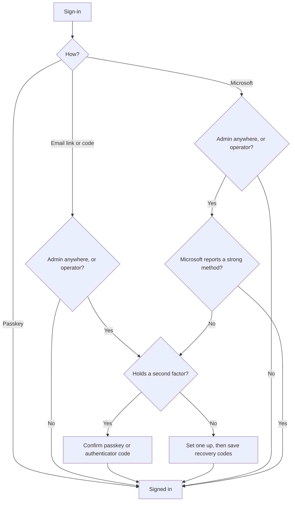
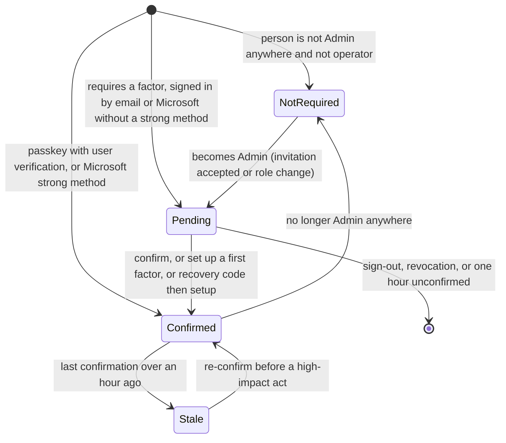
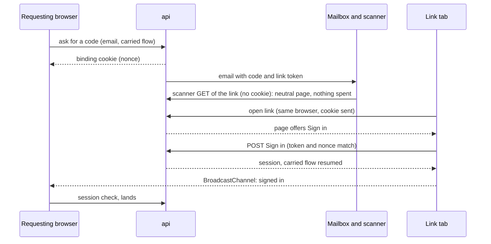
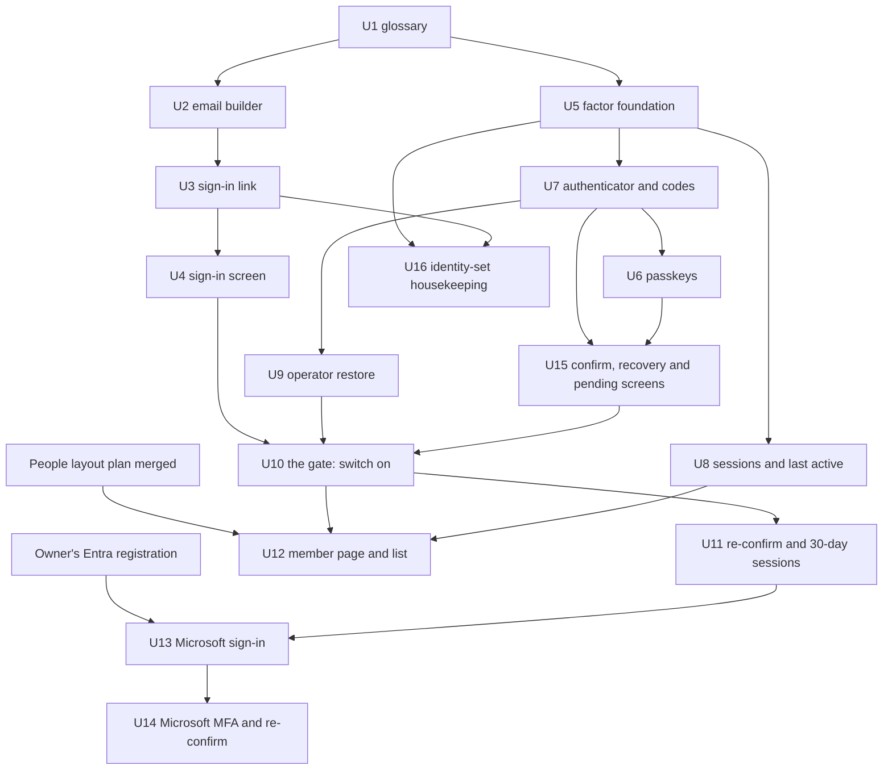

# People sign-in and security - Plan

## Goal Capsule

- **Objective:** A person signs in to better-answers quickly and without a password, and nobody can take over an Admin account that already holds a second factor with only that Admin's mailbox.
- **Means:** our own second-factor gate over Better Auth's passkey and authenticator machinery (KTD1, KTD2), delivered as three slices: email sign-in, passkeys and the Admin second factor, and Microsoft sign-in.
- **Product authority:** the Product Contract, R1 to R37, and its session-settled Key Decisions. The Planning Contract's KTDs own the mechanisms. Where they disagree, the R wins on behaviour and the KTD on mechanism.
- **Execution profile:** Deep. 16 units across three slices. A unit that adds a migration runs alone until it merges (`docs/agents/workflow.md`); slice two has one migration (U5) and slice three one (U13). The enforcement units (U10, U11) come last in slice two, after every remedy exists.
- **Stop conditions:** stop and report if evidence shows a session-settled decision cannot work; if `@better-auth/passkey` cannot run at the pinned 1.7.5; or if U12 is reached before the People layout plan's member page has merged.
- **Open blockers:** U13 and U14 wait on the owner's multi-tenant Entra application registration with the `email`, `xms_edov`, `amr` and `auth_time` optional claims (BA-14 on hold). U12 waits on the People layout plan (`docs/plans/2026-10-01-1807-feat-people-layout-rework-plan.md`) merging.
- **Who finishes:** `ce-work` per slice, one pull request per unit or small group. The email slice files its own Linear issue; slice two lands as `Fixes BA-28`; slice three as `Fixes BA-14`.

---

## Product Contract

**Product Contract preservation:** changed on 01/10/2026, with the owner, during planning. R14: becoming an Admin mid-session triggers setup at once. R24: "sign out everywhere else" leaves personal tokens and Claude connections. R26: "last sign-in" removed, as it would reveal other workspaces. R30: Microsoft links automatically only through an invitation. R32: only strong Microsoft methods count. Success Criterion 2 is reworded for trust on first use. Added: R36 (factor-change notices) and R37 (adding Microsoft from the Account page). AE9 and AE10 changed or added to match. Clarified during the plan's review, no change of intent: R18 also covers a person who becomes an Admin while already holding a factor; R27 counts use through Claude; R36 also covers linking Microsoft, which can stand as an Admin's factor, and repeated failed confirmations; R32 and the flowchart name operators, as the "operators follow the Admin rule" decision already required. Changed during the plan's review, with the owner: R20 gains the one-time restore code. R24's wording drops "Claude connections", a word the glossary avoids, with no change of intent.

### Summary

Sign-in becomes quick for everyone and strong for Admins. The sign-in email carries a link that finishes sign-in in the browser that asked for it, plus a code that is easy to copy. Anyone can add a passkey and then sign in with it in one step. Admins must hold a passkey or an authenticator (a phone application that shows a changing six-digit code), backed by recovery codes, and they re-confirm it before high-impact acts. People manage their sign-in on a new Account page, Admins see each member's sign-in on the member page, and a company on Microsoft 365 can sign in with Microsoft.

### Problem Frame

Today the only way in is a code sent by email. It is six digits, valid for five minutes, and allows three attempts. It arrives in a plain-text email that the person must open, read and retype into the tab they left. Even on the same device, that means switching to email and back.

An emailed code is a single thing. Anyone who reads the mailbox can use it, and so can a phishing page that relays it in real time. Relaying it is now cheap to automate with AI. NIST SP 800-63B-4 does not count email as an authenticator at all. Admins can invite, change roles, revoke access and export, so an Admin account protected only by a mailbox is the platform's weakest point.

The first client, Phew, runs on Microsoft 365. Its IT expects to decide who signs in (route story 42), and its mail runs Microsoft's Safe Links, which opens every link in an email before the person does.

### Actors

- A1. Person: anyone signing in, including an invited newcomer, an Editor or a Viewer.
- A2. Admin: a person who holds the Admin role in at least one workspace.
- A3. Operator: the platform's owner, who works in the console.
- A4. Microsoft: Entra, the identity provider behind Microsoft sign-in.
- A5. Mail scanner: a service such as Safe Links that opens links in an email before the person does.

### Key Decisions

- **One brainstorm, three slices.** BA-14 stays Microsoft-only. Passkeys and the second factor are BA-28. The email sign-in is a third piece. (session-settled: user-directed — chosen over widening BA-14 to passkeys and MFA: the security push deserves its own task.)
- **The link signs in only the browser that asked.** Governs R4. (session-settled: user-approved — chosen over signing in whichever device opens the link, or asking "sign in on this device?": a person tricked into requesting a code cannot hand a session to whoever tricked them.)
- **Passkey first.** A passkey sign-in needs no email and counts as both factors. Governs R7, R8, R9. (session-settled: user-approved — chosen over email first with the passkey as a second step: it removes the phishable step for anyone with a passkey.)
- **Admins must hold a second factor; everyone else is offered a passkey.** Governs R10, R12. (session-settled: user-approved — chosen over requiring it of everyone, a per-workspace setting, or requiring it of nobody: Admins hold the powerful acts, and occasional users keep a one-step sign-in.)
- **A passkey or an authenticator counts.** Governs R12, R15. (session-settled: user-directed — chosen over a passkey only: wider reach for Admins on devices without passkeys.) Conflict call-out: an authenticator code can be relayed by a phishing page in real time, just like the email code. Only a passkey resists that. The owner accepted this knowingly.
- **Only Microsoft's strong methods count.** Governs R32. (session-settled: user-approved — chosen over counting any MFA Microsoft reports, or never counting Microsoft: a text-message, call or email code would fall below our own bar.)
- **The Account page starts here, with only its Sign-in and Sessions sections.** Governs R23. (session-settled: user-approved — chosen over building the whole Account page first, or prompts with no page: nothing waits, and a person can remove an old passkey.)
- **Recovery is by recovery codes, then the operator.** Governs R18, R19, R20. (session-settled: user-approved — chosen over requiring two factors, or the operator only: self-service first, with no path that bypasses the factor.)
- **An operator restore is bound to the person by a one-time restore code.** Governs R20. (session-settled: user-approved — chosen over trusting the mailbox after a restore, or the operator completing setup with the person: a restore happens exactly when the mailbox may be compromised, and the code carries the operator's identity check through to setup.)
- **An Admin with no factor sets one up at once.** Governs R14. (session-settled: user-approved — chosen over a grace period followed by a block, or demotion to Editor: no window in which an Admin is protected only by a mailbox.)
- **The first factor is trusted on first use, and every factor change is announced by email.** Governs R36. (session-settled: user-directed — chosen over operator or Admin confirmation of a new Admin's setup: the invitation email is the root of trust, and a notice makes a takeover visible.)
- **Sessions last 30 days while in use, and Admins re-confirm before high-impact acts.** Governs R17, R22. (session-settled: user-approved — chosen over 30 days with no re-confirm, or a daily sign-in for Admins: sign-in is rare, and a stolen session cannot do damage.)
- **A Microsoft-signed-in Admin re-confirms through Microsoft.** Governs R33. (session-settled: user-approved — chosen over also setting up a passkey, or offering both: no extra setup, and the company's IT stays in charge.)
- **Microsoft links automatically only through an invitation.** An existing person adds Microsoft from the Account page. Governs R30, R37. (session-settled: user-approved — chosen over linking through invitations only, or on any exact email match: no company's IT can claim a person it did not invite.)
- **After the first link, a Microsoft account is matched by Microsoft's own id.** Governs R31. (session-settled: user-approved — chosen over matching on email every time: Entra lets an account's email change, and Microsoft says not to authorise on it.)
- **The second factor belongs to the person, across every workspace.** Holding the Admin role in any one workspace requires it at every sign-in. A workspace Admin cannot act on another person's factors (ADR 0035). Governs R12, R21, R26.
- **Operators follow the Admin rule.** Governs R12.
- **The member page shows only this workspace.** It shows the member's last activity in this workspace, never their platform-wide last sign-in, which would tell one company about another. Governs R26, R27, R28.
- **Sessions show no location.** Governs R24. This keeps addresses out of what is shown, as the sign-in record already does (ADR 0038).

### Requirements

**Email sign-in**

- R1. The sign-in email carries a sign-in link and the six-digit code. The code is in large type in the body, never in the subject line.
- R2. The link and the code are one credential: they share the code's five-minute lifetime, and signing in with either spends both.
- R3. Opening the link shows a page with a **Sign in** button, and only that click signs in, so a mail scanner that opens the link changes nothing.
- R4. The link signs in only the browser that asked for the code. Opened anywhere else, its page shows the code in large type, tells the person to type it where they started, and signs nothing in.
- R5. When sign-in completes in one tab, any other tab of that browser waiting on the code moves on to the same landing.
- R6. The code field accepts a pasted code that contains spaces or dashes, and signs in as soon as six digits are entered. The browser's own code autofill keeps working.

**Passkeys**

- R7. Any person can add a passkey on the Account page and then sign in with it in one step. The sign-in screen offers it from the browser's autofill on the email field.
- R8. A passkey sign-in is complete on its own and counts as both factors, so an Admin with a passkey never needs the email.
- R9. The email link and code stay available to everyone, for a device or a person with no passkey.
- R10. A person without a passkey is offered one in two places: the Account page's Sign-in section, and one banner after sign-in that stays away once dismissed. Sign-in itself never prompts.
- R11. On the Account page, a person can name each passkey, see when it was last used, and remove it.

**Admin second factor**

- R12. A person who is an Admin in any workspace, and every operator, must hold a second factor: a passkey or an authenticator.
- R13. An Admin who signs in by email confirms their second factor before reaching any screen.
- R14. An Admin with no second factor sets one up before reaching any screen. A person who becomes an Admin mid-session, by accepting an Admin invitation or by a role change, sets one up before their next screen. There is no grace period.
- R15. Setting up an authenticator shows a QR code and the key as text. Setup finishes only when the person enters a working code from it.
- R16. An Admin cannot remove their last second factor while they are an Admin.
- R17. Before a high-impact act, an Admin re-confirms their second factor if their last confirmation was over an hour ago. High-impact acts include at least removing a member, changing a role, revoking access and exporting.

**Recovery**

- R18. An Admin's first second-factor setup ends by showing ten one-time recovery codes, once, for the Admin to save. A person who becomes an Admin while already holding a factor is shown their codes after their first confirmation as an Admin.
- R19. A recovery code signs the Admin in once and takes them straight to setting up a new second factor.
- R20. An Admin with no second factor and no recovery code can be restored only by an operator, once the operator has confirmed who they are by another route. The restore issues a one-time restore code, which the operator hands over by that same route, and setting up a factor after a restore requires it.
- R21. Neither an email link or code nor a workspace Admin can remove, reset or stand in for a person's second factor.

**Sessions and the Account page**

- R22. A session lasts up to 30 days and renews while the person keeps using it.
- R23. The Account page is reached from the avatar menu. It starts with two sections. Sign-in holds the person's passkeys (R7, R10, R11), their second factor, their recovery codes and any linked Microsoft account (R37). Sessions is covered by R24.
- R24. The Sessions section lists the person's sessions, showing device, browser and when each was last active, never a location. The person can sign out any one of them, or every one except the current one. Signing out ends sessions only, and the section says that it does not disconnect Claude or end personal tokens.
- R25. An Admin can replace their recovery codes on the Account page, which voids the old set.

**Member page and Members list** (extending the People layout plan's R18)

- R26. The member page's Sign-in section shows the member's sign-in methods and whether they hold a second factor. It offers no act on their factors (R21).
- R27. The member page's Sessions section shows when the member was last active in this workspace, through the platform or through Claude, and offers the existing revoke. It never lists the member's devices or sessions, which span their other workspaces.
- R28. The Members list gains columns for sign-in method, second factor and last active in this workspace.

**Microsoft sign-in**

- R29. The sign-in screen offers **Continue with Microsoft** beside the email, in the glossary's words: sign-in, never login.
- R30. A first Microsoft sign-in links automatically only when Microsoft's verified email matches a pending invitation. Otherwise it is refused on the refused screen and creates no person.
- R31. After the first link, the account is recognised by Microsoft's own id for it, so a change of email in Entra neither breaks the link nor moves it to someone else.
- R32. An Admin's or operator's Microsoft sign-in counts as their second factor when Microsoft reports a strong method: its authenticator, a passkey, Windows Hello or a security key. A text message, call or email code does not count, and R13 or R14 applies.
- R33. A Microsoft-signed-in Admin re-confirms (R17) through a round trip to Microsoft.
- R34. A person with a linked Microsoft account can still sign in by email or passkey, and no path ever offers a password.
- R37. A person signed in another way can add Microsoft sign-in from the Account page, linking their own Microsoft account.

**Records and notices**

- R35. Every sign-in records its method. Every change to a second factor, every use of a recovery code, every operator restore and every re-confirmation is recorded too. No record holds a credential.
- R36. Every change to a person's second factor sends a notice to their email address. That covers a factor added or removed, Microsoft linked, a recovery code used, codes replaced, an operator restore, and repeated failed confirmations.

### Key Flows

- F1. Email sign-in in the same browser
  - **Trigger:** A person enters their email and asks for a code.
  - **Steps:** The email arrives with a link and a code. The person clicks the link and the page opens in a new tab of the same browser. They click **Sign in** and land, and the waiting tab lands too.
  - **Covered by:** R1, R2, R3, R4, R5
- F2. Email sign-in on another device
  - **Trigger:** The person asked on a laptop but opens the email on a phone.
  - **Steps:** The link opens on the phone. The page shows the code and says to type it on the laptop. The person types it on the laptop and lands there. The phone stays signed out.
  - **Covered by:** R4, R6
- F3. A new Admin's first sign-in
  - **Trigger:** An Admin invited to Phew signs in for the first time.
  - **Steps:** They sign in by email link or code, set up a passkey or an authenticator, save the recovery codes, give a display name, and land.
  - **Covered by:** R12, R14, R15, R18
- F4. Re-confirming before a high-impact act
  - **Trigger:** An Admin removes a member more than an hour after their last confirmation.
  - **Steps:** They are asked for their passkey or authenticator code, or sent through Microsoft (R33). Once they confirm, the removal goes ahead.
  - **Covered by:** R17, R33
- F5. Recovery
  - **Trigger:** An Admin has lost every device holding their factor.
  - **Steps:** They sign in by email and enter a recovery code, then set up a new factor. Without a code they ask the operator, who checks who they are and restores them.
  - **Covered by:** R19, R20, R21

### Acceptance Examples

- AE1. **Covers R3, R4.** Given Safe Links opened the link before delivery, when the person clicks it in the browser that asked, they are signed in. The scanner's visit changed nothing.
- AE2. **Covers R4.** Given a person asked on their laptop, when they tap the link in the email on their phone, the phone shows the code and signs nothing in. The laptop signs in once they type the code there.
- AE3. **Covers R5.** Given the link opened in a new tab of the same browser, when the person clicks **Sign in** there, the tab they started in lands too.
- AE4. **Covers R8, R13.** Given an Admin with a passkey, when they sign in with it, they land without an email. When they use an email link on a laptop without the passkey, they are asked for their authenticator code, or for the passkey through their phone, before any screen.
- AE5. **Covers R12.** Given a person who is an Admin in one workspace and a Viewer in another, when they sign in to go to the second, they still confirm their second factor.
- AE6. **Covers R17.** Given an Admin who confirmed at sign-in three hours ago, when they remove a member, they confirm first. Ten minutes later they change a role with no prompt.
- AE7. **Covers R19, R21.** Given an Admin who lost their only factor, an email link alone never gets them past the factor step. A recovery code does, and it takes them straight to setting up a new factor.
- AE8. **Covers R31.** Given a Microsoft account linked last month whose email Entra has since changed, when its owner signs in with Microsoft, they land as the same person.
- AE9. **Covers R32.** Given an Admin at a company whose Entra requires its authenticator, Microsoft sign-in lands them with no second prompt. When Microsoft reports only a text-message code, they confirm ours.
- AE10. **Covers R30, R37.** Given a person already on the platform with no pending invitation, a first Microsoft sign-in is refused and creates nothing. After signing in by email, they add Microsoft on the Account page, and their next Microsoft sign-in lands them.

### Success Criteria

- From the email, a person signing in in the same browser is in with two clicks, the link and then **Sign in**, and no typing.
- Once an Admin holds a second factor, no path lets someone holding only that Admin's mailbox reach their session.
- A returning person with a passkey signs in without opening their email.
- A new Admin's first sign-in, setup included, takes about two minutes (an assumption, checked in the browser suite's walk-through).

### Scope Boundaries

- Sign-in against a client's own tenant (the per-client `sso` shape) stays a written trigger in ADR 0034.
- The rest of the Account page (name, role, workspace and personal tokens) is its own piece.
- Editors and Viewers get no required second factor. They can add a passkey for speed.
- No workspace-level security settings, such as requiring a second factor of everyone.
- Never passwords, text-message codes or security questions.
- The code's length, lifetime and attempts stay as they are: six digits, five minutes, three tries.
- Disabling a person's Microsoft account does not end their platform access, because email and passkey still work. A workspace Admin's revoke is the lever.
- No "remember this device" for the second factor; a confirmed session lasts its 30 days instead.

#### Deferred to Follow-Up Work

- Redrawing the C4 diagrams for the new auth components rides BA-25 after the pre-S2 review.
- The People layout plan still credits the member page's Sign-in and Sessions sections to BA-14 (its lines 95 and 200). They belong to BA-28; correct that plan when it is next edited.

### Delivery Slices

- **Email sign-in:** R1 to R6, plus R35's method record. Units U1 to U4. A new issue; it can proceed now and independently.
- **Passkeys and the Admin second factor:** R7 to R28, R35, R36. Units U5 to U12, U15 and U16, in the order the dependency graph gives. This is BA-28. U12 extends the People layout plan's member page and Members list (its R18) once that plan merges.
- **Microsoft sign-in:** R29 to R34, R37. Units U13 and U14. This is BA-14, on hold for the Entra registration, and it comes after BA-28: R32 and R33 need the second factor and re-confirm.

### Dependencies / Assumptions

- The owner registers the multi-tenant Entra application with the redirect ADR 0034's doc names. It needs the `email`, `xms_edov`, `amr` and `auth_time` optional claims switched on. The owner stores its client id and secret by class in `SECRETS.md`.
- `@better-auth/passkey` 1.7.5 is added, pinned to match the other Better Auth packages.
- Most passkeys sync through iCloud, Google or a password manager, so losing a device rarely loses the passkey.

### Sources / Research

- Current sign-in: `apps/api/src/auth/auth.ts` (emailOTP only; no passkey, two-factor or Microsoft provider), `apps/api/src/auth/constants.ts` (6 digits, 5 minutes, 3 attempts), `apps/web/src/features/auth/sign-in-screen.tsx`, and `packages/core/src/workspaces/sign-in-and-consent.ts` (sign-in recorded with no method).
- Decisions in force: ADR 0009, 0034, 0035, 0038 and 0047 under `docs/solutions/architecture-patterns/`, and `CONTEXT.md`'s *sign-in*, *invitation* and *Account page*.
- NIST SP 800-63B-4: email is not an authenticator (§3.1.3.1), and its reauthentication ceilings. https://pages.nist.gov/800-63-4/sp800-63b.html
- Microsoft: Safe Links scans and opens links before delivery (https://learn.microsoft.com/en-us/defender-office-365/safe-links-about); `amr`, `xms_edov` and the mutable `email` claim (https://learn.microsoft.com/en-us/entra/identity-platform/optional-claims-reference).
- Passkey prompts: offer them in account settings, not during sign-in (https://www.passkeycentral.org/design-guidelines/principles).
- Admin enforcement and recovery practice: GitHub (https://docs.github.com/en/authentication/securing-your-account-with-two-factor-authentication-2fa/about-mandatory-two-factor-authentication), Stripe (https://support.stripe.com/questions/require-two-step-authentication-for-your-team), and Vercel (https://vercel.com/docs/two-factor-enforcement).
- Link and code in one email: Linear (https://linear.app/docs/login-methods). Same-browser links failing on phones: Auth0's support article on the same-device magic-link error.

---

## Planning Contract

### Key Technical Decisions

- KTD1. **Our own second-factor gate, derived on every request.** Better Auth 1.7.5's two-factor plugin intercepts only the password sign-in paths (`two-factor/index.mjs:245`); email-code, passkey and social sign-in mint full sessions.
  - **The predicate:** a pure function in `packages/core/src/kernel/` beside `freshness.ts`, because who must hold a factor is policy and `apps/api` holds transports only. It reads facts from one identity-set read in core: is the person an Admin in any workspace or an operator, do they hold a verified factor, and is the session confirmed. An unconfirmed session of a person who requires a factor is *pending*.
  - **The pending set:** one declared constant. It covers factor setup (when the person holds no factor, or when this session has just spent a recovery code; after an operator restore, only with the restore code), confirm, recovery-code use, sign-out, `session.operator`, Better Auth's `/get-session`, and the reads those screens need.
  - **Where it applies:** at the two roots every caller passes through: `sessionOf` in `apps/api/src/trpc/base.ts`, which covers `claimsOf`, `personProcedure` and `operatorProcedure`, and `sessionClaims`, which covers `/me` and `/consent` in `apps/api/src/auth/routes.ts`. It also holds the OAuth `/oauth2/authorize` resume, and a Better Auth before-hook covers every other mounted endpoint.
  - **The refusal:** its own declared word, outside the `unauthenticated` class, so the SPA sends the person to the pending screens rather than back to sign-in.
  - **Derived, never stored:** a role change, a removed factor or a revocation takes effect on the next request. Better Auth's `cookieCache` stays off, pinned by a test, because a cached session would make the gate stale.

  Implements R12, R13, R14, R21.
- KTD2. **The library keeps only what needs its cryptography; everything else is our own act.**
  - **Library-owned:** the `twoFactor` plugin's TOTP (`allowPasswordless`, its account lockout turned off for KTD14) and `@better-auth/passkey` (with `session.freshAge: 0`, so KTD3's helper is the only freshness rule). They own passkey registration, authenticator enable and authenticator verify. Our routes in `apps/api/src/auth/` call them behind the gate.
  - **The session swap:** the library's first-time authenticator verify mints a new session and deletes the old one (`totp/index.mjs:205-213`), yet its response body still names the old one. Our route takes the new session from the response's `Set-Cookie` when one is set, stamps it and forwards its cookie. Otherwise it stamps the request's own session. It never uses the token in the response body.
  - **Recorded after commit:** these library-owned writes are recorded after the library commits, and `CODING_STANDARDS.md`'s AUDIT8 is amended in the same commit to name them beside sign-in and consent.
  - **Our own core acts over plain rows:** removing a factor, renaming a passkey, recovery codes (KTD13), the confirmation stamp, the operator restore and session sign-outs. Each locks the person's `user` row `FOR UPDATE`, rechecks under the lock (R16), and records with `recordFor` in the same transaction (AUDIT1), on the `setDisplayName` precedent.
  - **Closed endpoints:** every plugin endpoint that adds, removes, replaces, verifies or reveals a factor outside our routes. That includes:
    - `/two-factor/get-totp-uri`, which returns the decrypted secret to any session;
    - `/two-factor/disable` and the backup-code endpoints;
    - `/passkey/delete-passkey` and `/passkey/update-passkey`;
    - `/unlink-account`.

    Better Auth's already-mounted `/update-session` is closed too, since it would let a session write its own fields. Each closure is proven by the endpoint snapshot test.
  - **Holding a factor:** a passkey row, a `two_factor` row that is verified and has a secret, or a linked Microsoft account that has given a strong-method sign-in (R32). A started, abandoned authenticator setup is not a factor. A Microsoft-only Admin's email sign-in is therefore pending on confirm, which is KTD10's round trip, never on first-factor setup.
- KTD3. **One confirmation stamp serves confirm, re-confirm and operator freshness.**
  - **The stamp:** a new session field recording when the session last confirmed a second factor. It is declared `input: false` and `returned: false`, with no default.
  - **Written only on the server:** by our confirm routes, by passkey sign-in (KTD5), and by a strong Microsoft sign-in (KTD10).
  - **Carried:** Better Auth drops a `returned: false` field from every session read. So Claims carry the session id (`apps/api/src/auth/verify.ts`), and the principal (`packages/core/src/kernel/principal.ts`) takes the stamp from the same core identity-set read KTD1 uses, never from the library's session output.
  - **One rule:** one freshness helper (one hour) replaces `requireFreshSignIn`'s `createdAt` anchor (`packages/core/src/kernel/freshness.ts`), so operator console writes and Admin high-impact acts share it. A stamp in the future counts as stale.
  - **The stamp write:** it names the session id, the person id and a factor that still exists, and runs in the same transaction as its record. Zero rows means refuse and record nothing, so a confirm racing a restore or a sign-out cannot stamp a dead session.
  - **Unchanged:** credential revocation stays anchored to `createdAt`.

  ADR 0009's doc is amended. Implements R13, R17.
- KTD4. **The high-impact set and how it re-confirms.** R17's four acts plus the following:
  - inviting an Admin;
  - revoking credentials everywhere;
  - audit export;
  - the People layout plan's bulk acts, checked once per batch;
  - factor add, remove and code replacement, and linking Microsoft, once the person already holds a factor;
  - operator console writes.

  A person's first factor, including a Viewer's first passkey (R7), needs no re-confirm: there is nothing to confirm against. It is trusted on first use and announced (R36).

  A stale confirmation refuses with one declared refusal word. The SPA maps it to a re-confirm dialog that retries the act with its input kept. Personal-token and MCP callers carry no session, so none of these acts is reachable by token (U11 proves it).
- KTD5. **A passkey counts as both factors only with user verification.**
  - **Required both ways:** registration and authentication require user verification. The passkey plugin's `authentication.afterVerification` refuses an assertion without it, which aborts sign-in before a session exists (read from source, so U6 proves it).
  - **Sign-in stamps at creation:** a passkey sign-in session is stamped in `databaseHooks.session.create.before`, keyed on the passkey verify path, and that hook also records the passkey's last use.
  - **Confirm and re-confirm:** these use our own endpoint, because the plugin's verify always mints a session. It issues and stores its own challenge and verifies the assertion with `@simplewebauthn/server`. It requires user verification, accepts only the session person's own credentials, and updates the passkey's counter. It then stamps the existing session (KTD3) and mints none.

  Implements R8, R11, R13, R17.
- KTD6. **The email link is a second secret that unlocks the same code.** The magic-link plugin is not used: it consumes on GET and cannot bind.
  - **Minting:** at the code request, `sendVerificationOTP` (the one place the plaintext code exists, since codes are stored hashed) mints a random, alphanumeric link token. It seals the code under a key derived from that token. It stores the token's hash, the sealed code, the hashed binding nonce and any carried OAuth query in a `verification` row, which needs no migration.
  - **The binding cookie:** the response sets a host-only, `Secure`, `HttpOnly`, `SameSite=Lax` cookie holding the nonce. The code request sits behind `sameOriginOnly`, so a cross-site page cannot plant one.
  - **The token stays out of URLs on the wire:** it rides in the link's URL fragment, which never reaches a server, a log or a `Referer`. The link route sets `Referrer-Policy: no-referrer` and `Cache-Control: no-store`.
  - **The page:** an SPA route outside the shell posts the token to a describe-this-link read. A bound, live request offers **Sign in**. Anything else gets one neutral page: it shows the code while valid, or says the link has expired, with no oracle for unknown, spent or superseded tokens.
  - **Signing in:** **Sign in** posts the token, and the api unseals the code and spends it through `auth.handler` on `/sign-in/email-otp`, on the consent page's `callFlow` precedent. That keeps attempts, lifetime, audit and session hooks with the library. The link is live only while the code's own verification row exists (R2), and its signed OAuth query is re-checked when the flow resumes.
  - **Resends and wrong tokens:** a resend deletes the earlier link row in the same write. A wrong token never touches the code's attempts.
  - **Rate rules:** each route gets its own, including one per token.

  Implements R2, R3, R4.
- KTD7. **The waiting tab follows, and the carried flow travels with the request.** A completed sign-in announces itself on a `BroadcastChannel`, and a waiting tab re-checks its session on becoming visible. The signed OAuth query of a "connect Claude" flow is stored with the link request, so whichever tab signs in resumes it. Implements R5.
- KTD8. **Sessions, last active and the Sessions read.**
  - **Lifetime:** sessions run for 30 days and renew daily (`session.expiresIn`, `updateAge`), set in U11 together with re-confirm, as the product decision paired them.
  - **Pending expiry:** a nullable "pending since" field on the session is set once, by the gate, the first time it finds the session pending, and the confirmation stamp clears it. A pending session expires one hour after that moment. The field is a clock, not a stored state: KTD1 still derives pending-ness on every request. So a session from before the switch, or one whose person was just made an Admin, reaches setup or confirm rather than being deleted on sight. The gate deletes an expired pending session when it reads one, and `/get-session` never renews a pending session.
  - **Last active:** a separate table keyed by workspace and person, not a `member` column, so it stays clear of the `FOR SHARE` holds every mutation takes on `member` (ADR 0035). It is a tenant table under RLS, not part of the identity set (the owner's call on 02/10/2026, from #509's review), so its stamp runs under the workspace's scope and a person's row is deleted when they leave that workspace. It is stamped at most hourly, in its own short transaction, from core's `resolveClaims`, so platform and Claude use both count. A failed stamp never fails the request (R27, R28).
  - **The Sessions read:** our own, so `ipAddress` never leaves the api. Better Auth's `/list-sessions`, `/revoke-session`, `/revoke-sessions` and `/revoke-other-sessions` are closed, and sign-outs are recorded acts that name what they ended (ADR 0035). IP tracking stays on, because the rate limiter keys on it.

  Implements R22, R24.
- KTD9. **One email builder with an HTML part.** `EmailMessage` gains an `html` field, and the SMTP sender sends both parts. The sign-in email and the notices (R36) are pure builders beside `apps/api/src/trpc/invitation-email.ts`. The text part keeps the code on a line of its own, and the subject never carries it. Implements R1, R36.
- KTD10. **Microsoft: invitation-first linking, a stable id, and strong methods only.**
  - **Provider:** the `microsoft` provider with tenant `organizations`. `mapProfileToUser` derives `emailVerified` from `xms_edov`.
  - **Linking:** the library's account linking stays on, because both of its switches for turning implicit linking off would also refuse the Account-page link. Our own hooks enforce the rule:
    - `databaseHooks.user.create.before` refuses a new person who has no pending invitation;
    - `databaseHooks.account.create.before` refuses a `microsoft` account unless it is a newcomer's account matching a pending invitation for its verified email, or the Account page's authenticated link.

    An existing person's first Microsoft sign-in is refused on the refused screen, pointing them to the Account page (R37), even when they hold a pending invitation. Anything else is refused and creates no person.
  - **Account-page link:** adding Microsoft from the Account page uses the library's authenticated social link, from a confirmed session, and only when `xms_edov` is true for the account being linked. Linking counts as a factor change: high-impact once the person holds a factor (KTD4), recorded, and announced (R36). The Better Auth before-hook applies KTD3's one-hour check to `/link-social` itself, so a stale or stolen session cannot call it directly.
  - **Identity:** the provider stores `oid`. We also store `tid` and require both to match on later sign-ins (Microsoft's stable identity).
  - **MFA:** `amr` is classified once, by a pure function. Strong methods stamp the confirmation; SMS, phone and email-code methods never do.
  - **Re-confirm:** a round trip with `prompt=login` and `max_age=0`, and its OAuth state is bound to the session that started it. On return it:
    1. accepts only this person's own `tid` and `oid`;
    2. classifies `amr` as at sign-in;
    3. requires `auth_time` at or after the round trip's start;
    4. stamps the existing session;
    5. restores that session's cookie, which the browser sent with the callback, and then deletes the library's new session in the same request.

    The person lands back on the route that raised the refusal, with a notice to run the act again. The act is not retried automatically, because a full-page round trip loses the dialog's kept input.

  Implements R29 to R34, R37.
- KTD11. **The Account page sits outside the shell.** It lives at a root route beside `/display-name`, reached from the avatar menu (`apps/web/src/app/band.tsx`). It works for a person with no workspace and for the operator, and the no-workspace and choose-workspace screens link to it. The pending-session screens (confirm, setup, recovery) are root routes too. The SPA reaches them whenever a query or mutation meets the pending refusal, through the same handlers that today send `unauthenticated` to sign-in (`apps/web/src/features/auth/membership.ts`, `apps/web/src/features/console/operator.ts`). A landing-route detour alone would miss a person who becomes an Admin mid-session. The screens share their setup components with the Account page. ADR 0047's doc is amended. Implements R23.
- KTD12. **Enforcement switches on last.** U5 to U9, U15 and U16 change nobody's sign-in except by choice, and U16 can land before or after the switch. The gate (U10) and re-confirm with 30-day sessions (U11) land after setup, recovery codes, the pending screens and the operator restore exist. Every existing session carries no confirmation stamp, so at the switch each Admin, and the operator, sets up or confirms a factor at their next request. No backfill is needed, and the switch is announced to Phew's Admins beforehand. The test harnesses sign Admins and operators in with an authenticator from U7 onwards, so U10 does not break the existing suites.
- KTD13. **Recovery codes are ours, not the plugin's.** The plugin keeps backup codes as a column on the authenticator row, so a passkey-only Admin would have nowhere to keep them, and starting an authenticator setup would overwrite them. Ours sit in their own identity-set table: ten per person, each hashed, spent by a conditional delete so a code works once even under concurrent use.
  - **Spending a code:** it gives only the spending session the right to set up a replacement, and leads straight to setup. Every other session of the person still has to confirm.
  - **The swap:** the person's existing factors are removed in the same transaction that verifies the replacement, and setup then issues a fresh set of codes. The setup screen says the old factors will be replaced.
  - **Abandoned setup:** if setup is abandoned, or the recovery session expires, the old factors and the remaining codes stay in place. So the person never holds zero factors, and a mailbox holder never reaches first-factor setup (Success Criterion 2).

  Implements R18, R19, R25.
- KTD14. **Confirms are throttled per person, without locking anyone out.** The plugin's lockout counts nothing for a session that already exists, and a hard per-person lock would let a mailbox holder lock an Admin out. Authenticator failures are counted per person, with backoff that grows across every pending session, so many sessions cannot multiply the guessing budget. Recovery codes keep their own counter. Passkey confirms are never throttled. Repeated failures send a notice (R36). Implements R13.

### High-Level Technical Design

The session's second-factor state, as the gate derives it (KTD1, KTD3):

The email link, from request to session (KTD6, KTD7):

The units and their order across the three slices:

### Assumptions

- Better Auth's `disabledPaths` removes HTTP routes but still lets our routes call the same endpoints as server functions. If it does not, our routes call the plugin's lower-level functions, or wrap the endpoint with a before-hook that refuses outside the gate. U5 settles which.
- Entra includes `amr` in the ID token for an OIDC sign-in once the optional claim is configured. If it does not, a Microsoft Admin always confirms our factor (R32's fallback), and U14 records that.
- The passkey plugin's schema accepts an extra last-used field. If it does not, last use lives in a small identity-set table of ours keyed by passkey id. U5 settles which.
- The library's authenticated social link refuses an account whose verified email differs from the person's. U13 verifies this against the installed source, and requires `xms_edov` regardless.
- Entra emits `auth_time` in the ID token once the optional claim is configured. If it does not, the re-confirm refuses, and U14 records that.

### Open Questions

For the owner, before the unit named lands; none blocks starting the work:
- **Microsoft's logo (U13).** Should the **Continue with Microsoft** button carry Microsoft's logo, which its brand guidance asks for, against the design skill's rule that only Phosphor icons are used? The plan's default is text only.
- **Reaching the operator (U15).** How does an Admin with no codes left contact the operator? The recovery screen says to ask, but names no channel.
- **Sign-in screen wording (U4).** Appendix item 6 proposes new wording: the hint, `Send sign-in email`, and the code-step status naming the link. These replace today's words in `sign-in-words.ts`.
- **Entra client secret (U13).** Who owns the secret's expiry date and rotation once the owner registers the application?

### Risks

| Risk | Mitigation |
| --- | --- |
| A Better Auth endpoint left mounted lets a session change a factor, write its own fields, or mint a session around the gate. `/update-session` is mounted today. | The gate denies by default at the session roots (KTD1). Every mounted path is reviewed in the endpoint snapshot diff, and `/update-session` and every factor endpoint are closed (KTD2). A test enumerates every procedure and mounted path and proves a pending session is refused outside the pending set (U10). |
| The library's first authenticator verify swaps the session, so a stamp written afterwards lands on a deleted row and the browser keeps a dead token. | Our route stamps the session the library returns and forwards its cookie (KTD2); U7 proves one stamped session remains. |
| Today's bypass changes silently on a Better Auth upgrade. | U5 pins the current behaviour for the email code (an authenticator holder's email sign-in mints a full session), and U10 flips that test. U10 and U14 write the passkey and Microsoft equivalents against the gate, so an upgrade that changes library behaviour fails loudly. |
| The enforcement switch locks out an Admin, or the operator, with no remedy. | Setup, recovery codes and `pnpm ops` restore land before the gate (KTD12). The operator is restored by the CLI with server access. |
| The People layout plan has not merged when U12 is reached. | U12 is the last slice-two unit and waits; nothing else depends on it. |
| An in-app mail browser on a phone cannot use the bound link. | That is R4's designed path: the page shows the code. Browser specs cover it with a second, cookie-less context. |
| Microsoft's `amr` is missing or reports weak methods as `mfa`. | A pure classifier counts only strong method values. Missing `amr` never credits, so the person confirms ours. |
| A mailbox-only attacker opens many pending sessions to guess authenticator codes, or to lock the Admin out. The plugin's lockout counts nothing for an existing session. | Per-person backoff across every session, a separate counter for recovery codes, unthrottled passkey confirms, and a notice after repeated failures (KTD14). |
| A credential planted before promotion, such as a passkey added from a Viewer's mailbox-only session, becomes an Admin factor. | Trust on first use is settled. At promotion, the person gets a notice listing every credential by name and date, the confirm screen shows the same list, and recovery codes are issued if none exist (U10, R18). |
| The link URL leaks the code through logs, `Referer` or a forwarded email. | The token rides in the URL fragment, every read and spend is a POST, and the route sets no-referrer and no-store (KTD6). U3 proves no access-log line carries a token. |
| Expired sessions, link rows and code rows pile up, each holding an address and a browser string. | A daily identity-set housekeeping step deletes them (U16). |
| The existing erasure deletes `verification` rows by the bare email, so the library's sign-in code rows are never erased. | U3 fixes the erasure to the real identifier shapes, with a fixture that writes them. |
| A migration idles the worker until it redeploys. | Slice two has one migration (U5) and slice three one (U13), each with `generate:worker-view` in the same unit. Slice one needs none. |

### System-Wide Impact

- **Auth boundary:** the identity seam is unchanged. `better-auth` stays fenced to `apps/api/src/auth/` and `apps/web/src/features/auth/`, and the Account page, people screens and shell reach it through `features/auth` hooks.
- **Identity set:** new person-level tables (passkeys, authenticator secrets, recovery codes) are registered in `IDENTITY_SET`, `TABLE_OWNERS` and `RLS_EXEMPTIONS` with a reason. Workspace last-active is a tenant table under RLS instead (KTD8). They also join erasure's families and finders (`packages/core/src/erasure/map.ts`), its swept counts and its routine. That routine runs on the last membership, so factors survive while the person still belongs to another workspace. Erasure also resets the user row's two-factor flag. Link rows live in `verification` and need no new table.
- **Audit:** AUDIT8 is amended to name the library-owned factor writes (KTD2). Audit details name passkey ids, never passkey names, because the log is append-only (AUDIT5).
- **Operators:** console writes and reads both pass the gate, and writes move from "signed in within the hour" to "confirmed a factor within the hour".
- **MCP and personal tokens:** unaffected at use time. A pending Admin cannot complete a new "connect Claude" authorisation until confirmed.
- **Glossary and decisions:** `CONTEXT.md` gains the new words first (GLOSSARY1). ADR 0009, 0034, 0035, 0038 and 0047 are amended by the units that move them, and a new decision doc records the second-factor policy.

---

## Implementation Units

| U-ID | Title | Files touched (key) | Depends on |
| --- | --- | --- | --- |
| U1 | Glossary words for sign-in and the second factor | `CONTEXT.md` | — |
| U2 | Email builder with an HTML part | `apps/api/src/email.ts`, `apps/api/src/main.ts`, `apps/api/src/auth/sign-in-email.ts` | U1 |
| U3 | The sign-in link | `apps/api/src/auth/`, `apps/web/src/features/auth/link-*`, `packages/core/src/erasure/identity.ts` | U2 |
| U4 | Sign-in screen: paste, auto-submit, tab sync | `apps/web/src/features/auth/sign-in-screen.tsx` | U3 |
| U5 | Second-factor foundation | `apps/api/src/auth/auth.ts`, `packages/schema/`, `packages/core/src/erasure/` | U1 |
| U6 | Passkeys: sign-in and the Account page | `apps/api/src/auth/`, `apps/web/src/features/account/` | U5, U7 |
| U7 | Authenticator, recovery codes, notices and the harness seam | `apps/api/src/auth/`, `packages/core/src/workspaces/`, `apps/web/e2e/harness.ts`, `apps/api/tests/flow.ts` | U5 |
| U8 | Sessions section and last active | `packages/core/`, `apps/api/src/trpc/person.ts`, `apps/web/src/features/account/` | U5 |
| U9 | Operator restore | `apps/api/src/ops/index.ts`, `packages/core/src/workspaces/` | U7 |
| U10 | The gate: switch on | `packages/core/src/kernel/`, `apps/api/src/trpc/base.ts`, `apps/api/src/auth/routes.ts`, `apps/web/src/features/auth/membership.ts` | U4, U9, U15 |
| U11 | Re-confirm before high-impact acts, and 30-day sessions | `packages/core/src/kernel/freshness.ts`, `apps/api/src/trpc/members.ts`, `apps/api/src/auth/auth.ts` | U10 |
| U12 | Member page Sign-in and Sessions, and list columns | `apps/web/src/features/people/` | U8, U10, People layout plan |
| U13 | Microsoft sign-in and linking | `apps/api/src/auth/auth.ts`, `apps/api/src/config.ts`, `packages/schema/` | U11, Entra registration |
| U14 | Microsoft MFA and re-confirm | `apps/api/src/auth/`, `apps/web/src/features/auth/` | U13 |
| U15 | Confirm, recovery and the pending screens | `apps/api/src/auth/`, `apps/web/src/features/auth/second-factor-screens.tsx` | U6, U7 |
| U16 | Identity-set housekeeping | `packages/core/src/sweeps/`, `packages/core/src/erasure/` | U3, U5 |

### U1. Glossary words for sign-in and the second factor

**Goal:** settle the words before code names them.
**Requirements:** R7 to R25, R36, R37 (the vocabulary they use).
**Dependencies:** none.
**Files:** `CONTEXT.md`.
**Approach:**
1. Add entries for *passkey*, *authenticator*, *second factor*, *recovery code*, *re-confirm*, *session* and *sign-in link*, each with one definition and its *Avoid* line.
2. Extend the *sign-in* entry to name passkeys and the link, and the *Account page* entry to name its Sign-in and Sessions sections.
3. Keep implementation words out (GLOSSARY1), and keep every word the glossary avoids out of the new entries, as `apps/api/tests/avoid-words.test.ts` checks.
**Patterns to follow:** existing entries' shape, and `apps/api/tests/avoid-words.test.ts` for avoided words.
**Test scenarios:** Test expectation: none -- glossary text, held by `pnpm check:docs`.
**Verification:** `pnpm check:docs` passes, and every word the later units use has an entry.

### U2. Email builder with an HTML part

**Goal:** the sign-in email carries a large code and room for the link, with the subject free of the code.
**Requirements:** R1; lays R36's builder (KTD9).
**Dependencies:** U1.
**Files:**
- `apps/api/src/email.ts`, `apps/api/src/main.ts`
- new `apps/api/src/auth/sign-in-email.ts`
- `apps/api/src/auth/auth.ts`
- `apps/api/tests/harness.ts`, `apps/api/tests/local.ts`
- new `apps/api/tests/sign-in-email.test.ts`
**Approach:**
1. Add `html` to `EmailMessage`, and have the SMTP sender send both parts.
2. Move the inline sign-in email in `auth.ts` to a pure builder: text part with the code on its own line; HTML part with the code in large type; a subject that names the product and never the code.
3. Point the harness's code capture at the text part's code line rather than any six digits.
**Patterns to follow:** `apps/api/src/trpc/invitation-email.ts` (pure builder, UK dates, `publicUrl`).
**Test scenarios:**
- The subject never contains the six-digit code.
- The text part holds the code alone on one line, and the HTML part holds the same code.
- A body whose link contains digits still yields the right code to the harness reader.
- With no SMTP transport configured, sending still refuses as it does today.
**Verification:** sign-in specs and `apps/api/tests/sign-in-email.test.ts` pass, and a sent email shows both parts.

### U3. The sign-in link

**Goal:** the email's link signs in the browser that asked, and shows the code anywhere else.
**Requirements:** R2, R3, R4, R35 (method `email_link` or `email_code`); AE1, AE2.
**Dependencies:** U2.
**Files:**
- api: `apps/api/src/auth/auth.ts`, `apps/api/src/auth/routes.ts`, `apps/api/src/auth/constants.ts`, new `apps/api/src/auth/sign-in-link.ts`, `apps/api/src/ingress/hostnames.ts`
- core: `packages/core/src/workspaces/sign-in-and-consent.ts`
- web: `apps/web/src/app/router.tsx`, new `apps/web/src/features/auth/link-screen.tsx`, `apps/web/src/features/auth/sign-in-words.ts`
- endpoint snapshot: `apps/api/tests/better-auth-endpoints.txt`
- erasure: `packages/core/src/erasure/identity.ts`, `packages/core/test/identity-rows.ts`
- docs: `docs/solutions/architecture-patterns/adr-0038-*.md` (sign-in detail names its method)
- tests: new `apps/api/tests/sign-in-link.test.ts`, new `apps/web/e2e/sign-in-link.spec.ts`
**Approach:**
1. In `sendVerificationOTP`, mint the link token and nonce, seal the code under the token, and store the hashes, the sealed code and any carried OAuth query in a `verification` row (KTD6, KTD7). Set the binding cookie.
2. A resend deletes the earlier link row in the same write.
3. Put the code request behind `sameOriginOnly`.
4. Add the describe-this-link read and the **Sign in** spend, both POSTs carrying the token in the body. Give each its own rate rule, including one per token.
5. The spend calls `auth.handler` on `/sign-in/email-otp` with the unsealed code (`callFlow` precedent).
6. Add the link route outside the shell: it reads the token from the URL fragment and sets no-referrer and no-store. It shows **Sign in**, the code, or the neutral expired page.
7. Declare the sign-in act's detail as the method word, and amend ADR 0038's doc.
8. Fix erasure's `verification` delete to the identifiers the library and this unit write (`sign-in-otp-<email>` and the link rows), with a fixture that writes those shapes.
**Patterns to follow:** the consent page's fences, rate rule and `callFlow` (`apps/api/src/auth/routes.ts`), `limitCodesByEmail`, and `recordSignIn`.
**Screen states:** Appendix, item 5.
**Test scenarios:**
- Covers AE1. A GET of the link route, repeated twice with no cookie, leaves the code valid and its attempts unspent.
- No access-log line and no `Referer` carries a link token.
- A cross-site POST to the code request is refused and sets no binding cookie.
- Erasing a person deletes their code and link rows.
- Covers AE2. A second browser context without the cookie sees the code and no **Sign in**, and the first browser then signs in with that code.
- A POST with the right token but no binding cookie is refused, and signs nothing in.
- A wrong token leaves the code's three attempts unspent.
- After a resend, the first link shows the expired page and the new link signs in.
- After the code is used, the link shows the expired page.
- An expired request shows the expired page, with no difference between unknown, spent and expired tokens.
- A sign-in through the link records method `email_link`; through the typed code, `email_code`.
- A carried "connect Claude" flow resumes after signing in through the link tab, and a tampered stored query is refused on resume.
**Verification:** the link signs in only the requesting browser, a scanner's visit changes nothing, and no token reaches a server log.

### U4. Sign-in screen: paste, auto-submit, tab sync

**Goal:** typing or pasting the code is effortless, and a waiting tab follows a sign-in elsewhere.
**Requirements:** R5, R6; AE3.
**Dependencies:** U3.
**Files:**
- `apps/web/src/features/auth/sign-in-screen.tsx`, new `apps/web/src/features/auth/code-entry.ts`, `apps/web/src/features/auth/session-memory.ts`
- tests: `apps/web/test/code-entry.test.ts`, `apps/web/e2e/sign-in.spec.ts`
**Approach:**
1. Normalise the code field's input to digits, and submit at six while keeping `autocomplete="one-time-code"`.
2. Announce a completed sign-in on a `BroadcastChannel`, and re-check the session when a waiting tab becomes visible (KTD7).
**Patterns to follow:** the screen's existing slots and status regions, and the `browser-suite` skill.
**Screen states:** Appendix, item 6 (code field and email-step order).
**Test scenarios:**
- Pasting "123 456" or "123-456" fills six digits and signs in without a click.
- Five digits do not submit.
- Letters in a paste are dropped.
- Covers AE3. Signing in through the link in a second tab lands the waiting tab.
- A waiting tab hidden during the sign-in lands when it becomes visible.
- The screen passes the accessibility gate with the new behaviour.
**Verification:** the existing sign-in specs pass unchanged, plus the new ones.

### U5. Second-factor foundation

**Goal:** the libraries, tables and session columns exist, with every factor-changing endpoint closed. Nobody's sign-in changes yet.
**Requirements:** R12, R16; KTD2, KTD3, KTD8, KTD13, KTD14.
**Dependencies:** U1.
**Files:**
- api: `apps/api/package.json` (`@better-auth/passkey` pinned at 1.7.5, and `@simplewebauthn/server` pinned to the version that package resolves), `apps/api/src/auth/auth.ts`, `apps/api/src/auth/constants.ts`
- web: `apps/web/package.json` (`@simplewebauthn/browser`, pinned likewise), `apps/web/src/features/auth/auth-client.ts`
- schema: `packages/schema/src/identity-tables.ts`, `packages/schema/src/table-ownership.ts`, `packages/schema/src/rls-exemptions.ts`, one new migration in `packages/schema/migrations/`
- erasure: `packages/core/src/erasure/map.ts`, `packages/core/src/erasure/identity.ts`
- worker: `apps/worker/src/better_answers_worker/schema_view.py`
- endpoint snapshot: `apps/api/tests/better-auth-endpoints.txt`
- tests: `apps/api/tests/better-auth-endpoints.test.ts`, new `apps/api/tests/second-factor-foundation.test.ts`, `packages/core/test/erasure.test.ts`
**Approach:**
1. Register the `twoFactor` plugin and the passkey plugin.
   - `twoFactor`: TOTP only, `allowPasswordless`, account lockout off.
   - Passkey: `rpID` and the origin set to the app hostname, user verification required, `session.freshAge: 0`.
   - Leave the session lifetime alone; U11 sets it.
2. In one migration, with the plugin tables, add:
   - the confirmation stamp and the "pending since" clock on the session (`input: false`, `returned: false`, no default);
   - our recovery-code table (KTD13);
   - the workspace last-active table (KTD8);
   - the passkey last-used field, per the Assumptions;
   - the person's passkey-offer dismissal;
   - the person's "recovery codes acknowledged" flag (Appendix, item 2).
3. Register each new table in `IDENTITY_SET`, `TABLE_OWNERS` and `RLS_EXEMPTIONS`. Add them to erasure's families, finders and swept counts, and have erasure reset the user row's two-factor flag.
4. Close every factor-changing, factor-revealing and session-listing endpoint, including `/two-factor/get-totp-uri`, `/unlink-account` and `/update-session` (KTD2, KTD8). Refresh and review the endpoint snapshot.
5. Run `generate:worker-view`.
6. Settle the Assumptions' `disabledPaths` and passkey-schema questions.
**Execution note:** start by pinning today's behaviour: a person with an authenticator enrolled who signs in by email code gets a full session. The gate's later tests flip it.
**Patterns to follow:** migration `0057_the-operator-mark.sql` (additive), the `user.additionalFields` declarations with `returned:` decisions, and `CLOSED_ORGANISATION_PATHS`.
**Test scenarios:**
- Each closed endpoint answers as closed, one assertion per path, `/two-factor/get-totp-uri`, `/unlink-account` and `/update-session` included.
- `cookieCache` is off, so a session read always comes from the database.
- Erasing a person on their last membership removes their passkey, authenticator, recovery-code and last-active rows, and clears the two-factor flag.
- Erasing a person who still belongs to another workspace leaves their factors in place.
- The new tables appear in the identity set, table ownership, RLS exemptions and erasure's families, each pair checked both ways (TEST7).
- The worker's schema stamp matches the new migration.
**Verification:** `check` is green with the new snapshot, and no existing sign-in spec changes.

### U6. Passkeys: sign-in and the Account page

**Goal:** anyone can add a passkey and sign in with it in one step.
**Requirements:** R7, R8, R9, R10, R11, R23 (Sign-in section), R35 (method `passkey`), R36; AE4 (first half).
**Dependencies:** U5, U7 (its core remove act and notice builder).
**Files:**
- api: `apps/api/src/auth/auth.ts`, new `apps/api/src/auth/passkeys.ts`
- web: `apps/web/src/features/auth/sign-in-screen.tsx`, new `apps/web/src/features/account/account-page.tsx`, new `apps/web/src/features/account/passkeys-part.tsx`, `apps/web/src/app/band.tsx`, `apps/web/src/app/router.tsx`
- docs: `docs/solutions/architecture-patterns/adr-0047-*.md`
- tests: new `apps/api/tests/passkeys.test.ts`, new `apps/web/e2e/passkeys.spec.ts`, `apps/web/e2e/harness.ts` (virtual authenticator)
**Approach:**
1. Offer passkeys on the email field through `autocomplete="username webauthn"`, plus a visible button where WebAuthn exists.
2. Add the Account page route, the avatar menu item, and links from the no-workspace and choose-workspace screens (KTD11).
3. Add passkeys through our route over the library's registration. Rename and remove are core acts that lock the person's row, so the last factor of an Admin cannot go (R16). Each change is recorded by passkey id and sends its notice (R36).
4. Refuse a sign-in assertion without user verification. Stamp the session and the passkey's last use at session creation (KTD5). Record passkey sign-in in `AUDITED_PATHS`.
5. Add the one dismissible offer banner, its dismissal stored for the person, hidden where WebAuthn is unavailable.
**Patterns to follow:** `features/auth` hooks for every library call (WEB2), the `/display-name` root route, and the `browser-suite` skill. The harness gains a Playwright CDP virtual authenticator.
**Screen states:** Appendix, items 4 (Account page and banner) and 6 (passkey on the sign-in screen).
**Test scenarios:**
- A person adds a passkey on the Account page and signs in with it from the email field's autofill, opening no email.
- A passkey sign-in records method `passkey`.
- An assertion without user verification is refused, and no session is created.
- A passkey removed on the Account page no longer signs in.
- Renaming shows the new name, and "last used" moves after a sign-in.
- The banner shows once, and after dismissal never again for that person.
- Adding or removing a passkey sends the person a notice.
- A browser without WebAuthn shows no passkey offer and keeps the email path.
- A person on the no-workspace screen reaches the Account page.
- A session more than a day old can still add a passkey: the library's own one-day freshness check is off, and our re-confirm (U11) is the only rule.
**Verification:** the passkey specs pass with the virtual authenticator, and the Account page passes the accessibility gate.

### U7. Authenticator, recovery codes, notices and the harness seam

**Goal:** a person can set up an authenticator, holds ten recovery codes, and is told by email of every factor change. The test harnesses can sign in an Admin or operator who holds a factor.
**Requirements:** R15, R16, R18, R25, R35, R36; KTD2, KTD13.
**Dependencies:** U5.
**Files:**
- api: new `apps/api/src/auth/authenticator.ts`, new `apps/api/src/auth/factor-notice-email.ts`
- core: new `packages/core/src/workspaces/recovery-codes.ts`, new `packages/core/src/workspaces/second-factor.ts` (remove, R16 under the person's lock)
- web: new `apps/web/src/features/account/second-factor-part.tsx`, new `apps/web/src/features/account/recovery-codes.tsx`
- harness: `apps/web/e2e/harness.ts`, `apps/api/tests/flow.ts`, `apps/api/tests/harness-control.ts`
- tests: new `apps/api/tests/authenticator.test.ts`, new `packages/core/test/recovery-codes.test.ts`, new `apps/web/e2e/second-factor.spec.ts`
**Approach:**
1. Set up an authenticator through our route calling the plugin.
   - Render the QR code locally from the secret URI, and show the key as text.
   - Enable only after a working code.
   - Stamp the new session from the verify response's `Set-Cookie` when one is set, and forward that cookie. Otherwise stamp the request's own session (KTD2).
2. Generate, show once, replace and spend recovery codes as core acts over our own table (KTD13). The first setup ends by showing them.
3. Removing a factor is a core act that locks the person's row and refuses an Admin's last factor (R16).
4. Send a notice for every change, built by the email builder (U2). Record by id, never by name or secret.
5. Add a harness seam: provision an Admin or operator with an authenticator, and have `signIn` and `flow.ts` confirm with a code from an RFC 6238 generator. This keeps U10 from breaking the existing suites.
**Patterns to follow:** `setDisplayName` (`apps/api/src/trpc/person.ts`) for a person's own act, and U6's routes and records.
**Screen states:** Appendix, items 2 (recovery codes) and 4 (authenticator and codes on the Account page).
**Test scenarios:**
- Setup with a wrong code leaves no authenticator enabled.
- Setup with a working code enables it and shows ten codes once; a reload never shows them again.
- After a first authenticator setup, exactly one session remains for that browser, it carries the stamp, and the old token is refused.
- Starting and abandoning an authenticator setup leaves the existing recovery codes unchanged.
- A recovery code works once. The same code spent by two requests at once succeeds for one only.
- Replacing the codes voids every earlier one.
- An Admin removing their only factor is refused; a non-Admin may remove theirs.
- Two sessions removing an Admin's last two factors at once leave one in place.
- Each change sends exactly one notice, without the secret or a code in it.
- The QR secret never appears in a network response other than the setup call.
- A harness-provisioned Admin signs in and confirms with a generated code.
**Verification:** setup, codes and notices work end to end in the browser suite, and the harness seam signs factor-holding Admins in.

### U8. Sessions section and last active

**Goal:** a person sees and ends their own sessions, and each workspace knows when its members were last active.
**Requirements:** R24, R27 and R28 (data); KTD8.
**Dependencies:** U5.
**Files:**
- core: new `packages/core/src/workspaces/sessions.ts`, the claims resolution in `packages/core/src/store/postgres/index.ts` (`resolveClaims`, last-active stamp)
- api: `apps/api/src/trpc/person.ts`
- web: new `apps/web/src/features/account/sessions-part.tsx`
- tests: new `packages/core/test/sessions.test.ts`, new `packages/core/test/last-active.test.ts`, new `apps/web/e2e/sessions.spec.ts`
**Approach:**
1. Add a person-level read of their own sessions: device and browser from the user agent, last active, and a marker on the current session, with no address.
2. Add sign-out of one session, and of all but the current one, as recorded acts naming what they ended.
3. Stamp the workspace last-active table from `resolveClaims`, at most hourly. Use one conditional write in its own short transaction, never inside an act's, so it serves tRPC and MCP alike. A failed stamp never fails the request.
4. Say on the section that personal tokens and Claude connections keep their own revoke (R24).
**Patterns to follow:** `personProcedure` and `apps/api/src/trpc/person.ts`, and `packages/core/src/members/credentials.ts` for recorded ends.
**Screen states:** Appendix, item 7.
**Test scenarios:**
- The read lists every session of the person and none of anyone else's.
- No field of the read carries an address.
- Signing out one session ends it, and the current one survives.
- "Every one except this" ends all but the current, and a personal token still works afterwards.
- Each sign-out writes one record naming the sessions it ended.
- Many requests within an hour stamp last active once; a request after the hour stamps again.
- An MCP call in a workspace stamps last active there.
- A stamp that fails leaves the request answered as normal.
- A bulk act running alongside a stamp neither deadlocks nor waits on it.
**Verification:** the Sessions section works in the browser suite, and procedure-output tests hold the read's shape.

### U9. Operator restore

**Goal:** an operator can restore an Admin who has lost every factor and every code.
**Requirements:** R20, R35, R36.
**Dependencies:** U7.
**Files:** `apps/api/src/ops/index.ts`, `packages/core/src/workspaces/operator.ts`, `apps/api/tests/ops.test.ts`.
**Approach:**
1. Add a `pnpm ops` subcommand that, under the person's lock, clears their passkeys, authenticator and recovery codes, resets the two-factor flag, and ends their sessions. It records the act in the identity-set log and sends the notice.
2. The command prints a one-time restore code. The code is stored hashed in a `verification` row, expires after 24 hours, and is never emailed. The operator hands it over by the same route as the identity check (R20).
3. The person's next sign-in reaches setup, which requires the restore code before any factor can be added (U15).
4. The command says it must follow an identity check by another route; it never runs from a screen.
**Patterns to follow:** `pnpm ops operator` (`setOperatorMark`, `withIdentityWrite`, the identity-set audit act).
**Test scenarios:**
- A restore clears the person's passkeys, authenticator and codes, and ends their sessions.
- The restore writes one record and sends one notice.
- A restore of an unknown address changes nothing and says so.
- After a restore, the person's next email sign-in reaches setup, which refuses to add a factor without the restore code.
- The restore code works once, expires after 24 hours, and never appears in an email or a log line.
**Verification:** `apps/api/tests/ops.test.ts` passes.

### U10. The gate: switch on

**Goal:** an Admin or operator cannot reach any screen, read, act or authorisation until their second factor is confirmed or set up.
**Requirements:** R12, R13, R14, R18 (at promotion), R21; F3; AE4, AE5, AE7; KTD1, KTD12.
**Dependencies:** U4, U9, U15.
**Files:**
- core: new `packages/core/src/kernel/second-factor.ts` (the predicate and the pending set), `packages/core/src/kernel/vocabulary.ts`, the identity-set facts read in `packages/core/src/store/postgres/index.ts`
- api: `apps/api/src/trpc/base.ts` (`sessionOf`), `apps/api/src/auth/routes.ts` (`sessionClaims`), `apps/api/src/auth/auth.ts` (OAuth resume, the before-hook over remaining endpoints, `/get-session` without renewal while pending)
- web: `apps/web/src/features/auth/membership.ts`, `apps/web/src/features/console/operator.ts`, the query and mutation cache handlers in `apps/web/src/shared/api/`
- docs: new `docs/solutions/architecture-patterns/adr-NNNN-second-factor-for-admins.md`, `docs/solutions/architecture-patterns/adr-0035-*.md`
- tests: new `apps/api/tests/second-factor-gate.test.ts`, new `apps/api/tests/pending-set.test.ts`, `apps/web/e2e/second-factor.spec.ts`
**Approach:**
1. Implement the predicate and the pending set in core (KTD1), and apply them at `sessionOf` and `sessionClaims`, at the OAuth resume, and in the before-hook.
2. Set the session's "pending since" clock on the first pending read. Delete a session pending for over an hour on read, and refuse to renew one (KTD8).
3. Becoming an Admin, by invitation or role change, makes the next request pending (R14). That moment also sends a notice listing every credential the person holds, by name and date, which the confirm screen shows too. If no codes exist, codes are issued after the first confirmation (R18).
4. Route the new refusal to the pending screens from the SPA's shell and console handlers (KTD11).
5. Write the new decision doc and amend ADR 0035's.
**Execution note:** start by flipping U5's pinned bypass test. An Admin's email sign-in must now be pending.
**Patterns to follow:** `KERNEL_REFUSALS`, and `mustSignInForTheConsole`'s refusal handling.
**Screen states:** Appendix, items 1 (promotion block) and 3 (return and expiry).
**Test scenarios:**
- Covers AE4. An Admin's email sign-in reaches confirm; their passkey sign-in lands directly.
- Covers AE5. An Admin in one workspace and a Viewer in another confirms before the second workspace's screen.
- Covers AE7. An email link alone never passes the factor step.
- Every router procedure and every mounted path, enumerated, refuses a pending session except the pending set.
- A pending operator is refused `console.people.list`.
- A pending session gets a refusal from `GET /me` and `GET /consent`.
- A pending session cannot complete `/oauth2/authorize` for "connect Claude"; after confirming, the flow resumes.
- `/get-session` answers a pending session without renewing it.
- Accepting an Admin invitation mid-session makes the next screen setup.
- Being made Admin by another Admin makes the person's next request pending and sends the credential list.
- A non-Admin's email sign-in is never pending.
- An unconfirmed pending session is gone an hour after its first pending read.
- An existing Admin session from before the switch reaches confirm or setup on its next request, and is deleted only an hour after that.
- A session older than an hour whose person has just been made an Admin reaches setup, and is not deleted on sight.
**Verification:** every Admin and operator path, including connecting Claude and console reads, reaches confirm or setup, and every non-Admin path is unchanged.

### U11. Re-confirm before high-impact acts, and 30-day sessions

**Goal:** high-impact acts need a confirmation within the hour, for Admins and operators alike, and sessions last 30 days while in use.
**Requirements:** R17, R22, R35; F4; AE6; KTD3, KTD4, KTD8.
**Dependencies:** U10.
**Files:**
- core: `packages/core/src/kernel/freshness.ts`, `packages/core/src/kernel/principal.ts`, `packages/core/src/members/`, `packages/core/src/workspaces/`
- api: `apps/api/src/auth/verify.ts`, `apps/api/src/auth/auth.ts` (session lifetime), `apps/api/src/trpc/base.ts`, `apps/api/src/trpc/members.ts`
- web: new `apps/web/src/features/auth/reconfirm-dialog.tsx`, `apps/web/src/shared/api/trpc.ts`, `apps/web/src/features/console/`
- docs: `docs/solutions/architecture-patterns/adr-0009-*.md`
- tests: new `packages/core/test/freshness.test.ts`, new `apps/web/e2e/reconfirm.spec.ts`, `apps/api/tests/provoke.ts` and `apps/api/tests/harness-control.ts` (age the confirmation, not `created_at`)
**Approach:**
1. Carry the session id through Claims and the operator's input, and give the principal the confirmation stamp from core's identity-set read (KTD3).
2. Replace the operator's sign-in-age freshness with the one helper (KTD3), checked before the first await (SEC5).
3. Apply it to KTD4's set, with one check per bulk batch.
4. Add one refusal word, and the SPA dialog that re-confirms by passkey or authenticator and retries with the input kept. A Microsoft re-confirm leaves the page, so it lands back on the same route with a notice instead (U14).
5. Set sessions to 30 days with daily renewal (KTD8).
6. Prove no high-impact act is reachable by a personal token or MCP caller.
7. Amend ADR 0009's doc.
**Patterns to follow:** `requireFreshSignIn` and `sessionsSignedInOverAnHourAgo` (extended to age the confirmation).
**Test scenarios:**
- Covers AE6. A confirmation three hours old asks again before removing a member, and a role change ten minutes later does not.
- A stale Admin changing a role, revoking access, exporting or inviting an Admin is refused until re-confirmed.
- A bulk act re-confirms once for the whole batch.
- An operator console write follows the same rule, and a session signed in yesterday writes after re-confirming.
- The dialog retries the refused act with the same input after confirming.
- A personal token cannot call any act in the set.
- The freshness helper answers fresh at 59 minutes and stale at 61.
- A stamp in the future counts as stale.
- Right after a re-confirm, a high-impact act passes: the stamp reaches the principal.
- A Viewer with no factor adds a first passkey without any re-confirm.
- A session lives 30 days and renews after a day of use.
**Verification:** high-impact acts across the members screens and the console re-confirm in the browser suite.

### U12. Member page Sign-in and Sessions, and list columns

**Goal:** an Admin sees each member's sign-in methods, factor status and last activity in this workspace.
**Requirements:** R26, R27, R28.
**Dependencies:** U8, U10, and the People layout plan's member page and Members list merged.
**Files:** `packages/core/src/members/` (the members read), `apps/api/src/trpc/members.ts`, `apps/web/src/features/people/` (the member page's section list and list columns from that plan), `apps/web/e2e/people-member.spec.ts`.
**Approach:**
1. Extend the members read with sign-in methods, whether a factor is held (never which), and last active in this workspace.
2. Add the two sections to the member page's section list (that plan's R18), plus the three list columns.
3. The Sessions section reuses the existing revoke.
**Patterns to follow:** the People layout plan's section list and list parts.
**Screen states:** Appendix, item 8.
**Test scenarios:**
- A member with a passkey shows the passkey method and "second factor held".
- The read never reveals which factor, any device, or the member's activity in another workspace.
- Last active reflects this workspace only.
- The Sessions section's revoke ends access here only.
- The list sorts and filters by the new columns as that plan's lists do.
**Verification:** the member page specs pass with the new sections.

### U13. Microsoft sign-in and linking

**Goal:** a person invited by email can sign in with Microsoft, and an existing person can add it from the Account page.
**Requirements:** R29, R30, R31, R34, R35 (method `microsoft`), R37; AE8, AE10; KTD10.
**Dependencies:** U11, and the owner's Entra registration.
**Files:**
- api: `apps/api/src/config.ts`, `apps/api/src/auth/auth.ts`, new `apps/api/src/auth/microsoft.ts`
- schema: the account table's `tid` in `packages/schema/src/identity-tables.ts`, one new migration, and `generate:worker-view`
- endpoint snapshot: `apps/api/tests/better-auth-endpoints.txt`
- web: `apps/web/src/features/account/` (linked-account row and add)
- docs: `docs/solutions/architecture-patterns/adr-0034-*.md`, `CONTEXT.md` (*sign-in*), `docs/operations/SECRETS.md`
- tests: new `apps/api/tests/microsoft.test.ts`, `apps/web/e2e/harness.ts` (fake OpenID issuer), new `apps/web/e2e/microsoft.spec.ts`
**Approach:**
1. Read the client id and secret as a credential class in config (SEC1, SEC4).
2. Register the provider for `organizations`, deriving verified email from `xms_edov`.
3. Keep the library's linking on, and enforce invitation-first linking in the user and account creation hooks (KTD10). An existing person's first Microsoft sign-in is refused with a pointer to the Account page.
4. Store `tid` beside `oid`, and match both on later sign-ins.
5. Add Microsoft from the Account page from a confirmed session, only for an account whose `xms_edov` is true. The before-hook applies the one-hour check to `/link-social`. Linking is recorded and announced (R36).
6. Add the **Continue with Microsoft** button to the sign-in screen in the glossary's words, shown only when the credentials are set.
7. Open the social paths in the snapshot with review.
8. Amend ADR 0034's doc and the *sign-in* glossary entry.
**Patterns to follow:** `config.test.ts` for an optional credential group; the harness's existing stubbed external redirects (claude.ai and the CIMD fetch) for the fake issuer.
**Screen states:** Appendix, items 4 (Microsoft on the Account page) and 6 (the button and Microsoft refusals).
**Test scenarios:**
- Covers AE10. A first Microsoft sign-in with no pending invitation is refused and creates no person.
- An invited newcomer's first Microsoft sign-in accepts the invitation and lands.
- An existing person with a pending invitation is refused on a first Microsoft sign-in, nothing is linked, and the refusal points to the Account page.
- `/link-social` called directly from a session confirmed over an hour ago is refused.
- `xms_edov` false or missing never links.
- Covers AE8. A later sign-in with a changed email but the same `tid` and `oid` lands as the same person.
- A matching `oid` from another `tid` is refused.
- Adding Microsoft from the Account page links it, sends a notice, and the next Microsoft sign-in lands.
- Adding a Microsoft account whose `xms_edov` is false, or whose verified email differs, is refused.
- A person with Microsoft linked can still sign in by email or passkey.
- With the credentials unset, the Microsoft button and paths are absent.
- The Microsoft button passes the accessibility gate and avoids "login".
**Verification:** the fake-issuer specs pass, and the endpoint snapshot diff is reviewed.

### U14. Microsoft MFA and re-confirm

**Goal:** Microsoft's strong methods count as an Admin's factor, and Microsoft Admins re-confirm through Microsoft.
**Requirements:** R32, R33; AE9.
**Dependencies:** U13.
**Files:**
- api: new `apps/api/src/auth/microsoft-amr.ts`, `apps/api/src/auth/microsoft.ts`, `apps/api/src/auth/confirm.ts`
- web: `apps/web/src/features/auth/reconfirm-dialog.tsx`, `apps/web/src/features/auth/second-factor-screens.tsx`
- tests: new `apps/api/tests/microsoft-amr.test.ts`, `apps/web/e2e/microsoft.spec.ts`
**Approach:**
1. Classify `amr` with a pure function: strong methods stamp the confirmation; SMS, phone and email-code methods never do.
2. Count a linked Microsoft account with a strong-method sign-in as a held factor (KTD2), and offer "Confirm with Microsoft" on the confirm screen.
3. Re-confirm by a round trip with `prompt=login` and `max_age=0`, with its state bound to the initiating session (KTD10). On return:
   - check `tid`, `oid`, `amr` and `auth_time`;
   - stamp the existing session;
   - restore its cookie, then delete the library's new session in the same request;
   - land on the route that raised the refusal, with a notice to run the act again.
**Patterns to follow:** U11's dialog and refusal word.
**Test scenarios:**
- Covers AE9. Microsoft authenticator `amr` lands an Admin with no second prompt; an SMS-only `amr` leads to our confirm.
- A missing `amr` never credits.
- A Microsoft-only Admin's email sign-in reaches "Confirm with Microsoft", never first-factor setup.
- After a re-confirm, the browser is still signed in on its original session, and running the act again succeeds.
- A re-confirm lands back on the route that raised the refusal, with the notice.
- A re-confirm round trip with another Microsoft account's claims is refused.
- A re-confirm whose `amr` is password-only is refused.
- A re-confirm whose `auth_time` predates the round trip is refused.
- A callback carrying another session's state is refused.
- A re-confirm stamps the existing session and leaves exactly one session.
**Verification:** the Microsoft specs cover strong, weak and missing `amr`, and re-confirm.

### U15. Confirm, recovery and the pending screens

**Goal:** the confirm, setup and recovery steps exist and work for anyone who holds a factor, before anything forces them.
**Requirements:** R13, R14 (setup), R19; F3, F5; KTD5, KTD11, KTD13, KTD14.
**Dependencies:** U6, U7.
**Files:**
- api: new `apps/api/src/auth/confirm.ts` (passkey, authenticator and recovery-code confirm, stamping the existing session)
- core: the throttle counters in `packages/core/src/workspaces/second-factor.ts`
- web: new `apps/web/src/features/auth/second-factor-screens.tsx`, `apps/web/src/app/router.tsx` (root routes)
- tests: new `apps/api/tests/confirm.test.ts`, `apps/web/e2e/second-factor.spec.ts`
**Approach:**
1. Confirm by passkey through our endpoint, bound to the session's person, with no new session (KTD5).
2. Confirm by authenticator through the plugin's verify, then stamp (KTD3). Throttle per person across sessions with growing backoff, and send a notice after repeated failures (KTD14).
3. Spend a recovery code (KTD13). Only this session may now set up. The old factors go in the same transaction that verifies the replacement, and setup then issues a fresh set. The setup screen says the old factors will be replaced.
4. Add the confirm, setup and recovery screens as root routes sharing the Account page's setup components, ordered before the display-name step.
5. Add the recovery-codes detour (Appendix item 2), moved here from U7 with the owner's agreement on 02/10/2026. It is a root route after the pending screens and before the display-name step. When the person's `recovery_codes_acknowledged` flag is false and they hold codes, it makes a new set that voids the unseen one and shows the codes screen, with the line "These replace the codes shown before, which no longer work." U7 sets the flag false whenever codes are made and true on Done, and nothing reads it yet.
**Patterns to follow:** U6 and U7's routes, `displayNameDetour`'s root-route shape, and `personCeiling` for counters.
**Screen states:** Appendix, items 1 and 2.
**Test scenarios:**
- A passkey confirm stamps the existing session and creates no other.
- A passkey assertion with another person's credential cannot confirm this session.
- A working authenticator code confirms; a wrong one does not, and grows the wait.
- Across five sessions, authenticator tries for one person stay capped.
- While authenticator tries are throttled, a recovery code and a passkey still confirm.
- A spent recovery code lands on setup. An abandoned setup leaves the old factors and the remaining codes in place. A completed setup removes the old factors and issues a fresh set.
- While a recovery session is open, a second email session of the same person reaches confirm, never setup.
- After an operator restore, setup asks for the restore code first. A wrong or expired code adds nothing, and the right one lets setup proceed once.
- Leaving the codes screen unticked and reloading shows ten new codes, and a first-set code no longer works.
- Repeated failures send one notice.
- The screens pass the accessibility gate.
**Verification:** a factor-holding person can confirm or recover through the screens, and nothing yet forces anyone to.

### U16. Identity-set housekeeping

**Goal:** expired sessions, link rows and code rows do not pile up, each holding an address and a browser string.
**Requirements:** R24 (only live sessions listed); KTD6, KTD8.
**Dependencies:** U3, U5.
**Files:** `packages/core/src/sweeps/` (a platform-level step beside the daily pass), `apps/api/src/sweeps.ts` or the daily sweep's wiring, new `packages/core/test/identity-housekeeping.test.ts`.
**Approach:**
1. Add a daily step that deletes expired sessions, expired link and code `verification` rows, and expired throttle counters, through the identity door.
2. Count what it removed in the sweep's report, with no addresses.
**Patterns to follow:** the daily sweep pass (`packages/core/src/sweeps/index.ts`) and its report.
**Test scenarios:**
- Expired sessions, link rows and code rows are deleted; live ones stay.
- A pending session past its hour is deleted.
- The report counts deletions and names no person.
**Verification:** after a run, no expired identity-set row of these kinds remains.

---

## Verification Contract

| Proves | Command | When |
| --- | --- | --- |
| api, core and schema behaviour (real Postgres, TEST2) | `pnpm --filter @better-answers/api run test <file>`, likewise `@better-answers/core` and `@better-answers/schema` | every unit, for the files it names |
| SPA components | `pnpm --filter @better-answers/web run test <file>` | U4, U6 to U8, U10, U11, U15 |
| Browser flows and the accessibility gate | `pnpm --filter @better-answers/web run e2e` with the spec named, per the `browser-suite` skill | every unit with a spec |
| Endpoint snapshot | `UPDATE_BETTER_AUTH_ENDPOINTS=1 pnpm --filter @better-answers/api run test tests/better-auth-endpoints.test.ts`, then review the `.txt` diff | U3, U5, U13 |
| Migrations and the worker stamp | `pnpm --filter @better-answers/schema run generate`, then `generate:worker-view` | U5 and U13, each running alone until merged |
| Root gates and docs | `pnpm check:gates`, `pnpm check:docs` | every unit |
| Types and lint | each touched workspace's `typecheck` and `lint` | every unit |
| Pure logic holds under mutation | `/mutation-testing`, triaged per `docs/agents/mutation-triage.md` | code normalising (U4), link sealing and binding (U3), recovery-code spending (U7), the confirm throttle (U15), the gate predicate (U10), freshness (U11), the `amr` classifier (U14) |

Run local suites with `IMAGE_PROBE_DEFERRED=true` (`docs/agents/workflow.md`). CI's `check` on the merge group is the arbiter.

## Definition of Done

- Every R1 to R37 is met and traced to a unit and a test, and every AE has a test that names it.
- U10 flips U5's pinned email-code bypass test, so an Admin's email sign-in is pending. The passkey and Microsoft equivalents are written against the gate in U10 and U14.
- Every endpoint added by Better Auth is reviewed in the snapshot, and every one that changes, verifies or reveals a factor is proven closed or gated.
- `CONTEXT.md`, the amended ADR docs (0009, 0034, 0035, 0038, 0047) and the amended AUDIT8 in `CODING_STANDARDS.md` land in the commits that move them, and the new second-factor decision doc exists.
- Erasure removes every new identity-set row and the sign-in code and link rows, proven both on a last membership and with another membership remaining.
- The browser suite passes the accessibility gate on every new screen.
- No abandoned-attempt code, flags or dead routes remain in the diff.
- Per unit: its Verification line holds and its tests pass locally; slice by slice, `check` is green in the merge queue.

---

## Appendix

### Screen states and copy (design review, 02/10/2026)

Specified by the ui-designer from the better-answers-design skill, today's auth screens and `apps/web/CODING_STANDARDS.md`. Each unit that builds a screen cites its item here. The copy is the starting wording, and the Open Questions name what the owner still settles.

**Shared ground.**
- **Frame and words:** screens outside the shell use `AuthScreen`, with its two `Outcome` regions standing from first render: `status` for what happened, `alert` for refusals. Every error is a `Said` pair (why, then next) in a `*-words.ts` file. Keys are listed under `?` (`KeystrokesAct`). Dates use `instantWords` and `dayWords`.
- **Components:** shadcn Button, Input, Label, Checkbox and Dialog (through `ActDialog`), and Kibo Pill. To add from the registries: Kibo QR Code, wrapped with `role="img"` and an accessible name since it has none of its own; Kibo Banner, reskinned as a hairline card with no fill; and shadcn Item for passkey and session rows.
- **Copy buttons:** every copy act is a visible, labelled outline Button. Kibo's `SnippetCopyButton` shows only on hover, which fails keyboard users.

**1. Confirm, setup and recovery screens (U15, U10, U14)**
- **Every screen, in order:** h1, one sentence of why, the ways to confirm, the fallback, then `SignOutButton` (outline, last in the DOM).
  - The pending read returns the factors held, the reason, the role word and the promotion list.
  - While it loads, only the h1 and Sign out show; if it fails, `NO_RESPONSE_TO_A_READ` and `ReadAgain`.
  - On arrival, focus goes to the first way to confirm.
- **Confirm.** h1 `Confirm it's you`. Why: `As an Admin, you confirm a second factor before going on.` (the operator's version reads `As the operator, …`).
- **Promotion block (U10).** Shown until the first confirmation as an Admin, before the ways to confirm:
  - `You've just been made an Admin. These can confirm your sign-in:`
  - A list of credentials by name and date, for example `Passkey · MacBook · added 3 March 2026` and `Microsoft · name@phew.co.uk · linked 5 March 2026`.
  - Then: `If one isn't yours, confirm with one that is, then remove it on your Account page. If none is, sign out and ask the platform's operator to restore your sign-in.`
- **Ways to confirm, in order:**
  1. **Passkey**, when held and WebAuthn exists. Primary `Use your passkey` (`p`), never started on its own.
     - Pending: `Waiting for your passkey`.
     - Cancelled, or no passkey on this device: status `No passkey was used. Try again, or use another way below.`
     - Another person's credential: `That passkey isn't one of yours.` / `Use another passkey, or another way below.`
  2. **Authenticator**, when held. Field `Authenticator code` with the hint `The six digits your authenticator shows now.` It uses U4's digit filter and submit-at-six; `Confirm` is primary when no passkey shows, and `c` focuses the field.
     - Wrong code: `That code is wrong.` / `Enter the code your authenticator shows now.` The digits stay selected and the field is `aria-invalid`.
     - Throttled: `Too many codes have been tried.` / `Try again in 4 minutes, or use your passkey or a recovery code.` The "next" names only what the person holds. The field becomes read-only, with no countdown, while the other ways stay usable. When the wait lifts: `You can enter a code again.`
  3. **Microsoft** (U14), outline `Confirm with Microsoft` (`m`), with the line `Opens Microsoft, then brings you back here.`
     - A weak method on return: `Microsoft didn't report a strong sign-in method, such as its authenticator.` / `Try again and choose one there, or use another way here.`
  4. **Fallback:** a link-style `Use a recovery code` (`u`).
- **Setup.** h1 `Set up a second factor`. Why: `Admins must hold a passkey or an authenticator, and confirm with it at sign-in.`
  - Promoted mid-session, the why is prefixed `You're now an Admin of <workspace>.`
  - After a recovery code: h1 `Set up a new second factor`, why `Your recovery code worked. When you finish, your old passkeys and authenticator stop working and you get new recovery codes.`
  - After an operator restore: a `Restore code` field comes first, and nothing else is enabled until it is accepted (R20).
  - **Passkey first,** only where WebAuthn exists: `Signs you in with your fingerprint, face or device PIN, with no email.`, a name field (item 4) and primary `Add a passkey`.
  - **Authenticator second,** behind the disclosure `Set up an authenticator instead`. It is open by default where WebAuthn is absent, and opening it mints the secret:
    1. `Scan this QR code with your authenticator.`
    2. `Or enter this key:`, with the key in Geist Mono, grouped in fours, and `Copy key`.
    3. A `Code from your authenticator` field and `Finish setup`.
  - Wrong setup code: `That code doesn't match.` / `Enter the code your authenticator shows now. If it still fails, check your phone sets its time automatically.`
  - No skip and no "later" (R14).
- **Recovery.** h1 `Use a recovery code`. Why: `Each code works once. Using one lets you set up a new second factor.`
  - Field `Recovery code` in Geist Mono, ignoring spaces, dashes and letter case. Primary `Use code`.
  - Wrong: `That code is wrong or already used.` / `Check it, or try another code.` Throttling uses its own counter, in the same shape.
  - `Use your passkey or authenticator instead` (`b`).
  - Last line: `No codes left? Ask the platform's operator to restore your sign-in. They check who you are another way first.`
- **Tests:**
  - Covers AE4. An email-signed-in Admin holding a passkey and an authenticator sees, in order: `Use your passkey` (focused), the code field, `Use a recovery code`, Sign out.
  - After repeated wrong codes, the alert names the wait, the field is read-only, and the passkey still confirms.
  - A just-promoted Admin sees each credential by name and date, and the list is gone after confirming.
  - Without WebAuthn, setup opens with the authenticator steps and no passkey offer.
  - Covers AE7. After a recovery code, setup says the old factors will stop working. Leaving and signing in by email again reaches confirm, where the old authenticator still works.

**2. Recovery codes (U7; the detour is U15's)**
- **Shown once, or again as a new set.** Codes are stored hashed, so the screen can reappear only with a new set that voids the unseen one.
  - A per-person "codes acknowledged" flag in U5's migration drives a detour placed after the pending screens and before the display name. U15 builds the detour with those screens (owner, 02/10/2026); U7 builds the screen and keeps the flag.
  - The test reads "a reload never shows the same set again".
- **The screen:**
  - h1 `Save your recovery codes`, with the line `If you lose your passkey and authenticator, each code signs you in once. This is the only time they're shown.` When shown again, it adds `These replace the codes shown before, which no longer work.`
  - The codes are an ordered list labelled `Recovery codes`, in Geist Mono with tabular figures: two columns when wide, one at 320px.
  - Outline acts:
    - `Copy codes` (`c`), one per line.
    - `Download` (`d`), a `.txt` built in the browser holding the codes, the address and the date.
    - `Print` (`p`), with a print style showing only those.
- **Finishing:** a Checkbox `I have saved these codes`, and the primary `Finish setup` (`Done` on the Account page).
  - Unticked, the button is `aria-disabled` but focusable. Pressing it says `You haven't ticked that you've saved the codes.` / `Save them, then tick the box.` and moves focus to the checkbox.
  - Leaving unticked shows the screen again with a new set at the next request.
  - A failure to make codes: `No response, so no codes were made.` / `Try again in a moment.`
- **Tests:**
  - Ticking makes `Finish setup` work.
  - Unticked, it keeps the screen and moves focus to the checkbox.
  - Leaving and reloading shows ten new codes, and a first-set code no longer works.
  - Download and Copy carry the ten codes.
  - The aria snapshot reads a list of ten.

**3. Return and expiry (U10)**
- **Raising:** a pending refusal navigates to the pending screen with the current address as `redirect`, as the sign-in detour already does.
- **Returning:** every step keeps the page query in this order: confirm, recovery, setup, codes, display name, then `nextAfterSignIn`. A "connect Claude" flow resumes at the workspace picker; anything else goes to `safeReturnPath(redirect)` or `/`.
- **A refused change was not saved.** On return, the band says `You've confirmed. Your last change wasn't saved.` / `Make it again.`
- **Expiry:** `session-memory.ts` remembers `pending`, and `useArrival` turns pending plus no session into `confirm-timed-out`, which reads `Your sign-in ended because it wasn't confirmed within an hour.` On a pending screen, an `unauthenticated` answer goes straight to sign-in, keeping the redirect.
- **Tests:**
  - A pending Admin opening the Members screen confirms and lands back on it.
  - A "connect Claude" flow resumes at the workspace picker.
  - A redirect of `//evil.example` lands on `/`.
  - After an hour unconfirmed, the person lands on sign-in with the timed-out line, and signing in returns them to the original route.
  - A confirmed session opening the confirm address goes straight to its return route.

**4. Account page Sign-in section (U6, U7, U13)**
- **Structure:** h2 `Sign-in`, with h3 subsections `Passkeys`, `Authenticator`, `Recovery codes` (when held) and `Microsoft` (U13). The headings stand while loading; a failed read shows `NO_RESPONSE_TO_A_READ` and Try again.
- **Passkey rows** (shadcn Item): the name; `Added 3 March 2026 · Last used 09:41 · 30 September 2026`, or `Not used yet`; and the acts `Rename` and `Remove`.
- **Empty:** `No passkeys yet. A passkey signs you in with your fingerprint, face or device PIN, with no email.` with `Add a passkey` (`a`).
- **No WebAuthn:** `This browser can't add a passkey. Use another browser or device.` Existing rows can still be renamed and removed.
- **Adding** (re-confirm first when a factor is already held, per KTD4):
  - A `Name` field, defaulted from the user agent (`Chrome on macOS`, or `Passkey`) and selected so typing replaces it. Pending: `Waiting for your device`.
  - Cancelled: `No passkey was added.`
  - Duplicate: `This device already holds one of your passkeys.` / `Use another device, or remove the old one first.`
  - No user verification: `Your device didn't check it was you, so no passkey was added.` / `Use a device with a fingerprint, face or PIN check.`
  - Done: `Passkey "<name>" added. A notice has gone to <address>.`, with focus on the new row.
- **Rename:** inline. Enter saves and Escape cancels. A blank name says `A name needs a character other than a space.` / `Type one and save again.`
- **Remove:** an `ActDialog` titled `Remove the passkey "<name>"`, saying `It stops signing you in at once, on every device that holds it.`, with the destructive commit `Remove passkey`.
- **An Admin's last factor:** Remove is `aria-disabled`, with the reason beside it: `Admins must keep one passkey or authenticator. Add another before removing this one.` The api's own refusal (R16) uses the same words.
- **Authenticator:** `No authenticator set up.` with `Set up an authenticator` (item 1's part), or once held, `Authenticator · added <date>` with Remove.
- **Recovery codes:** `8 of 10 unused · made <date>` with `Replace recovery codes`. It opens an `ActDialog` saying `Your current codes stop working at once.`, then item 2's block.
- **The offer banner (R10):**
  - **Where:** only in the workspace shell and the console frame, above the toolbar row. Never on sign-in, pending, link or Account screens.
  - **Look:** a region labelled `Passkeys`, reading `Sign in with your fingerprint, face or device PIN instead of email.`
  - **Acts:** `Add a passkey` goes to the Account page's add button. `Dismiss the passkey offer` hides it, stores the dismissal and moves focus to `main`.
  - **Arrival:** it never takes focus or announces itself.
- **Tests:**
  - The empty state, then a default-name add listed as `Not used yet`.
  - A cancelled prompt changes nothing.
  - The duplicate refusal shows inline.
  - An Admin's only factor shows a disabled Remove with the reason; after adding an authenticator, Remove works through its dialog.
  - The banner shows on a shell screen, not on the Account page or sign-in, and stays gone after dismissal and a reload.

**5. Link page (U3)**
- **Loading:** h1 `Sign in` and `Checking the link.`
- **Same browser, live link:**
  - The h1 follows the carried flow (`Sign in`, `Sign in to join a workspace`, `Sign in to connect Claude`).
  - `Signing in as <address>.`, which is safe only because the link is bound to this browser.
  - A primary `Sign in`, focused so Enter works. Pending: `Signing in`.
  - Failures: spent since the read shows the dead-link page; too many tries uses `tooManyCodesTried`; no response uses `SIGN_IN_UNANSWERED`.
- **Another device or browser:**
  - h1 `Enter this code where you started`, and `This browser didn't ask to sign in, so it stays signed out. Type this code on the screen that asked:`
  - The code in large tabular mono as `123 456`, with a screen-reader copy spelling the six digits.
  - `Copy code` (`c`) copies them with no space.
  - `It works until <time>.`
  - A warning: `Never read this code to anyone, or type it into a page you didn't open yourself.`
- **Dead link** (unknown, spent, expired or no fragment): one page, h1 `This sign-in link no longer works`, with `Each link works once, for five minutes.` and `Back to sign-in`.
- **Tests:**
  - Covers AE1, AE3. In the requesting browser, `Sign in` has focus, Enter signs in, and the waiting tab follows.
  - Covers AE2. A cookie-less context shows the code and no `Sign in`, and `Copy code` yields `123456`.
  - Unknown, spent and expired tokens give identical snapshots.
  - The code is read as six digits.

**6. Sign-in screen (U4, U6, U13)**
- **Email step, in order:**
  1. h1.
  2. The arrival status.
  3. The hint: `Enter your work email address. You'll get an email with a sign-in link and a six-digit code.`
  4. The email field with `autocomplete="username webauthn"` (passkey autofill starts on mount where supported).
  5. Primary `Send sign-in email`.
  6. A text `Or`.
  7. Outline `Sign in with a passkey`, where WebAuthn exists.
  8. Outline `Continue with Microsoft`, when configured.
- **Code step status:** `Sign-in email sent to <address>. Open its link, or enter its code here. Both work for five minutes.`
- **Passkey outcomes:**
  - A dismissed autofill says nothing.
  - A cancelled button prompt says `No passkey was used. Try again, or send a sign-in email.`
  - An unknown credential says `That passkey no longer signs in to better-answers.` / `Send a sign-in email, then remove the passkey from your device.`
- **Microsoft refusals** show on the sign-in screen's refused region:
  - Cancelled: `You didn't finish signing in with Microsoft.` / `Try again, or send a sign-in email.`
  - Blocked by company settings: `Your company's Microsoft settings don't allow better-answers yet.` / `Ask your IT team to allow it, or send a sign-in email.`
  - No invitation, or an existing person, as one neutral line: `Microsoft can't sign you in here yet.` / `Send a sign-in email. Once in, you can add Microsoft on your Account page.`
- **Code field:**
  - Auto-submit fires once per distinct six-digit value. A refused value is never resent until it is edited, and the field is read-only while signing in.
  - The api returns no tries-left count, so the screen counts its own refusals since the last send: `That code is wrong.` / `Check it and try again. 2 tries left.`
  - At zero: `That code can't be used any more.` / `Send a new code.`, with focus on `Send a new code`.
  - An expired code reads as at zero at once, because the library deletes it as it answers and no later try could work (owner, 02/10/2026).
- **Waiting tab (R5):** it follows only a new sign-in of the address it sent the code to. A session standing when the code step opened, or another address's sign-in, leaves it waiting (owner, 02/10/2026).
- **Tests:**
  - A wrong code submits once, and the alert says 2 tries left, with the digits selected.
  - The third wrong code moves focus to `Send a new code`.
  - A cancelled passkey prompt leaves the email field as it was.
  - A cancelled Microsoft sign-in returns to the email step with the refusal.
  - Keyboard order on the email step: email, Send, passkey, Microsoft.

**7. Sessions section (U8)**
- **Rows:** h2 `Sessions`. Device and browser are parsed from the user agent (`Chrome on macOS`), falling back to `Unknown device`, never the raw string. Then `Last active 09:41 · 30 September 2026`.
- **The current session:** first, with a Pill `This device` and `Active now`, and no act.
- **Other sessions:** newest first, each with an outline `Sign out` whose name includes the row.
  - The row leaves within 100 ms and is put back with an alert if refused.
  - Status `Signed out <device>.`, with focus on the next Sign out, otherwise on the h2.
- **Sign out everywhere else:** an `ActDialog` titled `Sign out of <n> other sessions`, saying `Each one ends now. Personal tokens keep working, and Claude stays connected.`, with the commit `Sign out <n> sessions`. When the current session is the only one, it says `This is your only session.` and shows no button.
- **The standing line under the list:** `Signing out here doesn't disconnect Claude or end personal tokens.`
- **Tests:**
  - The current session is first, tagged, with no Sign out.
  - An unreadable user agent shows `Unknown device`.
  - "Everywhere else" asks first, names the count, and leaves a personal token working.
  - A single sign-out removes its row and focuses the next.

**8. Member page and Members list values (U12)**
- **Premise:** every row on the Members list has signed in, because a membership starts only when a signed-in person accepts. Waiting invitees stay on the Invitations tab, which gets no sign-in columns.
- **Sign-in methods:** always `Email`, then `Passkey` and `Microsoft` as held, joined with ` · `.
- **Second factor:** a Pill `Held`, or plain `None`, and never which factor. An Admin showing `None` adds the line `They'll set one up before their next screen.`
- **Last active here:** `None on record` when nothing is recorded, the console's word for a missing time. Such rows sort after dated rows in either direction.
- **Member page Sessions section:** a `Last active here` row with the same value, beside the existing revoke.
- **Tests:**
  - An email-only member shows `Email` and `None`.
  - A member never active here shows `None on record`, sorted last.
  - A member active elsewhere but not here shows `None on record`.
  - Waiting invitations appear only on Invitations.
