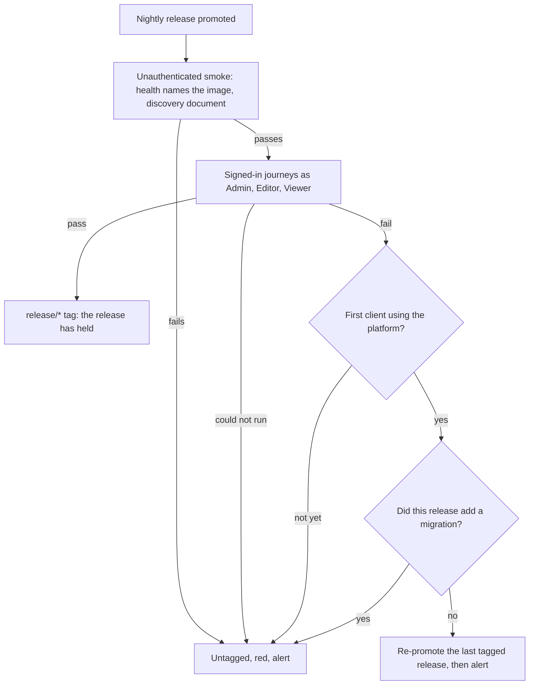
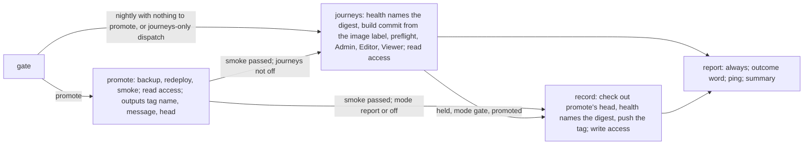
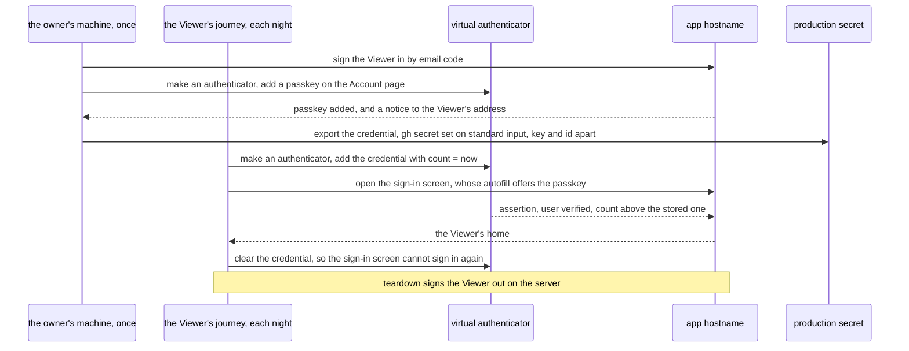
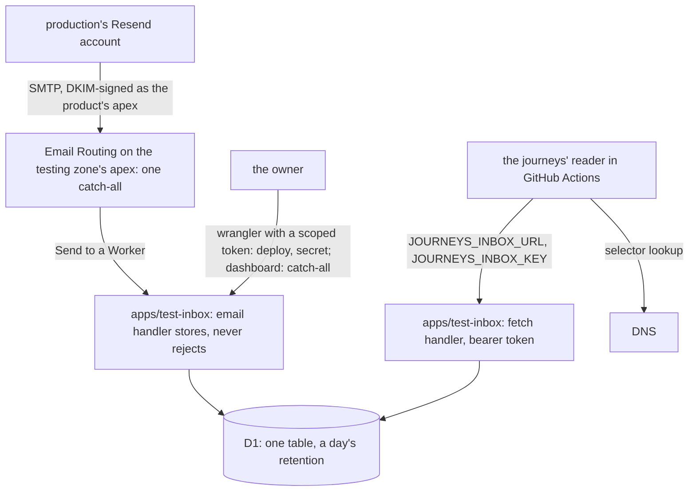
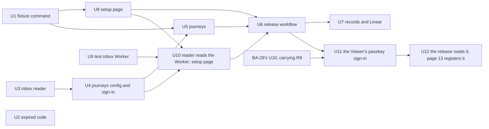

# Signed-in Journeys in Production - Plan

## Goal Capsule

- **Objective:** every release to production proves, by signing in as each workspace role, that the signed-in product works as deployed, and it does so without slowing how fast changes land.
- **Means:** a small set of Playwright journeys runs in the nightly release run against a test workspace in production, signing in through a test inbox of its own, first reporting and then deciding the tag (KTD1, KTD2, KTD3, KTD12).
- **Product authority:** the owner, through Linear BA-34. The decisions below were settled with the owner on 02/10/2026, and the test inbox's form on 03/10/2026 (KTD3); BA-34's original acceptance criteria give way to this contract where the two differ (Scope Boundaries).
- **Open blockers:** none. R9 ships inside BA-28's U10 (KTD21); R8 is U11 and U12, which start once that U10 is on `main`; R16 is BA-48 (Scope Boundaries).
- **Stop conditions:**
  - The edge refuses a browser from GitHub's runners: stop, and put the choice to the owner, because the zone's bot setting cannot be bypassed by a rule.
  - A settled decision proves unworkable in practice: stop and report it rather than work around it.
  - A unit would edit `apps/api/src/smtp.ts`: stop, because the people-invitations work owns that file.
  - Any file in the repository would name the testing domain, the Cloudflare account, or the test inbox's URL: stop, because those are estate values (KTD20).
- **Execution profile:** `ce-work` builds the units; each change lands through the merge queue under CI's `check`. The owner carries the steps on U8's runbook page, as U10 rewrites it: the testing zone and its Email Routing, the test inbox's deploy and token, the secrets, the healthchecks check, running the fixture command, the proof dispatch, and switching the journeys from report to gate. For R8 the owner also approves, at the time, the one-time registration of the test Viewer's passkey against production, run from U11's branch before U11 and U12 merge (U12).

---

## Product Contract

### Summary

Production gains a test workspace with a standing Admin, Editor and Viewer, and enough invented members to page, load more and act in bulk. Its invitations reach only the testing domain. A small set of signed-in journeys signs in as each of them, through the same email code everyone uses, in every nightly release run. A release counts as held only once they pass, and no journey runs on a pull request or in the merge queue.

### Problem Frame

Nothing signs in to production after a release. The release's smoke waits for `/health` to name the promoted image and reads one discovery document (`.github/workflows/release.yml:148-157`, `deploy/await-release.sh`). `pnpm ops smoke` is unauthenticated too. A defect that shows only in the deployment, such as the hostname, cookies over TLS, the edge's rules, real mail, or a migration over real rows, reaches production unseen until someone signs in and trips over it.

The browser suite proves behaviour well, but not the deployment. It serves the production web build against the real api code and a throwaway Postgres, seeding each spec through a harness that is not in the production image (`apps/api/tests/harness-control.ts`, `apps/api/Dockerfile:223-227`).

There is nowhere else to sign in either. Staging exists only for the monthly drill or a rehearsal, holds no person between drills, and has no hostname and no mail (`docs/operations/RUNBOOK.md:160`, `:270`; `deploy/seed-synthetic.sh:15`).

The stakes have moved. The first client's bundle is in production and releases are nightly (`RELEASE_MODE=nightly` since 27/09/2026). The client is not using the platform yet and is not expected to before S2 to S4 are covered. The owner already dogfoods production as Admin of two workspaces and as the operator. Their own way to see a change before it is released, the local loop on port 3200, works (`apps/api/tests/local.ts:54`). An attempt there that stalled at sign-in was stale local state, not a defect.

### First-Principles Reasoning

BA-34 asked for the approach to be chosen from first principles, and for the record of which earlier decisions it keeps or reverses.

- **Function needed:** know that a signed-in screen works, as deployed, for each role, before a client meets it, without slowing the pace of work while the product is still being built.
- **Facts it rests on:**
  - Production releases nightly and holds a client's bundle.
  - CI reaches production only through its public edge and the orchestrator's API, never over SSH (`docs/operations/CI.md`, *The nightly backup*).
  - The two boxes have 4 GB each and cannot grow; a third box is a new contract (`docs/operations/coolify.md`, *Boxes*).
  - Migrations are forward-only, so an image rollback cannot cross one (`docs/operations/RUNBOOK.md:74`, `:90`).
- **Hard constraints:** production gains no way in that skips sign-in, and no credential the tests hold carries the operator mark or a membership outside their own workspace.
- **Inherited form set aside:** a staging or per-change preview copy as the default answer. It would test a copy of the deployment rather than the deployment itself, and it costs memory the boxes do not have.
- **Earlier decisions:**
  - Kept: staging on demand and never standing (ADR 0024); the seed's rule that staging at rest holds no person; no SSH from CI.
  - Extended: a release is recorded only once it has held (ADR 0022), and "held" now includes the signed-in journeys.
  - New: production holds invented people, marked as such, in a workspace of their own.
- **Biggest remaining risk:** a flaky journey. R15, R17 and R23 keep it from reverting work, holding a change back or counting an outage as a defect, and Success Criteria watch it.

### Actors

- A1. The owner: dogfoods production, is the operator, runs the fixture command, reads the alerts and decides on a rollback until R16 applies.
- A2. The release workflow: promotes the nightly release, runs its smoke and the journeys, and records the release.
- A3. The test people: the test workspace's Admin, Editor and Viewer, whom the journeys sign in as.
- A4. The agents building changes: judge UX before a change lands, keep each journey in step with its screen, and show the owner a change mid-build when asked.
- A5. The first client: in production with a bundle, not yet using the platform.

### Key Decisions

- **The test people live in production, in a workspace of their own.** It tests the deployment itself with nothing new to host. (session-settled: user-approved — chosen over a standing staging copy, and over staging in stages: the real deployment is what needs proving, and the boxes have no memory to spare.) Governs R1, R2.
- **Test people sign in the real way.** (session-settled: user-approved — chosen over passkeys alone and over a test-only shortcut: production gains no new way in, and the email-code path is itself under test.) Governs R7, R8, R10.
- **The test workspace invites only the testing domain.** The fixture command marks the workspace, and an invitation from a marked workspace to an address off the testing domain is refused; the journeys never invite. (session-settled: user-approved — chosen over accepting the risk with next-night detection: a leaked test-Admin sign-in could otherwise mail any address through production's Resend account, and a flood could get the account suspended, taking every workspace's sign-in codes with it. The 200-an-hour ceiling on a workspace's invitation emails that the people-invitations work adds stays as a second layer, not a replacement.) Governs R25.
- **No standing test operator.** The operator console is proven in the browser suite and by the owner. (session-settled: user-approved — chosen over read-only or full operator journeys in production: an operator credential in CI would reach every client's workspace.) Governs R3.
- **Standing invented members, marked.** (session-settled: user-approved — chosen over proving volume in the browser suite only, and over members created and removed each run: paging and bulk acts are seen as deployed, and a run sends no mail per member.) Governs R4, R5, R12.
- **Journeys run inside the release run.** (session-settled: user-approved — chosen over a schedule apart from releases: the release that introduces a defect is the one that fails.) Governs R13, R14, R22.
- **Automatic rollback, once the client uses the platform.** (session-settled: user-approved — chosen over leaving every rollback to the owner, a standing preview of `main`, and a workspace-scoped early release: it keeps a broken screen from the client for more than minutes once they rely on it, and costs nothing until then.) Governs R15, R16.
- **Pace comes first while the product is built.** The owner ruled that this work must not slow how fast changes land. Governs R17.
- **A small dedicated journey set, not the browser suite retargeted.** The suite's specs seed through the harness and assume a fresh database, so making them tolerate standing data would cost every future spec. (session-settled: user-approved — chosen over tagging browser-suite specs to run against production as well.) Governs R11.
- **UX is judged before a change lands.** (session-settled: user-approved — chosen over agents walking production, a screenshot gallery per release, and visual-regression baselines: judgment belongs where a change can still be corrected cheaply.) Governs R18.
- **The owner sees changes by dogfooding production and through the local loop.** No standing preview is built. A workspace-scoped early release is the recorded route if the owner later needs to see a change before the client does (Scope Boundaries).

### Requirements

**The test workspace and its people**

- R1. Production holds one test workspace, separate from every client's, that exists for the journeys alone.
- R2. The test workspace has three standing test people, one each as Admin, Editor and Viewer, who hold no membership anywhere else.
- R3. No test person is the operator or a member of any other workspace, and the journeys hold no credential beyond the test people's sign-ins, the test inbox and the alert's ping.
- R4. The test workspace holds standing invented members, enough that every list the journeys page through runs to more than one page.
- R5. Every test person and invented member has an address on a domain kept for testing, so anything that lists or counts people can tell them from real people.
- R6. The platform's own tooling creates the test workspace and its people and tops them up, so a damaged fixture is restored by running it again.
- R25. An invitation from the test workspace, sent or resent, reaches only an address on the testing domain, and nothing an Admin of the workspace can do lifts that.

**Signing in**

- R7. Test people sign in through the same email-code path as everyone else, reading their code from an inbox the journeys reach through an API.
- R8. Once BA-28 lets a person sign in with a passkey, the journeys also sign in with one held by a virtual authenticator.
- R9. Once BA-28 requires an Admin to hold a second factor, the test Admin holds one the journeys present at sign-in; the re-confirm dialog stays the browser suite's to prove.
- R10. Production gains no route, flag or token that signs a test person in without an email code or a passkey.

**The journeys**

- R11. A small dedicated set of journeys signs in as each test person, opens the screens that role reaches, and carries out one representative act on each, including Load more on the Audit log and a bulk act over the invented members. A screen whose acts would upload documents or spend on models is only read.
- R12. Every act a journey takes leaves the test workspace as it found it, so each run starts from the same standing data.
- R24. Each run first checks that the test workspace holds only its fixture, with no waiting invitations and no bindings, and treats any difference as a run that could not run and a possible compromise.

**Releases**

- R13. The journeys run after each production release, inside its run and before its `release/*` tag.
- R22. On a night with nothing to release, the journeys run against the live release.
- R14. A release counts as held only when the journeys pass. A failure leaves it untagged, turns the run red and alerts the second channel.
- R23. A run that could not run, because the inbox was unreachable, the edge challenged or refused the browser, or a code was refused for too many asks, also leaves the release untagged, and alerts as could-not-run, never as a failure of the release.
- R15. Until the first client is using the platform, a failure never rolls production back: the owner decides, as with the runbook's rollback today.
- R16. From the day the first client is using the platform, a failure re-promotes the last tagged release, unless the failed release added a migration, which alerts the owner instead.
- R17. No journey runs on a pull request or in the merge queue, and a failed journey never holds a change back from landing. The unit tests this work adds run in `check` like any other.

**Before a change lands**

- R18. The workflow names the route for judging a signed-in screen's UX against its spec: `/ce-dogfood` walks the change as the personas on its own build, beside the browser suite's behaviour and accessibility checks.
- R19. The browser suite gains BA-34's two sign-in gaps: a real expired code entered through the client, and a 429 shown on the sign-in screen.

**Records**

- R20. ADR 0022's doc records that a release holds only once the journeys pass, and when automatic rollback applies. `CONTEXT.md` names the test workspace and its people.
- R21. BA-34's acceptance criteria in Linear are rewritten to match this contract.

### Key Flows

- F1. A nightly release
  - **Trigger:** the release workflow's nightly run promotes the newest green commit.
  - **Actors:** A2, A3, A1
  - **Steps:** the promoted image answers `/health`; the discovery document checks out; the journeys sign in as each test person and walk their screens; on a pass the release is tagged; on a failure or a run that could not run it stays untagged, the run turns red and the owner is alerted; from the day R16 applies, a failure re-promotes the last tagged release unless a migration rode in.
  - **Covered by:** R13, R14, R23, R15, R16



- F2. A UI change before it lands
  - **Trigger:** an agent finishes a change to a signed-in screen.
  - **Actors:** A4, A1
  - **Steps:** the browser suite runs its behaviour and accessibility checks on the change's build; `/ce-dogfood` walks the changed screens as the personas; a change to a journeyed screen changes its journey in the same pull request; when the owner is asked a question that seeing would answer, the agent starts the local loop on the change and gives them a link or screenshots.
  - **Covered by:** R18, R19

- F3. A night with nothing to release
  - **Trigger:** the nightly run finds no newer green commit.
  - **Actors:** A2, A3, A1
  - **Steps:** the journeys check out the commit the live api image was built from (KTD14) and run against the live release; a pass pings the alert check, and a failure or a run that could not run alerts.
  - **Covered by:** R22, R14, R23

### Acceptance Examples

- AE1. **Covers R14, R15.** Given the first client is not yet using the platform, when the Viewer's journey fails after a nightly release, then the release has no tag, the run is red, the owner is alerted, and production stays on the new release until the owner acts. The next night's run releases the newest green commit, which may be the same one.
- AE2. **Covers R16.** Given the first client is using the platform, when a journey fails after a release that added no migration, then the last tagged release is promoted again and the alert says so. When the failed release added a migration, nothing is rolled back and the run's summary names the migration.
- AE3. **Covers R12.** Given the test workspace holds its standing invented members, when the Admin journey changes three of them from Viewer to Editor and adds them to a group made for the run, then the run changes them back and deletes the group before it ends. When a run fails midway, the next run's opening repair puts them back first.
- AE4. **Covers R17.** Given last night's journeys failed, when a pull request is approved, then it lands through the merge queue as usual: no check on it reads the journeys' result.
- AE5. **Covers R10.** Given an attacker knows a test person's address, then no request to production signs them in without the code that address receives or a passkey.
- AE6. **Covers R23.** Given the inbox's API answers an error, when the journeys run, then the release stays untagged and the alert says could-not-run, not fail.
- AE7. **Covers R24, R23.** Given someone has invited an address to the test workspace, when the journeys run, then the Admin journey's first step finds the waiting invitation, takes no act, the Editor and Viewer never sign in, and the run alerts as could-not-run, naming a possible compromise in its summary.

### Success Criteria

- A signed-in defect that shows only in the deployment is caught by the release that brings it, not by the owner or the client.
- The journeys add no time to a pull request or to the merge queue.
- A failed run names the role, the screen and the step, so the owner can tell a real defect from a flaky journey without rerunning it.
- A run's sign-ins stay inside the api's limit of five codes per address in ten minutes (`apps/api/src/auth/constants.ts:24`).

### Scope Boundaries

- **A standing staging copy, or a preview per change:** not built. ADR 0024 stands.
- **Workspace-scoped early release:** deferred. It is the route if the owner needs to see a change before the client does: changes reach production switched on for the test workspace and the owner's own first. Every change would then carry a flag, and migrations cannot be scoped.
- **A test operator, or journeys over the operator console in production:** out (R3). The console is proven in the browser suite.
- **Screenshot galleries, visual-regression baselines, and agents dogfooding production:** out (R18).
- **The Resend emulator (`vercel-labs/emulate`):** not used. It emulates Resend's REST API only, while the api sends over SMTP; the local loop and the browser suite already capture mail in-process; and the journeys need a real inbox.
- **Releases in `per-merge` mode:** not journeyed. That mode ended when the first client's bundle landed; a release called from `build.yml` keeps today's smoke-only record.
- **BA-34's original criteria that this replaces:** the operator among the tested roles, and "the owner can sign in to a copy of an unreleased change". The owner's route to an unreleased change is the local loop (F2).
- **A bulk removal in production:** out of the journeys. CI cannot restore a removed member (only `pnpm ops add-member` can, on the api service), so bulk removal stays proven in the browser suite.
- **Filtering test people out of the operator console:** not built. The testing domain in the address column is the mark R5 asks for.

#### Deferred to Follow-Up Work

- **R16, automatic rollback.** Its own Linear issue, to land before the first client uses the platform. The flow analysis found that a safe version needs: the rollback inside the failed run rather than a dispatched release (a dispatch tags `main`'s head and needs `actions: write`); a rejected marker the nightly gate skips; the migration baseline taken from the commit the live digests were built from, with a check that cannot run treated as a migration; no rollback from a run that is itself a rollback; and a failure at the sign-in step only alerts, because anyone who knows a test address can rotate its code.
- **ADR 0027 and MIT-0.** Its licence list names MIT but not MIT-0, while `apps/api` already ships `nodemailer` (MIT-0) and U10's `mailauth` and `mailparser` pull it in too. The owner decides whether the list names MIT-0; this work adds no licence the repository does not already ship.
- **R9, the test Admin's second factor.** Ships inside BA-28's U10, with the gate that needs it (KTD21). The owner enrolled the test Admin's authenticator and passkey, and set `JOURNEYS_ADMIN_AUTHENTICATOR_KEY`, on 03/10/2026.

### Dependencies / Assumptions

- **BA-28.** R8 waits on passkey sign-in (its U6), and R9 on the second-factor switch-on (its U10, `docs/plans/2026-10-01-2241-feat-people-sign-in-and-security-plan.md`).
- **A receiving inbox.** The owner registered a testing domain at Cloudflare on 03/10/2026; it is a zone of its own in the account that holds the product's zone, and nothing is set on it yet. Email Routing on its apex hands every message to the test inbox Worker (KTD3, KTD18), so nothing changes on the product's zone, whose apex mail is the owner's Google Workspace.
- **The client's start.** The owner expects the first client not to use the platform before S2 to S4 are covered. R16 waits on that day.
- **The release's timing.** Releases run nightly; GitHub starts the schedule hours late, around 09:00 (`docs/operations/CI.md`, *The nightly backup*). The journeys lengthen the release run, not any pull request.
- **Rollback limits.** Migrations are forward-only and an image rollback across one is recorded as not working (`docs/operations/RUNBOOK.md:74`, `:90`), which is why R16 stops at a migration.
- **Mail stays awaited.** The paced transport the invitations work adds to `apps/api/src/smtp.ts` is a pooled nodemailer transport whose send resolves only once the SMTP server accepts the message, so a refused send still fails the Send step (confirmed by that work on 02/10/2026; `apps/api/tests/smtp.test.ts` proves it against a loopback relay). Every api email shares one queue paced at five a second, so a sign-in code can wait about a second behind a round of invitations, well inside KTD4's 90 seconds.
- **The people-invitations work (#511) lands first.** It rewrites the invitation acts R25's guard sits in, splits them across `invitations.ts`, `invitation-bulk.ts`, `invitation-ceilings.ts` and `invitation-statuses.ts`, moves the invitation counters to a workspace-keyed table under RLS, and claims migration 0061.

### Sources / Research

- Linear BA-34: the owner's two aims, the original acceptance criteria, and the comment holding the two sign-in gaps.
- `.github/workflows/release.yml:72-222`, `deploy/await-release.sh:21-31`, `deploy/release-gate.sh:47-85`: the promote job, the smoke, the tag as the release's last step, and the gate's three triggers.
- `docs/operations/CI.md` (`release.yml`): release modes, the gate, the record, the nightly backup.
- `docs/operations/RUNBOOK.md:65-74`, `:74`, `:90`, `:160`, `:260`, `:270`: rollback by tag, forward-only migrations, staging between drills, `ops add-person`, staging without mail.
- `docs/operations/coolify.md` (*Boxes*, *Ingress (Cloudflare)*, *Memory*): two 4 GB boxes, the tunnel and three hostnames, the per-IP edge rule (its threshold is estate configuration).
- `CONTEXT.md:715-718` (release phases), `:774-777` (operator).
- `deploy/seed-synthetic.sh:15-38`: the fixture holds no person.
- `apps/api/tests/local.ts:9`, `:54`: the local loop and its Dogfood workspace.
- `apps/api/src/auth/constants.ts:24`, `:62-75`: five codes per address in ten minutes; Better Auth's per-IP rules, keyed on `cf-connecting-ip` (`apps/api/src/auth/auth.ts:428-436`).
- `apps/web/e2e/sign-in.spec.ts:251-297`, `:368`: the 429 on the sign-in screen, already covered.
- `apps/web/src/shared/navigation.ts:478-508`: every built screen is Admin-only; Editors and Viewers land on an unbuilt home.
- `apps/web/src/features/people/members-tab.tsx:49-50`, `packages/core/src/members/audit-log.ts:27`: Members pages at 25; the Audit log loads 50 more at a time.
- `packages/core/src/members/bulk.ts:90-239`, `packages/core/src/members/groups.ts`: which bulk acts the screen can undo.
- `docs/dogfood-reports/2026-09-30-docs-shell-people-dogfood-dogfood.md:104`: dogfood reads codes from the harness.
- `docs/solutions/architecture-patterns/`: ADR 0022 (two stacks deployed by digest), ADR 0038 (the audit log is append-only), ADR 0041 (secrets in seven credential classes), ADR 0043 (what an act is).
- Resend's docs, read 03/10/2026: only a full-access key reads received mail, and a full-access key can also list and retrieve the team's sent emails, so one in production's team could read any person's sign-in code. Playwright 1.63 `context.credentials`.
- Cloudflare Email Service (the Email Routing docs moved there in 2026): the email handler and `ForwardableEmailMessage` (https://developers.cloudflare.com/email-service/api/route-emails/email-handler/), what Email Routing rejects (https://developers.cloudflare.com/email-service/reference/postmaster/), the catch-all and its apex-only rule (https://developers.cloudflare.com/email-service/configuration/email-routing-addresses/), and the free plan's limits, including the email handler's share of the 10 ms CPU limit (https://developers.cloudflare.com/email-service/platform/limits/, https://developers.cloudflare.com/workers/platform/limits/).
- cloudflare/workerd#6740 (open): a catch-all-to-Worker message carried no `Authentication-Results`, `Received` or `DKIM-Signature` in `message.headers`; whether `message.raw` keeps them is undocumented, which is why U9 opens with a spike.
- D1's consistency without the Sessions API and its free-plan limits (https://developers.cloudflare.com/d1/best-practices/read-replication/, https://developers.cloudflare.com/d1/platform/limits/); KV's "60 seconds or more" to show a write (https://developers.cloudflare.com/kv/concepts/how-kv-works/).
- For U11 and U12, read from the installed packages on 03/10/2026: `@simplewebauthn/server` 13.3.3's `verifyAuthenticationResponse` refuses a count that does not exceed the stored one, and `@better-auth/passkey` 1.7.5 and `apps/api/src/auth/confirm.ts` store the new count after each sign-in; `playwright-core` 1.63.0's `context.credentials` creates every credential at count zero; Chromium's DevTools `WebAuthn.addCredential` and `getCredentials` carry the private key, user handle and sign count. The browser suite's `apps/web/e2e/virtual-authenticator.ts` and `apps/web/e2e/passkeys.spec.ts` already drive the Account page and autofill sign-in this way. `apps/web/src/features/auth/passkey-hooks.ts` arms autofill when the email step mounts, so a held resident credential signs in on landing.
- `mailauth` 7.1.0 (MIT) and `mailparser` 3.9.33 (MIT), read from npm on 03/10/2026. Both depend on `nodemailer`, which is MIT-0 and already a direct dependency of `apps/api`, so they add no licence the repository does not already ship; ADR 0027's list names MIT but not MIT-0.

---

## Planning Contract

**Product Contract preservation:** restructured and changed, with the owner's confirmation of the plan-time synthesis on 02/10/2026, then tightened by the architecture, security and rollout reviews the same day.
- Changed: R3 (narrowed to what holds: a leaked sign-in can still act as the test Admin inside the test workspace). R9 (a journey that has just signed in is fresh for the hour, so production never reaches the re-confirm dialog; its proof stays the browser suite's). R11 (Load more is the Audit log's; screens whose acts upload or spend are only read). AE1, AE2 and AE3 reworded to what the release path and the screens can do. AE7 reworded to the fixture check inside the Admin's one sign-in (KTD16).
- Staged: R14 and AE1 hold once `JOURNEYS_MODE` is `gate`; in `report`, the rollout phase U6 lands in, the journeys run and report while the record job tags on the smoke as today (KTD12).
- Added: R22 (nights with nothing to release), R23 (a run that could not run is classed apart), R24 (each run checks the fixture is intact), F3, AE6, AE7. Per-merge releases are named out of scope.
- Added after the doc review, by the owner's decision on 02/10/2026: R25 and KTD17 (the test workspace invites only the testing domain), so a leaked test-Admin sign-in can act inside the test workspace but cannot mail anyone outside it. R17 and the Summary now say no *journey* runs on a pull request, since this work's unit tests run in `check`. U8's leak page now removes what the run flagged.
- Deferred: the build of R8, R9 and R16 (Deferred to Follow-Up Work). Outstanding Questions resolved into KTD3 to KTD9.
- R19's 429 half already exists in `apps/web/e2e/sign-in.spec.ts`; U2 adds the expired code.
- Changed on 03/10/2026, by the owner's decision: KTD3's test inbox becomes a Cloudflare Email Worker on a testing domain of its own. No requirement changes; R5 and R7 hold as written. KTD4 now cites KTD19 for how a message's authentication is judged, and KTD18 to KTD20 and units U9 and U10 are added before U6.
- Changed later on 03/10/2026, by the owner's decisions: R9 ships inside BA-28's U10 rather than as a unit here (KTD21), and R8 is planned as U11 and U12 (KTD22 to KTD25). No requirement text changes.

### Key Technical Decisions

- KTD1. **The journeys get a job of their own in `release.yml`, and the tag moves to a record job.** The promote job keeps backup, redeploy and the unauthenticated smoke, drops to read access, and hands the record job the tag's name, message and resolved head as outputs. A journeys job holds read access and only its own secrets. The record job checks out exactly that head, makes the one tag and the one push, and installs nothing. A package install and a browser never share a job with a write token, and the record cannot tag a commit that landed during the journeys. Governs R13, R14.
- KTD2. **Every nightly run runs the journeys.** When the gate promotes, they run after the smoke against the new release; when a scheduled run has nothing to promote, in `nightly` mode or after go-live in `drill`, the gate sets a journeys-only flag and they run against the live release. A merge-triggered skip never sets that flag. They sit in the release's concurrency group, so they never overlap a release, and they give the alert a nightly heartbeat. Releases called from `build.yml` do not run them (Scope Boundaries). (session-settled: user-approved — chosen over a separate daily schedule: one place, no overlap with a release.) Governs R13, R22.
- KTD3. **The test inbox is a Cloudflare Email Worker on a testing domain of its own.** The testing domain is a Cloudflare zone of its own. One catch-all rule on its apex hands every message to the test inbox (KTD18), and the journeys read it through the inbox's API with a token that reads the inbox and does nothing else. Any Resend key that reads mail is full access, and one in production's team could read every person's sign-in code. The product's zone is untouched: its apex mail is the owner's Google Workspace, and Email Routing on a subdomain needs the apex's Email Routing switched on. (session-settled: user-approved — chosen over a receiving domain in production's own Resend team.) (session-settled: user-directed — chosen over a Resend team of its own: a second team moves the account to a paid plan, and the Worker is free.) (session-settled: user-directed — chosen over a subdomain of the product's zone, Google Workspace's test domain with aliases, and moving another project's domain to Cloudflare: the first would replace the owner's mail exchangers, the second would put a credential to a real mailbox in CI, and the third would tie the inbox to another project's hosting.) Governs R5, R7.
- KTD4. **A code is matched by novelty, recipient and sender, and ambiguity is never guessed.** Before pressing Send, the journey notes the inbox's ids; it then polls, for up to 90 seconds, for a new message to that person from the production sender, and reads the code from its text part by the six-digit line rule the harness uses (`codeIn`). More than one new verified message in the window (KTD19) makes the run could-not-run: anyone who knows a test address can rotate its code. It never presses Send twice and never opens the link (R10). Governs R7, R10, R23.
- KTD5. **One sign-in per test person per run, serially, with no retries.** A second send would spend the per-address and per-IP ceilings that the release, a rerun and the owner share. The addresses are held as `production` environment secrets, never committed and never printed: the repository is public, and a variable prints in its logs. (session-settled: user-approved — chosen over committed addresses.) Governs R7, R23.
- KTD6. **One guarded, idempotent ops command creates and repairs the fixture, run by hand on the api service.** It ensures the test workspace, its mark naming the testing domain (KTD17), the three test people in their roles, and 51 invented members as Viewers, setting back any role that drifted and changing nothing that is already right; each change is an audited act (ADR 0043). It refuses an address off the testing domain, an address carrying the operator mark, and a workspace with that slug whose members are not all on the testing domain; it reports unexpected members and never removes them. CI never runs it. (session-settled: user-approved — chosen over repeating `add-person` and `add-member` by hand, which cannot reset a role.) Governs R1, R2, R3, R4, R5, R6.
- KTD7. **Journeys take only acts the screen can undo and that cost nothing.** The Admin journey opens by repairing what a failed run left: three fixed invented members back to Viewer, and any group named for the journeys deleted. Its bulk acts move those three from Viewer to Editor and back, and add them to a group made for the run, which it then deletes. No act ever makes anyone an Admin, which mails the person and, after BA-28, makes their next request pending. Bindings and Routes and spend are only read. Governs R11, R12.
- KTD8. **Three outcome words, pinged by a final job that installs nothing.** A run ends `held`, `fail` or `could-not-run`. A report job runs last whenever the journeys were due (U6 step 4 gives its condition and mapping), holds the ping URL alone, maps the journeys' result to a word, and pings success or failure with the word as its body; the role, screen and step go to the run's summary, never the ping (*Own state on disk, prove every job, and wipe staging*, in `deploy/CODING_STANDARDS.md`). A failed ping never fails the run, and an unset ping URL is reported as such in the summary. The URL is the UUID form of a check in a healthchecks project apart from the backup checks, so it cannot ping `pg-hourly` or `nightly`. The check's period is nightly with a grace that absorbs GitHub's late start. Governs R14, R23.
- KTD9. **`/health` must name the digest under test before the journeys run and before the tag.** A late rerun cannot then record a release production no longer runs. Governs R13, R14.
- KTD10. **The journeys live beside the browser suite, in a config of their own, and reuse it without changing it.** No web server, a base URL from `PUBLIC_URL`, their own test directory so `check:web` never runs them, one worker, no retries, and a preflight project the role journeys depend on. They extend the suite's `test` from `apps/web/e2e/browser.ts`, overriding the context and request without the client-address header, so the accessibility gate is reused unmoved. The locator helpers move to a module with no harness calls that `apps/web/e2e/harness.ts` re-exports, and a lint rule keeps harness acts out of the journeys except the harness code source. They read the SPA's word tables, so a renamed word fails `check`'s typecheck before it lands. Governs R11, R17.
- KTD11. **The expired code is proven through a harness act that ages the stored code**, after the precedent of `/__harness/sign-ins/aged`, since five minutes is too long for a spec to wait. Governs R19.
- KTD12. **A repository variable stages the journeys: off, report, then gate.** It fails closed on any other value, like `RELEASE_MODE`. In report, the journeys run and report, and the record job tags on the smoke as today; in gate, the record job requires `held`. U6 lands in report, and the owner switches to gate after three consecutive held nights. Switching back to report or off is U6's rollback, in seconds and without a pull request. Governs R14.
- KTD13. **A journeys-only dispatch input.** The gate acts on it before it decides to promote: no promote, no record, no tag, the journeys against the live release. It is the proof before U6 lands, run once from U6's branch while the `production` environment still allows branches, and afterwards the owner's way to rerun the journeys after fixing a setup fault. Governs R13, R22.
- KTD14. **The journeys check out the commit the live api image was built from.** It is read from the image's revision label for the digest `/health` names, on every path, so a rollback night runs the old commit's journeys against the old images. A commit that is not an ancestor of `main`, or an image with no revision label, makes the run could-not-run. The same baseline is what R16 needs later. Governs R13, R22.
- KTD15. **Nothing leaves a run but its outcome word and its summary.** The journeys config turns off traces, screenshots and video; the journeys job uploads nothing; the inbox is called outside any browser context; every role journey signs out on the server in its teardown, even after a failure; no address or URL containing one is printed. A failed run's trace would otherwise publish a live session in a public repository. The inbox key sits on the journeys step's environment, not the job's, so the package install never sees it. Governs R3, R10.
- KTD16. **The fixture is checked before any act, inside the Admin's one sign-in.** The preflight signs nobody in: it confirms `/health`, the sign-in screen without a challenge, and the inbox. The Admin journey then signs in and, as its first step, reads the test workspace: a member outside the fixture set, a member in another role than the fixture gives them (the test people in theirs, the three repair members Viewer or Editor, every other invented member Viewer), a waiting invitation or a binding ends the run could-not-run with "possible compromise" in its summary, before any act and before the Editor and Viewer sign in. Governs R24.
- KTD17. **A marked workspace's invitations reach only its testing domain.** The mark is a table of its own under RLS, keyed by workspace and holding the testing domain, after the pattern of `workspace_last_active` (`packages/schema/src/last-active-tables.ts`); it is not Better Auth's `workspace.metadata`. Only the fixture command writes it; no tRPC procedure or screen act does. The check sits where each act learns its addresses, beside the ceilings every send already passes: the invite's per-address check beside `already-a-member` (refused items keyed by position), single and bulk resend (so an invitation minted before the mark cannot go out), and `mintInvitation` for an approved access request. It is one new refusal word, registered and classed in `MEMBER_REFUSALS`, listed in each act's `refuses`, and given its sentence in the SPA's people refusal words. An unmarked workspace is unaffected. (session-settled: user-approved for the guard; its placement agreed with the people-invitations work.) Governs R25.
- KTD18. **The test inbox stores what it receives and judges nothing.**
  - **Receiving.** The email handler writes each message to D1 before it does anything else: the envelope recipient, the header `From`, the subject, the time it arrived, and the raw bytes. A header the message lacks is stored as an empty string, so one malformed message cannot break every list for a day. It never rejects, forwards or throws back to Email Routing, because a bounce to production's Resend account puts the test address on Resend's suppression list, and every later night would then read `no-mail`. A message over 256 KiB is dropped and logged, not refused. Each insert deletes rows more than a day old.
  - **Reading.** The fetch handler serves `GET /emails/receiving` and `GET /emails/receiving/:id` at the root of its hostname, behind a bearer token compared in constant time. The list keeps Resend's shape, which `apps/web/journeys/inbox.ts` already parses: newest first, `limit` up to 100, `after` an id, `has_more`, and items carrying `id`, `to`, `from`, `created_at` and `subject`. A retrieve answers the message's raw bytes, base64, in place of Resend's `text` and `authentication`. `POST /probe`, behind the same token, writes and deletes one probe row, so the preflight sees a store that cannot write before any Send is spent. A store error answers a 503, never an empty list, which would read as `no-mail`. Anything else answers JSON with a 401, 404 or 405, never a redirect or an HTML page.
  - **Why D1.** KV can take a minute or more to show a write to another location, too close to KTD4's 90 seconds; D1 without its Sessions API reads from the primary, so a write is visible to the next poll.
  - Governs R7, R23.
- KTD19. **The reader judges a message's authentication itself, from its DKIM signature, and an unverified message is noise.**
  - **The rule.** For each new message to the person whose `From` is production's sender, the reader retrieves the raw bytes and verifies their DKIM signatures with `mailauth`, looking each key up in DNS from the runner with a bounded timeout. The message counts only when a signature passes whose signing domain is the domain of production's sender address (`JOURNEYS_SENDER`) and whose signed headers include `From` and a `To` naming the person, so a genuine email re-sent to a test address cannot pass as a new one. If U9's spike shows Resend does not sign `To`, that clause goes. Production's sender is an address on the product's apex and Resend signs as the apex, so strict equality holds.
  - **Unverified messages.** A message that fails is set aside and the poll goes on, so a forged `From` cannot end the wait. A key lookup that fails is retried on the next poll. A poll that finds exactly one verified message yields its code at once, and two verified messages with different `Message-ID`s answer `ambiguous`; a verified message that lands later is met by the re-ask after a refused code, as today. Only the deadline decides the rest: set-aside messages and no verified one answer a new word, `unverified`, which is could-not-run, because production's own signature breaking in transit looks the same; nothing at all answers `no-mail`.
  - **Why the reader.** Cloudflare hands the Worker no verdict a sender cannot forge (cloudflare/workerd#6740), and the product domain's DMARC policy is `p=none`, so Email Routing lets a forged `From` through. Checking in the reader keeps all cryptography out of the Worker's 10 ms CPU limit, and makes DNS and the signature the trust anchor rather than the Worker or its store.
  - **If the spike finds no signature that verifies.** U9's spike settles whether the signature survives the Worker. If it does not, U10 keeps KTD4's novelty rule alone, as `inbox.ts` does today when a provider gives no verdict: every new message to the person from production's sender is a candidate, and more than one is could-not-run. `mailauth`, the lookups and `unverified` then go, and page 13 records that a forged message can force could-not-run, as a rotated code already can. The product's zone and its DMARC policy stay untouched either way.
  - Governs R7, R10, R23.
- KTD20. **The test inbox is `apps/test-inbox`, a second TypeScript deployable, deployed by hand.**
  - **Placement.** It is test infrastructure on Cloudflare, outside the product's two stacks and four stores. ADR 0029's sentence that `apps/api` is the one TypeScript deployable is amended to name it, in the same commit (AGENTS.md).
  - **Deploy.** The owner deploys it by hand, as the tunnel and edge rules are set by hand, with `wrangler` pinned once in the workspace's `wrangler` script and run through `pnpm dlx`; a Renovate custom manager keeps that one pin current. `wrangler` is not a workspace dependency, so its runtime binaries stay out of every CI install and the api image. CI holds no Cloudflare credential that can change it.
  - **The deploy credential.** The owner runs `wrangler` with a Cloudflare API token scoped to the account's Workers Scripts and D1 edit permissions, plus only the read permissions `wrangler` asks for, and no zone permission, passed as `CLOUDFLARE_API_TOKEN` for each run and kept in the password manager. Never `wrangler login`: its default grant can write Worker routes across the account, the product's zone included. The narrow token still reaches one thing on the product's zone: Cloudflare accepts the account's Workers Scripts edit alone for attaching a Worker to a custom domain on any zone in the account, so the token is held like a credential to the product's hostnames, and page 13's leak bullet checks the account's Worker domains. A Cloudflare account of the testing zone's own would remove that reach; it is the owner's call.
  - **Nothing private in the repository.** Its committed config names no domain, route, zone or account. The catch-all is bound to the Worker in the dashboard, and the Worker answers on its `workers.dev` hostname. Its URL reaches the journeys as the `production` secret `JOURNEYS_INBOX_URL`, read in one place, `apps/web/journeys/fixtures.ts`, and a missing one is could-not-run naming the setting.
  - Governs R3, R7.
- KTD21. **R9 ships inside BA-28's U10.** U10's pull request makes the Admin journey confirm with an authenticator code computed from `JOURNEYS_ADMIN_AUTHENTICATOR_KEY` after the email code, and reads a missing or unparseable key as could-not-run. BA-34 reviews those commits against KTD15 and KTD24's split between the release and the ground. (session-settled: user-directed — chosen over BA-34 owning R9 while U10 waits unmerged: the confirm step lands with the gate that needs it, so no night runs the gate without it, and one session edits those files.) Governs R9.
- KTD22. **The passkey is re-added each run through Chromium's DevTools protocol, with a sign count from the clock.** The Viewer's page gets a virtual authenticator before its first navigation: ctap2, internal, resident keys, user verification held and given, presence simulated. The stored credential is added as a resident one, its rpId the host of `PUBLIC_URL`, its sign count the run's start in epoch seconds. The server refuses an assertion whose count does not exceed the one it stored (`@simplewebauthn/server` 13.3.3, `verifyAuthenticationResponse`), and Playwright's `context.credentials` starts every credential at zero, so a fixed count would sign in once and fail every night after. Once the passkey sign-in answers, the credential is cleared from the authenticator: the sign-in screen re-arms autofill, so a held credential would sign the Viewer straight back in after the journey's sign-out. The count rule is a one-way door, since the stored count only rises, so a browser-suite spec pins the re-add behaviour and a Playwright or Chromium bump that changes it fails `check` rather than a night. Governs R8.
- KTD23. **The test Viewer signs in by passkey; the Admin and the Editor keep the email code.** The Viewer holds the least if its key leaks. An Admin's passkey sign-in counts as both factors and would skip the confirm step R9 proves, and the Editor keeps R7's email path proven on a member's role. The credential is two `production` secrets, each a single line in the encoding the protocol returns: `JOURNEYS_VIEWER_PASSKEY_KEY`, the private key alone, and `JOURNEYS_VIEWER_PASSKEY_ID`, the credential id and the user handle. GitHub redacts a secret's exact value from logs and advises against structured values, so the key is never part of a larger string. The rpId is never stored. The Viewer's address stays a secret for the fixture check and the by-hand run. (session-settled: user-approved — chosen over the Editor or the Admin.) Governs R8, R10.
- KTD24. **A refused passkey is the release's; a missing or removed one is the ground's.** A missing or malformed passkey secret is could-not-run at the preflight, naming the setting and never its value. The edge's refusals, a credential the product does not know (it was removed from the account), and a ceremony the virtual authenticator did not answer are could-not-run. The SPA swallows a failed options request and a device refusal alike, so the journey watches the sign-in options answer and the authenticator's assertion itself: options that fail, or name an rpId other than `PUBLIC_URL`'s host, are the release's. Any other refusal, or no answer, is `fail`: a release whose passkey party no longer matches its own origin is what the journey exists to catch, and the clock-derived count rules out the counter. A `fail` straight after the credential was replaced is the credential's, and page 13 says its `rejected/` tag is deleted once it is fixed. (session-settled: user-approved — chosen over reading every passkey refusal as could-not-run.) Governs R8, R14, R23.
- KTD25. **The credential is registered once, by hand, through the product's own Account page.** A command run on the owner's machine, never by CI, signs the Viewer in by email code, adds a passkey on the Account page under a virtual authenticator, exports it, and hands it to `gh secret set` on standard input, printing nothing. Adding a passkey sends the person a notice, so it runs only while no `release` run is in progress: until U11 merges, the Viewer still signs in by email code, and a notice in that window would be read as its sign-in email. With the harness code source and no stored credential, the by-hand journeys run takes the same path against the browser suite's api and then signs in with what it registered, because a production credential's rpId cannot sign in at `localhost`. No ops command writes a passkey row: that would be a new way to write a credential, around the attestation the product verifies. (session-settled: user-approved — chosen over an ops command that writes the passkey row.) Governs R8, R10.

### High-Level Technical Design

The release workflow's job graph after this work:



One test person's sign-in:

```mermaid
sequenceDiagram
  participant J as Journey
  participant I as Test inbox (Worker on the testing zone)
  participant D as DNS
  participant A as app hostname
  J->>I: list messages, keep the ids already there
  J->>A: type the address, press Send once
  A-->>I: Resend delivers; Email Routing's catch-all hands it to the Worker, which stores it
  loop up to 90 seconds
    J->>I: list messages
  end
  J->>I: retrieve the one new message to this person from the production sender
  J->>D: look up the signing key
  J->>J: verify the DKIM signature, then read the code from the text part
  J->>A: type the six-digit code
  A-->>J: the person's home
  Note over J,A: teardown signs the person out on the server, even after a failure
```

The test Viewer's passkey, registered once and re-added each night (KTD22, KTD25):



The test inbox's parts, and where each value lives:



How a run's outcome is decided:

| Observed | Outcome | Release tagged under gate |
| --- | --- | --- |
| Every journey passed | `held` | yes, when this run promoted |
| A screen step failed, no mail arrived within 90 seconds, or the product refused the Viewer's passkey or answered its sign-in options wrongly | `fail` | no; `rejected/` instead since #538 |
| The inbox API answered an error; the edge challenged or refused the browser; a code ask was refused as too many; more than one verified sign-in email arrived; only messages whose DKIM signature was missing or failed arrived (`unverified`); the test inbox could not write a probe row; `/health` named another digest; the image had no revision label or its commit is not on `main`; the fixture held something it should not; a secret was unset; a Viewer's passkey secret was malformed, its credential was unknown to the product, or the virtual authenticator did not assert; the job was cancelled or timed out | `could-not-run` | no |

How the variable stages the record:

| `JOURNEYS_MODE` | Journeys run | Record job tags on |
| --- | --- | --- |
| `off` | no | the smoke, as today |
| `report` | yes, and report | the smoke, as today |
| `gate` | yes | the journeys' `held` |
| anything else | the run refuses, naming the three | nothing |

### Assumptions

- Email Routing hands the Worker a message from production with its `DKIM-Signature` intact in `message.raw`, and the signature still verifies. Undocumented; U9's spike settles it first, and KTD19's fallback covers the case where it does not hold.
- Resend's mail reaches the Worker within seconds, and a newly registered zone receives as soon as Email Routing's records are in place. U9's spike records both.
- The free plan's 10 ms CPU is enough for an email handler that only reads the message's bytes and writes one row; the handler parses nothing.
- Bot Fight Mode is off on the zone, or does not challenge a headless browser from GitHub's runners. The proof dispatch settles it (Goal Capsule stop conditions).
- The images `build.yml` pushes carry the revision label its metadata step sets by default. U6 confirms it on a pushed image before relying on it.
- Chromium's virtual authenticator presents a re-added credential's seeded sign count plus one on its first assertion, and keeps the private key and user handle as given. U11 proves it with two sign-ins in a row before anything relies on it.

### Risks

| Risk | Mitigation |
| --- | --- |
| A failed run publishes a live session or a code | Nothing but the outcome and summary leaves a run; server-side sign-out in teardown (KTD15). |
| A leaked sign-in or inbox key is used inside the test workspace | Its invitations cannot leave the testing domain (KTD17), and a workspace's invitation emails are capped at 200 an hour; the fixture check stops the next run and names it (KTD16); the leak page rotates the inbox token in both places it lives, revokes the three people's sessions, cancels invitations and removes what the run flagged. |
| The test inbox bounces a message, and Resend suppresses a test address | The Worker never rejects or throws (KTD18); a `no-mail` night sends the owner to Resend's suppression list first (U10's page). |
| Email Routing or the Worker drops production's mail silently | The preflight's probe catches a store that cannot write (KTD18). A routing fault still reads `no-mail`, which is `fail`, so the summary carries that reason and the page's `fail` bullet starts at Resend's suppression list, the Worker's logs and Email Routing's activity log (U10). |
| The Worker's code and its deployed copy drift apart | The owner redeploys from `main` after any change to `apps/test-inbox`, and the page says so; nothing in CI deploys it (KTD20). The journeys run the reader of the live release's build commit (KTD14), so a change to `packages/schema/src/test-inbox.ts` keeps the Worker answering the previous reader until the releases on both sides of a rollback carry the new one. |
| Cloudflare changes what an Email Worker sees | The reader's own DKIM check fails closed as could-not-run (KTD19); the spike's finding is recorded where the next session will look (U9). |
| Someone rotates a test person's code mid-run | More than one candidate is could-not-run (KTD4); R16's design note keeps a sign-in failure from ever rolling back. |
| The edge's or Better Auth's per-IP rule refuses a run's sign-ins | One sign-in per person, serially, no retries (KTD5); a refusal reads as could-not-run (R23). |
| U6 misbehaves in production | It lands in report (KTD12); switching the variable back is its rollback. |
| Under gate, a setup fault leaves the live release untagged | Each night re-promotes the same commit, restarting the api, and the tags fall behind. Recovery: fix the setup, then rerun the failed jobs of that run; a release whose journeys did not hold is never tagged by hand (U8). |
| A journey drifts from its screen | The journeys import the SPA's words (KTD10); the workflow doc's rule that a journeyed screen's change carries its journey (U7); in report mode, or until R16, a failure costs a tag and an alert, never a rollback (R15). |
| A failed run leaves roles or a group behind | The Admin journey's opening repair (KTD7); the fixture command resets roles (KTD6). |
| Someone erases a test person | Erasure tombstones the address for good; the runbook forbids it (U8). |
| The Viewer's passkey key leaks | It signs in as the test Viewer alone, inside the test workspace (KTD23). Page 13's leak bullet removes the passkey on the Account page and registers a new one, since revoking credentials ends sessions and tokens but not passkeys (U12). |
| A replaced credential is wrong, and a release reads `fail` under gate | The registration command sets the secret itself, so nothing is copied by hand (KTD25); page 13 names the case and deletes the `rejected/` tag once it is fixed (KTD24). |
| A runner's clock runs ahead for one night | The stored count then sits above the next nights' seeds, which read `fail` until the clock passes it; page 13's `fail` bullet names the case, and registering a new passkey clears it at once (KTD22, KTD24). |
| `pnpm ops restore-sign-in` is run for the Viewer | It ends every passkey the Viewer holds, the journeys' included; the next night reads could-not-run until the passkey is registered again (KTD24, U12). |
| The test workspace's Audit log grows without end | About 4,000 rows a year; append-only by design (ADR 0038); the glossary entry says so (U7). |

### System-Wide Impact

- **The operator console** lists the test people and invented members in *Everyone* and counts them in *Every workspace*; the testing domain marks them.
- **Erasure** must never be pointed at a test person: it would tombstone the address and leave a suppression the fixture cannot reuse.
- **Mail** gains three sign-in emails a night from production's Resend account, received by the test inbox on the testing zone; the product's zone and its mail exchangers are untouched. Once U11 lands it is two, the Viewer signing in by passkey, plus one passkey notice to the Viewer's address each time its credential is registered.
- **The repository** gains a second TypeScript deployable, `apps/test-inbox`, deployed by the owner to Cloudflare (KTD20); ADR 0029 and AGENTS.md say so, and the api image's install copies one more manifest.
- **Invitations** gain one refusal, met only in a marked workspace (KTD17); every other workspace invites as before.
- **The schema** gains one table under RLS and one migration, numbered after #511's 0061.
- **The release run** gains the journeys' minutes and three jobs (journeys, record and report); no pull request or merge-queue job changes, and `build.yml`'s call is unchanged.
- **The `production` environment** is restricted to `main` once the proof dispatch has run, and `release/*` gains a tag ruleset that blocks updates and deletions but not creation (U8).
- **BA-28**'s U10 carries R9's confirm step in the journeys (KTD21), and U11 builds on it.

---

## Implementation Units



### U1. The test workspace fixture command

**Goal:** one guarded ops command that creates the test workspace and its people, and repairs them, idempotently (R6); and the mark that keeps the workspace's invitations on the testing domain (R25).

**Requirements:** R1, R2, R3, R4, R5, R6, R25; KTD6, KTD17.

**Dependencies:** #511 merged. It rewrites and splits the invitation acts the guard sits in, and claims migration 0061.

**Files:**
- `packages/schema/src/` (new: the mark's table, after `last-active-tables.ts`), `schema.ts`, `table-ownership.ts`, and the migration and snapshot `pnpm --filter @better-answers/schema run generate` writes
- `packages/schema/test/rls.test.ts` (the mark's zero-rows test), and the worker's schema view if `generate:worker-view` changes it
- `packages/core/src/workspaces/test-workspace.ts` (new: the core act)
- `packages/core/src/workspaces/index.ts` (export)
- `packages/core/src/members/invitations.ts` and `invitation-bulk.ts` (the guard at invite, single and bulk resend, and `mintInvitation`), and the members refusal registry (`MEMBER_REFUSALS`)
- `apps/web/src/features/people/refusal-words.ts` (the new word's sentence), `apps/api/tests/procedure-output.test.ts`
- `apps/api/src/ops/index.ts` (the command, its usage line, its refusal reasons, its place in `SLICELESS_COMMANDS`)
- `packages/core/test/test-workspace.test.ts` (new), and the invitation suites for the guard
- `apps/api/tests/ops.test.ts` (a describe block for the command)

**Approach:**
1. The command takes the testing domain, the workspace's slug and the three test people's addresses as arguments, so no address is committed.
2. The core act composes the existing acts: `addPerson` (`packages/core/src/workspaces/add-person.ts`), `provisionWorkspace` and `addMember` (`packages/core/src/workspaces/index.ts`), and the role change the screen uses, treating "already exists" as done.
3. It writes the workspace's mark before any member is added, and corrects a mark naming another domain.
4. It ensures 51 invented members as Viewers on the testing domain, with display names that sort together and read as invented, and sets back any role that drifted.
5. It applies KTD6's refusals before writing anything, and names no workspace other than its own in any line it prints.
6. It never touches the operator mark (R3).
7. The invitation acts read the mark inside their own transaction and refuse an off-domain address as KTD17 places it, before any email is counted or minted.

**Patterns to follow:** `provision-workspace`, `add-person` and `add-member` in `apps/api/src/ops/index.ts:971-1090` (flag parsing, a done line starting with the minted id, exit codes by refusal class); ADR 0043 for acts.

**Test scenarios:**
- On an empty database, the command creates the workspace, the Admin, Editor and Viewer in their roles, and 51 Viewers, and exits 0.
- Run again with nothing changed, it reports nothing to do and records no audit event.
- With an invented member left as Editor, it sets them back to Viewer and records one role change.
- With the test Editor demoted to Viewer, it restores Editor.
- With an invented member missing, it adds them back.
- A test person's address that holds a membership in another workspace is refused, and nothing is written.
- An address off the testing domain is refused, and nothing is written.
- An address carrying the operator mark is refused, whatever its memberships.
- A workspace with the test workspace's slug and a member off the testing domain is refused, not adopted.
- A member of the test workspace who is not in the fixture set is reported and left in place.
- No run grants or revokes the operator mark.
- The command marks the workspace with the testing domain, and a second run leaves the mark as it is.
- Covers R25. In a marked workspace, inviting an address off the testing domain refuses the whole send, naming that address's position, and nothing is minted, counted or emailed, even for the send's addresses on the domain.
- Covers R25. In a marked workspace, approving an access request from an address off the testing domain is refused, and no invitation is minted.
- Covers R25. In a marked workspace, resending an invitation to an address off the testing domain, singly or in a set, is refused; one on the domain is resent.
- An unmarked workspace invites, resends and approves any address as before.
- No procedure an Admin can call writes the mark.

**Verification:** the command's describe block and the invitation suites pass under `check`, the mark's RLS test passes, and a second run over a seeded database is a no-op.

### U2. The expired code in the browser suite

**Goal:** prove through the client that an expired code reads as spent, closing the half of R19 the suite lacks.

**Requirements:** R19; KTD11.

**Dependencies:** none.

**Files:**
- `apps/api/tests/harness.ts` (a TestApp act that moves a code's stored expiry into the past)
- `apps/api/tests/harness-control.ts` (a route beside `/__harness/sign-ins/aged`)
- `apps/web/e2e/harness.ts` (the client helper)
- `apps/web/e2e/sign-in.spec.ts` (the spec)

**Approach:** the harness ages the code's verification row behind the api's back, as `sessionsSignedInOverAnHourAgo` does for sessions; the spec then types the real code through the client.

**Patterns to follow:** the aged-sign-in route and its spec; the `/browser-suite` skill's rules (role and name locators, auto-retrying waits, words from the SPA's tables, which ceiling a spec meets).

**Test scenarios:**
- Given a code was sent and then aged past its lifetime, typing it shows the spent-code sentence and puts focus on Send a new code.
- A fresh code sent after that signs the person in.

**Verification:** the spec passes under `check:web`, and fails if the age act is removed.

### U3. The test inbox reader

**Goal:** a small module that returns the code from the one sign-in email a test person was just sent (R7).

**Requirements:** R7, R10, R23; KTD3, KTD4, KTD15.

**Dependencies:** none.

**Files:**
- `apps/web/journeys/inbox.ts` (new)
- `apps/web/test/journeys-inbox.test.ts` (new, against a stand-in server)

**Approach:**
1. It calls the test inbox's API with a plain `fetch`, outside any browser context, so the key never reaches a page or a trace. It was built against Resend's receiving API; U10 points it at the Worker.
2. One call notes the ids already in the inbox; a second polls the receiving list for new messages, filters them by recipient and sender itself (the list has no recipient filter), retrieves the one candidate, and reads the code from the text part.
3. It answers a code; `no-mail` after the deadline; `ambiguous` when more than one candidate arrived or the authentication results do not align; or `unreachable` when the API answers other than 2xx.
4. It reads the key from its environment and never logs the key or an address.

**Patterns to follow:** the six-digit line rule of `codeIn` in the api's tests; stand-in HTTP servers in `packages/devtools/test/ci/release-job.test.ts:92-123`.

**Test scenarios:**
- A message present before the Send is ignored, even when it carries a code.
- A new message to another address is ignored.
- A new message to the person from a sender other than production's is ignored.
- A new message to the person from production's sender yields its code from the text part, and never the link.
- Two new messages to the person in the window answer `ambiguous`.
- A new message whose authentication results do not align to production's sending domain answers `ambiguous`, when the API returns them.
- No new message within the deadline answers `no-mail`.
- The inbox API answering 401 or 500 answers `unreachable`.
- A matching message on the second page of the list is found.

**Verification:** the unit tests pass under `check:web`.

### U4. The journeys' config, fixtures and sign-in helper

**Goal:** the frame the journeys run in, apart from the browser suite and leaving it unchanged (KTD10).

**Requirements:** R7, R11, R17, R23; KTD5, KTD8, KTD10, KTD15.

**Dependencies:** U3.

**Files:**
- `apps/web/playwright.journeys.config.ts` (new)
- `apps/web/journeys/fixtures.ts` (new: extends the suite's `test`; the code source; server-side sign-out in teardown; the outcome)
- `apps/web/journeys/sign-in.ts` (new)
- `apps/web/journeys/outcome-reporter.ts` (new: writes the outcome word and the role, screen and step)
- `apps/web/e2e/locators.ts` (new: the locator helpers, with no harness calls)
- `apps/web/e2e/harness.ts` (re-exports the locator helpers from their new module)
- `.oxlintrc.json` (an import restriction keeping harness acts out of `apps/web/journeys/`, except the harness code source)
- `apps/web/test/playwright-journeys-config.test.ts` (new)
- `apps/web/test/journeys-outcome-reporter.test.ts` (new)
- `apps/web/package.json` (a `journeys` script), `apps/web/tsconfig.json` (include the directory)

**Approach:**
1. The config has no web server, takes its base URL from `PUBLIC_URL` and refuses to start without it, runs one worker with a preflight project the role project depends on, sets no retries, and turns off traces, screenshots and video.
2. The fixtures extend `test` from `apps/web/e2e/browser.ts`, overriding the context and request without the client-address header; `browser.ts` itself does not change.
3. The sign-in helper types the address on the product's own sign-in screen, presses Send once, takes the code from its code source, and types it. It absorbs a confirm step that a second factor would add, so BA-28's arrival changes the source, not the journeys.
4. A 429 at Send, an edge challenge page, an unset secret, or an inbox answer of `ambiguous` or `unreachable` raises could-not-run; a screen step's failure, or `no-mail`, raises fail.
5. The reporter writes the outcome word to a file the workflow reads, and a Markdown summary naming role, screen and step from the failing step's path, with no address in it.

**Patterns to follow:** `signIn` in `apps/web/e2e/harness.ts:419-430`; `apps/web/e2e/flaky-report.ts` for a custom reporter; `apps/web/test/playwright-config.test.ts` for config tests.

**Test scenarios:**
- The journeys config has no web server, no retries, one worker, traces, screenshots and video off, a preflight project the role project depends on, and a test directory that `check:web`'s config does not include.
- Without `PUBLIC_URL` the config refuses with a sentence naming it.
- The reporter writes `held` when every test passed, `fail` when a screen step failed, and `could-not-run` when a test raised it, with could-not-run winning over fail.
- The summary names the role, screen and step of the first failure and contains no address.
- A file under `apps/web/journeys/` that imports a harness act, other than the local-loop code source, fails lint.
- The browser suite's own config tests still pass unchanged.

**Verification:** the config, reporter and lint tests pass under `check`, and the browser suite runs as before.

### U5. The journeys

**Goal:** the preflight and one journey per role, each a single test with a step per screen (R11, R12, R24).

**Requirements:** R2, R3, R11, R12, R24; F1, F3; KTD7, KTD15, KTD16; AE3, AE7.

**Dependencies:** U1, U4.

**Files:**
- `apps/web/journeys/preflight.spec.ts` (new)
- `apps/web/journeys/admin.spec.ts` (new)
- `apps/web/journeys/editor.spec.ts` (new)
- `apps/web/journeys/viewer.spec.ts` (new)

**Approach:**
1. The preflight confirms `/health`, the sign-in screen without a challenge, and the inbox, and signs nobody in. The Admin journey runs first; its first step checks the fixture (KTD16), and a finding there stops the run before any act and before the Editor and Viewer sign in.
2. Each role journey is one test whose steps are its screens, and it calls `passesTheAccessibilityGate()` on each screen it leaves.
3. The Admin journey opens with KTD7's repair, then walks Members to its last page, opens a member's page, makes the bulk role change and changes it back, makes a group, bulk-adds to it and deletes it, loads more on the Audit log, reads the Invitations tab, and reads Bindings and Routes and spend.
4. Every role checks that the switcher lists exactly one workspace and that a console address is refused, proving R2 and R3 on every run.
5. The Editor and Viewer journeys sign in, land on their home, are refused an Admin address, and sign out.
6. Each act waits for its outcome line before the next, since bulk acts are guarded by an acting flag.

**Execution note:** run the journeys by hand against the browser suite's api (`apps/api/tests/serve.ts`), seeding the fixture through the harness and reading codes with the harness code source, before any production run.

**Patterns to follow:** `apps/web/e2e/people.spec.ts`, `people-groups.spec.ts`, `audit-log.spec.ts`, `frame.spec.ts:497`; `notFoundOfferingHome`, `landedAtHome`, `signOutFromTheShell` from the locator module.

**Test scenarios:**
- Covers AE3. The Admin journey changes three invented members from Viewer to Editor and back, and they read Viewer at the end.
- Covers AE3. A group made for the run is deleted before the journey ends.
- Covers AE3. With a member left as Editor and a journey group left behind by an earlier run, the opening repair restores both before the acts.
- Covers AE7. With a waiting invitation in the test workspace, the Admin journey's first step ends the run could-not-run, takes no act, and the Editor and Viewer never sign in.
- With an invented member found as Admin, the Admin journey's first step ends the run could-not-run with "possible compromise" in the summary.
- Members shows a second page; the Audit log shows Load more and loads further events.
- Each role's switcher lists exactly one workspace, and each role is refused a console address.
- An Editor and a Viewer are refused an Admin address and offered their home.
- A role journey that fails midway still signs its person out on the server.

**Verification:** the journeys pass by hand against the browser suite's api with a fixture seeded through the harness, and the accessibility gate passes on each screen they leave.

### U8. The owner's setup page

**Goal:** the procedure the owner follows before U6 lands, written down before it is needed.

**Requirements:** R3, R5, R6, R7, R14; KTD3, KTD5, KTD6, KTD8, KTD12, KTD13.

**Dependencies:** U1, U5 (both released; see step 5).

**Files:**
- `docs/operations/RUNBOOK.md` (a page for the test workspace)
- `docs/operations/SECRETS.md` (the inbox key, the ping URL and the three addresses in their classes)

**Approach:** the page holds, in order (U10 rewrites steps 1, 2, 5, 8 and 9 for the test inbox):
1. The testing zone and the test inbox; its token; the three addresses.
2. The `production` environment secrets (the key, the addresses, the ping URL) and the `JOURNEYS_MODE` variable set to report.
3. A healthchecks project apart from the backup checks, one check with a nightly period and a grace past GitHub's late start, and its UUID ping URL.
4. Running the fixture command on the api service once U1 has been released, then again to see nothing to do.
5. The go/no-go before U6 lands: the newest tag's commit descends from U5's merge, which carries U1, U3 and U4, because the proof runs the journeys of the live release's build commit (KTD14); a message sent to a test address appears through the inbox API; one journeys-only dispatch from U6's branch ends `held`.
6. After the proof: restricting the `production` environment to `main`, and a tag ruleset on `release/*` that blocks updates and deletions and leaves creation open, so the record job's workflow token can still push.
7. Switching to gate after three consecutive held nights, and back to report as U6's rollback.
8. Reading an alert by its word; recovering from a setup fault by rerunning the failed jobs, and never tagging by hand a release whose journeys did not hold.
9. The leak page: rotate the inbox token; revoke the sessions and credentials of every member of the test workspace; cancel invitations; mint three new test addresses, update the `production` secrets, rerun the fixture with them, and remove the old test people from the test workspace without erasing them; remove, as the new test Admin on the Members screen, every member the run's summary flagged; read the Audit log. A flagged binding has no act that removes it, so the page instead retires the workspace: rerun the fixture under a new slug with the new addresses, and leave the old workspace, still marked, in place.
10. Never erase a test person; enrol the test Admin's factor before BA-28's U10.

**Test expectation:** none beyond the docs gates — `check:docs` passes.

**Verification:** `check:docs` passes, and the owner can follow the page from step 1 to step 5 without asking.

### U9. The test inbox Worker

**Goal:** a Worker on the testing zone that keeps every message it receives and lets the journeys read them (KTD18), after a spike that shows whether production's signature survives the trip (KTD19).

**Requirements:** R5, R7, R23; KTD3, KTD18, KTD19, KTD20.

**Dependencies:** none in this plan. The spike needs the owner: Email Routing switched on for the testing zone, and their approval to send one email from production's Resend account.

**Files:**
- `apps/test-inbox/package.json`, `apps/test-inbox/tsconfig.json`, `apps/test-inbox/vitest.config.ts`, `apps/test-inbox/wrangler.jsonc` (new)
- `apps/test-inbox/src/index.ts` (new: the two handlers, and the one place `env` is read)
- `apps/test-inbox/src/store.ts` (new: the adapter over D1: insert, prune, list by cursor, get)
- `apps/test-inbox/src/read-api.ts` (new: the routes, the token check, the answers)
- `apps/test-inbox/migrations/0001_messages.sql` (new)
- `apps/test-inbox/test/store.test.ts`, `apps/test-inbox/test/receive.test.ts`, `apps/test-inbox/test/read-api.test.ts` (new)
- `packages/schema/src/test-inbox.ts` (new: the list and message shapes, the one statement of the contract the Worker serves and the reader parses)
- `pnpm-workspace.yaml` (the project, and an `allowBuilds` decision for each build script the new dev dependencies bring)
- `package.json` (the workspace joins `check:libraries` and `check:libraries:unsharded`)
- `apps/api/Dockerfile` (a seventh manifest `COPY`, and the comment's count of projects)
- `knip.config.ts`, `.gitignore`, `.oxlintrc.json` (`.wrangler/` ignored; the Worker's entry named if knip does not find it)
- `renovate.json` (a custom manager for the one `wrangler` pin)
- `docs/solutions/architecture-patterns/adr-0029-apps-over-packages-capability-slices.md`, `AGENTS.md` (KTD20's amendment and the layout table's row)

**Approach:**
1. The spike, outside the repository. Bind a throwaway Worker to the testing zone's catch-all that logs the header names and the whole of `message.raw`, base64. Send one message from production's Resend account to an address on the testing domain that is none of the three test people's, so a bounce cannot suppress one of theirs. Confirm that `raw` carries a `DKIM-Signature` whose `d=` is the product's apex and that `mailauth` verifies those complete bytes offline. Note how many seconds delivery took, the handler's CPU time, whether a second signature (Amazon SES's) rides along, and whether Resend's signature covers `To`. The pull request records the finding without naming the domain; a missing or failing signature sends U10 to KTD19's fallback.
2. The workspace has no runtime dependency, so the pinned `wrangler` bundles it alone (KTD20). Its type and test dependencies are `@cloudflare/workers-types`, vitest, and `@better-answers/schema` for the shared test-title setup and the contract's types. Its `check` runs typecheck and test through `scripts/check.mjs`, and `lint` stays for running by hand. One `wrangler` script holds the pinned version and runs it through `pnpm dlx`; `deploy` and every page 13 command call through it, so the pin exists once.
3. The store takes the D1 binding's prepare, bind, run and all, so its tests drive the same SQL against `node:sqlite` (ADR 0029: an in-memory stand-in is for a service someone else runs, behind that service's own adapter). The stand-in returns a BLOB column as D1 does, an Array made with `Array.from`, so the retrieve is tested against the shape it meets in production. One table holds the id, the time received, the envelope recipient, the header `From`, the subject and the raw bytes. Ids sort by time, a zero-padded millisecond count plus a random suffix, so `after` pages by keyset even when the row it names has been pruned.
4. The email handler reads `message.raw` once, drops an oversized message, inserts, then prunes, all inside one guard that logs a failure and returns (KTD18). It never calls `setReject` or `forward`. Its one log helper carries the only `console` directive, with its reason: Workers Logs reads the console.
5. The fetch handler answers per KTD18, the probe included. The token check hashes both the offered and the expected token with SHA-256 and folds the two 32-byte digests together with XOR, accepting only an all-zero result, so tokens of different lengths neither throw nor leak their length and the same check runs in the Worker and in Node's tests. While the token secret is unset or shorter than 32 characters, every route answers 503 JSON. `limit` is held between 1 and 100.
6. The ADR 0029 doc and AGENTS.md change in the same commit, and the pull request says so.

**Execution note:** the spike comes first, because its finding decides U10's reader (KTD19). Build the store and the read API test-first against `node:sqlite`, then the email handler.

**Patterns to follow:** `apps/web/test/journeys-inbox.test.ts`'s `standIn` and `pageOf` are the executable statement of the list's shape and cursor; `packages/schema/src/test-workspace.ts` for a shape shared by a test tool and the code under test; `packages/devtools/vitest.config.ts` for the test-title setup; `scripts/check.mjs` and `packages/devtools/test/ci/check-scripts.test.ts` for the workspace's scripts; the root rule *Read the environment in the tier's one config module*.

**Test scenarios:**
- The list answers newest first, honours `limit`, and sets `has_more` while older rows remain.
- `after` an id answers the page after it, and the last page answers `has_more` false.
- `after` an id whose row was pruned still answers the rows older than it.
- An insert deletes rows more than a day old and keeps every younger one.
- A received message is stored with the envelope recipient lower-cased, the header `From` as sent, its subject, and its raw bytes unchanged byte for byte.
- A message with no `From` or no subject is stored with empty strings, and the list still parses under the shared shape.
- A message over 256 KiB is dropped: nothing is stored, and the handler returns without rejecting.
- A store that throws on insert is logged, and the handler returns without rejecting or throwing.
- No path through the email handler calls `setReject` or `forward`.
- A request with no token, or a wrong one of a different length or the same length, answers 401 JSON and reads nothing.
- The list's answer parses under the shared list shape, with `to` an array.
- A retrieve answers the raw bytes base64, and they decode to the bytes received.
- An unknown id answers 404 JSON; another method on a read route answers 405 JSON; an unknown path answers 404 JSON; no answer redirects.
- A `limit` above 100 is held to 100.
- With the token secret unset or shorter than 32 characters, every route answers 503 JSON, an empty bearer included.
- A retrieve encodes a BLOB the store returns as an Array to the bytes received.
- A store that throws on a list or a retrieve answers 503 JSON, never an empty list.
- The probe writes and deletes one row and answers 200 JSON; with a store that cannot write it answers 503 JSON; without the token it writes nothing.

**Deferred to implementation:**
- Whether the pinned `wrangler` provisions the D1 database from its name alone. If not, the config carries the database id, which names no domain, zone or account.
- Whether a deploy with `workers_dev` on and no routes leaves the dashboard's catch-all binding in place. It binds by the Worker's name, so the name never changes.
- Whether `@cloudflare/workers-types` typechecks under TypeScript 7.0.2. If not, the workspace declares the few interfaces it touches itself.
- Whether `node:sqlite` in Node 24 runs the store's SQL as D1 does; both are SQLite, and the deployed check in Verification proves the real one.

**Verification:** the workspace's `check` and the root gates pass with it, the image probe passes on its pull request, and once the owner has deployed it, a message sent to an address on the testing domain that is none of the test people's lists through the Worker's URL with the token, its retrieve decodes to the message sent, headers included, and nothing lists without the token.

### U10. The journeys read the test inbox, and the setup page makes it

**Goal:** the journeys take each code from the test inbox, judging the message's signature themselves (KTD19), and the owner's page and the secrets page describe the testing zone instead of a Resend team.

**Requirements:** R3, R5, R7, R10, R23; KTD3, KTD4, KTD15, KTD18, KTD19, KTD20; AE6.

**Dependencies:** U9 (the contract in `packages/schema/src/test-inbox.ts`).

**Files:**
- `apps/web/journeys/inbox.ts` (each candidate retrieved and verified per KTD19; the new `unverified` answer; no default URL; its comments name no provider)
- `apps/web/journeys/fixtures.ts` (`inboxSource()` passes `JOURNEYS_INBOX_URL`; the preflight calls the inbox's probe)
- `apps/web/journeys/sign-in.ts` (`INBOX_FAULTS` and `refusedCode` map `unverified`, and their reasons name each cause truly)
- `apps/web/journeys/outcome-reporter.ts` (a `fail` from the inbox carries its authored reason into the summary)
- `apps/web/package.json` (`mailauth` and `mailparser` as dev dependencies)
- `apps/web/test/journeys-inbox.test.ts` (the stand-in serves the shared shapes; signed fixture messages)
- `apps/web/test/journeys-fixtures.test.ts` (the new setting in `SETTINGS`, its missing and malformed tests, the probe)
- `apps/web/test/journeys-sign-in.test.ts`, `apps/web/test/journeys-outcome-reporter.test.ts`
- `docs/operations/RUNBOOK.md` (page 13)
- `docs/operations/SECRETS.md`

**Approach:**
1. `inbox.ts` keeps its note and its answers, and keeps every new hop inside them: nothing it adds may throw, because the reporter reads a throw as `fail`.
   - The poll lists, then retrieves and verifies each new message to the person from production's sender (KTD19), until the deadline. Verified messages are counted once per `Message-ID`.
   - Verification uses `mailauth`'s DKIM check alone, not its SPF and DMARC entry point, which wants a connecting IP the runner does not have. A signature with a body-length limit (`l=`), or a message with more than one `From`, does not verify.
   - The text is the message's `text/plain` part, read with `mailparser`; base64 is decoded strictly.
   - `fetched` refuses redirects, and the 150 s sign-in budget's comment is redone with the retrieves and the lookups counted.
2. The signature check takes a DNS resolver with a timeout, so the tests sign a message with a test key and answer the selector lookup themselves, with no network. The tests' production sender moves to an apex address, so strict equality is tested as it runs.
3. `fixtures.ts` passes `apiUrl` from `JOURNEYS_INBOX_URL` beside `JOURNEYS_SENDER`, and refuses a value that is not a bare `https` origin as could-not-run naming the setting. `inbox.ts`'s `RESEND_API` default goes, so an unset URL can never reach another service. The preflight's inbox check calls the probe after its list.
4. `sign-in.ts` maps `unverified` to could-not-run in both `INBOX_FAULTS` and `refusedCode`, and each reason names its own cause: a lookup failure or a forged message no longer reads as "another Send rotated the code". The outcome reporter prints `INBOX_FAULTS`' authored reason on a `fail` row, so the owner can tell `no-mail` from `no-code`; those reasons name no address.
5. RUNBOOK page 13, every value kept to the private file:
   - Step 1 becomes the testing zone: Email Routing switched on, the catch-all bound to the Worker, bot challenges left off; the scoped deploy token made (KTD20); the D1 database made and its migration applied, the Worker deployed and its token set as its secret, each through the workspace's `wrangler` script; the token minted from 32 random bytes. A message to an address that is none of the test people's is listed before any sign-in runs, so a routing fault cannot bounce and suppress a test address.
   - Step 2's secrets gain `JOURNEYS_INBOX_URL`, and the step sets `JOURNEYS_SENDER` and `JOURNEYS_CODE_SOURCE`, which `fixtures.ts` already requires and the page never set.
   - Step 5 lists through the Worker's URL, checks that the stored sign-in email's signature verifies with `mailauth`'s own command, and reads Resend's suppression list for the three addresses. Its "the live release carries U5" check names U10's merge, because the proof runs the journeys of the live release's build commit (KTD14).
   - The `fail` bullet and the leak bullet start a `no-mail` night at Resend's suppression list for the three addresses, then the Worker's logs and Email Routing's activity log. Leak step 1 sets a new token in the Worker and in `JOURNEYS_INBOX_KEY` together; the token can mint nothing, so nothing else needs deleting.
6. SECRETS.md: `JOURNEYS_INBOX_KEY` reads the test inbox and nothing else, lives in two places and rotates in both; `JOURNEYS_INBOX_URL` joins the journeys' secrets; the owner's scoped Cloudflare deploy token is named with its scope and rotation, and that it never reaches CI; the CI count is corrected, since it already misses the Access pair.

**Patterns to follow:** `inbox.ts`'s answers, never throws; `couldNotRun("JOURNEYS_SENDER is not set")` for a missing setting; the test "names a missing sender for the inbox, never an address"; `apps/web/test/journeys-inbox-key.test.ts`, which keeps the key's name in `inbox.ts` alone; `INBOX_FAULTS`' `satisfies` check, extended to `refusedCode`.

**Test scenarios:**
- A new message from production's sender, signed as the sender's domain with a key the resolver returns, yields its code from the text part.
- A quoted-printable text part yields its code once decoded.
- A forged message arriving first is set aside, and the genuine one after it yields its code.
- Only messages with no signature, a failing one, another domain's passing one, or one altered after signing, by the deadline, answer `unverified`.
- A signature with `l=`, or a message with two `From` headers, does not verify.
- A genuine signed email to another address, re-sent to the test person, is set aside.
- A selector lookup that fails is retried on the next poll; one that fails until the deadline answers `unverified`.
- The same verified message listed twice under one `Message-ID` yields its code; two with different `Message-ID`s answer `ambiguous`.
- A verifier or parser that throws on malformed bytes answers `unverified`, never a throw.
- A retrieve whose raw bytes are not strict base64, or whose body fails the shared shape, answers `unreachable`.
- A redirect from the inbox answers `unreachable`.
- The existing scenarios hold against the new stand-in: a noted message, another address and another sender are ignored; no message answers `no-mail`; a 401 or 500 answers `unreachable`; a match on the second page is found.
- Covers AE6. The inbox answering an error makes the sign-in could-not-run.
- `unverified` maps to could-not-run on the first ask and on the re-ask, with its own reason.
- A `fail` row from `no-mail` and one from `no-code` carry different reasons in the summary, and neither names an address.
- An unset or malformed `JOURNEYS_INBOX_URL` is could-not-run naming the setting and no value, and a set one reaches the reader.
- A probe that answers 503 makes the preflight could-not-run before any Send.
- `JOURNEYS_INBOX_KEY` is still named in `inbox.ts` alone.

**Verification:** `check:web` and `check:docs` pass; the owner follows page 13 from step 1 to step 5 without asking, and step 5's inbox checks pass against the deployed Worker.

### U6. The release workflow

**Goal:** the journeys run in every nightly run, report, and then decide the tag (R13, R14, R22, R23).

**Requirements:** R13, R14, R15, R17, R22, R23; F1, F3; KTD1, KTD2, KTD8, KTD9, KTD12, KTD13, KTD14, KTD15, KTD20; AE1, AE4, AE6.

**Dependencies:** U5, U8 and U10 (page 13's go/no-go done).

**Files:**
- `.github/workflows/release.yml` (promote drops its tag and its write access and gains outputs; new journeys, record and report jobs; the journeys-only dispatch input; `JOURNEYS_MODE`)
- `deploy/release-gate.sh` (the journeys-only flag on a nightly run with nothing to promote and on the dispatch input; never on a merge-triggered skip)
- `deploy/journeys-ping.sh` (new: pings success or failure with the outcome word; reports an unset URL)
- `deploy/build-commit.sh` (new: the commit an image digest was built from, from its revision label, checked to be on `main`)
- `packages/devtools/test/ci/release-job.test.ts` (the pinned job shapes, conditions, secrets, step order across jobs, and the gate's new outputs)
- `packages/devtools/test/ci/deploy-tree.test.ts` (the timeout budget and the single `git push`)
- `packages/devtools/test/ci/workflow-permissions.test.ts` (the caller's grants unchanged)
- `packages/devtools/test/ci/journeys-ping.test.ts` (new, against a stand-in server)
- `packages/devtools/test/ci/build-commit.test.ts` (new, against a stand-in registry)

**Approach:**
1. Promote checks out with `persist-credentials: false` and exports the tag's name, message and resolved head; the `artipacked` suppression moves to the record job.
2. The journeys job runs when not cancelled and either promote succeeded or the gate set journeys-only, and `JOURNEYS_MODE` is report or gate. In order, it checks `/health` names the digest under test, resolves the build commit with `deploy/build-commit.sh` from the workflow's own checkout, checks out the build commit, installs dependencies and Chromium from that commit's lockfile as `check.yml`'s `full-web` does, and runs the journeys config with the inbox key and the inbox URL on that step alone. The step also sets `JOURNEYS_CODE_SOURCE` to `inbox` and passes `JOURNEYS_SENDER`, production's public sender address, from a `production` environment variable.
3. The gate reads the journeys-only dispatch input before `drill` mode's refusal of a dispatch without `rehearsed_by`, so the input works in both modes.
4. The record job needs promote's success and the mode's rule (KTD12), checks out promote's head, checks `/health` again, and pushes the tag.
5. The report job runs, whatever the journeys' result, when the gate promoted or set journeys-only and `JOURNEYS_MODE` is not off. It maps the journeys' word; journeys skipped because promote failed map to `fail`; journeys that failed or were cancelled without writing a word map to `could-not-run`. It pings and writes the summary; the existing failure summary's "record it by hand" sentence is rewritten to forbid tagging a release whose journeys did not hold.
6. Nothing in the journeys job uploads files, and nothing in `check.yml` or the merge queue reads the result (R17).

**Execution note:** before landing, confirm the revision label on a pushed image, and run one journeys-only dispatch from this branch (page 13's step 5). Land in report.

**Patterns to follow:** `release.yml`'s promote job and its pinned tests; `deploy/await-release.sh` and `deploy/backup-fresh.sh` for scripts tested against stand-in servers; `RELEASE_MODE`'s fail-closed parsing in `deploy/release-gate.sh`; the rule *Own state on disk, prove every job, and wipe staging* for ping bodies; every `uses:` pinned to a commit SHA.

**Test scenarios:**
- Promote no longer pushes a tag, holds no write access, and checks out without persisted credentials.
- The record job is the only job with `contents: write`, installs nothing, and checks out promote's head; exactly one `git push` line remains across workflows.
- The journeys job's condition: it runs after a successful promote, or on the journeys-only flag, and never when the mode is off.
- The journeys job receives only the inbox key, the inbox URL and the three addresses as secrets, and the key and the URL appear on one step's environment only.
- The journeys step sets `JOURNEYS_CODE_SOURCE` to `inbox` and passes `JOURNEYS_SENDER`.
- The journeys job has no upload step.
- The gate, on a nightly run with nothing newer, sets the journeys-only flag; on a merge-triggered skip, it never does.
- The gate, on the journeys-only dispatch input, neither promotes nor records.
- The gate refuses an unknown `JOURNEYS_MODE`, naming the three values.
- In `drill` mode, a scheduled run sets the journeys-only flag, and a journeys-only dispatch without `rehearsed_by` is accepted.
- The report job is skipped on a merge-triggered skip and when the mode is off; it maps a journeys job skipped after a failed promote to `fail`, and one cancelled without a word to `could-not-run`.
- In report, the record job tags on the smoke; in gate, only on `held`.
- On a called run from `build.yml`, the journeys job is skipped and `build.yml`'s grants and passed secrets are unchanged.
- The build-commit script answers the commit for a labelled digest, and refuses a digest with no label or a commit not on `main`.
- The ping script sends success, or failure with `fail` or `could-not-run` as the body, carries the word alone, exits 0 when the endpoint answers 500, and reports an unset URL in the summary.
- Covers AE4. No job in `check.yml` depends on or reads the release workflow.
- The journeys job's timeout fits the run's budget.

**Verification:** the CI tests and `lint:workflows` (actionlint, zizmor, shellcheck) pass under `check`; the proof dispatch ends `held`; after landing, the first nightly summary shows the outcome word and the healthchecks check records it.

### U7. Records and Linear

**Goal:** the decisions and the vocabulary written where the repository keeps them (R18, R20, R21).

**Requirements:** R9, R16, R18, R20, R21.

**Dependencies:** U6.

**Files:**
- `docs/solutions/architecture-patterns/adr-0022-two-stacks-deployed-by-digest.md` (a release holds only once the journeys pass under gate; the journeys-only night; the build-commit checkout; R16's condition)
- `CONTEXT.md` (entries for the test people and the test inbox, named in full because *inbox* already means the suggestions queue; the Audit log as their permanent record; the release entry's "held")
- `docs/architecture/` (the test inbox as a system outside the estate, redrawn through `/c4-architecture`)
- `docs/operations/CI.md` (`release.yml`: the five jobs (gate, promote, journeys, record and report), the journeys-only night and dispatch, `JOURNEYS_MODE`, the outcome words)
- `docs/operations/RUNBOOK.md` page 6 (the rollback target must account for migrations in live releases that have no tag)
- `.claude/skills/browser-suite/SKILL.md` (a section on the journeys and their config)
- `docs/agents/workflow.md` (the UX route of R18, and the rule that a change to a journeyed screen changes its journey in the same pull request and runs it against the browser suite's api before landing)

**Approach:**
1. Edit the ADR doc in the same change as the workflow's records, and say so in the pull request (AGENTS.md).
2. In Linear: rewrite BA-34's acceptance criteria (R21); open an issue for R16 carrying the design notes in Deferred to Follow-Up Work; add a note to BA-28 that the test Admin's factor is due before its U10.

**Test expectation:** none beyond the docs gates — `check:docs` (formatting, the glossary's avoid words, the docs lanes) passes.

**Verification:** `check:docs` passes; the Linear issue exists and BA-34's criteria match this contract.

### U11. The test Viewer signs in with a passkey

**Goal:** the Viewer's journey signs in with a passkey held by a virtual authenticator, and a by-hand command registers that passkey and stores it as a secret without printing it.

**Requirements:** R8, R10, R23; KTD15, KTD22, KTD23, KTD24, KTD25.

**Dependencies:** BA-28's U10 on `main`, because it changes `sign-in.ts`, `fixtures.ts` and the journeys' secrets (KTD21); U5.

**Files:**
- `apps/web/e2e/virtual-authenticator.ts` (add a known credential; read back what the page registered; clear it)
- `apps/web/e2e/passkeys.spec.ts` (a credential read back and re-added with a later count signs in twice: KTD22's pin)
- `apps/web/journeys/sign-in.ts` (a passkey sign-in beside the email code, sharing its response wait and the edge's refusals)
- `apps/web/journeys/fixtures.ts` (the Viewer signs in by passkey; the preflight's settings check parses the two passkey secrets)
- new `apps/web/journeys/register-passkey.ts` (the registration command), with a script in `apps/web/package.json` that `check` never runs
- `apps/web/test/journeys-fixtures.test.ts`, `apps/web/test/journeys-sign-in.test.ts`, new `apps/web/test/journeys-register-passkey.test.ts`

**Approach:**
1. The Viewer's sign-in makes the authenticator and adds the credential (KTD22), opens the sign-in screen, and watches the options answer, the authenticator's assertion and the passkey sign-in's answer (KTD24). It never presses Send or the passkey button, so one ceremony runs. Once the sign-in answers, it clears the credential, then confirms the signed-in person is the test Viewer before any screen step.
2. Refusals map per KTD24 through `couldNotRun` and `failed`. Every reason names its cause and never the credential, an address or a thrown message (KTD15).
3. The preflight parses `JOURNEYS_VIEWER_PASSKEY_KEY` and `JOURNEYS_VIEWER_PASSKEY_ID` for their shape and encodings beside the addresses, so a missing or malformed value is could-not-run before any Send.
4. The registration command (KTD25) refuses to run when `CI` is set. It signs the Viewer in through the chosen code source, adds a passkey through the Account page's own words, reads it back from the authenticator and signs out on the server. Against production it hands the key and the id to `gh secret set … --env production` on standard input, one secret each; against the harness it returns them to the caller.
5. With the harness code source and no passkey secrets, the Viewer's journey registers through the same path first, then signs in with what it registered. A production credential would only meet a database with no row for it there.

**Execution note:** prove KTD22 first: two passkey sign-ins in a row with one stored credential against the browser suite's api, the second seeded later, both landing.

**Patterns to follow:** `apps/web/e2e/passkeys.spec.ts` (adding a passkey on the Account page, and signing in through autofill); `couldNotRun` naming a setting and never its value; `refusedByTheEdge`; `signedOut` in the fixture's teardown.

**Test scenarios:**
- One stored credential, seeded from a later clock the second time, signs the Viewer in twice in a row against the harness.
- The Viewer's sign-in never presses Send, and no email reaches the Viewer's address while it runs.
- An unset `JOURNEYS_VIEWER_PASSKEY_KEY` or `JOURNEYS_VIEWER_PASSKEY_ID` against the inbox code source is could-not-run naming the setting, never a value.
- A value of the wrong shape, or not in the protocol's encoding, is could-not-run naming the setting.
- A credential the product does not know, as after its removal from the account, is could-not-run.
- A credential the product refuses for its rpId reads `fail`, and the reason names no key.
- The edge's 429 or challenge on the passkey sign-in is could-not-run.
- Sign-in options that answer an error, or name another rpId, read `fail`; options that answer well with no assertion by the deadline are could-not-run.
- After the Viewer's sign-out, the sign-in screen stays on the sign-in screen: the cleared credential cannot sign in again.
- A credential that signs in as someone other than the test Viewer reads could-not-run, with "possible compromise" in the summary, before any screen step.
- In the browser suite, a passkey read back from the authenticator and re-added with a later count signs in twice in a row.
- The registration command refuses to run when `CI` is set.
- Against the harness, the registration command adds a passkey that the Account page lists, and returns a credential that then signs in.
- With the harness code source and no stored credential, the Viewer's journey registers, signs in and ends `held`.
- The Admin and the Editor still sign in by email code, and the Admin still confirms (KTD21).

**Verification:** `check:web` passes, and the by-hand journeys run against the browser suite's api ends `held` twice in a row with the Viewer on a passkey.

### U12. The release reads the Viewer's passkey, and page 13 registers it

**Goal:** the nightly journeys receive the Viewer's two passkey secrets, and the owner's page says how to register, replace and revoke them.

**Requirements:** R3, R8, R10; KTD1, KTD15, KTD23, KTD24, KTD25.

**Dependencies:** U11.

**Files:**
- `.github/workflows/release.yml` (the secret among `workflow_call`'s journeys secrets, and on the journeys step's env alone)
- `packages/devtools/test/ci/release-job.test.ts` (`JOURNEYS_SECRETS` and the journeys step's env)
- `docs/operations/RUNBOOK.md` (page 13; *Restore a person's sign-in*)
- `docs/operations/SECRETS.md`
- `apps/web/.claude/skills/browser-suite/SKILL.md` (*The journeys*)
- `CONTEXT.md` (*journeys*)

**Approach:**
1. The two secrets join the journeys' others where KTD1 and KTD15 keep them, and no other step reads them.
2. Page 13 gains the registration as a setup step, run from U11's branch with the owner's approval before U11 and U12 merge, so the first night after the merge already holds the secret. The step says why it needs the owner's approval: it sends production mail.
3. Page 13's leak bullet removes the Viewer's passkey on its Account page first, then revokes sessions, then registers a new one: revoking credentials ends sessions and tokens but not passkeys. Its `fail` bullet carries KTD24's case of a just-replaced credential, and *Restore a person's sign-in* says restoring the Viewer ends the journeys' passkey.
4. SECRETS.md says what the secret is, why it is one and how it rotates, and corrects the journeys' count. The browser-suite skill names the registration command and the harness path, and the glossary's *journeys* entry says the Viewer signs in by passkey.

**Execution note:** after the registration, two journeys-only dispatches at least ten minutes apart both end `held` before U11 and U12 merge.

**Test scenarios:**
- `JOURNEYS_VIEWER_PASSKEY_KEY` and `JOURNEYS_VIEWER_PASSKEY_ID` are read by the journeys step alone, never by the job's env or another step.
- `workflow_call` declares both beside the journeys' other secrets, not required.

**Verification:** the devtools check, `check:gates` and `check:docs` pass; the first nightly after the merge ends `held` with the Viewer signed in by passkey.

---

## Verification Contract

- `pnpm --filter @better-answers/core run check`: U1's core act.
- `pnpm --filter @better-answers/api run check`: U1's ops command and U2's harness act.
- `pnpm --filter @better-answers/web run check`: U2's spec, U3's and U10's inbox tests, U4's config and reporter tests. `check:web` must not run the journeys.
- `pnpm --filter @better-answers/test-inbox run check`: U9's store, receive and read API tests. `pnpm check:libraries:unsharded` runs it in CI.
- `pnpm --filter @better-answers/devtools run check`: U6's workflow and script tests.
- `pnpm check:gates`: format, lint (including U4's import restriction), `lint:workflows` (actionlint, zizmor, shellcheck), the comment gates, `insert-scan`, `jscpd`, `knip`.
- `pnpm check:docs`: U7's and U8's documents.
- By hand: `pnpm --filter @better-answers/web run journeys` against the browser suite's api (`apps/api/tests/serve.ts`) with the harness code source (U5). After U11, the same run ends `held` twice in a row with the Viewer on a passkey it registered itself.
- On the testing zone, before U9 is built: the spike's finding on whether a message from production keeps a verifying DKIM signature, and its delivery time. After U9 merges: the owner's deploy, and a message to an address on the testing domain that is none of the test people's, listed and retrieved through the Worker's URL.
- In production: page 13's go/no-go, the journeys-only dispatch from U6's branch ending `held`, and the first nightly run after U6 lands showing its outcome in the summary and the healthchecks check. For U11 and U12: the registration from U11's branch, with the owner's approval at the time, then two journeys-only dispatches ten minutes apart ending `held`. CI's `check` is the arbiter for every change.

## Definition of Done

- Every unit's verification holds, and `check` is green on each pull request.
- The test inbox is deployed and bound to the testing zone's catch-all, and nothing in the repository names the testing domain, the account or the Worker's URL.
- The fixture exists in production, the proof dispatch held, and U6 has landed in report.
- BA-34's criteria are rewritten, the R16 issue exists, and BA-28 carries the factor note.
- U11 and U12: the Viewer signs in by passkey every night; only the registration command ever writes the two passkey secrets, and only the journeys step reads them; BA-34's R8 criterion is ticked, and R9's once BA-28's U10 merges.
- No experimental or abandoned code remains in the diff.

**The owner's rollout, tracked on U8's page and on BA-34, not a condition on the units:** the `production` environment restricted to `main`; the `release/*` tag ruleset; three consecutive held nights in report; `JOURNEYS_MODE` set to `gate`; one nightly release tagged under it.
