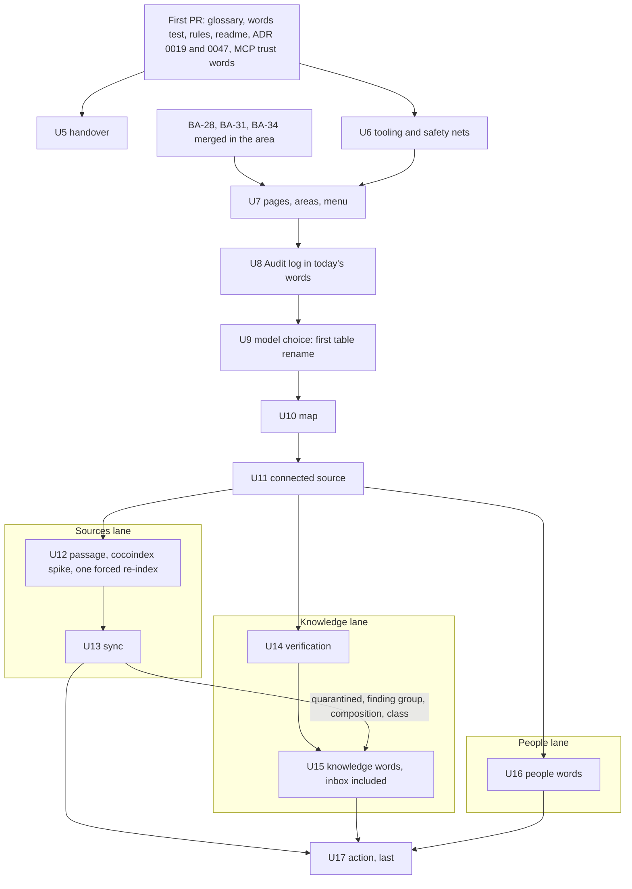
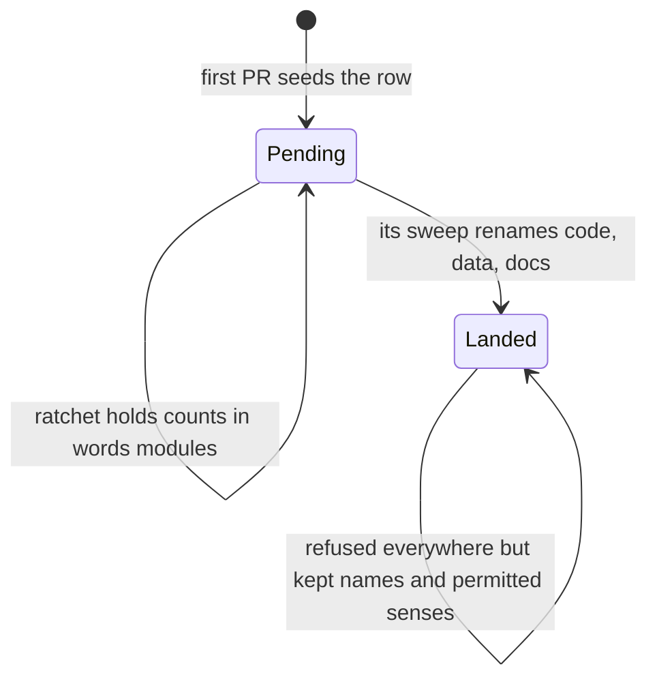

# Glossary in the Reader's Words - Plan

## Goal Capsule

- **Objective:** A person using better-answers meets one plain word for each thing, on a page, in an MCP answer or in an email. The glossary and the code use that same word, so new screens stop picking up builders' words.
- **Means:** a first pull request lands the words (U1 to U4). Then one sweep per noun renames code, data and live docs to match (KTD5, KTD10).
- **Product authority:** the owner's decisions of 02/10/2026 and 03/10/2026, recorded under Key Decisions, and the trust-word decision of 28/09/2026 recorded in ADR 0047's doc. The Product Contract wins on behaviour, and a KTD wins on mechanism within it. The architecture review (BA-35) and the screen design and usability review (BA-36) are separate work. The rule-tag and plan-id fix (BA-37) merged as #524.
- **Stop conditions:** stop and ask the owner in any of these cases:
  - The platform goes live, with `RELEASE_MODE` set to `drill` for good, before the last sweep that renames a table, column or stored value has released. KTD4 accepts a few seconds of api errors per release only because no one uses the platform yet.
  - Documents appear in a client workspace before the passage sweep releases. KTD3's forced re-index assumes there are none.
  - A rename would change a name that R15, R21 or R22 keeps.
  - The cocoindex spike (U12) shows that even a forced re-index cannot keep deletion tracking whole.
  - A sweep needs a reader word the appendices do not give.
  - A change would alter an MCP tool's input or output schema.
- **Execution profile:**
  - The first pull request carries U1 to U4 together. U5 follows its merge.
  - U6 lands before any sweep.
  - The sweeps run in KTD10's order, one pull request and one release per noun. From U12 on they run in three lanes, and U17 follows all three (KTD10, item 7). A sweep waits until BA-28, BA-31 and BA-34 have merged in the areas it touches (R20).
  - A sweep that renames a table, column or stored value is released by hand while the owner watches (KTD4, Operational Notes).
- **Who finishes:** `ce-work` builds each pull request and `ce-code-review` reviews it. Cubic's monthly allowance is spent until 1 November 2026, so the owner arms each merge by hand. The merge queue lands it, with CI's `check` as the arbiter.
- **Open blockers:** none.

---

## Product Contract

Product Contract preservation: changed. On 03/10/2026 the owner kept the names this codebase does not own. R2, R12, R15 and R16 were reworded, R21 and R22 added, and the Appendix A and B rows for the trust tiers, *link*, *knowledge base* and *route* narrowed to match. AE7 to AE15 were added from the flow analysis. The Outstanding Questions were resolved into KTDs.

### Summary

The glossary is rewritten so every thing a person meets is headed by the reader's word, with internal terms marked. Old words move out of the glossary to a list only the words test reads. The new words reach `main` first, in one pull request with the rules agents read and the words test. Sweeps then rename code, the database, contracts and screen text to match, while the names this codebase does not own stay as they are.

### Problem Frame

The language across the platform reads as unnatural, and the owner judges almost all of it to be off when set beside Guru, the product picked as the terminology benchmark. The glossary's entries are headed by the builders' names, so builders' words have reached screens: *act*, *binding*, *run*, *chunks*, *object store*, *routes*, *Surfaces* and *screen* all appear on pages today, and raw ids and act names show on the Audit log.

The cause is the same one found behind the rule tags and plan ids (BA-37): an agent writes the name it is shown. Session transcripts show a reviewer's suggested wording pasted by fixers that never loaded the voice rules. The voice rules live only in the design-system readme, which no rules file points to. The glossary's `_Avoid_` lists sit beside the right word and keep the old words in front of every agent that reads an entry.

The trust words show the same split. The owner agreed on 28/09/2026 to move from *Checked by* and *Unchecked* to *Verified by* and *Unverified*. The glossary, the design-system readme and the MCP answers still use the old words, and the readme still bans *verified*. Three sessions (BA-28, BA-31, BA-34) are building screens now, on today's words.

### Key Decisions

- **One word everywhere.** The reader's word heads the glossary entry, and code, types, database tables and columns, contracts and live docs are renamed to match. Codemods and agent sweeps make the renames practical. Governs R6, R14. (session-settled: user-directed — chosen over keeping code names under the reader's word, and over adding an "on screen" line to code-named entries: two vocabularies are what caused the drift)
- **Names we don't own keep their names.** OKF's vocabulary and the keys the platform writes into concept files, names on the wire to outside clients, names a library or protocol owns, and stored history all stay as they are. Reader text maps over them. Governs R15, R21, R22. (session-settled: user-approved — chosen over renaming wire names with a transition period, and over renaming them outright: no client, issued token or concept file breaks)
- **Audit act names stay as written, and the Audit log shows them in today's words.** Core reads act names to decide retries and the scope of an ended sign-in. Governs R16, R22. (session-settled: user-approved — chosen over new act names behind an alias layer on every read: a missed alias would misread a security act)
- **Names now, sentences in BA-36.** This work renames things and makes web work reach the existing voice rules. Rewriting each screen's sentences is BA-36's. Governs R9, R18. (session-settled: user-approved — chosen over names only, and over rewriting every sentence now: fastest to `main` for the sessions in flight)
- **Old words leave the glossary, and a check backs it.** The glossary shows only the right word. The words test reads the old words from its own list and checks screen and MCP text for internal terms. Governs R7, R12, R13. (session-settled: user-approved — chosen over keeping the `_Avoid_` clauses, and over no check: the glossary would otherwise be the last place agents meet the old words)
- **Words first, sweeps after.** The first pull request carries the words. The sweeps run once the BA-28, BA-31 and BA-34 sessions have merged in their areas. Governs R17, R20. (session-settled: user-approved — chosen over pausing the three sessions, and over sweeping in parallel with them: nothing in flight is disrupted)
- **The word table as reviewed.** The owner accepted all 22 contested recommendations and flagged none of the 28 renames that follow (Appendix A, B). Governs R1. (session-settled: user-approved — chosen over the alternatives shown per row on the review page of 02/10/2026: each row's reason is in Appendix A)
- **New text uses new words at once; identifiers wait for their sweep.** Governs R17. (session-settled: user-approved — chosen over writing new identifiers in new words straight away: mixed identifiers in one file are worse than one late rename)
- **Completed plans keep their words.** Plans in `docs/plans/` record what was built. Governs R22. (session-settled: user-approved — chosen over sweeping them: every sweep would rewrite history)
- **Rules say what to use, never what is forbidden.** An agent-facing rule names the word to write and leaves the old one unnamed. The owner set this for BA-37 on 02/10/2026, and it applies here too. Governs R7, R9, R10.
- **Trust words stay a closed set and never contradict OKF.** The owner's one test for a trust word is OKF (`docs/okf-v02.md`). *Score*, *confidence* and *trusted* stay out. Governs R4.
- **The restore drill compares counts only where production has them.** It fails on an absent table and on "not built" from a landed slice. It compares counts when production holds a recorded run for the drill's workspace, and otherwise records them. Governs R14. (session-settled: user-approved 03/10/2026 — chosen over keeping AE13 strict: the synthetic workspace never exists in production, and production records no counts yet)
- **The Audit log names what it can and leaves off what it cannot.** An event with no person as its actor reads "the platform". A thing that no longer exists shows its kind marked removed, such as "a connected source (removed)". A detail with no word is left off. Governs R16. (session-settled: user-approved 03/10/2026 — chosen over naming the actor *better-answers*)
- **The Audit log shows each person's sign-in address beneath their name.** Two members can share a display name. Governs R16. (session-settled: user-approved 03/10/2026 — chosen over showing the address only when two names clash: a row keeps one layout)

### Requirements

**The words**

- R1. Each thing a person meets on a page, in an MCP tool's text or answer, or in an email has one reader's word, as Appendix A and B record.
- R2. Things no person meets are marked internal in the glossary and carry the name their code uses (Appendix E).
- R3. Things with no page yet (Appendix D) are named when the block that builds them is planned, under R1's rules.
- R4. The trust words are *Verified by* a person with a date, *Verified automatically*, *Unverified*, *Changed since verified*, *Out of date*, *Draft*, *Left* and *Deprecated*, with the riders *· imported* and *· source moved on*. They read the same on pages and in what `find` and `open` return.
- R5. *Restricted* is a sensitivity value only, not a trust word.

**The glossary**

- R6. `CONCEPTS.md` heads every entry a person meets with the reader's word, defined in plain words.
- R7. Old and avoided words leave `CONCEPTS.md` for a list that only the words test reads.
- R8. An internal entry carries a mark the words test can read.

**Rules agents read**

- R9. `apps/web/CODING_STANDARDS.md` gains one rule whose heading is its instruction and carries no tag: write screen text in the glossary's reader words. It points to the voice rules in `packages/design-system/readme.md`.
- R10. `packages/design-system/readme.md` lists the new trust words, lifts its ban on *verified*, and states its voice rules as what to write.
- R11. An ADR doc whose decision names a renamed thing is amended in the commit that renames it, including ADR 0019 and ADR 0047 in the first pull request and ADR 0043 with the *action* sweep.

**The check**

- R12. Once a rename has landed, the words test refuses the old word everywhere except where R15, R21 or R22 keeps a name, the test's own list, and the senses Appendix G permits.
- R13. The words test refuses an internal term in screen text and MCP text, and its message names the reader's word to use.

**The renames**

- R14. Code identifiers, database tables and columns, contracts' fixtures, tests, live docs, skills, and screen and MCP text are renamed to the reader's word.
- R15. OKF's vocabulary keeps its names: its file keys, its nouns (*bundle*, *concept*) and its trust tiers, plus the keys the platform writes into concept files (`iri`, `sources[].locator`).
- R16. The Audit log and member pages show every event in today's words, whatever name it was stored under.
- R17. Until an area's sweep lands, new screen and MCP text there uses the new words, and new identifiers follow the surrounding code.
- R21. Names on the wire to outside clients keep their names: MCP entry names, MCP tool schema keys and values, token scopes and refusal words. So do names a library or protocol owns, such as OAuth's and Better Auth's.
- R22. Stored history keeps its names: audit rows, the act names and detail keys new events keep using, migration files and their snapshots, old page addresses, `docs/archive/` and completed plans in `docs/plans/`.

**Handover**

- R18. When the first pull request merges, the screen text that changes (Appendix F) goes to the BA-28, BA-31, BA-34 and BA-36 sessions.
- R19. BA-29's Linear criteria are amended. *chunk* and *run* are on pages and now have reader words, so the internal examples become *object store* and the internal set. The web rule's wording follows R9.
- R20. A sweep starts after BA-28, BA-31 and BA-34 have merged in the areas it touches.

### Key Flows

- F1. From new words to renamed code
  - **Trigger:** the owner's review of the word table (02/10/2026).
  - **Steps:** the first pull request lands the glossary, the rules agents read and the words test (R6 to R13). The sessions in flight read the screen-text list and write new text in the new words (R17, R18). The sweeps run one noun at a time once those sessions have merged in each area. Each sweep marks its old words landed in the test's list (R12, R14, R20).
  - **Outcome:** one word per thing in the glossary, the code, the database and on every page, with the names R15, R21 and R22 keep left as they are.
  - **Covered by:** R6 to R22.

### Acceptance Examples

- AE1. **Covers R4.** Given a concept whose file has a `human:` verifier, Priya Shah on 3 March 2026, when `find` returns it, then its line reads "Verified by Priya Shah · 3 March 2026".
- AE2. **Covers R4.** Given a concept verified only by an agent that did not generate it, when a reader opens it, then it reads "Verified automatically".
- AE3. **Covers R13.** Given a page's words module that writes an internal term, when the words test runs, then it fails and its message names the reader's word to use.
- AE4. **Covers R12, R17.** Given the connected-source sweep has not landed, when code says `binding`, then the test passes. After that sweep lands, the same word in code fails.
- AE5. **Covers R16, R22.** Given an event stored as `sources.binding.published`, when an Admin opens the Audit log, then the event reads in today's words and the stored row is unchanged.
- AE6. **Covers R17.** Given the Sources sweep has not landed, when a session adds a button there, then its label says "Connect a document" while its identifiers may still say binding.
- AE7. **Covers R22.** Given a bind retried with the same id after the connected-source sweep's release, when the insert conflicts, then it finds the first outcome stored before the release and answers the same document and job.
- AE8. **Covers R16, R22.** Given a credentials ending stored before the people sweep, when the grants it ended are read, then their scope still reads "everywhere".
- AE9. **Covers R14.** Given a connected source indexed before the passage sweep, when the sweep's forced re-index has run, then no store directory under an old name remains for it, and a document removed at source leaves no passage row.
- AE10. **Covers R15.** Given a concept file written before any sweep, when `open` is called with its `iri`, then the concept opens and the file is unchanged in git.
- AE11. **Covers R12, R21.** Given the `find` description names its `iri` and `locator` parameters, when the words test runs, then it passes. Once the *match* sweep has landed, the word *hit* in the description's prose fails.
- AE12. **Covers R12.** Given a branch opened before the connected-source sweep that adds a `bindingId` identifier, when it enters the merge queue after the sweep, then the words test fails and names *connected source* and the sweep.
- AE13. **Covers R14.** Given the map sweep has renamed the map tables, when the restore drill runs, then it fails on an absent table and on "not built" from a slice that has landed. It compares counts with production's when production holds a recorded run for the drill's workspace, which waits for a table that records such runs (not built yet), and otherwise records them. It never passes on an absent table.
- AE14. **Covers R14, R22.** Given a bookmark to `/system/routes-and-spend` or `/agent-operations/routes-and-spend`, when an Admin opens it after the model sweep, then *Models and spend* opens.
- AE15. **Covers R14.** Given a job queued with an old reason value when a sweep's migration runs, when the new worker claims it, then it runs under the new value and is not refused.

### Scope Boundaries

- Each screen's sentences, beyond the words this plan renames, are BA-36's.
- The architecture review is BA-35's. The C4 redraw (BA-25) follows it, though the sweeps update the words in `docs/architecture/` as live docs.
- Things with no page yet are named when built (R3).
- Three prose findings from the 02/10/2026 check are left for the owner: merge commit bodies of 860 to 1,510 words, no live doc naming a prose pass, and Cubic skipping `docs/**` and tests.

<!-- ce-section: work-relationships -->
### How This Work Fits Together

This plan covers the glossary rewrite and the renames that follow from it. The breakdown below is the current understanding, not a committed roadmap.

- BA-37 (rule names in words): merged as #524. The sweeps rebase over its heading and test-title changes.
- BA-28, BA-31, BA-34 (sessions in flight): **Depend on** the first pull request for the words they write. This plan's sweeps **depend on** their merges in the areas they touch.
- BA-36 (screen design and usability review): **Depends on** this plan for the words it judges screen text against.
- BA-35 (architecture review): **Shares** ADR 0043's and ADR 0047's docs with this plan's renames. **Still to decide** whether it runs before or after the sweeps.

### Dependencies / Assumptions

- The words test (`apps/api/tests/avoid-words.test.ts`) reads `_Avoid_` clauses from `CONCEPTS.md` today. A word marked retired is refused everywhere; an avoided word only in its wrong sense, through a pattern table.
- The audit log is append-only, and core reads act names to decide retries and the scope of an ended sign-in.
- The rename of `checkedBy` and `checkedAt` to `verifiedBy` and `verifiedAt` inside core lines code up with OKF's `verified` key. OKF's own tier words stay as they are (R15).
- The first client's bundle is on production, and `RELEASE_MODE` has been `nightly` since 27/09/2026, releasing at 02:35. The platform goes live, and the mode becomes `drill`, on a later day (`docs/operations/RUNBOOK.md`).
- Assumption: Guru's *Unverified* means flagged or expired content, while ours means nobody has confirmed it. Ours follows OKF, the owner's one test, so the word stands.

### Sources / Research

- `docs/okf-v02.md`: OKF's keys, its tier words, and the keys the platform writes into files.
- ADR docs in `docs/solutions/architecture-patterns/`: 0007 (app-owned migrations), 0018 (the MCP surface's entries), 0019 (trust words as a closed set), 0022 (forward-only migrations), 0031 (the tier contract), 0043 (what an act is, and the append-only refusal register), 0045 (a coding rule's form), 0047 (surfaces, groups and screens).
- `docs/solutions/integration-issues/munch-indexes-stale-across-worktrees.md`: Bash edits are invisible to the index hooks.
- `docs/archive/specs/T-441.md`: "tests read the words; they don't copy them", and the trust words stay literal.
- The information-architecture research of 30/09/2026, attached to BA-29.
- Guru's own pages (getguru.com, help.getguru.com), read on 02/10/2026: *Collection*, *Connected sources*, *Synced*, *Verified*, *Unverified* and *Auto-verify*.
- PostgreSQL's `ALTER TABLE … RENAME` carries policies, indexes and constraints but not function bodies or the names of policies, indexes and constraints. Drizzle-kit asks about renames interactively.

---

## Planning Contract

Planning Contract preservation: changed on 06/10/2026, after U11 released. The single chain from U12 to U17 became three lanes (KTD10, item 7). U16's inbox noun moved to U15, and U14's column question was added to Deferred to Implementation. No requirement changed.

### Key Technical Decisions

- KTD1. **The words test owns the old words, in a list beside it.** `apps/api/tests/old-words.ts` holds one row per old word: its reader word, its sweep, a state of pending or landed, whether it is retired everywhere or held to one sense, and its permitted senses. Governs R7, R12. Precedent: `better-auth-endpoints.txt` beside its test.
  - **Kept names come from their sources of truth**, so a hand-kept pattern cannot drift from them:
    - the refusal vocabularies;
    - the MCP tool schemas in `apps/api/src/mcp/entries/index.ts`, and the tier and status values in `packages/core/src/answering/index.ts`;
    - `apps/api/tests/better-auth-endpoints.txt`;
    - the stored-names register (KTD15) and the generated `apps/web/src/features/people/audit-acts.ts`;
    - the migrations folder and `movedFrom` values.
  - **A stored detail key is spelled only in the register.** The register exports each one as a constant named in the reader's words and valued with the stored key, for example `connectedSourceId: "bindingId"`. Slices declare and write detail keys through those constants, and the test permits a stored key's literal only in the register and the generated files. So R22 keeps `bindingId` as stored, and AE12 still refuses it as a new identifier.
  - **A landed row may carry a deferred sense** naming the later sweep that removes it. U11 lands *binding* with a deferred sense for the `binding_id` column on `index.chunk` and its view, the worker's store-directory constant and the store-size env key. U9 lands *route* with one for `embedding_route_id`. U12 removes both.
- KTD2. **The glossary marks internal and pending entries in the definition, after the dash.** `_Internal._` marks an internal entry. `_Code rename pending._` marks an entry whose code still uses another name, and the preamble points to the words test's list for that name. `ENTRY_HEAD` keeps its shape, and no old word appears in the glossary. Governs R2, R8, R17.
- KTD3. **The worker's stored names change in the passage sweep, with one forced re-index.** The `index.chunk` table with every column on it, the chunks app, the connected-source store directory and the store-size env key are renamed in one release. Every connected source then runs through the `wiped` reason, and the release removes every old-named store directory under `LMDB_DIR`. The `wiped` reason alone deletes only the current name, and it visits only sources that still exist. A spike settles cocoindex's behaviour first, and the re-index runs inside the passage sweep's watched release (KTD4). Governs R14. (session-settled: user-approved — chosen over keeping the stored names: the owner confirmed on 03/10/2026 that no documents exist in the client's workspace yet, so the re-index costs little)
  - Conflict call-out: the landed app and the findings store keep their names. Renaming the landed app strands its memos in the findings store, which a wipe spares on purpose, and `docs/operations/BACKUPS.md` classes that store as personal data. Neither name reaches a person.
- KTD4. **Tables and columns are renamed in place, by hand-written migration, and released by hand under watch.** The first client's bundle is on production, but no one uses the platform until it goes live. So the seconds of api errors between `migrate` and the api's restart reach no live user. Each such sweep releases with the owner present, following Operational Notes. Only a dump restore undoes the migration, so each release note says so in the style of migration 0053. Governs R14. (session-settled: user-approved — chosen over bridging table renames with old-named views: a view cannot cover a column, function or stored-value change, and nobody uses the platform before it goes live)

  Each rename migration:
  1. sets `lock_timeout` and resets it after, as migration 0059 does;
  2. renames the table's policies, indexes, constraints and partitions with it;
  3. renames functions with `ALTER FUNCTION … RENAME`, which keeps their grants, because a function created afresh is executable by PUBLIC;
  4. replaces with `CREATE OR REPLACE` every function whose body names a renamed table, column or stored value, restating `SECURITY DEFINER` and `SET search_path` wherever it holds them, and updates `packages/schema/src/definer-reach.ts` for any definer function it touches. `CREATE OR REPLACE` keeps grants. The functions known today are `llm_route_for` (U9), `graph_row_generation_guard` (U10), `create_workspace_partition` (U12), and `submit_suggestion_set` with `suggestion_repair_proposer_check` (U15). A schema test pins `search_path=pg_catalog, pg_temp` on every function in `SECURITY_DEFINER_REACH`, as `readable-chunk.test.ts` does for `narrower_class`;
  5. renames a view's columns with `ALTER VIEW … RENAME COLUMN`, never drop and recreate, so `security_invoker` survives;
  6. never accepts a DROP that drizzle-kit generates for a renamed or generated column.

  After the migration, regenerate the snapshot, `roles-surface.json`, the worker's schema view and both contract stamps. A second `generate` shows no diff (`packages/schema/test/migration-ownership.test.ts`), and a sweep only adds files under `migrations/`. The regenerated `roles-surface.json`, once the rename map is applied, differs from the committed one only in names.
- KTD5. **One noun per pull request, each a codemod with a committed rename map.** ts-morph renames symbols through its bundled compiler, and TypeScript 7's `tsc` proves the result. ast-grep renames strings, object keys, JSON, SQL and Python under the map's allowlist of senses. Each sweep:
  1. inventories the noun's occurrences by sense;
  2. runs the symbol pass, then the text pass;
  3. updates live docs, skills and ADR docs for the noun;
  4. runs `register_edit` and an `rg` check for the old word;
  5. marks its rows landed in the words test's list.

  The map stays in `packages/devtools/renames/` so an older branch can replay it. Governs R12, R14.
- KTD6. **The reader-text check parses text, not files.** It reads `_Internal._` heads from `CONCEPTS.md` and extracts string and JSX text from the reader-text files only:
  - the words modules and `apps/web/src/shared/navigation.ts`;
  - the MCP entry descriptions;
  - the answer renderer;
  - the email and consent templates.

  A head that is ordinary English (*job*, *release*, *step*) carries a "not watched on pages" flag in the list. Governs R13.
- KTD7. **A ratchet holds R17 in the gap.** The count of pending old words in each words module and in `navigation.ts` may fall but never rise above a committed baseline. Each sweep lowers its counts to zero. Governs R17.
- KTD8. **Distinctive words retire everywhere; shared words keep one sense.** *binding*, *chunk*, *slug*, *membership*, *quarantined*, *composition* and *Unchecked* are refused in every form once landed. *act*, *screen*, *route*, *client*, *run*, *check*, *domain*, *bundle*, *class*, *graph*, *surface*, *operator*, *page*, *map*, *model*, *match* and *hit* are held to the senses Appendix G permits. Governs R12.
- KTD9. **The route row's code name is *model choice*.** The row already has a `model` column naming the model actually called, so the reader's page "Models and spend" lists model choices. Governs R1, R14. (session-settled: user-approved — chosen over naming the row *model*: two things would share one word)
- KTD10. **Sweep order follows the collisions.**
  1. Pages, areas and the menu go first, since they touch the web app only.
  2. The audit display follows.
  3. Model choice is the first table rename and proves KTD4's path on the smallest table.
  4. Map precedes sync, freeing *sync* from the map's rebuild.
  5. Connected source precedes passage. Every column on `index.chunk`, the table cocoindex writes, waits for the passage sweep, so that table changes in one release followed by one wipe.
  6. Action goes last, at 366 files.
  7. **From U12 on, three lanes, then action.** A lane is a run of sweeps that share a slice. Sweeps in different lanes share only files that a replayed map or a regenerated file resolves:
     - **Sources:** U12, then U13. Both work in `packages/core/src/sources/`, `apps/web/src/features/sources/` and the worker, sharing 17 code files.
     - **Knowledge:** U14, then U15. They share `packages/core/src/concepts/` and `packages/core/src/answering/`, 13 code files. U15's nouns *quarantined*, *finding group*, *composition* and *class* live in the sources slice and the worker, so they also wait for U13.
     - **People:** U16, without the inbox noun. The inbox store is `packages/core/src/concepts/inbox.ts` and `contracts/concept-inbox/`, which U15's suggestion kinds also change, so it moved to U15.
     - **Then U17**, which touches every slice that declares an act.

     U14 can start now. It shares 6 code files with U12 and 3 with U13, and no deferred sense names it: every `until` in `apps/api/tests/old-words.ts` names `passage`, which is U12, the first sweep in its own lane.

     The evidence is the remaining sweeps' old words searched over the tree on 06/10/2026, after U11 merged. It is a search, not the dry-run maps the BA-29 comment of 06/10/2026 suggested. The search leaves out the senses Appendix G keeps: bare *client* (tRPC, pg, S3) and *domain* as an email domain. The remaining shared code files between lanes are 6 to 44 per pair: test harnesses, fixtures, `navigation.ts`, `boundary-schemas.ts`, `table-ownership.ts` and `rls.test.ts`. A rebase pays for those (Operational Notes). Lanes shorten the building, and the releases stay one at a time.

  Governs R14, R20.
- KTD11. **Every renamed page address redirects.** `movedFrom` on a page or group becomes a list. Every old address stays in it, including the earlier `/system/routes-and-spend`. Governs R14, R22.
- KTD12. **Stored values change by kind.** Governs R14, R16, R22.
  - **Mutable rows, queued jobs included:** every tenant table forces row-level security, and the migration owner cannot bypass it, so a bare `UPDATE` reaches no row. The migration drops the CHECK, updates inside each workspace's scope as migration 0048 does, then adds the CHECK back. Re-adding the CHECK checks every row, which is the proof. A renamed value with no CHECK gains one.
  - **Derived rows** (map labels, index rows): rebuilt with the existing rebuild reasons.
  - **Audit detail values:** shown in today's words, never rewritten.
- KTD15. **A register pins the stored act names and detail keys.** A hand-kept, append-only list of every act name and detail key, tested against `declaredActNames()`, sits on the refusal register's precedent. Every rename map excludes it. The generated `audit-acts.ts` cannot do this job, because a renamed act simply regenerates clean. Governs R22.
- KTD13. **The MCP trust words change as reader text in the first pull request.** `trustWords` and the status words render R4's words. The wire keeps the tier values, the status values and the `checkedBy` and `checkedAt` keys. Core maps its own `verifiedBy` to the wire key at the transport once U14 renames it. The tests keep pinning the trust words as literals (T-441). Governs R4, R21.
- KTD14. **ADR filenames keep their slugs.** A sweep updates an ADR doc's title, tags and text. Code and docs cite an ADR by number, and the filename stays as a permitted sense, as with ADR 0018 and 0046. Governs R11.

### High-Level Technical Design

The sweep order, with what each waits for:



An old word's life in the words test's list:



A table-renaming sweep's release:

```mermaid
sequenceDiagram
  participant Q as Merge queue
  participant Mg as migrate
  participant Api as api
  participant Wk as worker
  Q->>Mg: release by hand, owner watching
  Mg->>Mg: rename tables, policies, functions; stamp contract digest
  Note over Api: old api errors on renamed tables until restart
  Mg-->>Api: completed
  Api->>Api: new image healthy
  Mg-->>Wk: completed
  Note over Wk: old worker refuses claims on stamp mismatch
  Wk->>Wk: new image claims under new names
```

### Risks & Dependencies

| Risk | Mitigation |
|---|---|
| A table-renaming release leaves the old api erroring briefly, and only a dump restore rolls it back | Each such release is watched and taken by hand after a dump, and its release note says so. The errors reach no live user before go-live, and a stop condition holds the remaining sweeps if go-live comes first (KTD4) |
| cocoindex loses track of which rows have gone when its target table or the chunks app is renamed | U12 opens with a spike. The forced re-index rebuilds tracking and removes the old store directories (KTD3, AE9) |
| drizzle-kit asks interactively about a rename | Renames are hand-written migrations, and a second `generate` must show no diff. U9 proves the path on the smallest table |
| ts-morph's bundled compiler disagrees with TypeScript 7 | TypeScript 7's `tsc` and the suites are the proof. ast-grep takes any symbol ts-morph mishandles |
| New words collide with existing names (*action* props, Playwright's `page`, `.map`, the `model` column) | Each sweep's map lists the permitted senses (Appendix G) and the codemod skips them |
| A branch opened before a sweep reintroduces old names | Each map is committed and replayable. The words test's message names the reader word and the sweep (AE12) |
| The sessions in flight edit `CONCEPTS.md` while the first pull request is open | The first pull request lands fast, and the sessions are told to rebase onto the new entry form (U5) |
| The reader-text check flags ordinary English | It parses text only, and the list flags ordinary-English heads as not watched (KTD6) |
| Old store directories keep text redacted under a superseded rule, and an erasure report claims completion | The release removes every old-named store directory, beyond what the `wiped` reason deletes (KTD3, AE9) |
| A rename migration's value update reaches no row under row-level security | Updates run inside each workspace's scope, and re-adding the CHECK proves every row (KTD12) |
| A renamed act or detail key slips through a codemod and breaks a retry or the scope of an ended sign-in | The stored-names register pins them, and every map excludes it (KTD15) |
| A missed table rename makes an ops command answer "not built", which the restore drill treats as expected | The ops commands take table names from the table objects, and the drill fails on "not built" for a landed slice (U6) |
| A replaced function or recreated view loses its grants, `security_invoker` or `search_path` | Functions are renamed, then replaced with their security settings restated. View columns are renamed in place. A schema test pins `search_path` on every definer function (KTD4) |

### System-Wide Impact

- **Both tiers and the database:** table and column renames move the migration journal, the worker's schema stamp and the contract digest, so every schema sweep releases the api and the worker together.
- **MCP clients:** unaffected. The wire keeps its names (R21), and only description prose and rendered answers change.
- **Agents and skills:** the glossary's form changes (KTD2), and the old words leave every live doc. The design and browser-suite skills are swept with their nouns.
- **Operations:** ops command names, `deploy/restore-drill.sh`, `deploy/seed-synthetic.sh` and the RUNBOOK change in the map and passage sweeps.

### Operational Notes

- Each table-renaming sweep's release note records "No digest rollback across migration NNNN" and a RUNBOOK §6 entry, following migration 0053.
- A sweep that renames a table, column or stored value releases by hand while the owner watches (KTD4). `RELEASE_MODE` is `nightly`, so an unwatched merge would release at 02:35:
  1. Set `RELEASE_MODE` to `drill` before the sweep merges. Nothing then releases itself.
  2. Merge the sweep through the queue. Anything else merged while the mode is `drill` releases with it, so merge the sweep when nothing else is waiting.
  3. Take a dump and let it finish before `migrate` starts, or its locks trip `lock_timeout`.
  4. Drain the worker.
  5. Run `release` by hand, with `rehearsed_by` set to `hotfix: watched release of <sweep>`.
  6. List jobs that failed or were refused in the window and queue them again. A job cut off mid-run spends one of its three attempts, and a lost `rule-change` re-index leaves text redacted under the old rule.
  7. For the passage sweep, run every connected source through the `wiped` reason and remove every old-named store directory (KTD3).
  8. Set `RELEASE_MODE` back to `nightly`.
- Cubic reviews nothing until 1 November 2026. `ce-code-review` still runs on every pull request, and the owner arms each merge by hand.
- After the passage sweep, run the restore drill once to prove AE13.
- **Running the lanes (KTD10, item 7).** Each lane runs in its own session and worktree, one unit per `ce-work` run. What lanes do not change:
  - **One watched release at a time.** While one lane's sweep is in its watched release, with `RELEASE_MODE` at `drill`, every other lane holds its merge. "Nothing else waiting" in step 2 above includes the other lanes.
  - **Migration numbers.** U12, U15 and U17 each add a migration. U14 (Deferred to Implementation) and U16's *slug* add one if they rename a column. The branch that merges second renumbers its migration's file name and its journal `idx` and `tag`. It also sets the journal's `when` later than the landed migration's, because drizzle's migrator applies by `when`, not by number, and skips a migration whose `when` is earlier than the last one applied. Then it rewrites its snapshot against the new predecessor and regenerates the worker's schema view, whose `MIGRATION_WHEN` follows the last entry. A second `generate` must find no diff.
  - **Contract stamps.** U12 and U15 both move the contract digest. The second to merge regenerates both stamps after its rebase.
  - **Shared files.** `apps/web/src/shared/navigation.ts`, `apps/api/tests/old-words.ts` with its ratchet, `CONCEPTS.md` and `contracts/manifest.json` conflict on every rebase. Resolve them by hand, then regenerate the ratchet; it may only lose entries.
- **Rebasing a lane onto a landed sweep:**
  1. Replay each map that landed since the branch was cut, in apply mode. Then run the branch's own map again in apply mode, because the rebase brought in the other lane's files.
  2. Correct every literal path that a map in `packages/devtools/renames/` names and the other lane moved. Nothing else catches a stale path (step 11 of the rename-sweep learning named in step 5).
  3. Dry-run every landed map and the branch's own map. None may list a `rename` (the same learning, step 13).
  4. Run the words test. AE12 names any old word the replay missed.
  5. Re-read by hand the prose the rebase brought in. A prose pass is not a safe replay: it rewrites code and data in files the runner's senses shield (`docs/solutions/best-practices/what-a-rename-sweeps-runner-and-prose-pass-get-wrong-and-the-checks-that-catch-it.md`).
- **A new deferred sense** (`until`) must name a sweep that has not landed and that follows the sweep landing the row, in the same lane or U17.

### Deferred to Implementation

- How cocoindex behaves when its target table or the chunks app is renamed (U12's spike).
- The exact mechanics of a hand-written rename migration that keeps drizzle-kit's snapshot in step (U9).
- Which parser extracts string and JSX text for the reader-text check: `oxc-parser` is already present as a transitive dependency.
- The code word for each collision, recorded in that sweep's rename map.
- Whether a unit's nouns split into more than one pull request. One noun per pull request is the rule (KTD5).
- Whether U14 renames the column `concept_verification.checked_at` and its index with core's name. If it does, U14 carries a hand-written migration and releases under watch (KTD4). The wire keys stay either way (R21).

---

## Implementation Units

| U-ID | Title | Key files | Depends on |
|---|---|---|---|
| U1 | Rewrite the glossary | `CONCEPTS.md` | none |
| U2 | Rebuild the words test | `apps/api/tests/avoid-words.test.ts`, `apps/api/tests/old-words.ts` | U1 |
| U3 | Rules, readme and ADR docs agents read | `apps/web/CODING_STANDARDS.md`, `packages/design-system/readme.md`, ADR 0019 and 0047 docs | U1 |
| U4 | MCP trust words in reader text | `packages/core/src/answering/index.ts`, `apps/api/src/mcp/entries/index.ts` | U1 |
| U5 | Hand over the words | Linear, session messages | U1 to U4 merged |
| U6 | Sweep tooling and safety nets | `packages/devtools/src/rename/`, `packages/core/src/audit/stored-names.ts`, `deploy/restore-drill.sh` | U2 |
| U7 | Pages, areas and the menu | `apps/web/src/shared/navigation.ts`, `apps/web/src/app/words.ts` | U6 |
| U8 | The Audit log in today's words | `apps/web/src/features/people/audit-log-screen.tsx`, `audit-sentences.ts` | U7 |
| U9 | Model choice | `packages/schema/src/schema.ts`, `contracts/llm-routing/` | U8 |
| U10 | Map | `packages/schema/src/graph-tables.ts`, `apps/worker/src/better_answers_worker/rebuild.py` | U9 |
| U11 | Connected source | `packages/schema/src/source-tables.ts`, `packages/core/src/sources/` | U10 |
| U12 | Passage, with the worker's stored names | `apps/worker/src/better_answers_worker/pipeline/`, `index.chunk` migrations | U11 |
| U13 | Sync | `apps/web/src/features/sources/`, `packages/core/src/sources/` | U12 (Sources lane) |
| U14 | Verification | `packages/core/src/answering/index.ts`, `packages/core/src/concepts/` | U11 (Knowledge lane) |
| U15 | Knowledge words | `packages/core/src/concepts/`, `packages/schema/src/suggestion-tables.ts` | U14; U13 for its sources nouns (Knowledge lane) |
| U16 | People words | `packages/core/src/members/`, `packages/core/src/workspaces/` | U11 (People lane) |
| U17 | Action, last | `packages/core/src/kernel/`, `packages/core/src/audit/`, `packages/devtools/lint-rules/` | U13, U15, U16 |

### U1. Rewrite the glossary

**Goal:** `CONCEPTS.md` heads every entry a person meets with its reader's word, marks internal entries, and holds no old word.

**Requirements:** R1 to R8, R15, R21, R22.

**Dependencies:** none.

**Files:**
- Modify: `CONCEPTS.md`

**Approach:**
1. Rename entry heads per Appendix A and B, and rewrite each definition in plain words.
2. Mark internal entries and pending entries after the dash (KTD2), and add the preamble line pointing to the words test's list.
3. Move every `_Avoid_` clause into U2's list.
4. Rewrite the trust section in R4's words, and move *Restricted* to sensitivity (R5).
5. Where R15, R21 or R22 keeps a name, the entry says what a person sees instead, for example that pages show a concept's title as a link.
6. Keep the seven sections and the entry format.

**Execution note:** land with U2 in the same pull request, since the test reads the marks.

**Patterns to follow:** the existing entry format; ADR 0047's *The trust words*.

**Test scenarios:** Test expectation: none -- documentation; U2's tests read its marks and heads.

**Verification:** every Appendix A and B row shows its new head, no `_Avoid_` remains, and `jdocmunch lookup_term` finds each reader word.

### U2. Rebuild the words test

**Goal:** the words test reads old words from its own list, refuses landed ones everywhere but kept names and permitted senses, checks reader text for internal terms, and holds the gap with a ratchet.

**Requirements:** R7, R8, R12, R13, R17.

**Dependencies:** U1.

**Files:**
- Create: `apps/api/tests/old-words.ts`
- Modify: `apps/api/tests/avoid-words.test.ts`, `apps/api/tests/tree-walk.ts`, `packages/devtools/test/ci/docs-lane.test.ts`
- Test: `apps/api/tests/avoid-words.test.ts`

**Approach:**
1. Seed `old-words.ts` (KTD1) with every Appendix A and B old word as pending, plus today's retired words and WATCHED rows as landed.
2. Read rows from the list, and replace the four self-assertions on today's glossary with assertions on the list's shape.
3. Scope carve-outs per row, so `apps/web/` and `packages/design-system/` are scanned for retired words.
4. Read the kept names from the sources of truth KTD1 names that exist today. U6 adds the stored-names register as a source before U7 lands the first row. Carve out migration SQL and snapshots, and `old-words.ts` itself.
5. Add the reader-text check (KTD6) and the ratchet with its committed baseline (KTD7).
6. Phrase each failure message positively. It names the reader word, the sweep that landed it, and the rules file, with no tag.
7. Update the docs-lane `reads:` description.

**Execution note:** write the new scenarios first against the throwaway-tree runner, then move the existing ones over.

**Patterns to follow:**
- `apps/api/tests/better-auth-endpoints.test.ts` and its list;
- `packages/devtools/lint-rules/rules/string-cites-nothing.ts` for string and JSX visiting;
- `findingsIn` in `avoid-words.test.ts`, which plants a glossary and files in a throwaway tree, with words spelled in halves so the test never finds itself.

**Test scenarios:**
- Covers AE3. A words module string holding an internal term fails, and the message names the reader word.
- Covers AE4. With the connected-source row pending, `binding` in code passes. With it landed, it fails in code and passes in migration SQL, snapshots and `old-words.ts`.
- Covers AE11. An MCP description naming the `iri` parameter passes. With the match row landed, *hit* in its prose fails.
- Covers AE12. A landed row and a new `bindingId` identifier fail, naming *connected source* and its sweep.
- React's `act(` in a web test passes after the action row lands, and *act* in a words module fails.
- An internal head flagged as ordinary English (*job*) inside a sentence passes.
- One more pending old word in a words module than the baseline fails. One fewer passes.
- A duplicate or unsorted row in the list fails.
- The senses the test permits today still pass and fail as before.
- A refusal word (`no-such-binding`) passes after the connected-source row lands.

**Verification:** `check:docs:api` passes on the new tree. A mutation run per `docs/agents/mutation-triage.md` leaves no unexplained survivor in the new matching code.

### U3. Rules, readme and ADR docs agents read

**Goal:** the rules and docs agents read name the new words and say what to write.

**Requirements:** R4, R9, R10, R11.

**Dependencies:** U1.

**Files:**
- Modify: `apps/web/CODING_STANDARDS.md`, `packages/design-system/readme.md`, `packages/design-system/guidelines/colors-trust.card.html`, `packages/design-system/guidelines/blueprint-marks.card.html`, `docs/solutions/architecture-patterns/adr-0019-trust-derived-from-the-file.md`, `docs/solutions/architecture-patterns/adr-0047-the-platform-is-surfaces-groups-and-screens.md`

**Approach:**
1. Add R9's rule, headed by its instruction in the form BA-37 left (no tag), within ADR 0045's 80-word cap.
2. Give the readme R4's trust words and rewrite its voice rules as what to write.
3. Amend ADR 0019's closed set and ADR 0047's direction: one word everywhere, the names kept by R15, R21 and R22, and the words test's list. Each amendment is dated, in the docs' existing style.
4. Update the two design-system cards' text. Their token names wait for U14.

**Patterns to follow:** the ADR docs' amendment lines; `docs/solutions/architecture-patterns/adr-0045-coding-rule-is-one-imperative.md`.

**Test scenarios:** Test expectation: none -- documentation; U2's words test covers the words in these files.

**Verification:** the readme lists *Verified by* and carries no ban on *verified*. Both ADR docs carry a 03/10/2026 amendment.

### U4. MCP trust words in reader text

**Goal:** what `find` and `open` render uses R4's trust words, with the wire unchanged.

**Requirements:** R4, R21. KTD13.

**Dependencies:** U1.

**Files:**
- Modify: `packages/core/src/answering/index.ts`, `apps/api/src/mcp/entries/index.ts`
- Test: `packages/core/test/answering.test.ts`, `packages/core/test/import-bundle.test.ts`, `apps/api/tests/ops.test.ts`, `apps/api/tests/invisibility.test.ts`

**Approach:**
1. Render the trust and status words in R4's words, keeping the riders.
2. Reword the MCP descriptions' prose where it names trust. Parameter and key names stay (R21).
3. Leave every schema key and enum value as it is.

**Patterns to follow:** `trustWords` and `STATUS_WORDS` as they stand.

**Test scenarios:**
- Covers AE1. A human verifier renders "Verified by Priya Shah · 3 March 2026".
- Covers AE2. Machine-only verification renders "Verified automatically".
- No verification renders "Unverified".
- An imported verification renders "Verified by … · imported".
- An erased verifier renders "Verified by a former member".
- A changed concept renders "Changed since verified".
- The `find` output schema keeps its tier values, status values and `checkedBy` and `checkedAt` keys.

**Verification:** the core and api suites pass, and an MCP `find` in the browser suite's harness shows the new words.

### U5. Hand over the words

**Goal:** the sessions in flight and BA-36 have the screen-text list, and BA-29's criteria match this plan.

**Requirements:** R18, R19.

**Dependencies:** U1 to U4 merged.

**Files:** none in the repository.

**Approach:**
1. Post Appendix F to BA-28, BA-31, BA-34 and BA-36 as comments, and message the sessions still running. Tell them to rebase onto the new entry form.
2. Amend BA-29's acceptance criteria (R19) and comment the merge.

**Test scenarios:** Test expectation: none -- coordination only.

**Verification:** each issue carries the list, and BA-29's criteria name *object store* and the positive web rule.

### U6. Sweep tooling and safety nets

**Goal:** every sweep has a tested, replayable codemod and the checks that catch a missed rename at run time.

**Requirements:** R12, R14, R22. KTD5, KTD15.

**Dependencies:** U2.

**Files:**
- Create: `packages/devtools/src/rename/` (the runner), `packages/devtools/renames/` (one map per sweep), `packages/core/src/audit/stored-names.ts` (the register), `apps/worker/tests/test_sql_prepares.py`
- Modify: `packages/devtools/package.json` (ts-morph and `@ast-grep/cli` as dev dependencies), `apps/api/src/ops/index.ts`, `deploy/restore-drill.sh`
- Test: `packages/devtools/test/rename.test.ts`, `packages/core/test/stored-names.test.ts`, `apps/worker/tests/test_sql_prepares.py`, `packages/devtools/test/ci/deploy-tree.test.ts`

**Approach:**
1. A map names the noun, its reader word, its code word for each collision, and its allowlist of senses (Appendix G).
2. The runner applies ts-morph symbol renames and ast-grep rules for text, then reports what it skipped by sense.
3. A replay command applies a committed map to a branch.
4. Add the stored-names register (KTD15), excluded from every map.
5. The worker gains a test that prepares each SQL statement it sends against the migrated test database.
6. The ops commands take their table names from the table objects, not strings.
7. The restore drill fails on an absent table, and on "not built" from any slice that has landed. It compares counts when production holds a recorded run for the drill's workspace, and otherwise records them. Its production-counts diff names `graph_sync_run`, which is no table, so the diff is skipped on every run today.

**Patterns to follow:**
- `packages/devtools/src/jscpd.ts`, which wraps `runsOverThrowawayTree`; `executableOf` in `throwaway-tree.ts` requires `@ast-grep/cli` as a devtools dependency.
- `migrated_postgres` in `apps/worker/tests/pg_harness.py` with `factories.py`, as `test_tier_contract.py` uses them.
- The fenced `# >>> name` blocks that `deploy-tree.test.ts` runs, for the drill's guard.
- `packages/core/test/refusal-words.test.ts` for an append-only register.

**Test scenarios:**
- The runner renames a symbol used across two packages in a throwaway tree, and `tsc` passes.
- A permitted sense (React's `act`) is left alone.
- A string rename touches only files the allowlist names.
- Replaying a map on a branch renames a new identifier that branch added.
- A Python identifier and a SQL string are renamed by ast-grep rules.
- The register fails when a declared act name or detail key changes or disappears.
- A stored detail key written as a bare literal outside the register fails the words test.
- With the connected-source row landed, a deferred sense lets `binding_id` on `index.chunk` pass until the passage row lands.
- A worker statement naming a missing table fails the prepare test and names the statement.
- Covers AE13. The restore drill fails when a table it counts is absent, and when a landed slice answers "not built".
- Covers AE13. With no recorded run on production for the drill's workspace, the drill records its counts and does not fail.

**Verification:** the devtools, core and worker checks pass, and the drill's counts diff runs. A dry run of the model-choice map lists its occurrences by sense.

### U7. Pages, areas and the menu

**Goal:** pages, areas and the menu are named so in code, on screen and in docs.

**Requirements:** R1, R14, R17, R22. KTD8, KTD11.

**Dependencies:** U6, and BA-28, BA-31 and BA-34 merged in the web app's shell.

**Files:**
- Modify: `apps/web/src/shared/navigation.ts`, `apps/web/src/app/words.ts`, `apps/web/src/shared/keystroke-words.ts`, the shell's components, `apps/web/test/`, `apps/web/e2e/`, ADR 0046 and 0047 docs, `docs/specs/v01-route.md`, the design and browser-suite skills, `CONCEPTS.md` (pending marks removed), `apps/api/tests/old-words.ts` (rows landed)
- Create: `packages/devtools/renames/page-area-menu.json`

**Approach:**
1. *screen* becomes *page*, *surface* becomes *area*, and the secondary nav and its sheet become the menu (Appendix A, B).
2. The rail is named *Areas*, and a group heading over pages gets an internal code name clear of member groups.
3. `movedFrom` becomes a list (KTD11).
4. The localStorage key stays (R22). Playwright's `page`, pagination and Testing Library's `screen` are permitted senses.

**Patterns to follow:** the `MOVED` table in `apps/web/test/navigation.test.ts` and the redirect test in `apps/web/e2e/routes.spec.ts`.

**Test scenarios:**
- Jump to lists its results under *Areas* and *Pages*.
- A failed page reads "This page didn't load".
- Hiding the menu reads "Hide the menu", and the narrow-screen sheet is titled "Menu".
- The frame's aria snapshot names the rail *Areas*.
- `movedFrom` with two old addresses redirects both.
- The words test passes with the page, area and menu rows landed.

**Verification:** `check:web`, including the browser suite, passes. No reader text says *screen* except "screen reader".

### U8. The Audit log in today's words

**Goal:** the Audit log and member pages show every event in today's words, with no raw ids.

**Requirements:** R16, R22. KTD12.

**Dependencies:** U7.

**Files:**
- Modify: `apps/web/src/features/people/audit-log-screen.tsx`, `apps/web/src/features/people/audit-sentences.ts`, `packages/core/src/members/audit-log.ts`, `apps/web/src/features/sources/binding-dialogs.tsx`
- Test: `apps/web/test/audit-sentences.test.ts`, `apps/web/e2e/audit-log.spec.ts` (it pins "Recorded as", "Subject" and "Actor id" today), `apps/web/e2e/sources.spec.ts` (it pins raw act names), `packages/core/test/audit-log.test.ts`

**Approach:**
1. Give every declared act name a headline and sentence in today's words. Stored names stay (R22).
2. Show detail keys and values in today's words.
3. Replace "Recorded as", the raw subject and the raw actor id with the person's name and the thing's name.
4. Show each person's sign-in address beneath their name.
5. Where the page cannot name something: an actor that is no person reads "the platform", a thing that no longer exists shows its kind marked removed, and a detail with no word is left off.

**Test scenarios:**
- Covers AE5. An event stored as `sources.binding.published` reads as a connected source published, and the row is unchanged.
- Covers AE8. A credentials ending stored today still scopes "everywhere".
- The actor shows by display name, and an erased actor reads "a former member".
- Two members with one display name show their own sign-in addresses.
- An event with no person as actor reads "the platform".
- An event whose connected source was deleted reads "a connected source (removed)".
- A detail key with no word is left off the row.
- No raw act name, actor id or person id appears on the Audit log.
- A detail key such as `bindingId` shows as *Connected source*.

**Verification:** `check:web` and the core suite pass, and the sentences test holds every declared act.

### U9. Model choice

**Goal:** the route row becomes a model choice in code and data, and the group becomes *Models*, proving the rename-migration path.

**Requirements:** R1, R14, R22. KTD4, KTD9, KTD11, KTD12.

**Dependencies:** U8.

**Files:**
- Modify: `packages/schema/src/schema.ts`, `packages/schema/migrations/` (a new hand-written migration), `contracts/llm-routing/` and `contracts/manifest.json`, `contracts/cost-ledger/`, `packages/core/src/` routing modules, `apps/web/src/features/routes/`, `apps/web/src/shared/navigation.ts`, `apps/worker/src/better_answers_worker/`, generated stamps and views
- Create: `packages/devtools/renames/model-choice.json`
- Test: `packages/schema/test/rls.test.ts`, `packages/schema/test/migration-ownership.test.ts`, `packages/core/test/llm-routes.test.ts`, `packages/core/test/llm-routing.contract.test.ts`, `packages/core/test/tier-contract.test.ts`, `apps/api/tests/routes-list.test.ts`, `apps/worker/tests/test_tier_contract.py`, `apps/worker/tests/test_cost_ledger_contract.py`, `apps/web/e2e/routes.spec.ts`

**Approach:**
1. Rename the `llm_route` table, its function and its policies (KTD4). `embedding_route_id` sits on `index.chunk`, so it waits for U12 (KTD10).
2. Change the stored *route-change* reason, queued jobs included (KTD12).
3. Rename the group to *Models*, its page to "Models and spend" and the ceiling to "Spending limit". Both old addresses go in `movedFrom` (KTD11).
4. Rename the `llm-routing` agreement in both tiers' suites and regenerate the contract digest.
5. Write the release note for the migration (KTD4).

**Execution note:** prove first that drizzle-kit's generate step runs without an interactive prompt once the table is renamed in `src/`. This is the first rename the repository has made.

**Patterns to follow:**
- Migration 0059 and `actor-index.test.ts` for `lock_timeout`.
- `rls.test.ts`, which pins `${table}_workspace_isolation` for every tenant table, so a forgotten policy rename fails on its own.
- Migration 0048 and `job-kinds.test.ts` for a stored-value swap inside each workspace's scope.

**Test scenarios:**
- The renamed table refuses another workspace's rows under its renamed policy.
- A second `generate` after the migration shows no diff.
- Covers AE14. Both old addresses open *Models and spend*.
- Covers AE15. A job queued with the old reason runs under the new one.
- The worker's prepare test passes against the migrated database.
- Both tiers' contract suites pass with the renamed agreement.

**Verification:** `check` passes, the generated files are in step, and the release note is written.

### U10. Map

**Goal:** the map is the map in code, data, ops commands and docs, with *sync* left free.

**Requirements:** R1, R14, R22. KTD4, KTD12.

**Dependencies:** U9.

**Files:**
- Modify: `packages/schema/src/graph-tables.ts`, a new hand-written migration, `packages/schema/test/migration-ownership.test.ts` (its list of hand-written tables), `packages/core/src/store/graph/`, `packages/core/src/concepts/graph-maintenance.ts`, `apps/api/src/ops/index.ts`, `apps/worker/src/better_answers_worker/rebuild.py`, `deploy/restore-drill.sh`, `deploy/seed-synthetic.sh`, `docs/operations/RUNBOOK.md`, ADR 0023 and 0032 docs
- Create: `packages/devtools/renames/map.json`
- Test: `packages/core/test/rebuild-equivalence.test.ts`, `packages/core/test/graph-ops.test.ts`, `packages/schema/test/rls.test.ts`, `apps/api/tests/ops.test.ts`, `apps/worker/tests/`

**Approach:**
1. Rename the map tables and their guard functions in a hand-written migration. The generated path refuses these tables (KTD4).
2. Rename the ops commands, and the *graph* destination and *first-sync* reason values (KTD12).
3. `platform.graph.swept` stays (R22). Python names avoid the `map` builtin.

**Test scenarios:**
- A full rebuild over the renamed tables yields the same node and edge counts as before.
- Covers AE13. The restore drill counts the renamed tables, and compares them when production holds a recorded run.
- Covers AE15. A job queued with *first-sync* runs under its new reason.
- The renamed ops commands run, and the RUNBOOK names them.

**Verification:** `check` and the restore drill pass.

### U11. Connected source

**Goal:** a connected source is named so in code, data, contracts, the worker and on screen.

**Requirements:** R1, R14, R17, R21, R22. KTD4, KTD11, KTD12.

**Dependencies:** U10.

**Files:**
- Modify: `packages/schema/src/source-tables.ts`, new migration, `packages/core/src/sources/`, `contracts/emptying-a-binding/`, `contracts/queue/cases.json` (it holds *bound*) and `contracts/manifest.json`, `apps/worker/src/better_answers_worker/pipeline/catalogue.py`, `apps/web/src/features/sources/`, `apps/web/src/shared/navigation.ts`, ADR 0013, 0036 and 0044 docs
- Create: `packages/devtools/renames/connected-source.json`
- Test: `packages/core/test/sources.test.ts` (AE7 is held there today), `packages/core/test/binding-list.test.ts`, `packages/core/test/emptying-a-binding.contract.test.ts`, `packages/core/test/queue.contract.test.ts`, `packages/schema/test/catalogue-statements.ts`, `apps/worker/tests/test_emptying_a_binding_contract.py`, `apps/worker/tests/test_redaction_contract.py`, `apps/web/e2e/sources.spec.ts`

**Approach:**
1. Rename the table and every `binding_id` column except those on `index.chunk` and its view, which wait for U12 (KTD4, KTD10).
2. Change the reach values to *copied* and *read live*, the *landed* state to *received*, and the *bound* reason, queued rows included (KTD12). Confirm the reach column has a CHECK, and add one if not.
3. Rename the page address, keeping the old one in `movedFrom`.
4. The refusal word `no-such-binding` (R21) and the stored act names and detail keys (R22, KTD15) stay. The worker's stored names wait for U12.

**Test scenarios:**
- Covers AE7. A retried bind after the release finds the first outcome stored before it.
- Covers AE6. A page added during the gap labels its button "Connect a document".
- `/sources/bindings` opens *Connected sources*.
- Covers AE15. A job queued with *bound* runs under its new reason.
- The worker's prepare test and both contract suites pass.

**Verification:** `check` passes and the release note is written.

### U12. Passage, with the worker's stored names

**Goal:** a passage is named so everywhere, and the worker's stored names change with one forced re-index.

**Requirements:** R1, R14, R22. KTD3, KTD4.

**Dependencies:** U11.

**Files:**
- Modify: `index.chunk`, its partitions and the `index.readable_chunk` view by new migration, `create_workspace_partition`, `packages/schema/src/index-tables.ts`, `packages/schema/src/definer-reach.ts`, `packages/schema/scripts/worker-view.ts`, `apps/worker/src/better_answers_worker/pipeline/host.py`, `pipeline/rows.py`, `pipeline/tables.py`, `pipeline/run.py`, `pipeline/__init__.py`, `config.py`, `deploy/platform.compose.yaml`, `deploy/restore-drill.sh` (its dump check names the table), `docs/operations/BACKUPS.md`, `contracts/document-chunk/`, `apps/web/src/features/sources/`, ADR 0044 doc
- Create: `packages/devtools/renames/passage.json`
- Test: `packages/schema/test/rls.test.ts`, `packages/schema/test/chunk-columns.test.ts`, `packages/schema/test/readable-chunk.test.ts`, `packages/schema/test/worker-schema-view.test.ts`, `packages/schema/test/roles-surface.test.ts`, `apps/api/tests/local-database.test.ts`, `apps/worker/tests/test_pipeline_host.py`

**Approach:**
1. Spike: rename a cocoindex target table and one of its columns in a throwaway workspace, and record what tracking does.
2. Rename the parent table, every partition and its index, and every column on it, including `binding_id` and `embedding_route_id`. Replace the partition function with its security settings restated, and rename the view's columns in place (KTD4).
3. Rename the chunks app, the connected-source store directory and the store-size env key. The landed app and the findings store keep their names (KTD3).
4. Read the job outcome's old key beside the new one.
5. Keep the agreement's old-form must-not-parse case as fixture data.
6. After release, run every connected source through the `wiped` reason, and remove every old-named store directory under `LMDB_DIR` (KTD3).

**Execution note:** start with the spike, and stop if its result meets the Goal Capsule's stop condition.

**Test scenarios:**
- Covers AE9. After the forced re-index, no old-named store directory exists anywhere under `LMDB_DIR`, and a document removed at source leaves no passage row.
- The renamed view keeps `security_invoker`, so one workspace reads none of another's passages.
- The partition function keeps `SECURITY DEFINER` and its `search_path`.
- A new workspace's partition is created under the new name.
- The worker's schema view lists no per-workspace partition.
- An outcome stored with the old key still reads its count.
- Both contract suites pass with the renamed agreement.

**Verification:** `check` and the restore drill pass, and the re-index is recorded in the release note.

### U13. Sync

**Goal:** a connector run is a sync on screen and in code.

**Requirements:** R1, R14.

**Dependencies:** U12, in the Sources lane (KTD10, item 7).

**Files:**
- Modify: `packages/core/src/sources/listing.ts`, `apps/web/src/features/sources/words.ts`, `apps/worker/src/better_answers_worker/`
- Create: `packages/devtools/renames/sync.json`
- Test: `packages/core/test/binding-list.test.ts`, `packages/core/test/runs.test.ts`

**Approach:** a connector run is the subject run that `packages/core/src/runs/index.ts` keeps for a connected source. That module is the shared job queue, which the map's rebuild also uses. Rename only the connected source's runs and their page words: "Last synced", "Not synced yet" and "Sync failed". The queue's own names and *run key* stay internal (Appendix E).

**Test scenarios:**
- A connected source with no run reads "Not synced yet".
- A finished run reads "Last synced" with its time.
- A failed run reads "Sync failed".

**Verification:** `check` passes and the words test holds the sync row landed.

### U14. Verification

**Goal:** core's own names for the trust event and its pages use *verification*.

**Requirements:** R1, R4, R14, R21. KTD13.

**Dependencies:** U11. It opens the Knowledge lane and can start now (KTD10, item 7).

**Files:**
- Modify: `packages/core/src/answering/index.ts`, `packages/core/src/concepts/`, `apps/web/src/shared/navigation.ts`, `packages/design-system/tokens/semantic.css`, `packages/design-system/guidelines/colors-trust.card.html`
- Create: `packages/devtools/renames/verification.json`
- Test: `packages/core/test/answering.test.ts`, `apps/web/test/navigation.test.ts`

**Approach:**
1. Rename `check` to *verification* in core, and `checkedBy` and `checkedAt` to `verifiedBy` and `verifiedAt`, mapped to the wire keys at the transport (R21).
2. Rename *Checks due* to "Due for verification", with a redirect, and *review cadence* to *verification interval*.
3. Rename the `--trust-unchecked-*` tokens, which appear only in the token file and one card. `knowledge.check.imported` stays (R22).

**Test scenarios:**
- The `find` output still carries `checkedBy` and `checkedAt` with the same values.
- `/knowledge/checks-due` opens *Due for verification*.
- The words test refuses `--trust-unchecked` once the verification row has landed.

**Verification:** `check` passes.

### U15. Knowledge words

**Goal:** the knowledge and sources nouns in Appendix A and B are renamed, one pull request per noun.

**Requirements:** R1, R14, R15, R21, R22. KTD8, KTD12.

**Dependencies:** U14, in the Knowledge lane. The nouns *quarantined*, *finding group*, *composition* and *class* also wait for U13, because they live in the sources slice and the worker (KTD10, item 7).

**Files:**
- Modify: `packages/core/src/concepts/`, `packages/core/src/sources/`, `packages/core/src/answering/index.ts`, `packages/schema/src/suggestion-tables.ts`, `packages/schema/src/concept-tables.ts`, `packages/schema/src/source-tables.ts`, `apps/web/src/features/`, `apps/web/src/shared/navigation.ts`
- Create: one map per noun in `packages/devtools/renames/`

**Approach:**
1. Rename these, each with its address redirect where a page moves:
   - *domain* to *collection*;
   - *type vocabulary* folds into *kind*;
   - *candidate concept* to *suggested concept*;
   - *citation repair* to *citation fix*;
   - *citation marker* to *footnote*;
   - *composition* to *write-up*;
   - *hit* to *match*;
   - *class* to *sensitivity*;
   - *finding group* to *group of findings*;
   - *quarantined* to *unreadable*;
   - *extraction plan* to *cost estimate*;
   - *answer audit* to *Questions asked*;
   - the inbox store's code word to *suggestions*, moved from U16 because it lives in `packages/core/src/concepts/inbox.ts` and `contracts/concept-inbox/`, beside the suggestion kinds this unit renames.
2. Stored values change by migration (KTD12): *candidate* and *repair* as suggestion kinds, *repair* as a verification origin, and *quarantined*. `contracts/concept-inbox/cases.json` holds *candidate*, so that sweep moves the contract digest. The kind rename also replaces `submit_suggestion_set`, whose definer body lists the kinds each role may raise, and `suggestion_repair_proposer_check` (KTD4). The map's *Composition* label is rebuilt.
3. *Link* and *knowledge base* are page words only. `iri`, `locator` and OKF's *bundle* stay in code (R15). The wire key `hits` stays (R21).

**Patterns to follow:** migration 0048 for the value swaps; `packages/core/test/suggestions.test.ts`, `packages/core/test/import-bundle.test.ts` and `packages/schema/test/migration-ownership.test.ts` as the suites to extend.

**Test scenarios:**
- A suggested concept and a citation fix are listed under their new kinds after migration.
- An unreadable document shows its reason ("needs OCR").
- Covers AE10. A concept file written before the sweep opens by its `iri`, unchanged in git.
- Each moved page's old address redirects.
- The words test holds each noun's row landed.

**Verification:** `check` passes for each noun's pull request.

### U16. People words

**Goal:** the people and console nouns in Appendix A and B are renamed, one pull request per noun.

**Requirements:** R1, R14, R21, R22.

**Dependencies:** U11. It is the People lane (KTD10, item 7).

**Files:**
- Modify: `packages/core/src/members/`, `packages/core/src/workspaces/`, `apps/api/src/auth/auth.ts`, `apps/web/src/features/people/`, `apps/web/src/features/console/`, `apps/web/src/shared/navigation.ts`, `packages/schema/src/workspace-table.ts`
- Create: one map per noun in `packages/devtools/renames/`

**Approach:**
1. Rename these:
   - the operator, on pages, to "better-answers support";
   - *client* to *assistant*, and *client grant* to *access*;
   - *slug* to *short name*, its column mapped through Better Auth's field option;
   - *membership* to *member*;
   - *revoke credentials* to "end every sign-in and token";
   - *agent token* to *share agent token*;
   - People's "Tokens" to "Personal tokens";
   - *backup run* to *backup*.
2. Rename these pages, with redirects: Suggestions' "Queue" to "To decide", "Publish and accept gates" to "Publishing rules", and "Gone-at-source impact" to "Removed at source". The inbox store's code word moved to U15.
3. Keep OAuth's and Better Auth's API names, the refusal words and the stored act names (R21, R22).
4. `packages/core/src/workspaces/index.ts` turns the constraint name `workspace_slug_unique` into the refusal `slug-taken`. A renamed constraint updates that map in the same commit.

**Patterns to follow:** `packages/core/test/people.test.ts` (AE8 is held there today) and `packages/core/test/kernel.test.ts`.

**Test scenarios:**
- Covers AE8. A credentials ending stored before the sweep still scopes "everywhere".
- Asking to join with a taken short name still refuses with `slug-taken`, and the page reads "short name".
- A consented assistant is listed under *Access*.
- Each moved page's old address redirects.

**Verification:** `check` passes for each noun's pull request.

### U17. Action, last

**Goal:** *act* becomes *action* across core, the web app, the lint rule and the docs.

**Requirements:** R1, R11, R14, R22. KTD8, KTD14.

**Dependencies:** U13, U15 and U16: the end of all three lanes.

**Files:**
- Modify: `packages/core/src/kernel/`, `packages/core/src/audit/`, every slice declaring acts, `packages/schema/src/audit-tables.ts` with a new migration, `packages/devtools/lint-rules/rules/act-admits-before-await.ts` and its test, `.oxlintrc.json`, `apps/web/src/` files named for *act*, the five `CODING_STANDARDS.md` files, ADR 0043 doc, `docs/agents/`
- Create: `packages/devtools/renames/action.json`

**Approach:**
1. Rename the function that declares an act and its types. In a hand-written migration, rename the `act` column on both `audit_event` and `identity_audit_event`, with their four constraints. Renaming the column keeps the generated columns that read it. Drizzle-kit proposes a DROP and ADD for them, which no sweep accepts (KTD4).
2. Rename files and the lint rule, and change Jump to's "Acts", the row menu and *bulk act* to *action*.
3. Stored act names stay (R22).
4. The design system's `action` props, erasure's `actions`, HTML `action` and React's `act` are permitted senses.

**Test scenarios:**
- Jump to lists acts under *Actions*, and the row menu reads "Actions for {name}".
- The renamed lint rule still refuses an await before admission.
- A stored act name reads back unchanged through the renamed column, and the stored-names register still passes.
- An append-only audit table keeps its family check and subject index, and no row is rewritten.
- The generated `audit-acts.ts` is in step.

**Verification:** `check` and `check:gates` pass. The words test holds every Appendix A and B row landed, and `CONCEPTS.md` has no pending mark left.

---

## Verification Contract

| Command | Proves | Units |
|---|---|---|
| `pnpm run check:docs` | The words test, the tier contract and the docs lane | U1 to U3, every sweep |
| `pnpm --filter @better-answers/core run check` | Core's types and suites | U4, U8 onward |
| `pnpm run check:api` | The api's suites, the words test and MCP output | U2, U4, every sweep |
| `pnpm run check:web` | The web app's types, tests and browser suite | U7, U8, every sweep touching pages |
| `pnpm run check:worker` | The worker's suites and the prepare test | U6, U9 to U13 |
| `pnpm --filter @better-answers/schema run generate`, then again with no diff | A rename migration keeps the snapshot in step | U9 to U12, U15, U17 |
| `generate:worker-view`, `generate:roles-surface`, `generate:contract-stamp` (schema) and `generate:audit-acts` (core) | Generated files in step, drift-checked | Every schema sweep, U17 |
| `pnpm run check:gates` | Lint, comment and format gates, including the renamed lint rule | U6, U17 |
| `pnpm run check` | Everything; CI's arbiter | Every pull request |
| `deploy/restore-drill.sh` | Renamed tables restore and count | After U10 and U12 |
| Mutation run per `docs/agents/mutation-triage.md` | The words test's new matching code is held by tests | U2 |

---

## Definition of Done

- Every requirement holds, and BA-29's acceptance criteria are ticked.
- The words test's list holds every Appendix A and B old word as landed, and old words appear only where R15, R21, R22 or Appendix G keep them.
- `CONCEPTS.md` has no pending mark.
- Each table-renaming release has its release note and RUNBOOK entry, and the restore drill has passed after the passage sweep.
- No codemod output, spike code or abandoned attempt remains in the tree.
- Per unit: its verification is met, its rename map is committed, and its pull request has merged through the queue.

---

## Appendix

### A. The contested rows, as decided (02/10/2026)

| Today | Reader's word, everywhere | Why |
|---|---|---|
| Checked by the platform | Verified automatically | Guru's Auto-verify. OKF's machine-confirmed tier means only non-human verifiers |
| act (Acts, Act column, bulk act, audit act, row menu "Acts for…") | action | ADR 0043 chose *act* for builders, but it reached pages. Stored act names stay (R22) |
| screen | page | "This page didn't load". *member page* already says page |
| surface (Ask, Knowledge, Inbox, Control Centre in the rail) | area | The rail's name and a heading in Jump to |
| graph in code, map on pages | map | Readers already see map. Graph sync run becomes map rebuild |
| chunk | passage | The text `open` returns. One word now covers the stored unit and the served text |
| connector run ("Index run", "Last run") | sync ("Last synced", "Not synced yet") | Guru shows Synced |
| domain ("Domains and owners") | collection ("Collections and owners") | Guru's top-level container with owners. *domain* also means an email domain |
| bundle (as a destination) | knowledge base, a page word | Guru and the Expert persona. Code keeps OKF's *bundle* (R15) |
| sensitivity in the glossary, "Class" on pages | sensitivity | One thing had two words. Class override becomes sensitivity override |
| IRI, locator | link, a page word | Pages show a concept's title as a link. Code and files keep `iri` and `locator` (R15) |
| composition | write-up | The written prose in a guide section or a tender response |
| answer audit ("Answer audit") | Questions asked | From the IA research |
| a source's reach: connected / referenced | copied / read live | *Connected sources* now names every source an Admin adds |
| operator ("ask the operator") | better-answers support, a page word | Readers don't know who the operator is. The operator principal stays internal |
| client (Claude or ChatGPT connected by OAuth) | assistant | Pages already say "connect Claude". OAuth's own names stay (R21) |
| the Suggestions "Queue" page, and *inbox* as the store | "To decide"; the store's code word is *suggestions* | *Inbox* also names an area |
| Agent Operations › Routes and spend, Ceiling; route | group Models: "Models and spend", "Spending limit"; route becomes *model choice* in code | *route* is internal, and the row already has a `model` column (KTD9) |
| finding group | group of findings | *group* alone is a set of members |
| Quarantined | Unreadable | The reasons ("needs OCR", "took too long") stay |
| hit | match | *result* collides with the `Result` type every act returns. The wire key `hits` stays (R21) |
| revoke credentials ("Remove and revoke") | end every sign-in and token ("Remove and end every sign-in") | It ends sessions and tokens |

### B. Renames that follow

| Today | Reader's word, everywhere |
|---|---|
| Checked by a person | Verified by a person |
| Unchecked | Unverified |
| Changed since checked | Changed since verified |
| Checked by a former member | Verified by a former member |
| Out of date: "needs checking again" | "needs verifying again" |
| core's `checkedBy`, `checkedAt` and *check* as the trust event | `verifiedBy`, `verifiedAt` and *verification*; the tier and status values and the wire keys stay (R15, R21) |
| Restricted, listed among trust words | a sensitivity value only |
| verification request, "Checks due" | verification request, "Due for verification" |
| review cadence | verification interval |
| source binding, "Bindings", "Bind a document" | connected source, "Connected sources", "Connect a document" |
| type vocabulary | kind ("Kinds") |
| candidate concept | suggested concept |
| citation repair | citation fix |
| citation marker | footnote |
| extraction plan, "Priced plan" | cost estimate, "Cost estimates" |
| agent token, "Agent tokens" | share agent token, "Share agents" |
| slug | short name |
| membership | member |
| backup run | backup |
| actor id, person id on the Audit log | internal; pages show the person's name |
| client grant | access |
| secondary nav, the "Surfaces and screens" sheet | menu ("Hide the menu", "Menu") |
| group of a surface (a heading over pages) | internal, renamed so it cannot clash with member groups |
| "Gone-at-source impact" | "Removed at source" |
| "Publish and accept gates" | "Publishing rules" |
| "Tokens" under People | "Personal tokens" |
| graph sync run | map rebuild |
| landed copy ("landed in object store") | internal; pages say "Received" |

### C. Kept: already the reader's word

source, concept, kind, Also known as, Term, Person, export, evidence, finding, keep in text, narrow these documents, dismiss as not special category, withheld, redaction rule, relation, tier (of a product), context wording, connector, document, passage, publish, widen, audience, group, retention, destination, DPIA input, suggestion, discard, Answer, verify, verification, Out of date, Draft, Left, Deprecated, · imported, · source moved on, Evidence, guide, template, section, needs review, citation, response, answer, shelf life, display name, owner, conflict, question set, feedback, correction, answer test, audit event, audit log, erasure request, subject request, suppression, alert, workspace, refusal, role (Admin, Editor, Viewer), access request, invitation, Activity, better-answers, Control Centre, console, tab, member page, home, toolbar, selection bar, row menu, logo, workspace switcher, breadcrumb, Jump to, tool, open, MCP App, view, personal token, Account page, sign-in, sign-in link, passkey, authenticator, second factor, recovery code, restore code, re-confirm, session, last active, map.

### D. Named when built

platform bundle, imported bundle, guide definition, layer (of a section), prompt, expectation, unmapped passage (its "Not company knowledge" marker stays), extraction template, source entity, canonical entity, promotion and promotion gate, signal ("Signals"), "Backlogs", actor alias, version, origin, provider, usage, skeleton projection, bundle manifest.

### E. Internal

Each follows its code: where a sweep renames the code an entry names, the entry's name changes with it (R2).

knowledge layer, minting, company language, api, estate, bundle estate, producer, consumer, governed write, bundle commit, watermark, head check, reconciler hit, sweep pass, upload sweep, graph sweep, concept index, merge key, concept write request, cue, redaction seam, consumer-domain list, written span, emptying a binding, window, detection key, converter, job, lease, claimant, outcome, run key, cascade, effective class, withholding, include, answer contract, record family, minter, log line, erasure pseudonym, erasure match, erasure map, replay copy, erasure rehearsal, tier (of a backup), restore drill, staging, local database, browsing role, git store, forge, root refusal, deploy unit, release, release mode, go-live, dead-man ping, escrow, envelope, boundary schema, refinement, tenant, principal, user principal, deferred principal, operator principal, step (of an act), admission, issue word, refused items, view-state slot, detail address, top band, MCP surface, `ui://`, token scope, generation, entity merge, route spec, block, strand, land.

### F. Screen text that changes

Paths are under `apps/web/src/` unless stated. This list goes to the sessions in flight and to BA-36 (R18).

- *act*, *Acts*: `app/words.ts`, `features/people/requests-tab.tsx`, `features/people/audit-log-screen.tsx`, `features/people/member-act-words.ts`, `features/people/invitation-words.ts`, `features/sources/words.ts`, `shared/row-menu.tsx`.
- *screen*: `app/words.ts`, `shared/keystroke-words.ts`.
- *Surfaces* and *secondary nav*: `app/words.ts`.
- *binding*, *Bindings*, *Bind*: `shared/navigation.ts` and `features/sources/`.
- *run*, *Index run*, *Last run*, *Chunks*, *object store*, *landed*, *finding groups*, *span*, *composition*, *Class*, *Quarantined*, raw IRIs and rule ids: `features/sources/`.
- *Routes*: `shared/navigation.ts`, `features/routes/`.
- Raw act names, actor ids and person ids: `features/people/audit-log-screen.tsx`, `features/sources/binding-dialogs.tsx`.
- *slug* and *ops commands*: `shared/navigation.ts`.
- The trust words in MCP answers: `packages/core/src/answering/index.ts`.

### G. Words held to one sense

These old words stay in code in the senses listed, after their sweep lands (KTD8).

| Word | Senses that stay |
|---|---|
| act | React and Testing Library `act`; the plain verb; stored act names (R22) |
| screen | Testing Library `screen`; "screen reader" |
| route | URL, Hono, TanStack and tRPC routing; *route spec* |
| client | tRPC, pg and S3 clients; OAuth's `client_id` (R21) |
| run | `pnpm run`, CI runs; *run key* |
| check | CI's `check`; CHECK constraints; `knowledge.check.imported` (R22) |
| domain | an email domain; *consumer-domain list* |
| bundle | OKF's bundle and the `bundle` wire key (R15, R21) |
| class | `className`; retention class |
| graph | GitNexus's call graph; `platform.graph.swept` (R22) |
| surface | *MCP surface*; `roles-surface.json` |
| operator | the operator principal; refusal words (R21) |
| page | Playwright's `page`; pagination; server-rendered auth pages |
| map | `.map` and `Map` |
| model | the `model` column naming the model actually called |
| match | `.match()`; *erasure match* |
| hit | the `hits` wire key (R21); "cache hit" |
