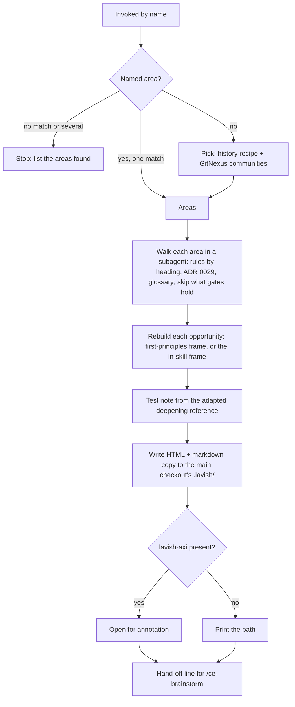

# Architecture Survey Skill - Plan

## Goal Capsule

- **Objective:** When the owner opens the architecture review before S2 (BA-35), a ranked set of places worth reshaping is already in front of them. Each comes with its evidence, a proposed shape and the decision it would reopen. The review can then start from findings instead of from a blank page.
- **Means:** a tracked, user-invoked skill, `survey-architecture`, adapted from Matt Pocock's `improve-codebase-architecture` and `codebase-design/DEEPENING.md`. It writes an annotatable report and stops there (KTD1, KTD2).
- **Product authority:** the owner's decisions recorded under Key Decisions: BA-57 (filed 06/10/2026) and this session's scoping of 06/10/2026. The Product Contract wins on behaviour, and a KTD wins on mechanism within it. The authoring standard is `docs/solutions/skill-design/portable-agent-skill-authoring.md`, applied through the `ce-skill-work` skill.
- **Stop conditions:** stop and ask the owner in any of these cases:
  - The trial run (U5) shows the survey reporting mostly what a gate or `ce-code-review` already catches, so the skill adds nothing BA-35 needs.
  - A required word for the skill's text fails the avoid-words test in a way no rewording fixes.
  - BA-59's rename of the glossary lands first, and the paths the skill names must follow it.
- **Execution profile:** one pull request carries U1 to U5. U6 is a Linear write made when that pull request opens.
- **Who finishes:** `ce-work` builds the pull request and `ce-code-review` reviews it. The merge queue lands it, with CI's `check` as the arbiter.
- **Open blockers:** none.

---

## Product Contract

### Summary

A new skill, `survey-architecture`, picks the areas of the codebase most worth reshaping. It walks each one for friction against this repository's design rules and decisions, and rebuilds each proposal from first principles. It writes the opportunities to an HTML report the owner annotates in `lavish-axi`, with a markdown copy beside it, and hands off to BA-35's `/ce-brainstorm`. A trial run on `packages/core/src/concepts/` and `answering/` is compared with `ce-code-review`'s two structural reviewers.

### Problem Frame

Nothing in Compound Engineering (CE) or this repository surveys a whole codebase for modules worth deepening. CE judges design only while reviewing a diff: the maintainability reviewer fires on structural work or 200 or more changed lines, and both it and the project-standards reviewer judge only what a diff introduces. `CODING_STANDARDS.md` states the deep-module rule, and its `Reviewer:` line says that nothing measures depth. The gates hold import direction, cycles and complexity, and they hold import direction for `packages/core` only.

The route spec puts an architecture review before S2 (`docs/specs/v01-route.md`, S2's status row), and BA-35 is that review. When the workflow ran on Pocock's skills, `improve-codebase-architecture` was meant to carry it. That skill ran in up to 6 of the 264 sessions before the move to CE on 30/09/2026, and in none of the 85 since. Pocock's plugin is turned off for this repository (`.claude/settings.json`).

### Key Decisions

- **Build a local survey skill.** Governs R1. (session-settled: user-directed — chosen over relying on CE's reviewers: the workflow evaluation of 06/10/2026 found they judge only a diff, and no CE skill surveys a whole codebase)
- **The skill stops at the report.** Upstream's grilling loop and its glossary and ADR edits are dropped, because BA-35 runs the review through `/ce-brainstorm`, which owns the questioning and the edit to a decision's doc. Governs R10, R11. (session-settled: user-approved — chosen over keeping upstream's grilling loop: two places would edit the same decision docs)
- **Every invocation rebuilds proposals from first principles.** A proposal may go past "deepen this module" when a better shape exists, including reopening a decision doc. Governs R5. (session-settled: user-directed — chosen over a survey bounded to upstream's deepening frame: the reviewer's output must not be limited when a better solution exists)
- **Diagrams come from the `diagram-design` plugin where a picture helps a decision.** Governs R8. (session-settled: user-directed — chosen over Mermaid-only diagrams in the report: the owner wants a diagram wherever it helps architectural understanding and decisions, with Mermaid kept as the fallback)
- **`DEEPENING.md` comes in as an adapted reference.** Its dependency categories are rewritten to the rule *Run every store the platform runs, for real*. `codebase-design` and `DESIGN-IT-TWICE.md` stay out. Governs R6. (session-settled: user-approved — chosen over leaving `DEEPENING.md` out: its testing guidance and its rule to replace old tests rather than add more are in no repository rule)
- **Invoked by name only.** `AGENTS.md` says when. Governs R2, R13. (session-settled: user-approved — chosen over model invocation: upstream is user-invoked, and the survey is a deliberate step before a route block)
- **The trial's comparison is recorded in the pull request, not in the tree.** Governs R15. (session-settled: user-approved — chosen over committing a findings file: the report and comparison serve BA-35 once)

### Requirements

**Invocation and picking**

- R1. A tracked skill at `.claude/skills/survey-architecture/` surveys the codebase for places worth reshaping. It is written through `ce-skill-work`.
- R2. It runs only when invoked by name. It accepts an optional named area (a slice, a directory or a stated pain point) and otherwise picks areas itself.
- R3. With no named area, it picks areas from recent git history and from GitNexus: communities, their cohesion, membership across slices, and callers. When the index is older than an area's last change, it says so and uses history and the code index for that area.

**Walking and proposing**

- R4. It walks each picked area for friction against the design rules in `CODING_STANDARDS.md`, the slice vocabulary of ADR 0029 and the glossary. It cites each rule by its heading, and leaves out what a gate in `check` already holds for that tier.
- R5. Each opportunity is rebuilt with the `first-principles` method: facts, constraints, assumptions and unknowns, then function before form. The proposal is not bounded to deepening, and the walk asks the owner no questions.
- R6. Each proposal carries a test note drawn from the adapted `DEEPENING.md`: how the reshaped module is tested across its seam under this repository's real-store rule, and which old tests it replaces.

**The report**

- R7. Each opportunity in the report gives:
  - the files involved
  - the problem
  - the rule heading it breaks
  - the proposed shape
  - a before and after
  - a recommendation strength: Strong, Worth exploring or Speculative
  - any decision in `docs/solutions/architecture-patterns/` it conflicts with, by path and `ADR NNNN`, named only when the friction warrants reopening it
- R8. Before and after diagrams come from `diagram-design` where it is available. They fall back to Mermaid where it is not.
- R9. The report is one self-contained HTML page in the main checkout's git-ignored `.lavish/`, under a name that is never reused. It opens in `lavish-axi` so the owner can annotate it. A markdown copy of the opportunities sits beside it.
- R10. The report's header states the index age for each area and every capability the run did without. It ends with a top recommendation and a hand-off line for BA-35's `/ce-brainstorm`, which names the report, its markdown copy and how to collect the owner's annotations.
- R11. The skill edits nothing in the tree: no code, glossary, decision doc or rules file.

**Inventory and handover**

- R12. The repository inventory lands with the skill: the `.gitignore` exception, the provision test's lists, the third-party notice for both upstream skills, and a path test with its docs-lane row.
- R13. `AGENTS.md` says when the skill runs: before a route block that the route spec holds behind an architecture review, starting with S2.
- R14. BA-35's first acceptance criterion names the skill.
- R15. The skill runs once on `packages/core/src/concepts/` and `answering/`. Its findings are compared with what `ce-code-review`'s maintainability and project-standards reviewers say about the same files.

### Success Criteria

- A fresh `/ce-brainstorm` session given one opportunity's markdown card can start BA-35's discussion without asking what the card means.
- On the trial, the survey reports friction that neither diff reviewer reports, and invents no defect a reading of the code refutes.

### Scope Boundaries

- Entry-point or face lint rules for `apps/api`, `apps/web` and `apps/worker`.
- The `depcruise` count of deep imports outside `packages/core`.
- Design-it-twice: parallel interface designs for one opportunity.
- Acting on the trial's findings. They go to BA-35.
- A gate the survey finds missing becomes a Linear issue, following ADR 0045. It is never a report-driven edit to `CODING_STANDARDS.md`.
- Considered and not built: polling `lavish-axi` for annotations inside the survey. The owner annotates after the run, and BA-35's session collects them. This changes if the owner wants to discuss the report in the same session.

### Sources / Research

- BA-57 and BA-35 in Linear. The evaluation is `.scratch/ce-evaluation-2026-10-06/architecture-skills.md` in the main checkout.
- Upstream: `mattpocock-skills` 1.2.3, commit `8b78b531ab965735c5dc74f6f7a219e1e37326df`, MIT. Files: `skills/engineering/improve-codebase-architecture/SKILL.md` and `HTML-REPORT.md`, and `skills/engineering/codebase-design/DEEPENING.md`.
- `CODING_STANDARDS.md`: *Design a deep module behind a small interface* and its `Reviewer:` line, *Introduce a seam only where something already varies*, *Give a slice its own type for the doors it takes*, *Test through the interface a caller crosses*, and *Run every store the platform runs, for real*. Commit `d1939996` replaced the `DESIGN1`-style ids with these headings.
- `docs/solutions/architecture-patterns/adr-0029-apps-over-packages-capability-slices.md` gives the slice vocabulary and the shapes it rejected. `adr-0045-coding-rule-is-one-imperative.md` says a finding quotes a rule's heading, and that a missing gate is a ticket.
- `docs/solutions/integration-issues/munch-indexes-stale-across-worktrees.md` says to judge staleness by date. ADR 0043 records that GitNexus gives only a lower bound on callers where dispatch is indirect.

---

## Planning Contract

### Key Technical Decisions

- KTD1. **The skill is `survey-architecture`, user-invoked through `disable-model-invocation: true`.** No tracked skill uses the key yet. CE's `ce-sweep` and `ce-retune` are the precedent. Its description still names the mechanism first and carries the `/survey-architecture` alias after it. A host that ignores the key then sees a narrow trigger rather than a broad one. The name is verb-led and clashes with no installed skill or CE skill. Governs R2.
- KTD2. **The report is written to the main checkout's `.lavish/`.** The name is `survey-architecture-<area or all>-<YYYY-MM-DD-HHMM>.html`, with a numeric suffix when the name is taken, and a matching `.md` copy. A worktree's `.lavish/` is removed with the worktree, because ignored files do not block its clean check. `lavish-axi` resumes a session by file, so a reused name would attach old annotations to new findings. Governs R9.
- KTD3. **The owner's annotations stay in `lavish-axi` until BA-35 collects them.** The hand-off line prints the report's absolute path and the `lavish-axi poll` invocation that returns its annotations. The markdown copy carries every finding, so a session without `lavish-axi` can still read them. Governs R10.
- KTD4. **The skill owns its picking recipe and pins it.** The recipe covers:
  - commits on `main` within a stated window, defaulting to the last 30 days;
  - commits that touch more than a stated number of paths are left out, defaulting to 30;
  - an area is a slice under `packages/core/src/`, a top-level directory under an app's `src/`, or a package;
  - quiet areas are ranked by size and callers.

  Mechanical sweeps dominate raw churn here: since 20/09/2026 the widest commits touched 244, 185 and 110 paths. The final numbers are set at implementation against the live history. Governs R3.
- KTD5. **GitNexus and the other tools are stated as conditions, with explicit fallbacks.** The skill's own text owns the order of fallbacks. The callees' commands do not appear in it (`docs/solutions/skill-design/skill-gates-state-conditions-not-prescribed-git-commands.md`).
  - **Index age** is judged per area, by comparing the index's commit with the last commit on the surveyed ref that touched the area. The header names that ref, because GitNexus reads the main checkout's index even when the survey runs from a worktree. A global test would mark every run degraded, because the index trails `main` by dozens of commits while few areas change.
  - **Caller counts** are lower bounds. Across the TypeScript and Python tiers they are zero by construction. A cross-tier opportunity cites the tier-contract decisions instead (ADR 0031).
  - **Fallbacks:** without `lavish-axi`, the skill prints the path. Without `diagram-design`, it uses Mermaid. Without GitNexus, it uses history and jCodeMunch. Each fallback is named in the report header.
  - Governs R3, R8, R10.
- KTD6. **`first-principles` is read as a method, never invoked as a skill.** Invoking it would hand the turn to the owner, because it asks one question at a time, and a skill invoked by another runs in the caller's context. The walk reads its `SKILL.md` when present and fills every bucket from the tree. Each unknown becomes an open question on the card for BA-35. When the file is absent, which happens under OpenCode or before the skills CLI has run, a short in-skill frame does the same job and the header says so. Governs R5. (Conflict call-out: the owner asked for the skill to be used. This honours that intent through its method, because its interactive protocol cannot run inside a survey.)
- KTD7. **The vocabulary comes from `CODING_STANDARDS.md` and ADR 0029, cited by heading. The skill avoids the landed old words.** Three of upstream's phrasings use words this repository has replaced, so they fail `apps/api/tests/avoid-words.test.ts`, and the carve-out for vendored skills covers only unedited copies. The unit of the report is an **opportunity**. "Candidate" is a pending row meaning *suggested concept*, and "suggestion" is a glossary term. Governs R4, R7.
- KTD8. **The report is styled from the `better-answers-design` skill's colours and type, as plain CSS in one file.** `AGENTS.md` sends anything a person looks at to that skill, and `lavish-axi`'s own order prefers the project's design system. No React components. The HTML template lives inside a markdown reference, because `oxfmt` checks non-markdown files under `.claude/skills/`. Governs R9.
- KTD9. **A path test keeps the skill's pointers true.** `packages/devtools/test/ci/survey-architecture-skill.test.ts` checks that every repository path in backticks in the skill and its references exists. It follows `apps/web/test/browser-suite-skill.test.ts`. A path git ignores, such as `.lavish/` or a skill installed per checkout like `first-principles`, is skipped, because CI's checkout never has it. A `references/` path resolves against the skill's own directory. BA-59 plans to rename the glossary, so a rename that missed the skill would otherwise leave it reading nothing, with no error. Governs R12.
- KTD10. **The trial runs the two reviewer personas directly.** Each gets the slice as a diff against git's empty tree, scoped to `packages/core/src/concepts` and `packages/core/src/answering`, and the project-standards reviewer is told to read `CODING_STANDARDS.md` as its standards file. A deletion-and-revert worktree reviewed with `base:` was the alternative. It reaches the same diff with more machinery. The rubric is fixed before either run (U5). Governs R15.

Phase notes: no external research ran, because the upstream skill and the authoring standard are local. No bake-off was needed, because every fork here closed on the repository's evidence.

### High-Level Technical Design

How one run flows, with each capability's fallback:



When no opportunity survives the walk, the report still gets written. It lists what was walked and why nothing qualified, so BA-35 knows the area was covered.

### Output Structure

```text
.claude/skills/survey-architecture/
  SKILL.md
  references/
    deepening.md
    report.md
```

### Risks & Dependencies

- `candidate` and the other pending avoid-words rows may land while the skill is in use. KTD7's word choice avoids the one most central to it.
- GitNexus lags `main`, and it reads the main checkout's index from any tree. KTD5 makes the lag visible per area.
- `disable-model-invocation` is untested in a tracked skill here, and OpenCode's handling of it is unknown. U4's activation cells cover Claude Code. The OpenCode run records what it saw.
- BA-59 renames the glossary. KTD9's test fails that rename's pull request if it misses the skill.

### Deferred to Implementation

- The final window and path cap in KTD4, set against the live history.
- Whether `lavish-axi poll` returns at once when annotations are already queued. This decides the exact wording of the hand-off line.
- How `diagram-design` takes the report's colours. Its profiles may carry them, or the diagram may sit unstyled inside the card.

---

## Implementation Units

### U1. The skill body

- **Goal:** `SKILL.md` gives an agent the outcome, the done condition, the picking recipe, the walk and the hand-off, written to the authoring standard.
- **Requirements:** R1, R2, R3, R4, R5, R7, R10, R11; KTD1, KTD4, KTD5, KTD6, KTD7.
- **Dependencies:** none.
- **Files:** `.claude/skills/survey-architecture/SKILL.md`.
- **Approach:**
  1. Invoke `ce-skill-work` in its new-skill mode before the first line, and follow `references/new-skill.md` from that skill's directory.
  2. Write the outcome spine alone first. The result is the report and its markdown copy. Its consumers are the owner, then BA-35's `/ce-brainstorm`. The skill is done when the report exists with every opportunity's fields filled, or when a stop names what was missing.
  3. Write the frontmatter per KTD1.
  4. Pin the picking recipe (KTD4). State GitNexus, `first-principles`, `diagram-design` and `lavish-axi` as capabilities, each with its fallback (KTD5, KTD6).
  5. Dispatch the walk to a subagent per area, because the walk reads far more than it returns. Pass inputs by path.
  6. Handle the three stop and empty cases in the High-Level Technical Design: no match for a named area, several matches, and no opportunity surviving.
  7. Name each reference at its point of use.
- **Patterns to follow:** `.claude/skills/renovate-prs/SKILL.md` for frontmatter and for naming tools with their caveats. `.claude/skills/ce-skill-work/SKILL.md` for references routed at their point of use.
- **Test scenarios:** behaviour is proven by U4's eval and U5's trial. The mechanical contract is in U3.
- **Verification:** a fresh reader can state the outcome, done condition and stop cases from the body alone, and the body names no rule by an old `DESIGN` id.

### U2. The two references

- **Goal:** the adapted deepening guidance and the report's format live in references loaded where they are used.
- **Requirements:** R6, R7, R8, R9, R10; KTD2, KTD3, KTD7, KTD8.
- **Dependencies:** U1.
- **Files:** `.claude/skills/survey-architecture/references/deepening.md`, `.claude/skills/survey-architecture/references/report.md`.
- **Approach:**
  - `deepening.md` adapts upstream's dependency categories. In-process code merges and is tested through its new interface. Every store the platform runs is tested for real, which replaces upstream's PGLite stand-in. A port with an in-memory adapter is only for a service someone else runs. It keeps the rule to replace old tests rather than add more, and cites the seam rule by its heading rather than restating it.
  - `report.md` gives the card's fields (R7), the header and the hand-off line (R10), and the file naming (KTD2). It holds the HTML scaffold styled per KTD8, the `diagram-design` path with its Mermaid fallback, and the markdown copy's shape.
- **Patterns to follow:** upstream `HTML-REPORT.md` for the card and the top recommendation. `packages/design-system/` for colours and type.
- **Test scenarios:** covered by U3's path test and the avoid-words test, and by U4 and U5 for behaviour.
- **Verification:** each reference is named once in `SKILL.md` at the point that needs it, and no fact appears in both a reference and the body.

### U3. Inventory and the path test

- **Goal:** git tracks the skill, the gates know it, and its upstream is credited.
- **Requirements:** R12, R13; KTD9.
- **Dependencies:** U1, U2.
- **Files:**
  - `.gitignore`
  - `packages/devtools/test/ci/provision-skills.test.ts`
  - `packages/devtools/test/ci/survey-architecture-skill.test.ts`
  - `packages/devtools/test/ci/docs-lane.test.ts`
  - `package.json`
  - `.claude/skills/THIRD_PARTY_NOTICES.md`
  - `AGENTS.md`
- **Approach:**
  - Add the `!.claude/skills/survey-architecture/` line beside the others.
  - In the provision test, the skill joins the third-party list, whose title becomes "six", and the exact sorted list.
  - The new test reads the skill and its two references. It runs under `check:docs:devtools` and has a row in `docs-lane.test.ts`.
  - The notice gets a section for `mattpocock-skills` 1.2.3: both upstream skills, the commit, the licence text, and what changed. The grilling loop, the glossary and ADR write-backs, the temp-directory placement and the `/codebase-design` vocabulary were dropped. Vocabulary and test guidance were translated to this repository. It gets no `skills-lock.json` entry, following `ce-skill-work`.
  - The `AGENTS.md` line sits beside `/c4-architecture`.
- **Test scenarios:**
  - Happy path: the provision test passes with `survey-architecture` in both lists, and fails if the `.gitignore` line is removed.
  - The path test passes when every backticked repository path in the skill exists.
  - The path test passes on a clean checkout where no git-ignored path exists, though the skill names `.lavish/`.
  - Error path: the path test fails, naming the path, when a reference cites the glossary and that file is renamed.
  - The path test asserts the skill names `CODING_STANDARDS.md` and `docs/solutions/architecture-patterns/`, so the check holds something.
  - The docs-lane test passes with the new row, and fails if the script runs the test without the row.
- **Verification:** `pnpm run check:docs` passes, including the avoid-words test over the new files.

### U4. Evaluate the skill

- **Goal:** evidence that the skill activates only when asked, holds back where it should, and runs its main path on each host available.
- **Requirements:** R2, R4, R5, R8, R9, R10; KTD1, KTD5, KTD6.
- **Dependencies:** U1, U2, U3.
- **Files:** none in the tree. Scenarios and results go in the pull request.
- **Approach:** follow `references/evaluate.md` from `ce-skill-work`'s directory.
  - The explicit-invocation and adjacent-negative cells test activation. They run as a host CLI session (`claude -p` with `CLAUDECODE` unset) in the pull request's worktree, where the tracked skill is discovered, with no skill path handed in.
  - Every other cell runs in a fresh host session given only the user's request and the skill's path. It dispatches the walk for real and is graded on the report written to `.lavish/`, not on the transcript.
- **Test scenarios:**
  - **Explicit invocation:** `/survey-architecture packages/core/src/sources` writes a report for that area alone.
  - **No named area:** `/survey-architecture` with no argument picks areas. The report header lists them with the window and path cap used, and no area ranks high only because a mechanical sweep touched it.
  - **Adjacent negative:** "review this pull request for shallow modules" in a fresh session does not load the skill.
  - **Restraint:** on `packages/core/src/members` and `workspaces`, matching door lists are not proposed for merging, and no shape ADR 0029 rejected comes back without a conflict call-out. Nothing that `import-direction`, `import/no-cycle` or the complexity cap already holds is reported.
  - **Named area missing:** `/survey-architecture packages/core/src/billing` stops and lists the areas it found.
  - **No `first-principles`, no `diagram-design`, no `lavish-axi`:** the report is still written, with Mermaid diagrams, and the header names all three fallbacks. Run under OpenCode where it is reachable, and with the tools hidden otherwise.
  - **First-principles:** at least one opportunity's proposal goes past deepening a module, or the card says why none did. No question reaches the owner during the walk.
- **Verification:** every cell has a recorded outcome, and each failed cell is fixed in U1 or U2 or recorded with its reason.

### U5. Trial and comparison

- **Goal:** one real run on S2's ground, set against what CE's reviewers say about the same files.
- **Requirements:** R15; KTD10.
- **Dependencies:** U4.
- **Files:** none in the tree. The comparison goes in the pull request body.
- **Approach:**
  1. Fix the rubric before either run:
     - findings both report;
     - findings only the survey reports;
     - findings only the reviewers report;
     - survey findings a reading of the code refutes.

     The maintainability reviewer's 1,000-line trigger fires on `concepts/index.ts` (1,203 lines) whatever method is used, so an overlap on file size alone does not count.

     The verdict rule is fixed with the rubric. The Goal Capsule's stop condition fires when more than half of the survey findings that survive the refutation reading were also reported by a reviewer or are held by a gate. The owner is then asked before merge.
  2. Run `/survey-architecture` on `packages/core/src/concepts` and `packages/core/src/answering`.
  3. Run the two personas per KTD10.
  4. Give one opportunity's markdown card from the trial report to a fresh `/ce-brainstorm` session. Record whether it could start the discussion without asking what the card means.
  5. Record the comparison and the card check in the pull request body, and that the reviewers were run against a diff they were not designed for.
- **Test scenarios:**
  - The comparison lists at least one finding only the survey reports, or says plainly that there was none. No count is padded.
  - A survey finding the code refutes is fixed at its cause in U1 or U2 before merge.
  - A card the fresh `/ce-brainstorm` session cannot start from is fixed in U2's report reference before merge.
- **Verification:** the pull request body holds the rubric, both result sets, the verdict and the card check. The report path is noted for BA-35 as input on those two slices. BA-35's own review starts from a fresh run with no named area.

### U6. Name the skill in BA-35

- **Goal:** BA-35's first criterion tells its session to start from the survey.
- **Requirements:** R14.
- **Dependencies:** U5's pull request opened.
- **Files:** none. This is a Linear write.
- **Approach:** the agent that opens the pull request edits BA-35's first criterion. The new criterion says the review runs through `/ce-brainstorm`, starting from a fresh `/survey-architecture` run with no named area. The trial report is linked as extra input on `concepts` and `answering`. BA-57 closes through `Fixes BA-57` in the pull request.
- **Test expectation:** none. This is an issue edit.
- **Verification:** BA-35's first criterion names the skill.

---

## Verification Contract

| What | How | When |
|---|---|---|
| Inventory, path test, avoid-words, format | `pnpm run check:docs` | U3, and before the pull request |
| Whole repository | `pnpm check`, then CI's `check` in the merge queue | before merge |
| Activation, restraint, fallbacks | U4's cells, run in fresh host sessions, recorded in the pull request | after U3 |
| Real run and comparison | U5's rubric and verdict rule, recorded in the pull request body | after U4 |
| Card hand-off | U5's fresh `/ce-brainstorm` session on one markdown card | after the trial |
| Review | `/ce-code-review`, with the cross-model reviewer, then Cubic on the pull request | before merge |

---

## Definition of Done

- The skill and its two references are in the tree, written through `ce-skill-work`, and pass `pnpm run check:docs`.
- U4's cells and U5's comparison are recorded in the pull request, with every failed cell fixed or explained.
- `AGENTS.md` names when the skill runs, and BA-35's first criterion names it.
- No experimental file, scratch report or abandoned draft is left in the diff. Reports stay in the ignored `.lavish/`.
