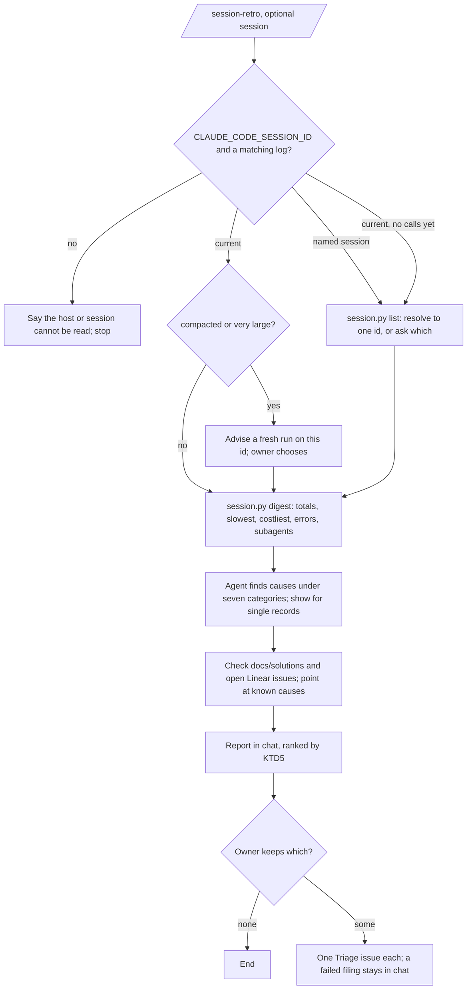

# Session Retro Skill - Plan

## Goal Capsule

- **Objective:** When a session in this repository loses time or goes wrong because of the agent's environment, the owner can find out why from the session itself. Each cause they choose to keep becomes a tracked issue, so the next session does not pay the same cost.
- **Means:** a tracked, user-invoked skill, `session-retro`, adapted from Matt Pocock's `retro`. A bundled script turns a session log into a digest the agent can read, and the findings go to chat and then to Linear Triage (KTD3, KTD6). `retro-miner` is retired.
- **Product authority:** the owner's decisions recorded under Key Decisions: BA-60 (filed 06/10/2026) and this session's scoping of 06/10/2026. The Product Contract wins on behaviour, and a KTD wins on mechanism within it. The authoring standard is `docs/solutions/skill-design/portable-agent-skill-authoring.md`, applied through `ce-skill-work`.
- **Stop conditions:** stop and ask the owner in any of these cases:
  - `CLAUDE_CODE_SESSION_ID` is not set in a top-level Claude Code session, so the current session cannot be found without guessing.
  - The real run (U5) files nothing useful: every finding is one `ce-code-review` or a gate already reports.
  - A finding's evidence cannot be stated without quoting private content.
- **Execution profile:** one pull request carries U1 to U5. The findings from U5 go to BA-60 as a Linear comment.
- **Who finishes:** `ce-work` builds the pull request and `ce-code-review` reviews it. The merge queue lands it, with CI's `check` as the arbiter.
- **Open blockers:** none.

---

## Product Contract

### Summary

A new skill, `/session-retro`, reads a Claude Code session's log, the current one by default, and reports what in the agent's environment cost time or went wrong. Findings come under upstream's seven categories, most severe first. The owner picks which findings to keep, and each kept one becomes a Linear Triage issue. `.claude/agents/retro-miner.md` is removed.

### Problem Frame

A session that loses time leaves no record of why. The cause might be a file the agent could not find, a mistake a check could have caught, an expensive tool call, or a steering line that changes nothing. The next session meets the same cause. `retro-miner` was written for this job, but it ran in 4 sessions before the move to Compound Engineering (CE) on 30/09/2026 and in none of the 85 since. Nothing dispatches it, and it never says where its draft goes. In CE, `ce-compound` records one solved problem and is told to ignore unrelated friction, `ce-compound-refresh` never reads a session, and `ce-retune` needs a benchmark harness.

### Key Decisions

- **Adopt Pocock's `retro` for the session retro.** Governs R1, R5. (session-settled: user-directed — chosen over keeping `retro-miner` and over relying on `ce-compound`: the workflow evaluation of 06/10/2026 found nothing else does this job)
- **Findings appear in chat; each one the owner keeps becomes one Linear Triage issue.** Nothing goes to `docs/solutions/`, which `ce-compound` owns. Governs R7, R8. (session-settled: user-approved — chosen over chat only, and over a learning per finding: an issue is the repository's rule for a finding put off for later)
- **All seven upstream categories stay.** `retro-miner`'s sections (bugs, failed assumptions, decisions, rejected approaches) are dropped, because `ce-compound` and the plans already hold them. Governs R5. (session-settled: user-approved — chosen over keeping `retro-miner`'s sections: they record the work, not the environment)
- **The session reader is a script bundled in the skill, for Claude Code logs only.** On another host the skill says so and stops. Governs R3, R4. (session-settled: user-approved — chosen over the parser in git-ignored `.scratch`: a tracked skill cannot depend on it)
- **The two records under `.scratch/retros/` stay as they are.** Governs R10. (session-settled: user-approved — chosen over filing their old findings as issues: they are git-ignored and harmless)

### Requirements

**Reading a session**

- R1. A tracked skill at `.claude/skills/session-retro/`, written through `ce-skill-work`, runs only when invoked by name.
- R2. It accepts an optional session: an id, an id prefix, or a description matched against session titles and dates. Without one it reads the current session.
- R3. A bundled script reads the session's log and its subagents' logs. It prints a digest small enough for the agent to read whole, and it prints any one record on request.
- R4. When the host is not Claude Code, or the session cannot be found, the skill says so and stops.

**Finding causes**

- R5. The agent looks for causes under the seven categories: navigation, automated checks, coding standards, global AGENTS.md, tool economy, no-ops in steering files, and information access.
- R6. A cause that a doc in `docs/solutions/` already explains, or an open Linear issue already tracks, is pointed at, not offered again.

**Reporting and filing**

- R7. Findings are reported in chat, most severe first. Each gives the cause, the evidence's place in the log, and the change it proposes.
- R8. The owner chooses which findings to keep. Each kept finding becomes one Linear Triage issue, and a filing that fails leaves the finding in the chat report.
- R9. An issue's evidence names where in the log the cause shows and paraphrases it. It never quotes raw tool output or prompt text.

**Inventory and handover**

- R10. `.claude/agents/retro-miner.md` is removed. `.scratch/retros/` is left alone.
- R11. The repository inventory lands with the skill: the `.gitignore` exception, the provision test's lists, the third-party notice, and a test in the docs lane.
- R12. `AGENTS.md` says when the skill runs: after a session that went slower or wronger than expected, from a fresh session.
- R13. The skill runs once on a real session, and its findings are attached to BA-60 as a Linear comment.

### Success Criteria

- On the real run, at least one finding is a cause the owner did not already know of. Every finding points at a place in the log a reader can open.
- A second run on the same session offers no finding that the first run filed.

### Scope Boundaries

- Changing `ce-compound`, `ce-compound-refresh` or `ce-retune`.
- Measured retuning across many runs.
- Acting on the findings themselves. They become issues.
- Reading other hosts' session stores, such as OpenCode's.
- Considered and not built: writing a retro file to the tree. Upstream writes no file, and an issue is the record.

### Sources / Research

- BA-60 in Linear. The evaluation is `.scratch/ce-evaluation-2026-10-06/worktree-retro.md` in the main checkout.
- Upstream: https://github.com/mattpocock/skills, MIT, `skills/engineering/retro/SKILL.md` at commit `a7d038f6bf7f01b516408e95e2fb56e0b338fa6f` (blob `12149acf`), and its user page `docs/engineering/retro.md`. The copy on this machine is the older in-progress text at `6654f6b6`. The issue's link to `skills/in-progress/retro/` now returns 404.
- `docs/agents/issue-tracker.md` sets the rule for a finding put off for later. `docs/solutions/architecture-patterns/adr-0045-coding-rule-is-one-imperative.md` says a rule nothing enforces becomes a ticket for a check.
- The sibling skill `.claude/skills/survey-architecture/` (#590) is the pattern for layout, inventory and its path test.

---

## Planning Contract

### Key Technical Decisions

- KTD1. **The skill is `session-retro`, user-invoked through `disable-model-invocation: true`.** The name clashes with nothing installed. The description names the mechanism first and the `/session-retro` alias after it. Governs R1.
- KTD2. **Adapt the graduated upstream text at `a7d038f6`, not the local copy.** Its two rewritten categories fit this repository. Automated checks reads the repository's own check scripts first. Coding standards sends a mechanical violation to a lint rule or check rather than to `CODING_STANDARDS.md`. Upstream's call to `writing-for-agents` is replaced by this repository's authoring standard. Governs R5.
- KTD3. **One bundled script, `scripts/session.py`, with three modes.** It uses Python's standard library only, and runs from the repository root.
  - `list` prints recent sessions for this repository's project folders: id, title, dates and size. The agent resolves a named session from it.
  - `digest <id>` prints totals, then the slowest and costliest calls, errors and retries, skill loads, subagents and compactions. The output is capped so the agent can read it whole. The largest session here is 26 MB, too large to read directly.
  - `show <id> [--agent <agent-id>] <line>` prints one record with long fields cut short. `--agent` reads that subagent's log, and the digest prints each subagent's agent id so a record there can be opened.

  Governs R2, R3.
- KTD4. **How the script finds and reads a session.**
  - The current session's id comes from `CLAUDE_CODE_SESSION_ID`, and its file from `~/.claude/projects/*/<id>.jsonl`. The newest file is not used, because parallel sessions write at the same time.
  - The projects folder is found under the home directory the process is given. The test runs the script with a temporary home holding the fixture, and sets every spawn's environment explicitly, so a real session is never read in a test.
  - When the current session holds no calls before the `/session-retro` invocation, as in a fresh session, the skill runs `list` and asks which session to read instead of reporting an empty retro.
  - When that variable is unset or no file matches, the host is not Claude Code or the session is gone. The script says so and exits non-zero.
  - In the current session the digest stops at the `/session-retro` invocation, so the retro does not count its own calls. A call with no result yet counts as pending, and a line that does not parse is skipped and counted.
  - Wall time is the result's timestamp minus the call's. Calls made in one response count as one span. Background calls show no time.
  - Token use is summed once per request id.
  - Subagent cost comes from walking every `subagents/agent-*.jsonl` file. Seven of the 71 agents in the largest session have no `toolUseId` to join on.

  Governs R3, R4.
- KTD5. **The ranking rule for "most severe first".** Correctness or safety comes first: a check that exists and was not run, a standard breached in shipped code, or a secret in a call. Measured cost comes next: wall time and tokens lost, times how often the cause recurred. One-offs come last. The rank sets the issue's Linear priority: High, Medium, then Low. Each finding is also graded Change, Verify or Consider, and only a cause the log shows directly earns Change. Governs R7.
- KTD6. **Filing is stated as a condition, and the skill owns no tracker mechanics.** The skill files through `docs/agents/issue-tracker.md`'s rule. Each issue's Notes carry the session id. Before offering findings, the skill searches Linear for issues in any state whose Notes carry this session's id, and leaves out what was already filed from it. For a cause first seen in another session, it searches for an open issue on the same cause and shows that issue instead. A finding about the owner's global `~/.claude/CLAUDE.md` stays in chat unless the owner keeps it, because no pull request here can close it. Governs R6, R8.
- KTD7. **Evidence in an issue is a pointer and a paraphrase.** The pointer is the session id, the agent id when the record is a subagent's, and the line. A finding about a secret names the kind of credential and the line, never its value or any part of it, and its proposed change includes rotating the credential. The repository is public, and an issue's text moves into plans and pull requests. Session logs here hold strings that look like secrets, and private prompt text. Test fixtures are made up, never cut from a real log. Governs R9.
- KTD8. **When the current session is large or already compacted, the skill advises a fresh run on that session's id from a new session.** That applies when the log has a compaction record or its last request is above about 400k tokens. A retro run inside a large session can trigger its own compaction. The owner chooses; the skill does not refuse. Governs R2.
- KTD9. **One test in the docs lane, `packages/devtools/test/ci/session-retro-skill.test.ts`.** It runs `scripts/session.py` over a made-up fixture log and asserts on the digest. It also checks that the paths the skill names exist, as `survey-architecture-skill.test.ts` does, with a `~` path skipped. Governs R11.

No external research ran; upstream and the sibling skill are both local or one `gh api` call away. No bake-off was needed.

### High-Level Technical Design



### Output Structure

```text
.claude/skills/session-retro/
  SKILL.md
  references/
    categories.md
  scripts/
    session.py
```

### Risks & Dependencies

- `CLAUDE_CODE_SESSION_ID` was observed only from a subagent, where it held the parent's id. U1 confirms it in a top-level session before anything relies on it.
- The JSONL format is Claude Code's private format and can change between versions. The digest skips lines it cannot parse and reports how many it skipped. The fixture test pins the fields the script relies on.
- The skill's text goes through the avoid-words test like any tracked file. Upstream's phrasing uses words this repository has replaced, so it is reworded rather than copied.

### Deferred to Implementation

- The digest's exact caps: how many slowest and costliest calls it lists.
- How the `list` mode matches a description: title words, a date, or both.

---

## Implementation Units

### U1. The session script and its test

- **Goal:** `scripts/session.py` lists sessions, digests one, and shows one record, behaving correctly on the cases KTD4 names.
- **Requirements:** R2, R3, R4; KTD3, KTD4, KTD7, KTD9.
- **Dependencies:** none.
- **Files:**
  - `.claude/skills/session-retro/scripts/session.py`
  - `packages/devtools/test/ci/session-retro-skill.test.ts`
  - `packages/devtools/test/ci/fixtures/session-retro/` (a made-up session and one subagent log)
- **Approach:**
  1. Confirm in a top-level session that `CLAUDE_CODE_SESSION_ID` holds that session's id. If it does not, stop and ask, per the Goal Capsule.
  2. Write the fixture by hand: a short session with a skill load, two calls in one response, a failed call retried, a call with no result, a compaction record, a subagent with a `toolUseId` and one without, a repeated request id and one broken line.
  3. Write the test against the fixture, then the script.
- **Execution note:** test-first. The script's job is parsing a format that can drift, and the fixture is its contract.
- **Patterns to follow:** `packages/devtools/test/ci/survey-architecture-skill.test.ts` for the test's shape. `.scratch/ce-evaluation-2026-10-06/skill-usage.py` in the main checkout for walking the project folders.
- **Test scenarios:**
  - The digest of the fixture reports the slowest call first, with its wall time from the two timestamps.
  - Two calls in one response count as one span, not two.
  - A request id repeated across content blocks counts its tokens once.
  - Both subagents' tokens appear, including the one with no `toolUseId`.
  - The call with no result is reported as pending, not as an error.
  - The broken line is skipped and counted.
  - The compaction is reported.
  - Error path: `digest` with an id that matches no file exits non-zero and names the id.
  - Error path: run with `CLAUDE_CODE_SESSION_ID` unset and no id given, it exits non-zero and says the host is not Claude Code.
  - Run under the test's temporary home, `list` shows only the fixture session.
  - `show` prints one record with a long field cut short.
  - `show --agent` prints the fixture subagent's record.
  - `list` prints the fixture session with its title.
- **Verification:** the test passes in `check:docs:devtools`, and the digest of the largest real session fits a single read.

### U2. The skill body and its reference

- **Goal:** `SKILL.md` gives the outcome, the done condition, the session choice, the walk through the categories, the ranking, and the filing condition. The seven categories sit in a reference.
- **Requirements:** R1, R2, R4, R5, R6, R7, R8, R9; KTD1, KTD2, KTD5, KTD6, KTD7, KTD8.
- **Dependencies:** U1.
- **Files:** `.claude/skills/session-retro/SKILL.md`, `.claude/skills/session-retro/references/categories.md`.
- **Approach:**
  - Invoke `ce-skill-work` in its new-skill mode and write the outcome spine first. The result is a ranked chat report and the issues kept from it. The consumer is the owner. The run is done when every kept finding is filed or left in chat with its failure named.
  - The categories reference adapts upstream's seven at `a7d038f6`, with this repository's targets for each. Steering files are `AGENTS.md`, `CLAUDE.md`, `CODING_STANDARDS.md` and the standards file beside each directory. Checks are `check:gates` and the workspaces' `check`. The reviewer is `ce-code-review`'s project-standards reviewer.
  - ADR 0045 applies to `CODING_STANDARDS.md` findings only.
  - The authority envelope is stated once. Running the script and reading logs and docs are safe. Filing kept findings is the one outside write. Nothing in the tree is edited.
- **Patterns to follow:** `.claude/skills/survey-architecture/SKILL.md` for the outcome spine, the authority envelope and stating capabilities with their fallbacks.
- **Test scenarios:** behaviour is proven by U5's real run. The path checks are in U1's test.
- **Verification:** a fresh reader can state the outcome, the done condition and the stop cases from the body alone.

### U3. Inventory, notice and retiring `retro-miner`

- **Goal:** git tracks the skill, the gates know it, upstream is credited, and `retro-miner` is gone.
- **Requirements:** R10, R11, R12.
- **Dependencies:** U1, U2.
- **Files:**
  - `.gitignore`
  - `packages/devtools/test/ci/provision-skills.test.ts`
  - `packages/devtools/test/ci/docs-lane.test.ts`
  - `package.json`
  - `.claude/skills/THIRD_PARTY_NOTICES.md`
  - `AGENTS.md`
  - `.claude/agents/retro-miner.md` (deleted)
- **Approach:**
  - Add the `.gitignore` exception. The skill joins the provision test's third-party list, which becomes "seven", and its exact sorted list.
  - The new test gets its docs-lane row and its place in `check:docs:devtools`.
  - The notice records the upstream repository, the path and commit `a7d038f6`, the licence, and what changed:
    - `writing-for-agents` was replaced by this repository's standard;
    - the bundled script, the ranking and the filing step were added;
    - the categories were mapped to this repository's files.
  - The `AGENTS.md` line goes in the *Skills* list. The agent cannot invoke the skill, so the line tells it what to do instead: at the end of a session that ran slower or went wrong, suggest the owner run `/session-retro <this session's id>` from a fresh session, and give the id.
  - No tracked file other than the agent itself references `retro-miner`.
- **Test scenarios:**
  - The provision test fails until the `.gitignore` line exists, then passes with the skill in both lists.
  - The docs-lane test passes with the new row.
- **Verification:** `pnpm run check:docs` passes, including the avoid-words test over the new files.

### U4. Evaluate the skill

- **Goal:** evidence that it runs only when invoked, stops where it should, and ranks and files as KTD5 and KTD6 say.
- **Requirements:** R1, R2, R4, R6, R7; KTD1, KTD6, KTD8.
- **Dependencies:** U3.
- **Files:** none in the tree. Results go in the pull request.
- **Approach:** follow `references/evaluate.md` from `ce-skill-work`'s directory. Activation cells run as a host CLI session with no skill path handed in. Behaviour cells run in fresh sessions given the skill's path, with filing switched to a dry run that prints the issue it would create.
- **Test scenarios:**
  - **Adjacent negative:** "write up what we learned from this bug" in a fresh session loads `ce-compound`, not this skill.
  - **Explicit invocation, named session:** `/session-retro` with a past session's id prefix digests that session and reports ranked findings.
  - **No such session:** an id that matches nothing stops with the id named.
  - **Compacted current session:** the skill advises a fresh run before it reads anything.
  - **Fresh session, no argument:** a bare `/session-retro` offers the session list and asks, and does not report an empty retro.
  - **Secret in a call:** on a session holding a made-up secret-shaped string, the dry-run issue names the credential's kind and line and holds no part of the string.
  - **Known cause:** a cause covered by `docs/solutions/integration-issues/munch-indexes-stale-across-worktrees.md` is pointed at, not offered.
  - **Evidence:** no dry-run issue body holds raw tool output.
- **Verification:** every cell has a recorded outcome, and each failed cell is fixed in U1 or U2 or recorded with its reason.

### U5. One real run, findings to BA-60

- **Goal:** the skill used for real on a hard session, with its findings where the owner can triage them.
- **Requirements:** R13; KTD6, KTD7.
- **Dependencies:** U4.
- **Files:** none in the tree.
- **Approach:**
  1. Run `/session-retro 75d12dc7` from a fresh session. That session is finished, 26 MB, with two compactions and 71 background agents.
  2. Run the filing as a dry run first. The owner then chooses which findings to file for real.
  3. Post the ranked report to BA-60 as a Linear comment, using the KTD7 evidence form.
  4. Re-run `/session-retro 75d12dc7` and check that no filed finding is offered again.
- **Test expectation:** none. This is a run of the finished skill, whose behaviour U4 covers.
- **Verification:** BA-60 carries the report, each issue the owner kept exists in Triage with the session id in its Notes, and the re-run offers none of them.

---

## Verification Contract

| What | How | When |
|---|---|---|
| Script behaviour, paths, inventory, words, format | `pnpm run check:docs` | U1, U3, and before the pull request |
| Whole tree | `pnpm run check:gates`, then CI's `check` in the merge queue | before merge |
| Activation, stops, ranking, known causes, evidence | U4's cells in fresh host sessions, recorded in the pull request | after U3 |
| Real use | U5's run, its report on BA-60, and a re-run offering nothing already filed | after U4 |
| Review | `/ce-code-review`, then Cubic on the pull request | before merge |

---

## Definition of Done

- The skill, its reference and its script are in the tree, written through `ce-skill-work`, and pass `pnpm run check:docs` and `check:gates`.
- `retro-miner` is removed, `AGENTS.md` names when the skill runs, and the notice credits upstream at `a7d038f6`.
- U4's cells are recorded in the pull request, and U5's report is on BA-60.
- No real session content is in a fixture, a test or the pull request. No scratch output or abandoned draft is left in the diff.
