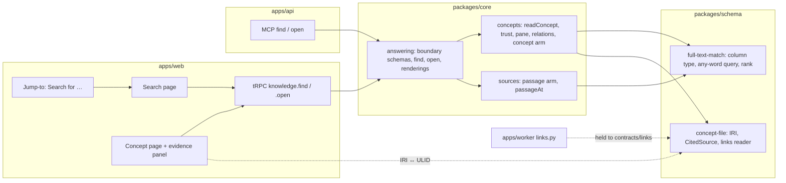
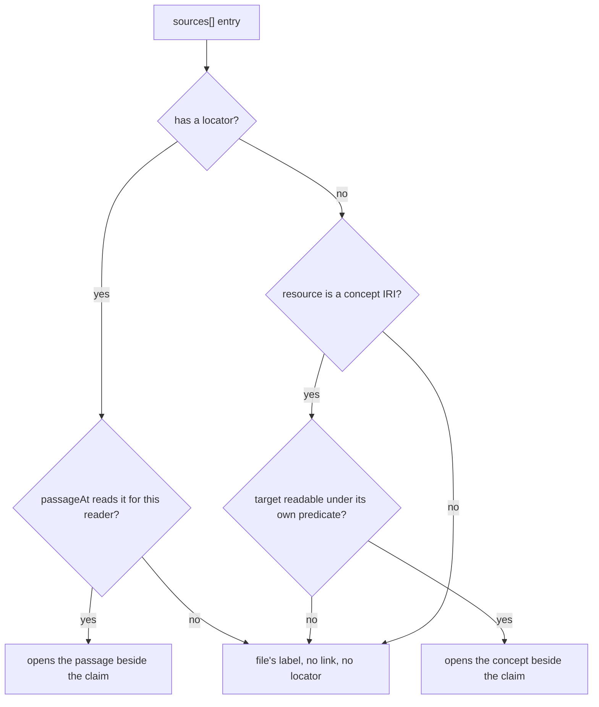
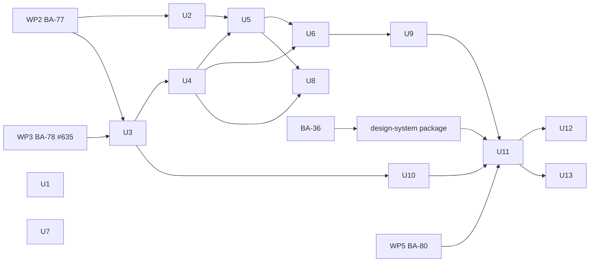

# S2a Search and the Concept Page - Plan

## Goal Capsule

- **Objective:** The owner can search the first customer's concepts by meaning and read each one on its own page, in the customer's production workspace, without any model being called. S2b can then answer from entry points that are known to work, and there is a figure for how well full-text search alone recalls an `Answer` from a paraphrase of its question.
- **Means:** a stored full-text column on the concept index matched by any word (KTD1, KTD2), one reader of what a concept file asserts shared by both tiers (KTD5), the concept read owned by the concepts slice and rendered once for MCP and the web (KTD6), and two Knowledge pages over a new tRPC router (KTD9, KTD10).
- **Product authority:**
  - `docs/specs/v01-route.md`, the S2a block, is authoritative for what S2a builds: its destination, its must-carry, its *T-113's lines* and its *BA-35's lines*.
  - This plan records the owner's decisions of 09/10/2026, which change that block where R2 to R9 say.
  - `docs/plans/2026-10-08-2311-docs-architecture-review-before-s2-plan.md` (R5, R6) is authoritative for the order of the work packages S2a waits on.
- **Stop conditions:** stop and ask the owner in any of these cases:
  - Evidence that a Key Decision below cannot work.
  - A migration's lock wait exceeds its `lock_timeout` on staging.
  - The two contract stamps disagree after `contracts/links` lands.
  - A web unit is reached before BA-36, the design-system package and WP5 have landed.
- **Execution profile:** one pull request per unit, except where Sequencing pairs them. U2 and U3 are not reversible once merged and run. The web units wait on outside work (Dependencies).
- **Who finishes:**
  - `ce-work` builds each unit.
  - `/ce-code-review` reviews it before the pull request.
  - `ce-commit-push-pr` opens the pull request, and the merge queue merges it when `check` is green.
  - The owner runs AE1 by hand after the release that carries U11 and U12.
- **Open blockers:** none for planning. For the build: BA-36, the design-system package after it, WP2 and WP5 hold the units Dependencies names.

---

## Product Contract

### Summary

S2a builds the route block as written: full-text entry points over the concept index, `find` ranked by them, the concept page as `open`'s web form, and Knowledge's Search page. The owner is its one user on production until C1. The recall measure moves here from S2b and runs in CI over a synthetic paraphrase set. Frame, Card and the registration mark come from a separate design-system package, which S2a's web units consume.

### Problem Frame

The first customer's bundle has been on production since 27/09/2026 (T-331): 243 concepts, 241 of them `Answer`s. Nothing finds them by meaning yet. `find` matches the whole query as one substring of a title or body (`packages/core/src/concepts/index.ts`, `findConcepts`), so *audit log retention* misses *Audit Logs Retention* (BA-11). The web app has no page that shows a concept, and Knowledge › Search is marked unbuilt with no route.

S2b answers over S2a's entry points. If S2a's matching is weak, S2b's answers are weak, and the route spec only finds out at C1, when the customer's own answer tests are read and S8 is picked or left in reserve. An earlier figure on synthetic data costs little, because S2a's matching needs no model.

The design system specifies a registration mark, Frame, Card and an accent-filled primary button that `apps/web` does not have yet (`.scratch/research/ui-design-system-conformance-2026-10-09.md`, machine-local). S2a's two pages are the first new Knowledge pages, so they would otherwise either build those parts around themselves or ship without them.

### Key Decisions

- **The owner is S2a's only user on production before C1.** No customer people are invited for S2a. Governs R2. (session-settled: user-directed — chosen over inviting a small read-only pilot of the customer's people early, and over proving S2a on staging and the seed alone: the owner reads the real bundle without pulling C1's invitations forward.)
- **The recall measure moves from S2b to S2a, over a synthetic set only.** Governs R3, R4, R5, R6. (session-settled: user-directed — chosen over keeping it in S2b: the measure tests S2a's own entry points and gives a figure before S2b is built on them.)
- **No recall reading is taken on production in S2a.** (session-settled: user-directed — chosen over a reading over the customer's variant wordings and over owner-written paraphrases: a variant is a `##` section of its own concept's body (ADR 0004), which the index covers, so its reading would overstate recall, and the first real figure stays C1's.)
- **A separate design-system package builds Frame, Card and the registration mark before S2a's web units.** Governs R7. (session-settled: user-directed — chosen over S2a's web units building them and over shipping with today's parts: the parts are built once, the existing pages can adopt them, and S2a's pages consume them.)
- **The primary button takes the accent fill.** The design-system readme says so, and the owner ruled it right over the Tailwind bridge's near-black on 09/10/2026. It lands in the web CSS wiring fix (#636), ahead of S2a. Governs R7.
- **A concept comes before document passages only when it holds at least half the query's words.** Governs R10. (session-settled: user-directed — chosen over keeping every concept match ahead of every passage: under any-word matching, *how long do we keep audit logs* matches about 98 of the customer's concepts through *audit* alone, so passages would not appear for pages.)
- **A search matches on any of its words.** Governs R9. (session-settled: user-directed — chosen over requiring every word, and over every word first with any word as a fallback: question-style searches such as *how long do we keep audit logs* must reach *Audit Logs Retention*, and the recall figure should measure full text fairly.)
- **The database refuses a concept row whose IRI breaks the IRI pattern.** U3 adds the CHECK constraint in its migration. Governs R1. (session-settled: user-directed, 09/10/2026 — chosen over trusting the two writers' validation alone: a stray row would make `find` or `open` error on a read every Viewer can reach, and constraining stored data now is cheaper than later.)
- **A page locator such as `p.4` reaches every reader of the concept.** A locator with no passage address's shape names nothing behind a predicate, so the projection keeps it: as `at` on the evidence item, which opens nothing, and as the file wrote it in the frontmatter. A passage-shaped locator the reader cannot open is still dropped, because it can carry a document id. U6 builds it. Governs R1. (session-settled: user-directed, 09/10/2026 — chosen over dropping every locator the reader cannot open, which hid an imported concept's page references from Admins too.)
- **MCP answers cite a concept by an absolute URL.** The MCP edge prefixes the public origin to `/knowledge/search/<ulid>`; the web keeps the relative path. U6 builds it. Governs R1. (session-settled: user-directed, 09/10/2026 — chosen over a relative path, which an outside MCP client cannot open.)

### Requirements

**The block as written**

- R1. S2a delivers its route block's destination and must-carry as `docs/specs/v01-route.md` states them, including *T-113's lines* and *BA-35's lines*, except where R2 to R9 change them.

**Who uses it, and how it is accepted**

- R2. Before C1, S2a is used on production by the owner alone, signed in as a member of the first customer's workspace. Its acceptance includes one reading there, as AE1 states.

**The recall measure**

- R3. S2a measures recall at ten of the master `Answer` on a paraphrase of its question, over `find`'s entry points, on a synthetic paraphrase set kept in the repository and run in CI.
- R4. The measure reports its figure and never fails S2a's build for being below 90 %. The 90 % threshold, and the rule that only C1's reading on the customer's own answer tests picks S8, stay as the route spec states them.
- R5. The synthetic set holds synthetic concepts and paraphrases only, never the customer's content. It is made once, by hand or with a model outside the product, and nothing in S2a calls a model at run time.
- R6. S2b reuses R3's set and measure for `ask`'s plan step instead of building its own.

**The pages' design-system parts**

- R7. S2a's web units use Frame, Card and the registration mark from the design-system package, and the accent-filled primary button from the web CSS wiring fix (#636). They build none of them.

**The route spec**

- R8. The route spec's S2a and S2b blocks and their status rows record R2 to R7, R9 and R10: the measure's move, the owner-only production reading, the web units' edge on the design-system package, the matching rule and the passage ordering.

**Matching**

- R9. A search matches a concept or a document passage that shares any meaningful word with the query, with the closest matches first. The same rule serves `find`, `ask` and Search.
- R10. Concepts holding at least half the query's words come before document passages. Concepts holding fewer come after them.

### Acceptance Examples

- AE1. **Covers R2, R9.** **Given** the first customer's workspace on production, with the owner signed in as a member, **when** the owner searches Knowledge's Search page for *audit log retention*, **then** *Audit Logs Retention* is among the matches, and opening it shows the concept page with its trust words and evidence pane. The same query through `find` over MCP returns the same concept. This is BA-11's closing case.
- AE2. **Covers R3, R4.** **Given** the synthetic set and a change that lowers recall at ten to 72 %, **when** CI runs, **then** the measure reports 72 % and the build still passes on that measure. S8 stays in reserve, because only C1's reading can pick it.
- AE3. **Covers R1.** **Given** a concept a Viewer may read, one of whose `sources` is a passage in a Restricted document the Viewer may not read, **when** the Viewer opens the concept on the web or through MCP `open`, **then** that source is shown in the file's own words with no link, and no locator, document id or document title for it reaches the Viewer.
- AE4. **Covers R9.** **Given** a concept titled *Audit Logs Retention*, **when** anyone who may read it searches *how long do we keep audit logs*, **then** the concept is a match, ranked above concepts sharing fewer of the query's words.

### Scope Boundaries

- **Not in S2a:**
  - inviting any of the customer's people (C1);
  - a recall reading on production, over variants or over owner-written paraphrases;
  - building Frame, Card, the registration mark, the grid substrate or the textures (the design-system package);
  - an `ops find` command (AE1 is run by hand);
  - moving an Editor's or a Viewer's home from the unbuilt Ask page (S2b builds Ask);
  - the rag_chatbot study's three prompt rules (S2b) and its `hnsw.iterative_scan` note (S8), from `.scratch/research/rag-chatbot-reference-2026-10-08.md`, machine-local.
- **For S2b and C1 to settle:** C1's real answer tests ("its variant's question must reuse it") meet the same problem as the dropped production reading. A variant's text sits in its own concept's indexed body, so a variant used as the question finds its concept by its own words. S2b's recall design and C1's answer tests decide how to read past it.
- **Considered and not built:**
  - A page-level concurrent-load helper in the browser suite. The core budget test runs `find` and `open` under concurrent reads (KTD11), and the browser suite times each page as ADR 0037 asks. Build the helper if a page misses its budget while the core test passes.
  - A per-kind bucket or kind-first ordering for matches (KTD3). Revisit if S2b's walk needs seeds per kind.

#### Deferred to Follow-Up Work

- The roughly 50 `border border-border` pairs #636 left in place, and `dark:` honouring `.dark` as the bridge does: hand both to BA-36's findings.

### Dependencies / Assumptions

- **WP2 (BA-77)** lands before U2 and U3. **WP3 (BA-78)** landed on 09/10/2026 as #635: `packages/schema/src/full-text-match.ts` holds the matching rule and exports `searchVector` and `FULL_TEXT_LANGUAGE`. **WP5 (BA-80)** lands before U11 (review plan, R6); the owner merged it as #637 on 09/10/2026.
- **WP10 (BA-85)** is built beside S2a and also edits the concepts slice. Whichever merges second rebases onto the first.
- **The web units' order** is BA-36 (the screen review), then the design-system package (R7), then U11 and U12. The package has no Linear issue yet. It is cut from BA-36's findings.
- **The web CSS wiring fix** (the `dark:` variant bound to the theme, the default border colour, the accent-filled primary button) landed on 09/10/2026 as #636, before BA-36's critique.
- **R2's production reading** needs the owner as a member of the first customer's workspace. T-331 provisioned that workspace with the verifier as its first member. Assumed: the owner is that member, or can be added as one.
- **The customer's bundle, read 09/10/2026** (`.planning/client-bundle/knowledge/`, machine-local): every concept's `sources` entries carry an `id`, a title and a resource and no locator. No body carries a citation mark, and none has an *Also known as* line. AE1's concept therefore shows its sources unlinked.

### Sources / Research

- `docs/specs/v01-route.md`: the S2a block (*Must carry*, *T-113's lines*, *BA-35's lines*), the S2b block's recall must-carry, the C1 block's answer tests, and the status table.
- `docs/plans/2026-10-08-2311-docs-architecture-review-before-s2-plan.md`: R5 (the packages), R6 (S2a's critical path), Key Decisions.
- `.scratch/research/ui-design-system-conformance-2026-10-09.md` (machine-local): the design system's tokens reach the page; the registration mark, Frame and Card are specified in `packages/design-system/readme.md` and not built.
- The planning research, machine-local: the staleness pass over tickets 21 and 80, research `80-mcp-2026-07-28-revision.md` and the entry-points spike (37 claims stand, 22 overtaken, 4 unverifiable); the core and web pattern surveys; the learnings survey; the flow analysis. The findings that shaped a decision are cited on that KTD or unit.

---

## Planning Contract

**Product Contract preservation:** changed: R9, its Key Decision, AE3 and AE4 added (owner, 09/10/2026, in planning). R10 and its Key Decision added (owner, 09/10/2026, answering the review). R8 now names R9. R7 now says the accent-filled primary button comes from #636, as its Key Decision already did. The four planning questions are answered by KTD3, KTD12, KTD12 and KTD13 and removed. Scope Boundaries and Dependencies gain what planning found. R1 to R7 and AE1 and AE2 are unchanged.

### Key Technical Decisions

- KTD1. **The concept search column is a stored generated column on `concept_index`, using the `searchVector` type WP3 exports from `packages/schema/src/full-text-match.ts`.**
  - Weights: title A, `tags` (through `jsonb_path_query_array(frontmatter, '$.tags[*]')`) B, the *Also known as* line B, body C.
  - The *Also known as* line is one body line, `Also known as: <name>, <name>`, taken out by an immutable regular expression. KTD1 fixes that form, and `CONCEPTS.md`'s entry gains it (U1).
  - The language comes from `FULL_TEXT_LANGUAGE`, so no second regconfig literal is written.
  - `concept_index` is one table under row-level security, not partitioned per workspace. A stored generated column therefore needs no change to the governed write: Postgres computes it in the commit transaction, as it does `index.passage.search`. `ts_match_vq`'s LEAKPROOF mark, which `migrate` reapplies, covers the match.
  - The migration is hand-written SQL bracketed by `lock_timeout` (ADR 0007), because adding the column rewrites the table. Its merge is not reversible.
  - The same migration, inside the same bracket, adds a CHECK constraint holding `concept_index.iri` to the `IRI` pattern. Postgres's regular expressions are not JavaScript's, so a test holds the SQL pattern and the TypeScript `IRI` to the same accepted and refused strings.
  - Governs R1, R9.
- KTD2. **The matching rule is one query builder in `full-text-match.ts`: the query's lexemes joined by OR, ordered by how many distinct query lexemes a row holds, then by `ts_rank_cd`, then by key.**
  - It instantiates R9's Key Decision.
  - `ts_rank_cd` alone sums every occurrence of every matched lexeme. A long body repeating *audit* would then outrank a short title holding every query word, which breaks AE4. Counting distinct matched lexemes first delivers it.
  - The concept arm, the passage arm and `ask`'s per-term lookup all take the rule, so `find` and `ask` match by one rule (the route's *T-113's lines*).
  - A query of stop words alone yields an empty query and matches nothing, which is not a failure. `websearch_to_tsquery`'s operators are not honoured.
  - Governs R9.
- KTD3. **Matches form three runs: strong concept matches, then passages, then weak concept matches, each in KTD2's order. A concept's kind is a label on the match.**
  - A strong concept match holds at least half the query's distinct words, rounded up. A weak one holds fewer.
  - This reads the route's "ranked by kind" as rank within the concept arm, with kind shown.
  - It instantiates the passage-ordering Key Decision.
  - The arms are never compared.
  - Governs R10. ADR 0018's "ranked separately until S2a" line is edited to say so (U1). Governs R1.
- KTD4. **`find` pages by an opaque keyset cursor over KTD3's runs, `(run, matched, rank, key)` in KTD2's order, and MCP `find` gains it as `nextCursor`.**
  - The page size is MCP's `limit`, at most 20.
  - The server compares rows against the cursor's values and never looks up what it names, so a cursor cannot probe for a withheld concept.
  - A concept rewritten between pages may be skipped or repeated. The web keys rows by arm and id and drops a repeat.
  - No total is computed anywhere.
  - The answering slice's boundary schema validates the cursor on the way in.
  - Governs R1.
- KTD5. **One pure module, `@better-answers/schema/concept-file`, holds what a concept file asserts.** The web can import it without pulling in drizzle. It holds:
  - the IRI pattern and the IRI↔ULID mapping;
  - `CitedSource` with its `id`;
  - the reader of a body's links and citation marks.

  Its rules:
  - A citation mark `[^id]` whose `id` is a `sources[].id` is never a `LINKS_TO` edge and takes no ordinal.
  - A footnote whose label is not a source id but whose definition is a concept IRI stays a link and takes an ordinal, as OKF allows.
  - A mark with no matching source, or with no definition, is plain text.
  - A repeated source id resolves to the first entry.

  `contracts/links` pins these cases. It also pins a mark whose label differs from its source id only in case or surrounding whitespace, because core lowercases reference labels and the customer's source ids are upper case, and a source-id mark with no footnote definition. `packages/core/src/store/map/index.ts` and `apps/worker/src/better_answers_worker/links.py` are both held to that fixture. The name `links` avoids `contracts/citation`, which is the comment gate's. Footnotes stop shifting link ordinals, so existing `links_to` edge ids change: the production map is rebuilt once after release (Operational Notes). Governs R1.
- KTD6. **The concepts slice owns the concept read: the concept, its trust and its evidence pane.**
  - `trustOf` and `trustWords` move from the answering slice to the concepts slice.
  - The pane is taken over the file's `sources` list. For each source it gives the file's own label, and one way to open it or none:
    - a passage, when the source has a locator and `passageAt` reads it for this reader;
    - a concept, when the source names a concept IRI and that concept is readable under its own predicate first;
    - nothing otherwise.
  - An unreadable source keeps only its label: no locator, document id or current title (AE3).
  - The read projects the frontmatter's `sources` entries by the same flow, so an unreadable entry keeps only its `title` (else its `resource`) and loses its `locator`, unless the locator has no passage address's shape, such as a page locator `p.4`, which every reader keeps (owner, 09/10/2026; U6). `open`'s `frontmatter` field, the tRPC read and the page's sources list all take the projected frontmatter, never the file's raw `sources`.
  - `open`'s one rendering, which MCP and the web share, carries the trust words as text, because the web cannot import core. `find`'s output carries each concept match's trust words as text beside its `trust` in the same way.
  - A concept's citation URL becomes `/knowledge/search/<ulid>` (ADR 0047). The MCP edge prefixes the public origin to it (owner, 09/10/2026; U6).
  - Governs R1.
- KTD7. **`open`'s relations are projected from `map_edge` joined to the target's `concept_index` row under `readableClause`, before any edge column is read.** This is the edge-projection rule's first projection. A withheld target is absent from relations, while a body link to it stays a link that opens the one *not found*, the same as a concept not yet written. Relations are capped with no count. The cap is fixed in U5. Governs R1.
- KTD8. **The answering slice owns the boundary schemas for `find` and `open`; the MCP entries and the tRPC procedures import them.**
  - `find` and `open` become declared actions, `{ role: "Viewer", purposes: [] }`, admitted before their first `await`. They are the first Viewer actions in core.
  - The MCP edge keeps only its wire-key mapping (`checkedBy`, `checkedAt`).
  - `open`'s IRI input takes the `IRI` pattern. In core and over tRPC a malformed IRI is refused by the kernel's `malformed` word. Over MCP the SDK's input validation refuses it first, as an error result, before the entry runs. A well-formed absent or withheld IRI answers `found:false` everywhere.
  - Governs R1.
- KTD9. **A new tRPC `knowledge` router serves `find` and `open` to the web over `queryProcedure`.** The web's first page of a search equals MCP `find` at the same limit. Read keys name the query or the ULID. The workspace switch's existing reset (`forgetTheWorkspaceLeft`) already drops them. Governs R1.
- KTD10. **The concept body renders on the web through `react-markdown` with `remark-gfm` and raw HTML off.**
  - Footnote references become citation marks drawn from `open`'s resolved list (KTD6).
  - Concept IRIs in links are rewritten to `/knowledge/search/<ulid>`.
  - A citation mark that opens something is a button with `aria-expanded`, named *Source n: <the file's label>*. It opens a side panel beside the claim.
  - The panel is a non-modal variant of `shared/ui/sheet.tsx`, which today is a modal dialog with a scrim. The variant has `modal={false}` and no overlay, and the page behind it stays interactive and in the tab order. U11 adds the variant to `shared/ui`.
  - Focus moves to the panel's heading, and Escape returns it to the mark. Choosing a second mark while the panel is open replaces its content and moves focus to its heading.
  - Below the design system's narrow breakpoint, the panel opens inline under the claim's paragraph instead of beside it, so nothing scrolls sideways at 320 px.
  - A passage shows as its text, under its document's title. A concept shown in the panel shows its body with marks as plain text, plus a link to its own page: one level only.
  - Each entry in the page's sources list opens the same panel by the same rule.
  - The vendored AI Elements inline citation opens on hover and expects web URLs, so it is not used.
  - Governs R1, R7.
- KTD11. **Latency under concurrent load is asserted in core, and each page's budget in the browser suite.** A core test runs `find` and `open` with 20 reads in flight, priced against a one-row read on the same connection, as `packages/core/test/map-budget.test.ts` does. The browser suite times each page against ADR 0037's one-second list budget. Governs R1.
- KTD12. **The recall measure is a core test over a hand-written synthetic set.**
  - The set is at least as large as the production bundle, about 240 synthetic `Answer` concepts with one or two paraphrases each, kept as `packages/core/test/fixtures/recall-set.json`. A 40-concept set would put a quarter of the corpus in every top ten and overstate recall.
  - It has the production bundle's shape: one product word shared by about 40 % of concepts, and clusters of near-duplicate per-module `Answer`s. It is generated once outside the product (R5) and reviewed by hand.
  - The figure is reported beside the corpus size.
  - The concepts are landed through `writeConcept` over `suiteWithBundles()`, so the generated column is computed as in production.
  - The test computes recall at ten over `find`'s concept arm and reports it through `map-budget.test.ts`'s `recordFigures` shape, to stdout and `GITHUB_STEP_SUMMARY`. That summary is where the figure is recorded.
  - It asserts only that the set was read and the figure computed.
  - The helper is exported for S2b's reuse.
  - Governs R3, R4, R5, R6.
- KTD13. **AE1 is run by hand.** The owner runs the search on the web page after the release carrying U11 and U12, then runs the same query through Claude connected as the owner. The reading is recorded in the route spec's status row. No ops command is built. Governs R2.
- KTD14. **Jump-to gains a *Search for …* row.** It is built from what is typed and reuses `shared/address-ask.ts`'s `search` ask, which Search takes through `useAsked`. It shows only while Search is in the reader's tree. The route left the choice to this plan, and the machinery exists. Governs R1.

### High-Level Technical Design

How a read crosses the tiers. Every arrow into core goes through a declared action.

How one source in a concept's `sources` list is resolved for a reader (KTD6).

How the units and the outside work order (Sequencing).

### Sequencing

- U1 and U7 can land at any time.
- U2 and U3 follow WP2 (WP3 has landed). Each is its own pull request and is not reversible.
- U4, U5, U6, U8 and U9 are the core and api path. U10 joins once U3 has landed.
- U11, U12 and U13 wait on U9, U10, WP5 and the design-system package.
- The release that carries U2 is followed by one map rebuild per workspace. The release that carries U11 and U12 is followed by AE1.

### Risks

- **Two pull requests cannot be reverted** (U2 and U3). Each says so on its `Merge risk:` line, runs on staging first, and gets its `lock_timeout` reading recorded there.
- **Any-word matching changes S1's passage search and `ask`'s citations in this block** (KTD2). The tests asserting them move with U4, and S2b plans on the new rule.
- **Map edge ids change** (KTD5). Until the rebuild runs, `rebuild-equivalence` and the live map disagree. The rebuild is the release step, and production holds 243 concepts.
- **The concepts slice is edited by U4, U5, BA-77 and BA-85 in the same weeks.** Whichever merges second rebases. U5 moves the trust code, which conflicts most.
- **A new markdown dependency renders customer text.** Raw HTML stays off, and links are limited to the rewritten concept addresses and the file's own URLs.
- **The cursor's float rank** can make a rewritten concept repeat across pages. The web drops repeats (KTD4).

### System-Wide Impact

- **MCP clients** see four changes:
  - `find` gains `nextCursor`;
  - `find`'s concept matches carry their trust words as text;
  - `open`'s evidence items gain `id` and a page locator's `at`, and `open`'s evidence and frontmatter drop the locator of an unreadable source;
  - `open` refuses a malformed IRI.
- **The worker** reads `contracts/links` and a new contract digest. Both stamps must match at release, or the worker claims nothing.
- **Editors and Viewers** see Knowledge in the rail for the first time. Their journeys change, and are run by hand against production's test workspace.
- **The local seed and the harness** gain synthetic concepts. `apps/api/tests/local-database.test.ts`'s pinned line changes, and the browser-suite skill's harness table gains a row.

### Open Questions

**Deferred to Implementation**

- The relations cap's number (KTD7), sized so `open` on a large `Answer` stays well under the MCP client's response limit.
- The exact regular expression for the *Also known as* line, proven immutable on the pinned image.
- The `map-rebuild` reason the release step passes, from `REBUILD_REASONS`.
- The concept page's layout: the order of title, body, sources, verified events and links, and which sit in a Frame or a Card. Settle it in U12 with the `better-answers-design` skill, once the design-system package exists, within the readme's limit of three marked objects per page and none inside a marked parent.

---

## Implementation Units

| U-ID | Title | Main files | Depends on |
| --- | --- | --- | --- |
| U1 | Docs: route spec, glossary, ADR lines | `docs/specs/v01-route.md`, `CONCEPTS.md`, ADR 0016, ADR 0018 | — |
| U2 | The concept-file module and `contracts/links` | `packages/schema/src/concept-file.ts`, `contracts/links/`, `store/map`, `links.py` | WP2 |
| U3 | The concept search column | `packages/schema/src/concept-tables.ts`, `migrations/` | WP2 |
| U4 | Any-word matching, ranking and the cursor | `full-text-match.ts`, `concepts/index.ts`, `sources/passages.ts`, `answering/index.ts` | U3 |
| U5 | The concept read: trust, pane, relations, citations | `concepts/`, `answering/index.ts` | U2, U4 |
| U6 | Boundary schemas, declared actions and MCP | `answering/`, `apps/api/src/mcp/entries/` | U4, U5 |
| U7 | The MCP auth findings | `apps/api/tests/` | — |
| U8 | Budget under load and the recall measure | `packages/core/test/` | U4, U5 |
| U9 | The tRPC knowledge router | `apps/api/src/trpc/` | U6 |
| U10 | Synthetic concepts in the harness and the seed | `harness-*.ts`, `deploy/seed-synthetic.sh` | U3 |
| U11 | Knowledge › Search and the evidence panel | `apps/web/src/features/knowledge/`, `shared/ui/sheet.tsx` | U9, U10, WP5, design-system package |
| U12 | The concept page and its evidence panel | `apps/web/src/features/knowledge/` | U11 |
| U13 | Jump-to's *Search for …* row | `apps/web/src/app/jump-to.tsx` | U11 |

### U1. Docs: route spec, glossary and ADR lines

- **Goal:** the route spec, the glossary and the decision docs say what this plan changed.
- **Requirements:** R8; KTD1, KTD3, KTD6.
- **Dependencies:** none.
- **Files:** `docs/specs/v01-route.md`, `CONCEPTS.md`, `docs/solutions/architecture-patterns/adr-0016-answers-assert-concepts-only.md`, `docs/solutions/architecture-patterns/adr-0018-one-mcp-surface-five-entries.md`.
- **Approach:**
  1. In the route spec, S2a and S2b each get a dated *Owner's lines (09/10/2026)* paragraph, the same shape as *BA-35's lines*. S2a's names the recall measure's move (R3 to R6), the owner-only production reading (R2), the design-system package edge (R7) and any-word matching (R9). S2b's says its recall must-carry is now S2a's measure, reused (R6). Both status rows name this plan.
  2. `CONCEPTS.md`'s *Also known as* entry gains the line form (KTD1). Its *evidence pane* entry is made to agree with the route: an unreadable source is listed in the file's words with no link (KTD6).
  3. ADR 0016 gains a dated line that matching is by any word (R9). ADR 0018's "ranked separately until S2a" becomes the rule of KTD3.
- **Patterns to follow:** the *BA-35's lines* paragraphs in the same blocks; the amendment paragraphs in ADR 0047.
- **Test expectation:** none — docs only. `pnpm check:docs` covers them.
- **Verification:** `pnpm check:docs` is green, and a reader of S2a's block finds the four changes without opening this plan.

### U2. The concept-file module and `contracts/links`

- **Goal:** one reader of a concept file's IRI, sources, links and citation marks, which both tiers obey.
- **Requirements:** R1; KTD5.
- **Dependencies:** WP2 (BA-77), whose `ConceptIri` brand this module carries.
- **Files:**
  - Create: `packages/schema/src/concept-file.ts`, `packages/schema/test/concept-file.test.ts`, `contracts/links/cases.json`, `packages/core/test/links.contract.test.ts`, `apps/worker/tests/test_links_contract.py`.
  - Modify: `packages/schema/package.json` (the `./concept-file` subpath), `packages/schema/src/concept-tables.ts` (`IRI`, `conceptIriOf` and `CitedSource` move out and are re-exported), `packages/core/src/store/map/index.ts`, `apps/worker/src/better_answers_worker/links.py`, `contracts/manifest.json`, `packages/core/test/tier-contract.test.ts`, `apps/worker/tests/test_tier_contract.py`, both contract stamps, `docs/solutions/architecture-patterns/adr-0015-compositions-cite-concepts-by-footnote.md`, `docs/solutions/architecture-patterns/adr-0031-tier-contract-is-six-agreements.md`.
- **Approach:**
  1. Write the module pure, with no drizzle import. The web will import it.
  2. Teach `resolveOutgoing` and `outgoing_edges` the KTD5 rules through the shared fixture, not through each other.
  3. Regenerate both stamps in the same commit as the fixture and the two ADR edits.
- **Execution note:** write `contracts/links/cases.json` and both conformance tests first. Today's footnote-as-link behaviour should fail them.
- **Patterns to follow:** `contracts/document-passage/` with `packages/core/test/document-passage.contract.test.ts` and `apps/worker/tests/test_document_passage_contract.py`; `packages/schema/src/ulid.ts` as a pure subpath.
- **Test scenarios:**
  - A body with `[^a]` where `sources` has `id: a` yields no `LINKS_TO` edge, and the next ordinary link keeps ordinal 0.
  - `[^b]: https://better-answers.com/c/<ulid>` where `b` is not a source id yields one `LINKS_TO` edge to that IRI.
  - A mark `[^c]` with no source and no definition is plain text, with no edge and no error.
  - Two sources sharing `id: a` resolve the mark to the first.
  - `[^aud-047]` and `[^ AUD-047 ]` resolve to the source `id: AUD-047`.
  - A mark `[^a]` naming a source but with no footnote definition still resolves to that source.
  - A string-form `sources` entry carries no id, so no mark resolves to it.
  - The IRI↔ULID mapping round-trips. A lower-case ULID and a foreign host are refused.
  - The TypeScript and Python suites both pass the same fixture, and the two stamps' digests are equal.
  - `rebuild-equivalence` still holds after the change.
- **Verification:** both tiers' `check` and `check:gates` pass. The pull request says `Merge risk: not reversible` and names the map rebuild.

### U3. The concept search column

- **Goal:** every concept carries the full-text vector KTD1 defines, indexed for matching under row-level security.
- **Requirements:** R1, R9; KTD1.
- **Dependencies:** WP2 (BA-77). WP3 (BA-78) landed as #635.
- **Files:**
  - Create: `packages/schema/migrations/NNNN_the-concept-search.sql`, `packages/core/test/concept-plans.test.ts`.
  - Modify: `packages/schema/src/concept-tables.ts`, `packages/schema/migrations/meta/` (snapshot, edited by hand), `packages/schema/test/boundary-schemas.test.ts`, `packages/schema/test/passage-columns.test.ts` or a sibling, `apps/worker/src/better_answers_worker/schema_view.py` (regenerated), `packages/schema/roles-surface.json` (regenerated).
- **Approach:**
  1. Declare the column with `searchVector` and `generatedAlwaysAs`, using KTD1's expression and the language from `FULL_TEXT_LANGUAGE`.
  2. Write the migration by hand. Open it with the ADR 0032 custom-migration line and bracket it with `SET LOCAL lock_timeout`. Add one GIN index, and the CHECK constraint on `iri` (KTD1). Declare the constraint on the table too, so `generate` prints no changes.
  3. Keep the column out of the insert boundary schema, and give it a plain schema per shape (ADR 0028).
  4. Confirm `generate` then prints no changes.
- **Patterns to follow:** `index.passage.search` in `packages/schema/src/index-tables.ts`; migrations `0070` and `0073` for the lock bracket; `packages/core/test/passage-plans.test.ts` for the plan-shape checks.
- **Test scenarios:**
  - A concept written through `writeConcept` has a vector with its title at weight A, its tags and *Also known as* line at B, and its body at C.
  - An UPDATE to a concept's body through the landing path changes its vector in the same transaction.
  - The insert and update schemas drop the column from a fixture row that sets it, as `index.passage.search`'s do. Select and update shapes pass their per-shape tests.
  - On a database `migrate` has run, a concept match uses the GIN index. With the LEAKPROOF mark removed, it does not.
  - The generated expression is accepted as immutable on the pinned Postgres image.
  - A raw INSERT of a concept row with a malformed IRI is refused by the constraint.
  - The constraint's pattern and the TypeScript `IRI` accept and refuse the same strings.
- **Verification:** schema, core and worker `check` pass. A staging migrate is timed inside the lock bracket. The pull request says `Merge risk: not reversible`.

### U4. Any-word matching, ranking and the cursor

- **Goal:** `find`'s two arms and `ask` match by R9's rule, rank by KTD2, order by KTD3 and page by KTD4.
- **Requirements:** R1, R9, R10; KTD2, KTD3, KTD4; AE4.
- **Dependencies:** U3.
- **Files:**
  - Modify: `packages/schema/src/full-text-match.ts`, `packages/core/src/concepts/index.ts` (`findConcepts`, and the passage-exclusion clause moved here), `packages/core/src/sources/passages.ts` (`findPassages` returns its rank, and the 20-row cap becomes the page size), `packages/core/src/answering/index.ts` (`find`, `ask`'s per-term lookup).
  - Test: `packages/core/test/answering.test.ts`, `packages/core/test/concepts.test.ts`, `packages/core/test/cross-tier-document.test.ts`, `packages/core/test/invisibility.test.ts`, `apps/api/tests/invisibility.test.ts` (`ask`'s cases move).
- **Approach:**
  1. Add the any-word query and the rank to `full-text-match.ts`.
  2. Replace `findConcepts`' substring predicate with it.
  3. Keep `workspace_id` on every join, and write the exclusion clause so `readable_passage` keeps its GIN plan (ADR 0044).
  4. The cursor is a value the answering slice encodes. The arms see only `(rank, key)` bounds.
- **Patterns to follow:** `MATCHING_ROWS` in `packages/core/src/sources/passages.ts`; the mutation-probe learning (probe arms with a mutation that keeps the parameter in use).
- **Test scenarios:**
  - Covers AE4. *how long do we keep audit logs* matches *Audit Logs Retention*, ranked above a concept sharing only *audit*.
  - *audit log retention* reaches *Audit Logs Retention* (BA-11).
  - A concept whose body repeats *audit* a dozen times ranks below a concept whose title holds *audit*, *log* and *retention* once each.
  - A title match outranks the same words in a body.
  - *how long do we keep audit logs* has four distinct lexemes once its stop words drop: *long*, *keep*, *audit*, *log*. Concepts holding at least two of them come first, *Audit Logs Retention* among them. Passages follow, then concepts holding one, each run in KTD2's order.
  - A query of one word puts every matching concept before every passage.
  - Paging: the second page continues each arm after the cursor's bounds, and a page past the end returns none, with no `nextCursor`.
  - A cursor naming a withheld concept's IRI returns the same page as one naming an absent IRI.
  - A query of only stop words returns no matches and no error, through both arms.
  - A query holding `!`, `:*`, `&` or an unbalanced parenthesis matches by its words and never errors. The builder takes its lexemes from Postgres's own parse of the text, never by splicing raw words into `to_tsquery` syntax, because every Viewer can reach this read.
  - A Restricted concept matches for an Admin and not for a Viewer, and is never counted.
  - A passage under a readable concept is left out of the passage arm. One under a withheld concept is not left out, and gives nothing away.
  - `ask` cites by the same rule: a term matching only a body word still cites that concept.
- **Verification:** core `check` passes. The plan-shape tests from U3 still show the GIN scan for both arms.

### U5. The concept read: trust, pane, relations, citations

- **Goal:** one read of a concept with its trust words, its evidence pane over `sources` and its readable relations, rendered once for MCP and the web.
- **Requirements:** R1; KTD6, KTD7; AE3.
- **Dependencies:** U2, U4.
- **Files:**
  - Modify: `packages/core/src/concepts/index.ts`, `packages/core/src/concepts/visibility.ts` (`evidencePaneOf`, `paneOf` over `sources`), `packages/core/src/answering/index.ts` (`open`, `evidenceOf`, `renderOpen`; trust moves out).
  - Create: `packages/core/src/concepts/trust.ts`.
  - Test: `packages/core/test/concepts.test.ts`, `packages/core/test/answering.test.ts`, `packages/core/test/invisibility.test.ts`.
- **Approach:**
  1. Move `trustOf`, `trustWords` and their helpers with their tests unchanged.
  2. Build the pane with U2's reader, resolving each source by the KTD6 flow, and project the frontmatter's `sources` by the same flow.
  3. Project relations under the target's predicate (KTD7).
  4. Have `open` and `renderOpen` take the read whole, so structured content and prose cannot disagree.
- **Patterns to follow:** `readableClause` and `readableParameters` in `packages/core/src/access/index.ts`; the existing `renderOpen`.
- **Test scenarios:**
  - A concept whose `sources` hold an id, a title and a resource with no locator (the customer's shape) shows each source by its title, unlinked, and the pane counts it.
  - A source with a locator the reader can read opens the passage. The same source for a reader who cannot read it shows its label only, and the read's projected frontmatter holds no locator for it (covers AE3).
  - A source naming a readable concept opens it. One naming a withheld concept and one naming an unwritten concept render identically.
  - A body link to a withheld concept stays a link, and that concept is absent from relations.
  - An Admin reads a Restricted concept with its pane and relations (the positive case, card 19).
  - Relations past the cap are cut with no count.
  - The trust words are unchanged after the move, for every state in ADR 0019's set.
  - A concept's citation URL is `/knowledge/search/<ulid>`.
- **Verification:** core `check` passes, and the invisibility suite gains the AE3 negative.

### U6. Boundary schemas, declared actions and MCP

- **Goal:** MCP `find` and `open` serve U4's and U5's results through schemas the answering slice owns, admitted as Viewer actions.
- **Requirements:** R1; KTD4, KTD8; AE3.
- **Dependencies:** U4, U5.
- **Files:**
  - Create: `packages/core/src/answering/boundary.ts`.
  - Modify: `packages/core/src/answering/index.ts` (declare and admit `find`, `open`), `apps/api/src/mcp/entries/index.ts` (the public origin on citation URLs), `packages/core/src/concepts/read.ts` (the page-locator projection).
  - Test: `packages/core/test/answering.test.ts`, `apps/api/tests/mcp-surface.test.ts`, `apps/api/tests/invisibility.test.ts`, `apps/api/tests/mcp-cross-tier.test.ts`.
- **Approach:**
  1. Move the `find` and `open` input and output schemas out of the MCP entries.
  2. Keep the wire-key mapping at the MCP edge.
  3. Add `nextCursor` to `find`'s output, and the IRI pattern to `open`'s input.
- **Patterns to follow:** `listMembersAction` in `packages/core/src/members/member-list.ts`; the `action-admits-before-await` lint.
- **Test scenarios:**
  - MCP `find` returns structured matches equal to literals, with `nextCursor` when more follow and none at the end.
  - Following `nextCursor` returns the next page with no repeat.
  - The boundary schema takes `findCursor` from the answering slice and refuses a malformed cursor where it enters.
  - A query holding U+0000 is refused as malformed, never answered with an Error. Today Postgres refuses it with 22021.
  - MCP `open` by IRI returns frontmatter, body, trust, relations and evidence as literals. Evidence items carry their source `id`.
  - Covers AE3. MCP `open`'s whole structured content for a Viewer, frontmatter included, holds no locator, document id or document title for an unreadable source.
  - MCP `find`'s concept matches carry their trust words as text.
  - Over MCP, a malformed IRI is an error result from input validation. In core, it is refused as `malformed`. A well-formed absent IRI and a withheld one both answer `found:false` with the same shape.
  - An Editor and a Viewer are admitted to both actions.
  - U5 added `trustWords`, a relation's `title`, and an evidence item's `id` and `iri` to the MCP output schemas where they stood, and rewrote `open`'s description of evidence. The moved schemas keep those fields, and an evidence item carries `locator` or `iri` only where the reader may open it, never both.
  - A page locator such as `p.4` reaches a Viewer and an Admin alike as `at` on its evidence item and as written in `open`'s frontmatter, and the pane still says the source has nothing to open. `locator` keeps meaning what opens a passage. A passage-shaped locator the reader cannot open is still dropped (AE3 holds).
  - `ask`'s citation URLs over MCP are absolute, under the public origin, and `open` carries IRIs only. Core and the web keep `/knowledge/search/<ulid>`.
- **Verification:** core and api `check` pass, and the action lint passes.

### U7. The MCP auth findings

- **Goal:** the §2.2 rows that have no test get one, and the rows that have one are confirmed.
- **Requirements:** R1.
- **Dependencies:** none.
- **Files:**
  - Test: `apps/api/tests/mcp-surface.test.ts`, `apps/api/tests/token-verifier.test.ts`, `apps/api/tests/member-revocation.test.ts` (or a sibling), `apps/api/tests/crossing.test.ts`.
- **Approach:** check each row against today's tests first (the research found three covered or partly covered). Write only what is missing. Write the 401 flood test against `aStoppableClock` with the clock stopped before the loop.
- **Execution note:** for each new test, confirm it fails with the guard it covers removed.
- **Patterns to follow:** `docs/solutions/best-practices/a-ceiling-test-on-the-wall-clock-splits-its-count-across-two-windows.md`; `docs/agents/mutation-triage.md`.
- **Test scenarios:**
  - A token carrying only `offline_access` is refused at the `/mcp` surface's required-scope check with the insufficient-scope challenge. The test fails when that surface check is removed. The per-entry `knowledge:read` scopes on `find`, `ask` and `open` cannot be tested separately while the surface requires `knowledge:read`.
  - A non-JWT bearer, an `alg`-less token and a claims-less token are each refused before the SDK sees the request.
  - An MCP bearer issued after a revocation is accepted.
  - Two verifications of a known `kid` read the key set once.
  - The per-address 401 flood answers 429 past its ceiling on a stopped clock.
  - `open` given both an IRI and a locator, or neither, is refused.
  - The credentials-refused branch is driven, if `crossing.test.ts` does not already drive it.
- **Verification:** api `check` passes. Each new test fails with its guard removed.

### U8. Budget under load and the recall measure

- **Goal:** `find` and `open` meet their budget with reads in flight, and CI reports recall at ten over the synthetic set.
- **Requirements:** R1, R3, R4, R5, R6; KTD11, KTD12; AE2.
- **Dependencies:** U4, U5.
- **Files:**
  - Create: `packages/core/test/find-budget.test.ts`, `packages/core/test/recall.test.ts`, `packages/core/test/fixtures/recall-set.json`, `packages/core/test/recall.ts` (the helper S2b reuses).
- **Approach:**
  1. Copy `map-budget.test.ts`'s shape: 20 in flight, Viewer and Admin alternating, budget priced against a one-row read.
  2. Write the recall set by hand with synthetic topics: one master `Answer` per question, and paraphrases written to share some words and not others.
  3. Report the figure with `recordFigures` and assert only that it was computed.
- **Patterns to follow:** `packages/core/test/map-budget.test.ts`; `packages/core/test/workspace-with-bundle.ts`.
- **Test scenarios:**
  - `find` answers within its budget beside 19 concurrent `find` calls.
  - `open` answers within its budget beside 19 concurrent `open` calls.
  - Covers AE2. The recall test passes and prints its figure and the corpus size when recall is below 90 %, demonstrated once with a weakened fixture.
  - The recall test fails if the set is empty or unreadable.
  - No concept or paraphrase in the set comes from the customer's bundle.
  - `open` beside 19 concurrent `open` calls is timed on a concept with several sources, a passage among them: U5's read resolves each source with its own statement.
- **Verification:** core `check` passes, and the CI summary shows the recall figure.

### U9. The tRPC knowledge router

- **Goal:** the web reads `find` and `open` through the same actions and schemas as MCP.
- **Requirements:** R1; KTD9.
- **Dependencies:** U6.
- **Files:**
  - Create: `apps/api/src/trpc/knowledge.ts`, `apps/api/tests/knowledge-procedures.test.ts`.
  - Modify: `apps/api/src/trpc/router.ts`.
- **Approach:** use `queryProcedure.input(parsedBy(...)).query(answeredBy(...))` over U6's schemas, so `knowledge.open` takes the IRI, as MCP `open` does. The web holds the ULID in its address and read key, and builds the IRI from it with `concept-file`'s mapping before it calls. A refusal crosses through `crossing`, and an absent or withheld concept is one `NOT_FOUND`.
- **Patterns to follow:** `apps/api/src/trpc/router.ts`'s `sources`; `apps/api/tests/audit-log-procedures.test.ts`; the api's `trpc-router` and `error-handling` skills.
- **Test scenarios:**
  - `knowledge.find`'s first page equals MCP `find`'s at the same limit.
  - `knowledge.find` pages through `nextCursor` to the end.
  - `knowledge.find`'s input holds `limit` to 1–20 through U6's `findInput`, as MCP's does, because `find` itself does not clamp it.
  - A query holding U+0000 is refused as malformed through `findInput`, never answered as a failed read.
  - `knowledge.find` returns each concept match's trust words as text.
  - `knowledge.open` by IRI returns the read with trust words as text.
  - A malformed IRI is refused as malformed. An absent and a withheld concept give the same `NOT_FOUND`.
  - A signed-out request is refused.
  - `knowledge.open` carries the evidence pane's `access`, `lead` and `next` words beside its evidence list. `readConcept` computes them, and MCP `open`'s view leaves them out.
- **Verification:** api `check` passes, and `trpc-roads.test.ts` still pins the roads.

### U10. Synthetic concepts in the harness and the seed

- **Goal:** the browser suite and the local database hold concepts to search and read.
- **Requirements:** R1, R5.
- **Dependencies:** U3.
- **Files:**
  - Modify: `apps/api/tests/harness-control.ts`, `apps/api/tests/harness-sources.ts` (or a new `harness-knowledge.ts`), `apps/web/e2e/harness.ts`, `deploy/seed-synthetic.sh`, `deploy/local-database.sh`, `apps/api/tests/local-database.test.ts`, `.claude/skills/browser-suite/SKILL.md` (the action table).
- **Approach:**
  1. Add a `seedConcepts` harness action that lands concepts at a given sensitivity, audience, trust and kind, with links, sources and passages.
  2. Land them through `writeConcept`, so the generated column is real.
  3. Grow the synthetic seed by its concept rows, idempotently, in the local database alone until BA-94: `local-database.sh` asks for them with `--with-concepts`, and the drill's call is unchanged. On staging the drill gives the synthetic workspace an empty repository, and the reconciler answers `history-diverged` for a workspace whose recorded `bundle_commit` git does not hold.
  4. Edit the skill table through `ce-skill-work`.
- **Patterns to follow:** `seedConnectedSources` in `apps/api/tests/harness-sources.ts`; `packages/schema/test/factory.ts`.
- **Test scenarios:**
  - `seedConcepts` lands a Restricted concept that `find` returns for an Admin and not for a Viewer.
  - The local seed's pinned output line names its concepts, and a second run adds none.
- **Verification:** api `check` passes, and the local database restore drill still runs.

### U11. Knowledge › Search and the evidence panel

- **Goal:** every role can search the workspace's knowledge from a page whose query lives in the address.
- **Requirements:** R1, R7, R9; KTD3, KTD4, KTD9, KTD11; AE1 (search half).
- **Dependencies:** U9, U10, WP5 (BA-80), the design-system package, BA-36.
- **Files:**
  - Create: `apps/web/src/features/knowledge/search-page.tsx`, `evidence-panel.tsx`, `knowledge-api.ts`, `knowledge-state.ts`, `knowledge-words.ts`, `refusal-words.ts`, `apps/web/e2e/knowledge-search.spec.ts`.
  - Modify: `apps/web/src/shared/ui/sheet.tsx` (the non-modal variant, KTD10), `apps/web/src/shared/navigation.ts` (Search built), `apps/web/src/app/router.tsx` (`BUILT_PAGES`), `apps/web/test/navigation.test.ts`, `apps/web/journeys/editor.spec.ts`, `apps/web/journeys/viewer.spec.ts`.
- **Approach:**
  1. Build on BA-80's shared searched-list hook, `ListState`, `ListPages kind:"more"` and `refusalsOf`. Never import another feature.
  2. Key the list by the asked query, so a load in flight never lands in the new query's list.
  3. The live region speaks when a read lands, with no total.
  4. Each match shows its layer, its title, and its trust word or its sensitivity word with *Not company knowledge*. A concept's trust words come as text from `find` (KTD6).
  5. A passage match shows its document's title and the passage's opening line. Choosing it opens the passage in the evidence panel (KTD10), which this unit builds and U12 reuses. A passage has no page of its own.
  6. Draw four states with glossary words, each announced through the live region:
     - nothing asked;
     - no matches, one line naming the query with no total;
     - a failed first read, with a retry;
     - a failed *More*, which keeps the rows already shown and offers a retry.
  7. Take `useAsked("search", …)` for jump-to's row.
- **Patterns to follow:** `apps/web/src/features/people/audit-log-page.tsx` and `audit-log-state.ts`; `apps/web/e2e/models-and-spend.spec.ts` and `audit-log.spec.ts`'s budget; the `better-answers-design` and `browser-suite` skills.
- **Test scenarios:**
  - Typing a query writes it to the address after it settles, and reloading the address shows the same matches.
  - With nothing asked, the page shows the empty state and sends no request.
  - *More* loads the next page, and focus lands on the first new row.
  - Changing the query while *More* is loading leaves no row from the old query in the new list.
  - A Viewer sees no match for a Restricted concept, and no count anywhere.
  - A passage match is marked *Not company knowledge* with its sensitivity word, and choosing it opens the passage in the panel without leaving Search.
  - A query matching nothing shows the no-matches line. A query of stop words alone shows the same line.
  - A failed first read shows the failure with a retry. A failed *More* keeps the shown rows and offers a retry.
  - Matches render under the one-second list budget.
  - The page passes the accessibility gate, and `/` focuses the search box.
  - An Editor and a Viewer reach Search from the rail.
- **Verification:** web `check` passes, including e2e. The Editor and Viewer journeys are run by hand and pass.

### U12. The concept page and its evidence panel

- **Goal:** a match opens the concept's own page, whose citation marks open their source beside the claim.
- **Requirements:** R1, R7; KTD6, KTD10, KTD11; AE1 (page half), AE3.
- **Dependencies:** U11.
- **Files:**
  - Create: `apps/web/src/features/knowledge/concept-page.tsx`, `concept-body.tsx`, `apps/web/test/concept-body.test.tsx`, `apps/web/e2e/concept-page.spec.ts`.
  - Modify: `apps/web/package.json` (`react-markdown`, `remark-gfm`), `apps/web/src/shared/navigation.ts` (Search's `detail`), `apps/web/src/app/router.tsx` (`BUILT_DETAILS`), `apps/web/src/features/knowledge/evidence-panel.tsx`. The router throws at start when a page declares a `detail` with no `BUILT_DETAILS` entry, so both land here with the page.
- **Approach:**
  1. Parse the ULID at the route with `concept-file`'s pattern, and map it to the IRI `knowledge.open` takes. A malformed, absent or withheld concept draws the one in-page *not found*, which names nothing and leads back to Search.
  2. Keep the breadcrumb's last part empty until the read lands. While loading, reserve the heading region and draw no body. A failed read draws its own state with a retry, distinct from *not found*.
  3. Render the body by KTD10, and draw the panel and its keyboard path by KTD10.
  4. Make the page's way back carry the query in history state, as `membersAt` does.
- **Patterns to follow:** `apps/web/src/features/people/member-page.tsx` (`NoSuchMember`, `useBreadcrumbLastPart`); `apps/web/src/shared/ui/sheet.tsx`.
- **Test scenarios:**
  - Opening a match shows the concept's title, body, sources, verified events, links and trust words.
  - A citation mark naming a readable passage opens the panel beside the claim. Escape closes it and focus returns to the mark.
  - A citation mark naming a readable concept opens that concept in the panel, with its own marks as plain text and a link to its page.
  - Covers AE3. A source the reader cannot read is plain text, and the page holds no locator or document title for it.
  - A malformed id, an absent concept and a withheld concept show the same *not found*, and the breadcrumb never shows a withheld title.
  - A body link to a concept IRI goes to `/knowledge/search/<ulid>`.
  - Raw HTML in a body renders as text.
  - An image in a body renders as its alt text and is never fetched, because a remote image would tell a third party who read which concept.
  - Every `contracts/links` case, run through the body renderer, resolves its marks as the fixture says (`concept-body.test.tsx`).
  - A sources-list entry opens the same panel as its citation mark.
  - A failed read shows its retry state, not *not found*.
  - Back returns to Search at the query left, with focus on the opened row.
  - After a workspace switch, the page's address shows *not found*, asserted on what is drawn.
  - The page renders under its budget and passes the accessibility gate.
  - A citation mark resolves to the evidence item at the index `linksAndMarksOf` gives it over the projected frontmatter's `sources`. The projection keeps every entry naming a resource, in order, so the index holds.
  - The sources list leads with the pane's access words and ends with where to go next. A concept whose sources name no passage address and no concept says it has no passage to open, never that access withholds one. A page locator such as `p.4` names no passage address.
  - A source whose locator is a page locator such as `p.4` shows it beside its label to every reader, as plain text that opens nothing. The projected frontmatter keeps it for a Viewer and an Admin alike (U6).
  - A concept the browser suite's harness seeds has a passage its citation mark opens: `seedConcepts` in `apps/api/tests/harness-knowledge.ts` cites each passage by its wire locator `<document>/chars:a-b`, and `harness-knowledge.test.ts` holds that an Admin opens it.
  - The page draws its *not found* from `knowledge.open`'s `not-found` refusal (404), which an absent and a withheld concept share, and from `malformed` (400) (U9).
  - A concept match on Search opens the concept's page. U11 draws it as plain text, because the page and its route are U12's (found in U11).
  - The evidence panel opens a concept as well as a passage. U11's `Opened` in `evidence-panel.tsx` names only a passage's locator, and its panel reads only `knowledge.open({ locator })` (found in U11).
  - At the wide layout's narrowest width, the open panel leaves the cited claim in view. U11's panel is a fixed sheet up to 28rem wide over the page's right side, so it can cover a claim the page's prose measure puts there (found in U11).
  - Escape inside the open panel closes it and focus returns to the mark. Escape with focus on the page behind it leaves it open, because the page stays live and Escape there is the focused control's (found in U11).
- **Verification:** web `check` passes, including e2e.

### U13. Jump-to's *Search for …* row

- **Goal:** what is typed in jump-to can be searched on Search in one keystroke.
- **Requirements:** R1; KTD14.
- **Dependencies:** U11.
- **Files:**
  - Modify: `apps/web/src/app/jump-to.tsx`, `apps/web/src/app/words.ts`, `apps/web/e2e/jump-to.spec.ts`.
- **Approach:** build the row from `typed`, with its `to` set to `askingHere(here, "/knowledge/search", "search", typed)`. Show it only while Search is in the reader's tree, and keep it out of the "nothing matches" line.
- **Patterns to follow:** `actionJumps` and `askingHere` in `apps/web/src/app/jump-to.tsx`.
- **Test scenarios:**
  - Typing *audit logs* and choosing *Search for "audit logs"* lands on Search with that query in the box and its matches shown.
  - With nothing typed, the row is absent.
  - With only spaces typed, the row is absent, because Search asks nothing for spaces alone (found in U11).
  - The row is absent for a role that cannot see Search.
- **Verification:** web `check` passes, including e2e.

---

## Documentation / Operational Notes

- **After the release carrying U2:** run `pnpm ops map-rebuild --workspace <id> --wait` once for each workspace, staging first, because link ordinals change (KTD5). The release notes name it. The rebuild reason is chosen in U2.
- **After the release carrying U3:** the generated column backfills itself. Record the migration's lock wait from staging on the pull request.
- **After the release carrying U11 and U12:** the owner runs AE1 (KTD13) and records the reading in the route spec's S2a status row.
- **The journeys** change with U11 and are run by hand against production's test workspace, which likely holds no concepts. Search's step reads its empty state there.

---

## Verification Contract

| Check | Proves | When |
| --- | --- | --- |
| `pnpm --filter @better-answers/schema run check` | the column, its per-shape tests, the `concept-file` module | U2, U3, U4 |
| `pnpm --filter @better-answers/schema run generate` prints no changes | the hand-written migration and snapshot agree | U3 |
| `generate:worker-view`, `generate:roles-surface`, `generate:contract-stamp` and the worker's `uv run --frozen generate-contract-stamp` leave no diff | the regenerated files are committed and both digests match | U2, U3 |
| `pnpm --filter @better-answers/core run check` | matching, the read, the invisibility suite, budgets, the recall figure | U2, U4, U5, U6, U8 |
| `uv run --frozen check` in `apps/worker` | the worker obeys `contracts/links` and the schema view | U2, U3 |
| `pnpm --filter @better-answers/api run check` | MCP, the auth findings, tRPC, the harness, the local seed | U6, U7, U9, U10 |
| `pnpm --filter @better-answers/web run check` | the pages, their budgets, accessibility, jump-to | U11, U12, U13 |
| `pnpm check:gates` and `pnpm check:docs` | lint, the action and comment gates, the docs lane | every unit |
| The journeys, by hand | Editor and Viewer reach Search on production's test workspace | U11 |
| `/ce-code-review` | an in-session review before each pull request | every unit |
| CI `check` in the merge queue | the arbiter | every pull request |

---

## Definition of Done

- Every unit has landed through the merge queue with `check` green, and each pull request's `Merge risk:` line is honest. U2 and U3 say `not reversible`.
- The production map has been rebuilt after U2's release, and staging first.
- The CI summary shows the recall figure (R3, R4), and no test fails on its value.
- The route spec's S2a block and status row carry U1's lines and AE1's reading. The S2a status reads done.
- BA-11 is closed by AE1.
- No abandoned or half-made code from a dead end is left in any diff.
- Per unit: its Verification line holds and every listed test scenario exists.
