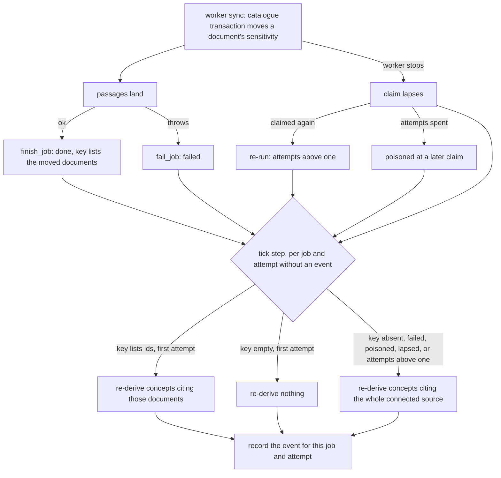

# A Sync Narrows the Concepts That Cite Its Documents - Plan

## Goal Capsule

- **Objective:** A concept is never visible more widely than the documents it cites, whether an Admin or a sync moved those documents. After a sync narrows a cited document, a reader the document now refuses stops finding the concept through `find`, Search, `open` and the map within a bounded time (R3). When a sync lifts a document back, its concepts widen again.
- **Means:** the sync's outcome names the documents whose sensitivity it moved (KTD1, KTD2). A platform step on the api's tick re-derives the concepts and write-ups citing them (KTD4 to KTD7, KTD9). That step and the five Admin actions share one concepts-slice cascade typed on `Principal` (KTD3).
- **Product authority:**
  - Linear BA-85 is authoritative for what this package delivers: its acceptance criteria are R1, R2, R5, R6 and R7's agreement line. R3, R4, R8 and R7's audit and decision-doc lines are the owner's confirmed scope.
  - `docs/plans/2026-10-08-2311-docs-architecture-review-before-s2-plan.md` (R5's WP10 row, R8, AE1 and its Key Decisions) is authoritative for why and when.
  - The owner confirmed this plan's scope on 09/10/2026, including the call-outs recorded as R3, R7 and KTD1.
- **Stop conditions:** stop and ask the owner in any of these cases:
  - Evidence that a Key Decision below cannot work.
  - The two contract stamps disagree after U3's fixture lands.
  - The probe (U1) passes on today's tree, which would mean the gap is not where the survey placed it.
  - The step needs a migration. The plan expects none (KTD5).
- **Execution profile:** two pull requests. The first carries U2 and is reversible. The second carries U1 and U3 to U8, and is not reversible because it adds a `contracts/` agreement the worker reads.
- **Who finishes:**
  - `ce-work` builds each unit.
  - `/ce-code-review` reviews each pull request before it opens.
  - `ce-commit-push-pr` opens each pull request, and the merge queue merges it when `check` is green.
- **Open blockers:** none.

---

## Product Contract

### Summary

The worker's sync names the documents whose sensitivity it moved in its index job's outcome, under a fourteenth tier agreement. A platform step on the api's 30-second tick reads each ended index job and re-derives the concepts and write-ups citing those documents. When the outcome cannot say what moved, the step re-derives the whole connected source. The four Admin actions BA-85 names, and the sensitivity override, use the same cascade function, now typed on `Principal`.

### Problem Frame

A concept's sensitivity is a stored column derived from the documents it cites (ADR 0044). Every writer of those documents' sensitivity must therefore re-derive the citing concepts. The Admin actions do: they cascade inside their own transaction. The worker's sync does not. `reconcile_catalogue` narrows a document on a special-category verdict, and lifts it back to the Admin's own narrowing once every narrowing finding is dismissed, and nothing re-derives the concepts afterwards. `find` filters on the stored row, so it lists the concept to readers the document now refuses. On a lift, the concept stays narrower than its evidence.

Nothing writes `concept_evidence` in production yet, so nobody is exposed today (see origin: Key Decisions, "Nothing outside this repository writes citations"). The owner chose to close the gap before the first block that writes citations, over the review's advice to defer it (see origin: Key Decisions, "The card 1 gap is fixed now, as WP10").

### Key Decisions

- **The gap is fixed now, beside S2a.** (session-settled: user-directed — chosen over deferring the fix to the block that first writes citations in production, which the review and the staff check recommended: the owner prefers closing a known visibility gap to relying on a reminder.) Governs R1 to R6.
- **Nothing outside this repository writes citations, so no data is repaired.** (session-settled: user-approved — chosen over a production row count before deciding: every concept came in through the repository's own import command, which writes no citations.) Governs R8.
- **The sync reports what it moved, as BA-85 asks.** (session-settled: user-approved — chosen over re-deriving the whole connected source after every sync, which needs no worker change and no new agreement: that cost grows with the number of concepts, and every Admin visibility change in the workspace waits behind it.) Governs R2.
- **A sync's narrowing closes on the tick, not in the sync's transaction.** (session-settled: user-approved — chosen over reading a concept's visibility at read time, which reopens ADR 0044: the derivation is the api's alone, and the worker calls nothing in the api.) Governs R3, R7.

### Requirements

**The gap closes**

- R1. After a sync narrows a document a concept cites, the concept, its map node and the write-ups including it carry the narrower visibility, and a reader the document refuses no longer reaches the concept through `find`, `open`, Search or the map. AE1.
- R2. The sync's outcome carries a key naming the documents whose sensitivity it narrowed or widened. The key is pinned in a `contracts/` agreement and read by both tiers' contract suites.
- R3. The visibility follows within one tick of the sync's index job ending, or of its claim lapsing, whichever comes first. A sync whose outcome cannot say what moved re-derives every concept citing its connected source. AE2, AE3.
- R4. After a sync lifts a document back, the concepts citing it widen to what their evidence now derives, except where a sensitivity override, the reconciler's Restricted floor or another cited document holds them. AE4.

**One cascade**

- R5. One concepts-slice cascade function, typed on `Principal`, takes the workspace's cascade lock, runs the caller's write and re-derives the concepts and write-ups the write reaches. Publish, narrow, widen, *narrow these documents* and the sensitivity override use it. The tick's step uses it under a platform principal. `openingACascadeOverHeldGroups` and `sources/cascade.ts` go.
- R6. The worker calls nothing in the api. The step runs on the api's tick and reads the sync's outcome from the job row.

**Records and docs**

- R7. Each index job the step handles leaves one platform audit event, which the audit log page renders as a routine sentence. ADR 0023, ADR 0039 and the glossary's *cascade* entry name the sync as the one writer whose cascade runs on the tick, with the bound R3 states. ADR 0031 lists the new agreement.
- R8. Index jobs that ended before the step first runs in a workspace are not replayed, except each connected source's newest one.

### Acceptance Examples

- AE1. **Covers R1.** **Given** a concept whose evidence cites an Internal document, and an Editor who is not a named member of any group, **when** a sync narrows that document to Restricted and the api's next tick runs, **then** `find` as that Editor does not return the concept. The test fails on today's tree. (see origin: AE1)
- AE2. **Covers R3.** **Given** a sync that narrows a document and then fails while landing passages, **when** the next tick runs, **then** every concept citing a document of that connected source is re-derived, and the narrowed one's concepts are Restricted.
- AE3. **Covers R3.** **Given** a sync that narrows a document and whose worker then stops, **when** its lease lapses and the next tick runs, **then** the concepts citing that connected source are re-derived without waiting for any worker to claim the job again.
- AE4. **Covers R4.** **Given** a document a sync narrowed, and an Admin dismissing every narrowing finding on it, **when** the dismissal's sync lifts the document and the next tick runs, **then** a concept citing only that document widens again, and a concept on the reconciler's floor stays Restricted.

### Scope Boundaries

- **Not in this package:**
  - Changing how the Admin actions behave. They keep cascading inside their own transaction.
  - Deriving a concept's visibility at read time (ADR 0044 stays).
  - Deriving evidence from a concept's `sources[]` (the trial survey's card 3). Evidence stays `concept_evidence` as written today, which the deferred question in the origin plan asked this plan to settle.
  - `landing.ts`'s write-up re-derivation after a governed write. It is a write, not a cascade, and runs under the reconciler already.
  - Redrawing `docs/architecture/`. BA-74 reads the origin plan's "What moved".
- **Considered and not built:**
  - A cap on the key's length. A rule-change, reindex or erasure sync can name every document of a source, and the outcome admits an unbounded list of ids. Build a cap that drops the key above a size, so the absent-key rule applies, if an outcome row is ever measured over a few hundred kilobytes.
  - A unique constraint behind the audit marker. Taking the cascade lock before the marker check serialises two api replicas (KTD6). Add the constraint, with its migration, if a test ever shows a duplicate event.
  - Running the step without a bundle store. The tick refuses to start without one today, and every deployment that syncs has one. Split the gate if a deployment ever runs syncs without a bundle store.
  - A note on the review page explaining that a lifted document's concepts widen on the next tick. The lag is under a minute and safe in direction.

### Dependencies / Assumptions

- **S2a** (`docs/plans/2026-10-09-1344-feat-s2a-search-and-concept-page-plan.md`) edits `packages/core/src/concepts/visibility.ts` (`evidencePaneOf`, `paneOf`) and `concepts/index.ts`, not the cascade functions. Whichever merges second rebases onto the first (see origin: Dependencies).
- **Postgres 18** (`packages/schema/src/postgres-image.ts`) lets the worker's UPDATE return a row's old and new sensitivity in one statement.
- **Index jobs on one connected source run one at a time** in practice: `claim_job`'s subject exclusion (`packages/schema/migrations/0035_the-job-subject-and-the-run-key-substrate.sql`) skips a subject with a live claim. It takes no lock on sibling rows, so the step does not rely on it for correctness (KTD5).

### Sources / Research

- The staff review and the survey, attached to BA-35: card 1 (the gap), card 22 (the hand-sequenced cascade), section 2's premise checks.
- `docs/solutions/architecture-patterns/adr-0023-graph-is-apache-age.md`, `adr-0039-audience-word-and-group-ids.md`, `adr-0044-chunk-visibility-is-read-not-copied.md`, `adr-0031-tier-contract-is-six-agreements.md`, `adr-0012-the-concept-write-path.md`, `adr-0043-what-an-act-is.md`, `adr-0029-apps-over-packages-capability-slices.md`.
- `docs/solutions/best-practices/a-race-test-held-late-or-released-in-turn-cannot-prove-a-lock-order.md` for U2's and U6's race tests.

---

## Planning Contract

**Product Contract preservation:** origin R8 and AE1 carried as R1 and AE1. BA-85's acceptance criteria map to R1, R2, R5, R6 and R7. R3, R4, R7's audit line and R8 come from the owner's confirmation of scope on 09/10/2026.

### Key Technical Decisions

- KTD1. **The key names exact moves; the api supplies the safety net.** The worker names a document when its stored sensitivity before the UPDATE differs from after it, NULL included. A retried sync finds nothing left to move, so the api treats four cases as "unknown" and re-derives the whole connected source: the key is absent (a worker from before the agreement), the job failed, the job was poisoned, or its attempts exceed one. A present, empty key means nothing moved. The rule lives in the agreement's fixture, so both tiers hold the same three meanings. "A retry finds nothing left to move" holds only because KTD9 stops a revoked claimant from writing. Governs R2, R3.
- KTD2. **A new fourteenth fixtured agreement, not a widened `queue`.** No outcome key is pinned in `contracts/` today: `restores_overridden_by_erasure` is spoken in code and tests only. The nearest model is `emptying-a-connected-source`, a one-fixture agreement each tier holds its own constant to. The fixture pins the key's name, the worker's move rule as cases of (stored sensitivity, `narrowed_to`, verdict, lifted) to named-or-not, and the api's reading of absent, empty and listed keys. Editing `queue` instead would move a SQL-function agreement's fixture for a fact that is not about claiming. Governs R2.
- KTD3. **The cascade takes the caller's write as a step, and the groups check moves into that step.** The function takes the advisory lock, runs the caller's write, then re-derives. The write returns a `Result`; a refusal skips the re-derivation. Narrow's groups check (`holdsEveryGroup`, Admin-only) runs inside its own write, still after the lock and before the `connected_source` row lock, which keeps today's lock order. An Admin caller still holds an `AdminUserPrincipal` from `requireAdmin` before it calls, so the cascade itself grants nothing. What to re-derive is either the concepts citing a connected source's documents, all of them or the named ones, or one concept, for the override. Write-ups follow inside the function, which ends the three hand-written copies of "concepts moved, so write-ups follow". Governs R5.
- KTD4. **The step lives in the concepts slice, reads jobs through the runs slice, and runs under its own platform actor.** ADR 0029 places a transaction in the slice that owns the action, and re-deriving visibility is the concepts slice's. `public.job` is the runs slice's table, so a new `Principal`-typed reader in `runs` hands the step its jobs, as the queue's boundary already does for the sources slice. The actor is a new `process:better-answers-…` constant beside `RECONCILER`, and the step is a declared platform action that admits before its first await (ADR 0043). Governs R5, R6.
- KTD5. **A job is handled when its audit event exists; a time bound only limits the scan.** The marker is one platform audit event per job and attempt, whose subject is the job. `finished_at` is stamped before the finishing transaction commits, so commit order is not stamp order, and a watermark alone could skip a job forever. The scan reads index jobs that ended, or whose claim lapsed, no earlier than a margin before the workspace's first event for the step's action, and skips those with an event. Bounding from that fixed baseline, not from the newest handled job, keeps a job the step keeps failing on in the scan until it is handled. A workspace with no event yet handles each source's newest ended job and any lapsed claim (R8). No migration: `audit_event`'s generated `subject_kind` and its `(workspace_id, subject_kind, subject_id)` index give the lookup. Governs R3, R7, R8.
- KTD6. **Inside each job's transaction: the cascade lock, then the marker check, then the cascade, then the event.** The tick takes no lock across api replicas, unlike the daily sweep. Under READ COMMITTED, a second replica's marker check runs after the first replica's transaction releases the lock, and sees its event. Any other order double-processes and double-records. Governs R7.
- KTD7. **The step runs after the reconciler in the same tick, and each failure stays where it happened.** `apps/api/src/reconciler.ts`'s tick wraps each step in its own `attemptResult`, so neither stops the other. Inside the step, a refused or thrown job is logged and skipped, later jobs and other workspaces still run, and the next tick retries it. A connected source removed since the sync is nothing to do, not a refusal: the re-derivation reads `concept_evidence`, not the source's row. A pass that skipped any job reports failure to the tick's dead-man ping, so a job that keeps failing reaches the scheduler alert, not only the log. Governs R3.
- KTD9. **A sync's catalogue write is fenced on a live claim.** `keeping_alive` (`apps/worker/src/better_answers_worker/queue.py`) lets a sync run on after its lease is lost, and `reconcile_catalogue` commits without checking the claim. A revoked claimant could then narrow a document after the step has handled that attempt, and poisoning does not raise `attempts`, so no later event would cover it. The catalogue transaction therefore locks its own job row `FOR SHARE` and writes nothing unless the claim is still this worker's, `claimed` and unexpired. The step locks a lapsed job's row `FOR UPDATE` before re-deriving it, so it waits for a catalogue write in flight, and no revoked claimant can write after it. `worker_rt` and `app_rt` already hold `UPDATE` on `public.job`, so no migration or grant is needed. Governs R3.
- KTD8. **The probe is written first, against what today's tick runs.** AE1 must fail on today's tree, and today's tick runs only `reconcileEveryWorkspace`. U1 writes the probe to run that pass and watches it fail, then U6 points it at the step. Governs R1.

### High-Level Technical Design

How a sync's move reaches the concepts, and what the step does with each kind of job.



The cascade function, as the Admin actions and the step share it. Directional only:

```text
cascade(principal, tx, target, write):
  take the workspace's cascade lock
  result = write(tx)          # an Admin's: lock the source row, check, update, record
  if result refused: return it
  concepts = target is one concept ? [it] : concepts citing target's documents, ordered by IRI
  re-derive each concept (index row, map node), keeping the reconciler's floor
  re-derive the write-ups including them
  return result with what moved
```

The step's write is the marker check, with the event recorded once the re-derivation returns.

### Sequencing

U2 is a behaviour-preserving refactor and lands first, in its own reversible pull request. U1 is written before any of U3 to U7 and is observed failing. U3, U4 and U5 land together: the worker's contract test reads U4's functions and the api's reads U5's reader, and both read U3's fixture. The order of the worker and api halves at release does not matter for safety: an api without U6 ignores the key, and a step that meets an outcome without the key re-derives the whole source (KTD1).

---

## Implementation Units

### U1. The probe: a sync's narrowing reaches `find`

- **Goal:** a failing core test that shows the gap on today's tree, which later units make pass.
- **Requirements:** R1; AE1; KTD8.
- **Dependencies:** none.
- **Files:**
  - Create: `packages/core/test/sync-cascade.test.ts`
- **Approach:**
  1. Seed with the factories in `packages/core/test/sourced-concept.ts`: a published connected source holding one Internal document, a concept citing it (`conceptCiting`), and an Editor who is a member of no group.
  2. Narrow the document the way a sync does: set its `sensitivity` to Restricted and seed a `done` index job whose outcome names it (`seededBy` with `seed.job`). Today the outcome key does not exist, so the seeded outcome carries the name U3 will pin.
  3. Run what today's tick runs, `reconcileEveryWorkspace(RECONCILER, …)`, then call `find` as the Editor.
- **Execution note:** run the test before any other unit and record that it fails on the concept being returned. U6 repoints step 3 at the new step.
- **Patterns to follow:** `packages/core/test/visibility.test.ts`'s "narrows to named groups; an outside Viewer loses the concept"; `packages/core/test/reconciler.test.ts` for calling a tick pass from core.
- **Test scenarios:**
  - Covers AE1. After the sync's narrowing and one tick, `find` as an Editor outside every group returns no match for the concept's title.
  - The same run leaves the concept's `concept_index` row, its `map_node` and a write-up including it Restricted (`visibilityHeld`).
- **Verification:** the test fails on today's tree for the reason above, and passes once U6 lands.

### U2. One cascade typed on `Principal`

- **Goal:** the five Admin paths call one concepts-slice function that takes the lock, runs their write and re-derives concepts and write-ups, and a platform principal can call it.
- **Requirements:** R5; KTD3.
- **Dependencies:** none.
- **Files:**
  - Modify: `packages/core/src/concepts/visibility.ts` (the new function; `openingACascadeOverHeldGroups` removed; `writeOverride` moved onto it)
  - Modify: `packages/core/src/concepts/index.ts` (the face)
  - Modify: `packages/core/src/sources/index.ts` (`sensitivityAskedOf`, `sensitivitySet`)
  - Modify: `packages/core/src/sources/connected-source.ts` (`publishConnectedSource`, `publishAndCascade`)
  - Modify: `packages/core/src/sources/review.ts` (`narrowDocuments`)
  - Delete: `packages/core/src/sources/cascade.ts`
  - Test: `packages/core/test/visibility.test.ts`, `packages/core/test/review.test.ts`
- **Approach:**
  1. Build the function on `serialisingCascades`, `recomputeVisibilitySourcedFrom`, `recomputeConceptVisibility` and `recomputeWriteUpsIncluding`, which already take `Principal`. Keep the IRI order and `restsAlsoOnItsReconcilerHit`.
  2. Move each caller's row lock, check, update and `record` into the write it passes. Narrow's `holdsEveryGroup` goes inside its write, after the advisory lock and before `connected_source`'s `FOR UPDATE`.
  3. Each action's answer and audit events stay as they are.
- **Execution note:** behaviour-preserving. The existing describes in `visibility.test.ts` (narrowing, publishing, widening, narrowing documents, overriding) and `review.test.ts`'s "cascades only from concepts citing the narrowed documents" stay unchanged and green before any new case is added.
- **Patterns to follow:** `packages/core/src/sources/reindex.ts` for a platform principal running core work under `withScope`.
- **Test scenarios:**
  - A platform principal runs the cascade over a connected source's documents under `withScope`, and the citing concept's row and node take the derived visibility.
  - Two cascades from two sources one concept cites, one an Admin narrowing and one under a platform principal, both succeed with no `40P01`. The test holds both at the first `concept_index` UPDATE and releases them together, beside "serialises narrowings of two sources one concept cites, never deadlocking".
  - A narrowing to a group the Admin does not hold is refused, and no concept is re-derived.
  - An override still re-derives its one concept and the write-ups including it, and records one `knowledge.concept.class_overridden` event.
- **Verification:** `cascade.ts` and `openingACascadeOverHeldGroups` are gone, nothing outside the concepts slice sequences lock, write and cascade by hand, and every existing visibility and review test passes unchanged. Probe the IRI sort with `pnpm mutant-probe` (`docs/agents/mutation-triage.md`): the new race test kills a mutant that drops it.

### U3. The agreement: what a sync's outcome says it moved

- **Goal:** both tiers hold one fixture for the key's name, the worker's move rule and the api's three readings.
- **Requirements:** R2, R7; KTD1, KTD2.
- **Dependencies:** none for the fixture. Its two contract tests read U4's and U5's functions, so the three land together.
- **Files:**
  - Create: `contracts/sync-sensitivity-moves/cases.json`
  - Modify: `contracts/manifest.json`
  - Modify: `packages/core/test/tier-contract.test.ts`, `apps/worker/tests/test_tier_contract.py` (`SPOKEN_AGREEMENTS`)
  - Create: `packages/core/test/sync-sensitivity-moves.contract.test.ts`, `apps/worker/tests/test_sync_sensitivity_moves_contract.py`
  - Modify: `packages/schema/src/contract-stamp.ts`, `apps/worker/src/better_answers_worker/contract_stamp.py` (regenerated)
  - Modify: `docs/solutions/architecture-patterns/adr-0031-tier-contract-is-six-agreements.md`
- **Approach:**
  1. Write the fixture first: the key `sensitivity_moved` (a list of document ids), the move cases (Internal and a Restricted verdict, named; already Restricted and a Restricted verdict, not named; lifted to a NULL `narrowed_to`, named; lifted to an equal `narrowed_to`, not named), and the reading cases (absent: whole source; empty: nothing; ids: those documents).
  2. Add the two `SPOKEN_AGREEMENTS` entries and one contract test per tier. Each tier holds its own code to the fixture: the worker's `reconcile_catalogue` and `as_row`, and the api's outcome reading from U5.
  3. Regenerate both stamps after the fixture edit, never before. Reword no other fixture, because wording alone moves the digest.
  4. Edit ADR 0031's title, its list and its History in the same commit. Its filename stays.
- **Execution note:** the contract tests are written against U4's and U5's functions, so they land in the same pull request.
- **Patterns to follow:** `contracts/emptying-a-connected-source/cases.json`, `packages/core/test/emptying-a-connected-source.contract.test.ts`, `apps/worker/tests/test_emptying_a_connected_source_contract.py`.
- **Test scenarios:**
  - Each move case, run through the worker's real UPDATE on Postgres, names the document exactly when the fixture says so.
  - Each reading case, run through the api's reader, yields whole source, nothing or the listed ids as the fixture says.
  - The manifest's form for the new entry matches the disk, and the two stamps match (`packages/schema/test/contract-digest.test.ts`).
- **Verification:** both tiers' `check` pass with the new digest, and ADR 0031 says fourteen.

### U4. The worker names what it moved

- **Goal:** every index job's outcome carries `sensitivity_moved`, listing exactly the documents whose stored sensitivity its catalogue write changed.
- **Requirements:** R2, R3, R6; KTD1, KTD9.
- **Dependencies:** U3.
- **Files:**
  - Modify: `apps/worker/src/better_answers_worker/pipeline/catalogue.py` (`reconcile_catalogue` returns the moved ids)
  - Modify: `apps/worker/src/better_answers_worker/pipeline/run.py` (`IndexOutcome`, `as_row`, `index_connected_source`, the claim fence)
  - Modify: `apps/worker/src/better_answers_worker/kinds.py` (`sync` hands the claimed job to `index_connected_source`)
  - Test: `apps/worker/tests/test_pipeline_index.py`
- **Approach:**
  1. `reconcile_catalogue`'s UPDATE returns the old and new sensitivity (Postgres 18's `RETURNING old.…, new.…`). A document counts when the two are distinct, NULL included.
  2. `IndexOutcome` gains the field with an empty default. `as_row` always emits it, so the no-source early return reports an empty list, not an absent key.
  3. The catalogue transaction opens with KTD9's fence on the job row. A claim no longer live rolls the transaction back and ends the sync with an error, writing no sensitivity.
- **Patterns to follow:** `restores_overridden_by_erasure` in `run.py` and its assertions in `test_pipeline_index.py`.
- **Test scenarios:**
  - A sync whose verdict narrows an Internal document to Restricted lists that document, and a second document it reconciles unchanged is not listed.
  - A dismissal's sync that lifts a document to a NULL `narrowed_to` lists it.
  - A sync over an already-Restricted document with a Restricted verdict lists nothing, and the key is present and empty.
  - A sync that finds no connected source emits the key empty.
  - A sync whose lease lapsed before its catalogue write, or whose job another worker has claimed since, moves no document's sensitivity.
- **Verification:** the job row's outcome, read back after a real sync, carries the key as above.

### U5. The runs slice hands the step its jobs

- **Goal:** a `Principal`-typed read of a workspace's index jobs that the step has still to handle, with each job's reading of the key.
- **Requirements:** R3, R6, R8; KTD1, KTD4, KTD5.
- **Dependencies:** U3.
- **Files:**
  - Modify: `packages/core/src/runs/index.ts` (the reader and the key's reading)
  - Test: `packages/core/test/runs.test.ts`
- **Approach:**
  1. Select index jobs that are done, failed or poisoned, or claimed with a lapsed lease, within KTD5's scan bound, with the job's connected source (`subject_id`), status, attempts and outcome. The caller passes the bound in.
  2. Offer the step a way to lock one lapsed job's row `FOR UPDATE` (KTD9), so `job` stays read and locked only through the runs slice.
  3. Read the key into one of: the listed documents, nothing, or the whole source, by KTD1's rule.
  4. Leave the marker anti-join to the step, which owns the audit lookup (U6).
- **Patterns to follow:** `latestIndexOutcomeIn` and `inWorkspace` in `runs/index.ts`; `outcomeOf` for the outcome's shape.
- **Test scenarios:**
  - A done job on its first attempt with ids reads as those ids, and with an empty key reads as nothing.
  - A done job with attempts above one, a failed job, a poisoned job, a claimed job with a lapsed lease, and a done job without the key each read as the whole source.
  - A queued job and a claimed job with a live lease are not returned.
  - A platform principal under `withScope` reads only its workspace's jobs.
- **Verification:** the reader is the only code outside `runs` that learns what an index job's outcome says.

### U6. The step: the tick re-derives what a sync moved

- **Goal:** one pass per workspace that handles each index job and attempt without an event, re-derives what it moved, and records the event.
- **Requirements:** R1, R3, R4, R5, R7, R8; AE1 to AE4; KTD4 to KTD7, KTD9.
- **Dependencies:** U2, U4, U5.
- **Files:**
  - Create: `packages/core/src/concepts/sync-cascade.ts` (the actor, the declared action, the pass)
  - Modify: `packages/core/src/concepts/index.ts` (the face)
  - Modify: `apps/web/src/features/people/audit-sentences.ts` (the sentence)
  - Test: `packages/core/test/sync-cascade.test.ts`, `packages/core/test/audit-actions.test.ts`, `packages/core/test/cross-tier-document.test.ts`
- **Approach:**
  1. Declare the actor beside `RECONCILER` and a platform action whose subject is the job (`declareActions("platform", …)`).
  2. Per workspace, find the bound (KTD5's baseline: the workspace's first event for the action, less the margin), list jobs through U5, and drop those whose event exists for that attempt. On a workspace with no event yet, keep each source's newest ended job and any lapsed claim (R8).
  3. Per job, open one `withScope` transaction and run U2's function: its write takes the lapsed job's row lock when the claim has lapsed (KTD9), then the marker check (KTD6). Its target is the key's documents or the whole source, and the event is recorded with the count of documents and concepts moved, ids and counts only.
  4. Log and skip a job that refuses or throws, keep going, and report the skip in the pass's summary (KTD7).
  5. Repoint U1's probe at this pass.
- **Patterns to follow:** `reconcileEveryWorkspace` and `alreadyLanded` in `packages/core/src/concepts/reconciler.ts`; `RECONCILER_ACTIONS` in `concepts/reconciler-hit.ts`; `cross-tier-document.test.ts`'s `runWorkerOnce` for a real worker run.
- **Execution note:** test-first, from U1's probe outward.
- **Test scenarios:**
  - Covers AE1. U1's probe passes.
  - Covers AE1. With a real worker run (`runWorkerOnce`) that narrows a cited document on a special-category verdict, then one pass, `find` as the Editor misses the concept. This proves the key comes from `reconcile_catalogue`, not only from a seeded outcome.
  - Covers AE2. A failed job whose catalogue write narrowed a document re-derives every concept citing the source.
  - Covers AE3. A claimed job with a lapsed lease is handled with no worker running. When it is later claimed again and finishes, its new attempt is handled too.
  - Covers AE3. On a job's last attempt, a worker whose lease lapsed mid-sync cannot narrow a document after the pass has handled that attempt, and once the job is poisoned no concept is left wider than its evidence.
  - A job whose handling throws stays in the scan while later jobs on another source are handled, and is handled on the first pass after it stops throwing.
  - Covers AE4. A lift widens a concept citing only that document, and in the same pass a concept on the reconciler's floor stays Restricted, an overridden concept keeps its override, and a concept also citing a still-Restricted document stays Restricted.
  - A done job with an empty key re-derives nothing and records its event.
  - Two passes in a row record one event per job and attempt, and the second pass re-derives nothing.
  - Two passes run at once on the same job, as from two api replicas, record one event.
  - A job that commits with an earlier `finished_at` than one already handled is handled on the next pass.
  - On a workspace with no event, a job that ended before the first pass is skipped unless it is its source's newest.
  - A job whose connected source was removed before the pass records its event and throws nothing, and other sources and workspaces are handled.
  - A pass racing an Admin's *narrow these documents* on the same concept, both held at the first `concept_index` UPDATE and released together, ends with both ok and the narrower visibility.
  - The new action has a sentence, and the audit log page renders an event whose subject is a job.
- **Verification:** every scenario passes on real Postgres; the audit log shows one routine line per handled sync.

### U7. The tick runs the step

- **Goal:** the api's 30-second tick runs the step after the reconciler, with each step's failure contained.
- **Requirements:** R3, R6; KTD7.
- **Dependencies:** U6.
- **Files:**
  - Modify: `apps/api/src/reconciler.ts` (`tick`, its summary and logging)
  - Test: `apps/api/tests/reconciler.test.ts`
- **Approach:** call the step after `reconcileEveryWorkspace`, each wrapped in its own `attemptResult`, and log the step's summary at the level the reconciler's uses (debug when nothing moved, info when something did, warn on a skipped job). The ping fails when a step's pass throws as a whole, or when the step skipped any job (KTD7).
- **Patterns to follow:** the existing `tick` and `summaryOf` in `apps/api/src/reconciler.ts`.
- **Test scenarios:**
  - A tick after a seeded narrowing sync re-derives the citing concept.
  - A reconciler pass that throws still lets the step run, and the reverse.
  - An overlapping tick is still skipped.
  - A tick whose step skipped a job reports failure to the ping, and the reconciler's own result does not change that.
- **Verification:** the api's reconciler tests pass, and a local stack shows the step's summary line in the api's log after a sync.

### U8. The decision docs and the glossary say where a sync's cascade runs

- **Goal:** ADR 0023, ADR 0039 and the *cascade* entry stop saying every narrowing re-derives synchronously.
- **Requirements:** R7.
- **Dependencies:** U6.
- **Files:**
  - Modify: `docs/solutions/architecture-patterns/adr-0023-graph-is-apache-age.md`
  - Modify: `docs/solutions/architecture-patterns/adr-0039-audience-word-and-group-ids.md`
  - Modify: `CONCEPTS.md` (*cascade*)
- **Approach:**
  1. In each ADR, keep the synchronous rule for every Admin action and name the worker's sync as the one writer whose cascade runs on the api's next tick. Give the window a reader sees: from the sync's catalogue write, through the rest of the sync, to one tick after its job ends or its claim lapses (R3). ADR 0023's "A queued recompute reopens the leak" gains the reason this exception is accepted: the worker cannot run the derivation, and passages are hidden at once through the read-through view (ADR 0044). Add a dated History paragraph to each.
  2. The *cascade* entry adds the sync's tick-run cascade beside the Admin actions, in the glossary's own register.
  3. Land these in the commit that wires U7, and say so in the pull request.
- **Test expectation:** none -- docs only; `pnpm check:docs` and the words test cover them.
- **Verification:** no live doc says a sync's narrowing re-derives inside the sync's transaction, and `pnpm check:docs` passes.

---

## Verification Contract

| Gate | Command | Proves |
| --- | --- | --- |
| Core tests | `pnpm check:core:suite` | U1, U2, U5, U6 and the TypeScript contract test, on real Postgres |
| Worker tests | `pnpm check:worker` (the worker's `uv run --frozen check`) | U4 and the Python contract test |
| Api tests | `pnpm check:api` | U7 |
| Contract stamps | `pnpm --filter @better-answers/schema run generate:contract-stamp` and `uv run --directory apps/worker --frozen generate-contract-stamp`, then each tier's `check` | the two digests match after U3 |
| Gates and docs | `pnpm check:gates`, `pnpm check:docs` | lint, import direction, audit sentences, the glossary and ADR edits |
| Whole tree | `pnpm check` | CI's arbiter |
| Mutation | `pnpm mutant-probe` on the IRI sort and on KTD1's reading | the race test and the reading cases constrain them |

---

## Definition of Done

- Every unit's verification holds, and U1's probe passes.
- `sources/cascade.ts` and `openingACascadeOverHeldGroups` are gone, and the five Admin paths and the step call one cascade function.
- Both contract stamps match, ADR 0031 lists fourteen agreements, and ADR 0023, ADR 0039 and *cascade* describe the tick-run exception.
- The second pull request's body ends with `Merge risk: not reversible, a contracts/ agreement the worker reads` and `Fixes BA-85`. The first's ends with `Merge risk: reversible, behaviour-preserving refactor` and `Related to BA-85`.
- No abandoned attempt, debug log or unused helper is left in the diff.
