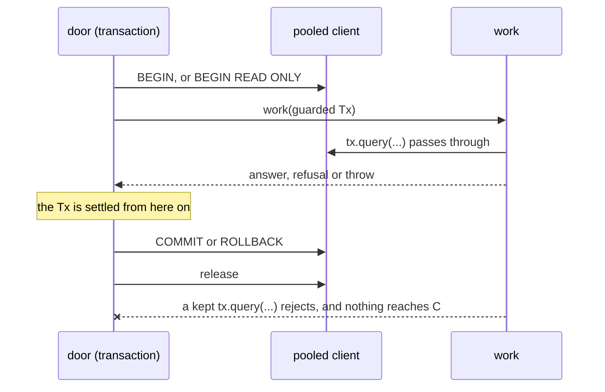

# A Settled Tx Refuses, and the Read Doors Open Read-Only - Plan

## Goal Capsule

- **Objective:** Work that keeps a `Tx` past its transaction fails loudly instead of running a statement outside any transaction, on a connection another request may hold. A read door's work cannot write.
- **Means:** `transaction` hands work a `Tx` whose `query` refuses once the work settles (KTD1, KTD2). The identity set's read door and the member's unheld door open `BEGIN READ ONLY` (KTD3).
- **Product authority:**
  - Linear BA-83 is authoritative: its four acceptance criteria are R1 to R4.
  - `docs/plans/2026-10-08-2311-docs-architecture-review-before-s2-plan.md` (R4's decisions 13 and 14, R5's WP8 row) is authoritative for why.
- **Stop conditions:** stop and report to the lead if any of these holds:
  - A caller of `withIdentityRead` or `withMemberUnheld` turns out to write, which decision 14 says keeps the door read-write.
  - The guard cannot be typed without a type assertion, or needs `Tx`'s exported type to change.
  - A suite outside `packages/core/test/principal.test.ts` fails because work used its `Tx` after settling. That is a real leak to report, not a test to loosen.
- **Execution profile:** one pull request, reversible.
- **Who finishes:** `ce-work` builds; `/ce-code-review` reviews; `ce-commit-push-pr` opens the pull request. The lead merges.
- **Open blockers:** none.

---

## Product Contract

### Summary

Every Postgres door's work receives a `Tx` that answers until the work settles and refuses every query after. `withIdentityRead` and `withMemberUnheld` open their transactions read-only, so a write inside either fails at its own statement. The query road through `withPrincipal` stays as it is. This plan records in writing why it cannot open read-only today.

### Problem Frame

A door hands its work the pooled client itself. If work returns something that queries later, as S2b's plan · draft · record stream could, the query runs after the door's `COMMIT` or `ROLLBACK`, outside any transaction. Once the client is back in the pool, it may run inside another request's transaction, under that request's workspace scope. Nothing fails, so the leak would go unseen (survey 06/10 card 1, survey 08/10 card 33).

`withIdentityRead` is the same transaction as `withIdentityWrite` under a reading name, and `withMemberUnheld` is `withMember` without the row hold. Neither stops its work from writing (decision 14).

### Requirements

**The settled `Tx`**

- R1. Every door's `Tx` refuses a query made after its transaction settles, by commit or rollback. A real-Postgres test in `packages/core/test/principal.test.ts` keeps a `Tx` past the settle and asserts the refusal, and fails on today's tree. AE1, AE2.

**The read doors**

- R2. Every caller of `withIdentityRead` and `withMemberUnheld` is read for writes, the multi-line bodies included. The findings are recorded in this plan's Read-Door Probe.
- R3. Because no caller writes, both doors open `BEGIN READ ONLY`, and a test shows a write inside either failing at its statement. AE3.

**The query road**

- R4. Whether `withPrincipal` could open read-only is answered in writing, in this plan's Query-Road Probe, on BA-83, and in a Triage issue for the owner. Nothing on that road changes here.

### Acceptance Examples

- AE1. **Covers R1.** **Given** work that answers an object whose method queries through the work's `Tx`, **when** the door commits and the method is then called, **then** the query rejects with the settled refusal, and nothing it would have run reaches Postgres.
- AE2. **Covers R1.** **Given** work that keeps its `Tx` and then throws, **when** the door has rolled back and the kept `Tx` queries, **then** the query rejects with the same refusal.
- AE3. **Covers R3.** **Given** a write inside `withIdentityRead`'s work, or inside `withMemberUnheld`'s, **then** the door rejects with SQLSTATE `25006` (`read_only_sql_transaction`) raised by that statement, not by the commit. **And** the same write through `withIdentityWrite`, or through `withMember`, lands.

### Scope Boundaries

- **Not in this package:**
  - The type and the lint that keep a returned iterable from closing over a `Tx`. S2b's plan owes them (decision 13).
  - Any change to `withPrincipal`, the tRPC query road or the MCP surface (decision 14, R4).
  - `withSessionLock` and `withSessionTryLock`. They hand work no `Tx`.
  - A pg cursor or stream submitted before the settle and read after it. Its reads bypass `query`, so the guard does not see them. S2b's type and lint own that shape (decision 13).
  - `packages/core/src/store/map/index.ts`'s own `Tx` alias. It names the same pooled client type and opens no transaction.
- **Coordination:** S2a's U6 (`feat/s2a-u6-boundary-mcp`) touches `answering/`, `concepts/read.ts`, `apps/api/src/mcp/entries` and `surface.ts`. This plan edits none of them. Whichever merges second rebases.

### Read-Door Probe

All sixteen callers read only. None takes a row lock, which a read-only transaction also refuses.

| Caller | What its work runs |
| --- | --- |
| `workspaces/confirming.ts:346` `readParkedAuthenticatorSecret` | `SELECT value FROM verification` |
| `workspaces/operator.ts:200` `operatorAddresses` | `SELECT email FROM "user"` |
| `workspaces/index.ts:349` `personIdByEmail` | `personByEmail`: one `SELECT` on `"user"` |
| `workspaces/index.ts:566` `workspacesHeldBy` | `SELECT workspace_id FROM member` |
| `workspaces/index.ts:586` `workspaceIds` | `SELECT id FROM workspace` |
| `workspaces/index.ts:606` `workspaceIdByShortName` | `SELECT id FROM workspace` |
| `workspaces/second-factor.ts:437` `readOfThePerson` | `reading` and `credentialsOf`: `factsOf`, `passkeysOf`, `waitsOf` (`confirm-throttle.ts` `ROWS`), `thisSessionOf`, `addressOf`, all `SELECT` |
| `workspaces/passkey-confirm.ts:110` `readPasskeyCredentials` | `SELECT … FROM passkey` |
| `erasure/rehearsal.ts:328` `rehearseErasure` | `SELECT id FROM "user"`. Its write runs later, under `withPrincipal` |
| `members/accepting.ts:197` `readInvitation` | `judged(…, "read")`: `invitationHeld` with no `FOR UPDATE`, then `inviteeOf` |
| `members/accepting.ts:252` `readOpenInvitations` | `openTo`: `waitingTo`, then `judged(…, "read")` per invitation |
| `members/accepting.ts:262` `workspaceOfInvitation` | `SELECT workspace_id FROM invitation` |
| `members/test-workspace.ts:235` `standingOf` | `WORKSPACE_BY_SHORT_NAME`, `PEOPLE_STANDING`, `membersOf`, `invitedTo` |
| `members/test-workspace.ts:397` `membersEnsured` | `membersOf` |
| `members/audit-export.ts:214` `exportAuditLog` | `readForExport`: `eventsAsked`, `eventsNamed`, both reads. The export's audit record is written afterwards, under `withMember` |
| `apps/api/src/auth/sign-in-link.ts:119` `readALink` | `READ_A_LINK`: one `SELECT` on `verification` |

`withMemberUnheld` resolves its member through `MEMBER_QUERY`, which holds no row, and scopes with `set_config`, which a read-only transaction allows.

### Query-Road Probe

`withPrincipal` cannot open read-only today. Two callers write inside its transaction, and S2b's `ask` is to record under it too.

- **The MCP gate writes on every request.** `apps/api/src/mcp/surface.ts:167` runs `consumeCall` inside `withPrincipal`, and `countForWorkspace` (`packages/core/src/store/postgres/index.ts`) deletes old windows and upserts `mcp_call_counter`.
- **The erasure rehearsal writes.** `packages/core/src/erasure/rehearsal.ts:341` runs `recordSubjectRequest` under `withPrincipal`: an `INSERT INTO subject_request` and its audit event.
- **S2b's `ask` records under it.** Decision 13 leaves where plan · draft · record is composed to S2b's brainstorm.
- **Every tRPC query procedure reads only.** `queryProcedure` (`apps/api/src/trpc/base.ts:238`) serves `session.member`, `modelChoices.list`, `sources.list`, `sources.findings`, `sources.preview`, `runs.ofSubject`, and `members.list`, `auditLog`, `activity`, `invitations`, `invitationCounts`, `groups` and `requests`. No middleware inside that transaction writes. `auth/routes.ts:201` (`workspaceNameOf`) and the resolve-only callers (`ownTransactionProcedure`, `principalOf`, `principalOfMember`) read only too.

So a read-only query road would be a second resolver for `queryProcedure` alone, with the MCP surface and S2b's `ask` left read-write. That is a decision the owner takes. A Triage issue carries it, and this package changes nothing on that road.

### Sources / Research

- The staff review, the staff check and the survey board, attached to BA-35: card 1 (06/10), card 33 (08/10), decisions 13 and 14 with their corrections.
- PostgreSQL's `SET TRANSACTION` documentation: a read-only transaction refuses `INSERT`, `UPDATE`, `DELETE`, `MERGE`, `COPY FROM` on non-temporary tables, and DDL. `SELECT … FOR UPDATE/SHARE` is refused too, because it asks for `UPDATE` permission. The SQLSTATE is `25006`.

---

## Planning Contract

**Product Contract preservation:** BA-83's four acceptance criteria are R1 to R4, unchanged.

### Key Technical Decisions

- KTD1. **The guard lives in `transaction`, so every door gets it.** `transaction` hands its work a guarded `Tx` instead of the pooled client, and `withScope`, `resolveScoped` and `withOperator` run their own statements through it. Only `BEGIN`, `COMMIT` and `ROLLBACK` use the raw client. The settled flag lives in the guard's closure, never on the client, because the pool reuses the client. Governs R1.
- KTD2. **The `Tx` closes when the work settles, before `COMMIT` or `ROLLBACK` is sent.** If it closed after the commit, a late query could still reach the connection between the commit and the release, and run autocommitted. Closing when the work settles covers commit, refusal-rollback and thrown-rollback alike. Governs R1.
- KTD3. **The guard proxies `client.query` itself, so `Tx` keeps its type.** A `Proxy` over the pooled client's `query` function has that function's type, pg's overloads included, so it satisfies `Pick<pg.PoolClient, "query">` with no type assertion. Its target is `client.query.bind(client)`, since `bind` keeps the overloads and the unbound method fails `typescript/unbound-method`. Its `apply` trap rejects once settled and otherwise forwards to the target, in a form that passes `anti-slop/no-reflect-apply` and the overloads' argument types. Narrowing `Tx` to one signature was rejected: `@better-answers/schema`'s probes and the map door take the overloaded type, and the type is S2b's to change (decision 13). Governs R1.
- KTD4. **The refusal is a rejected promise carrying an `Error`, not a `Result`.** Querying a settled `Tx` is a programming error, like any failed statement. It rejects as a failed query does, so `await` sites and `attempt` wrappers treat it the same way. Governs R1.
- KTD5. **`transaction` takes how it opens.** `withIdentityRead` and `withMemberUnheld` pass `BEGIN READ ONLY`, and every other door keeps `BEGIN`. `withMemberUnheld` carries it through `withMemberQuery` and `resolveScoped`. `withPrincipal` shares `MEMBER_QUERY` but stays read-write, so read-only is its own parameter, not implied by the query. Governs R3.

### High-Level Technical Design

The guarded `Tx`'s life inside one door. Directional only:

---

## Implementation Units

### U1. A settled `Tx` refuses

- **Goal:** every door's work receives a `Tx` that refuses once the work settles.
- **Requirements:** R1; AE1, AE2; KTD1 to KTD4.
- **Dependencies:** none.
- **Files:**
  - Modify: `packages/core/src/store/postgres/index.ts`
  - Test: `packages/core/test/principal.test.ts`
- **Execution note:** write the tests first and watch them fail on today's tree. Today a kept `Tx`'s query succeeds.
- **Approach:** a small guard function beside `transaction` returns the guarded `Tx` and a way to settle it. `transaction`'s `work` parameter takes a `Tx`. `withScope`, `resolveScoped` and `withOperator` pass that `Tx` to `scopeTo`, their resolving query and their work. The refusal message says the transaction has settled and that the query reached no connection.
- **Patterns to follow:** the `transaction` door's own `commit` error message for wording; `principal.test.ts`'s `DOORS` and `through` for running one scenario through each door.
- **Test scenarios:**
  - Covers AE1. Each of the three doors in `DOORS`, plus `withIdentityRead`: work answers an object with a method that queries `SELECT 1` through the kept `Tx`. After the door answers, calling the method rejects with the settled refusal.
  - Covers AE2. Work keeps its `Tx` and throws. After the door rejects, the kept `Tx`'s query rejects with the same refusal.
  - Work runs two branches under `Promise.all`. One throws after its first query, and the other queries again once its first query answers. The second branch's later query rejects with the settled refusal. This is the shape of `openTo` in `members/accepting.ts`, whose sibling branches today can query after the door has rolled back.
  - A query made by the work itself, before it settles, still answers. The existing suite covers this; no new test is needed.
- **Verification:** the new tests fail on today's tree and pass after; `packages/core`'s full suite passes, showing no exercised path queries after settling.

### U2. The read doors open read-only

- **Goal:** `withIdentityRead` and `withMemberUnheld` open `BEGIN READ ONLY`.
- **Requirements:** R2, R3; AE3; KTD5.
- **Dependencies:** U1, which reshapes `transaction`.
- **Files:**
  - Modify: `packages/core/src/store/postgres/index.ts`
  - Test: `packages/core/test/principal.test.ts`
- **Approach:** add the opening parameter to `transaction` and thread it through `withMemberQuery` and `resolveScoped`. Rewrite `withIdentityRead`'s comment, which says nothing stops its work from writing, and drop the `jscpd:ignore` pair now that the two doors differ. `withMemberUnheld`'s comment says it is read-only.
- **Patterns to follow:** the suite's sanctioned writers, so no raw `INSERT` enters the test: `record` with the suite's `IDENTITY_PROBE` action for the identity set, and `configProbeWritten` for a workspace.
- **Test scenarios:**
  - Covers AE3. An identity-set audit record inside `withIdentityRead`'s work rejects with code `25006`. The same record through `withIdentityWrite` lands.
  - Covers AE3. `configProbeWritten` inside `withMemberUnheld`'s work rejects with code `25006`. The same write through `withMember` lands.
  - Each rejection is asserted before anything else. The error carries a `code`, which the commit's own "did not commit" `Error` does not, so the test shows the statement failed.
- **Verification:** the new tests pass; `packages/core` and `apps/api` suites pass, showing no caller of either door writes.

### U3. The query-road answer reaches the owner

- **Goal:** the Query-Road Probe is on BA-83, and the owner has a Triage issue to decide on.
- **Requirements:** R4.
- **Dependencies:** none.
- **Approach:** comment on BA-83 with the probe's answer and a link to this plan. File a Triage issue in the better-answers project for a read-only resolver for `queryProcedure`, related to BA-83, naming the three writers that keep `withPrincipal` read-write.
- **Test expectation:** none -- tracker writes.
- **Verification:** BA-83 carries the comment, and the new issue sits in Triage.

---

## Verification Contract

| Gate | Command | Proves |
| --- | --- | --- |
| Core | `pnpm --filter @better-answers/core run check` | U1, U2, on real Postgres; no other work keeps its `Tx` |
| Api | `pnpm check:api` | `sign-in-link.ts` and the api's doors under the guard and read-only |
| Gates | `pnpm check:gates` | lint, format, insert-scan, table ownership, jscpd, knip |
| Docs words | `pnpm check:docs:api` | this plan uses no retired glossary word |
| Mutation | the `mutation-testing` skill scoped to `packages/core/src/store/postgres/index.ts`, read by `docs/agents/mutation-triage.md` | the settled flag and the opening word are pinned by tests |

---

## Definition of Done

- U1's and U2's tests pass, and U1's failed on today's tree before the change.
- Both read doors open read-only, and every other door still opens `BEGIN`.
- BA-83 carries the query-road answer, and a Triage issue holds the owner's decision.
- The pull request body ends with `Merge risk: reversible, a behaviour change` and `Fixes BA-83`.
- No abandoned attempt, debug log or unused helper is left in the diff.
