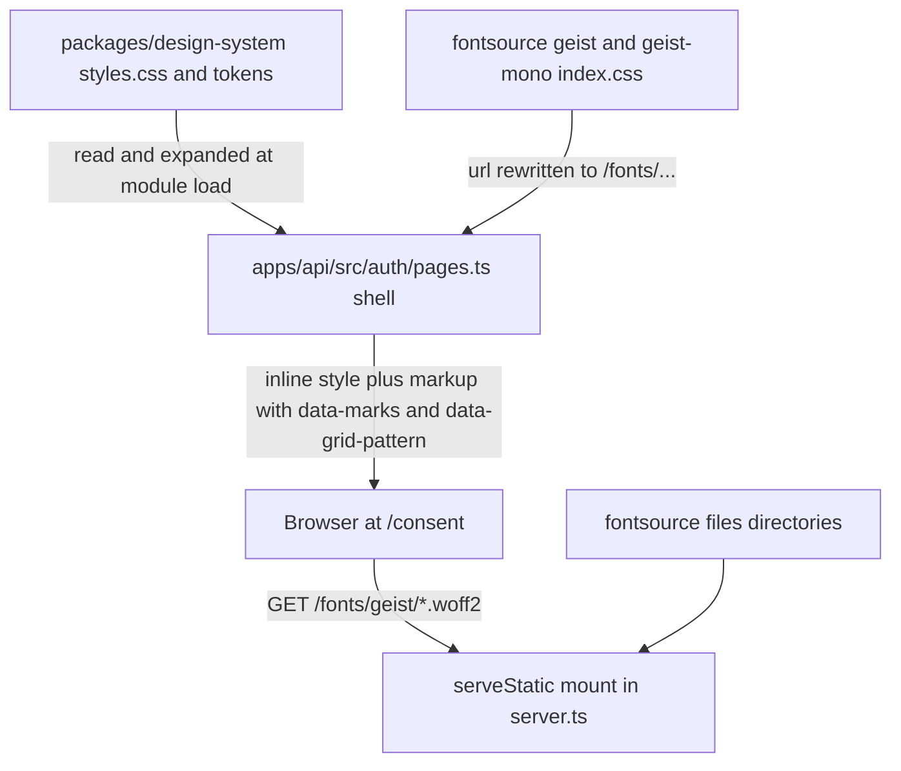

# The Consent Page in the Design System - Plan

## Goal Capsule

- **Objective:** a person connecting Claude meets a consent page that looks like the rest of better-answers: the same face, colours, square corners, card, grid and primary button as the sign-in pages they have just used. It is the first page of the assistant connection, so it sets trust for the whole flow.
- **Means:** the api inlines the design system's own stylesheet and draws the page in its semantic tokens, with the faces served from the api (KTD1, KTD2, KTD3).
- **Product authority:** Linear BA-102 is authoritative: its acceptance criteria are R1 to R4. The finding is F34 in `docs/dogfood-reports/2026-10-09-ba-36-screen-review.md`, with `docs/dogfood-reports/2026-10-09-ba-36-screen-review-assets/f34-consent.png`. `packages/design-system/readme.md` §4 is the visual specification, and `AuthPage` in `apps/web/src/features/auth/auth-page.tsx` is the layout to match.
- **Stop conditions:** stop and report to the lead in either case:
  - The page can only be drawn by moving it into the SPA. ADR 0034 keeps consent server-rendered on the product's origin.
  - Drawing it needs a change to `packages/design-system/tokens/semantic.css` or another token file, which BA-98 is editing.
- **Execution profile:** one worktree, one pull request; the browser suite runs on a spare port.

---

## Product Contract

### Summary

The api's consent page, and the two refusal pages that share its shell, are redrawn from the design system's stylesheet and tokens: Geist and Geist Mono, the light surfaces, square corners, one marked card on the grid substrate, an accent primary and an outline secondary. The page's words keep their meaning, with a typographic apostrophe in "company’s".

### Problem Frame

`/consent` is the one page of the OAuth flow the api draws itself, outside the SPA's shell (ADR 0034). Its inline stylesheet predates the design system: a system sans, a green rounded Connect, a rounded Cancel, a bare centred column, and a straight apostrophe. Every person who connects Claude sees it straight after the redrawn sign-in pages (#669), so it reads as a different product at the moment trust matters most.

### Requirements

**Look**

- R1. The consent page draws every colour, size, face and corner from the design system: Geist for text, Geist Mono for the product name, square corners, the accent fill on the primary button.
- R2. Its layout matches the other sign-in pages: the grid substrate, the logo and product name top left, one marked card centred at the prose measure, the heading in the card's header, and the actions in a row with one primary and one outline button.
- R3. Its words use typographic quotes and apostrophes only.

**Behaviour**

- R4. The consent flow's browser spec still passes: connect, ask again, and cancel.
- R5. The refusal pages that share the shell (`refusedPage`, `signInPage`) are drawn the same way.

### Scope Boundaries

- The page stays drawn by the api on the product's origin. Moving it into the SPA is out of scope (ADR 0034).
- The dark theme is out of scope. The SPA sets `data-theme` itself and never from the OS, so the consent page draws the light theme. Today's page follows the OS colour scheme; that stops.
- The consent page's words and their order are unchanged except the apostrophe.
- Considered and not built: a long-lived cache header on the faces. The SPA's own assets carry none, and the consent page is met once per connection. Evidence that would change this: a measured repeat load of the faces on the connection path.

### Deferred to Follow-Up Work

- The consent page follows the dark theme once BA-98 lands one the SPA can switch to. File as a Triage issue.

---

## Planning Contract

### Key Technical Decisions

- KTD1. **The api inlines the design system's stylesheet rather than linking the SPA's build.** At module load, `pages.ts` reads `packages/design-system/styles.css` through the package's `exports` map, the way it already reads the logo, and replaces each `@import "./tokens/x.css"` line with that file's text. An inline `<style>` cannot resolve those relative imports itself: the browser would ask `/tokens/x.css` and get the Better Auth catch-all. The page then gets the tokens, the `data-marks` rule and the `data-grid-pattern` rule from the same file the SPA imports. Rejected: linking the SPA build's hashed Tailwind stylesheet and writing Tailwind classes in the api's HTML. Tailwind emits only the utilities `apps/web/src` uses, so the page would hold only while the SPA happened to keep the same classes, and no test would catch a dropped one. The tokens are the package's contract; the SPA's utility output is not.
- KTD2. **The page's own rules name only tokens the inlined files declare.** `tailwind-bridge.css` is not on the page, so its names (`--primary`, `--border`, `--background`, `--radius`) are undefined there. Surfaces, text, lines and controls come from `semantic.css`: `--surface-page`, `--surface-card`, `--text-*`, `--border-subtle`, `--border-default`, `--control-primary-*` and `--control-secondary-*`. Sizes come from `--space-*`, `--text-*`, `--radius-*` and `--measure-prose`. The one literal is the `md` breakpoint at 48rem, which is Tailwind's default and in no token; it carries a comment. Marks and grid are drawn by setting `data-marks` and `data-grid-pattern` attributes, never by copying the rules. The element carrying `data-grid-pattern` or `data-marks` sets `background-color`, never the `background` shorthand: the page's rules are unlayered and would beat the layered pattern rule, and the shorthand resets `background-image`.
- KTD6. **The page draws the states the bridge draws for the SPA.** The bridge's focus rule is not on the page, so the page's rules give its buttons and links `outline: none` and `box-shadow: var(--focus-ring)` at `:focus-visible`. Connect takes `--control-primary-bg-hover` and `-active` on hover and press, and Cancel the `--control-secondary-bg-*` steps, matching `Button`'s `default` and `outline` variants.
- KTD3. **The api serves the two faces from the fontsource packages the design system already depends on.** `fonts-hosted.css` imports `@fontsource-variable/geist` and `geist-mono` by package name, which only a bundler resolves. `pages.ts` inlines each package's `index.css`, with `url(./files/` rewritten to `/fonts/geist/` and `/fonts/geist-mono/`. The api mounts those two paths with `@hono/node-server`'s `serveStatic` over each package's `files` directory, resolved from the design-system package. The mount sits in `server.ts` before the Better Auth catch-all; the hostname fence's `/*` entry on `app` already carries it. Rejected: base64 faces in the page, about 75 KB on every consent page with no cache; and the SPA build's hashed font files, which couples to Vite's naming.
- KTD4. **The primary carries `data-marks` and is unmarked by the card.** The card registers; `styles.css`'s nesting rule suppresses the button's marks inside it, as `AuthPage` does ("the card's marks stand for its primary button's"). The button still names `--mark-ink: var(--accent-300)` so it is the primary's treatment wherever it stands.
- KTD5. **The runtime image carries the stylesheet.** `apps/api/Dockerfile` copies `styles.css` and `tokens/` beside the logo, and the image probe names `styles.css` among what the api reads. Its comments that say the api never loads the faces are corrected.

### High-Level Technical Design

### Risks

- BA-98 is editing tokens. The page reads `semantic.css` through `styles.css`, so a renamed semantic token breaks the page silently. A browser check that paints a token and compares cannot catch this, because an undefined token paints the same initial value on both sides. U1's test that every custom property the page's rules read is declared in the inlined stylesheet is what catches it.
- A token file that gains a nested `@import` would ship unexpanded. U1's test fails on any `@import` left in the inlined stylesheet.

### Assumptions

- The SPA never sets `data-theme` from the OS, so the sign-in pages are light for everyone today.
- The consent page's CSP stays `frame-ancestors 'none'` only, so an inline `<style>` and same-origin faces need no CSP change.

---

## Implementation Units

### U1. The shell draws from the design system's stylesheet

- **Goal:** `pages.ts` builds one stylesheet at module load from `styles.css`, its expanded token imports, the two faces' `@font-face` rules and the page's own token-only rules, and the shell's markup carries the card, the grid and the button row.
- **Requirements:** R1, R2, R3, R5; KTD1, KTD2, KTD4, KTD6.
- **Dependencies:** none.
- **Files:** `apps/api/src/auth/pages.ts`, `apps/api/tests/product-name.test.ts`, a new `apps/api/tests/auth-pages.test.ts`.
- **Approach:**
  1. Resolve and expand `styles.css` as KTD1 says; resolve the fontsource packages from the design-system package and inline their `index.css` with the URL rewrite of KTD3.
  2. Rewrite the shell: the grid on the page wrapper, the header with the logo and the mono product name, `main` holding one marked card with the `h1` in its header and the body in its content.
  3. The consent body's two forms sit in one row; Connect is the primary, Cancel the outline.
  4. `CONSENT_WORDS.scopes["knowledge:read"]` takes "company’s".
- **Patterns to follow:** `AuthPage`, `Card`, `Button` and `GridPattern` in `apps/web/src` for structure and spacing; the `LOGO` read for resolving a package file.
- **Test scenarios:**
  - The consent page's stylesheet contains no `@import`, and contains the `data-marks` rule and the `--surface-page` token.
  - Every `var(--name)` the page's own rules read is declared somewhere in the inlined stylesheet.
  - The stylesheet's `@font-face` rules point at `/fonts/geist/` and `/fonts/geist-mono/`, never at `./files/`.
  - The consent page's card carries `data-marks`, and its Connect button carries `data-marks`.
  - Every word the consent and refusal pages show has no straight quote or apostrophe.
  - The product-name test still finds the logo beside the name in each page's header.
- **Verification:** the api's tests pass with the new file.

### U2. The api serves the faces

- **Goal:** `/fonts/geist/*` and `/fonts/geist-mono/*` answer the fontsource files on the product's hostname.
- **Requirements:** R1; KTD3.
- **Dependencies:** U1, for the resolved directories.
- **Files:** `apps/api/src/server.ts`, `apps/api/src/auth/pages.ts` or a small module beside it, `apps/api/tests/auth-pages.test.ts`.
- **Approach:** mount before the catch-all, read-only, on the product hostname only, as `serveSpa`'s assets are.
- **Patterns to follow:** `serveSpa` in `apps/api/src/ingress/spa.ts`.
- **Test scenarios:**
  - A GET of the Latin Geist file under `/fonts/geist/` answers 200 with a woff2 body.
  - A GET of a name that is not in the package answers what the catch-all answers today, not a file.
- **Verification:** the faces load on `/consent` in the browser with no failed request.

### U3. The browser proves the page shares the system

- **Goal:** `consent.spec.ts` follows the apostrophe and proves the look the acceptance criteria name.
- **Requirements:** R1, R2, R3, R4.
- **Dependencies:** U1, U2.
- **Files:** `apps/web/e2e/consent.spec.ts`.
- **Approach:** reuse `drawnMarks` and `tokenPainted` from `apps/web/e2e/locators.ts`; add no new helper unless one is shared.
- **Test scenarios:**
  - The consent page draws one mark set, the card's.
  - The heading's computed font family starts with Geist.
  - Connect's background paints `--control-primary-bg` and is not transparent, and its corners are square.
  - Tabbing to Connect paints `--focus-ring` as its box shadow.
  - Cancel carries the outline treatment: a hairline border and the page's surface.
  - At 320 pixels wide the page does not scroll sideways.
  - The existing connect, ask-again and cancel tests pass with "company’s".
- **Verification:** the consent spec passes on a spare port, with the accessibility gate.

### U4. The image carries what the page reads

- **Goal:** the runtime image ships `styles.css` and `tokens/`, and its probe names `styles.css`.
- **Requirements:** R1 in production; KTD5.
- **Dependencies:** U1.
- **Files:** `apps/api/Dockerfile`, `apps/api/tests/image.test.ts`.
- **Approach:** copy the two paths beside the logo; correct the comments that say the api reads the logo alone and never loads the faces.
- **Test scenarios:**
  - The image probe resolves `@better-answers/design-system/styles.css`.
- **Verification:** the image test passes where Docker is available; elsewhere it skips, as it does today.

---

## Verification Contract

| Gate | Command | Proves |
| --- | --- | --- |
| api | `pnpm check:api` | U1, U2, U4's probe list |
| gates | `pnpm check:gates` | lint, words, anti-slop over the diff |
| docs | `pnpm check:docs` | this plan |
| browser | the consent spec through Playwright on port 3231 with an uncommitted config copy | U3 |
| eye | screenshots of `/consent`, a refusal page and `/sign-in` side by side at desktop and 320px | R2 by sight |

## Definition of Done

- R1 to R5 hold, each proved by a U-ID's scenario or the screenshots.
- The four gates above are green on the pushed head.
- No abandoned approach is left in the diff.
