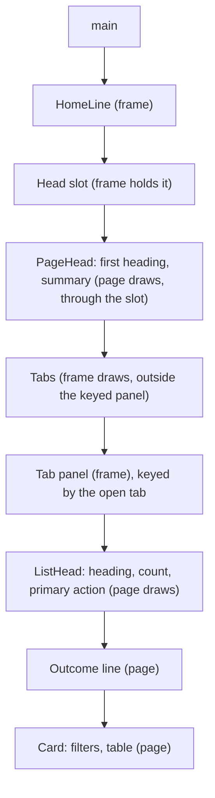
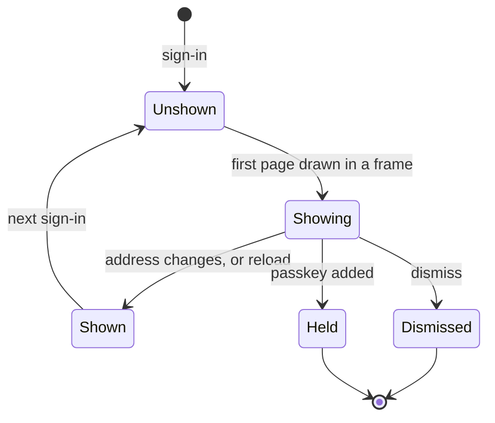

# Page Heads, Rows and Words From the Screen Review - Plan

## Goal Capsule

- **Objective:** a person opening any Control Centre or Console page reads where they are, how many, and what they can do, in that order. A member's page and the Audit log say each thing once. The second-factor setup page shows one primary at a time. Every word the SPA shows uses typographic apostrophes and quotes.
- **Means:** one shared page head that each page draws and the frame places above the tabs (KTD1, KTD2), one shared address part (KTD8), and a test that holds the typography (KTD12).
- **Product authority:** the acceptance criteria of Linear BA-103, BA-105, BA-106 and BA-121, then the owner's ruling in BA-105's comment of 09/10/2026, then this plan. The findings are F4, F5, F9, F10, F13, F14, F17, F20, F21, F29 and F35 in `docs/dogfood-reports/2026-10-09-ba-36-screen-review.md`. `packages/design-system/readme.md` §3 and §4 are the voice and the register.
- **Stop conditions:** stop and report to the lead if the head cannot draw above the tabs without the frame drawing a page's first heading, if the journeys need more than a locator's change, or if a change is needed under `apps/web/src/features/knowledge/` beyond U10's apostrophes.
- **Execution profile:** one pull request for the four issues, a commit per unit, U10's pass over `apps/web/src/features/knowledge/` last and in a commit of its own. Reversible: no migration, no `contracts/` file, no stored data and no email. The body closes `Fixes BA-103`, `Fixes BA-105`, `Related to BA-106`, `Fixes BA-121`.
- **Who finishes:** `ce-work` builds it, `/ce-code-review` reviews it, and `ce-commit-push-pr` opens the pull request with `babysit:off`. The lead queues the merge.
- **Open blockers:** none. One criterion of BA-106 is left open on purpose (KTD11).

---

## Product Contract

### Summary

Every Control Centre and Console page opens with one head: its heading, then its tabs where it has them, then one row holding the list's count and the page's primary action. The passkey offer draws once per sign-in. A member's page shows the role and the groups once, the Audit log draws an event on one line, an address wraps at `@` or `.`, and the three Console lists share one search and table pattern. The setup page collapses the passkey form when the authenticator opens, and the workspace chooser's foot matches the other sign-in pages. A test refuses a straight apostrophe or quote in any shown word.

### Problem Frame

BA-36's review of every built page scored consistency 1 of 4. Three findings share one cause: the frame draws a grey row of tabs and actions above `main`, and each page draws its own first heading inside it. So Members reads tabs, a count, *Invite a person*, then "People", then "Members" again, then the count again in another noun (F9). Groups has no such row and opens differently (F10). The count beside the tabs stays "8 members" on Invitations and Requests (F17). The passkey offer sits above all of it on every page until dismissed, and takes three or four lines at 390px (F21).

The rest is density and repetition. An audit event is about 90px tall and repeats its family on every row (F13). A member's page shows the role three times, and its disabled primary names the role the member already holds (F14). Addresses break mid-word at 390px (F20). Names waiting carries Everyone's description, and the three Console lists are built three ways (F29). The setup page shows two accent primaries at once (F4), and its passkey field is labelled "Name" beside a button of another height (F5). The chooser's foot holds only *Account* (F35). The sign-in page and nine word tables still write a straight apostrophe (BA-121).

### Requirements

**One head (BA-103)**

- R1. People, Sources, Models, System and the Console's pages read in one order: heading, then count, then the page's primary action, with tabs in the same place on every page that has them.
- R2. Each count is said once, in one noun, by the tab or list it counts.
- R3. A row that opens a sheet looks like a row that opens something.
- R4. The passkey offer draws once per sign-in, on the first page drawn after it, and never on Account. Dismissing it still ends it for good.

**Dense rows (BA-105)**

- R5. An audit event takes one line at rest, with its detail one disclosure away. The family filter says the family, and no row carries a family pill.
- R6. A member's role and groups are each shown once, where they are changed.
- R7. A disabled primary's label never names the current state as the change.
- R8. No card on a member's page or a group's sheet shows an empty band above its text.
- R9. An address wraps at `@` or `.`, never inside a word, and reads as the same text to a screen reader and to a spec.
- R10. Each Console page carries its own description, and the three Console lists share one search and table pattern.
- R11. A member's page says "Sign-ins and personal tokens", in its section heading and its Access row.
- R12. An activity line on a member's page says in plain words whether the member acted or was acted on.

**Setup and chooser (BA-106)**

- R13. Choosing the authenticator on the setup page collapses the passkey form, so one primary shows.
- R14. The passkey field's label says what it names, and the field and its button share a height.
- R15. The chooser's foot carries the same actions as the other sign-in pages.

**Words (BA-121)**

- R16. No shown word in `apps/web/src` carries a straight apostrophe or quote.
- R17. A test fails when a word table or a page's own text brings one back.
- R18. Every browser spec and journey that reads those words still reads them.

**Held throughout**

- R19. Every changed page passes the accessibility gate in light and in dark, draws at most three registration marks, and keeps every keystroke it has today.
- R20. A journey that walks a changed page holds, and changes in this pull request where the page moved what it reads.

### Acceptance Examples

- AE1. **Covers R1.** Given an Admin on Members, when the page draws, then the reading order is the heading "People", its summary, the tabs, "8 members", *Invite a person*, the list. Given the same Admin on Groups, then it is "People", its summary, the heading "Groups", "4 groups", the list.
- AE2. **Covers R1, R2.** Given the Invitations tab is open, then no "Members" count shows anywhere, and the row under the tabs says the invitations' own count.
- AE3. **Covers R4.** Given a Viewer holding no passkey signs in and reaches Ask, then the offer shows. When they open another page or reload, then it does not. When they sign out and in again, then it shows once more. When they dismiss it, then it never shows again.
- AE4. **Covers R5.** Given two Admins both named Sam Okoro each made a group, then each event's line shows that Admin's address before any detail is opened. Given no two actors in the events shown share a name, then no line shows an address at rest.
- AE5. **Covers R7.** Given Amara is an Editor and Editor is picked, then the disabled primary reads "Change role". When Viewer is picked, then it reads "Make Amara Okafor a Viewer" and is enabled.

### Key Decisions

- **"Sign-ins and tokens" is the glossary's *Personal tokens*.** (session-settled: user-directed — chosen over treating an assistant's tokens as a second sense that keeps the bare word: the owner ruled on 09/10/2026 that the member page writes the reader word, in the heading and the Access row.) Governs R11.
- **The first heading stays the group's name.** `landedAtHome`, every spec and every journey read a page's first heading as its group's name. Only its place in the reading order changes. Governs R1.
- **The count belongs to the open tab's list, not to the head's tab row.** A count beside the tabs is wrong on two tabs of three, so each list says its own. Governs R2.
- **The offer is kept, and quietened to once per sign-in.** BA-103 allows the Account page alone or once per session. An Editor or Viewer who never opens Account would never learn a passkey exists, so the offer stays. The owner may overturn this for Account alone. Governs R4.
- **The address at rest stays where two actors share a name.** `apps/web/e2e/audit-log.spec.ts` holds that two members of one name are told apart before a detail opens. Moving every address into the details would break that, so the line carries one only when it is needed. Governs R5.
- **The role beside each workspace is not built here.** No read carries it (KTD11). BA-106 stays open on that one criterion.

### Scope Boundaries

- Sources and Models change their head only. Their words, Review and Widen are BA-104's.
- Requests' and Groups' lists are not rebuilt. BA-49 rebuilds them on the shared list parts and reuses `ListHead`. Groups' create form stays in its card.
- `apps/web/src/features/knowledge/` takes U10's apostrophes and nothing else. Its Search page keeps drawing its own first heading inline, which reads the same on a page with no tabs.
- `apps/web/e2e/harness.ts`, `apps/web/e2e/locators.ts`, `apps/web/e2e/browser.ts` and `apps/web/e2e/accessibility-gate.spec.ts` are the `suite-consent` agent's. A new locator is added without reshaping what is there, and the gate is not changed.
- `apps/web/src/shared/navigation.ts`, `apps/web/src/app/router.tsx`, `apps/web/src/app/words.ts` and `apps/web/src/app/jump-to.tsx` are edited by S2a. This plan edits only the lines it needs in them: Connected sources' entry in `router.tsx`, which loses its toolbar (U2), one summary in `navigation.ts` (U8), and apostrophes (U10).
- Considered and not built: a test that refuses a page's first heading drawn outside `PageHead`. Search draws its own today and this change may not edit it. Evidence that would change the call: Search adopting `PageHead` once S2a merges.
- Considered and not built: removing the api's `dismissPasskeyOffer`. The dismissal is still used.

#### Deferred to Follow-Up Work

- The role beside each workspace on the chooser: a new tRPC read of a person's workspaces with their role in each, over a `packages/core` slice, then the row. Filed in Linear Triage as its own issue.
- Search and the concept page adopt `PageHead` after S2a merges.
- BA-104 and BA-49, as above.

---

## Planning Contract

### Key Technical Decisions

- KTD1. **Each page draws its own head through `PageHead`, into a slot the frame holds.** `PageHead` in `apps/web/src/shared/page-head.tsx` draws the first heading and the summary. Inside a frame it draws them through a portal into a slot the frame holds in `main`, above the tabs. With no frame around it, it draws in place. The frame keeps drawing the tabs outside the keyed tab panel, now inside `main` under the slot and without the grey band. Two alternatives were rejected:
  - *The frame draws every first heading from the place.* It would double Search's heading in a file this change may not edit, take a detail page's heading away from it, and give a failed page two first headings.
  - *The page draws the tabs.* A tab list inside its own keyed panel loses focus on every arrow key and goes when the page throws, which `apps/web/test/toolbar.test.tsx` and `apps/web/e2e/failed-page.spec.ts` hold against.
- KTD2. **`ListHead` carries the list's heading, count and primary action, and the toolbar keeps tabs only.** `ListHead`, in the same file, draws the list's second-level heading, a description where the page gives one, then one row holding its count as an `output` and the page's primary action at the far end. Where an open tab already names the list, the heading is visually hidden and stays the region's name and its focus target. `PageToolbar.actions` goes, and *Invite a person* and *Connect a document* move to that row. An action drawn in a tab's row is drawn again when the tab changes, which only resets a closed dialog. The view-state slot stays: Review's parts on Connected sources still share it.
- KTD3. **The recorded decision moves in the commit that moves the code.** U1's commit rewrites `CONCEPTS.md`'s *toolbar*, *tab*, *top band* and *view-state slot* entries and adds a dated amendment to `docs/solutions/architecture-patterns/adr-0047-the-platform-is-surfaces-groups-and-screens.md` for the tabs and the actions. U4's commit adds the amendment's sentence on the passkey offer. The browser-suite skill does not name the toolbar today, so it changes only if a helper's description moves, and then through `ce-skill-work`.
- KTD4. **The offer's "shown" mark is kept on the browser beside the session memory, and each sign-in forgets it.** `apps/web/src/features/auth/session-memory.ts` holds it in `localStorage`, so a second tab of the same sign-in stays quiet. The three places that announce a sign-in clear it. The offer draws only while the address is the one it first drew on, so moving on hides it without a reload. The api's dismissal is unchanged.
- KTD5. **An event's line is its time, its sentence and an inline *Details* disclosure.** The family pill goes. The actor's address joins the line only where the events shown hold two actors of one display name, and is always in the details through `byLine`. Rejected: an address on every line, which wraps to a second line at 390px and repeats on every row.
- KTD6. **The Role card and the Groups card are the one place each is shown.** The header's role pill and the Access summary's Role and Groups rows go. Joined and the sign-ins row stay. The Role card's primary reads "Change role" while the picked role is the held one.
- KTD7. **The empty band is measured before it is closed.** The likely cause is an empty live region taking a row of the card's grid gap. It is closed by taking the empty region out of the gap or hiding it visually while empty, never with `display: none`, which would drop the region from the accessibility tree (BA-38's F33).
- KTD8. **One `Address` part writes `<wbr>` after `@` and after each `.`.** A zero-width space would change `textContent` and break every spec that reads an address. The part replaces `wrap-anywhere` wherever an address draws.
- KTD9. **The Console's lists are `FilterRow` over `GridTable`.** Everyone's labelled field becomes the row's search. Every workspace becomes a table that keeps its one disclosure. The People group's summary in `apps/web/src/shared/navigation.ts` describes the group, and Everyone and Names waiting each give `ListHead` their own description.
- KTD10. **On setup, the authenticator and the passkey form are one choice.** Opening the authenticator collapses the passkey form to its name, and closing it opens the form again. The passkey field and its button take one control height.
- KTD11. **No read answers a person's role in each workspace.** The chooser and the band's switcher list workspaces through Better Auth's organization list, which carries no role. A new procedure belongs in `apps/api` over `packages/core`, where another agent is working, so it is follow-up work.
- KTD12. **A vitest test scans the words, with a named allow-list for code.** It reads string literals, template literals and JSX text under `apps/web/src`, and refuses a straight apostrophe or double quote in text a person reads. Selectors, keys and other code strings are told apart by rule where one exists and by a short named list where none does.

### High-Level Technical Design

The reading order inside `main`, and who draws each part:

The passkey offer's states for a person holding no passkey:

### Assumptions

- The rest of the member page's shown text follows R11's word: the button, its hint, the outcome sentence and the keystroke's action name say *personal token* too. The ruling names two places. The owner may hold it to those two.
- The Console is inside R1 though BA-103 names People, Sources, Models and System. R10 already brings its pages onto one pattern.
- "Passkey name" is the label R14 asks for. The owner may prefer other words.
- The chooser's foot is *Account*, *Sign out* and *Keyboard shortcuts*, as `apps/web/src/features/auth/no-workspace-page.tsx` draws them.

### Deferred to Implementation

- Where Every workspace's disclosure draws inside a table row.
- What closes the empty band, once it is measured (KTD7).
- The activity marker's final words (R12).
- The shape of the apostrophe test's allow-list (KTD12).

### What the Owner May Overturn

- The toolbar keeps tabs only, and a page's primary action sits on its list's row (KTD2).
- The passkey offer once per sign-in, not on Account alone (KTD4).
- An address at rest only where two actors share a name (KTD5).
- The header's role pill and the Access summary's Role and Groups rows going (KTD6), and "Change role" as the resting label.
- The four assumptions above.
- BA-106 left open on the role beside each workspace (KTD11).

### Risks

- **The slot is empty on the frame's first draw.** A head drawn through a portal waits one render for the slot. A spec that reads the first heading waits for it already. U1 proves the frame's first draw shows no second heading and no shift a person can see.
- **A sweep that proves nothing.** BA-114's test checks every target between the band and `main`. With the tabs inside `main` and the offer rarer, fewer targets sit there. U1 keeps a target in its path or moves its assertion to the tabs inside `main`, and shows it red once.
- **The list budget.** `apps/web/e2e/people.spec.ts` holds Members' list to one second. This change adds no read.
- **Duplicated head code.** `jscpd` refused BA-97 on repeated import runs. Each page calls the two shared parts and copies nothing.
- **The rebase with S2a.** One line of `navigation.ts` and the apostrophes in files S2a edits. Whichever pull request merges second rebases.
- **Budgets under load.** A latency-budget or timeout failure is run again alone on untouched code before it is called real, and the report says so.

---

## Implementation Units

| Unit | What | Main files | After |
| --- | --- | --- | --- |
| U1 | The shared head and the frame | `apps/web/src/shared/page-head.tsx`, `apps/web/src/app/frame.tsx`, `apps/web/src/app/toolbar.tsx` | none |
| U2 | People, Sources, Models and System adopt it | `apps/web/src/features/people/`, `apps/web/src/features/sources/connected-sources-page.tsx`, `apps/web/src/app/pages/models-and-spend-page.tsx` | U1 |
| U3 | The group row's cue | `apps/web/src/features/people/groups-page.tsx`, `apps/web/src/shared/grid-table.tsx` | none |
| U4 | The passkey offer | `apps/web/src/features/auth/passkey-offer.tsx`, `apps/web/src/features/auth/session-memory.ts` | U1 |
| U5 | The audit log's rows | `apps/web/src/features/people/audit-log-page.tsx`, `apps/web/src/features/people/event-days.tsx` | U2 |
| U6 | The member page | `apps/web/src/features/people/member-sections.tsx`, `apps/web/src/features/people/member-page.tsx` | U2 |
| U7 | Addresses | `apps/web/src/shared/address.tsx` | U5, U6 |
| U8 | The Console | `apps/web/src/features/console/` | U1, U7 |
| U9 | Setup and the chooser | `apps/web/src/features/auth/setup-page.tsx`, `apps/web/src/features/auth/choose-workspace-page.tsx` | none |
| U10 | Apostrophes and their test | every word table under `apps/web/src`, `apps/web/test/typographic-words.test.ts` | U2 to U9 |
| U11 | The journeys, the screenshots and the checks | `apps/web/journeys/` | U1 to U10 |

### U1. The shared head and the frame

- **Goal:** a page can draw its heading above the frame's tabs, and a list can draw its heading, count and action on one row.
- **Requirements:** R1, R19. AE1.
- **Dependencies:** none.
- **Files:**
  - create `apps/web/src/shared/page-head.tsx`
  - modify `apps/web/src/app/frame.tsx`, `apps/web/src/app/toolbar.tsx`, `apps/web/src/shared/page-toolbar.tsx`
  - modify `CONCEPTS.md`, `docs/solutions/architecture-patterns/adr-0047-the-platform-is-surfaces-groups-and-screens.md`
  - test: create `apps/web/test/page-head.test.tsx`; modify `apps/web/test/toolbar.test.tsx`, `apps/web/test/frame.test.tsx`, `apps/web/e2e/frame.spec.ts`, `apps/web/e2e/failed-page.spec.ts`
- **Approach:**
  1. `PageHead` and `ListHead` as KTD1 and KTD2 state them. `PageHead` takes the group, and a ref for a page that sends focus to its first heading.
  2. The frame holds the slot inside `[data-page-content]`, after `HomeLine`, and draws the tabs under it as a line of tabs with one hairline beneath, at the page's width.
  3. `PageToolbar` loses `actions`, and `isFilled` asks only for tabs. The slot tests in `toolbar.test.tsx` keep their meaning by drawing their reader beside the panel rather than through the toolbar.
  4. The glossary and the ADR as KTD3 states.
  5. The failed page, the not-found page, Account and Search keep drawing their own first heading in place. A tabbed page that throws still shows its tabs above the failure's heading, as today.
- **Execution note:** write the frame spec's new reading order first and watch it fail on the grey band.
- **Patterns to follow:** `OpenTabProvider` and `ViewStateSlot` in `apps/web/src/shared/page-toolbar.tsx` for a part a page reaches from under the outlet; `BreadcrumbLastPartSlot` for a slot the frame holds.
- **Test scenarios:**
  - A tabbed page reads its first heading before its tab list. On Models and spend the heading "Models" precedes the tab list in the document, and both are inside `main`.
  - A thrown page keeps its tabs. A page that throws under an open tab still shows the tab list, and picking the other tab draws that tab afresh.
  - Arrow keys keep focus in the tabs. Right arrow from the first tab focuses and opens the second.
  - A head with no frame draws in place. `PageHead` drawn alone shows its heading and summary where it stands.
  - A list's heading is hidden where a tab names it. `ListHead` under an open tab keeps a second-level heading in the accessibility tree and shows none to the eye.
  - No target sits half under the band after the skip link, with the tabs inside `main`. The existing sweep still fails when the rule it guards is removed.
  - The frame's first draw shows one first heading and no page without one.
- **Verification:** `frame.spec.ts`, `failed-page.spec.ts`, `toolbar.test.tsx` and `frame.test.tsx` pass, and the gate passes on Models and spend in both themes.

### U2. People, Sources, Models and System adopt the head

- **Goal:** every Control Centre page opens in R1's order and says each count once.
- **Requirements:** R1, R2, R19. AE1, AE2.
- **Dependencies:** U1.
- **Files:**
  - modify `apps/web/src/features/people/members-page.tsx`, `members-tab.tsx`, `invitations-tab.tsx`, `requests-tab.tsx`, `groups-page.tsx`, `member-page.tsx`, `audit-log-page.tsx` (all under `apps/web/src/features/people/`)
  - modify `apps/web/src/features/sources/connected-sources-page.tsx`, `apps/web/src/app/pages/models-and-spend-page.tsx`
  - modify `apps/web/src/app/router.tsx`: Connected sources' entry loses its toolbar, which held only the action
  - test: modify `apps/web/e2e/people.spec.ts`, `people-invitations.spec.ts`, `people-requests.spec.ts`, `people-groups.spec.ts`, `audit-log.spec.ts`, `sources.spec.ts`, `models-and-spend.spec.ts`, `jump-to.spec.ts`, `blueprint-parts.spec.ts`, `focus-ring.spec.ts` (all under `apps/web/e2e/`) where they read the old order
- **Approach:**
  1. Each page swaps its inline first heading and summary for `PageHead`, and each list's heading and count line for `ListHead`.
  2. `MemberCount` goes. Members' count line says "8 members", and its narrowed form says "3 of 8 members match". Every other list keeps its own noun.
  3. *Invite a person* draws in each People tab's row, *Connect a document* in Connected sources' row, and *Export the events shown* in the Audit log's row after its summary.
  4. Each region keeps its name and its status line inside it, because specs and the Admin's journey find them there.
- **Patterns to follow:** `apps/web/src/features/people/members-tab.tsx` for a section named by its heading with a focusable heading.
- **Test scenarios:**
  - Covers AE1. Members reads "People", the summary, the tabs, "8 members", *Invite a person*, then the list, as an aria snapshot. Groups reads "People", the summary, "Groups", "4 groups", then the list.
  - Covers AE2. With Invitations open, the page holds no members' count, and the row under the tabs says the invitations' own.
  - A narrowed Members list says its count once, in the members' noun.
  - The invite keystroke opens the invite dialog from each of the three tabs, and closing it returns focus to *Invite a person*.
  - Focus after a bulk action, a cleared selection and a removal still goes to the list's heading, hidden or not.
  - Connected sources draws no row that holds only a button, and Models and spend's tabs sit under its heading.
  - Members' list still draws within its one second from a fresh load.
- **Verification:** the People, Sources, Models and Audit log specs pass, and the gate passes on each page in both themes.

### U3. The group row's cue

- **Goal:** a group's name reads as something that opens.
- **Requirements:** R3.
- **Dependencies:** none.
- **Files:** modify `apps/web/src/features/people/groups-page.tsx`, `apps/web/src/shared/grid-table.tsx`; test: modify `apps/web/e2e/people-groups.spec.ts`.
- **Approach:** `GroupCell` takes `RowLink`'s look from `grid-table.tsx`, shared from there, not copied. It stays a button with `aria-haspopup="dialog"`.
- **Test scenarios:**
  - A group's name and a member's name share one resting and hover look. Both compute the same colour and the same hover underline.
  - A group's name still opens its sheet by pointer and by its keystroke, and focus returns to it on close.
- **Verification:** `people-groups.spec.ts` passes.

### U4. The passkey offer

- **Goal:** the offer draws once per sign-in.
- **Requirements:** R4. AE3.
- **Dependencies:** U1, for where the offer sits against the head.
- **Files:**
  - modify `apps/web/src/features/auth/passkey-offer.tsx`, `session-memory.ts`, `auth-hooks.ts`, `passkey-hooks.ts` (all under `apps/web/src/features/auth/`)
  - modify `docs/solutions/architecture-patterns/adr-0047-the-platform-is-surfaces-groups-and-screens.md`
  - test: modify `apps/web/e2e/passkeys.spec.ts`, `apps/web/e2e/frame.spec.ts`, `apps/web/test/pending-gate.test.tsx`
- **Approach:** as KTD4 states. The mark is written when the offer first draws, not when the frame mounts, so a person whose second-factor read is slow still sees it once.
- **Test scenarios:**
  - Covers AE3. A Viewer holding no passkey sees the offer on Ask after signing in, not after opening Search, and not after a reload.
  - Covers AE3. The same Viewer signs out and in again and sees it once more.
  - A dismissal is kept across sign-ins.
  - The offer's link still opens Account with focus on *Add a passkey*, and the offer never draws on Account.
  - A browser without WebAuthn is never offered one.
  - A browser that refuses storage shows the offer on each page load, and nothing throws.
- **Verification:** `passkeys.spec.ts` and `frame.spec.ts`'s keyboard walk pass, the walk still meeting the offer on the first page.

### U5. The audit log's rows

- **Goal:** an event is one line at rest.
- **Requirements:** R5, R19. AE4.
- **Dependencies:** U2.
- **Files:** modify `apps/web/src/features/people/audit-log-page.tsx`, `event-days.tsx`, `audit-log-words.ts`; test: modify `apps/web/e2e/audit-log.spec.ts`.
- **Approach:** as KTD5 states. Each event stays a list item, and its details stay a description list, because the Admin's journey counts list items.
- **Test scenarios:**
  - An event's line is one row tall at 1440px. Each of three seeded events measures under 48px high.
  - Covers AE4. Two Admins of one name each show their address at rest. An event by a person whose name no other actor shares shows none.
  - No line holds a family's word at rest, and picking a family in the filter still narrows the list.
  - *Details* opens in place, its button's name still says which event, and the first definition is the actor's name with their address.
  - *Load more* still brings older events below and moves focus to the first of them.
- **Verification:** `audit-log.spec.ts` passes with its family assertion moved to the filter.

### U6. The member page

- **Goal:** a member's page says each thing once.
- **Requirements:** R6, R7, R8, R11, R12, R19. AE5.
- **Dependencies:** U2.
- **Files:**
  - modify `apps/web/src/features/people/member-page.tsx`, `member-sections.tsx`, `member-activity.tsx`, `member-action-words.ts`, `words.tsx`, `people-state.ts`, `group-sheet.tsx`, `group-checklist.tsx`, `groups-read.tsx` (all under `apps/web/src/features/people/`), and `apps/web/src/shared/sheet-part.tsx` if the band is the part's
  - modify `CONCEPTS.md` (*member page*), and `apps/api/tests/old-words-ratchet.json` if the count drops
  - test: modify `apps/web/e2e/people.spec.ts`, `apps/web/e2e/people-groups.spec.ts`
- **Approach:**
  1. As KTD6 states for the role and the groups.
  2. As KTD7 states for the band, on the member page's Groups card and the group sheet's Members card.
  3. R11's words, and the rest of the page's shown text with them (Assumptions).
  4. The activity marker says "Done by Amara Okafor" or "Done to Amara Okafor", or plainer words in the same two senses.
- **Execution note:** grep the specs and unit tests for `Make .* an? (Admin|Editor|Viewer)` and for the sign-ins heading before changing either.
- **Test scenarios:**
  - Covers AE5. The Role card's primary reads "Change role" and is disabled until another role is picked, then names the change.
  - The role's word appears once on the page outside the picker's own three labels, and the groups' names once.
  - The first line of text in the Groups card sits within one gap of its header's rule, and the same in the group sheet's Members card.
  - A groups read that fails still says so in the card, and a screen reader's live region is still in the tree while empty.
  - The section and the Access row both read "Sign-ins and personal tokens".
  - The page's five keystrokes (change role, change groups, flag the name, end every sign-in, remove) still send focus to their controls.
- **Verification:** `people.spec.ts` and `people-groups.spec.ts` pass, `pnpm check:api` passes with `IMAGE_PROBE_DEFERRED=true`, and the ratchet is lower only by what the count fell.

### U7. Addresses

- **Goal:** an address never breaks inside a word.
- **Requirements:** R9.
- **Dependencies:** U5, U6, which touch the same lines.
- **Files:**
  - create `apps/web/src/shared/address.tsx`
  - modify `member-columns.tsx`, `member-page.tsx`, `member-sections.tsx`, `group-checklist.tsx`, `audit-log-page.tsx`, `invitation-columns.tsx` under `apps/web/src/features/people/`
  - test: create `apps/web/test/address.test.tsx`; modify `apps/web/e2e/people.spec.ts`
- **Approach:** as KTD8 states. Any other cell that draws an address with `wrap-anywhere` takes the part too. The Console's cells take it in U8.
- **Test scenarios:**
  - An address's text is unchanged. `Address` drawing `hollis.reed@example.test` has that exact `textContent`.
  - A break may follow `@` and each `.` and nowhere else. The part holds one `wbr` after each.
  - At 390px a long address in Members wraps only after `@` or `.`. Each rendered line of the cell ends with one of them, or is the last.
  - An address with no `.` after `@` and an empty address both draw without error.
- **Verification:** `address.test.tsx` passes and the 390px screenshot of Members shows no mid-word break.

### U8. The Console

- **Goal:** the three Console pages open the same way and list the same way.
- **Requirements:** R1, R10, R19.
- **Dependencies:** U1, U7.
- **Files:**
  - modify `everyone-page.tsx`, `everyone-list.tsx`, `everyone-search.tsx`, `names-waiting-page.tsx`, `names-waiting-list.tsx`, `workspaces-page.tsx` under `apps/web/src/features/console/`
  - modify `apps/web/src/shared/navigation.ts` (the Console's People summary, one line)
  - test: modify `apps/web/e2e/console.spec.ts`, `apps/web/e2e/console-people.spec.ts`, `apps/web/test/navigation.test.ts` if it pins the summary
- **Approach:** as KTD9 states. Everyone's search keeps its pause before asking and its keystroke. Every workspace keeps its workspace id one disclosure in.
- **Test scenarios:**
  - Names waiting says what Names waiting is, and Everyone's sentence appears only on Everyone.
  - Everyone's search sits in the list's filter row, its keystroke focuses it, and Escape clears it and keeps focus.
  - Names waiting and Every workspace narrow their rows by what is typed in the same row, and say so when nothing matches.
  - Every workspace is a table with a header row, and a workspace's id shows only once its disclosure opens.
  - Each of the three pages reads heading, summary, list heading, description, count, then list, as an aria snapshot.
  - Everyone still turns its pages by keystroke and says so at the first and last.
- **Verification:** `console.spec.ts` and `console-people.spec.ts` pass with their snapshots redrawn.

### U9. Setup and the chooser

- **Goal:** setup shows one primary, and the chooser ends like its neighbours.
- **Requirements:** R13, R14, R15, R19.
- **Dependencies:** none.
- **Files:**
  - modify `setup-page.tsx`, `passkeys-part.tsx`, `account-words.ts`, `choose-workspace-page.tsx` under `apps/web/src/features/auth/`
  - test: modify `apps/web/e2e/second-factor.spec.ts`, `apps/web/e2e/passkeys.spec.ts`, `apps/web/e2e/sign-in.spec.ts`, `apps/web/test/setup-page.test.tsx`
- **Approach:** as KTD10 states. The chooser's foot is the row `no-workspace-page.tsx` draws, with the chooser's own keystrokes listed.
- **Test scenarios:**
  - Opening the authenticator leaves one accent-filled button on the page, and closing it brings the passkey form's back.
  - `s` opens and closes the authenticator as its button does.
  - The passkey field is found by its new label, and the field and *Add passkey* measure the same height.
  - A person restored by the operator still meets the restore code before either way.
  - The chooser's foot holds *Account*, *Sign out* and *Keyboard shortcuts*, each reached by Tab after the last workspace.
- **Verification:** the three specs and `setup-page.test.tsx` pass, and the gate passes on setup and the chooser in both themes.

### U10. Apostrophes and their test

- **Goal:** every shown word is typographic, and stays so.
- **Requirements:** R16, R17, R18.
- **Dependencies:** U2 to U9, so the words they write are scanned once.
- **Files:**
  - create `apps/web/test/typographic-words.test.ts`
  - modify the word tables and pages the test names under `apps/web/src`, starting with `account-words.ts`, `invitation-words.ts`, `link-words.ts`, `ask-to-join-words.ts`, `refusal-words.ts`, `workspace-words.ts`, `sign-in-words.ts` and `second-factor-words.ts` under `apps/web/src/features/auth/`, then `apps/web/src/shared/display-name-words.ts`, `apps/web/src/shared/refusal-words.ts` and `apps/web/src/features/console/words.ts`
  - modify any spec, journey or unit test that pins such a word as a literal, such as `apps/web/e2e/console-people.spec.ts`
- **Approach:** as KTD12 states. Write the test first and let its failures be the list. `apps/web/src/features/knowledge/` is last and its own commit.
- **Patterns to follow:** `apps/web/test/folder-case.test.ts` and `apps/web/test/lint-rules.test.ts` for a test that walks the source tree; `apps/web/test/source-files.ts` for the walk.
- **Test scenarios:**
  - A straight apostrophe in a word table fails the test and names the file and line.
  - A straight double quote around shown words in JSX text fails it.
  - A template literal that builds a possessive, as the Console's `possessiveOf` does, fails it until it is typographic.
  - A CSS selector, an attribute value and an import path pass.
  - The allow-list holds no entry the scan no longer needs.
- **Verification:** the new test passes over the whole of `apps/web/src`, and the browser suite passes with no spec's literal left behind.

### U11. The journeys, the screenshots and the checks

- **Goal:** the release's journeys hold on the changed pages, and the pull request shows before and after.
- **Requirements:** R18, R19, R20.
- **Dependencies:** U1 to U10.
- **Files:** modify `apps/web/journeys/admin.spec.ts` only where the run names a locator.
- **Approach:** the Admin's journey reads these, so each must still hold:
  - the regions named "Members", "Invitations" and "Groups", and a status line inside Members;
  - the heading "Groups" taking focus after a group is deleted, and the field "Name of a new group" inside the Groups region;
  - a member's page showing a second-level heading with the member's name inside `main`;
  - a Members row whose cells are the tick, the person, then the role;
  - the Audit log's region by its heading, its events as list items, and *Load more*;
  - the Invitations tab, Connected sources' empty line, and the Model choices region.
  An Editor's and a Viewer's journeys read the first heading on Search and the not-found page, which this plan leaves as they are.
- **Test expectation:** none -- this unit runs what the others built. The journeys run by hand against the browser suite's api with the harness code source, on the port the lead gave.
- **Verification:** the journeys end `held`. Before and after screenshots of each changed page, in light and dark at 1440px and 390px, are in `.scratch/agents/web-screens-shots/`.

---

## Verification Contract

| Check | Command or evidence | When |
| --- | --- | --- |
| Web types | `pnpm --filter @better-answers/web run typecheck` | after each unit |
| Web unit tests | `pnpm --filter @better-answers/web run test` | after each unit, by file; whole before the push |
| Browser suite | `pnpm --filter @better-answers/web run build`, then Playwright under an uncommitted copy of `apps/web/playwright.config.ts` on port 3231 | by spec per unit; whole on the pushed head |
| Root gates | `pnpm check:gates` | on the pushed head |
| Docs gates | `pnpm check:docs` | on the pushed head |
| The api's suite | `IMAGE_PROBE_DEFERRED=true pnpm check:api` | if the old-words ratchet or anything under `apps/api` changes |
| Journeys | `pnpm --filter @better-answers/web run journeys` with `JOURNEYS_CODE_SOURCE=harness` against `apps/api/tests/serve.ts` on port 3241 | once, before the push |
| Blast radius | GitNexus `detect_changes` with the worktree's path | before each commit |

A latency-budget or timeout failure is rerun alone on untouched code before it counts. The config copy and the screenshot spec are never committed.

---

## Definition of Done

- R1 to R20 hold, each by the spec or test its unit names.
- The whole browser suite passes on the pushed head, its gate in both themes, with only the gate's own expected failures.
- `check:gates`, `check:docs`, the web's types and unit tests pass on the pushed head, and `check:api` where it applies.
- The journeys end `held` against the browser suite's api.
- `CONCEPTS.md` and ADR 0047 say what the code now does, in the commits that changed it.
- No abandoned attempt, config copy or screenshot spec is in the diff.
- The follow-up issue for the role beside each workspace is in Linear Triage, and the pull request says `Related to BA-106` and names that criterion.

---

## Sources

- `docs/dogfood-reports/2026-10-09-ba-36-screen-review.md` and its assets folder: the findings and their screenshots.
- `docs/solutions/architecture-patterns/adr-0047-the-platform-is-surfaces-groups-and-screens.md`: the frame's regions, the toolbar and the passkey offer as recorded.
- `docs/plans/2026-10-10-0003-feat-design-system-blueprint-layer-plan.md`, `docs/plans/2026-10-10-0029-fix-web-unknown-address-and-account-in-the-shell-plan.md`, `docs/plans/2026-10-10-0305-fix-web-dark-theme-plan.md` and `docs/plans/2026-10-10-0307-fix-web-band-clear-after-skip-link-plan.md`: the four changes that reshaped these pages overnight.
- `apps/web/src/app/toolbar.tsx`: why the tabs stay outside the keyed panel.
- `apps/web/e2e/audit-log.spec.ts`, "tells apart two members of one name by their addresses": why an address stays at rest (KTD5).
- `apps/web/journeys/admin.spec.ts`: what U11 lists.
