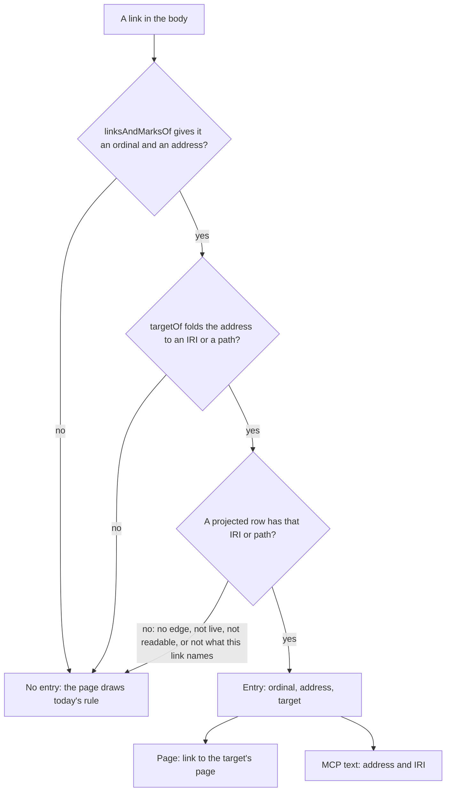

# Lead a body's link to the concept it names - Plan

## Goal Capsule

- **Objective:** A reader of a concept, on its page or through an assistant, can follow a link in the body that names another concept by relative path, wherever they may read that concept. Where they may not, nothing tells them a concept is there.
- **Means:** `open` answers each body link's target from the map's `LINKS_TO` edges, under the target's own read predicate (KTD1, KTD2).
- **Authority:** BA-139's acceptance criteria, then R2 and R3 below, then the S2a plan's KTD5 to KTD8 and KTD10 (`docs/plans/2026-10-09-1344-feat-s2a-search-and-concept-page-plan.md`), then `CODING_STANDARDS.md`.
- **Stop conditions:** stop and ask before a migration, a change under `contracts/`, a change to how either tier writes an edge, an edit to `writeConcept`, or an edit to `apps/api/tests/harness-knowledge.ts`.
- **Execution profile:** one pull request, each unit's tests written before its code.
- **Who finishes:** `ce-work` builds the units, `ce-code-review` reads the diff, and `ce-commit-push-pr` opens the pull request, which is left unarmed.

---

## Product Contract

### Summary

`open` gains one field, `bodyLinks`: for each link in the body whose target the reader may read, the link's ordinal, the address the body wrote and the target's IRI. The concept page draws such a link to the target's page. MCP's text lists each answered address beside its IRI. Every other link is drawn as it is today.

### Problem Frame

OKF links one concept to another by relative path, such as `[Audit Committee](../roles/audit-committee.md)`. The concept page (S2a U12, #688) draws such a link as its words alone, because `open` names no target for a link by its place in the body and the page cannot resolve a path. A reader finds the linked concept only under the page's *Links* section. An assistant reading MCP's text meets a relative path that `open` does not take. The first customer's bodies are likely to hold these links.

### Requirements

**The answer**

- R1. `open` answers, for each link in a concept's body whose target the reader may read, the link's ordinal as `linksAndMarksOf` gives it, its address as the body wrote it, and the target concept's IRI.
- R2. A target is answered only where the reader may read that concept under its own predicate. The predicate sits in the statement that reads the target, so no column of a concept the reader may not read is read.
- R3. A link to a concept the reader may not read, a link to a concept not yet written and a link whose address names no concept are answered alike: no entry. No key, count, order, gap or heading in either rendering differs between them, and the read does the same work whichever holds.
- R4. A target is answered only for a link the body holds, and only where that link's own address names it: the target's IRI, or its file's path.
- R5. No cap decides whether a link has a target.

**The transports**

- R6. MCP `open`'s structured answer and tRPC `knowledge.open` carry the same entries, and MCP's text names each answered address with its IRI.

**The page**

- R7. The concept page draws a link whose address is answered as a link to `/knowledge/search/<ulid>`. Every other link keeps today's rule: one written as a concept IRI leads to that concept's page, an `http`, `https` or `mailto` address stays a link, a footnote's reference stays its jump, and anything else is its words.
- R8. A drawn link's destination comes from the answered target alone, never from the address.

### Acceptance Examples

- AE1. **Covers R1, R2, R3.** Given a concept whose body links three files beside it, one a Viewer may read, one Restricted and one not written, when the Viewer opens it, then the answer holds one entry, for the first link. An Admin's answer holds two.
- AE2. **Covers R7, R8.** Given that answer, when the page draws the body, then the first link leads to `/knowledge/search/<ulid>` and the other two are words.
- AE3. **Covers R6.** Given one concept and one reader, when it is opened over MCP and over tRPC, then both answers carry the same entries.
- AE4. **Covers R3, R7.** Given two seeded concepts and a relative link between them, when a reader follows the link in a browser, then the linked concept's page opens. A Viewer's page holds no address for a link to a concept they may not read.

### Scope Boundaries

Not built, each judged and left out:

- A cap on the entries in MCP's text. The body's own links bound them, and the body is already in the answer.
- A read of the ordinal from the edge's id. KTD2 pairs a link with its target another way, so nothing parses the id.
- A link inside the evidence panel's copy of a body. `apps/web/src/features/knowledge/evidence-panel.tsx` passes no entries, so its links stay words.
- Carrying an address's fragment onto the concept page. The page's heading ids are prefixed per render, so a fragment would land nowhere.

#### Deferred to Follow-Up Work

- A moved target. A move re-derives no edge today, so a link to the new path stays words until the citing concept is rewritten or the map is rebuilt. This plan pins the safe half: a link to the old path is no longer answered.
- Links in the evidence panel's body, once `evidence-panel.tsx` is free of the BA-129 follow-up.
- A footnote defined as a relative path, such as `[^b]: ../roles/audit-committee.md`. The body's reader counts it as a link, so core answers it and MCP's text lists it. The page draws the reference as a footnote's jump and the path in the note as words, because no anchor carries the address.
- `contracts/links` cases for a percent-encoded path and a path with a fragment. A `contracts/` change runs alone.

---

## Planning Contract

### Key Technical Decisions

- KTD1. **The map names the target, and the read projects it under the target's own predicate.** One statement beside `RELATIONS` in `packages/core/src/concepts/read.ts` reads the live generation's `LINKS_TO` edges from the opened concept, joined to each target's `concept_index` row under `readableClause`. It selects the target's IRI and path, one row per target, with no `LIMIT`. This is the S2a plan's KTD7 projection again, so the page's link and its *Links* section come from the same edges, and both tiers still resolve a relative path once, held alike by `contracts/links`. The body's own links bound the rows, which is how R5 holds. The statement runs once whatever the body links, so the three cases of R3 cost the same. A lookup of each folded address in `concept_index`, with no edge, would also satisfy R2 to R5 and would answer a moved target at once. It was not chosen: it would resolve a path a second way beside the map's, and a link could then lead somewhere the *Links* section does not list. Governs R1, R2, R3, R5.
- KTD2. **A link is paired with a target by what its address names, not by the ordinal in the edge's id.** An edge's id does carry its link's ordinal (`links_to:<iri>:<ordinal>`). But the body and the edges can come from different moments: a rewrite can commit between the read's statements, and a rebuild derives edges from the git file, not from `concept_index.body`. Pairing by ordinal would then answer the wrong concept for a link. So the read resolves each link's address with the map door's own `targetOf`, which this plan exports, and answers the link only where that names a projected row's IRI or path. `targetOf` is pure: it folds the address against the citing file's path and looks nothing up. Governs R4.
- KTD3. **The field is `bodyLinks`, always an array from core, with `ordinal`, `address` and `target` in ordinal order.** It is named apart from the page's *Links* section, which is `relations`. The address rides in the answer because an assistant cannot count ordinals, and because one reading of the body, with the file's own unprojected `sources`, then serves both renderings. The boundary schema and the view type mark the key optional, so fixtures written before it still parse. Core never omits it, and an empty array is the one form of "nothing answered". Governs R1, R3, R6.
- KTD4. **MCP's text lists each answered address once, as `- <address> · <iri>`, under a heading of its own that is absent when nothing is answered.** `openedOnTheWire` in `apps/api/src/mcp/entries/index.ts` picks the concept's fields by name, so it gains the field. Governs R3, R6.
- KTD5. **The page matches a drawn link to an entry by address, with both sides percent-decoded.** The Markdown parser percent-encodes what the body's reader leaves as written, so an exact comparison would miss a non-ASCII address. Matching by position is ruled out: the nth anchor in the rendered tree is not ordinal n. A miss falls to words, and so does an address that does not decode: it is compared as written, on either side, and never fails the page. The destination is built from `target` through the web's `conceptPageOf`, and a fragment is dropped. Governs R7, R8.
- KTD6. **A failed statement fails the read, as `relations` does.** Every other shortfall falls to no entry.

### High-Level Technical Design

The projected rows are KTD1's statement. A row exists only for a target the reader may read, so the three cases of R3 all leave at D by the same branch.

### Assumptions

- The owner accepts an optional key in `open`'s answer that core always fills.
- A moved target's new path staying words until a rewrite or a rebuild is acceptable for v0.1.
- `bodyLinks` and `address` need no glossary entry: `link` is defined, and `address` already names what a link was written with in the web's code.

### Sources

- `packages/core/src/concepts/read.ts`: `RELATIONS`, `relationsOf`, `readsConcept`, the pattern KTD1 repeats.
- `packages/core/src/store/map/index.ts`: `targetOf`, `referencesOf`, `resolveOutgoing`, where an edge and its id are made.
- `packages/schema/src/concept-file.ts`: `linksAndMarksOf`, whose ordinal counts every link, images and links naming nothing included, and no citation mark.
- `packages/schema/src/map-tables.ts`: an edge's id is unique within a generation.
- `contracts/links/cases.json`: "an edge's id carries its link's ordinal", and how both tiers count.
- `apps/api/tests/harness-knowledge.ts`: `linksTo` already writes `[Title](file.md)` through `writeConcept`, so the browser suite needs no new seed.
- `docs/solutions/logic-errors/two-tiers-regex-engines-split-lines-and-whitespace-differently.md`: the ordinal is not "the nth Markdown link", and a third reader must not count for itself.
- `docs/solutions/architecture-patterns/adr-0016-answers-assert-concepts-only.md`: nothing withheld is counted, hinted at or explained.
- `docs/solutions/architecture-patterns/adr-0018-one-mcp-surface-five-entries.md`: an outside client cannot open a relative path, so MCP names a target by its IRI.

---

## Implementation Units

### U1. Answer each body link's target in the concept read

- **Goal:** `readConcept` answers `bodyLinks` by KTD1 and KTD2.
- **Requirements:** R1, R2, R3, R4, R5. Covers AE1.
- **Dependencies:** none.
- **Files:** `packages/core/src/concepts/read.ts`, `packages/core/src/concepts/index.ts` (`ConceptRead` and `readConcept` only), `packages/core/src/store/map/index.ts` (export `targetOf`, nothing else), `packages/core/test/concept-read.test.ts`.
- **Approach:**
  1. Read the body's links with `linksAndMarksOf` and the file's own cited sources, before the frontmatter is projected.
  2. Run KTD1's statement once, binding the live generation and the workspace as `RELATIONS` does.
  3. Keep each link whose folded address names a row, in ordinal order.
- **Patterns to follow:** `relationsOf` and `READABLE_CONCEPT` in `read.ts`; the `seededBy` and `targetsSeeded` arrangements in `concept-read.test.ts`; `linkedPair` in `packages/core/test/concepts.test.ts` for two concepts at chosen paths.
- **Test scenarios:**
  - Answers a readable relative link at its ordinal: a body with an image, then an `https` link, then `[Audit Committee](../roles/audit-committee.md)` answers one entry with ordinal 2, that address and the target's IRI.
  - Answers a Viewer nothing for a concept they may not read, while an Admin's read of the same concept answers it.
  - Answers nothing for a target limited to a group the reader is not in, and nothing for a target that is not published, while a reader in the group is answered the first.
  - Covers AE1. Reads alike for a target the reader may not read and one not written: two concepts with the same body, one linking a Restricted concept and one a path no concept holds, give a Viewer the same empty `bodyLinks` and the same `relations`.
  - Stops answering a target once an Admin restricts it, with the citing concept untouched.
  - Answers a link whose target was written after it, with the citing concept untouched.
  - Answers every link past twenty-five: 26 relative links give an Admin 26 entries, the last with ordinal 25, beside 25 relations.
  - Answers nothing for an address that names no concept: `../../../outside.md`, `../notes.txt`, `//host/x.md` and a concept IRI no concept holds.
  - Answers the same address twice as two entries, and a link written as a concept IRI with that IRI as its address.
  - Counts ordinals with the file's own sources: after a citation mark whose footnote is defined as a path, the next link is ordinal 0.
  - Answers nothing for an edge the link does not name: a seeded edge to a readable concept, under a body whose link names another path.
  - Answers nothing from an edge outside the live generation, and answers the same edge when it is in the live one.
  - Answers a failed read of the edges as an error.
- **Verification:** the scenarios pass, each fails with its part of the change taken out, and each line added under `packages/core/src` is probed with `pnpm mutant-probe` by `docs/agents/mutation-triage.md`, controls both ways.

### U2. Carry the entries through the answering slice and into MCP's text

- **Goal:** `open` returns `bodyLinks`, the boundary schema keeps it, and `renderOpen` lists it by KTD4.
- **Requirements:** R3, R6.
- **Dependencies:** U1.
- **Files:** `packages/core/src/answering/boundary.ts`, `packages/core/src/answering/index.ts`, `packages/core/test/answering.test.ts`, `packages/core/test/invisibility.test.ts`.
- **Approach:** `conceptOpened` passes the read's entries on. `openOutputWith` gains the optional key with a description a model can act on. `conceptText` gains the list.
- **Patterns to follow:** `listed` and the `Related:` lines in `conceptText`; `evidenceItem`'s `describe` in `boundary.ts`.
- **Test scenarios:**
  - Lists an answered link in the text as its address and its IRI.
  - Lists an address written twice once.
  - Writes no heading when nothing is answered, and none when the key is absent.
  - Keeps the entries through `open`'s output schema: a real `open` answer parsed by `openOutputWith` still holds them.
  - Gives a Viewer the same text for a link to a Restricted concept as for a link to a path no concept holds, the bodies' own words apart.
- **Verification:** the scenarios pass, and the added lines in `answering/index.ts` are probed as in U1.

### U3. Carry the entries over MCP

- **Goal:** MCP `open`'s structured answer holds what tRPC `knowledge.open` holds.
- **Requirements:** R6. Covers AE3.
- **Dependencies:** U2.
- **Files:** `apps/api/src/mcp/entries/index.ts`, `apps/api/tests/invisibility.test.ts`, `apps/api/tests/knowledge-procedures.test.ts`, `apps/api/tests/mcp-surface.test.ts`.
- **Approach:** `openedOnTheWire` passes the field, and the entry's description names it.
- **Test scenarios:**
  - Covers AE3. Answers the same `bodyLinks` over MCP and over tRPC, for one seeded concept and one reader.
  - Answers the Viewer the whole read over MCP, the body's link with its target among it (the existing literal gains the field).
  - Lists the key in the entry's emitted output schema.
  - Gives the Viewer no IRI of a Restricted target in the structured answer or the text, while the Admin's answer holds it.
- **Verification:** the scenarios pass, and the first fails with the field left out of `openedOnTheWire`.

### U4. Draw an answered link on the concept page

- **Goal:** `ConceptBody` draws a link whose address is answered to the target's page, by KTD5.
- **Requirements:** R7, R8. Covers AE2.
- **Dependencies:** U2, for the read's type.
- **Files:** `apps/web/src/features/knowledge/concept-body.tsx`, `apps/web/src/features/knowledge/concept-page.tsx` (the one prop on the `ConceptBody` call), `apps/web/test/concept-body.test.tsx`.
- **Approach:** `ConceptBody` takes the entries as an optional prop. `BodyLink` asks for an answered page first, so an answered link's destination is always its target's, and then applies today's rules in today's order.
- **Patterns to follow:** the `Held` context and `conceptPageOf` in `concept-body.tsx`; the cases around `draws a file beside it as its words alone` in the test file.
- **Test scenarios:**
  - Covers AE2. Draws an answered relative link to the target's page.
  - Draws the same link as words when no entry names its address.
  - Draws both links of an address written twice.
  - Drops the address's fragment from the page's address.
  - Matches an address with a non-ASCII character.
  - Draws by today's rule when an entry's target is no concept IRI.
  - Keeps an image with an answered address as its alt text, and a footnote's own link as a jump.
  - Keeps a footnote defined as an answered relative path as its jump, with the note's path as words.
  - Draws the body, each link by today's rule, when an address holds an escape that does not decode: `caf%E9.md` and `x%zz.md` in the body, and `100%.md` in an entry.
  - Draws words where no entries are given, as in the evidence panel.
- **Verification:** the scenarios pass, each new one fails against `concept-body.tsx` as it stands, and the file's existing cases still pass.

### U5. Follow a relative link in the browser

- **Goal:** the browser suite holds AE4.
- **Requirements:** R3, R7. Covers AE4.
- **Dependencies:** U3, U4.
- **Files:** `apps/web/e2e/concept-body-links.spec.ts` (new).
- **Approach:** seed through `conceptsSeeded` in `apps/web/e2e/knowledge.ts` with `linksTo`, which writes relative links. The browser-suite skill gives the fixtures, the sign-in and the accessibility gate.
- **Test scenarios:**
  - Covers AE4. Follows a relative link to the concept it names: an Admin opens the citing concept, follows the body's link by keyboard, and lands on the linked concept's page.
  - Covers AE4. Holds no address for a link to a concept the Viewer may not read: on the same seeded concept, the Admin's page draws the link to the Restricted concept, and the Viewer's page draws its words with no anchor. The Restricted concept's ULID is in neither the Viewer's page nor the `knowledge.open` answer it was drawn from.
- **Verification:** the spec fails against a build without U4, then passes; the accessibility gate passes on the page as left.

### U6. Say what `open` now answers

- **Goal:** the decision that lists `open`'s fields names the new one.
- **Requirements:** R6.
- **Dependencies:** U3.
- **Files:** `docs/solutions/architecture-patterns/adr-0030-mcp-surface-stays-mcp-sdk-v2.md`.
- **Test expectation:** none -- one line of a decision doc; `pnpm check:docs` holds its words.

---

## Verification Contract

| Gate | Command | Applies to |
| --- | --- | --- |
| Core's types and tests | `pnpm --filter @better-answers/core run check` | U1, U2 |
| The api's types and tests | `pnpm check:api` | U3 |
| The web workspace, the browser suite included | `pnpm check:web` | U4, U5 |
| The repository's gates, lint included | `pnpm check:gates` | all |
| Docs and the words gate | `pnpm check:docs` | U6, this plan |
| Mutation probes on the added core lines | `pnpm mutant-probe`, by `docs/agents/mutation-triage.md` | U1, U2 |

No journey walks the concept page, so no journey changes. A latency-budget or timeout failure is rerun alone before it counts as real. `open` gains one statement, so core's budget test for `open` is the one to watch.

## Definition of Done

- Each of BA-139's four criteria has a test that fails without the change: AE1 in U1, AE2 in U4, AE3 in U3, AE4 in U5.
- Every gate in the Verification Contract is green on the rebased head that is pushed.
- No file under `contracts/`, no migration, no edge write and no line of `writeConcept` is in the diff.
- No probe's mutation is left in the tree, and nothing tried and dropped is left in the diff.
- `ce-code-review` has run, with its adversarial lens on R2, R3, R4 and R6, and what holds up is fixed.
