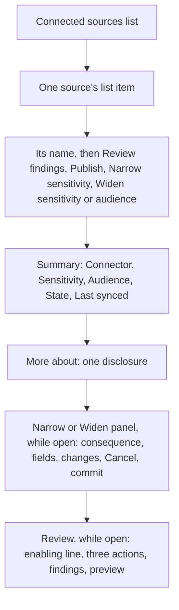
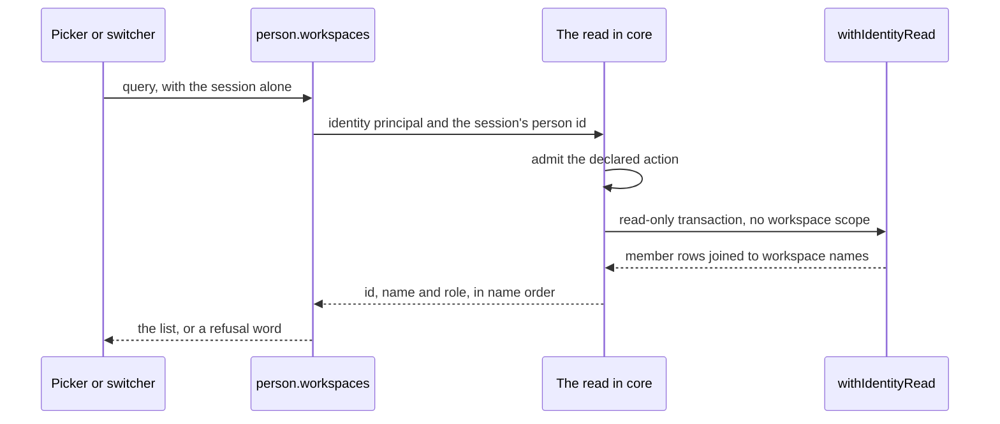
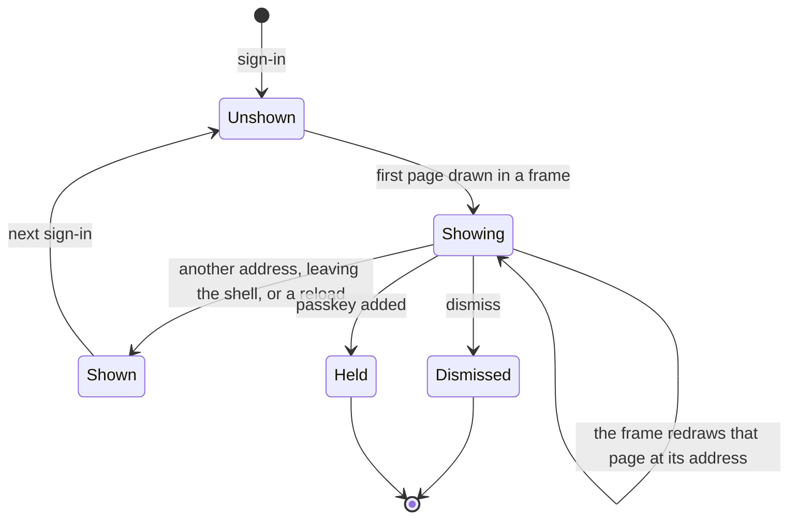

# Sources' and Models' Words, a Role Beside Each Workspace and the Small Leftovers - Plan

## Goal Capsule

- **Objective:** an Admin on Connected sources or Models and spend reads what each thing is and what each action does in words, with a source's review and its change of sensitivity beside the source. A person choosing a workspace sees their role in each. Five small defects left by the last page fixes are closed, and the design system's marked primitive no longer shares the shell's name.
- **Means:** word tables for every stored value (KTD1), one inline panel in a source's row (KTD3, KTD4), one tRPC read of a person's workspaces with roles that replaces Better Auth's list in the SPA (KTD14 to KTD17), and the fix each leftover's sibling already took (KTD9 to KTD13).
- **Product authority:** the acceptance criteria of Linear BA-104, BA-115, BA-145, BA-134 and BA-106's one open criterion, then the owner's ruling on BA-115 and comment on BA-106 (both 10/10/2026), then this plan. The findings are F11, F12 and F23 to F26 in `docs/dogfood-reports/2026-10-09-ba-36-screen-review.md`. `packages/design-system/readme.md` §3 and §4 are the voice and the register.
- **Stop conditions:** stop and report to the lead if any of these holds.
  - The `admission-types` agent's answer means a read taken by the platform principal cannot be declared and admitted (U5).
  - Replacing the list read needs a change to Better Auth's own configuration in `apps/api/src/auth/`.
  - A change is needed under `apps/web/src/features/knowledge/`.
  - A harness seed route under `apps/api/tests/harness-*.ts` or `controlEdges` needs reshaping.
  - A journey needs more than a word or a locator moved.
- **Execution profile:** one pull request for the five issues, a commit per unit in the order U1 to U7, with BA-106 last as its own commits (U5, then U6). Reversible: no migration, no `contracts/` file, no stored data and no email. The body closes `Fixes BA-104`, `Fixes BA-115`, `Fixes BA-145`, `Fixes BA-106`, `Fixes BA-134`.
- **Who finishes:** `ce-work` builds it, `/ce-code-review` reviews it after the last code change, and `ce-commit-push-pr` opens the pull request with `babysit:off`. The lead queues the merge.
- **Open blockers:** none. U5 waits on one answer from the `admission-types` agent, and is written so the answer slots in (Deferred to Implementation).

---

## Product Contract

### Summary

Connected sources and Models and spend show every state, connector, rule, category and provider as a word, and each row action's label says its effect. A source's review, its narrowing and its widening open inside that source's row, and the two changes list only the terms that move. The workspace picker and the band's switcher show the person's role beside each workspace, from one new read. Five leftovers are closed: two field heights, a gap under four cards, a search that went with its list, a passkey offer that ended early and an empty state's button that named filters where there were none. The marked primitive becomes `MarkedRegion`, and `ce-skill-work` looks in every nested skills folder for a name already in use.

### Problem Frame

BA-36's review found Sources and Models showing what the store holds, not what an Admin reads (F11, F12, F24). A source's row says "upload", "received" and "published" in lower case beside *Restricted*. More about leads each value with its stored word and prints the label *Destination* twice. Models and spend prints "anthropic" and says "No model is set." once per unset purpose, with no word on who sets one. *Review* and *Widen* do not say what they do. Review opens below the whole list, away from the source clicked, with three disabled actions and no line saying why (F25). Widen is a modal for a change that Narrow reverses, and it shows the shape of an audit row where the reader needs only what changes (F26). Connect a document still promises named groups "once the People page lists them", which it has done since Groups shipped (F23).

Pull request #690 closed most of BA-103, BA-105 and BA-106 and left three kinds of residue. BA-106 has one criterion open: no read answers a person's role in each workspace, because the picker and the switcher list workspaces through Better Auth's list, which carries none. BA-145 names five small defects each beside something #690 fixed. BA-115 records that BA-97 shipped the design system's marked primitive under the name the shell already had.

BA-134 is one line in a tracked skill. It rides here because BA-115 already edits one.

### Requirements

**Sources and models in the reader's words (BA-104)**

- R1. No stored value is shown where a reader word exists. A connected source's state and connector, a finding's category and rule, and a model choice's provider each read as a word, cased like the words beside them.
- R2. Each action on a source's row says its effect in its label, before the click.
- R3. More about a source gives each value as a sentence with no stored word leading it, lists its destinations under one label, and mentions OCR only when a document needs it.
- R4. Review opens inside the row of the source it reviews. While no group of findings is selected, its three actions say what enables them.
- R5. Narrowing and widening a connected source happen inline, in that source's row, and each lists only the terms that change.
- R6. Connect a document's audience hint says what the dialog offers today.
- R7. A purpose with no model choice says so briefly, and the card says once who sets a model and what the Admin does next.

**The marked primitive's name (BA-115)**

- R8. The design system's marked primitive is named `MarkedRegion` in code, in `packages/design-system/readme.md`, in `apps/web/CODING_STANDARDS.md` and in the glossary. The shell keeps `Frame`.
- R9. No tracked text names the primitive by the shell's name, outside frozen history, dated plans and reports, and Cubic's generated wiki. No file can import both under one name.

**The small leftovers (BA-145)**

- R10. A passkey's rename field and the authenticator's code field are each as tall as the buttons of their form.
- R11. No card on a member's page keeps a gap under its last line while its outcome line is empty, and the outcome region stays in the accessibility tree.
- R12. A refused re-read on Names waiting or Every workspace leaves the search field drawn and focused.
- R13. The passkey offer stays drawn when the frame redraws the page it first drew on. It still ends when the person moves to another address, and does not come back.
- R14. An empty state's button names what it clears: the search on a list with a search alone, the filters where the list has them.

**A role beside each workspace (BA-106)**

- R15. One read answers the signed-in person's workspaces, each with their role there, before any workspace is open, and answers them to that person alone.
- R16. The workspace picker shows the role beside each workspace as a text tag, and each row's button keeps the workspace's name as its accessible name.
- R17. The workspace switcher's menu shows the role after each workspace's name, and its trigger is unchanged.
- R18. A pick the api refuses, such as a person removed between the read and the pick, is answered as it is today.

**The skill's search (BA-134)**

- R19. `ce-skill-work`'s check for a skill name already in use covers every `.claude/skills/` folder below the repository's root.

**Held throughout**

- R20. Every changed page passes the accessibility gate in light and in dark, draws at most three registration marks, keeps every keystroke it has today, and scrolls nothing sideways at 320px.
- R21. The Admin's, Editor's and Viewer's journeys hold, and change in this pull request where a page moved what they read.
- R22. Every test this plan adds or changes is seen to fail with its fix removed.
- R23. Every edit to a tracked skill goes through `ce-skill-work`.

### Acceptance Examples

- AE1. **Covers R1.** Given a source connected by upload, Restricted, with no sync finished, then its row reads "Upload", *Restricted* and "Received", and nowhere "upload" or "received" in lower case.
- AE2. **Covers R5.** Given "Staff handbook" is Restricted for named groups and its widening panel is open with Internal picked, then the panel lists one change, the sensitivity from Restricted to Internal, and its commit reads "Widen Staff handbook to Internal for named groups". When *Everyone in the workspace* is also picked, then the audience's change joins the list.
- AE3. **Covers R4.** Given a review with no group ticked, then *Keep in text*, *Narrow these documents* and *Dismiss as not special category* are disabled and each is described by one line saying to select a group of findings first. When a group is ticked, then the line goes and *Keep* names the count.
- AE4. **Covers R13.** Given a Viewer holding no passkey sees the offer on their home page, when they switch to another workspace whose home has the same address, then the offer is still drawn. When they open Search and come back, then it is not.
- AE5. **Covers R16, R17.** Given a person who is an Admin of Acme and a Viewer of Beta, then *Your workspaces* shows "Admin" beside Acme and "Viewer" beside Beta, the button named "Acme" still opens Acme, and the switcher's menu in Acme lists "Acme Admin" then "Beta Viewer".
- AE6. **Covers R12.** Given the operator is typing in Names waiting's search when the list reads again in place and that read is refused, then the refusal's sentence shows, the search field still holds what was typed, and it still has focus.
- AE7. **Covers R14.** Given a search on Every workspace that matches nothing, then the button reads "Clear search". Given a role filter on Members that matches nothing, then it reads "Clear filters".

### Key Decisions

- **The shell keeps `Frame`.** (session-settled: user-directed — chosen over renaming the shell and keeping the readme's name for the primitive: the owner ruled on BA-115 on 10/10/2026 that the shell and the glossary's "frame" stay.) Governs R8.
- **The primitive is `MarkedRegion`.** The readme calls it "the marked primitive" and speaks of a "marked level" and a "marked parent", and says it is "for a figure or a region"; the web's standards say "a framed region". `Marked` alone was rejected because the glossary uses *marked* for a reviewed finding and *mark* for the operator's. `ModuleFrame` was rejected because it joins the shell's `Frame`, `WorkspaceFrame` and `ConsoleFrame`. Governs R8, R9.
- **Widen and Narrow go inline; Publish and the review's three bulk actions stay modals.** A narrowing takes reach away and a widening gives it back, so neither is the irreversible action the readme keeps a modal for. Publish cannot be undone from the page. Governs R5.
- **The row's buttons read "Review findings", "Publish", "Narrow sensitivity" and "Widen sensitivity or audience".** The keystroke list keeps its sentences. Governs R2.
- **A count says *finding*, not *span*.** The glossary's *written span* is internal, and each thing the page counts is one finding. Governs R1.
- **A rule reads as a word.** The redaction rules the worker ships are a short, stable list, so each takes a reader word and an unknown id shows as itself. Governs R1.
- **The connect dialog's group picker is not built.** The hint becomes a true line, that named groups cannot be chosen here yet. Governs R6.
- **The label "Provider" stays on Models and spend.** The issue asks that providers read as words. The glossary keeps *provider* for the system a source's documents came from, which is named as follow-up. Governs R1.
- **The role goes inside the switcher's menu items, after the name.** A line saying why not was the alternative BA-106's comment allows. A person looking for the workspace where they are an Admin reads it in the menu they already open. Governs R17.
- **The new read lists every workspace the person holds, with no check on ended sign-ins.** The pick's own refusal already answers a person who can no longer enter, and BA-106's comment asks that path be left alone. Governs R15, R18.

### Scope Boundaries

- `apps/web/src/features/knowledge/` is untouched. Drawing Search and the concept page through the shared head is BA-144's.
- `apps/api/tests/harness-*.ts` and `controlEdges` in `apps/web/e2e/locators.ts` are the `suite-seeds` agent's. A helper is added beside what is there, never by reshaping it.
- `apps/web/src/shared/api/query-client.ts`, `apps/web/src/shared/landing.ts`, `apps/web/src/app/jump-to.tsx` and `SeedConcept` in `apps/web/e2e/harness.ts` are S2a's and are not edited.
- `packages/core/src/kernel/` is the `admission-types` agent's. U5 calls `declareAction` and `admit` and edits neither.
- Publish's "What the audit row will carry" section stays. F26 names Widen alone.
- Considered and not built: closing Better Auth's `/organization/list` once the SPA stops reading it. `docs/solutions/architecture-patterns/adr-0009-better-auth-in-process-identity-provider.md` keeps the plugin's reads open and `apps/api/tests/organisation-plugin.test.ts` holds that path kept, so closing it moves a recorded decision. Evidence that would change the call: the owner asking for that path to be closed.
- Considered and not built: a check on ended sign-ins in the new read. The pick refuses such a person in its own word today. Evidence that would change the call: a person reporting a listed workspace they cannot open.
- Considered and not built: a test that refuses `shared/blueprint.tsx` exporting `Frame` again. TypeScript already refuses an import of a name that is not exported.
- The design system's `_adherence.oxlintrc.json` lists props for this primitive that the pre-build kit had and the built one lacks. U2 renames the entry and leaves the list.

#### Deferred to Follow-Up Work

- A group picker in Connect a document. The api's upload already takes audience groups (`x-upload-audience-groups` in `apps/api/src/trpc/upload.ts`).
- The label "Provider" on Models and spend against the glossary's *provider*.
- BA-144: Search and the concept page on the shared head.

---

## Planning Contract

### Key Technical Decisions

- KTD1. **Every stored value on these pages reads through a word table that specs import.** `apps/web/src/features/sources/words.ts` gains tables for state, connector, the row's action labels, a rule's word and the review's sentences, and `apps/web/src/features/model-choices/words.ts` gains the providers. A closed set the api types (state, connector, audience) is a record held with `satisfies`, so a new stored value fails the type check. An open set (rules, providers, destinations, retention) is a map whose miss shows the stored value as itself. `destinationOf().word` stays exported, because `apps/web/test/sources-words.test.ts` reads it.
- KTD2. **A pill on a row this plan rewrites is Kibo UI's `Pill`.** The readme makes every pill that component. The source row's sensitivity and state, the review's sensitivity and note tags and the model card's *Fixed* move from `Badge`. `apps/web/src/shared/ui/badge.tsx` stays, because `Pill` and the citation part import it.
- KTD3. **Narrow and Widen share one inline panel, drawn in the source's row.** The panel is a named group after the row's summary, holding the consequence, the fields, the changes, *Cancel* and the commit. Its shape follows `apps/web/src/features/people/member-removal.tsx`, the tree's one inline confirmation.
  - The group is named for the action and the source, and described by its consequence, so a screen reader hears the consequence on entering it.
  - Focus lands on the panel's first field as it opens, by button or by keystroke.
  - *Cancel* closes it and returns focus to the button that opened it.
  - The commit closes it at once and sends focus to the source's heading, as the dialogs do today, so the row's value still moves inside the action's 100 ms.
  - The commit is `aria-disabled` while a narrowing or widening is pending, because a second `mutate` drops the first one's answer (`docs/solutions/logic-errors/a-second-mutate-drops-the-first-actions-callbacks.md`).
  - One panel is open on the page at a time.
  - Rejected: keeping `ActionDialog` and arguing that a widening cannot be undone, which is true only of a published source. Rejected: a non-modal Radix dialog, which loops Tab inside itself (`docs/solutions/logic-errors/a-non-modal-radix-sheet-still-loops-tab-inside-itself.md`).
- KTD4. **The list draws the review inside the reviewed source's list item.** `ConnectedSourceList` takes the id under review and draws `Review` after that row's panel. The row's *Review findings* button is a disclosure with `aria-expanded`, and a second press closes the review. One review is open at a time, so `REVIEW_HEADING` stays one id. Its heading sits one level under the source's.
- KTD5. **A panel lists a term only when it changes.** The changes are a short description list: the sensitivity from its present word to the picked one, and the audience likewise, each row present only when the two differ. The "What the audit row will carry" section leaves both panels, and the lines restating the present sensitivity and audience go, because the row's own summary sits above the panel. `TheAuditRow` stays for Publish.
- KTD6. **The enabling line is one line above the three actions.** It shows while no group is ticked and each disabled action names it with `aria-describedby`. The dismissal's own line for a mixed selection is unchanged.
- KTD7. **A rule's word comes from a ten-entry map.** The ids are the ones `apps/worker/src/better_answers_worker/redaction/descriptors.py` raises: `HEALTH_CUE`, `UK_BANK_ACCOUNT`, `UK_NHS`, `UK_NINO`, `DATE_OF_BIRTH`, `UK_HOME_ADDRESS`, `EMAIL_ADDRESS`, `PHONE_NUMBER`, `PERSON` and `JOB_TITLE`. An id outside the map draws as itself in the mono face, as every id does today.
- KTD8. **The rename is a GitNexus dry run applied by hand.** `rename` reads and writes the main checkout, so it stays a dry run and each edit is made in the worktree. The slot's attribute becomes `data-slot="marked-region"`. The rename is done when a jCodeMunch `search_text` finds no `Frame` imported from `@/shared/blueprint`.
- KTD9. **A field takes its buttons' height with `h-8`.** `AddAPasskey` in `apps/web/src/features/auth/passkeys-part.tsx` already does. The authenticator's code field is one part shared by setup, Account and the confirm page, so all three pairs agree.
- KTD10. **The four cards' outcome lines go boxless.** `OutcomeLine`'s wrapper takes `className="contents"`, as the Groups card and the group sheet's Members card do, so the empty wrapper takes none of its card's gaps. `empty:hidden` on the status stays out, because a region outside the accessibility tree is not announced when it fills.
- KTD11. **The search row sits outside the read's conditional.** Names waiting and Every workspace draw their card and filter row always and swap only the table, as `apps/web/src/features/console/everyone-list.tsx` does.
- KTD12. **The frame holds, in its own state, the address the offer is drawn on.** A workspace's key remounts the page beneath the frame and not the frame, so a redraw at that address still finds the address held and draws the offer.
  - Any other address drawn in the frame clears it, Account included, so returning does not bring the offer back.
  - Leaving the shell, as *All workspaces* does, unmounts the frame and what it held. The offer then reads the browser's mark, as it does after a reload.
  - The offer itself stays inside the keyed subtree, so its place against the head's slot and the keyboard walk's order do not move.
  - Rejected: module state. It outlives the frame, so a trip through the workspace picker to a home at the same address would draw the offer a second time.
- KTD13. **The empty state's button takes its words from its caller.** `ListState`'s emptied state gains the button's label, read from one table: "Clear search" on the Console's three lists and on Invitations, whose button clears the search alone, and "Clear filters" on Members and the Audit log.
- KTD14. **The read is the Console's query for one person, through the read-only identity door.** It lives in `packages/core/src/workspaces/`, answers the Console's row shape, `{ workspace: { id, name }, role }`, in name order, and opens `withIdentityRead` with the platform principal, like `workspacesHeldBy` and `readOpenInvitations`. `member` and `workspace` are outside row-level security on purpose (`packages/schema/src/rls-exemptions.ts`), so the person's id is the only fence, and it comes from the session.
- KTD15. **The read is declared and admitted before its first await.** It is the first identity-door read to carry a `declareAction`. `admit` passes a platform principal only for a purpose the declaration names, and the api's identity principal is `process:better-answers-identity`.
- KTD16. **`person.workspaces` sits on `personProcedure` and takes no input.** The procedure hands the read the session's own person id, so no request can name another person. It is not added to `PENDING_PROCEDURES`: the picker is behind the confirm gate and the switcher is inside the frame.
- KTD17. **The SPA reads the list from `person.workspaces` and nowhere else.** `useListOrganizations` and its key go.
  - The new read joins `theirOwn` in `aboutTheWorkspace`, or every switch would drop it (`docs/solutions/logic-errors/workspace-switch-serves-left-workspace-member-after-failed-reread.md`).
  - `useSetActiveOrganization` marks it stale and `useAcceptInvitation` removes it, as each does to the old key.
  - Better Auth's `set-active` still makes the pick.
  - Rejected: keeping Better Auth's list and reading the roles beside it, which leaves two lists that can disagree about which workspaces a person holds.
- KTD18. **The role tag never enters a control's name on the picker, and follows the name inside a switcher item.** On the picker the `Pill` is a sibling of the row's button, as `apps/web/src/features/console/person-words.tsx` draws a name beside a role. In the switcher the open workspace's role comes from the member read the band already holds, so it shows before the list arrives. One spec helper builds an item's expected text.

### High-Level Technical Design

A source's row after U3, top to bottom:

The read of a person's workspaces:

The passkey offer's states for a person holding no passkey:

### Assumptions

- The shown words are these, and the owner may prefer others.
  - State: "Received", "Indexing", "Indexed", "Published". Connector: "Upload".
  - Rules: "Health wording", "Sort code and account number", "NHS number", "National Insurance number", "Date of birth", "Home address", "Personal email address", "Phone number", "Person's name", "Job title".
  - An unset purpose: "Not set". The card's line: better-answers support sets a workspace's models, and the Admin asks them for a purpose that has none.
  - The enabling line: "Select a group of findings first." The connect hint: named groups cannot be chosen here yet.
- "better-answers support sets a workspace's models" is true today. Nothing under `apps/api/src` or `packages/core/src` writes a model choice, and the route spec's story 50 gives the choice to the owner.
- A category and its tier are sentence-cased ("Bank details", "Always"), in the glossary's words for both.
- The review's sentences that say "the seam" lose that word as they are rewritten for *finding*, because *redaction seam* is internal.
- "once the file lands" and "No passage has landed yet" take *received* or plainer words, because `apps/api/tests/old-words.ts` retires *landed* from reader text.
- The Review button closes its review on a second press. Today a review stays open until another opens.
- Invitations' empty state reads "Clear search" too. Its button keeps the status switch and clears the search alone.
- A pending session is refused `person.workspaces` like any person read outside `PENDING_PROCEDURES`. No page a pending session reaches lists workspaces.
- The picker gains a one-second budget on its list, since its read changes.

### Deferred to Implementation

- The declaration's exact shape for a read the platform principal takes: the role it names, the purposes it admits and how the identity purpose is spelled, and whether `workspacesHeldBy` and `readOpenInvitations` gain declarations in the `admission-types` pull request under names this one should match. The `admission-types` agent has been asked. KTD15 holds whatever the answer, and the core tests call the read as a principal the declaration admits.
- The read's name, and whether it shares the Console's private `workspacesOf` in `packages/core/src/workspaces/people.ts` or its statement alone.
- Whether Escape closes an inline panel, beyond *Cancel*.
- Whether the picker's role tag needs a visually hidden joining word for a screen reader, once the row is heard.
- Where the api's test of `person.workspaces` lives: beside the invitations read in `apps/api/tests/members-accept.test.ts`, or a file of its own.
- Which of the six unit stubs answer the list today and so must answer `person.workspaces`.

### What the Owner May Overturn

- `MarkedRegion` as the primitive's name.
- Widen going inline although a published source's wider reach cannot be unread. The panel's consequence still says its passages reach more readers the moment it is widened.
- Narrow going inline with Widen, beyond what F26 names.
- The four button labels on a source's row, and every word under Assumptions.
- *Finding* where the page counted spans, and the rules read as words.
- "better-answers support sets a workspace's models" as the next step on Models and spend.
- The connect dialog's group picker left unbuilt, and the label "Provider" left standing.
- `person.workspaces` replacing Better Auth's list in the SPA, with `/organization/list` left open on the api.
- The role inside each switcher item, which changes what the switcher's specs and the journeys read.
- The read listing a workspace whose member's sign-ins were ended.

### Risks

- **A read across workspaces.** The new read sets no workspace scope, by design. U5's tests hold that it answers one person's rows and that the procedure takes no person from the request.
- **A list dropped on every switch.** Covered by KTD17's first point, and by the switcher spec's existing switch tests.
- **Text assertions on the switcher's items.** About ten `toHaveText` lists in `apps/web/e2e/workspace-switcher.spec.ts` and `apps/web/e2e/console.spec.ts`, and `apps/web/journeys/every-role.ts`, read an item as the workspace's name alone. All move through KTD18's helper in U6's one commit, and the journeys run before the push.
- **Two agents in `packages/core/src/workspaces/index.ts`.** The `admission-types` pull request adds declarations and a lint that names an exported face taking a principal with no declaration. Whichever merges second rebases, and U5 is declared from the start so the lint finds nothing.
- **The gate on a new inline form.** Its fields are found by their edge, which the gate measures at 3:1 in both themes. The panel uses the same `Select` the dialogs use.
- **Duplicated panel code.** `jscpd` refused BA-97 on repeated runs. Narrow and Widen call one panel part.
- **Unused exports.** `knip` refuses `useListOrganizations` or a word left with no reader. Each unit removes what it stops using.
- **Budgets under load.** A latency-budget or timeout failure is rerun alone on untouched code before it counts.

---

## Implementation Units

U1's five parts, U2, U3 and U4 edit disjoint source files and can be built at once. Shared files, and so the order they are committed in:

- `apps/web/e2e/console.spec.ts`, `apps/web/e2e/console-people.spec.ts` and `apps/web/test/console-frame.test.tsx`: U1 parts C and E together, then U6.
- `apps/web/e2e/passkeys.spec.ts`: U1 parts A and D.
- `apps/web/src/app/frame.tsx`: U1 part D, then U6 if the open workspace's role is passed from there.
- `apps/web/test/passkey-offer.test.tsx`: U1 part D, then U6 if its stub answers the list.
- `CONCEPTS.md`: U2, then U6.
- `.claude/skills/browser-suite/SKILL.md`: U6 only, and only if it adds a helper.

### U1. The five leftovers

- **Goal:** close BA-145's five defects, each with the fix its sibling took.
- **Requirements:** R10 to R14, R20, R22. AE4, AE6, AE7.
- **Dependencies:** none.
- **Files:**
  - Part A, heights: modify `apps/web/src/features/auth/passkeys-part.tsx`, `apps/web/src/features/auth/authenticator-code.tsx`; test: modify `apps/web/e2e/passkeys.spec.ts`, `apps/web/e2e/second-factor.spec.ts`
  - Part B, gaps: modify `apps/web/src/features/people/member-sections.tsx`, `apps/web/src/features/people/member-removal.tsx`; test: modify `apps/web/e2e/people.spec.ts`
  - Part C, search: modify `apps/web/src/features/console/names-waiting-list.tsx`, `apps/web/src/features/console/workspaces-page.tsx`; test: modify `apps/web/e2e/console-people.spec.ts`, `apps/web/e2e/console.spec.ts`
  - Part D, offer: modify `apps/web/src/features/auth/passkey-offer.tsx`, `apps/web/src/app/frame.tsx`; test: modify `apps/web/test/passkey-offer.test.tsx`, `apps/web/e2e/passkeys.spec.ts`
  - Part E, button: modify `apps/web/src/shared/list-pages.tsx`, `apps/web/src/shared/words.ts`, `apps/web/src/features/console/list-parts.tsx`, `apps/web/src/features/people/members-tab.tsx`, `apps/web/src/features/people/audit-log-page.tsx`, `apps/web/src/features/people/invitations-tab.tsx`, `apps/web/test/members-list.tsx`; test: modify `apps/web/test/grid-table.test.tsx`, `apps/web/test/console-frame.test.tsx`, `apps/web/e2e/console-people.spec.ts`, `apps/web/e2e/console.spec.ts`, `apps/web/e2e/people-invitations.spec.ts`
- **Approach:**
  1. Part A as KTD9 states, on `RenameAPasskey`'s field and on `AuthenticatorCodeField`.
  2. Part B as KTD10 states, on the Role, Sign-ins and personal tokens, Display name and Removal cards.
  3. Part C as KTD11 states. The field's text already survives in `useNarrowedRows`; the change keeps the field mounted.
  4. Part D as KTD12 states. The mark on the browser in `apps/web/src/features/auth/session-memory.ts` and the three places that forget it at a sign-in are unchanged.
  5. Part E as KTD13 states. The three Console readers of the literal import the new word; Members' and the Audit log's readers keep theirs.
- **Execution note:** write each part's test first and watch it fail. Part C's re-read must be the list's alone and in place.
  - Clearing the operator's mark is the wrong trigger: a re-read of the operator's standing would then close the whole console (`ConsoleClosed` in `apps/web/src/app/console-frame.tsx`), search and all.
  - Fail the list's read alone, with the interception in `apps/web/e2e/failed-page.spec.ts`, which rewrites one procedure's answer inside a batch.
  - Trigger the re-read with `context.setOffline`, as `apps/web/e2e/workspace-switcher.spec.ts` does. The visibility helper in `apps/web/e2e/sign-in.spec.ts` dispatches on `document`, which the query library does not hear.
- **Patterns to follow:** `AddAPasskey` for the height; `apps/web/src/features/people/groups-read.tsx` for the boxless line; `everyone-list.tsx` for the search; `apps/web/src/features/console/list-words.ts` for a word table a spec reads.
- **Test scenarios:**
  - A passkey's rename field and its *Save* measure the same height on Account.
  - The authenticator's code field and *Finish setup* measure the same height on setup.
  - Each of the four cards ends within one gap of its last line of text while its outcome line is empty. The measure runs from the last visible line's bottom to the card's bottom edge.
  - Each card's status is still in the accessibility tree while empty, and a refused role change still shows its words in the Role card.
  - Covers AE6. On Names waiting, with focus in the search and text typed, the list's read happens again in place and is refused. What the read said shows, no table shows, and the search field is visible, focused and holds its text.
  - The same on Every workspace.
  - Covers AE4. The offer drawn on a page is still drawn after the frame remounts that page at the same address under another workspace's key.
  - The offer is gone after a move to another address, and stays gone on returning to the first.
  - The offer is gone after a visit to Account, and after a trip through *All workspaces* to a home at the same address.
  - The offer is not drawn on a fresh page load after one showed it.
  - Covers AE7. A Console list whose search matches nothing offers "Clear search", and pressing it empties the search and returns focus to the field.
  - Members with a role filter that matches nothing still offers "Clear filters".
  - An Invitations search that matches nothing offers "Clear search", and pressing it keeps the status switch where it was.
- **Red probes:**
  - Part A: take `h-8` off either field, and that field's height test fails by 4px.
  - Part B: take `contents` off one card's line, and that card's measure fails by its grid gap.
  - Part C: put the card back under the read's conditional, and the search field is gone after the refused re-read.
  - Part D: stop the frame holding the address, and the remount test finds no offer. Hold it in module state instead, and the trip through *All workspaces* finds the offer drawn again.
  - Part E: put the literal back in `ListState`, and the Console tests find no "Clear search".
- **Verification:** the named specs and unit tests pass, and the gate passes on Account, setup, a member's page and the Console's three lists in both themes.

### U2. The marked region's name, and the skill's search

- **Goal:** the primitive and the shell stop sharing a name, and the skill's duplicate-name search reaches every nested skills folder.
- **Requirements:** R8, R9, R19, R23.
- **Dependencies:** none.
- **Files:**
  - modify `apps/web/src/shared/blueprint.tsx`, `apps/web/test/blueprint-parts.tsx`, `apps/web/e2e/blueprint-parts.spec.ts`
  - modify `packages/design-system/readme.md` (§4 and §6), `packages/design-system/_adherence.oxlintrc.json`, `packages/design-system/guidelines/kits-adoption.card.html`
  - modify `apps/web/CODING_STANDARDS.md`, `docs/specs/v01-route.md`, `CONCEPTS.md`
  - modify `.claude/skills/ce-skill-work/references/new-skill.md`
- **Approach:**
  1. As KTD8 states for the code. The test harness's figure is named "Marked region", and the spec finds it by that name.
  2. Invoke `ce-skill-work` before the readme and before `new-skill.md`. The readme names `MarkedRegion` wherever it named the primitive, and still calls it the marked primitive.
  3. `CONCEPTS.md` gains an `_Internal._` entry, *marked region*, which says it is not the frame. No entry exists for the primitive today, so nothing is renamed there.
  4. `new-skill.md`'s first step states the search as a condition: every `SKILL.md` in a `.claude/skills/` folder at any depth below the root, with the two sources it already names.
  5. `.cubic/wiki/` is generated and the dated dogfood reports keep the words of their day. Neither is edited.
- **Test scenarios:**
  - The blueprint board's marked region is found by its new name and is still transparent, hairlined and marked.
  - `apps/web/test/blueprint-in-one-place.test.ts` still finds marks written in the three part files alone.
  - **Test expectation for the docs and the skill:** none -- they change no behaviour. `pnpm check:docs` reads them.
- **Red probe:** leave the harness's figure under its old name, and the board's spec finds no figure.
- **Verification:** the search in KTD8 comes back empty, `git grep -w Frame` finds the shell's alone outside `.cubic/`, `docs/archive/` and the dated plans and reports, and the web's types pass.

### U3. Connected sources

- **Goal:** a source's row, its detail, its review and its two changes of sensitivity read in words and happen beside the source.
- **Requirements:** R1 to R6, R20, R22. AE1, AE2, AE3.
- **Dependencies:** none.
- **Files:**
  - modify `apps/web/src/features/sources/words.ts`, `connected-source-list.tsx`, `connected-sources-page.tsx`, `connected-source-dialogs.tsx`, `review.tsx`, `review-actions.tsx`, `connect-action.tsx` (all under `apps/web/src/features/sources/`)
  - create one file under `apps/web/src/features/sources/` for the inline panel, if `connected-source-dialogs.tsx` would otherwise hold both dialogs and panels
  - test: modify `apps/web/e2e/sources.spec.ts`, `apps/web/test/sources-words.test.ts`, `apps/web/test/sources-actions.test.tsx`
- **Approach:**
  1. Words first, as KTD1 states: state, connector, the four labels, the rules, the review's and the actions' sentences with *finding*, the connect hint and its consequence.
  2. The row: the summary reads through the tables, and its pills are `Pill` (KTD2).
  3. More about: the state's sentence alone, one *Destinations* row holding each destination's sentence, the retention's sentence alone. The unreadable row counts the documents, and adds how many are scans needing OCR only when that count is above zero. Each listed document keeps the glossary's reason beside its title.
  4. Review moves into the row (KTD4) and gains the enabling line (KTD6). The comment in `connected-sources-page.tsx` that says the review opens below the list goes with the code it describes.
  5. Narrow and Widen become the panel (KTD3, KTD5). `NarrowDialog` and `WidenDialog` go. `PublishDialog`, `TheAuditRow` and `movedWords` stay.
  6. The keystrokes `r`, `n` and `w` open the same row parts for the source in focus, and still say to select a source first when none has held focus.
- **Execution note:** rewrite the four widening and narrowing tests against the inline group first and watch them fail on the dialog. Grep the spec for each literal label before changing it.
- **Patterns to follow:** `member-removal.tsx` for an inline confirmation; `WordPicked` in `connected-source-dialogs.tsx` for the fields; `apps/web/src/features/console/list-words.ts` for words a spec imports.
- **Test scenarios:**
  - Covers AE1. A row's connector, sensitivity and state read as their words, in an aria snapshot of one list item, and the stored lower-case values are nowhere in the list.
  - Each of the four buttons carries its new label, followed by the source's name for a screen reader.
  - More about shows no stored word before a sentence and one *Destinations* term. With no document needing OCR it does not say OCR; with one it says so once.
  - A destination or retention word the tables do not know still shows as itself.
  - Review opens inside its source's list item, with focus on its heading. A second press closes it and keeps focus on the button.
  - Opening another source's review closes the first.
  - Covers AE3. With nothing ticked the three actions are disabled and described by the enabling line; with a group ticked the line is gone.
  - A finding's rule reads as its word in the table, in the checkbox's name and in a confirming dialog's list. An id outside the map reads as itself.
  - Covers AE2. Widening by keyboard: `w` opens the panel in the row with focus on the sensitivity. The changes list holds the sensitivity alone until the audience is changed too. The commit names the result, and the row's sensitivity reads the new word within 100 ms of the key.
  - The widening panel holds no "What the audit row will carry", and no dialog opens.
  - A widening that asks for nothing wider leaves the commit disabled, described by the `not-wider` sentence.
  - Narrowing a published source inline moves its citing concepts and write-ups, and says so.
  - *Cancel* closes the panel and returns focus to the button that opened it. A commit sends focus to the source's heading.
  - A commit pressed while another narrowing or widening is pending does nothing.
  - A widening the api refuses for an unreviewed special category finding says the refusal's sentence and puts the row's value back.
  - Connect a document's audience hint no longer names the People page, and its consequence does not say "lands".
  - Publish still opens its dialog with its three confirmations and its audit row.
  - Nothing scrolls sideways at 320px with a review and a panel open.
  - The page's list of keystrokes is unchanged.
- **Red probes:**
  - Put a stored value back in the row, and the snapshot fails.
  - Draw `Review` after the list again, and the test that looks for it inside the list item fails.
  - Remove the enabling line, and the described-by assertion fails.
  - Add the audience's row to the changes when it has not moved, and AE2's list fails.
- **Verification:** `sources.spec.ts` and the two unit files pass, the list still draws ten sources within its second, and the gate passes with a review and a panel open in both themes.

### U4. Models and spend

- **Goal:** a provider reads as its name, and an unset purpose says who sets one, once.
- **Requirements:** R1, R7, R20, R22.
- **Dependencies:** none.
- **Files:** modify `apps/web/src/features/model-choices/words.ts`, `apps/web/src/features/model-choices/model-choices-card.tsx`; test: modify `apps/web/e2e/models-and-spend.spec.ts`
- **Approach:**
  1. A provider's word comes from a map: Anthropic, Mistral AI, Voyage AI, OpenAI, Google, and the platform's own for `local`. A provider outside it shows as itself.
  2. An unset row reads "Not set". One line under the card's lead, drawn while any purpose is unset, says who sets a model and what to do. `noneSet` keeps its key and its sentence, because `apps/web/e2e/frame.spec.ts` reads it. The Admin's journey reads `lead`, which is unchanged.
  3. *Fixed* is a `Pill` (KTD2).
- **Test scenarios:**
  - A set purpose shows its provider's name. The spec reads the name from the table, and the stored id is not on the page.
  - Another workspace's providers show neither as names nor as ids.
  - A provider outside the map shows as its id.
  - With one purpose set, four rows read "Not set" and the who-sets line shows once.
  - With every purpose set, the who-sets line is absent.
  - With none set, the one-line state shows with the who-sets line, and no row.
  - The card's aria snapshot holds the new terms.
- **Red probes:** print the stored provider, and the name assertion fails. Draw the who-sets line per row, and its count of one fails.
- **Verification:** `models-and-spend.spec.ts` passes, its list within its budget, and the gate passes in both themes.

### U5. The read of a person's workspaces and roles

- **Goal:** the api answers the signed-in person's workspaces with their role in each.
- **Requirements:** R15, R18, R22.
- **Dependencies:** none in this plan. The `admission-types` agent's answer shapes the declaration.
- **Files:**
  - modify `packages/core/src/workspaces/index.ts`, and `packages/core/src/workspaces/people.ts` if the Console's query is shared
  - modify `apps/api/src/trpc/person.ts`
  - test: modify `packages/core/test/workspaces.test.ts`, `apps/api/tests/procedure-output.test.ts`; modify or create the api's test of the procedure (Deferred to Implementation)
- **Approach:**
  1. The read as KTD14 and KTD15 state. Its refusals are the kernel's `malformed`, for an id the boundary will not take, and admission's `role-forbids`. It adds no new word.
  2. The procedure as KTD16 states, through `crossing` with the read's own name as the log label.
  3. Both lists in `procedure-output.test.ts` gain the path. The walks in `apps/api/tests/pending-set.test.ts` and `apps/api/tests/trpc-roads.test.ts` cover it without an edit.
  4. Read `apps/api/CODING_STANDARDS.md` and the `trpc-router` skill under `apps/api/.claude/skills/` before the procedure.
- **Execution note:** write the core test first, and the api's test through `server.request`, each failing before the code exists.
- **Patterns to follow:** `workspacesHeldBy` and `readOpenInvitations` for an identity-door read; `listMembers` in `packages/core/src/members/member-list.ts` for a declared read; `person.invitations` for the procedure; `packages/core/test/people.test.ts` for one person seeded at two roles.
- **Test scenarios:**
  - A person who is an Admin of Beta and a Viewer of Acme is answered Acme with Viewer, then Beta with Admin.
  - Another person's workspace is not in the answer.
  - A person who holds no workspace is answered an empty list, not a refusal.
  - A malformed person id is refused `malformed` before any statement.
  - A platform principal acting for a purpose the declaration does not name is refused `role-forbids`.
  - The store's failure comes back as an `Error`, never a word. The read joins the two cases in `workspaces.test.ts` that list every identity read by name.
  - A workspace whose member's sign-ins were ended is still listed.
  - Over tRPC, a signed-in member of two workspaces at two roles reads both with their roles.
  - Over tRPC, a caller with no session is answered 401 with `no-session`.
  - The procedure takes no input, so the answer is always the session's own person's.
- **Red probes:** drop the `admit` call, and the purpose test passes a principal it should refuse. Order by id, and the name-order test fails. Leave the path off either list, and `procedure-output.test.ts` fails.
- **Verification:** the core check and `pnpm check:api` pass, and `pnpm check:gates` finds admission before the first await.

### U6. The role tags

- **Goal:** the picker and the switcher show the role beside each workspace.
- **Requirements:** R16, R17, R18, R20, R22. AE5.
- **Dependencies:** U5.
- **Files:**
  - modify `apps/web/src/features/auth/auth-hooks.ts`, `apps/web/src/features/auth/choose-workspace-page.tsx`, `apps/web/src/app/workspace-switcher.tsx`, and `apps/web/src/app/frame.tsx` if the open workspace's role is passed from there
  - modify `CONCEPTS.md` (*workspace switcher*)
  - modify `apps/web/journeys/every-role.ts`, `apps/web/journeys/admin.spec.ts` and `apps/web/journeys/member-journey.ts`: the switcher step takes the journey's role and expects the item's text with it
  - modify `apps/web/e2e/locators.ts` and `.claude/skills/browser-suite/SKILL.md`, only if the item-text helper is shared with the journeys from there
  - test: modify `apps/web/e2e/sign-in.spec.ts`, `apps/web/e2e/workspace-switcher.spec.ts`, `apps/web/e2e/console.spec.ts`, `apps/web/test/workspace-switcher.test.tsx`, `apps/web/test/member-redirect.test.tsx`, `apps/web/test/stubbed-api.ts`, and `apps/web/test/pending-gate.test.tsx`, `apps/web/test/passkey-offer.test.tsx`, `apps/web/test/console-frame.test.tsx` where their stubs answer the list
- **Approach:**
  1. The hook and the cache lines as KTD17 states. The switcher still reads only once its menu opens.
  2. The picker's row as KTD18 states. `focusTheFirstWorkspace` and the `w` keystroke still find the first row's button.
  3. The switcher's items as KTD18 states, in a workspace and in the console, where no workspace is open.
  4. A first read that fails keeps today's states: the picker tells an unread list from no workspace and offers to read again, and the switcher says its list is unread. The specs that abort or delay the list read move from `**/organization/list` to the tRPC path.
  5. The glossary's *workspace switcher* says each workspace is listed with the person's role there.
- **Execution note:** write the two role tests first and watch them fail. Run the journeys' switcher step by hand once the items change.
- **Patterns to follow:** `useOpenInvitations` in `apps/web/src/features/auth/no-workspace-page.tsx` for a person read before a workspace is open; `person-words.tsx` for a name beside a role; `readOf` in `workspace-switcher.spec.ts` for intercepting a tRPC read.
- **Test scenarios:**
  - Covers AE5. A member of two workspaces at two roles sees each role on *Your workspaces*, as an aria snapshot of the list, and the button named for a workspace alone still opens it.
  - Covers AE5. In the first workspace, the switcher's menu lists each workspace with its role, the open one first.
  - The open workspace's item shows its role before the list has answered.
  - In the console, the switcher's items show roles from the list alone.
  - The picker's list draws within a second of a fresh load.
  - An unread list still says so on the picker and in the switcher, and reading again fills both.
  - A refused pick keeps the list and says so, and a person removed from a workspace is dropped and named, as today.
  - After a switch, the menu opened again lists the workspaces at once, before its fresh read answers, and never says it is reading the list.
  - Accepting an invitation shows the joined workspace in the list without a reload.
  - Tab still reaches each workspace's button, then *Account*, *Sign out* and *Keyboard shortcuts*.
- **Red probes:**
  - Take the tag off the picker's row, and the role test fails.
  - Put the tag inside the button, and the exact-name locator finds no button.
  - Leave the new read out of `theirOwn`, and the menu opened after a switch says it is reading the list.
  - Leave a spec aborting the old path, and its unread state never shows.
- **Verification:** the three specs and the unit tests pass, `knip` finds no unused hook, and the gate passes on the picker and with the switcher open in both themes.

### U7. The journeys, the screenshots and the checks

- **Goal:** the release's journeys hold on the changed pages, and the pull request shows before and after.
- **Requirements:** R20, R21, R22.
- **Dependencies:** U1 to U6.
- **Files:** none tracked, unless a journey's run names a word or a locator U6 missed.
- **Approach:**
  1. The journeys run with the switcher step U6 changed. The Admin's, Editor's and Viewer's each pass their own role.
  2. The Admin's journey reads Connected sources' empty line and the Model choices region's lead. Both keep their words, so both steps hold unedited.
  3. The after screenshots are taken with the tooling that took the before ones, once its `after` words are filled in.
  4. Each unit's red probes are applied as scratch edits against the committed head, the named tests are seen to fail, and the edits are undone.
- **Test expectation:** none -- this unit runs what the others built.
- **Verification:** the journeys end `held`, the screenshots of each changed page are in `.scratch/agents/web-sources-shots/` in light and dark at 1440px and 390px, and every check in the Verification Contract passes on the head that is pushed.

---

## Verification Contract

| Check | Command or evidence | When |
| --- | --- | --- |
| Web types | `pnpm --filter @better-answers/web run typecheck` | after each unit |
| Web unit tests | `pnpm --filter @better-answers/web run test` | by file per unit; whole on the pushed head |
| Browser suite | `pnpm --filter @better-answers/web run build`, then Playwright under an uncommitted copy of `apps/web/playwright.config.ts` on port 3231 | by spec per unit; whole on the pushed head |
| The api's suite | `IMAGE_PROBE_DEFERRED=true pnpm check:api` | after U5; on the pushed head |
| Core | `pnpm --filter @better-answers/core run check` | after U5; on the pushed head |
| Root gates | `pnpm check:gates` | on the pushed head |
| Docs gates | `pnpm check:docs` | after U2; on the pushed head |
| Journeys | `pnpm --filter @better-answers/web run journeys` with `JOURNEYS_CODE_SOURCE=harness` against `apps/api/tests/serve.ts` on port 3241 | once, before the push |
| Red seen | each unit's red probes, as scratch edits undone afterwards | once per unit, after its commit |
| Blast radius | GitNexus `detect_changes` with the worktree's path | before each commit |

A latency-budget or timeout failure is rerun alone on untouched code before it counts. The config copy and the screenshot spec are never committed. A rebase that brings new dependencies is followed by `pnpm install --frozen-lockfile`.

---

## Definition of Done

- R1 to R23 hold, each by the spec or test its unit names.
- The whole browser suite passes on the pushed head, its gate in both themes, with only the gate's own expected failures.
- The web's types and unit tests, `check:api`, the core check, `check:gates` and `check:docs` pass on the pushed head.
- The journeys end `held` against the browser suite's api.
- Every added or changed test has been seen red with its fix removed, and the report says so for each.
- `CONCEPTS.md`, the design system's readme and `apps/web/CODING_STANDARDS.md` say what the code now does, in the commits that changed it.
- The pull request names the decision docs it edited, and the leftovers this plan defers.
- No abandoned attempt, scratch probe, config copy or screenshot spec is in the diff.

---

## Sources

- `docs/dogfood-reports/2026-10-09-ba-36-screen-review.md` and its assets folder: F11, F12 and F23 to F26, with `f11-connected-sources.png`, `f12-models.png`, `f24-more-about.png`, `f25-review.png` and `f26-widen.png`.
- `docs/plans/2026-10-10-1255-fix-web-screen-review-heads-rows-and-words-plan.md`: the shared head, the offer's first form and BA-106's open criterion.
- `docs/plans/2026-10-10-1434-refactor-one-admission-declaration-plan.md`: which faces carry a declaration, and why the identity reads did not.
- `packages/core/src/kernel/admission.ts`: what `admit` passes for a platform principal.
- `packages/core/src/workspaces/index.ts` (`workspacesHeldBy`) and `packages/core/src/workspaces/people.ts` (`workspacesOf`): the door and the query U5 follows.
- `packages/schema/src/rls-exemptions.ts`: why `member` and `workspace` are read across workspaces by person id.
- `apps/worker/src/better_answers_worker/redaction/descriptors.py`: the ten rule ids KTD7 names.
- `apps/web/src/features/people/member-removal.tsx`: the inline confirmation KTD3 follows.
- `docs/solutions/logic-errors/a-second-mutate-drops-the-first-actions-callbacks.md`, `docs/solutions/logic-errors/a-non-modal-radix-sheet-still-loops-tab-inside-itself.md` and `docs/solutions/logic-errors/workspace-switch-serves-left-workspace-member-after-failed-reread.md`: three traps KTD3 and KTD17 step round.
- `docs/solutions/architecture-patterns/adr-0009-better-auth-in-process-identity-provider.md`: why `/organization/list` stays open.
- `apps/web/journeys/every-role.ts` and `apps/web/journeys/admin.spec.ts`: what U6 changes and U7 runs.
